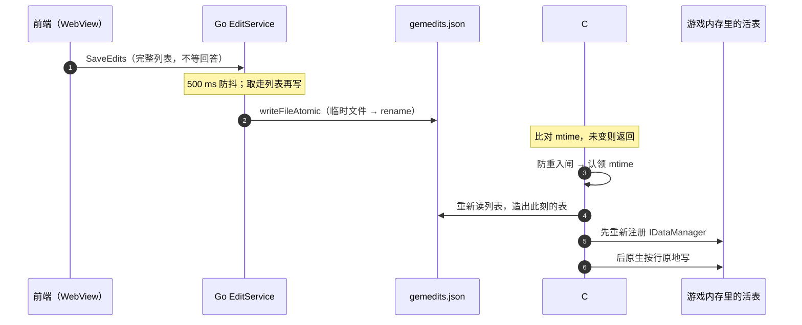
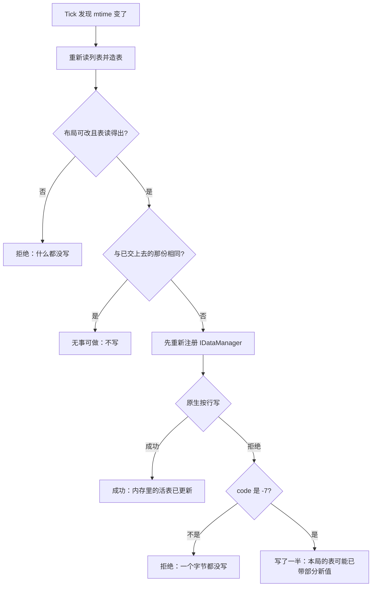

# 因子热应用流程全链路

本项目承重的设计：用户在可视工具里改一个因子，改动落到游戏**已经加载**的那张技能表里，
**不用重启游戏**。

这条流程**刻意避免两半之间做协商**。Go 侧往一个**它自己算出来**的目录写文件；
C# 侧轮询那个文件的修改时间，也**自己算出同一个**目录。没有握手、没有事件、没有共享配置。
下面的一切都由这个选择推出来。

## 链条

*一次编辑从可视工具到游戏内存那张活表的完整时序：前端不等待回答，Go 侧防抖后原子写文件，C# 侧靠 mtime 发现并应用。*

1. **前端编辑。** 编辑器维护改动列表，每次由按键驱动的改动都调一次 `SaveEdits`。
   前端从不等待回答，所以它不持有任何"可以回传给它"的状态。
2. **防抖，然后取走列表。** Go 的 `EditService` 替换待写列表并重置一个 500 ms 定时器。
   定时器触发时，`publishLocked` **取走**待写列表（置 `nil`）再写盘。取走而不是读取，
   是"第二次 flush 无事可做"的原因 —— 关闭路径会调 `flushNow`，而它之后才触发的定时器
   找不到东西可发。
3. **原子写入 `gemedits.json`。** 两个 service 都走 `writeFileAtomic`：同目录下唯一的临时文件，
   然后 `rename`。运行中的 mod 会反复读这些文件，而直接截断写会留下一个"读到半截 JSON"的窗口。
   唯一的临时名还让并发的两次保存永远不会共用同一个中转文件，所以半写完的文件
   不可能被 rename 到位。
4. **mod 靠修改时间发现改动。** 宿主调 `SigilEditorFeature.Tick()`。热应用对象还不存在时，
   它重试 `Bootstrap()` —— 数据管理器是可选依赖，可能比本 mod 晚加载。否则它把文件的修改时间
   与上次处理过的那个比较，没变就直接返回。
5. **防重入闸 → 认领 → 应用。** 见下面的顺序性一节。
6. **按此刻磁盘上的配置造表。** `BuildCurrentTable` 重新读编辑列表，所以它交出的就是
   这一拍的文件 —— 可视工具刚写下的那份字节。
7. **先向 `IDataManager` 重新注册，再写原生内存。** 注册很便宜且必须在前，它也是
   "拒写仍可挽救"的原因：如果游戏再次解析那份被送达的文件，那次解析必须看到新值，
   而不是悄悄用旧值重建行。然后一次原生调用把不一样的行原地写到 boot 槽里。

原生侧到达那张表**只有一条路、没有回落**：表槽由语义锚点解析（不写死 RVA），
写之前四道闸全部 fail-closed。实测依据在 `table_slot.cpp` 的注释里。

## 顺序性隐患 —— 最容易被"简化"成 bug 的那部分

**先认领修改时间，再应用，绝不能反过来。** 在 `Bootstrap()` 里，时间戳是在那个
负责建热应用对象并做启动写的 `try` 块**之前**被认领的（`_handledUtc = readingUtc`），
它必须留在那里。如果认领发生在 `finally` 里，就会有一个窗口：定时器回调看到 `_hotApply`
已经非 null，而 `_handledUtc` 还在 `default` —— 它会当场引爆一次应用，与启动写对撞，
而它认领的时间戳随后又被 `finally` 覆盖。

**先认领时间戳，再 `Apply`，不能在后。** 同一条规则出现在 `Tick()` 里，那里的认领
还兼任第二道防重入锁。代价是明说的：**一次失败的 Apply 不会自己重试** —— 它等到文件
再变一次。这是刻意的，代码里记了原因：要让 `Apply` 返回结果并重试，得先想清楚
in-flight 与重试上限是什么。

**让这一拍过去，而不是排队。** 上一次应用还没跑完时，这一拍放行，而且 —— 重要 ——
**不认领这次改动**，好让下一拍接住它。排队被否掉了，理由是它没有意义：那只会把两次应用串起来。

**一个地址，在任何改写之前读取。** 表槽地址由语义锚点在 **`InstallHooks()` 之前**解析，
因为本项目自己的 safetyhook 会改写 `.text`，锚点必须在**没被改写的**字节上匹配。

## 配置路径的身份是不变量，不是便利

`configPath()` 用 `userCfgDir()` 拼出编辑列表的位置，代码把约束直接写明了：
**用 `os.UserConfigDir()` 会是错的** —— 那是 Windows 的 `%APPDATA%`（Roaming），
而 `loadout.json` 已经在 `%LOCALAPPDATA%` 下，C# 那半也从 `LocalApplicationData` 算同一个目录。
**两边各自算出同一个字符串、中间没有任何协商，所以这个计算只允许有一处实现。**
改动任一侧的推导都会静默打断热应用链条 —— Go 侧会继续写一个没人轮询的文件。
这是[跨层数据契约](../reference/cross-surface-contracts.md)最尖锐的形态。

## 拒写意味着什么，以及为什么"什么都不做"是对的

有三种不同的结果会进日志，而且它们**刻意不被合并成一种**：

*热应用的四种出口：只有两种算成功；`-7` 是唯一"内存状态已被部分改变"的情形。*

- **没有可应用的东西。** 表读不出来，或者它的布局不是本构建能改的那种。什么都不写。
  `HasPatchableLayout` 是那道预检：它推出声明的行数，并要求主体能被行大小整除，
  于是一张 2.0 之前的表（36 字节一行）或将来任何一次列变动，**会过不了这道检查，
  而不是静默地写进错误的行或写出行外**。用整除而不是 `8 + 52 * 行数 == 长度` 本身也是刻意的：
  那 8 字节的文件头是任意值，乘法会在 `long` 上回绕，构造出一个能通过检查的行数。
- **无事可做（no-op）。** 造出来的表与本 mod 上次交上去的那份逐字节相同，于是这一拍什么都不做。
  这只是一条捷径 —— 基线未知时（启动那次没产出表）跳过比较，这一拍照常做。选它的理由
  是避免再维护"游戏手里是哪一份"这个第二份事实。
- **原生拒写。** 这一局内存里那张表保留旧值，而表已经重新注册过，所以这次编辑在游戏
  下一次解析或重启后照样生效。**代码把 `-7` 与其它所有码区分开**：`-7` 意味着行写到一半
  崩了，所以这一局的表可能已经带上了部分新值。其它每个码都在写任何一个字节之前就拒绝了。
  把这两者合并成一句话，会掩盖唯一一种"内存状态被改了一半"的情形。

拒写不是一个该被激进重试的错误状态；它是**为"本构建不认识的锚点或布局"设计的退化路径**。

## 故障隔离

明说的规则是：这里的任何失败只记日志，到此为止 —— **一个坏掉的编辑器功能不该把整个 mod 带走**。
`Tick` 用 `catch` 包住 `Apply` 并记日志，`finally` 释放防重入闸。`Bootstrap` 的 catch
明确区分两半 —— 热应用对象到底建起来没有，因为如果没建起来，编辑器这一整局都不工作，
而只有一行日志会说出来。

卸载也做了防护：宿主那条定时器不保证回调已经跑完，所以 `Dispose` 之后 `HotApply` 会检查
停止标志、拒绝再动游戏内存，而 `SigilEditorFeature.Dispose` 清掉引用，让迟到的 tick
连叫起一次应用都做不到。

## 效果到底在哪里可见

250 ms 的 tick 间隔**不是这个功能的延迟预算**：数值要到下一场战斗才开始生效。
它换掉的是一条永久阻塞在 `WaitOne` 的线程加一个内核事件对象 —— 两者现在都没了。
发布配装在战斗内的行为、以及项目为什么要在那一刻自己重建角色状态，实现与实测写在
`selection_store.cpp` 的轮次闸注释里。
