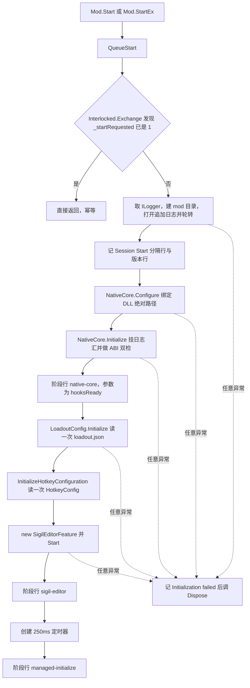
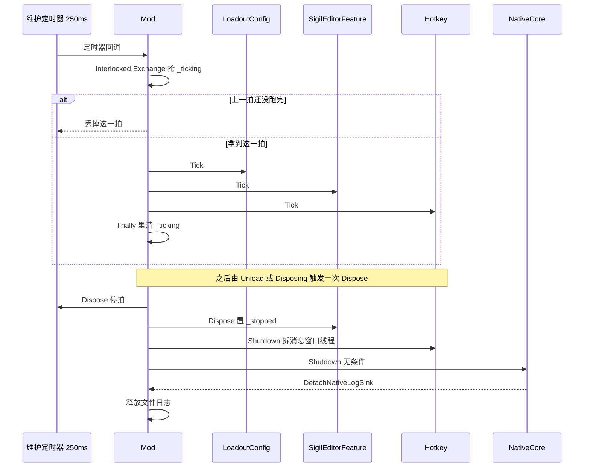
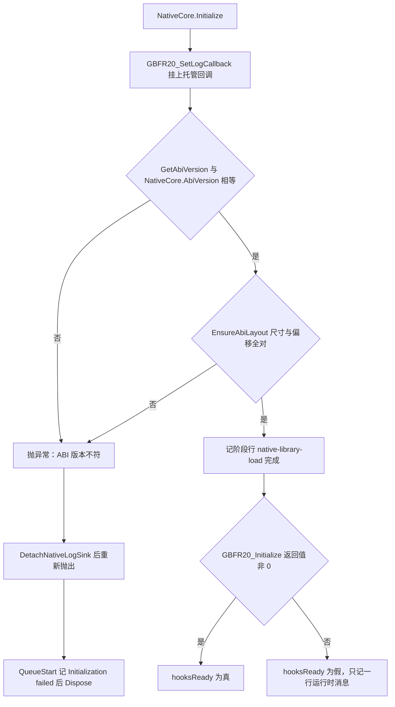

# 托管 mod（C# Reloaded 外壳）

`GBFR.SigilLoadout.dll` 是三个交付物里唯一不直接改游戏内存的一个：它没有 overlay UI、没有输入捕获、没有预设存储，也没有 Overlay Broker——原生核心自己经 SafetyHook 装钩子，并自动套用内置模板配装。这层外壳只做四件事：**承载宿主生命周期**、**驱动一拍 250ms 的维护循环**、**转发日志**，以及**读两个由可视工具写下的 JSON**（见 [系统总览](/openwiki/architecture/overview.md) 与 [宿主与依赖边界](/openwiki/integrations/host-and-dependencies.md)）。

它自己也不持有任何游戏侧事实：不缓存地址、不扫内存、不维护按角色的槽表，所以这一半没有"缓存失效"这个概念。状态归属表在 [系统总览](/openwiki/architecture/overview.md)，原生侧的容量与配对规则见 [虚拟槽位、模板因子与专属开关](/openwiki/concepts/virtual-slots-and-exclusives.md)。

| 托管侧单元 | 职责（一句话） |
| --- | --- |
| `Mod` | 唯一的 `IMod` 实现：幂等启动、阶段日志、创建维护定时器、幂等关停 |
| `NativeCore`（`NativeCore.cs`） | 原生核心门面：DLL 路径绑定与解析、日志汇、ABI 握手、初始化/关停、运行时消息回读、两次 ABI 调用 |
| `NativeCore`（`NativeCore.Interop.cs`） | 只放 P/Invoke 声明、两个跨 ABI 结构体，以及 `EnsureAbiLayout` 的布局自检 |
| `LoadoutConfig` | 把 `loadout.json` 映射成 ABI 结构并推进原生模板表；不读数据文件、不持有表 |
| `SigilEditorFeature` | 把 `sigiledits.json` 变成整张 `skill_status` 表，注册给数据管理器并让原生就地写入活表 |
| `UserConfig` / `FileStamp` | 用户配置目录与两个文件名的唯一推导处；两个特性共用的 mtime 版本门 |
| `Configurator` / `Configurable<T>` / `HotkeyConfig` | `IConfiguratorV3` 配置页连接器与热键那一份配置（本 mod 自己裁过的 `Configurable` 基类） |
| `Hotkey` | `RegisterHotKey` 消息线程，以及注册失败时的 250ms 轮询回退；生命周期由 `Mod` 掌握 |

ABI 导出面的语义（每个导出做什么、拒绝码含义、原生侧生命周期）不在本页：[原生核心（C++ DLL）](/openwiki/architecture/native-core.md) 与 [skill_status 表与活表写入闸门](/openwiki/concepts/skill-status-table.md) 是它们的权威；本页只讲托管侧**怎么用它**。

## 1. 生命周期入口：`IMod` 的六个成员

启动器只认这几个入口，它们全部落在 `Mod` 一个类里：

| 成员 | 实现 | 说明 |
| --- | --- | --- |
| `Start(IModLoaderV1)` | `=> QueueStart(loader, null)` | 版本号缺失，日志里就会写成 `v?` |
| `StartEx(IModLoaderV1, IModConfigV1)` | `=> QueueStart(loader, config?.ModVersion)` | 版本号直接取参数，**不重读** `ModConfig.json` |
| `Unload()` | `=> Dispose()` | 与 `Disposing` 属性同一个幂等实现 |
| `Disposing` | `=> Dispose` | 进程拆卸时启动器经由它收尾 |
| `CanUnload()` | `=> false` | 原生钩子没法安全卸下，所以不向启动器承诺这个能力 |
| `CanSuspend()` / `Suspend()` / `Resume()` | `false` / 空 / 空 | `Suspend`/`Resume` 的注释写明"不会被调"；说 `true` 等于承诺一个不存在的暂停语义 |

`QueueStart` 的第一条语句就是幂等闸：

```csharp
if (System.Threading.Interlocked.Exchange(ref _startRequested, 1) != 0)
    return;
```

启动器有 `Start` 与 `StartEx` 两个入口，重入会多出一个维护定时器（`_tickTimer` 被后者覆盖，前一个再也没人 Dispose）。这个闸把"启动恰好发生一次"变成托管侧自己的不变量，而不是对启动器的假设。

## 2. `QueueStart`：阶段顺序、阶段日志与失败路径

启动是一条固定顺序的链，**定时器排在最后**——所以在定时器存在之前，维护拍不可能与启动工作重叠：



启动链的顺序、四个阶段行，以及"任何一步抛异常都转 `Dispose`"这一条失败路径。

### 阶段日志是显式契约

计时在 `QueueStart` 与 `NativeCore` 各有一段，格式统一由 `NativeCore.StartupPhaseLine` 拼出：

```text
Startup phase=<name> state=complete|failed elapsed_ms=<n>.
```

阶段名依次是 `native-library-load`（DLL 加载与 ABI 握手，归 `NativeCore`）、`native-core`（`GBFR20_Initialize` 的返回值就是 `hooksReady`）、`sigil-editor`、`managed-initialize`（整条 `QueueStart`）。实现只有一处，是因为第一个阶段归 `NativeCore`、其余由 `Mod` 消费（`CompleteStartupPhase` 只是把计时与名字交给它）。

**钩子没装成不算启动失败**：`hooksReady == false` 时只额外记一行 `Native core loaded without hooks: <消息>`（消息来自 `NativeCore.GetRuntimeMessage`），然后照常继续。理由是因子编辑器与原生核心无关——它只读归档、改写 `skill_status` 行，钩子成没成都照样启动。这也是"降级、可诊断、不带走游戏进程"这条全局约定在托管侧的第一处落点。

### 启动行的信息量

会话分隔行 `======== Session Start yyyy-MM-dd HH:mm:ss ========` 与紧随的 `GBFR Sigil Loadout v<ModVersion> (ABI <NativeCore.AbiVersion>)` 是跨会话日志里唯一的"新一次运行从这里开始"记号（文件是追加写的，见第 5 节）。`ABI` 那个数字复用 `NativeCore.AbiVersion` 常量，不另抄一份字面量。

## 3. 维护拍：250ms、单飞标志、三个阶段的次序

`System.Threading.Timer` 以 `dueTime = period = 250` 创建，每拍按固定次序调三个阶段：

| 次序 | 阶段 | "让过去"为什么是正常的 |
| --- | --- | --- |
| 1 | `LoadoutConfig.Tick(Log)` | 版本门 `Changed()` 直接认领，没变就返回，不改任何状态 |
| 2 | `_sigilEditor?.Tick()` | 未接上数据管理器就只重试 `Bootstrap`；`Pending` 不通过就返回 |
| 3 | `Hotkey.Tick(Log)` | `RegisterHotKey` 已成功时第一行就返回；否则只是采样 `GetAsyncKeyState` |



一拍的三阶段次序，以及关停时拆除所有托管侧资源、最后无条件调 `NativeCore.Shutdown`。

三条必须记住的约定：

1. **定时器回调不串行。** 上一拍没跑完，下一拍就会进来。代码用一个 `_ticking` 单飞标志（`Interlocked.Exchange`）统一把重叠的拍丢掉，而不是让每个阶段各防一遍——因为三个阶段本来就把"让过去"当正常情况。新增阶段时，它会继承这条语义：**不能假设自己每 250ms 一定被调到一次**。
2. **整拍外面套 catch-all。** `try { 三个阶段 } catch { } finally { 清标志 }`：维护拍绝不能把进程带走。于是阶段内部的失败只能靠自己的日志说话，不会升级成异常——单次失败因此被隔离在阶段内部（`LoadoutConfig` 记 `Invalid loadout.json; kept previous configuration`、`SigilEditorFeature` 记自己那几行、`Hotkey` 只是不再采样），不会有任何一条失败路径跳过清理或升级成启动失败。
3. **250ms 只是投递节奏，不是量。** 数值要到下一场战斗才生效（术语见 `CONTEXT.md` 的"可见"），因子编辑那条路还用 5s 节流与 mtime 门（见第 7 节）。这个数字换掉的是一条阻塞在 `WaitOne` 的线程和一个内核事件对象。

## 4. `Dispose`：拆除次序与"无条件关停"

`Dispose` 由 `_disposed` 保护，重复调用无副作用，次序固定：

1. `_tickTimer?.Dispose()` 并置 null——先断掉拍；
2. `_sigilEditor?.Dispose()` 并置 null——它只置 `_stopped`（见下）；
3. `Hotkey.Shutdown()`——拆消息窗口线程；
4. **无条件** `NativeCore.Shutdown()`（自身异常安全，异常被吞）；
5. 在 `_logLock` 里释放 `_fileLog` 并置 null。

第 4 条的理由写在代码里，也是这个类里最容易被"顺手改回去"的一处：`Initialize` 一旦返回，原生 DLL 已经加载、日志回调已经挂上、钩子可能已经装好，此后的每一步（阶段日志、`LoadoutConfig.Initialize`、热键配置、因子编辑器构造）都可能抛异常把控制权交给 `Dispose`。以前这个调用被一个"全都成功之后才置位"的标志门着，于是**失败路径会把原生钩子留在游戏里**。现在它不依赖任何成功标志——这正是 fail-closed 在托管侧的另一半：不确定的时候宁可关掉。

因子编辑器那条拆解是弱化的：`SigilEditorFeature.Dispose()` 只做 `Interlocked.Exchange(ref _stopped, 1)`。原因是宿主的定时器不保证在 `Dispose` 返回时回调已经跑完，而 `Apply` 开头会读这个标志，已卸载就不再往游戏内存里写（见第 7 节）。

## 5. 日志：两个汇、一条行、一轮转

托管侧没有自己的日志系统，只有一处 `Log(string)`，它同时写两个汇，且**两个汇各自 fail-soft**：

| 汇 | 形态 | 失败时 |
| --- | --- | --- |
| 文件 | `mod目录\GBFR.SigilLoadout.log`，追加写、`AutoFlush = true` | 异常被吞（文件日志绝不能影响 mod 生命周期） |
| 启动器 | `ILogger.WriteLine`（`loader.GetLogger()`） | 异常被吞（外部日志器出错同样不影响生命周期） |

行格式是 `[HH:mm:ss.fff] [GBFR Sigil Loadout] <消息>`，其中 `LogTag` 是面向玩家的显示名前缀（`ModId` 保持技术性）。`_logger` 与 `_fileLog` 都只在 `_logLock` 里被读写，所以 `Log` 可以从任何线程（定时器线程、热键线程、原生回调）安全调用。

文件那一侧的规则：

- 位置在 **mod 目录**（惯例、好找），而那个目录每次更新会被整份替换——所以日志是"随更新丢掉"的，不是要保留的状态；
- **单份上限 4 MiB**：打开之前先看现有文件长度，超了就删掉旧的 `.1`、把当前份改名成 `.1`（只留一代）。轮转失败被 catch 掉——最坏情况只是这份日志继续变大；
- 因为文件跨会话追加，**每次运行的第 1 行**（`Session Start`）是唯一的会话边界记号。

原生日志也落进同一个汇，但那是托管侧主动接的线：`NativeCore.Initialize` 把 `Log` 存成 `_nativeLogSink`，原生的 `GBFR20_SetLogCallback` 回调经 `ForwardNativeLog` 加 `Native: ` 前缀转发进来（细节见第 6.4 节）。

`Dispose` 之后 `_fileLog` 已被置 null，所以再写日志时文件那一半是空操作（不是"写进已释放的 writer"），启动器那一半照旧尝试、失败被吞。

## 6. `NativeCore`：最小原生核心门面

这个 `internal static unsafe partial class` 分两个文件：`NativeCore.cs` 是门面逻辑，`NativeCore.Interop.cs` 只放 `DllImport` 声明、两个跨 ABI 结构体，以及布局自检。它派生自的那份原始实现里所有 selector / inventory / preset / input / present API 都已删除——**导出映射就是下面这七个，一个不多**：

| `DllImport` 声明 | 在门面里的用途 |
| --- | --- |
| `GBFR20_GetAbiVersion` | `Initialize` 的版本握手 |
| `GBFR20_SetLogCallback` | 挂上/摘掉原生日志回调（`IntPtr`，托管侧自己用 `Marshal.GetFunctionPointerForDelegate` 取函数指针） |
| `GBFR20_Initialize` / `GBFR20_Shutdown` | 原生核心生命周期 |
| `GBFR20_CopyRuntimeMessage` | `GetRuntimeMessage` 的两段式回读（`sbyte*` + `uint` 长度） |
| `GBFR20_ApplyLoadout` | 通用槽数组 + 专属开关数组各带一个 `uint` 计数 |
| `GBFR20_WriteSkillStatusTable` | `WriteSkillStatusTable` 的 `fixed` 指针封装 |

三条刻意的约定：

- **库名只有一个来源。** 每个声明的 `DllImport(LibraryName)` 用的都是 `LibraryName = "GBFR.SigilLoadout.Native.dll"` 这个常量，与 `Configure` 拼绝对路径、`ResolveLibrary` 认的名字同源；声明上带 `ExactSpelling = true` 与 `CallingConvention = Cdecl`（对应 `native_api.h` 的 `GBFR20_CALL`），没有 `.def` 文件，也没有 `EntryPoint` 重命名。
- **两个跨 ABI 结构体都标 `Pack = 1`**，与 `native_api.h` 的 `#pragma pack(push, 1)` 对应。`ExclusiveOverrideNative` 在托管侧把三个保留字节写成 `Reserved0..2` 三个字段（C# 声明不了 `uint8_t reserved[3]`）：偏移断言只到 `Disabled` +0x08，而**尺寸 0x0C 正是这三个字段补出来的**。
- **数组参数交给封送器**：`ApplyLoadout` 把托管数组与 `(uint)数组长度` 一起交出去，空的一半传 `null` + 0（语义见 6.5 节）。

### 6.1 DLL 路径绑定与解析

原生 DLL **不**走启动器的 native 通道：`ModConfig.json` 的两个 `ModNativeDll*`（32 位与 64 位）都是空串，所以启动器不会加载它；这一层自己按绝对路径 `mod目录\GBFR.SigilLoadout.Native.dll` 调 `NativeLibrary.Load` 加载：

- `Configure(modDirectory)` 只做两件事：算出绝对路径存进 `_libraryPath`，以及**一次**注册 `NativeLibrary.SetDllImportResolver`（`Interlocked.Exchange(ref _resolverConfigured, 1)`）。已经绑定到**另一个**路径再调一次会抛 `InvalidOperationException`——这条闸判的是"同一个进程里这份门面只服务一个 mod 目录"。
- `ResolveLibrary` 只认 `LibraryName` 这一个名字，命中后缓存 `_libraryHandle`（后续 P/Invoke 复用）；`_libraryPath` 为空或文件不存在时抛 `DllNotFoundException`，消息里带路径。

实际加载发生在第一次 P/Invoke（即 `Initialize` 里的 `GBFR20_SetLogCallback`），所以"原生 DLL 缺失/被换掉"的后果被收在 `NativeCore.Initialize` 里：**mod 照常加载，只是钩子装不上**，日志有那一条 `Initialization failed:` 与 `native-library-load` 的 `state=failed`。

### 6.2 `Initialize` 的顺序与失败语义

```csharp
GBFR20_SetLogCallback(Marshal.GetFunctionPointerForDelegate(NativeLogCallbackProc));
uint abiVersion = GBFR20_GetAbiVersion();
if (abiVersion != AbiVersion) throw new InvalidOperationException(...);
EnsureAbiLayout();                    // 尺寸 + 逐字段偏移
log(StartupPhaseLine("native-library-load", ..., true));
return GBFR20_Initialize() != 0;      // 返回值就是 hooksReady
```



ABI 握手的两道闸与它们的失败落点：任一检查不符就抛异常，于是整套原生钩子不装。

三个值得留意的次序细节：

- **日志回调排在最前**，所以 ABI 失败时"为什么没装成"已经能经原生日志汇回到托管侧日志（原生侧自己的诊断行也从此可见）。
- 阶段行只在**布局检查通过之后**才记 `state=complete`；异常路径若尚未记完成行，会补一条 `state=failed`。这样"原生库加载"这一步在日志里永远有且只有一条结论。
- 失败时 `DetachNativeLogSink()` 会先把回调摘掉再重新抛出，避免一个指向托管侧、可能已被回收的委托继续留在原生侧。

### 6.3 ABI 尺寸 + 偏移双检：为什么两样都要

`NativeCore.AbiVersion = 20` 与原生返回的版本号（`native_api.h` 的 `GBFR20_ABI_VERSION`）比对，只挡得住"加载到旧 DLL"。真正跨过 ABI 的是**封送器写出去的字节**，所以 `EnsureAbiLayout` 再对拍一遍：

| 结构体 | 期望尺寸 | 逐字段偏移 |
| --- | --- | --- |
| `TemplateSlotNative` | `0x18` | `GemId` +0x00、`Skill1` +0x04、`Skill1Level` +0x08、`Skill2` +0x0C、`Skill2Level` +0x10、`SigilLevel` +0x14 |
| `ExclusiveOverrideNative` | `0x0C` | `CharacterHash` +0x00、`SkillHash` +0x04、`Disabled` +0x08 |

三个刻意的取舍：

- **用 `Marshal.SizeOf` 而不是 `sizeof`**：要验证的是封送器实际会写多少字节，那才是跨 ABI 的东西。
- **尺寸之外还要偏移**：六个 32 位字段里 `GemId` 与 `Skill1` 对调之后照样是 `0x18` 字节，而"字段按这个次序对应"才是这份 ABI 的全部内容。
- **版本不符与尺寸不符同样处理**：都抛异常 → 整套钩子不装（fail-closed）。版号挡不住"两边被同时改错"，而后者才是结构体错位最可能发生的方式。

字段名用 `nameof` 传进 `AssertOffset<T>`：字段改名时这里跟着改，不会退化成一句"这个字段不存在"的报错。这一条与 `native_api.h` 的 `static_assert` 一一对应，但**没有任何构建或测试门禁钉住这一对**（见第 9 节）。

### 6.4 日志汇与运行时消息回读

- `_nativeLogSink` 是 `Action<string>`，与 `_logger`/`_fileLog` 一样受锁保护；`ForwardNativeLog` 加 `Native: ` 前缀后调用它，整段包在 try/catch 里——**诊断回调绝不能让异常展开回原生钩子代码**。
- 回调委托由 `static readonly` 字段 `NativeLogCallbackProc` 持有不回收：委托被 GC 之后，原生就在调一个已释放的函数指针。
- `DetachNativeLogSink` 只在 `_libraryHandle != IntPtr.Zero` 时才 `SetLogCallback(IntPtr.Zero)`（进程拆卸期间原生模块可能已经不在了），然后清空 sink；`Shutdown` 用 `try/finally` 保证无论 `GBFR20_Shutdown` 成不成都会摘回调。
- `GetRuntimeMessage` 是两段式回读：先问所需长度（含结尾 NUL），`<= 1` 视为空串，超过 64 KiB 截断，然后填充缓冲区返回 UTF-8 字符串。它只服务一个用途——`hooksReady == false` 时把原生那句"为什么"记进启动日志。

### 6.5 两个 ABI 调用的托管侧契约

这一层只做形状转换，**两半 `null` 的语义是契约的一部分**：

- `ApplyLoadout(TemplateSlotNative[]?, ExclusiveOverrideNative[]?)`：`null`/空表示"这一半不要"。没有通用槽 = 只用内置模板；没有专属开关 = 专属全开。两半合成一次调用（两半都收尾于原生同一个"重新发布表"步骤）。`LoadoutConfig` 的三种输入情形（无文件、空槽位数组、有槽位）全靠这条语义区分。
- `WriteSkillStatusTable(byte[])`：把整张表经 `fixed` 指针交出去，返回值 `>= 0` 是真正改写的行数、`< 0` 是拒绝码。托管侧**不解释**拒绝码的含义（权威在 `native_api.h`），只记"被拒 + 码"。

调用的语义与闸门细节见 [原生核心（C++ DLL）](/openwiki/architecture/native-core.md) 与 [skill_status 表与活表写入闸门](/openwiki/concepts/skill-status-table.md)；`LoadoutConfig` 那条链见 [工作流：配装从界面到游戏状态](/openwiki/workflows/loadout-apply.md)，因子编辑那条链见 [工作流：因子数值编辑与热应用](/openwiki/workflows/sigil-edit-apply.md)。

## 7. 两个配置读取特性的职责划分

托管侧读两个文件，两个特性共用同一套地基，但**职责与版本门语义刻意不同**：

| | `LoadoutConfig` | `SigilEditorFeature` |
| --- | --- | --- |
| 输入 | `%LOCALAPPDATA%\GBFRSigilLoadout\loadout.json` | `%LOCALAPPDATA%\GBFRSigilLoadout\sigiledits.json` |
| 形态 | `static` 类，无实例状态 | 实例，持有 `IModLoader` / `IDataManager` 与当前表 |
| 唯一职责 | 载荷 → ABI 结构映射，再调 `NativeCore.ApplyLoadout` | 编辑列表 → 表字节 → 注册给数据管理器 + 原生就地写入活表 |
| 校验责任 | 只做形状校验（JSON 坏、缺技能 hash、负等级、启用槽超过 `MaxSlots`）；不判"选得对不对/有没有超上限" | 只挑 `(Key, Level)` 匹配的行；不改 Key、不猜等级语义 |
| 版本门 | `FileStamp.Changed()`：**认领后处理**，成败都算处理过 | `FileStamp.Now()` + `Pending()` + `MarkApplied()`：**确认生效后才推进** |
| 失败之后 | 保留上一份有效配置，等下一次保存改 mtime | 那一版还欠着，下一拍再来（同版本按 5s 节流、只报一次） |
| 启动那次 | `Initialize` 里过一遍同一道门 | `Bootstrap` 造表后走 `TryApply`，与热应用同一条 `Publish` 路径 |

为什么两种门都要存在，是这一页最该记住的一条：

- `LoadoutConfig` 是**单次应用**：失败时内存里还留着上一份有效配置，"这一版处理过了"是合理的说法，于是 `Changed()` 当场认领最省事——同一份坏配置每 250ms 重试一次只会把同一个报错灌满日志。错误原因照常报，去重靠"版本变了才说"。
- `SigilEditorFeature` 的失败是**一个字节都没写**：原生拒写时所谓"上一份"并不是一份可用的新配置，认领等于宣告编辑已生效——编辑会静默丢失且不再重试。所以判据只在 `Publish` 里原生**确实改写了行**之后才由 `MarkApplied` 推进。`FileStamp` 把"取 mtime + 比对 + 认领"收在一处，正是为了让"先认领、再干活"不可能被写反。

`FileStamp` 与 `UserConfig` 的其他约定（`NoFile` = 1601-01-01 与初值 0001-01-01 不同，于是"删了文件"是一版真实的变更；1 MiB 上限；两道门的完整流程图；两个文件的成员级契约）见 [两个配置文件与跨语言常量契约](/openwiki/concepts/config-file-contracts.md)。这里只补三条**托管侧**的推论：

- **文件不存在是一条真实答案，不是错误。** `LoadoutConfig.TryApply` 在 `mtime == UserConfig.NoFile` 时调 `ApplyLoadout(null, null)` 恢复内置模板并**提前 return**——少了这个 return 就会落到后面的读取上，`new FileInfo(...).Length` 必抛，每局多一条假的"保留上一份"。因子编辑那条路把"列表被删掉"读成空列表，于是把未编辑的表发布回去（撤销全部编辑）。
- **这三个跨语言常量都住在 `LoadoutConfig.cs`**：`MaxSlots = 12`（只数启用的槽；视觉工具与 Go 各自还有一处声明）、`DefaultLevel = 15`（载荷漏写 `level` 时的回落）、`UnwornCharacterHash = 0x887AE0B0`（副技能"未选择"的哨兵，原生 `native_internal.h` 另有一处）。三组都由 `SigilLoadout/sharedconstants_test.go` 对拍——值漂了不会编译失败，只会表现成"存盘成功、游戏里什么都没变"或槽位错位。
- **这两个文件有意不实现任何 Reloaded 配置接口**：那会让启动器多出一个渲染不了列表的 "Mod configuration" 窗口。所以 `Config` 是纯数据（数据形状与成员名见 [两个配置文件与跨语言常量契约](/openwiki/concepts/config-file-contracts.md)），而热键那份配置走另一套（第 8 节）。

`LoadoutConfig` 的映射本身只认一种形状：`slots[].items[0]` 是因子（`gem` → `GemId`、`hash` → `Skill1`、`level` → 同时写 `Skill1Level` 与 `SigilLevel`），`items[1]` 可选（`hash` → `Skill2`、`level` → `Skill2Level`）；没有副技能时 `Skill2` 填上面那个哨兵、等级 0。`exclusive` 只把值为 `false` 的项变成 override（"没说"就是"开着"），外层键解析不成角色 hash 就记一行 `exclusive: '…' is not a character hash; ignored.` 并忽略——PL 码是可视工具显示用的标签，不是这里的身份。

`SigilEditorFeature` 的生命周期完全寄生在宿主上：它没有自己的日志、配置目录、文件监听或调度器，状态推进由 `Mod` 的维护拍驱动——未接上 `IDataManager` 时每拍重试 `Bootstrap`（只在第一次没拿到时说一句），并且**构造与启动不受 `hooksReady` 影响**。它自己的 `Dispose` 只置 `_stopped`，因为宿主的定时器回调不保证已经跑完；`Apply` 每次开头读这个标志，已卸载就不再动游戏内存。这条"卸载之后还可能有一拍"的风险由共享的并发约定兜住，见 [并发、锁序与生命周期守卫](/openwiki/concepts/threading-and-locks.md)。

那条确认生效后才推进的版本门还配了三处细节，缺一个就会退化成"每 250ms 白干一遍"或"用新版本号标记旧内容"：

- **拒写留下候选**：原生返回 `< 0` 时把这一版建好的表存进 `_retryTable`/`_retryTableStamp`，同一版本重试直接复用它，不必再从归档重建（328 KB 读 + 逐行比较）；
- **逐字节相同的捷径**：新表与已发布的那份相同时什么都不做，但会 `MarkApplied`——内存里已经是这一版的字节，这一版确实处理完了；不标记的话 `Pending` 永远为真，而这条捷径又让 Tick 的"同版本"节流条件失效；
- **版本号必须先取**：`Bootstrap` 在读取列表与建表**之前**取 mtime，建完表再复查一次；反过来就会拿 T4 的版本号去标记 T1 的内容（内存里是旧内容而编辑静默丢失），中途变了就什么都不写、也不推进版本，交给下一拍。

## 8. 热键配置装配与回退

热键那一份配置是托管侧唯一走 Reloaded 配置页的东西：

- `Configuration/Configurator.cs` 实现 `IConfiguratorV3`，只暴露一个条目 `HotkeyConfig`（`Configurations[0]`），`TryRunCustomConfiguration()` 返回 `false`——启动器按属性表渲染，没有自定义窗口。`Migrate` 是**空实现**：这份配置只有一个文件、路径每次都由启动器传进来，没有要搬的状态。
- `Mod.InitializeHotkeyConfiguration` 自己 `new Configurator(loader.GetModConfigDirectory(ModId))` 取 `VirtualKey`，然后 `Hotkey.Configure(modDirectory, virtualKey, Log)`。注意这里有**两份对象、两次读盘**：启动器那一份只用于渲染与保存，托管这一份只为拿一个整数。
- 任何异常（目录无效、文件读不出来、强转失败）都落到同一句日志：`Hotkey configuration unavailable: …; falling back to the default F1 hotkey.`，然后以 `OverlayHotkey.F1` 配置。fallback 的路径与正常路径**共用同一个 `Hotkey.Configure`**，所以"配置页坏了"不会让热键消失。

`HotkeyConfig` 自己就是这份配置的形状：`FileName = "HotkeyConfig.json"`、`ConfigurationName = "Hotkey / 快捷键"`，唯一的用户可见属性 `MenuHotkey` 带 `[DefaultValue(OverlayHotkey.F1)]` 且初值就是 F1；`OverlayHotkey` 只列 F1..F12 与 Insert / Delete / Home / End（后四个带 `[Display(Name = …)]`，因为启动器表格按枚举名显示）。文件路径不写在类里：`Configurator` 用启动器给的 `ConfigFolder` 调 `HotkeyConfig.FromFile(...)`，基类 `Configurable<TParentType>.ReadFrom` 在文件不存在时 `new` 一个默认实例，并把路径与 `Save` 回调装回对象——所以"第一次启动"与"文件在"是同一个形状，而保存只是把该路径用带 `JsonStringEnumConverter` / `WriteIndented` 的 `SerializerOptions` 写回去。

`HotkeyConfig.VirtualKey` 是这一层最容易看漏的一处：

```csharp
[JsonIgnore]
[Browsable(false)]
public int VirtualKey =>
    Enum.IsDefined(typeof(OverlayHotkey), MenuHotkey) ? (int)MenuHotkey : (int)OverlayHotkey.F1;
```

它是派生值，同时挡在 JSON 和启动器表格之外（`[JsonIgnore]` / `[Browsable(false)]`）；取值范围在这里判，是因为 `Configurable.SerializerOptions` 带 `JsonStringEnumConverter`，手改文件里写任意整数都会被收下。取值不在 `OverlayHotkey` 里就回落 F1。

两条运行期约定：

1. **热键只读一次，运行期不再改键。** `Hotkey.Configure` 起一条后台线程建 message-only 窗口并 `RegisterHotKey`，由 `Mod.Dispose` 拆掉，所以它有意不留重入路径。`Configuration/Configurable.cs` 是本 mod 自己裁过的基类：`ConfigurationUpdated` 被实现成永不触发的空操作（官方模板那套运行期热重载已删），因此配置页里"修改实时生效"的描述与源码不一致、改热键要重启游戏——这一条在 [宿主与依赖边界](/openwiki/integrations/host-and-dependencies.md) 有完整对照表。
2. **250ms 轮询只是回退。** `RegisterHotKey` 成功时 `Hotkey.Tick` 第一行就返回；只有注册失败（键被占用、消息窗口建不出来）才由维护拍采样 `GetAsyncKeyState`。按键到工具窗口的完整时序见 [工作流：热键呼出/收起可视工具](/openwiki/workflows/hotkey-summon.md)。

## 9. 工程与依赖边界

`GBFR.SigilLoadout.csproj` 里几项会实际影响行为的设置：

| 设置 | 后果 |
| --- | --- |
| `TargetFramework = net8.0-windows`、`AllowUnsafeBlocks = true` | 前者决定了启动器必须带 .NET 8 运行时；后者只服务于 `NativeCore.Interop.cs` 的指针封送 |
| `Reloaded.Mod.Interfaces 2.5.0`，`ExcludeAssets="runtime"` | 接口类型由启动器在运行期提供，**不随包发布**：托管程序集只有 `GBFR.SigilLoadout.dll` 自己（`bin\Release` 与 `dist\GBFR.SigilLoadout` 里都没有这两份接口 DLL） |
| `gbfrelink.utility.manager.Interfaces 1.2.0`，`ExcludeAssets="runtime"` | 数据管理器的接口同理；仓库里没有它的源码或程序集，所以"控制器未注册时 `GetController<T>()` 返回空弱引用还是抛异常"在本仓库内看不到（明确的验证缺口，见 [宿主与依赖边界](/openwiki/integrations/host-and-dependencies.md)） |
| `EnableSourceLink=false`、`IncludeSourceRevisionInInformationalVersion=false`、刻意不写 `<Version>` | 发布 DLL 的元数据里不留 VCS 信息（`build-release.ps1` 给 Go 加 `-buildvcs=false` 是同一个理由）；`ModConfig.json` 的 `ModVersion` 是版本号的唯一权威源，`csproj` 不再造第二处，发布脚本会拿它与 `-Version` 参数、前端 `package.json` / `package-lock.json` 逐处对拍 |
| 通配 `..\SigilLoadout\assets\*` 与 `Link` 原生 DLL | 打包用的就是本工程的输出目录，所以随包资产与原生 DLL 靠这里拷进去（`assets\` 只被可视工具读，托管侧不读） |

两条与"验证"有关的实情，改动前必须知道：

- **托管侧（C#）没有测试工程。** 仓库的自动化测试集中在可视工具那一侧（Go 的 `SigilLoadout/*_test.go`、前端测试）与 C++ 的 `tests/NativeLayoutHarness`（离线跑原生布局解析与 fail-closed）；C# 这一半的正确性靠运行期日志与人工验证，门禁只覆盖"构建通过"（`tools/build-release.ps1` 跑 `dotnet restore/clean/build`）。
- **`NativeCore.AbiVersion` 与 `GBFR20_ABI_VERSION` 这一对没有门禁。** 托管侧的 `20` 是一处字面量，原生侧的 `20` 是另一处；发布脚本的门禁覆盖版本号的多处对拍、随包文件清单、`sigils.json` 的新鲜度与离线布局回归，但没有任何脚本或测试比对这两个数。它俩漂了只会在运行期表现成 `ABI mismatch` → 钩子不装（fail-closed，游戏照常）。改 ABI 必须同时改 `native_api.h`、`NativeCore.AbiVersion`、`EnsureAbiLayout` 的期望尺寸与偏移，以及 `NativeCore.Interop.cs` 里的结构体字段顺序。

## 10. 改这里之前的检查清单

- **在维护拍里加阶段**：新阶段必须能把"这一拍被丢掉"当正常情况（mtime 门不认领、热键只是采样），否则它要自己防重叠；也别忘了整拍的 catch-all 意味着阶段里的异常只会变成一行日志。
- **加启动阶段**：用 `NativeCore.StartupPhaseLine` 记一行 `Startup phase=…`，阶段名要唯一——这些行是排障时唯一的时序证据；能让启动失败的东西要落在 `QueueStart` 的 try 里，不要新增一条绕过 `Dispose` 的退出路径。
- **动 `Dispose`**：不要把 `NativeCore.Shutdown()` 重新门到任何"成功"标志后面；也不要指望 `SigilEditorFeature` 的 `_stopped` 之外还能拦住定时器线程。
- **动 ABI**：见第 9 节末尾那一串同时要改的地方；`EnsureAbiLayout` 的期望值就是 `native_api.h` 的 `static_assert`。
- **新增一个配置文件**：路径必须经 `UserConfig.FilePath` 推导、版本门必须用 `FileStamp`，并把常量加进 `SigilLoadout/sharedconstants_test.go` 的对拍清单——两侧算同一个字符串而没有任何协商点是这条协议最贵的性质。
- **写日志**：一律经 `Mod.Log`（它同时写文件与启动器、两个汇都 fail-soft）；不要在持有 `_logLock` 的路径上重入 `Log`。
