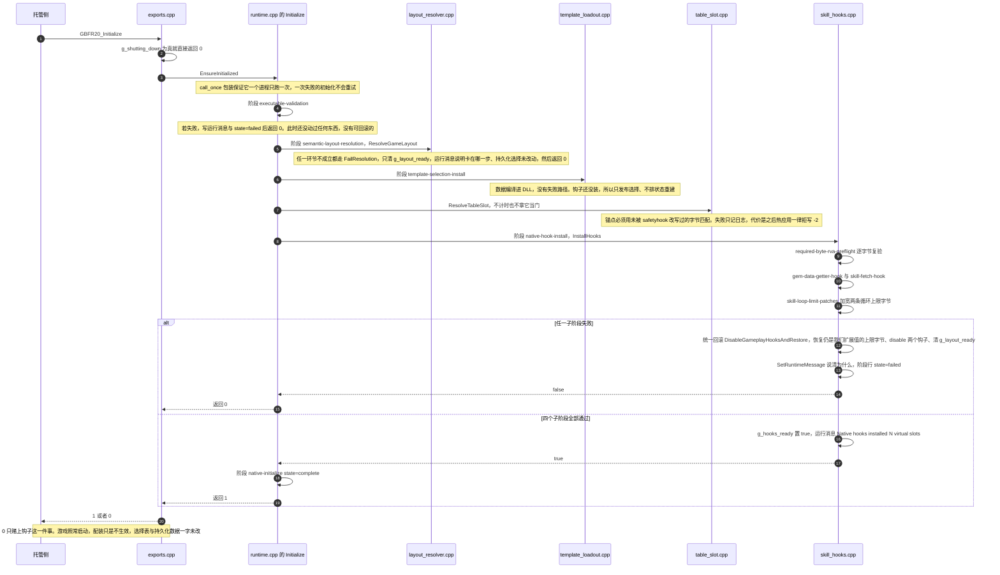
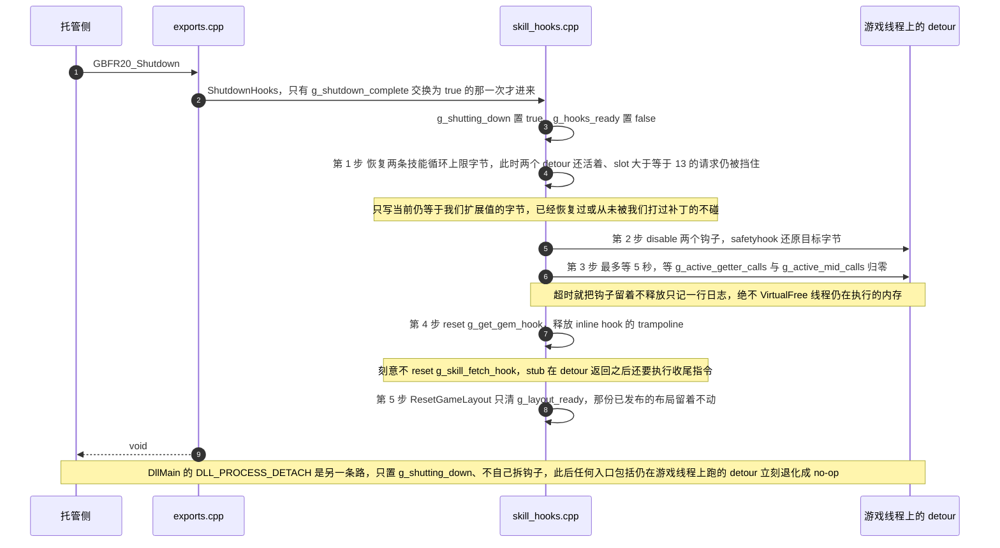

# 原生核心（C++ DLL）

`GBFR.SigilLoadout.Native.dll` 是这套 mod 里唯一直接改游戏内存的单元。它由 [托管 mod](/openwiki/architecture/managed-mod.md) 在游戏进程内**自己加载**（下文「宿主与构建期依赖」），此后两者之间**只有一条通道**：`native_api.h` 里的 ABI v20 导出。

它拥有这些东西，托管侧一件都不持有：

| 原生侧拥有的状态 | 说明 |
| --- | --- |
| 模板表（`g_runtime_templates`）与选择表（`g_character_selections`） | 虚拟槽位读什么因子、每个角色选哪些槽，都只在这里 |
| 活表的发布槽（`table_slot.cpp` 的 `g_slot_rva`） | 托管侧既不持有也不扫描游戏那份 `skill_status` 的地址，只把整张表交给原生 |
| 语义布局（`g_game_layout`）与两个 gameplay hook | RVA 与钩子从锚点解出、由原生安装；托管侧没有第二份地址常量 |

分工的其余部分（钩子怎么把虚拟槽塞进游戏状态、表布局与写入闸门、锚点怎么认出来）各有专门页面：[游戏侧注入运行期](/openwiki/workflows/skill-injection-runtime.md)、[skill_status 表与活表写入闸门](/openwiki/concepts/skill-status-table.md)、[语义锚点与布局解析](/openwiki/concepts/game-layout-anchors.md)。本页只讲**这个 DLL 自身的结构、契约与生命周期**。

## 宿主与构建期依赖

原生 DLL **由托管侧自己在游戏进程内加载**：`NativeCore.Configure(modDirectory)` 给托管程序集装上一个 `DllImport` 解析器，把 `GBFR.SigilLoadout.Native.dll` 的查找路径钉在 mod 目录上（同一个进程里改绑到别的路径会直接抛异常），真正的 `NativeLibrary.Load` 发生在第一次 P/Invoke 上——`NativeCore.Initialize` 的第一句就是 `GBFR20_SetLogCallback`；句柄缓存下来，重复解析只是返回它。`ModConfig.json` 的 `ModNativeDll32` / `ModNativeDll64` 两栏都是空串，所以它**不走 Reloaded-II 的「原生 DLL 字段」**，逐字段后果见 [宿主与依赖边界](/openwiki/integrations/host-and-dependencies.md) 与 [系统总览](/openwiki/architecture/overview.md)。

这条「谁加载」的选择有一个直接后果：**加载与校验是同一段托管代码**。`GBFR20_GetAbiVersion` 的版本比对与 `EnsureAbiLayout` 的尺寸/偏移对拍排在加载之后、`GBFR20_Initialize` 之前，任一项不符就抛异常、整套钩子不装（fail-closed）；原生侧自己不做任何版本协商，它把契约违例一律表达成「拒绝值 + 一行日志」——这正是下面 `GuardAbi` 那条规则存在的理由。

### 编译输入与仓库外的生成器

`vcxproj` 的 `ClCompile` 只有十二项：`src\` 下十个 `.cpp`（`dllmain` / `exports` / `runtime` / `runtime_state` / `layout_resolver` / `table_slot` / `skill_hooks` / `template_loadout` / `selection_store` / `safe_game_access`）加两份 vendored 源码 `third_party\safetyhook.cpp` 与 `third_party\Zydis.c`（以 `CompileAs` C 编）；另有四个 `ClInclude`（`native_api.h`、`native_internal.h` 与两份 vendored 头），它们不属于编译输入。没有包管理器、没有要还原的外部依赖：safetyhook 与 Zydis 都是随仓库带进来的源码，`third_party` 只是加进 `AdditionalIncludeDirectories`。两处警告抑制是给这两份第三方源码开的——`safetyhook.cpp` 关掉 4834（丢弃 `[[nodiscard]]` 返回值），`Zydis.c` 关掉 4201（无名 struct/union 的非标准扩展）。语言标准是 `stdcpplatest`，另有 `/utf-8 /Zc:threadSafeInit` 与 `MultiProcessorCompilation`。

两个配置（Debug / Release）都定义 `GBFR20_NATIVE_EXPORTS`（决定 `GBFR20_API` 展开成 `dllexport` 还是 `dllimport`），也**都以 `/EHa`**（`ExceptionHandling=Async`）编译——「阶段体抛异常能被记成一条失败行」与 SEH 包裹的安全访问这两条路都以它为前提。

构建期还有一处**仓库之外**的边界。vcxproj 末尾的 `GenerateExclusiveTable` target 排在 `ClCompile` 之前（工程文件里这一段还带两处解释性注释，说明 `Inputs`/`Outputs` 的意义与 `Touch` 的理由；下面只保留 target 的实质内容）：

```xml
<Target Name="GenerateExclusiveTable" BeforeTargets="ClCompile"
        Inputs="$(MSBuildProjectDirectory)\..\..\gen\main.go;$(MSBuildProjectDirectory)\..\..\gen\game\sigils\exclusive.go;$(MSBuildProjectDirectory)\..\..\gen\game\sigils\sigils.go;$(MSBuildProjectDirectory)\..\..\gen\game\sigils\json.go;$(MSBuildProjectDirectory)\..\SigilLoadout\assets\sigils.json"
        Outputs="$(MSBuildProjectDirectory)\src\exclusive_table.inc;$(MSBuildProjectDirectory)\..\SigilLoadout\assets\sigils.chara.json">
  <Exec Command="go run . exclusive -mod &quot;$(MSBuildProjectDirectory)\..&quot;" WorkingDirectory="$(MSBuildProjectDirectory)\..\..\gen" />
  <Touch Files="$(MSBuildProjectDirectory)\src\exclusive_table.inc;$(MSBuildProjectDirectory)\..\SigilLoadout\assets\sigils.chara.json" />
</Target>
```

`$(MSBuildProjectDirectory)` 是原生工程目录，所以 `WorkingDirectory` 的 `..\..\gen` 与 `-mod` 指向的仓库根都在**仓库旁边**：`gen` 是一个独立 Go 工程，不在本仓库里。

这个 target 带 `Inputs`/`Outputs`，**只在源比产物新时才跑**（产物缺一个也一样会跑——新克隆必然缺 `.inc`）：

| | 内容 |
| --- | --- |
| `Inputs` | `..\..\gen\main.go` 与 `..\..\gen\game\sigils\` 下的 `exclusive.go` / `sigils.go` / `json.go`，加仓库内的 `..\SigilLoadout\assets\sigils.json`。MSBuild 不展开这里的通配符，所以只能逐条列文件 |
| `Outputs` | `src\exclusive_table.inc`（**不入库**：`.gitignore` 明确列了它，构建中间产物）与 `..\SigilLoadout\assets\sigils.chara.json`（**入库**、随包发布） |

target 尾部那个 `Touch` 是给这套增量判断补的一步：gen 在内容没变时不写文件，产物 mtime 于是永远落后于源、MSBuild 会一直判过期——`Touch` 只推两个产物的时间戳，不动内容。

后果分三层：

- **专属表唯一的真源在仓库外。** 角色 → T1 / T2 / 战气三个槽的 gem 与技能全部由 gen 产出（一个 Go 工程），本仓库里没有任何生成脚本；改数据要去改 gen 的 `game\sigils\exclusive.go`，手改 `src\exclusive_table.inc` 下一次编译就没了。同一条命令还重写随包的 `sigils.chara.json`，所以两份产物的待遇不同（`.inc` 不必提交、`.chara.json` 必须提交），细节见 [外部生成器 gen 与随包数据资产](/openwiki/integrations/external-generator-and-assets.md)。
- **这一步必须真的跑成功。** `src\exclusive_table.inc` 被 `template_loadout.cpp` 直接 `#include` 编成 `kCharacterExclusives`，没有它连编译都过不去；缺 `gen`（那个 `Exec` 连工作目录都不存在）或缺 Go 工具链时，这里只有 `go run` 的原始报错，编译就此中断。
- **头文件与它无关。** 两个头文件里没有任何需要生成的东西：ABI 头与内部布局都得手改。

## ABI v20 导出面

导出面的全部内容就是 `native_api.h`。没有 `.def` 文件：`GBFR20_API` 在编译期展开为 `extern "C" __declspec(dllexport)`（vcxproj 两个配置都定义 `GBFR20_NATIVE_EXPORTS`），调用约定统一是 `GBFR20_CALL` = `__cdecl`。下表逐个导出写清参数、返回值语义与「异常跨边界时的兜底值」，签名就是那份头文件里的声明，一个不多、一个不少：

| 导出 | 参数 | 返回值语义 | 抛出时的兜底 |
| --- | --- | --- | --- |
| `GBFR20_GetAbiVersion` | 无 | 常量 `GBFR20_ABI_VERSION`（= 20），无状态 | 不抛，也不经 `GuardAbi` |
| `GBFR20_SetLogCallback` | `GBFR20_LogCallback callback` | 存进 `g_log_callback`（一次原子 store）；`nullptr` 即卸载回调 | 不抛，也不经 `GuardAbi` |
| `GBFR20_Initialize` | 无 | 1 = 钩子装好；0 = 没装成（关机中也是 0） | `GuardAbi` 拒绝值 `0` |
| `GBFR20_Shutdown` | 无 | `void`：置标志、回滚字节、拆钩子，幂等 | 同样走 `GuardAbi`（`void` 上的拒绝值只为统一形状） |
| `GBFR20_CopyRuntimeMessage` | `char* buffer, uint32_t buffer_size` | 返回所需长度（含结尾 NUL）；`buffer` 为 `nullptr` 或大小为 0 时只问长度 | `GuardAbi` 拒绝值 `0`（当作「没有消息」，它本身只是诊断信息） |
| `GBFR20_ApplyLoadout` | `const GBFR20_TemplateSlot* slots, uint32_t slot_count, const GBFR20_ExclusiveOverride* overrides, uint32_t override_count` | 1 = 应用；0 = 拒绝 | `GuardAbi` 拒绝值 `0` |
| `GBFR20_WriteSkillStatusTable` | `const uint8_t* table, uint32_t length` | `>= 0` = 实际改写的 52 字节行数（0 = 内存里已经是这些字节）；`< 0` = 拒绝码 -1..-7 | `GuardAbi` 拒绝值 `GBFR20_TABLE_WRITE_FAILED`（-7） |

ABI 版本号是 20，并且是**派生出来的**：这个 mod 的原始版本里 `selector` / `inventory` / `preset` / `input` / `present` / `state` 那些 API 已全部删除，活下来的就是上表这七个。专属开关以 **skill hash** 传递而不是槽位号，所以托管侧不需要按角色维护一张 T1/T2/战气对照表——那张表（`src/exclusive_table.inc`）在原生侧编译进来。槽位模型的完整说明见 [虚拟槽位、模板因子与专属开关](/openwiki/concepts/virtual-slots-and-exclusives.md)。

### 边界异常守卫（`GuardAbi`）与 noexcept 的取舍

`extern "C"` 的契约里没有"异常"这一项，所以一个 `throw` 跨出边界就是 `std::terminate`，直接带走游戏。`exports.cpp` 里的 `GuardAbi` 把所有可能抛的导出收在一处：

```cpp
template <typename Fn, typename T>
T GuardAbi(const char* what, T refusal, Fn&& body) noexcept {
    try {
        return body();
    }
    catch (...) {
        Log(std::format("{}: threw; reported as a refusal.", what));
        return refusal;
    }
}
```

四条推论，改这份代码时必须记住：

- **会抛的内部实现不能标 `noexcept`。** `template_loadout.cpp` 的 `ApplyLoadout`（以及 `SetRuntimeMessage`）会抛——`std::format` / `std::string` / 加锁都可能失败。`native_internal.h` 里对这两者刻意**不**标 `noexcept`，因为标了之后 `throw` 会在函数出口先变成 `std::terminate`，`GuardAbi` 根本来不及接。
- **每个导出的拒绝值各自取"最保守"的那个。** `GBFR20_Initialize`、`GBFR20_ApplyLoadout` 与 `GBFR20_CopyRuntimeMessage` 用 `0`；`GBFR20_WriteSkillStatusTable` 用 `GBFR20_TABLE_WRITE_FAILED`（-7），因为它是唯一"写之后"的码（表可能只更新了一部分），把"守卫兜住了异常"报成 -7 比报成"一个字节都没动"的码安全。
- **守卫不是每个导出的统一外壳。** 只有会抛的那些才进 `GuardAbi`；`GBFR20_GetAbiVersion` 返回一个常量、`GBFR20_SetLogCallback` 只做一次原子 store，两者都不可能抛，所以没有被包裹。
- **反过来，不抛或自己兜住的路径就标 `noexcept`。** 这一侧的清单是 `Log`、`safe_game_access.cpp` 的各读取（`SafeReadUint64` / `SafeReadStatusIdentity` / `SafeCopyToOutput` / `ReadByte` / `IsGameRange` / `DecodeRipTarget` / `SafeInvokeStatusRebuild`）、`WriteSkillStatusTable`、`TryGetRuntimeSlot`、`ApplySkillLoopLimits`、`ResetGameLayout`。这条区分不是风格：它决定了"异常到不到得了 `GuardAbi`"——`ApplyLoadout` 与 `SetRuntimeMessage` 会抛，所以**必须留着不标**。

守卫覆盖的不只是返回值的那些导出：`GBFR20_Shutdown` 是 `void`，它同样走 `GuardAbi`（拒绝值在 `void` 上无意义，只是为了统一形状）。

还有一个兜底在 `skill_hooks.cpp` 的 `StartupPhase`：析构即报 `state=failed`，所以阶段体抛异常（工程按 `/EHa` 编译，分配失败会抛）时，栈展开也会留下"崩在哪个阶段"的日志。上报由调用点显式 `Succeeded()` 触发，不靠析构兜——忘了调，析构报出来的 `false` 就是一条**假的失败**，比缺一行更难查。

### 跨 ABI 的类型 vs 不跨 ABI 的内部布局

`native_api.h` 只声明**真正跨过边界**的东西，这不是排版习惯：

| 类型 | 在哪 | 为什么 |
| --- | --- | --- |
| `GBFR20_TemplateSlot`（0x18）、`GBFR20_ExclusiveOverride`（0x0C） | `native_api.h`，`#pragma pack(push,1)` + `static_assert` | 托管侧按这两个形状封送；字段**次序**就是这份 ABI 的全部内容 |
| `GemData`（0x24） | `native_internal.h` | 这是**游戏自己那份**结构的布局，没有任何导出函数收发它。原先挂在 `native_api.h` 里，会让读那份"ABI 契约"的人误以为它跨边界 |
| `ResolvedGameLayout`、`TemplateGemSlot`、`CharacterTemplate`、`StatusIdentity` | `native_internal.h` | 原生内部地址簿与运行时容器；随游戏构建变化的是它们，不是 ABI |

分界的实际后果：改 `GemData`（游戏更新、字段变了）要重做锚点与预检，但**不必**动 ABI 版本；改 `GBFR20_*` 就必须两边同时改。`native_internal.h` 用 `static_assert` 把 `TemplateGemSlot` 的尺寸与 `gem_id` / `skill1` 偏移钉在 `GBFR20_TemplateSlot` 上——ABI 路径只经 `reinterpret_cast` 读，从不写回调用方内存。

`GBFR20_ExclusiveOverride` 的语义有个容易忽略的约定：调用方**从不发** `disabled == 0` 的条目，所以"没出现的角色"就是三个专属槽全开；而 `skill_hash` **就是名字**，原生侧拿它去专属表里认 T1 / T2 / 战气。

托管侧对同一条契约的检查是双重的，缺一不可：`NativeCore.AbiVersion` 与原生返回的版本号比对（只挡得住"加载到旧 DLL"），再加 `NativeCore.Interop.cs` 里 `EnsureAbiLayout` 对两个结构体的**尺寸与逐字段偏移**对拍（与 `native_api.h` 的 `static_assert` 一一对应）——六个 32 位字段里 `gem_id` 与 `skill1` 对调之后照样是 0x18 字节，而"字段按这个次序对应"才是契约。任一项不符就抛异常 → 整套钩子不装（fail-closed）。

### `GBFR20_ApplyLoadout` 的契约

一次调用带两张调用方持有的表，`nullptr` / 计数 0 表示"这一半没有"：没有通用槽 = 只剩内置专属模板；没有 overrides = 专属全开。合成一个调用而不是两个，是因为两半都收尾于同一个"重新发布表"步骤（v17 拆成两个导出时，同一张表会被发布并打印两遍）。

网关都在 `ApplyLoadoutEntry` 里，任一不成立都以 0 报告失败：

1. **计数上界**：`slot_count <= kVirtualSlotCapacity`（24）、`override_count <= kRuntimeTemplateCapacity * 3`（96）。上界不是形式——下面按调用方的计数逐个读那两块内存，而专属开关没有自己的容器大小可依，一个凭空来的计数会一路读到调用方数组之外。
2. 关机中（`g_shutting_down`）拒绝。
3. `EnsureInitialized()` 后要求 `g_hooks_ready`——钩子没装好，应用配装没有意义。

进了 `ApplyLoadout` 之后，超容量的通用槽是**截断而不是拒绝**（拒绝会让整份配置连其余槽位一起失效），但必须打一行日志让它可见，否则症状只是"某几个槽位静默不生效"。它由托管侧的维护拍（250ms tick）调用，见 [工作流：配装从界面到游戏状态](/openwiki/workflows/loadout-apply.md)。

### `GBFR20_WriteSkillStatusTable` 的契约与拒绝码

返回值 `>= 0` 是真正被改写的 52 字节行数（0 = 内存里已经是这些字节），`< 0` 是拒绝码。它与 `ApplyLoadout` 的门不一样：**刻意不要求 `g_hooks_ready`**——写的是数据管理器供给的那张表，与钩子装没装成无关，而 `ResolveTableSlot` 本来就排在装钩子之前。关机中返回 `GBFR20_TABLE_NOT_READY`。

| 拒绝码 | 含义 |
| --- | --- |
| `GBFR20_TABLE_NOT_READY` (-1) | 原生核心没初始化好，或正在关机 |
| `GBFR20_TABLE_SLOT_UNRESOLVED` (-2) | 启动时锚点没解析出槽 |
| `GBFR20_TABLE_BUFFER_UNREADABLE` (-3) | 槽里没有指针，或那块内存不可写 |
| `GBFR20_TABLE_ROW_COUNT_INCONSISTENT` (-4) | 首 `u64` 与传入表的行数不符：不是同一张表 |
| `GBFR20_TABLE_LENGTH_UNEXPECTED` (-5) | 传入长度不是 `8 + 52*行数` |
| `GBFR20_TABLE_IDENTITY_MISMATCH` (-6) | 逐行 `Key` 对不上：不是同一张表 |
| `GBFR20_TABLE_WRITE_FAILED` (-7) | 写的时候崩了；表可能只更新了一部分 |

**只有 -7 是"写之后"的码**，其余每一道闸拒写时一个字节都不动。闸的顺序与码一一对应：长度不成整行的表在第一道就报 -5 → 槽要在启动时解出（-2）→ 槽里的指针非空（-3）→ 整段内存已提交且可写（-3）→ 缓冲区的行数与传入表一致（-4）→ 逐行 `Key` 也一致（-6，"这是同一张表"因此是可验证的事实而不是对锚点的信任，也是 Key 被别的 mod 改过的表会被拒写而不是被覆盖的原因——编辑碰的从来不是 Key）。每个码的人话解释只有 `exports.cpp` 的 `SkillStatusRefusalReason` 一处，托管侧只记"被拒 + 码"。

槽这一侧还有一个设计选择：锚点解出的是**槽首 RVA**，缓冲区指针就在槽 `+8`，而每次调用都重新读它、不缓存地址——游戏重新解析并发布新缓冲区之后，下一次调用自动跟上，所以这里不存在"缓存失效"这个概念（指针为空时就是 -3，而不是写到一个过期地址）。

拒写**只在码变化时报一次日志**：静态 `last_refusal` 原子量记住上一次报过的码，同一种拒写不再重复，成功过一次就清零（下一次拒写值得再报）。理由是实际噪声——拒写每 5 秒重试一次，而游戏把那张表读进内存之前必然一直是 -3，逐字相同的消息实测 3 行只差时间戳。

## Initialize 的阶段链与失败即回滚

`GBFR20_Initialize` 只回一个比特"钩子装没装成"，但它背后是一条分阶段的链，每段失败各有自己的落点。参与方与顺序如下：



初始化时序：每一阶段的成功路径，以及失败时的回滚落点——失败只关掉钩子这一件事，游戏照常启动。

各阶段的落点：

- **executable-validation**：路径解析不到、或文件名不是 `granblue_fantasy_relink.exe`（`_wcsicmp`，大小写不敏感）就退出。这是唯一对外部环境做校验的阶段，也是唯一一个**没有任何东西需要回滚**的阶段——它排在一切副作用之前。
- **semantic-layout-resolution**：`ResolveGameLayout()` 失败走 `FailResolution`——`ResetGameLayout()` 只清 `g_layout_ready`（不动那份已发布的结构体），写一条运行消息说明"钩子未安装、持久化的因子选择未被改动"，然后返回 0。整条链上**没有第二处**可以改游戏字节。
- **template-selection-install**：装内置模板与默认选择，失败路径不存在（数据是编译进来的），阶段行固定为 `complete`。此处钩子还没装，所以 `PublishTemplateSelections` 只发布选择、不排状态重建。
- **ResolveTableSlot**：刻意排在 `InstallHooks()` **之前**——safetyhook 会改写 `.text`，而槽发布锚点要用没被改写的字节匹配。它成功与否只影响热应用能否写活表（失败 = 之后只会拒写 -2），所以失败只记日志、不拿它当门。**表槽与钩子的成败因此互相独立**：钩子装好了而槽没解出来（或反过来）都是合法结局，前者只让热应用持续拿 -2。
- **native-hook-install**：见下。

### InstallHooks 的四个子阶段与统一回滚

`InstallHooks` 内部还有四个各自计时的子阶段：`required-byte-rva-preflight`（`RevalidateGameLayout`，逐字节复验解析结果）、`gem-data-getter-hook`、`skill-fetch-hook`、`skill-loop-limit-patches`（两条循环上限字节的加宽）。四条失败路径全部走同一个 lambda：`DisableGameplayHooksAndRestore()` + `SetRuntimeMessage(为什么)` + 返回 `false`。成功才置 `g_hooks_ready` 并写运行消息 `Native hooks installed: N virtual slots.`。

`DisableGameplayHooksAndRestore()` 就是这一层唯一的回滚实现，它只回滚"已经做出去的事"：恢复仍是我们扩展值的上限字节、`disable()` 两个钩子、排空在途调用、`reset()` inline hook，最后 `ResetGameLayout()`；一个钩子都没装时它只清那两个标志，所以四条失败路径可以共用它而不必各自判断。

两条上限字节的写入是**事务式**的：先记下 apply 字节原来那个值，写第二个字节失败时回滚到**它原来的值**而不是游戏出厂值——调用方在失败时会把 `g_virtual_slot_count` 恢复成上一次的计数，写回 13 会留下"计数说还有 N 个虚拟槽、apply 字节说 13、category 字节还是上一次的展开值"这种自相矛盾的状态（一条循环会越过 13 格数组）。回滚的那一侧（`DisableGameplayHooksAndRestore` 里的 `restore_limit`）**只写当前仍等于我们的扩展值的字节**：已经恢复过、或从未被我们打过补丁的字节不碰——回滚不能把别人写进去的值当成自己的。

## 关闭与拆卸顺序



拆卸与关停的顺序：每一步都是为了让下一步不会踩到还在执行的内存；`GBFR20_Shutdown` 走完整拆卸，`DllMain` 只留下"进程要没了"这个信号。

顺序上的两个讲究，都是"换个顺序就会崩"的那种：

- **先恢复上限字节，再拆钩子。** 两个 detour 活着时，`slot >= 13` 的请求仍被它们挡住；先拆钩子会留下一段窗口，让原始那个只有 13 格的 getter 被问到 slot 13+N，读到数组边界之外。
- **只 `reset()` inline hook，不 reset mid hook。** `ActiveCallGuard` 只包住 detour 的函数体，而 safetyhook 的 stub 在它返回之后还要跑收尾指令——计数器先归零，`reset()` 就会 `VirtualFree` 掉线程仍在执行的那几页。`disable()` 已经还原目标字节，留几页到进程退出是安全的。

各自的幂等与触发方：

- `GBFR20_Shutdown` 用 `g_shutdown_complete.exchange(true)` 保证 `ShutdownHooks` 只跑一次，所以托管侧可以无条件调用（见 [托管 mod](/openwiki/architecture/managed-mod.md) 里 Dispose 无条件 `Shutdown` 的意图）。
- `DllMain` 在 `DLL_PROCESS_DETACH` 里**只置 `g_shutting_down`**，不自己拆钩子；`DLL_PROCESS_ATTACH` 里只 `DisableThreadLibraryCalls`。这个标志是"进程要没了"的第一手信号，让此后任何入口（包括还在游戏线程上跑的 detour）立刻退化成 no-op。
- `Initialize` 用 `std::call_once`，所以**它只跑一次**：一次失败的初始化不会重试，之后 `GBFR20_Initialize` 只会把同一个结果（0）再报一遍。

## 运行期状态量

| 状态量 | 谁写、什么时候 | 读者与语义 |
| --- | --- | --- |
| `g_image_base` | `Initialize` 第一行 `GetModuleHandleW(nullptr)` | 所有 RVA 的解析基准；为 0 时一切解析快速失败 |
| `g_initialize_once` | `EnsureInitialized` 的 `std::call_once` | 保证 `Initialize` 只跑一次 |
| `g_game_layout` / `g_layout_ready` | `ResolveGameLayout` 成功时先赋值、再 release store `true`；`ResetGameLayout` 只清标志 | 读者用 acquire。失败或拆卸时**不清结构体**：已发布的布局在进程余下时间不变，清空它会与"刚在关机/回滚前读到上一份真状态"的读者相争 |
| `g_hooks_ready` | `InstallHooks` 成功置 `true`；回滚与 `ShutdownHooks` 置 `false` | `GBFR20_Initialize` 的返回值、`ApplyLoadout` 的前置、`SafeInvokeStatusRebuild` 的前置 |
| `g_shutting_down` | `DllMain` 的 DETACH 与 `ShutdownHooks` | 所有入口的第一道闸：`Initialize` 直接 0、`ApplyLoadout` 直接 0、`WriteSkillStatusTable` 返回 -1、两个 detour 返回 0 而不是转发 |
| `g_shutdown_complete` | `GBFR20_Shutdown` 的 `exchange` | 关停幂等 |
| `g_virtual_slot_count` | 初值 `kBuiltinExclusiveSlotCount`（3）；由 `ApplyLoadout` 发布 | `GetVirtualSlotCount` / `GetExpandedInternalSlotCount`（= 13 + 虚拟槽数），detour 用它给扩展槽设闸 |
| `g_log_callback` | `GBFR20_SetLogCallback`（一次原子 store，拆卸时由托管侧置 0） | 日志桥 |
| `g_message_mutex` / `g_runtime_message` | `SetRuntimeMessage` | `GBFR20_CopyRuntimeMessage` 回读；初始值 `"Waiting for initialization."` |
| 表与钩子 | `g_template_mutex` + `g_runtime_templates`、`g_selection_mutex` + `g_character_selections`、`g_get_gem_hook`、`g_skill_fetch_hook` | 并发与锁序见 [并发、锁序与生命周期守卫](/openwiki/concepts/threading-and-locks.md) |
| detour 在途计数 | `ActiveCallGuard` 读写 `g_active_getter_calls` / `g_active_mid_calls`；TLS 快照 `g_tls_*` | 拆卸时排空；TLS 用来保证"一次构建用同一套槽位" |

**虚拟槽计数的发布顺序**是一条不变量：`ApplyLoadout` 先把新计数 store 进 `g_virtual_slot_count`，再拓宽游戏的两条循环上限字节，因为 detour 按这个计数给虚拟槽设闸，它必须已经与游戏线程下一轮循环看到的补丁一致；上限字节写失败就把计数回滚成上一次的值。

## 每个翻译单元一行职责

「谁拥有哪份全局状态」与「谁负责哪类游戏交互」在这份代码里是同一个划分：**一个关注点一个 `.cpp`，它的全局量就定义在那个文件里**（`native_internal.h` 只放 `extern` 声明与跨文件契约）。改东西时先按这张表找文件：

| 翻译单元 | 它拥有的东西 |
| --- | --- |
| `dllmain.cpp` | 只有 `DllMain`：ATTACH 时 `DisableThreadLibraryCalls`，DETACH 时置 `g_shutting_down`；不拆钩子、不含别的逻辑 |
| `exports.cpp` | 七个导出的壳、`GuardAbi`、`SkillStatusRefusalReason`（拒绝码的人话只有这一份）、`ApplyLoadoutEntry` 的三道入口闸 |
| `runtime.cpp` | 阶段链的编排：`Initialize` 按顺序调用各阶段并逐个计时上报，`EnsureInitialized` 的 `std::call_once`。它**不定义任何状态** |
| `runtime_state.cpp` | 全部进程级全局量（`g_image_base`、三个就绪/关闭标志、`g_log_callback`、运行消息、`g_virtual_slot_count`）与三个基元 `Log` / `CompleteStartupPhase` / `SetRuntimeMessage` |
| `layout_resolver.cpp` | PE 视图（`TryBuildImageView` / `TryGetCodeSection` / `IsInWritableImageSection`）、锚点模式与预检字节表（含 `MatchesBytes` 的调用点）、`ResolveGameLayout` / `RevalidateGameLayout` / `ResetGameLayout` 与 `FailResolution` |
| `table_slot.cpp` | 活表发布槽的锚点与 `g_slot_rva`、`ResolveTableSlot`、`WriteSkillStatusTable` 的 -1..-7 闸顺序与逐行写 |
| `skill_hooks.cpp` | 两个 detour（`GetGemDataByIndexDetour` / `OnSkillFetch`）、在途计数与 TLS 构建快照、`InstallHooks` 的四个子阶段、两条循环上限字节的写入与条件式还原、`ShutdownHooks` / `DisableGameplayHooksAndRestore` |
| `template_loadout.cpp` | 模板表 `g_runtime_templates` + 专属开关 `g_exclusive_state` + 下标表、`ApplyLoadout`（计数发布顺序、截断、两半合一的发布）、内置选择填充与 `PublishTemplateSelections` |
| `selection_store.cpp` | 选择表 `g_character_selections`、队伍/轮次记录（`g_latest_context1_status`、pass_id）与热重建的节流/冷却 |
| `safe_game_access.cpp` | 游戏内存的全部读写与范围判断（见下），外加 `DecodeRipTarget` 这一份共用的 RIP-rel32 解码 |
| `exclusive_table.inc` | 不是手写的代码，而是构建期生成的 `kCharacterExclusives` 一行行数据 |

跨文件依赖只有一个方向：`table_slot.cpp` 复用的 PE 视图助手（`TryGetCodeSection` / `IsInWritableImageSection`）由 `layout_resolver.cpp` 提供——**PE 视图的唯一持有者是 `layout_resolver.cpp`**，别在第二个文件里再解析一遍映像。

顺带一条顺序上的约束：`runtime.cpp` 把 `ResolveTableSlot()` 摆在 `InstallHooks()` 之前是刻意的（表槽锚点要用没被 safetyhook 改写过的字节），所以这两件事的成败互不牵连——钩子没装成不影响拒写码，槽没解出也不影响钩子安装。

## 安全内存访问层（`safe_game_access.cpp`）

**游戏内存的读取与范围判断都归这一个文件，别在别处再写一份。** 它提供两类东西：

- **SEH 包裹的访问**：`safe_game_access.cpp` 的 `SafeReadUint64`、`SafeReadStatusIdentity`、`SafeCopyToOutput`、`ReadByte`、`WriteByte`，加上 `native_internal.h` 里同样以 `__try` 包裹的 `MatchesBytes` / `MatchesBytesAt` 两个字节比对（布局预检与活表锚点都用它们）。失败一律返回 `false`（并把输出清空），而不是把异常放出去。
- **范围闸** `IsGameRange(address, size, required_protect)`：一次 `VirtualQuery` 只答一个区域，而整张表有几十万字节（`8 + 52 × 行数`）、可能跨好几个区域，所以它一个区域一个区域往前走，要求每个区域 `MEM_COMMIT`、非 `PAGE_GUARD`、保护位含所需掩码。仅有的两种用法就是两个掩码常量：`kReadableProtect`（读一个指针字段）与 `kWritableProtect`（写整张表）。

几个必须保持的细节：

- **`MatchesBytes<Size>`（长度来自数组类型）与 `MatchesBytesAt`（运行期长度）不能互换。** 表驱动的预检长度只有运行期才知道，套数组版本会把缓冲尾部垃圾一起比进去——128 字节的预检在真机上永远不匹配。
- **`DecodeRipTarget` 不需要 SEH**：它只做算术与范围判断，读的 4 个字节落在已验证过的代码段里。布局锚点与槽发布锚点共用这一份 `mov r,[rip+d]` / `mov [rip+d],r` 的解码。
- **`WriteByte` 是"写—验"而不是裸写**：`VirtualProtect` 成可写 → 写 → `FlushInstructionCache` → 恢复原保护 → 读回确认值正确。它只用于那两条循环上限字节。
- **`SafeInvokeStatusRebuild` 是本项目唯一会去动游戏活对象的路径。** 调用前校验身份（`character_hash` 匹配、`context_mode` 合法），置 TLS `g_tls_hot_rebuild_build`（让游戏自己的构建窗口不把我们的调用算成新一轮队伍装配），调用后再验身份没变（对象没被重建函数换掉）。它的闸判的是**对象还新不新，不是指针记不记得住**（2026-09-21 的崩溃物证：`ok=0` 之后 20~30 秒 AV，故障点读 `rcx=0`）；失败即由调用方冷却 60 秒。跳过比补刀便宜，细节见 [并发、锁序与生命周期守卫](/openwiki/concepts/threading-and-locks.md)。
- **MSVC 的 C2712 约束塑造了函数切分**：带 `__try` 的函数里不能有需要析构的局部对象，所以日志拼串（`LogRebuildProblem`）、`.text` 扫描（`SearchAnchorWindow`）、逐行 `Key` 比对（`SameRowIdentity`）、逐行写（`WriteChangedRows`）都是独立函数。这些是编译器的硬约束，不是风格偏好。

## 日志桥与运行消息

`Log(message)` 被**声明为 `noexcept` 并真的不抛**，因为所有失败路径与 `catch` 块都在用它：它自己抛出去会顺着 ABI 边界炸掉游戏。它做两件事，各自一个 `try`：

1. 带时间戳前缀 `[HH:MM:SS.mmm] [GBFR Sigil Loadout Native] <message>\n` 写 `OutputDebugStringA`（格式化失败就退化成不带时间戳的原文）；
2. 调用宿主回调 `g_log_callback`，传入的是**不带时间戳的原文** `message`——托管侧自己加 `Native: ` 前缀并落盘。宿主是别人的代码，所以这一份单独兜。

托管侧对这个回调的持有是刻意的：原生日志回调就是一个普通委托，由静态字段持有不回收（委托被回收之后原生就在调一个已释放的函数指针），拆卸时才 `SetLogCallback(IntPtr.Zero)`。

运行消息走 `SetRuntimeMessage`：先 `Log` 再在 `g_message_mutex` 下存一份拷贝（顺序是为了不与其他线程的 store 相争）。回读侧 `GBFR20_CopyRuntimeMessage` 是一个常用尺寸协议——传 `nullptr` / 0 得到所需长度（含结尾 NUL），再按该长度拿内容；缓冲区小时截断到 `buffer_size - 1` 并补 NUL，长度溢出 `UINT32_MAX` 就截到 `UINT32_MAX`。托管侧在原生核心没装成钩子时打印它，这是"为什么没装"的唯一出口。

**阶段行契约**：`CompleteStartupPhase` 统一产出 `Startup phase=<名字> state=complete|failed elapsed_ms=<毫秒>.`。`Initialize` 报 `executable-validation`、`semantic-layout-resolution`、`template-selection-install`、`native-hook-install` 与总括的 `native-initialize`；`InstallHooks` 内部报 `required-byte-rva-preflight`、`gem-data-getter-hook`、`skill-fetch-hook`、`skill-loop-limit-patches`。失败行由调用点显式上报（`StartupPhase::Succeeded(false)` 或 `CompleteStartupPhase` 的 `false`），析构只兜住"阶段体抛异常"那一条路——正因如此"卡住的启动"能靠最后一个完成的阶段定位。这些行的读法归 [日志与故障定位](/openwiki/operations/logging-and-diagnostics.md)。

## 改这份代码时的边界

- **新增或改动导出**要成对改三处：`native_api.h`、`GBFR.SigilLoadout/NativeCore.Interop.cs` 的 `DllImport` 与结构体声明、以及 `EnsureAbiLayout` 的尺寸与逐字段偏移。别忘了 `GBFR20_ABI_VERSION`——但要知道版本号只挡得住"加载到旧 DLL"，挡不住"两边被同时改错"，后者正是结构体错位最可能发生的方式。新导出若会抛，还要在 `exports.cpp` 里选一个最保守的兜底值并把 `GuardAbi` 套上。
- **会抛的内部实现不要标 `noexcept`**（见上文），否则 `GuardAbi` 就成了摆设。
- **布局相关的东西留在 `layout_resolver.cpp`**：预检字节表与偏移表在那里成对出现，`RevalidateGameLayout` 负责逐字节复验；锚点必须在 safetyhook 改写 `.text` 之前解析。
- **别把"全内存扫描"加回 `table_slot.cpp`。** 那一版兜底一次都没跑过，而且它证明不了唯一重要的事——"这块缓冲区就是游戏在用的那块"静态证不出来；拒写的代价只是这一局内存不变（编辑在游戏下一次解析或重启后照样生效），而扫描是 5~6 秒的慢路径。
- **不要给 `GemData` 加导出收发**：它不跨 ABI 是这个文件结构的前提。
- **专属表不在这个仓库里**：要改数据就去改仓库外 gen 的 `game/sigils/exclusive.go`——`src\exclusive_table.inc` 会在下一次编译时被重新生成，直接改它下一次编译就没了；`Inputs`/`Outputs` 只是省掉没必要的重跑，不是把这个依赖变成可选。

## 这份代码被验证到什么程度

唯一的自动化验证是 `tests/NativeLayoutHarness`：它把**生产代码**的 `layout_resolver.cpp` 与 `safe_game_access.cpp` 离线编译（stub 掉 `g_image_base`、`g_layout_ready`、`g_hooks_ready`、`g_game_layout`、`Log`、`SetRuntimeMessage`），把真实 exe 按段映射进内存后断言三件事：`ResolveGameLayout()` 必须成功、`RevalidateGameLayout()` 必须过、把一个 hook 点上的字节翻一位后 `RevalidateGameLayout()` **必须**失败。它刻意不硬编码任何期望地址，也不给 `-Exe` / `GBFR_EXE` 时打 `SKIP` 并以 0 退出，所以这道闸门能在任何机器上跑。

它覆盖不到的部分要诚实记住：ABI 边界本身（托管侧的版本与布局检查在游戏里才执行）、钩子实际落点、活表写入、运行消息，都只能在真机游戏里验证。覆盖面与其余套件见 [验证地图](/openwiki/testing/verification-map.md)。
