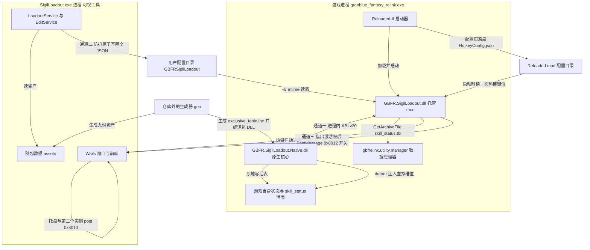

# 系统总览：三个交付单元、三条通道与状态归属

本 mod 的全部交付物是三个二进制加一份随包数据。它们分居两个进程，中间只有三条通道——一条进程内的 ABI、一条跨进程的磁盘契约、一条 Win32 消息。把这三条通道和「谁拥有哪份状态」认清，改动就不会跨错层；本页只讲边界与归属，各单元内部的结构与运行时序在各自的系统页与工作流页。

## 三个单元

| 产物 | 运行时域 | 由谁加载 | 职责（1-2 句） |
| --- | --- | --- | --- |
| `GBFR.SigilLoadout.dll` | 游戏进程内（`granblue_fantasy_relink.exe`） | Reloaded-II（按 `ModConfig.json` 的 `ModDll`） | 薄外壳：驱动 250ms 维护拍、转发日志、承载热键与因子编辑的托管那一半，并经由 ABI 把玩家配置推进原生核心。 |
| `GBFR.SigilLoadout.Native.dll` | 游戏进程内 | 托管 mod 自己（`NativeLibrary.Load`，不走 Reloaded-II） | 原生核心：装钩子让**虚拟槽位**真正进入游戏状态，拥有**模板表**/选择表与**活表**的定位槽。 |
| `SigilLoadout.exe` | 独立进程 | 玩家自己启动，或由托管侧热键 `Process.Start` 拉起 | **可视工具**：读随包数据、把玩家配装与因子数值编辑写成两个 JSON 文件；与上述两者没有任何进程内联系。 |

三个产物装进同一个 mod 目录：`ModConfig.json` 的 `ModDll` 声明托管 DLL 为 `GBFR.SigilLoadout.dll`，同文件的 `ModNativeDll32` 与 `ModNativeDll64` 两栏都是空串——原生 DLL 不是启动器注入的，而是托管侧自己按 mod 目录 `NativeLibrary.Load`（`NativeCore.Configure` 给本程序集装上一个 `DllImport` 解析器，把 `GBFR.SigilLoadout.Native.dll` 的查找路径钉在这个目录上；同一次进程里改绑到别的路径会直接抛异常）；可视工具就是同目录下的 `SigilLoadout.exe`（托管侧按这个文件名在 mod 目录里找它）。

随包数据在 `assets\`，共九份，**只有可视工具按 `exeDir()\assets\` 读它**（外加仓库里的测试）。工具自己也不嵌任何一份：启动时把 `sigils.lang.json`、`chara.lang.json`、`skill_status.json` 与 `skill.zh/en/ja/ko.json` 七份读进内存（这份名单缺一份就弹框说清缺什么然后退出），`sigils.json` 与 `sigils.chara.json` 则每次调用现读——玩家可以替换它们。这个目录的组成由一次发布构建固定：托管工程的输出目录已经带上原生 DLL 与 `assets\`，`tools\build-release.ps1` 再补上工具 exe 与 `icon.png`，删掉托管 PDB、把 `runtimes\` 收到 `win-x64`，并用两道 fail-closed 检查拦住「包里混进旧版 `GBFR.ExtraSigilSlots*` 产物」与「可变配置 `GBFR.SigilLoadoutConfig.ini`/`.pending` 被打进包」，最后逐份检查 13 项必需文件在场。

这份产物目录每次更新都会被整个替换，所以**必须活过更新的玩家配置不落在那里**：`loadout.json` 与 `sigiledits.json` 住在 `%LOCALAPPDATA%\GBFRSigilLoadout`。托管侧另外两处落盘也都不在用户配置目录——日志追加写在 mod 目录（跨会话追加，单份上限 4 MB，超了留一代 `.1`），热键键位由 Reloaded 的配置页写进 mod 配置目录。三个目录的完整分工与生存期见 [宿主与依赖边界](/openwiki/integrations/host-and-dependencies.md)。

组件图：三个交付单元、游戏进程内的宿主与数据管理器、三条通道与三个目录的写者/读者关系，以及仓库外的 gen。

## 三条通道一览

| 通道 | 两端 | 传什么 | 契约的唯一声明处 |
| --- | --- | --- | --- |
| 进程内 ABI v20 | 托管 mod ↔ 原生核心（同一进程） | 版本号、日志、整份玩家配置、编辑后的表、一条运行消息 | `GBFR.SigilLoadout.Native/native_api.h` ↔ `NativeCore.Interop.cs` |
| 磁盘 JSON 契约 | 可视工具（唯一写者）→ 托管 mod（只读） | `loadout.json` 配装、`sigiledits.json` 编辑列表 | C# 的 `UserConfig.FilePath` ↔ Go 的 `userCfgDirName`/`loadoutFileName`/`editListName`，由 `sharedconstants_test.go` 对拍 |
| Win32 窗口消息 | 托管 mod → 可视工具（`0x8012` 开关）；工具 → 自己（`0x8010` 显示、`0x8011` 假隐藏） | 只有命令，**没有任何载荷** | 对拍只钉 `ToolWindowTitle` 与 `0x8012`；`0x8010`/`0x8011` 只在工具那侧声明，没有第二方要跟它对齐 |

## 边界一：ABI v20（进程内）

托管侧与原生核心之间唯一的通道是 `GBFR-Sigil-Loadout.sln` 里两个工程之间的一层 C 导出，声明集中在 `GBFR.SigilLoadout.Native/native_api.h`，托管侧在 `NativeCore.Interop.cs` 里以 `DllImport` + `__cdecl` 一一对应：

| 导出 | 作用 |
| --- | --- |
| `GBFR20_GetAbiVersion` / `GBFR20_SetLogCallback` | 版本握手与日志汇（原生日志经回调转成托管侧日志行）。 |
| `GBFR20_Initialize` / `GBFR20_Shutdown` | 生命周期；钩子成没成以 `Initialize` 的返回值报告（原生侧不抛）。托管侧在调用之前还会做版本与布局检查，那两步失败走异常、整套钩子不装——而且这一次异常会让托管侧整层初始化就此退出（见文末「边界上的失败语义」）。 |
| `GBFR20_ApplyLoadout` | 一次调用套用整份玩家配置：通用槽位 + 逐角色的专属开关。 |
| `GBFR20_WriteSkillStatusTable` | 把编辑后的整张 **skill_status** 表写进游戏自己已解析的那份**活表**；返回值是改写的行数或 `-1..-7` 拒绝码。 |
| `GBFR20_CopyRuntimeMessage` | 回读原生侧那一条运行消息，供托管侧在启动日志里说清为什么没成。 |

这条边界的契约由两道检查兜住，**任一不符就 fail-closed**（宁可不装钩子）：ABI 版本号比对，以及托管侧对两个跨 ABI 结构体的封送尺寸与字段偏移自检（`EnsureAbiLayout`，与 `native_api.h` 的 `static_assert` 一一对应）。原生侧另有 ABI 守卫：异常绝不跨出 `extern "C"`，一律降级成拒绝值加一行原因——所以「拒绝」在原生侧是返回值，而在托管侧那道更早的握手失败是异常。细节在 [原生核心（C++ DLL）](/openwiki/architecture/native-core.md) 与 [skill_status 表与活表写入闸门](/openwiki/concepts/skill-status-table.md)。

## 边界二：磁盘契约（跨进程）

可视工具与托管 mod 之间**没有**直接的进程间通道。唯一的通道是两个文件，住在 `%LOCALAPPDATA%\GBFRSigilLoadout\`：

- `loadout.json` —— 玩家配装。托管侧由 `LoadoutConfig` 读，可视工具由 `LoadoutService` 写。
- `sigiledits.json` —— 因子数值编辑列表。托管侧由 `SigilEditorFeature` 读，可视工具由 `EditService` 写。

两个关键性质：

1. **单向写者**。两个文件各有唯一写者（可视工具，落盘走防抖 + 原子替换），托管 mod 只读；反过来 mod 从不写它们。于是工具与游戏可以任意先后启动、任意重启，中间不需要协商。
2. **变更靠 mtime 发现**，没有通知机制：托管侧的维护拍每 250ms 比一次文件修改时间（`FileStamp` / `UserConfig.Stamp` 的唯一实现），文件被删掉也是一版真实的变更。写入侧的防抖与原子替换、读取侧的门与重试语义见 [两个配置文件与跨语言常量契约](/openwiki/concepts/config-file-contracts.md)。

目录名与两个文件名是**协议的一部分**，两侧各只有一处声明（C# 的 `UserConfig.FilePath`、Go 的 `userCfgDirName`/`loadoutFileName`/`editListName`），由 `SigilLoadout/sharedconstants_test.go` 对拍；同一道门也钉住了窗口标题与热键那条 `0x8012`、`MaxSlots`、参槽数 `LevelValueCount`、`kUnwornCharacterHash` 哨兵以及 skill_status 的行布局常量。它只钉「两侧各有一处声明」的常量，所以 `0x8010`/`0x8011` 这类单侧声明的值不在名单里；而且它是对拍（漂了立刻红），不是「边界已证明」。

## 边界三：Win32 窗口消息（跨进程，非数据通道）

热键与窗口显隐这条链上，托管侧与可视工具进程之间走的是窗口消息，**不传任何数据**：

- 托管侧按固定窗口标题（`Hotkey.ToolWindowTitle` 与 Go 的 `toolWindowTitle` 是同一个字符串）用 `FindWindow` 找工具窗口；工具进程在跑但窗口还没建好时会在 3 秒内轮询等它，仍然找不到才走启动路径——而这条路径还要过前台门：只有游戏（本进程）或工具自己是前台时才 `Process.Start` 拉起 mod 目录下的 `SigilLoadout.exe`，否则只记一行「既不是游戏也不是工具在前台」就把这次热键丢掉（少了这一步，在任何程序里按 F1 都会把工具弹出来）。
- 找到窗口就走一条三步动作：先把激活权**借给**工具进程（`AllowSetForegroundWindow(工具体进程 id)`），再 `PostMessage 0x8012`，然后由工具自己决定显还是收。借权不是可选项：热键那一次按下算在 `RegisterHotKey` 的持有者（本进程）头上，工具自己调 `SetForegroundWindow` 会被拒。`0x8012` 是开关——工具可见就收、不可见就呼出，当前是哪一态只由工具持有，mod 无从得知。
- `0x8010`（显示/激活）与 `0x8011`（假隐藏）是另一对命令，**只在工具那侧声明与发送**：`0x8010` 由工具自己的托盘点击与第二个实例的去激活路径 post，`0x8011` 由工具 post 给自己的 UI 线程（X 按钮、前端 Esc），托管侧那条热键路径两个都不发，托管侧代码里也已经不再有它们的声明。
- **热键不是「启动时注册一次」**。`RegisterHotKey` 注册的裸键是**全局独占**的（只要注册着，别的程序就再也收不到这颗键），所以 mod 只在「游戏或工具正是前台」时才注册，一切走就立刻注销、把键还给别的程序。判据由维护拍驱动：每 250ms 托管侧向自己的热键线程 post 一条私有消息（`0x8014`）请它重新核对，线程只在**期望态变化**时动手（否则键被别的程序占着时会变成每拍重试 + 每拍刷一行日志）。注册成功时采样那半边闭嘴，避免一次按键被处理两遍；只有消息窗口建不出来或 `RegisterHotKey` 失败（键被占着）才回落到 250ms 的 `GetAsyncKeyState` 采样。
- 这条前台判据在工具侧有一个**必须保留的副本**：工具按「自己是前台还是游戏是前台」决定一记开关该收、该显还是干脆不动，条件与 mod 侧「这颗键该不该被我独占」是同一个，只是工具晚 ≤250ms 看到它——那一段滞后正是这个副本挡住的。
- 工具把自己假隐藏成托盘态（整窗 alpha 0、禁用输入、不进任务栏），所以重复按热键不会重复起进程；第二次启动工具实例由命名互斥体 `Local\GBFRSigilLoadout` 拦下并去激活已有窗口。

这条链的完整时序与状态机见 [工作流：热键呼出/收起可视工具](/openwiki/workflows/hotkey-summon.md)。

## 状态归属

「谁拥有哪份状态」是本仓库最容易改错的一处：托管侧不持有任何**游戏侧**状态——既不持有游戏内存地址，也不维护按角色的槽表，所以也没有「缓存失效」这个概念。它持有的只有自己的簿记与热键注册状态，那几项都不冒充游戏那一份。

| 状态 | 所有者 | 谁写 | 谁读 |
| --- | --- | --- | --- |
| 运行期**模板表**（每角色的虚拟槽位内容） | 原生核心 | `GBFR20_ApplyLoadout`（托管侧只把玩家配置映射成 ABI 结构转发） | 原生 detour 路径 |
| **选择表**（每角色已发布的虚拟槽位） | 原生核心 | 原生自己在模板变更后重新发布 | 原生 detour 路径 |
| **活表**（游戏自己解析出的那份 skill_status） | 游戏 | 原生 `GBFR20_WriteSkillStatusTable` 原地改写行 | 游戏 |
| 活表的定位槽（槽的 RVA） | 原生核心 | 原生启动时从语义锚点解出 | 原生自身，每次写前重读指针 |
| 虚拟槽位计数 | 原生核心 | 原生 | 原生 |
| 玩家配装与因子编辑列表（两个 JSON） | 可视工具 | 可视工具 | 托管 mod |
| 编辑列表的**已应用版本**（`FileStamp` 记的 mtime） | 托管侧 | 托管侧，原生确实把行写进游戏内存**之后**才推进 | 托管侧（维护拍据此判断还欠不欠这一版） |
| 上一份建好的 skill_status 表（托管侧那份副本） | 托管侧 | 托管侧按编辑列表造出来 | 托管侧（变更基线、被拒写后的重试载荷） |
| 热键键位（mod 配置目录下的 `HotkeyConfig.json`） | Reloaded-II | 玩家在启动器的配置页改 | 托管侧启动时读一次（运行期不再改键） |
| 这颗热键此刻是否被 mod 从系统独占（注册状态） | 托管侧热键线程 | 托管侧按「游戏或工具是不是前台」注册/释放，只在期望态变化时动手 | 托管侧热键线程与维护拍；工具侧另用同一条判据决定按下去做什么 |
| 可视工具的显隐态（窗口整场 shown，靠整窗 alpha、禁用输入与任务栏标志实现假隐藏） | 可视工具 | 可视工具自己（热键的 `0x8012`、托盘与第二实例的 `0x8010`、X 按钮与前端 Esc） | 可视工具（`0x8012` 的开关语义靠它；mod 无从得知它当前是哪一态） |
| 随包数据 `assets\`（九份） | 仓库（生成物） | 仓库外的 gen | 可视工具 |

配装那半的版本门是「读到就认领」（应用失败就保留上一份、等下一次保存改 mtime），编辑列表那半是「生效之后才认领」，两处差别见 [两个配置文件与跨语言常量契约](/openwiki/concepts/config-file-contracts.md)。模板表、选择表与虚拟槽位的容量与配对规则见 [虚拟槽位、模板因子与专属开关](/openwiki/concepts/virtual-slots-and-exclusives.md)；这张表是按「谁拥有」而不是按文件组织的。

## 外部宿主与依赖

三个单元之外还有三处仓库管不着的边界：

- **Reloaded-II**：托管 mod 的宿主与生命周期来源（`IModLoader`/`IMod`）。`ModConfig.json` 是这条宿主契约的唯一声明处，字段按当前字面值读出来就是这些后果：`ModId` 是 `GBFR.SigilLoadout`（`Mod.cs` 里同名常量用它向启动器问 mod 目录与 mod 配置目录），`ModName` 是 `GBFR Sigil Loadout (2.0.5)`，`ModVersion` 是 `0.6.2`（显示名里的数字与它不是同一个值；发布版本号以 `ModVersion` 为准，前端 `package.json`/`package-lock.json` 当前也是 `0.6.2`），`ModDll` 是 `GBFR.SigilLoadout.dll`，`ModNativeDll32`/`ModNativeDll64` 都是空串，`ModDependencies` 为空而 `OptionalDependencies` 只列 `gbfrelink.utility.manager`，`SupportedAppId` 只列 `granblue_fantasy_relink.exe`，`CanUnload` 为 `false`（与 `Mod.CanUnload()`/`CanSuspend()` 的 `false` 一致：原生钩子没法安全卸下或挂起）。
- **gbfrelink.utility.manager（数据管理器）**：读取游戏归档的**唯一**入口（`IDataManager.GetArchiveFile` / `AddOrUpdateExternalFile` / `UpdateIndex`）。它是**可选**依赖：缺它时因子编辑功能等它加载并重试，其余初始化与配装功能照常，日志会明说。托管 mod 自己同样不读任何游戏数据文件。
- **仓库外的生成器 gen**：`assets\sigils.json`、`assets\sigils.chara.json` 与编译进原生 DLL 的 `src\exclusive_table.inc`（刻意不入库）都由它产出。仓库里能观察到的调用点两处：原生工程在 `ClCompile` 之前有一个 `GenerateExclusiveTable` 目标（`BeforeTargets="ClCompile"`，`WorkingDirectory` 为 `..\..\gen`）跑 `go run . exclusive -mod <仓库根>`（`$(MSBuildProjectDirectory)\..`），一次同时产出 `src\exclusive_table.inc` 与 `assets\sigils.chara.json`；该目标声明了 `Inputs`（gen 的 `main.go`、`game\sigils\` 下的 `exclusive.go`/`sigils.go`/`json.go`，再加 `assets\sigils.json`——MSBuild 不在这里展开通配符）与 `Outputs`（就是上面那两份产物），源不比产物新时它根本不跑，而 gen 内容没变时它不写文件、产物 mtime 便永远落后于源，所以目标末尾用一次 `Touch` 只推这两份产物的时间戳、不动内容。发布构建的随包数据段对九份资产逐份「在场就跳过」，缺席时**先**取 `..\gen\output` 里的同名预制品（有就直接拷进 `assets\`），**再**才跑 `go run . export -mod <仓库根>`，连 `gen\main.go` 都不在就抛出并明说 gen 不在本仓库。所以本仓库既无法单独完成一次发布构建，也无法单独编译原生 DLL。见 [外部生成器 gen 与随包数据资产](/openwiki/integrations/external-generator-and-assets.md)。

## 边界上的失败语义

边界上的失败大多是「降级、可诊断、不带走游戏进程」——出问题的那一方按下面这一份契约收场，另一方照常跑：

| 边界 | 触发 | 谁在读 | 读不到 / 被拒时怎么办 |
| --- | --- | --- | --- |
| 原生核心的钩子 | `GBFR20_Initialize` 返回 0（布局锚点或钩子没成） | 托管侧 | 记一行 `Native core loaded without hooks:` 加原生那条运行消息；配装、热键、因子编辑照常启动。 |
| 数据管理器（可选依赖） | `IDataManager` 缺席或比 mod 晚加载 | 托管侧因子编辑 | 每拍重试挂载，只在第一次记一行「等它加载」；因子编辑之外的初始化与配装照常。 |
| 热键注册 | `RegisterHotKey` 失败（这颗键被别的程序占着）或 message-only 窗口建不出来 | 托管侧 | 记一行回退日志，改由维护拍采样同一个键：不再独占它，且相邻两拍之间按下又抬起的快按会被整段漏掉、不留日志。 |
| `loadout.json` | 读不出来、超过 1 MB、形状不符 | 托管侧 `LoadoutConfig` | 保留上一份有效配置（原生那份模板表不动），这一版照样算处理过，等下一次保存改 mtime 再来。 |
| `sigiledits.json` | 读不出来，或按它造不出表 | 托管侧 `SigilEditorFeature` | 这一版**不认领**，下一拍按新版本重试（同版本重试 5 秒节流）；游戏内存一个字节不动。 |
| 活表写入 | `GBFR20_WriteSkillStatusTable` 返回 `-1..-7` | 托管侧 | 编辑不丢：列表已存盘并重新注册，游戏下一次解析或重启就会拿到；候选表留着按 5 秒节流重试。 |
| 可视工具 exe | mod 目录里没有 `SigilLoadout.exe` | 托管侧热键 | 记一行「找不到 exe」后什么都不做；游戏照常。 |
| `assets\` 启动期那七份 | 缺一份，或不是合法 JSON | 可视工具 | 弹框说清缺什么然后退出（`-H windowsgui` 没有控制台）。 |
| `assets\sigils.json` / `sigils.chara.json` | 缺失或坏掉 | 可视工具 | 只在那一次调用里报错；工具本身继续跑，玩家本来就可以替换这两份。 |

真正的例外是**装错了**，而且两处都不带走游戏进程：原生 DLL 缺失或 ABI/布局不符时，托管侧把它当致命——`NativeCore.Initialize` 抛异常、`Mod.QueueStart` 记一行 `Initialization failed:` 后转 `Dispose()`；由于配装读取、热键与因子编辑都排在这一步之后，它们根本不会启动（这次运行的文件日志也随 `Dispose()` 收掉），只有游戏进程照常。各单元的责任划分、宿主契约的逐字段后果、以及出问题时该读的日志行分别在 [托管 mod（C# Reloaded 外壳）](/openwiki/architecture/managed-mod.md)、[宿主与依赖边界](/openwiki/integrations/host-and-dependencies.md) 与 [日志与故障定位](/openwiki/operations/logging-and-diagnostics.md)。

术语以 `CONTEXT.md` 的术语表为准：本页只用「虚拟槽位」「活表」「可视工具」「数据管理器」这几个词，不另造同义词。
