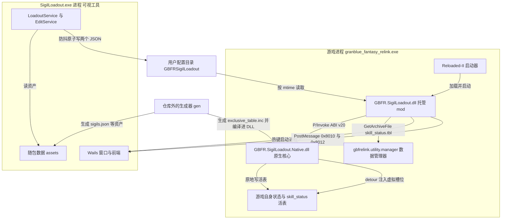

# 系统总览：三个单元与它们的边界

本 mod 的全部交付物是三个二进制加一份随包数据。它们分居两个进程，中间只有三条通道——一条进程内的 ABI、一条跨进程的磁盘契约、一条 Win32 消息。把这三条通道和「谁拥有哪份状态」认清，改动就不会跨错层；本页只讲边界与归属，各单元内部的结构与运行时序在各自的系统页与工作流页。

## 三个单元

| 产物 | 运行时域 | 由谁加载 | 职责（1-2 句） |
| --- | --- | --- | --- |
| `GBFR.SigilLoadout.dll` | 游戏进程内（`granblue_fantasy_relink.exe`） | Reloaded-II | 薄外壳：驱动 250ms 维护拍、转发日志、承载热键与因子编辑的托管那一半，并经由 ABI 把玩家配置推进原生核心。 |
| `GBFR.SigilLoadout.Native.dll` | 游戏进程内 | 托管 mod 自己（`NativeLibrary.Load`，不走 Reloaded-II） | 原生核心：装钩子让**虚拟槽位**真正进入游戏状态，拥有模板表/选择表与**活表**的定位槽。 |
| `SigilLoadout.exe` | 独立进程 | 玩家手动启动，或由托管侧热键 `Process.Start` 拉起 | 可视工具：读随包数据、把玩家配装与因子数值编辑写成两个 JSON 文件；与上述两者没有任何进程内联系。 |

三个产物装进同一个 mod 目录（`ModConfig.json` 声明 `ModDll` 为 `GBFR.SigilLoadout.dll`；原生 DLL 由托管侧按 mod 目录解析 `GBFR.SigilLoadout.Native.dll`；可视工具是同目录下的 `SigilLoadout.exe`），随包数据在 `assets\`。mod 目录每次更新会被整个替换，所以**三个单元的可变状态一律不落在那里**。

组件图：三个交付单元、游戏进程内的宿主与数据管理器、磁盘契约、以及仓库外的 gen。

## 边界一：ABI v20（进程内）

托管侧与原生核心之间唯一的通道是 `GBFR-SigilLoadout.sln` 里两个工程之间的一层 C 导出，声明集中在 `GBFR.SigilLoadout.Native/native_api.h`，托管侧在 `NativeCore.Interop.cs` 里以 `DllImport` + `__cdecl` 一一对应：

| 导出 | 作用 |
| --- | --- |
| `GBFR20_GetAbiVersion` / `GBFR20_SetLogCallback` | 版本握手与日志汇（原生日志经回调转成托管侧日志行）。 |
| `GBFR20_Initialize` / `GBFR20_Shutdown` | 生命周期；初始化成功与否以返回值报告，失败不抛。 |
| `GBFR20_ApplyLoadout` | 一次调用套用整份玩家配置：通用槽位 + 逐角色的专属开关。 |
| `GBFR20_WriteSkillStatusTable` | 把编辑后的整张 **skill_status** 表写进游戏自己已解析的那份**活表**；返回值是改写的行数或 `-1..-7` 拒绝码。 |
| `GBFR20_CopyRuntimeMessage` | 回读原生侧那一条运行消息，供托管侧在启动日志里说清为什么没成。 |

这条边界的契约由两道检查兜住，**任一不符就 fail-closed**（宁可不装钩子）：ABI 版本号比对，以及托管侧对两个跨 ABI 结构体的封送尺寸与字段偏移自检（`EnsureAbiLayout`，与 `native_api.h` 的 `static_assert` 一一对应，见 `native_internal.h` 里的静态断言与 `NativeCore.Interop.cs`）。原生侧另有 ABI 守卫：异常绝不跨出 `extern "C"`，一律降级成拒绝值加一行原因。细节在 [原生核心（C++ DLL）](/openwiki/architecture/native-core.md) 与 [skill_status 表与活表写入闸门](/openwiki/concepts/skill-status-table.md)。

## 边界二：磁盘契约（跨进程）

可视工具与托管 mod 之间**没有**直接的进程间通道。唯一的通道是两个文件，住在 `%LOCALAPPDATA%\GBFRSigilLoadout\`：

- `loadout.json` —— 玩家配装。托管侧由 `LoadoutConfig` 读，可视工具由 `LoadoutService` 写。
- `sigiledits.json` —— 因子数值编辑列表。托管侧由 `SigilEditorFeature` 读，可视工具由 `EditService` 写。

两个关键性质：

1. **单向写者**。两个文件各有唯一写者（可视工具），托管 mod 只读；反过来 mod 从不写它们。于是工具与游戏可以任意先后启动、任意重启，中间不需要协商。
2. **变更靠 mtime 发现**，没有通知机制：托管侧的维护拍每 250ms 比一次文件修改时间（`FileStamp` / `UserConfig.Stamp` 的唯一实现），文件被删掉也是一版真实的变更。写入侧的防抖与原子替换、读取侧的门与重试语义见 [两个配置文件与跨语言常量契约](/openwiki/concepts/config-file-contracts.md)。

目录名与两个文件名是**协议的一部分**，两侧各只有一处声明（C# 的 `UserConfig.FilePath`、Go 的 `userCfgDirName`/`loadoutFileName`/`editListName`），由 `SigilLoadout/sharedconstants_test.go` 对拍；同一道门也钉住了窗口标题与两条窗口消息、`MaxSlots`、参槽数 `LevelValueCount`、`kUnwornCharacterHash` 哨兵以及 skill_status 的行布局常量。它是对拍（漂了立刻红），不是「边界已证明」。

## 边界三：Win32 窗口消息（跨进程，非数据通道）

热键与窗口显隐这条链上，托管侧与可视工具进程之间走的是窗口消息，**不传任何数据**：

- 托管侧按固定窗口标题（`Hotkey.ToolWindowTitle` 与 Go 的 `toolWindowTitle` 是同一个字符串）用 `FindWindow` 找工具窗口；找不到就 `Process.Start` 拉起来。
- 找到就 `PostMessage`：`0x8010`（激活/显示）或 `0x8012`（开关，可见就收、不可见就呼出）。焦点归属的处理在两侧各做一半。
- 工具把自己假隐藏成托盘态（整窗 alpha 0、禁用输入、不进任务栏），所以重复按热键不会重复起进程；第二次启动工具实例由命名互斥体 `Local\GBFRSigilLoadout` 拦下并去激活已有窗口。

这条链的完整时序与状态机见 [工作流：热键呼出/收起可视工具](/openwiki/workflows/hotkey-summon.md)。

## 状态归属

「谁拥有哪份状态」是本仓库最容易改错的一处：托管侧刻意**什么都不持有**——既不持有游戏内存地址，也不维护按角色的槽表，所以也没有「缓存失效」这个概念。

| 状态 | 所有者 | 谁写 | 谁读 |
| --- | --- | --- | --- |
| 运行期**模板表**（每角色的虚拟槽位内容） | 原生核心 | `GBFR20_ApplyLoadout`（托管侧只把玩家配置映射成 ABI 结构转发） | 原生 detour 路径 |
| **选择表**（每角色已发布的虚拟槽位） | 原生核心 | 原生自己在模板变更后重新发布 | 原生 detour 路径 |
| **活表**（游戏自己解析出的那份 skill_status） | 游戏 | 原生 `GBFR20_WriteSkillStatusTable` 原地改写行 | 游戏 |
| 活表的定位槽（槽的 RVA） | 原生核心 | 原生启动时从语义锚点解出 | 原生自身，每次写前重读指针 |
| 虚拟槽位计数 | 原生核心 | 原生 | 原生 |
| 玩家配装与因子编辑列表（两个 JSON） | 可视工具 | 可视工具 | 托管 mod |
| 随包数据 `assets\`（九份） | 仓库（生成物） | 仓库外的 gen | 可视工具 |

模板表、选择表与虚拟槽位的容量与配对规则见 [虚拟槽位、模板因子与专属开关](/openwiki/concepts/virtual-slots-and-exclusives.md)；列表是按「谁拥有」而不是按文件组织的。

## 外部宿主与依赖

三个单元之外还有三处仓库管不着的边界：

- **Reloaded-II**：托管 mod 的宿主与生命周期来源（`IModLoader`/`IMod`）。`ModConfig.json` 里的 `SupportedAppId` 限定游戏进程、`CanUnload=false` 让原生钩子不会被假卸载、`OptionalDependencies` 声明数据管理器。
- **gbfrelink.utility.manager（数据管理器）**：读取游戏归档的**唯一**入口（`IDataManager.GetArchiveFile` / `AddOrUpdateExternalFile` / `UpdateIndex`）。它是**可选**依赖：缺它时因子编辑功能等它加载并重试，其余初始化不受影响，日志会明说。托管 mod 自己同样不读任何游戏数据文件。
- **仓库外的生成器 gen**：`assets\sigils.json`、`assets\sigils.chara.json` 与编译进原生 DLL 的 `exclusive_table.inc` 都由它产出。它不在本仓库，因此本仓库无法单独完成一次发布构建。见 [外部生成器 gen 与随包数据资产](/openwiki/integrations/external-generator-and-assets.md)。

边界上的失败一律是「降级、可诊断、不带走游戏进程」：原生 DLL 缺失或 ABI 不符 → 钩子不装，其余功能照常；数据管理器缺席 → 编辑等待重试；配置文件坏掉 → 保留上一份有效配置或整份不写；工具不在 mod 目录 → 热键记一行「找不到 exe」。各单元的责任划分、宿主契约的逐字段后果、以及出问题时该读的日志行分别在 [托管 mod（C# Reloaded 外壳）](/openwiki/architecture/managed-mod.md)、[宿主与依赖边界](/openwiki/integrations/host-and-dependencies.md) 与 [日志与故障定位](/openwiki/operations/logging-and-diagnostics.md)。

术语以 `CONTEXT.md` 的术语表为准：本页只用「虚拟槽位」「活表」「可视工具」「数据管理器」这几个词，不另造同义词。
