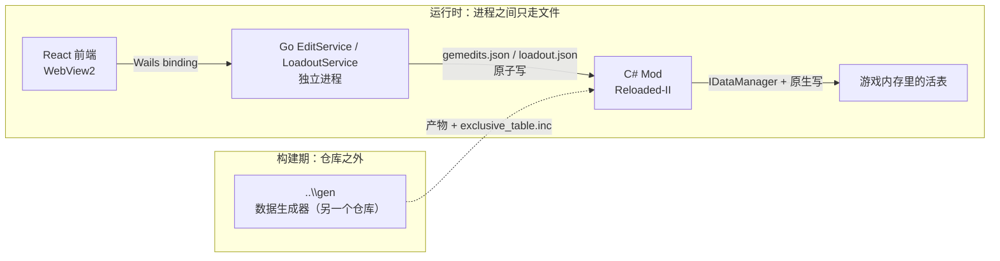

# 子系统地图 — 四个单元各自拥有什么

本仓库交付四个表面，它们共享同一份数据与同一个配置目录，但**从不在同一进程内互相调用**。
搞清楚哪个单元拥有哪项职责 —— 以及哪个是**刻意**保持愚笨的 —— 是"改对文件"与
"制造第二个事实来源"之间的分界线。

*四个单元的边界：运行时进程之间只通过磁盘文件通信；构建期还依赖仓库之外的 `..\gen`。*

## 四个单元

| 单元 | 技术 | 运行形态 | 拥有什么 |
|---|---|---|---|
| `GBFR.SigilLoadout/` | C#（.NET），Reloaded-II Mod | 游戏进程内 | 运行时效果：读游戏归档、改写原生表、实时应用 |
| `GBFR.SigilLoadout.Native/` | C++ | 注入进游戏进程 | 语义锚点地址解析，以及原地按行写入 |
| `SigilLoadout/` | Go + Wails v3 | 桌面应用（`main.go`，426 行） | 编辑器后端：资产、配置文件、前端调用的 RPC |
| `SigilLoadout/frontend/src/` | React + TypeScript（Vite） | 桌面应用的 WebView | 用户看到的一切，以及**什么算一次编辑**的全部判断 |

## Go 那侧是个 Wails 应用，这决定了边界的形状

`main.go` 构建桌面应用，并只向 Wails 注册**两个** service（对 `LoadoutService` 与
`EditService` 各调一次 `application.NewService`，`main.go:229-231`）。React 前端通过
Wails 生成的 binding 跟这两个 service 通话，不走 HTTP。

实际后果：**新增一个后端能力 = 给某个 service 加一个方法并生成 binding，而不是架一个端点。**
两个 service 按各自拥有的文件划分 —— `LoadoutService` 提供资产与 `loadout.json`；
`EditService` 拥有 `gemedits.json` 以及编辑器读的那些技能/资产查表。

## 职责边界实际落在哪里

**"什么算一次编辑"由前端决定。** `LoadoutService.LoadEdits` / `EditService.LoadEdits`
刻意不做过滤：代码写明哪些记录算编辑由前端决定（`skills.ts` 里的 `asEdits`），Go 只负责补齐。
Go 也拒绝把损坏的文件当成空列表，因为**"空列表"是一个真实状态** —— 所有编辑都关掉 ——
而把坏文件显示成空列表，正是某次误触按键覆盖掉用户真实编辑内容的方式。

**路径的身份由 Go 那侧拥有。** 两个配置文件的位置都由 Go 侧从 `userCfgDir()` 推导，
而 C# 侧从 `LocalApplicationData` 推导出同一个目录、中间没有任何协商。这就让"推导"
变成了一份**契约**：见[跨层数据契约](../reference/cross-surface-contracts.md)。

**每个需要游戏才能做的判断都归 C# 那侧。** 表到底能不能改（`HasPatchableLayout`）、
原生表槽解析成功没有、这次写入允不允许，全都在 C# 里决定。Go 那侧对游戏内存没有任何意见，
也永远不会知道某次应用成功与否 —— mod 唯一的回传通道是它的日志。

**前端在边界上刻意保持无状态。** 它每次改动都调 `SaveEdits` 且从不等待回答；
后端持有待写列表并做防抖。代价在代码里写明了：flush 时的写入失败已经没有调用方可以返回，
于是它被暴露成一个事件 `GBFR.SigilLoadout.SaveFailed` —— 而这个事件名在
`SigilEditorPanel.tsx` 里有**一份镜像，两者之间没有任何关联**，所以改名必须同时改两个文件。

## 一次改动如何穿过这些单元

一个实例 —— 新增一个逐因子数值 —— 按固定顺序碰到三层：

1. **前端**判定这个新字段是一次编辑，并把它放进交给 `SaveEdits` 的列表里
   （`model.ts`、`skills.ts`、相应的面板）。
2. **Go** 补齐并把它序列化进 `gemedits.json`（`Config` 里的 `Edits`，由 `writeEdits` 写出），
   并把 `Values` 补齐到固定的参槽数，这样无论手工编辑过的文件里有什么，JSON 形状都保持稳定。
3. **C#** 读同一份列表，把行写进表，并通过 `IDataManager` 原地写入。C# 侧的 `Config.cs`
   镜像了 Go 的 `Config`/`SigilSkill` 形状：**JSON 成员名就是接口，而两个方向都不在运行时校验它。**

这条链的后半段 —— 文件改动如何变成运行时改动 —— 见
[因子热应用流程全链路](hot-apply-flow.md)。

## 在你动手"修"之前值得知道的刻意不对称

- **`nil` 与空列表是两个不同状态**（在 `SaveEdits` 里）：`nil` 表示这次什么都没交（不写盘），
  空列表表示写出一份"所有编辑都关掉"的文件。
- **没有针对旧文件的兼容路径。** 成员名精确匹配、不做大小写折叠，所以旧构建写的、
  把成员拼成 `Edits`/`Enabled` 的文件什么都匹配不上，读出来就是空列表 —— 代码把它描述为
  既定的**"从头来过"**形状。一种格式，一个读取器。
- **不认得的 JSON 成员被忽略而不是报错**（`json/v2` 的默认行为）。这与上一条一致，不是疏漏。
- **mod 不自包含。** 原生编译与发布构建的一致性门都需要平级的 `..\gen` 仓库 —— 数据生成器
  全部住在那里（自带 git），本仓库只留产物与调用点。

## 验证面

Go 那侧带着真实的测试 —— `editservice_test.go`、`loadoutservice_test.go`、
`sharedconstants_test.go`、`assets_test.go` —— 前端也自带一套
（`variant.test.ts`、`skills.test.ts`、`index.test.ts`、`exclusive.test.ts`）。
但**C# 那侧在本仓库里没有测试项目**，所以
[因子热应用流程全链路](hot-apply-flow.md)描述的运行时路径，是靠游戏本身与日志里的实测
来验证的，而不是靠自动化测试。把这个不对称当作一个已知缺口：**改 C# 那侧无法在这里用
`dotnet test` 验证。**
