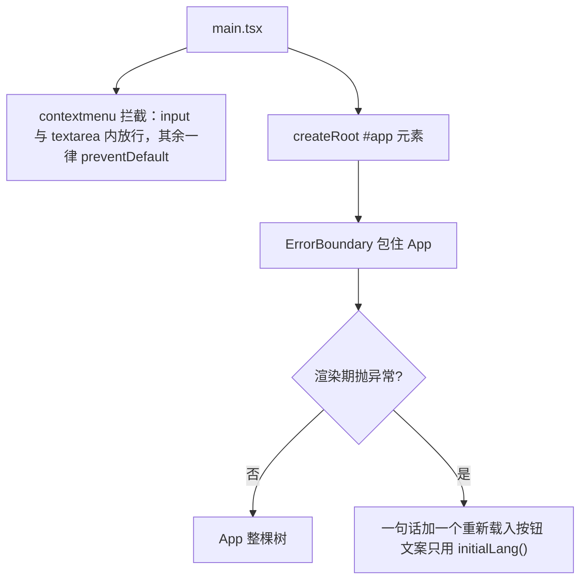
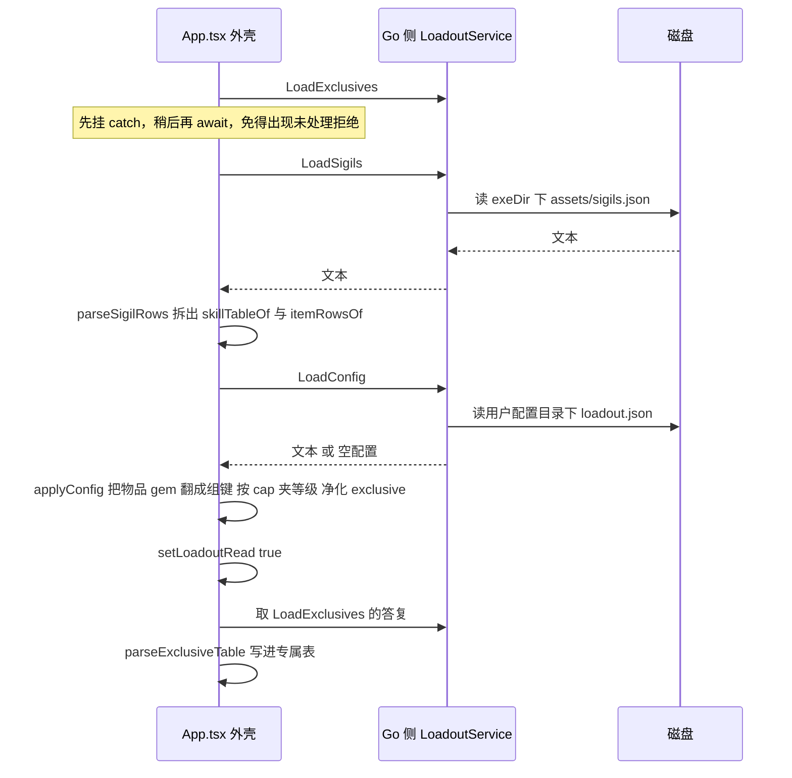
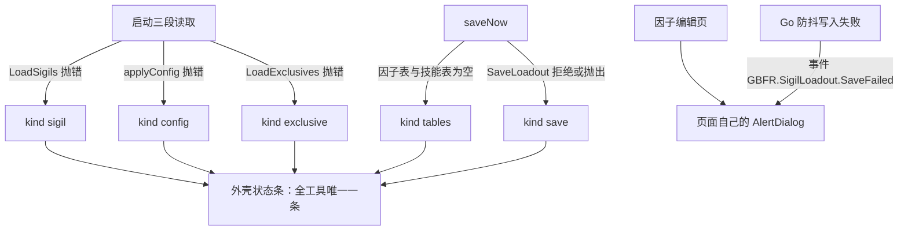
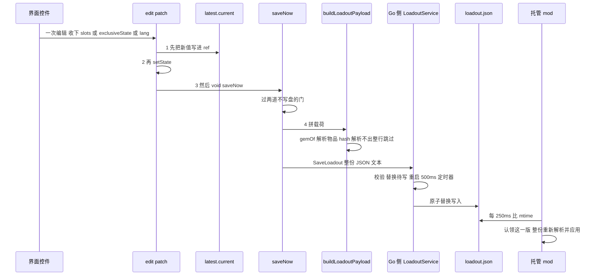
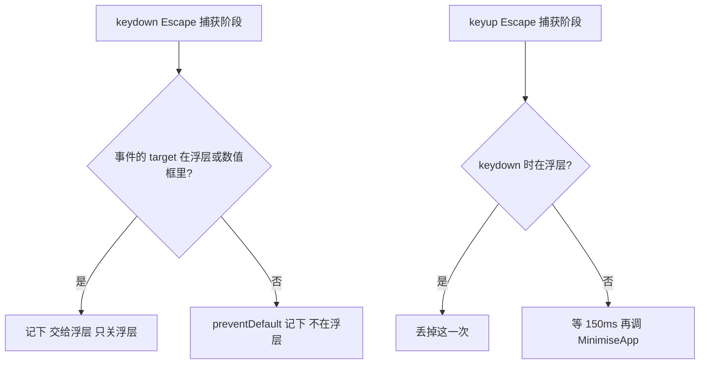
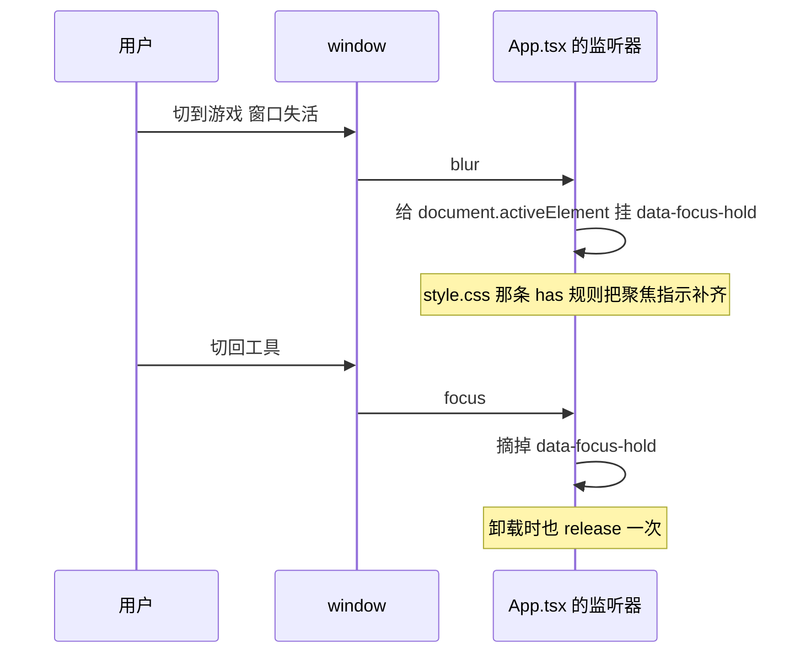
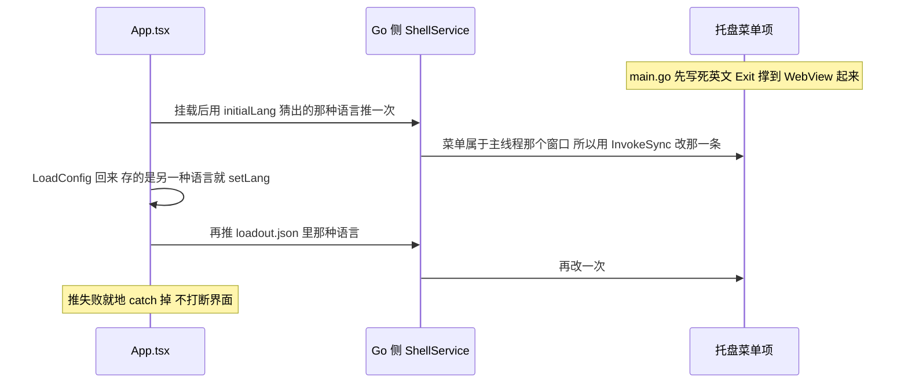

# 可视工具前端（React）

可视工具（`SigilLoadout.exe`）的界面是 `SigilLoadout\frontend\` 下的一棵 React 19 单页前端，构建产物是 `frontend/dist/`，由 Go 侧 `//go:embed all:frontend/dist`（`SigilLoadout/main.go`）在**编译期**嵌进 exe，再作为 `application.AssetFileServerFS(assets)` 的资源处理器交给 Wails。所以它**不是第四个交付单元、也没有独立的发布物**：改了 `src/` 之后不重建前端、不重新 `go build`，运行的还是上一次嵌进去的那份界面（顺序见「构建约束」一节）。

本页只讲前端这一个运行时域：模块划分（哪一半能脱离 React 与 DOM 测、哪一半只能留在组件里）、外壳级不变量（加载顺序、写盘顺序、页签与失败通道、键盘与焦点）、`model.ts` 里的载入→保存规则、语言的三层分工（含托盘那一条文案怎么推到 Go 侧），以及两个生成绑定模块、入口与构建约束。

以下内容**不在**本页，请点过去看：载荷字段规则、Go 侧校验与两道 mtime 门、托管侧的三段式应用在 [工作流：配装落盘与应用](/openwiki/workflows/loadout-apply.md)；`sigiledits.json` 的编辑记录规则与热应用在 [工作流：因子数值编辑与热应用](/openwiki/workflows/sigil-edit-apply.md)；两个文件的形状、常量对拍范围与「各只有一处声明」的纪律在 [两个配置文件与跨语言常量契约](/openwiki/concepts/config-file-contracts.md)；专属表的语义在 [虚拟槽位、专属因子与它们的开关语义](/openwiki/concepts/virtual-slots-and-exclusives.md)；Go 外壳、窗口三态与「前端 Esc 调到哪个 Win32 消息」在 [可视工具（Go + Wails）：装配、单实例与窗口状态机](/openwiki/architecture/visual-tool.md)。

## 模块地图：外壳、页面、纯逻辑、文案

前端的划界不是按文件夹，而是按**「这段规则能不能脱离 React 与 DOM 测」**：

| 位置 | 角色 |
| --- | --- |
| `main.tsx` | 入口：右键菜单策略（全局唯一一条）、`createRoot(#app)`、把 `App` 挂进 `ErrorBoundary` |
| `ErrorBoundary.tsx` | 渲染期异常的兜底：一句话 + 重新载入 |
| `App.tsx` | 唯一的外壳：全部跨页状态、加载时序、`edit` / `saveNow` 落盘链、三个页签、失败状态条、Esc 与焦点这两组全局监听、托盘文案推送 |
| `SlotEditor.tsx`（`SlotRow`、`HEADER_ROW`）、`SkillPicker.tsx`、`ExclusivePanel.tsx` | 「通用配装」与「专属因子」两页的行与控件 |
| `SigilEditorPanel.tsx`、`SkillRow.tsx`、`useRowTooltip.ts`、`useWheelStep.ts` | 「因子编辑」页：列表、行、tooltip 归属、滚轮步进 |
| `model.ts` | 因子表的**全部**派生关系（`buildSigilIndex`）、载入与落盘载荷、专属状态、变体解析 |
| `skills.ts` | 一条编辑记录的规则：什么算编辑、地址去重、输入框按键状态机、等级与说明文本 |
| `lang.ts` / `messages.ts` | 语言身份（有哪些语言、按什么猜）/ 四语文案表 |
| `style.css` + `components/ui/*` | Tailwind v4 + shadcn（Base UI 版）原语，加上外壳与列表自己的几条覆盖规则 |
| `bindings/` | **构建期生成物**，不入库；按 Go service 分文件（`loadoutservice.js` / `shellservice.js` / `editservice.js`…），而前端只 import 前两个（见「构建约束」） |

两条纪律写在这套划分里：

- **凡是由值单独决定的部分都不碰 React 也不碰 DOM**（`skills.ts` 的文件头），所以既能被 vitest 直接驱动，也意味着组件里只留渲染与事件。`skills.ts` 里最重的一条不变量是 `dedupe`：每个地址（`addressOf(key, level)` = `因子哈希#等级`）最多一条编辑，因为 mod 按顺序遍历列表、写进同一行的最后一条已启用的才生效；文件里仍可能有两三条，列表却只能显示一条。
- **因子表的派生关系只构造一处**（`buildSigilIndex`），一个 `SigilIndex` 对象替代七个 prop 传进每一行：下拉取值、显示名、等级上限、合法副集合，以及「保存时这个主因子该写成哪个物品 hash」（`gemOf` → `resolveMainGem`）。

### 组件层剩下什么

按上面那条划线，「值决定的部分」都走了，`SlotEditor` / `SkillPicker` / `SkillRow` / `ExclusivePanel` / `SigilEditorPanel` 里剩下的只有三类东西：把索引与规则算出的值画出来、把事件翻成对某个回调的一次调用、以及**只有 DOM 才知道的那几件事**。第三类正好四处，都值得单独说清，因为它们看起来像「随手写的细节」，其实是没法搬进纯逻辑的：

- **滚轮步进（`useWheelStep`）必须是原生监听器，而且 `passive: false`**：React 把 `wheel` 注册为 passive，写在 `onWheel` prop 里的 `preventDefault` 毫无作用——浏览器照旧滚动，而数值同时也在变。所以这个 hook 自己 `addEventListener("wheel", onWheel, {passive: false})`，并把 `live` / `apply` 两个回调放进 latest-props ref（一次注册要读到渲染中途才有的最新值，回调变了不该换监听器）。两个使用者各有各的「这一滚算不算数」：`SlotEditor.tsx` 的 `LevelInput` 要求数字框正持有焦点（`document.activeElement === inputRef.current`，否则滚轮不动它、列表照常滚），并把结果夹在 `min`/`max` 里；`SkillRow.tsx` 的 `ValueSlots` 则按元素在容器里的位置找出是哪一个参槽，边界由 `skills.ts` 的 `stepValue` / `MAX_VALUE` 给。
- **tooltip 归谁（`useRowTooltip`）**：行会在指针底下移动——一次勾选会把打开的内容排到最前——而 `enter`/`leave` 说不出「此刻指针下是哪一行」，所以列表这一层用 `document.elementFromPoint(...).closest("[data-row]")` 问文档，再把答案（`hoveredRow`）交给各行自己去比 `data-row`。两处配套的重放也在这里：Base UI 只在「打开它的那次事件是 mouseenter/mousemove」时才让弹层跟着光标，所以「指针进入」（`onRowPointerEnter`）与「勾选之后重新指向」（`resolveRowUnderPointer`）都要把进入过程在行上重放一遍；而一次勾选会让浏览器把仍然持有焦点的那个勾选框滚回视野，所以勾选之前 `keepScroll()` 记下 `scrollTop`，由同一个 layout effect 放回去。这份状态住在列表上，行只拿它跟自己的 id 比。
- **方向键与 Esc 归谁**：`SkillPicker` 的触发器在捕获阶段吞掉 `ArrowUp`/`ArrowDown`（Base UI 在触发器上按方向键就会打开列表），方向键才留给字段导航与数值输入框自己的步进；`SkillRow` 的数值框则 `preventDefault` 后自己步进（否则方向键会把光标移到框末尾，在一个可滚动列表上还会顺手把列表也滚了），并把 Esc 定义成 `e.currentTarget.blur()`（外壳那条「Esc 隐藏窗口」因此要把 `.skill-rows input` 当浮层排除，见下一节）。
- **正在输入的半成品文本暂存在组件里**：一个槽里的一次按键意味着什么、何时提交，由 `skills.ts` 的 `slotEdit` 作为数据返回（`drop` / `half` / `commit`），`SkillRow` 只负责渲染——`half` 的文本进 `halfTyped` 本地 state，`commit` 的 `values` 交上去，`commit.keeps` 让输入框在失焦前继续显示用户敲的那串文本（`0.0`、`0.00` 也是数字，用提交后的数字渲染会把后面输入的内容吃掉）。规则在 `skills.ts`，屏幕上怎么显示在 `SkillRow.tsx`，这条分工本身就是「组件没有单测也不慌」的原因（见「测试边界」一节）。
- **父行勾选框的三种状态与半选那根横杠**：状态由 `skills.ts` 的 `parentState` 给（按这一行**显示的**等级算，不按记录条数，否则「11 个等级开了 1 个」会被读成全选，半选态永远不出现），而画法只有 DOM 知道：Base UI 的 indicator 永远画对勾，所以半选那根横杠由 `SkillRow.tsx` 自己画（14 单位盒子里的一条 y=7.5 的线，落在像素行中点上才不会发虚），`style.css` 只负责把 `[data-indeterminate]` 的盒子刷成选中态填充并藏掉 indicator 里的 svg。

## 入口纪律：一条全局监听与一个兜底

`main.tsx` 只做三件事，顺序就是全部纪律：



入口顺序：右键菜单策略在挂载之前注册，渲染期异常由 `ErrorBoundary` 在 `App` 之外兜住。

两处都值得说明理由：

- **右键菜单**：WebView 里没有浏览器菜单，默认那条菜单对这个工具没有任何用处，唯一需要它的地方是输入框的原生编辑命令（复制/粘贴/全选），所以判据是 `closest("input, textarea")`。
- **`ErrorBoundary` 的文案只能用 `initialLang()`**：语言状态住在 `App` 里面，而 `App` 正是崩掉的那棵树——兜底界面拿不到用户选的语言，只能回到「系统猜一次」的那个答案。前端**没有错误上报通道**（零 console 是刻意的现状：发布构建的 WebView 里没人看得到控制台），所以兜底只给一句话和一个 `location.reload()`，而不是假装能诊断。

## 外壳状态与加载时序

`App.tsx` 拥有全部跨页状态：`skills` / `sigils`（因子表）、`slots`、`loadoutRead`、`failure`、`tab`（`TabKey = "general" | "exclusive" | "sigilEditor"`）、`exclusiveTable` / `exclusiveState`、`names` / `charaNames`、`lang`。派生索引由 `useMemo(() => buildSigilIndex(sigils, skills, names), [sigils, skills, names])` 重建——`names` 是唯一会随语言变的输入，重建只换标签：索引里的键始终是 hash（名字不是身份）。



加载时序：三条读取在同一个挂载 effect 里发出，但 `LoadConfig` 必须排在因子表解出来之后，`loadoutRead` 只在 `applyConfig` 成功之后才置位。

这张图里三处顺序的理由，都得写清：

1. **`LoadConfig` 排在 `LoadSigils` 解出来之后**：它要把存档里的物品 gem 翻译成下拉用的组键，并按技能自己的 cap 夹等级——`configToSlots(cfg, sigilTable, skillTable)` 需要那两张表。所以它不是「一起 await」的第三份，而是第二段的依赖。
2. **`LoadExclusives` 先发出、最后才 await**：promise 在第一时间创建，`exclusives.catch(() => {})` 当场挂上（否则中间任何一次 await 抛出都会把它变成未处理拒绝），真正的解析与 `setExclusiveTable` 放在第三段。
3. **三段各自 `try`，各自只写一条失败**：读因子表抛 → `kind: "sigil"`；`applyConfig` 抛 → `kind: "config"`（此时**仍要** `setSlots(padSlots([]))` 把槽位铺满，屏幕上 0 行看起来像什么都没发生）；读专属表抛 → `kind: "exclusive"`。任一段失败都不许挡住后面的段。

加载期还有一处只为观感存在的门：通用配装页表头的「全选」勾选框在 `slots.length === 0` 时不渲染——空数组的 `every()` 是 `true`，配置读回来之前会先勾上、再被真实状态改掉，看起来像闪了一下。

这条 effect 的依赖数组是空的，而且是**刻意不读文案**：失败文案在渲染时由 `failureText(failure, t)` 取，所以没有语言依赖能把「只跑一次」重新触发。

另外三个小的单词 effect 与它分开，各自挂在 `[lang]` 上：`document.documentElement.lang = lang`；把语言变化推给托盘那一条菜单（见「语言」一节末尾）；按 `lang` 取显示名（见「显示名」一节）。

### 单条失败通道

外壳只有一个失败槽：`type Failure = { kind: "sigil" | "config" | "exclusive" | "save" | "tables"; error?: unknown }`。所有失败都写进这一个状态，屏幕上**不可能出现两条互相矛盾的提示**；文案由 `failureText` 按 `kind` 从当前语言的 `Messages` 里取。



失败往哪里去：外壳五类失败共用一条状态条，因子编辑页另有自己的对话框。

状态条挂在**页签之外**（外壳那一层，`aria-live="polite"`），因为它是外壳级的通知：切到因子编辑页时，那两个配装页的「没保存成功」不该被静默吞掉。另一半是分工：因子编辑页的读取失败与写入失败走它自己的 `AlertDialog`（读不出编辑列表、`SaveEdits` 当场被拒，以及后端防抖之后才失败、只能以 `GBFR.SigilLoadout.SaveFailed` 事件到达的那一类）。`saveNow` 成功时会顺手清掉之前那条 `kind: "save"`（`setFailure((prev) => (prev?.kind === "save" ? null : prev))`），而读取类失败在会话里保留。注意事件的**唯一订阅者**在那个页面上，而它 `keepMounted`，所以配装那条路的防抖写入失败也复用同一个对话框——配装页自己没有监听者。那份订阅挂在 `[lang]` 上（`Events.On` 交回的函数就是 React 退出时运行的取消订阅），语言一变就重挂一次，免得对话框的标题停在旧语言上。事件名是**手抄的镜像常量**（`editservice.go` 的 `saveFailedEvent` 与 `SigilEditorPanel.tsx` 的 `SAVE_FAILED` 之间没有任何关联），改名必须同时改两处——Go 侧的 `sharedconstants_test.go` 有一道对拍断言专门盯着这两个字面量（每条声明必须**正好**匹配一次，其中 TS 那一侧是读 `SigilEditorPanel.tsx` 的**源码文本**），所以单边改名是测试红，而不是那个对话框永远不弹。

### 编辑 → 状态更新 → 构建载荷 → 调 Go 绑定

前端**不写文件**：它每次编辑把整份状态（不是补丁）交给 Go，Go 替换待写并重启 500ms 定时器。因果链如下，四步不要读成「异步」——`buildLoadoutPayload` 与 `SaveLoadout` 就在这一次调用里同步发生（只有 Go 侧的落盘是延迟的）：



编辑到落盘：写入顺序、两道门、`buildLoadoutPayload`、Go 侧防抖与原子写、托管侧的 mtime 门，一环扣一环。

`edit` 的入口一共四个：`updateSlot`（`SlotRow` 的每一处改动）、`toggleAll`（表头全选）、`updateExclusive`（专属页的开关）、以及语言切换按钮。载荷的文本由前端生成（`JSON.stringify(payload, null, 2)`，两空格缩进），Go 只做形状校验然后原样原子落盘。

**纪律一：`edit` 内部的顺序不能换。** 处理器里 `setState` 要等它返回之后才提交，那时 `latest.current` 读到的还是上一次的状态，落盘就永远慢一次（最后一次勾选就是这么丢的）。所以 `edit(patch)` 是「先 `latest.current = {...latest.current, ...patch}` → 再 `setState` → 最后 `void saveNow()`」。`latest` 这个 ref 由 `useLayoutEffect` 写入而不是渲染期：渲染期写 ref 是 React 明令禁止的（会把一次从未提交的渲染里的值发布出去）。

**纪律二：自动保存只由编辑处理器触发，不由状态变化触发。** 挂在 `[slots, lang, exclusiveState]` 上的版本只能靠一个一次性旗标去赌「哪次状态更新先把它消费掉」，而加载期的任何一次额外 `setState` 都会让启动变成一次写盘（旧版本那次 `exclusive` 迁移就是这么把用户的开关状态改坏的）。现在没有旗标：加载不调用任何编辑处理器，就排不出保存。

**纪律三：两道「不写盘」的门。** 因子编辑页还有第三条同类门（它不属于这条链，住在 `SigilEditorPanel.tsx` 的 `commit` 里）：

| 门 | 位置 | 违反后的症状 | 原因 |
| --- | --- | --- | --- |
| `loadoutRead` 未就绪 | `saveNow` 的第一行 `if (!loadoutRead) return` | 读配置失败时槽位被铺成 `padSlots([])`，此刻交出去的载荷会把磁盘上那份完整配置**整体替换**掉 | `setLoadoutRead(true)` 只在 `applyConfig` 成功之后执行 |
| 数据表为空 | `index.mainKeys.length === 0` 或 `index.skillHashes.length === 0` 时只写 `{kind: "tables"}` | 交出去的会是一份「所有槽都被跳过」的载荷（空 id 会被下游拒掉整份文件） | 表没读到时给的是横幅「数据表未加载，无法保存」（`tablesNotReady`），不是空载荷 |
| 编辑列表没读回来 | `commit` 的第一行 `if (!editListRead) return` | 此时 `edits` 是空的，交出去的残缺列表会被 `SaveEdits` 整体替换，用户的其余编辑就没了 | 与上一条同源：读取失败后绝不写盘，只显示「读取失败」 |

同一类纪律在因子编辑页还有一条读侧版本：`loadAll` 会归一化（大写 `key`、`pad` 补齐十个参槽）并只在内存里理顺列表，**不写回文件**——「打开一次就等于改过一次」与外壳那条「启动不写盘」是同一条规则。

两条与「谁生成文件内容」有关的边界事实：`loadout.json` 的**文本**是前端生成的；`sigiledits.json` 相反——前端交的是结构体数组，序列化由 Go 用 `jsontext.WithIndent("  ")` 完成。字段规则、校验责任与 mtime 门本身都在 [工作流：配装落盘与应用](/openwiki/workflows/loadout-apply.md) 与 [两个配置文件与跨语言常量契约](/openwiki/concepts/config-file-contracts.md)。

### 语言切换就是一次编辑，代价是整份配装被重新应用

界面语言不走「工具自己的设置」，它存在 `loadout.json` 的 `lang` 成员里，所以右上角那四个按钮走的是**与勾选框完全相同的通路**：

```ts
onClick={() => { edit({lang: option}) }}
```

四个按钮包在一个 `ButtonGroup` 里（`aria-label={t.langSwitch}`、`size="icon-sm"`），选中格用 `default` 变体并补一条 `border-input`（该变体不带边框色，组的外框会断一截），再用行内 `translate: none` / `transition: none` 抵掉按下位移与选中格那 150ms 的淡出淡入——行内样式优先于 class，所以这些覆盖不必去改组件原语。

串起来的后果是跨系统的，必须一次说清：

1. `edit({lang})` → `saveNow()` → `SaveLoadout(整份载荷)` → 500ms 防抖后 `writeFileAtomic` 替换 `loadout.json`；
2. 原子替换写入的是一份新文件，所以这一版的 mtime 与上一版不同——写入侧刻意让 mtime 成为一个可用的版本号（防抖至少隔开两次落盘，远大于 mtime 粒度），而托管侧版本门 `LoadoutConfig.Stamp` 的 `Changed()` 判据就是 mtime **相等**、不看内容，于是「只换了 `lang`」与「改了一整套槽位」是同一件事；
3. `Changed()` 的语义是「认领后处理」，于是这一版被 `TryApply` 拿去重新 `ParseAndValidate` + `NativeCore.ApplyLoadout`——**整份配装被重新解析并应用到原生侧**，即便用户只是想把界面换成日文；
4. 而 C# 侧**完全不读** `lang`（它的注释就是「`lang` 只有可视工具在意」）：这个成员是纯工具状态，却寄居在唯一一条跨进程契约里，所以它的每一次变化都要付一次整份应用的钱。

配套的一条小契约：`LoadConfig` 在文件不存在时返回 `{"lang":"","slots":[]}`。空串不在 `LANGS` 里是有意的，`applyConfig` 里 `if (LANGS.includes(cfg.lang))` 于是失败，前端保留 `initialLang()` 那次猜测——把 `lang` 写死成 `"zh"` 会让日/韩/英文系统的新用户第一眼看到中文。

### 更细的一条：`exclusive` 的键与写入形状

「专属因子」页每次点击都走 `edit({exclusiveState: …})`，也就是走同一条落盘链。落盘键是**角色 hash**（身份）而不是屏幕上的 PL 码：古兰/姬塔共享 `PL0000`，一次点击要写到共享该码的每个角色上，面板才继续是一行——所以 `updateExclusive` 先用 `exclusiveTable` 把 `player` 展开成 `charaHashes`。展开后交给 `model.ts` 的 `withExclusiveToggle`（只写 `false`、打开就删键、条目空了整条删），读进来时先过 `sanitizeExclusiveState`（丢掉原型键与非 `false` 的值）——手改过的文件因此不能污染编辑器状态，也不会因为「收下了 `true`」而在下一次自动保存时被原样写回。

## `model.ts`：载入 → 保存的往返、专属状态与派生索引

`model.ts` 是「因子的值长什么样、文件里长什么样」的唯一出处，也是前端测试最主要的目标。

### 变体：下拉的值是组键，文件里的值是物品 hash

`Slot` 的六个字段各管一头，`mainGem` 是那次回归留下的：

| 字段 | 含义 |
| --- | --- |
| `mainHash` | 主下拉的值 = **组键**（该组变体共享的 `skill1`） |
| `mainGem` | 存档里那个 gem 的物品 hash；空 = 没有可保留的变体 |
| `mainLevel` / `secHash` / `secLevel` / `enabled` | 数值与开关 |

**载入**：`configToSlots(cfg, sigils, skills)` 先走 `slotsFromConfig`——存档的信任边界，每个字段都有守卫（`items[0].gem` 不是字符串就空、缺 `level` 回落 `DEFAULT_LEVEL`、`enabled !== false`、`mainGem` 原样留住那个 gem hash），等级用 `clampLevel` 按 `capOfGem` / `capOfSkill` 夹住（表里没有的 gem 保留原值）；随后按 `sigils` 把 `mainHash` 从物品 hash 翻成组键（`s.skill1 || s.hash`，只在该 gem 在表里时才翻）。留下 `mainGem` 是必需的：一个组里可以有**名字不同**的两个变体，丢了它，没被碰过的那一行也会被静默改写。

**保存**：`buildLoadoutPayload(slots, index, lang, exclusive)` 里空 `mainHash` 整行跳过；`index.gemOf(mainHash, secHash, mainGem)` 解析成物品 hash，**解析不出（空串）也整行跳过**（空 id 会让 mod 拒掉整份文件）；`items[0] = {gem, hash: mainHash, level}`（mod 不再持有因子表，主技能必须随载荷走），有副技能才写 `items[1] = {hash, level}`；`exclusive` 为空时不写这个成员。

**`resolveMainGem(variants, pool, secHash, preferred)` 的顺序就是优先级**：

1. 存档已指名的那个变体（`preferred`，且仍与副技能相容：`secHash === "" || kept.skill2 === secHash`）；
2. 池版那一行（`secHash === ""` 或 `pool.lot` 里含 `secHash`）；
3. `skill2 === secHash` 的那一版（固定副技能版不写进 `loadout.json`，mod 从 gem 自己推，所以它那一版对应的 `secHash` 是空）；
4. 兜底 `fixed?.hash ?? pool?.poolHash ?? variants[0].hash`。

`variant.test.ts` 钉住这条载入→保存的往返，用的是真实表里唯一这样的一族：钳蟹的共鸣（`1C4D37E4`，无固定副技能）与永恒钳蟹因子（`426AD20E`，固定副技能 `D3B8C21F`）共享技能 `082033CB`。

### `padSlots`、`DEFAULT_LEVEL` 与不截断

`padSlots(slots)` 至少补到 `MAX_SLOTS`（= 16，与 Go 的 `loadoutservice.go` 的 `MaxSlots`、C# 的 `LoadoutConfig.cs` 同名常量三处对拍，见 `sharedconstants_test.go` 的 `TestSharedConstantsAgreeAcrossLanguages`），空行由 `emptySlot()` 生成（`mainLevel` / `secLevel` 为 0、`enabled: true`）。存档**多出来**的行照传，不在这里静默截断——交给 Go/C# 校验去拒，静默截断的下一次自动保存就是数据丢失。`DEFAULT_LEVEL`（= 15，与 C# 的 `DefaultLevel` 对拍）是不知道 cap 时的回落，`capOfSkill` / `capOfMain` 也用它。

### 专属状态：只记「被关掉的槽」

- `sanitizeExclusiveState(raw)` 用在**读**这一侧：非对象或数组直接给 `undefined`；丢掉原型键（`BLOCKED_KEYS` = `__proto__` / `constructor` / `prototype`）与非 `false` 的值；结果为空也返回 `undefined`。收下 `true` 的后果是下一次自动保存把它原样写回文件，所以这个形状只记被关掉的槽。
- `withExclusiveToggle(state, charaHashes, skillHash, value)` 是一次点击落到状态上的结果：关 = 写 `false`；开 = **删掉那个键**（同一份事实的第二份拼写「`true`」，读方一律忽略）；条目里没剩下关闭项时整个角色键删掉（没提到 = 三槽全开）；不碰状态里本来就有的其它角色。
- `exclusiveSlots(row, names)` 把 `gems: [因子物品 hash, 技能 hash][]` 拆成 `{skillHash, label}`：**状态键取技能 hash、标签取物品 hash 的名字**（按下标取错那次正是回归现场，后果是整页三个标签退化成裸 hash）。
- `parseExclusiveTable(raw)` 是这张表的信任边界：不是数组就抛（调用方 `App.tsx` 把它翻成 `kind: "exclusive"` 的失败提示），形状不完整的记录（不是三槽、某槽不是一对字符串、`player` 不是字符串）整条丢掉。

### 因子表的派生索引

`parseSigilRows` 只做拆包（`parsed.sigils ?? []`，类型是 `Partial<Sigil>` 的行），随后分成两份：`itemRowsOf` 只收物品行（`hash !== skill1`，非物品的技能行不给选），`skillTableOf` 是技能字典——每个技能 hash 一行、**首行胜出**，带 `player` 的专属行不作副技能候选，`cap` 缺省 `DEFAULT_LEVEL`，`gem` 是指它命名那一行的 hash（显示名按它去 `sigils.lang.json` 取）。

`buildSigilIndex(sigils, skills, names)` 把这些派生关系构造一处：

| 成员 | 规则 |
| --- | --- |
| `mainKeys` / `mainKeySet` | 每组的组键，**组里至少有一个非专属行**才进主下拉（专属因子归专属页管） |
| `skillHashes` | 副下拉的取值 = 技能字典的每个 hash |
| `labels` | `names[tr.gem] ?? tr.hash`：取不到名字回落成裸 hash，而不是显示别的语言的名字 |
| `legalOf(mainKey)` | 合法的副技能集合：唯一持有（或没有物品行）→ 共用的空集合 `NO_LEGAL_SKILLS`；组里有 `mix === "0"` 的行 → 全部普通技能；否则只收 `mix === "1"` 那些行声明过的 `skill2` 与 `lot` 里、且确实是普通技能（`onlyone !== "1"`、物品行、`mix === "0"`）的那些 |
| `capOfMain` / `capOfSkill` | 技能字典的 cap，缺省 `DEFAULT_LEVEL` |
| `gemOf(mainKey, secHash, preferred)` | 转发 `resolveMainGem`，也就是「这个主因子该写成哪个物品 hash」 |

组合规则只作提示，不阻断选择、保存或实装（`SkillPicker` 只是把不合法项灰显、把非法取值标红）。

`index.test.ts` 跑的是**入库的真实 `assets/sigils.json`**（不是手搓夹具，理由写在文件头）：断言每个主下拉取值都有显示名、`lot` 里都是普通技能、唯一持有的组没有合法副、缺失 cap 回落 `DEFAULT_LEVEL`、`gemOf` 给出该组里的真实物品 hash、池族在池里时写池版 hash；另一组断言 `buildLoadoutPayload` 的形状（空槽不写进文件、解析不出的主因子整行跳过、主/副技能的 items 形状、`exclusive` 全空时不写这个成员）。

## 三个页签：都 `keepMounted`

页签是「通用配装 / 专属因子 / 因子编辑」（界面文案按游戏自己的说法，见 `messages.ts` 的 `tabGeneral` / `tabExclusive` / `tabSigilEditor`）。三个 `TabsPanel` 全部 `keepMounted`，而**没有一个「不在这一页就整块不渲染」的分支**。两个配装页共用 `LOADOUT_FRAME`（`page-padding` + 竖向 flex 列）与 `LOADOUT_ROWS`（滚动盒），通用页的表头另放在 `LOADOUT_HEADER` 里——它在滚动盒**外面**，否则下滚时表头跟着走；`overflow-y-hidden` 让它也成为滚动容器，`[scrollbar-gutter:stable]` 才有地方为它预留那条沟槽（常量 `GUTTER` = `pr-4 [scrollbar-gutter:stable]`，行与表头共用）。因子编辑页自带 `page-padding` 与横向最小宽度 `min-w-[888px]`，不套这两个类。

两条理由，两条都是「卸载会丢东西」：

- **配装页**：不 `keepMounted` 的话，每次切页都要卸载/重挂整表 `SlotRow`，而每行带两个 Base UI 下拉——切页于是从「显示/隐藏」变成一次真实的重建。代价是三页在启动时都挂上（专属页每行一个 PL 码，几十行，可忽略）。
- **因子编辑页**：这一页的编辑状态（`edits` 这个按地址索引的 `Map`）活在组件里，而后端要等 500ms 防抖才落盘。切走就卸载的话，在防抖窗口内切回来会读到**还没写下的旧文件**——屏幕上刚敲的数字消失，随后那份旧列表还会把磁盘上的新值覆盖掉。这一页同时用 `memo` 包住（`export const SigilEditorPanel = memo(SigilEditorPanelBase)`），免得 App 的每次重渲染都连带它。页内还有一条同样性质的减速带：搜索框的值经 `useDebounced`（150ms）才进过滤，否则每敲一个键都要重排整张列表（两百行上下）。

与这套滚动盒子配套的外壳规则写在 `style.css`：`html, body { overflow: hidden }`，外壳钉在窗口上，只有列表自己滚。否则一个落在折线以下、而滚轮还在转的 tooltip 会短暂撑大可滚动区域，窗口自己的滚动条于是从右边冒出来——它要从视口里拿走宽度，整个外壳被推得向左一跳，等它消失才弹回来。同一层还有两条小规则：`body` 收回 I 形光标、只有 `input, textarea` 显式要回（页面上的文字标签因此不必一个个加 `cursor-default`）；`.skill-rows`（因子编辑页那个滚动盒的 class，也是这一页所有勾选框覆盖规则的作用域）里的勾选框有两条自己的覆盖：关掉位移动画（勾一下会让那一行移位，组件自带的 transition 会在行已经跳走之后还在填充颜色），并给 `:focus-visible` 补一条 `box-shadow: 0 0 0 2px var(--ring)`——焦点环是向外长的，会被容器边缘切掉，所以行在左边留了同样 2px（`ml-0.5`）。

## 键盘与焦点：两组全局监听

这两组监听都注册在 `document` / `window` 上、写在 `App.tsx` 里，因为「Esc 归谁」和「焦点指示还亮不亮」都是外壳级的判断。

### Esc：捕获阶段听两次，浮层优先



Esc 的两条路：浮层内归浮层，浮层外才把窗口假隐藏，而且推迟到 keyup 之后。

细节都不是随手写的：

- **捕获阶段**是必需的：Base UI 会在 React 处理 `keydown` 时卸载弹层，冒泡阶段的监听器会看到一个已经摘下来的 target，从而错判成「不在浮层」而把窗口藏掉。
- **同时听 `keydown` 与 `keyup`**，且浮层判断只在 `keydown` 做（`isInOverlay`），结果留给 `keyup` 用。两条路都会赋值，丢一次 `keyup` 不会把下一次 Esc 也吞掉。
- **推迟到 `keyup` 才隐藏**（再等 150ms）：`keydown` 就藏掉的话，这一记 `keyup` 会落到已经拿到焦点的游戏窗口上。真正的隐藏动作是绑定 `MinimiseApp()`——注意它来自**另一个**生成模块 `../bindings/sigilloadout/shellservice`（Go 侧 `ShellService`：窗口显隐与托盘自成一体，不挂在读写载荷数据的 `LoadoutService` 上）；之后走的是 [可视工具（Go + Wails）](/openwiki/architecture/visual-tool.md) 里那条 `hideToTray` 状态机。
- **哪些东西算浮层**由选择器给出：`[data-slot="combobox-content"]`、`[role="dialog"]`、`[role="alertdialog"]`，以及 `.skill-rows input`——最后这一项是因子编辑页的十个参槽：那一页把 Esc 定义成「放开这个框」（`e.currentTarget.blur()`），不该同时把整个窗口藏到托盘去。
- **菜单热键不在这里处理**：它是 mod 的全局注册，按一下就是开关这个窗口。
- **另一半键盘判断不在外壳里**：下拉触发器吞方向键、数值框自己步进与 blur，那些是组件层的规则（见「组件层剩下什么」）；外壳只管「不在浮层里就把窗口藏起来」这一层。

### 失焦时保住聚焦指示

窗口失活那一刻，`:focus` / `:focus-visible` 会被判掉（指示灭），而 DOM 焦点其实还在框里——「切到游戏改完数据再切回来接着输」靠的就是它。所以外壳在 `window` 的 `blur` 上给仍持有焦点的元素挂一个 `data-focus-hold` 属性，在 `focus` 上摘掉（卸载时也摘一次），由 `style.css` 把聚焦指示补齐：



上图：失活时挂属性、激活时摘属性，聚焦指示由 CSS 按属性补齐，而不是靠 `:focus` 伪类。

```css
[data-slot="input-group"]:has([data-focus-hold]) { @apply border-ring ring-3 ring-ring/50; }
```

补的值必须与 `components/ui` 里的聚焦类一致，否则「窗口失活」与「窗口激活」下同一个框会有两种样子。有一处**有意的取舍**写在 `style.css` 里：因子编辑页的十个数值框不补——深色主题下编译产物把 `focus:bg-muted/50` 压掉了（与 `dark:bg-transparent` 同特异性且排在后面），补了反而与聚焦态不同，于是两边都不补；代价是浅色主题下失活那一刻聚焦底色会消失，而本项目只在深色下使用。

## 语言：三层分工

界面语言的三个问题分属三个不同的变化原因，所以住在三个地方：

| 问题 | 住哪 | 变它的时候 |
| --- | --- | --- |
| 这个可视工具支持哪几种语言、每种在切换键上叫什么、系统要哪一种 | `lang.ts`：`LANGS`、`LANG_LABEL`、`initialLang()` | 加一种语言 |
| 界面每一句话长什么样 | `messages.ts`：`zh` 这一份就是形状（`Messages = typeof zh`），其余语言按它填 | 改一句话 |
| 因子的名字、效果概要、等级说明 | Go 侧随包资产：`sigils.lang.json` / `chara.lang.json` / `skill.<lang>.json`，前端只按语言取一次 | 改游戏文本的呈现 |

几条不变量：

- **语言身份只存一处**：`loadout.json` 的 `lang`，不进 `localStorage`。同一个窗口里两套语言状态的话，用户在一页切的语言不会带到另一页（因子编辑页因此不自己带语言开关，`lang` 由 `App` 传进去）。
- **`initialLang()` 是整个工具唯一一处「系统要什么语言」的猜测**，只在配置里还没写语言时用一次：`navigator.language` 与四个码互不为前缀，所以「谁先谁后」不影响结果，猜不中回落 `en`。
- **切换键的文字用它自己的语言写**（`LANG_LABEL` = `中` / `EN` / `日` / `한`），而且每个按钮带 `lang={option}`：字体按它自己那门语言选，否则字体会跟着文档语言换、切语言时粗细就变了。用文字而不是国旗 emoji，因为 Windows 不带国旗字形。
- **四种语言一种都不能漏是编译期检查**：`messages: Record<Lang, Messages>`——加一种语言只改 `lang.ts` 而忘了 `messages.ts`，`tsc` 当场报错，四语齐备不靠人眼。
- **`LANGS` 在 Go 侧有一份手抄的副本**：`loadAssetsFrom` 里硬编码着 `[]string{LangZH, "en", "ja", "ko"}` 去读四份 `skill.<lang>.json`。加第五种语言要同时动 `lang.ts` 与那一行；只动前端的话，界面文字是新语言而因子名会经 `pick` 回落到中文。
- **界面文案与术语表是两回事**：`CONTEXT.md` 约束代码与文档的用词，但玩家看到的界面按游戏自己的说法——「主因子 / 副因子 / 专属因子 / 因子编辑」。`messages.ts` 的文件头把这条写明了，而且「因子」那三种语言用的是游戏自己的译名（英文 sigil、日文 ジーン、韩文 진），不是音译。

### 托盘那一条：唯一由前端推给 Go 的文案

语言还有一个不在 React 树里的落点：托盘右键菜单（Windows 原生画的那一条）。它的文案仍然只有前端一份——Go 侧再抄一张翻译表就是同一件事的第三处，只会在托盘这一条上漂移——所以 Go 侧只留一个入口 `ShellService.SetTrayExitLabel(label)`，`main.go` 先把那条写成英文 `Exit` 撑到 WebView 起来，之后由 `App.tsx` 推：



上图：托盘文案由前端在每次语言变化时推给 Go，启动时可能推两次，Go 侧只负责把 label 写到菜单项上。

三条细节：

- 这个 effect 挂在 `[lang]` 上，所以启动时**可能推两次**：挂载后第一次推的是 `initialLang()` 的猜测，第二次才是 `loadout.json` 里存的那种语言（`applyConfig` 成功时 `setLang`）。第一次不是多余的：配置读回来之前托盘不该一直停在英文。
- 失败就地 `.catch(() => {})` 吃掉：这条推送不进外壳那条失败通道（屏幕上看不到托盘，为它弹一条「保存失败」式的提示没有意义），代价只是托盘那一条暂时不换语言。
- Go 侧的 `SetTrayExitLabel` 在 `label` 为空时**不换**：`Record<Lang, Messages>` 只强制键存在、不强制非空，手滑写成 `trayExit: ""` 的话菜单会出现一条空项（从托盘再也退不掉），保留上一条比换成空条好。

### 显示名：启动期读一次，按语言缓存一次

界面文案是打包在 `dist` 里的常量，**显示名不是**：它们来自游戏文本表，由 Go 侧在启动时无条件读进内存——`sigils.lang.json`、`chara.lang.json`、`skill_status.json`，以及四份 `skill.<lang>.json` 全部无条件读进来，缺一份就是坏安装（`main()` 里 `fatalDialog`）。之后前端按语言取一次并缓存：

- `App.tsx` 的模块级 `nameCache`（`Map<Lang, {names, charas}>`）按语言缓存 `GemNames(lang)` 与 `CharaNames(lang)` 的结果；命中就同步 `setState`，标签与外层文字同一帧换掉，否则会先显示旧语言的名字、等 IPC 回来再跳一次。并发的那次取用 `cancelled` 旗标防串语言。
- `SigilEditorPanel.tsx` 的模块级 `textCache` 同理，用 `Call.ByName("main.EditService.SkillMap", lang)` 一次取整张表（名字、概要、说明都从这一份里读），而不是每行一次调用；取失败走页面自己的 `readFailed` 对话框。
- **取不到名字时回落成裸 hash，而不是换一种语言的名字**：`SkillPicker` 里的 `labels?.[skill] ?? skill`（未在下拉取值集合里的存档技能也按这个规则显示，而不是冒充「无」）、`model.ts` 里 `labels[tr.hash] = names[tr.gem] ?? tr.hash`、`ExclusivePanel` 里的 `charaNames[e.player] ?? e.player` 都是同一条规则——看得见但不好看，比显示一个别的语言的名字强。`exclusive.test.ts` 专门钉住「名字缺失时显示 hash」。
- `document.documentElement.lang` 跟着 `lang` 走：`index.html` 里写死的那一个只够第一次渲染，读屏软件看的是这个属性。

## 构建约束：`dist` 是嵌进 exe 的资产，`bindings/` 是生成物

界面不是第四个交付单元：源码在 `SigilLoadout\frontend\`，产物 `frontend\dist\` 由 `go:embed all:frontend/dist` 在编译期打进 `SigilLoadout.exe`。这带来两条同时成立的边界：**`frontend\dist\` 与 `frontend\bindings\` 都不入库**（`SigilLoadout/.gitignore`），而 `App.tsx` **直接 import 生成物**——而且是**两个**生成模块，一个 service 一个文件：

```ts
import {LoadSigils, LoadConfig, SaveLoadout, LoadExclusives, GemNames, CharaNames} from "../bindings/sigilloadout/loadoutservice"
import {MinimiseApp, SetTrayExitLabel} from "../bindings/sigilloadout/shellservice"
```

数据读写走 `loadoutservice`（对应 Go 的 `LoadoutService`，六条），窗口显隐与托盘文案走 `shellservice`（对应 Go 的 `ShellService`，两条：`MinimiseApp` 与 `SetTrayExitLabel`）。生成物的分文件粒度就是 **service 的粒度**，所以 Go 侧把一个方法从一个 service 搬到另一个，前端这一句 import 也得跟着搬。

所以在源码树里改前端之后，要走的顺序是：

```powershell
cd SigilLoadout
wails3 generate bindings                          # frontend/bindings 是 gitignore 的生成物
npm --prefix frontend run typecheck               # tsc --noEmit
npm --prefix frontend test                        # vitest run
npm --prefix frontend run build                   # -> frontend/dist
go build -o SigilLoadout.exe .                    # 或直接走 tools\build-release.ps1
```

每一步都不是多余的：没有 `bindings/` 时 `npm run typecheck` 与 `vite build` 都会红；`tsconfig.json` 因此保持 `noImplicitAny: false`（生成的 `*.js` 没有 `.d.ts`，打开这一项只会在那两句 import 上报 `TS7016`），并把 `bindings` 列进 `include`；`vite` 只抹掉类型、不做检查，所以编译器必须排在打包之前；没有 `frontend\dist\` 时 `go:embed` 匹配不到文件、`go build` 直接失败（好在是失败，不是静默降级）。发布链在这个顺序之后还有 `wails3 generate syso` → `go vet` → `go test` → `go build`，完整清单与各步失败出口见 [构建、发布与部署链](/openwiki/operations/build-and-release.md)。

`vite.config.ts` 里有三件与源码布局有关的事：`wails("./bindings")` 插件带着同一个路径（开发态与构建态用的是同一份生成物）、`@` 别名指向 `src`、dev server 钉在 `127.0.0.1` 的 `WAILS_VITE_PORT`（默认 9245）并 `strictPort: true`。`package.json` 的脚本就是上面那四条（`dev` / `build` / `test` / `typecheck`）。

前端的绑定调用方式**有两种**，这是现状而不是设计目标：

| | 谁在用 | 形式 |
| --- | --- | --- |
| 生成的模块 | `App.tsx`：数据读写用 `loadoutservice`（`LoadSigils` / `LoadConfig` / `SaveLoadout` / `LoadExclusives` / `GemNames` / `CharaNames`），窗口动作用 `shellservice`（`MinimiseApp` / `SetTrayExitLabel`） | import `../bindings/sigilloadout/<service>`，生成代码内部走 `Call.ByID(<数字 id>)` |
| 字符串派发 | `SigilEditorPanel.tsx`（`EditService` 的 `LoadEdits` / `SkillTable` / `SkillMap` / `SaveEdits`） | `Call.ByName("main.EditService.<方法>")`，`SERVICE` 常量在文件头 |

加一个 `EditService` 方法时，第二种风格不需要碰生成物（也不需要在 `App.tsx` 里多一句 import），但代价是**服务名与方法名成为手写字符串**：Go 侧改名不会有任何编译期报错，只会在运行时失败。相应地，防抖失败事件的字符串同样是手抄的（见「单条失败通道」）。

反过来看第一种风格也别高估它：生成的 `*.js` 没有 `.d.ts`（`tsconfig.json` 的 `noImplicitAny: false` 正是为它留的），整个模块是 `any`，所以 `tsc` 认下的其实只是**这个模块存不存在**——成员名写错、方法搬了 service、或改了 Go 侧签名却忘了重新生成，都不会在 `tsc` 里红，只会在运行时说话。会红的只有「`bindings/` 整个不在」这一种（模块解析不了）。

## 测试边界

外壳与组件**没有单元测试**：`App.tsx`、`SlotEditor.tsx`、`SkillPicker.tsx`、`SkillRow.tsx`、`ExclusivePanel.tsx`、`SigilEditorPanel.tsx` 都不在覆盖范围内——它们的规则已经被抽到 `model.ts` 与 `skills.ts`，剩下的渲染与事件只能人工在工具里点。四个测试文件刻意薄，而且**都跑纯 node**（`package.json` 的依赖里没有任何 DOM 测试库：没有 `jsdom`、没有 `@testing-library`）：

| 测试文件 | 打的是 | 护住什么 |
| --- | --- | --- |
| `index.test.ts` | `model.ts` | 派生索引与落盘载荷，跑的是**入库的真实 `assets/sigils.json`** |
| `variant.test.ts` | `model.ts` | `configToSlots` → `resolveMainGem` 的变体往返，以及池版 / 固定副技能版的优先级 |
| `exclusive.test.ts` | `model.ts` | `exclusiveSlots`（标签与状态键各取哪个 hash）、`withExclusiveToggle`（删键而不是写 `true`、写到共享 PL 码的每个角色、空了整条删）、`parseExclusiveTable` 的形状过滤 |
| `skills.test.ts` | `skills.ts` | 输入框按键状态机（`slotEdit` / `HALF_TYPED` / `NUMBER`）、`stepValue` 的上界、`dedupe`、`isEdit` / `trimGameValues` / `asEdits`、`levelsOf`、`parentState`、`matches`、`explainAt`、`slotLabel` |

由此得到两条必须诚实写下的空洞：**本页讲的外壳行为（加载顺序、三道门、Esc、焦点保持、三个 `keepMounted` 页签、`nameCache`、托盘文案推送）没有任何自动化验证**；`sanitizeExclusiveState` 与 `padSlots` 也只有调用点、没有直接单测。唯一伸进这份前端代码的自动化是 Go 侧的对拍断言——`sharedconstants_test.go` 读 `SigilEditorPanel.tsx` 的**源码文本**去比那个事件名——它比的是字符串，不是行为。各测试分别护住什么、这套验证证明不了什么，见 [验证地图：测试与门禁各护什么](/openwiki/testing/verification-map.md)。

## 不变量与失败语义

| 不变量 | 违反后的症状 |
| --- | --- |
| `edit` 里先写 `latest.current`、再 `setState`、最后 `saveNow` | 落盘永远慢一次：最后一次勾选或输入丢掉 |
| `latest` 由 `useLayoutEffect` 写，不在渲染期写 | 一次未提交的渲染里的值被发布出去，读到的状态与屏幕不一致 |
| 自动保存只由编辑处理器触发 | 加载期任一次额外 `setState` 把启动变成一次写盘，用户的配置被空状态整体替换 |
| `loadoutRead` 之前绝不写盘 | 读配置失败后交出的 `padSlots([])` 载荷覆盖磁盘上那份完整配置 |
| 因子表与技能表为空时不写盘，只给横幅 | 一份「所有槽都被跳过」的载荷被判成空配置 |
| 编辑列表（`editListRead`）没读回来之前绝不写盘 | 空的 `edits` 交出去，用户的其余编辑被整体替换 |
| 读进来的 `exclusive` 只保留 `false`（`sanitizeExclusiveState`） | 收下 `true` 就会在下一次自动保存时把它原样写回文件 |
| 失败只有一条通道 | 屏幕上出现两条互相矛盾的提示，或一条被静默吞掉 |
| 三个页签都 `keepMounted` | 在 500ms 防抖窗口内切走再切回：刚敲的数字消失，旧列表随后覆盖磁盘上的新值 |
| `resolveMainGem` 第一档必须保住存档指名的变体 | 同一组里名字不同的两个变体被静默改名成组里第一行 |
| `padSlots` 只补不截断 | 存档多出来的行被静默砍掉，下一次自动保存就是数据丢失 |
| 落盘前 `gemOf` 解析不出的行整行跳过 | 空 id 让 mod 拒掉整份文件 |
| Esc 的浮层判断只在 `keydown` 做、隐藏推迟到 `keyup` | 弹层还在屏幕上却被判成「不在浮层」，或那记 `keyup` 落进游戏窗口 |
| Esc 在捕获阶段监听 | 冒泡阶段看到的是已被摘下来的 target，判成不在浮层 |
| `useWheelStep` 的 `wheel` 监听器必须是原生的、`passive: false` | React 的 `wheel` 是 passive，`preventDefault` 无效：列表跟着滚，而数值也同时变了 |
| 方向键在下拉触发器上由捕获阶段吞掉 | 聚焦触发器时按一下方向键就打开列表，而不是做字段导航或数值框步进 |
| 父行的三种勾选态按这一行**显示的**等级算（`parentState`），不按记录条数 | 「11 个等级只开了 1 个」被读成全选，半选态永远不出现 |
| 文档不滚（`html, body { overflow: hidden }`） | 一个撑大可滚动区域的 tooltip 让窗口自己的滚动条冒出来，整个外壳被推得向左一跳 |
| 取不到显示名时回落成 hash | 用别的语言的名字冒充当前语言 |
| `messages` 必须四语齐备（`Record<Lang, Messages>`） | 少一种语言的 `tsc` 就红，不会漏到运行期 |
| 加语言要同时动 `lang.ts` 与 Go 的 `loadAssets` 四语言列表 | 界面文字换了语言，因子名回落成中文 |
| `bindings/` 必须在 typecheck 与 `vite build` 之前生成 | 缺生成物时 typecheck 与打包直接失败 |
| 窗口动作走 `shellservice`、数据读写走 `loadoutservice`（一个 service 一个生成模块） | import 到不存在的模块时 `tsc` 与 `vite build` 都红；而把名字挂在已经搬走的 service 上，模块照样解析，于是没有任何编译期反应——Esc 或托盘那一条要等运行时才坏 |
| 托盘那条文案由前端推、Go 侧只留英文占位 | 托盘停在英文 `Exit`（或 Go 侧再抄一张翻译表，只在这一条上漂移）；`label` 为空时不换正是防它变成一条空项 |
| `frontend/dist/` 必须在 `go build` 之前重建 | 嵌进 exe 的还是上一次的界面 |

## 相关页面

- [可视工具（Go + Wails）：装配、单实例与窗口状态机](/openwiki/architecture/visual-tool.md) —— 前端之外的那一半：窗口三态、托盘、关机钩子、`go:embed` 的装配位置，以及 `MinimiseApp()` 落到哪条 Win32 消息。
- [工作流：配装落盘与应用](/openwiki/workflows/loadout-apply.md) —— 载荷字段规则、Go 校验、mtime 门与原生 `ApplyLoadout`。
- [工作流：因子数值编辑与热应用](/openwiki/workflows/sigil-edit-apply.md) —— 「因子编辑」页交出去的那份列表之后发生什么。
- [两个配置文件与跨语言常量契约](/openwiki/concepts/config-file-contracts.md) —— `loadout.json` / `sigiledits.json` 的形状、缺失语义与对拍范围。
- [虚拟槽位、专属因子与它们的开关语义](/openwiki/concepts/virtual-slots-and-exclusives.md) —— 专属页那些开关在原生侧的语义。
- [外部生成器 gen 与随包数据资产](/openwiki/integrations/external-generator-and-assets.md) —— 前端要取名字与说明的那几份语言表是谁生成的。
- [构建、发布与部署链](/openwiki/operations/build-and-release.md) 与 [验证地图：测试与门禁各护什么](/openwiki/testing/verification-map.md) —— `bindings` / `dist` 的生成顺序、门禁顺序，以及前端测试护住什么、证明不了什么。
