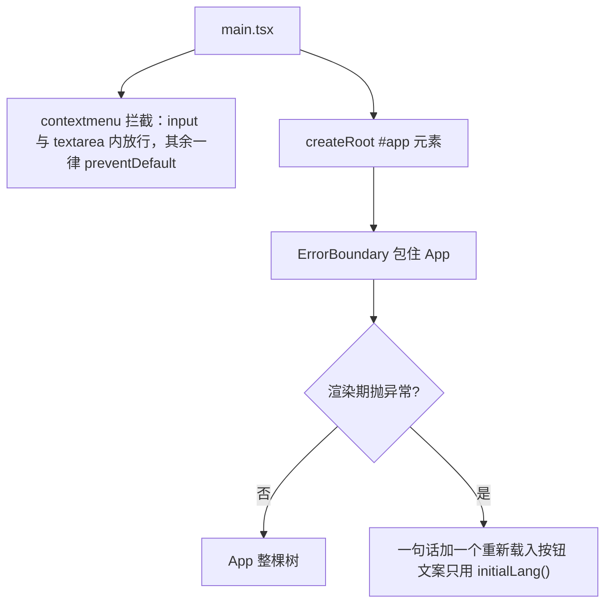
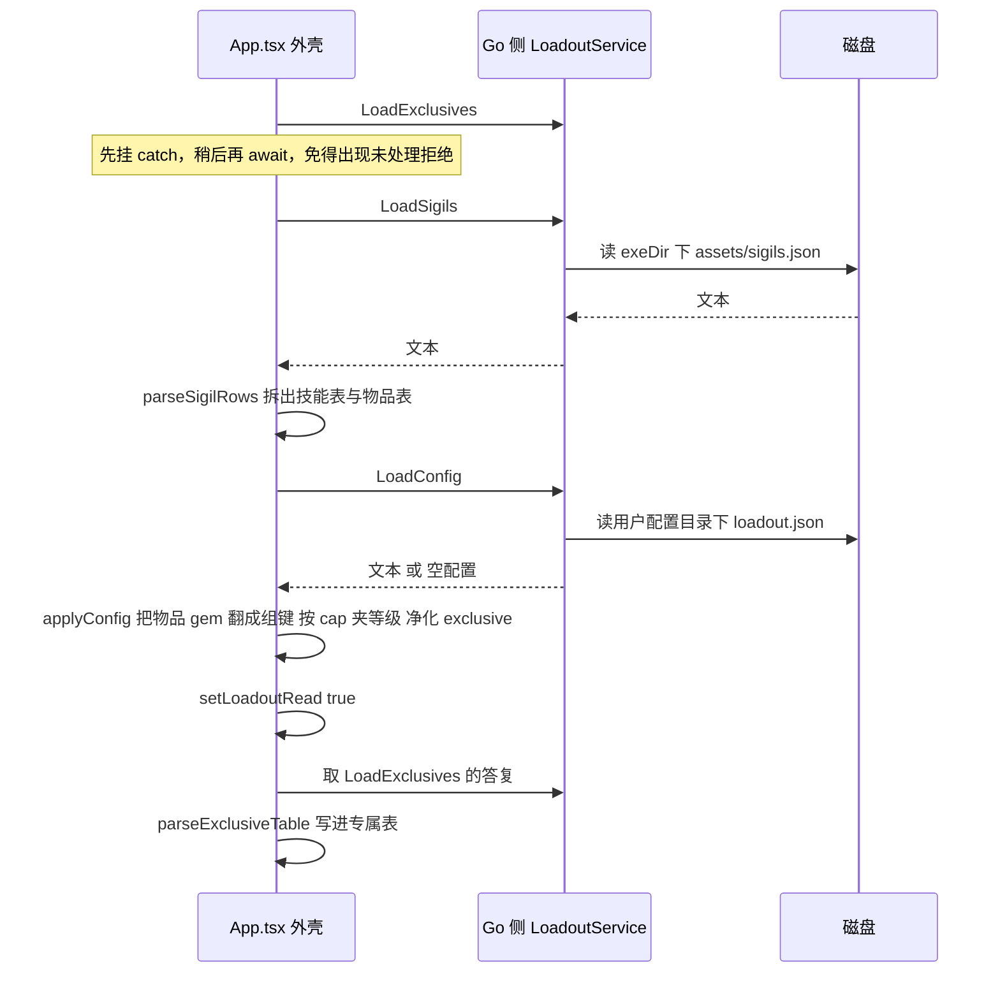
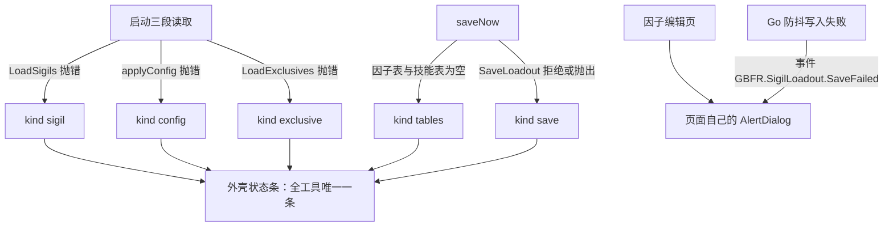
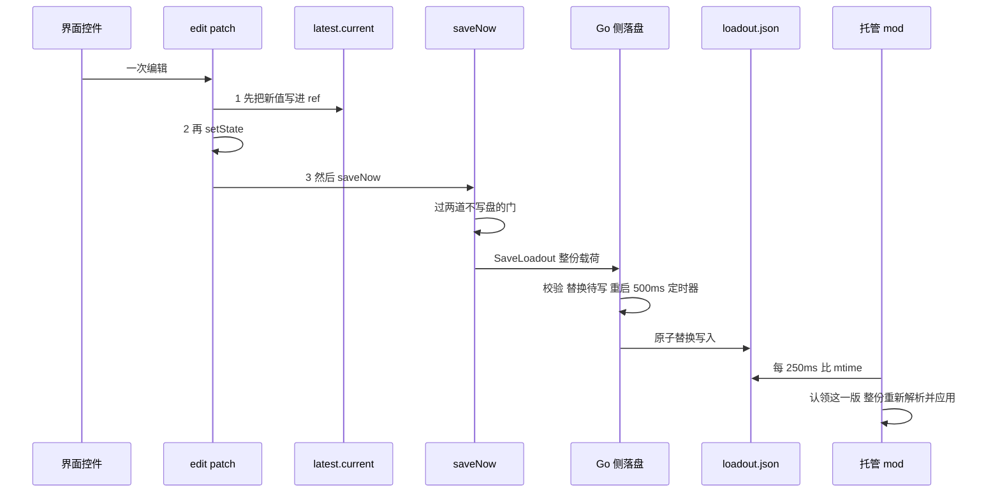
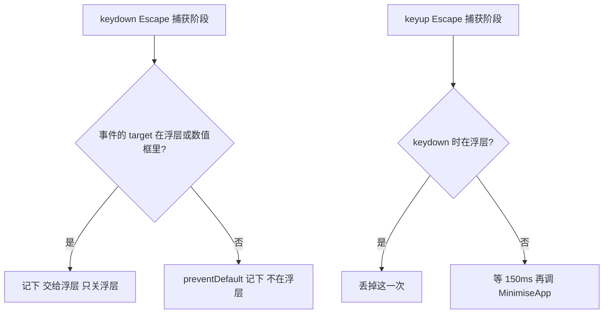

# 可视工具前端（React）：外壳状态、i18n 与落盘纪律

可视工具（`SigilLoadout.exe`）的界面是一个 Wails 应用里的 React 19 单页前端，资产由 `go:embed all:frontend/dist` 打进 exe。这一页只讲**前端这一个运行时域**：它自己的模块划分（哪一半是能脱离 React 与 DOM 测的纯逻辑、哪一半只能留在组件里）、外壳级的不变量（加载顺序、写盘顺序、页签与失败通道、键盘与焦点）、语言的三层分工，以及入口与构建约束。

以下内容**不在**本页，请点过去看：载荷字段规则、Go 侧校验与两道 mtime 门、托管侧的三段式应用在 [工作流：配装落盘与应用](/openwiki/workflows/loadout-apply.md)；`sigiledits.json` 的编辑记录规则与热应用在 [工作流：因子数值编辑与热应用](/openwiki/workflows/sigil-edit-apply.md)；两个文件的形状、常量对拍范围与「各只有一处声明」的纪律在 [两个配置文件与跨语言常量契约](/openwiki/concepts/config-file-contracts.md)；专属表的语义在 [虚拟槽位、专属因子与它们的开关语义](/openwiki/concepts/virtual-slots-and-exclusives.md)；Go 外壳、窗口三态与「前端 Esc 调到哪个 Win32 消息」在 [可视工具（Go + Wails）：装配、单实例与窗口状态机](/openwiki/architecture/visual-tool.md)。

## 模块地图：外壳、页面、纯逻辑、文案

前端的划界不是按文件夹，而是按**「这段规则能不能脱离 React 与 DOM 测」**：

| 位置 | 角色 |
| --- | --- |
| `main.tsx` | 入口：右键菜单策略（全局唯一一条）、`createRoot(#app)`、把 `App` 挂进 `ErrorBoundary` |
| `ErrorBoundary.tsx` | 渲染期异常的兜底：一句话 + 重新载入 |
| `App.tsx` | 唯一的外壳：全部跨页状态、加载时序、`edit`/`saveNow` 落盘链、页签、失败状态条、Esc 与焦点这两组全局监听 |
| `SlotEditor.tsx`、`SkillPicker.tsx`、`ExclusivePanel.tsx` | 「通用配装」与「专属因子」两页的行与控件 |
| `SigilEditorPanel.tsx`、`SkillRow.tsx`、`useRowTooltip.ts`、`useWheelStep.ts` | 「因子编辑」页：列表、行、tooltip 归属、滚轮步进 |
| `model.ts` | 因子表的**全部**派生关系（`buildSigilIndex`）、载入/落盘载荷、专属状态、变体解析 |
| `skills.ts` | 一条编辑记录的规则：什么算编辑、地址去重、输入框按键状态机、等级与说明文本 |
| `lang.ts` / `messages.ts` | 语言身份（有哪些语言、按什么猜）/ 四语文案表 |
| `style.css` + `components/ui/*` | Tailwind v4 + shadcn（Base UI 版）原语，加上外壳与列表自己的几条覆盖规则（文档不滚、失焦点时保住聚焦指示、`.skill-rows` 里的勾选框） |
| `bindings/` | **构建期生成物**，不入库（下一节） |

两条纪律写在这套划分里：

- **凡是由值单独决定的部分都不碰 React 也不碰 DOM**（`skills.ts` 的文件头），所以既能被 vitest 直接驱动，也意味着组件里只留渲染与事件。`skills.ts` 里最重的一条不变量是 `dedupe`：每个地址（`因子哈希#等级`）最多一条编辑，因为 mod 按顺序遍历列表、写进同一行的最后一条已启用的才生效；文件里仍可能有两三条，列表却只能显示一条。
- **因子表的派生关系只构造一处**（`buildSigilIndex`），一个对象替代七个 prop 传进每一行：下拉取值、显示名、等级上限、合法副集合、以及「保存时这个主因子该写成哪个物品 hash」。

### 组件层剩下什么

按上面那条划线，「值决定的部分」都走了，`SlotEditor` / `SkillPicker` / `SkillRow` / `ExclusivePanel` / `SigilEditorPanel` 里剩下的只有三类东西：把索引与规则算出的值画出来、把事件翻成对某个回调的一次调用、以及**只有 DOM 才知道的那几件事**。第三类正好四处，都值得单独说清，因为它们看起来像「随手写的细节」，其实是没法搬进纯逻辑的：

- **滚轮步进（`useWheelStep`）必须是原生监听器，而且 `passive: false`**：React 把 `wheel` 注册为 passive，写在 `onWheel` prop 里的 `preventDefault` 毫无作用——浏览器照旧滚动，而数值同时也在变。所以这个 hook 自己 `addEventListener("wheel", onWheel, {passive: false})`，并把两个回调放进 latest-props ref（一次注册要读到渲染中途才有的最新值，回调变了不该换监听器）。两个使用者各有各的「这一滚算不算数」：`SlotEditor` 的等级框要求数字框正持有焦点（否则滚轮不动它、列表照常滚），并把结果夹在 `min`/`max` 里；`SkillRow` 的十个参槽则按元素在容器里的位置找出是哪一个槽，边界由 `skills.ts` 的 `stepValue` / `MAX_VALUE` 给。
- **tooltip 归谁（`useRowTooltip`）**：行会在指针底下移动——一次勾选会把打开的内容排到最前——而 `enter`/`leave` 说不出「此刻指针下是哪一行」，所以列表这一层用 `document.elementFromPoint(...).closest("[data-row]")` 问文档，再把答案交给各行自己去比 `data-row`。两处配套的重放也在这里：Base UI 只在「打开它的那次事件是 mouseenter/mousemove」时才让弹层跟着光标，所以「指针进入」与「勾选之后重新指向」都要把进入过程在行上重放一遍；而一次勾选会让浏览器把仍然持有焦点的那个勾选框滚回视野，所以勾选之前记下 `scrollTop`，由同一个 layout effect 放回去。这份状态住在列表上，行只拿它跟自己的 id 比。
- **方向键与 Esc 归谁**：`SkillPicker` 的触发器在捕获阶段吞掉 `ArrowUp`/`ArrowDown`（Base UI 在触发器上按方向键就会打开列表），方向键才留给字段导航与数值输入框自己的步进；`SkillRow` 的数值框则 `preventDefault` 后自己步进（否则方向键会把光标移到框末尾，在一个可滚动列表上还会顺手把列表也滚了），并把 Esc 定义成 `e.currentTarget.blur()`（外壳那条「Esc 隐藏窗口」因此要把 `.skill-rows input` 当浮层排除，见下一节）。
- **正在输入的半成品文本暂存在组件里**：一个槽里的一次按键意味着什么、何时提交，由 `skills.ts` 的 `slotEdit` 作为数据返回（`drop` / `half` / `commit`），`SkillRow` 只负责渲染——`half` 的文本进 `halfTyped` 本地 state，`commit` 的 `values` 交上去，`commit.keeps` 让输入框在失焦前继续显示用户敲的那串文本（`0.0`、`0.00` 也是数字，用提交后的数字渲染会把后面输入的内容吃掉）。规则在 `skills.ts`，屏幕上怎么显示在 `SkillRow.tsx`，这条分工本身就是「组件没有单测也不慌」的原因（见测试边界一节）。

## 入口纪律：两行全局监听与一个兜底

`main.tsx` 只做三件事，顺序就是全部纪律：



入口顺序：右键菜单策略在挂载之前注册，渲染期异常由 `ErrorBoundary` 在 `App` 之外兜住。

两处都值得说明理由：

- **右键菜单**：WebView 里没有浏览器菜单，默认那条菜单对这个工具没有任何用处，唯一需要它的地方是输入框的原生编辑命令（复制/粘贴/全选），所以判据是 `closest("input, textarea")`。
- **`ErrorBoundary` 的文案只能用 `initialLang()`**：语言状态住在 `App` 里面，而 `App` 正是崩掉的那棵树——兜底界面拿不到用户选的语言，只能回到「系统猜一次」的那个答案。前端**没有错误上报通道**（零 console 是刻意的现状：发布构建的 WebView 里没人看得到控制台），所以兜底只给一句话和一个 `location.reload()`，而不是假装能诊断。

## 外壳状态与加载时序

`App.tsx` 拥有全部跨页状态：`skills`/`sigils`（因子表）、`slots`、`loadoutRead`、`failure`、`tab`、`exclusiveTable`/`exclusiveState`、`names`/`charaNames`、`lang`。派生索引由 `useMemo(() => buildSigilIndex(sigils, skills, names), [sigils, skills, names])` 重建——`names` 是唯一会随语言变的输入，重建只换标签：索引里的键始终是 hash（名字不是身份）。



加载时序：三条读取在同一个 effect 里发出，但 `LoadConfig` 必须排在因子表解出来之后，`loadoutRead` 只在这之后置位。

这张图里三处顺序的理由，都得写清：

1. **`LoadConfig` 排在 `LoadSigils` 解出来之后**：它要把存档里的物品 gem 翻译成下拉用的组键，并按技能自己的 cap 夹等级——`configToSlots(cfg, sigilTable, skillTable)` 需要那两张表。所以它不是「一起 await」的第三份，而是第二段的依赖。
2. **`LoadExclusives` 先发出、最后才 await**：promise 在第一时间创建，`catch` 当场挂上（否则中间任何一次 await 抛出都会把它变成未处理拒绝），真正的解析与 `setExclusiveTable` 放在第三段。
3. **三段各自 `try`，各自只写一条失败**：读因子表抛 → `kind: "sigil"`；`applyConfig` 抛 → `kind: "config"`（此时**仍要**把槽位铺成 `pad12([])`，屏幕上 0 行看起来像什么都没发生）；读专属表抛 → `kind: "exclusive"`。任一段失败都不许挡住后面的段。

这条 effect 的依赖数组是空的，而且是**刻意不读文案**：失败文案在渲染时由 `failureText(failure, t)` 取，所以没有语言依赖能把「只跑一次」重新触发。

### 单条失败通道

外壳只有一个失败槽：`type Failure = { kind: "sigil" | "config" | "exclusive" | "save" | "tables"; error?: unknown }`。所有失败都写进这一个状态，屏幕上**不可能出现两条互相矛盾的提示**；文案由 `failureText` 按 `kind` 从当前语言的 `Messages` 里取。



失败往哪里去：外壳五类失败共用一条状态条，因子编辑页另有自己的对话框。

状态条挂在**页签之外**（外壳那一层，`aria-live="polite"`），因为它是外壳级的通知：切到因子编辑页时，那两个配装页的「没保存成功」不该被静默吞掉。另一半是分工：因子编辑页的读取失败与写入失败走它自己的 `AlertDialog`（读不出编辑列表、`SaveEdits` 当场被拒，以及后端防抖之后才失败、只能以 `GBFR.SigilLoadout.SaveFailed` 事件到达的那一类）。注意事件的**唯一订阅者**在那个页面上，而它 `keepMounted`，所以配装那条路的防抖写入失败也复用同一个对话框——配装页自己没有监听者。事件名是**手抄的镜像常量**（`editservice.go` 的 `saveFailedEvent` 与 `SigilEditorPanel.tsx` 的 `SAVE_FAILED` 之间没有任何关联），改名必须同时改两处——Go 侧的 `sharedconstants_test.go` 有一道对拍断言专门盯着这两个字面量（每条声明必须**正好**匹配一次），所以单边改名是测试红，而不是那个对话框永远不弹。

## 落盘：一条因果链与三条纪律

前端**不写文件**：它每次编辑把整份状态（不是补丁）交给 Go，Go 替换待写并重启定时器。因果链如下。



编辑到落盘：写入顺序、两道门、Go 侧防抖与原子写、托管侧的 mtime 门，一环扣一环。

**纪律一：`edit` 内部的顺序不能换。** 处理器里 `setState` 要等它返回之后才提交，那时 `latest.current` 读到的还是上一次的状态，落盘就永远慢一次（最后一次勾选就是这么丢的）。所以 `edit(patch)` 是「先 `latest.current = {...latest.current, ...patch}` → 再 `setState` → 最后 `void saveNow()`」。`latest` 这个 ref 由 `useLayoutEffect` 写入而不是渲染期：渲染期写 ref 是 React 明令禁止的（会把一次从未提交的渲染里的值发布出去）。

**纪律二：自动保存只由编辑处理器触发，不由状态变化触发。** 挂在 `[slots, lang, exclusiveState]` 上的版本只能靠一个一次性旗标去赌「哪次状态更新先把它消费掉」，而加载期的任何一次额外 `setState` 都会让启动变成一次写盘（旧版本那次 `exclusive` 迁移就是这么把用户的开关状态改坏的）。现在没有旗标：加载不调用任何编辑处理器，就排不出保存。

**纪律三：两道「不写盘」的门。**

| 门 | 位置 | 违反后的症状 | 原因 |
| --- | --- | --- | --- |
| `loadoutRead` 未就绪 | `saveNow` 的第一行 `if (!loadoutRead) return` | 读配置失败时槽位被铺成 `pad12([])`，此刻交出的载荷会把磁盘上那份完整配置**整体替换**掉 | `setLoadoutRead(true)` 只在 `applyConfig` 成功之后执行 |
| 数据表为空 | `mainKeys.length === 0` 或 `skillHashes.length === 0` 时写 `kind: "tables"` | 交出去的会是一份「所有槽都被跳过」的载荷（空 id 会被下游拒掉整份文件） | 表没读到时给的是横幅，不是空载荷 |

两条与「谁生成文件内容」有关的边界事实：`loadout.json` 的**文本**是前端生成的（`JSON.stringify(payload, null, 2)`，两空格缩进），Go 只做形状校验然后原样原子落盘；`sigiledits.json` 相反——前端交的是结构体数组，序列化由 Go 用 `jsontext.WithIndent("  ")` 完成。字段规则、校验责任与 mtime 门本身都在 [工作流：配装落盘与应用](/openwiki/workflows/loadout-apply.md) 与 [两个配置文件与跨语言常量契约](/openwiki/concepts/config-file-contracts.md)。

### 语言切换就是一次编辑，代价是整份配装被重新应用

界面语言不走「工具自己的设置」，它存在 `loadout.json` 的 `lang` 成员里，所以右上角那三个按钮走的是**与勾选框完全相同的通路**：

```ts
onClick={() => { edit({lang: option}) }}
```

串起来的后果是跨系统的，必须一次说清：

1. `edit({lang})` → `saveNow()` → `SaveLoadout(整份载荷)` → 500ms 防抖后 `writeFileAtomic` 替换 `loadout.json`；
2. 原子替换写入的是一份新文件，所以这一版的 mtime 与上一版不同——写入侧刻意让 mtime 成为一个可用的版本号（防抖至少隔开两次落盘，远大于 mtime 粒度），而托管侧版本门 `LoadoutConfig.Stamp` 的 `Changed()` 判据就是 mtime **相等**、不看内容，于是「只换了 `lang`」与「改了一整套槽位」是同一件事；
3. `Changed()` 的语义是「认领后处理」，于是这一版被 `TryApply` 拿去重新 `ParseAndValidate` + `NativeCore.ApplyLoadout`——**整份配装被重新解析并应用到原生侧**，即便用户只是想把界面换成日文；
4. 而 C# 侧**完全不读** `lang`（它的注释就是「`lang` 只有可视工具在意」）：这个成员是纯工具状态，却寄居在唯一一条跨进程契约里，所以它的每一次变化都要付一次整份应用的钱。

配套的一条小契约：`LoadConfig` 在文件不存在时返回 `{"lang":"","slots":[]}`。空串不在 `LANGS` 里，`applyConfig` 的 `if (LANGS.includes(cfg.lang))` 于是失败，前端保留 `initialLang()` 那次猜测——把 `lang` 写死成 `"zh"` 会让日/韩/英文系统的新用户第一眼看到中文。

### 更细的一条：`exclusive` 的键与写入形状

「专属因子」页每次点击都走 `edit({exclusiveState: …})`，也就是走同一条落盘链。落盘键是**角色 hash**（身份）而不是屏幕上的 PL 码：古兰/姬塔共享 `PL0000`，一次点击要写到共享该码的每个角色上，面板才继续是一行。规则（只写 `false`、打开就删键、条目空了整条删）在 `model.ts` 的 `withExclusiveToggle` 里，落盘前还要过 `sanitizeExclusiveState`（丢掉原型键与非 `false` 的值）——手改过的文件因此不能污染编辑器状态，也不会因为「收下了 `true`」而在下一次自动保存时被原样写回。

## 三个页签：都 `keepMounted`

页签是「通用配装 / 专属因子 / 因子编辑」（界面文案按游戏自己的说法，见文案一节）。三个 `TabsPanel` 全部 `keepMounted`，两页配装共用同一个滚动盒子类 `LOADOUT_PANEL`（因子编辑页自带内边距与滚动，不套它），而**没有一个「不在这一页就整块不渲染」的分支**。

两条理由，两条都是「卸载会丢东西」：

- **配装页**：不 `keepMounted` 的话，每次切页都要卸载/重挂整表 `SlotRow`，而每行带两个 Base UI 下拉——切页于是从「显示/隐藏」变成一次真实的重建。代价是三页在启动时都挂上（专属页的行数是固定的几十行，可忽略）。
- **因子编辑页**：这一页的编辑状态（`edits` 这个按地址索引的 Map）活在组件里，而后端要等 500ms 防抖才落盘。切走就卸载的话，在防抖窗口内切回来会读到**还没写下的旧文件**——屏幕上刚敲的数字消失，随后那份旧列表还会把磁盘上的新值覆盖掉。这一页同时用 `memo` 包住，免得 App 的每次重渲染都连带它。

与这套滚动盒子配套的外壳规则写在 `style.css`：`html, body { overflow: hidden }`，外壳钉在窗口上，只有列表自己滚。否则一个落在折线以下、而滚轮还在转的 tooltip 会短暂撑大可滚动区域，窗口自己的滚动条于是从右边冒出来——它要从视口里拿走宽度，整个外壳被推得向左一跳，等它消失才弹回来。

## 键盘与焦点：两组全局监听

这两组监听都注册在 `document`/`window` 上、写在 `App.tsx` 里，因为「Esc 归谁」和「焦点指示还亮不亮」都是外壳级的判断。

### Esc：捕获阶段听两次，浮层优先



Esc 的两条路：浮层内归浮层，浮层外才把窗口假隐藏，而且推迟到 keyup 之后。

细节都不是随手写的：

- **捕获阶段**是必需的：Base UI 会在 React 处理 `keydown` 时卸载弹层，冒泡阶段的监听器会看到一个已经摘下来的 target，从而错判成「不在浮层」而把窗口藏掉。
- **同时听 `keydown` 与 `keyup`**，且浮层判断只在 `keydown` 做，结果留给 `keyup` 用。两条路都会赋值，丢一次 `keyup` 不会把下一次 Esc 也吞掉。
- **推迟到 `keyup` 才隐藏**（再等 150ms）：`keydown` 就藏掉的话，这一记 `keyup` 会落到已经拿到焦点的游戏窗口上。真正的隐藏动作是绑定 `MinimiseApp()`，之后走的是 [可视工具（Go + Wails）](/openwiki/architecture/visual-tool.md) 里那条 `hideToTray` 状态机。
- **哪些东西算浮层**由选择器给出：`[data-slot="combobox-content"]`、`[role="dialog"]`、`[role="alertdialog"]`，以及 `.skill-rows input`——最后这一项是因子编辑页的十个参槽：那一页把 Esc 定义成「放开这个框」（`e.currentTarget.blur()`），不该同时把整个窗口藏到托盘去。
- **菜单热键不在这里处理**：它是 mod 的全局注册，按一下就是开关这个窗口。
- **另一半键盘判断不在外壳里**：下拉触发器吞方向键、数值框自己步进与 blur，那些是组件层的规则（见「组件层剩下什么」）；外壳只管「不在浮层里就把窗口藏起来」这一层。

### 失焦时保住聚焦指示

窗口失活那一刻，`:focus` / `:focus-visible` 会被判掉（指示灭），而 DOM 焦点其实还在框里——「切到游戏改完数据再切回来接着输」靠的就是它。所以外壳在 `window` 的 `blur` 上给仍持有焦点的元素挂一个 `data-focus-hold` 属性，在 `focus` 上摘掉（卸载时也摘一次），由 `style.css` 把聚焦指示补齐：

```css
[data-slot="input-group"]:has([data-focus-hold]) { @apply border-ring ring-3 ring-ring/50; }
```

补的值必须与 `components/ui` 里的聚焦类一致，否则「窗口失活」与「窗口激活」下同一个框会有两种样子。有一处**有意的取舍**写在 `style.css` 里：因子编辑页的十个数值框不补——深色主题下编译产物把 `focus:bg-muted/50` 压掉了（与 `dark:bg-transparent` 同特异性且排在后面），补了反而与聚焦态不同，于是两边都不补；代价是浅色主题下失活那一刻聚焦底色会消失，而本项目只在深色下使用。

## 语言：三层分工

界面语言的三个问题分属三个不同的变化原因，所以住在三个地方：

| 问题 | 住哪 | 变它的时候 |
| --- | --- | --- |
| 这个可视工具支持哪几种语言、每种在切换键上叫什么、系统要哪一种 | `lang.ts`：`LANGS`、`LANG_LABEL`、`initialLang()` | 加一种语言 |
| 界面每一句话长什么样 | `messages.ts`：`zh` 这一份就是形状（`Messages = typeof zh`），其余语言按它填 | 改一句话 |
| 因子的名字、效果概要、等级说明 | Go 侧随包资产：`sigils.lang.json` / `chara.lang.json` / `skill.<lang>.json`，前端只按语言取一次 | 改游戏文本的呈现 |

几条不变量：

- **语言身份只存一处**：`loadout.json` 的 `lang`，不进 `localStorage`。同一个窗口里两套语言状态的话，用户在一页切的语言不会带到另一页（这一页原来那组按钮连同它自己的 `localStorage` 就是因此删掉的）。
- **`initialLang()` 是整个工具唯一一处「系统要什么语言」的猜测**，只在配置里还没写语言时用一次：`navigator.language` 与四个码互不为前缀，所以「谁先谁后」不影响结果，猜不中回落 `en`。
- **四种语言一种都不能漏是编译期检查**：`messages: Record<Lang, Messages>`——加一种语言只改 `lang.ts` 而忘了 `messages.ts`，`tsc` 当场报错，四语齐备不靠人眼。
- **`LANGS` 在 Go 侧有一份手抄的副本**：`loadAssetsFrom` 里硬编码着 `[]string{LangZH, "en", "ja", "ko"}` 去读四份 `skill.<lang>.json`。加第五种语言要同时动 `lang.ts` 与那一行；只动前端的话，界面文字是新语言而因子名会经 `pick` 回落到中文。
- **界面文案与术语表是两回事**：`CONTEXT.md` 约束代码与文档的用词，但玩家看到的界面按游戏自己的说法——「主因子 / 副因子 / 专属因子 / 因子编辑」。`messages.ts` 的文件头把这条写明了，而且「因子」那三种语言用的是游戏自己的译名（英文 sigil、日文 ジーン、韩文 진），不是音译。

### 显示名：启动期读一次，按语言缓存一次

界面文案是打包在 `dist` 里的常量，**显示名不是**：它们来自游戏文本表，由 Go 侧在启动时读进内存——`sigils.lang.json`、`chara.lang.json`、`skill_status.json`，以及四份 `skill.<lang>.json` 全部无条件读进来，缺一份就是坏安装（`main()` 里 `fatalDialog`）。之后前端按语言取一次并缓存：

- `App.tsx` 的模块级 `nameCache` 按 `Lang` 缓存 `{names, charas}`；命中就同步 `setState`，标签与外层文字同一帧换掉，否则会先显示旧语言的名字、等 IPC 回来再跳一次。
- `SigilEditorPanel.tsx` 的模块级 `textCache` 同理，用 `Call.ByName("main.EditService.SkillMap", lang)` 一次取整张表（而不是每行一次调用）。
- **取不到名字时回落成裸 hash，而不是换一种语言的名字**：`SkillPicker` 里的 `labels?.[skill] ?? skill`、`model.ts` 里的 `names[tr.gem] ?? tr.hash`、`ExclusivePanel` 里的 `charaNames[e.player] ?? e.player` 都是同一条规则——看得见但不好看，比显示一个别的语言的名字强。`exclusive.test.ts` 专门钉住「名字缺失时显示 hash」。
- `document.documentElement.lang` 跟着 `lang` 走：`index.html` 里写死的那一个只够第一次渲染，读屏软件看的是这个属性。同一类细节在切换按钮上也有一条：每个按钮带 `lang={option}`，字体按它自己那门语言选，否则字体会跟着文档语言换、切语言时粗细就变了。

## 构建约束：`bindings/` 是生成物

`frontend/bindings/` 是 `wails3 generate bindings` 的产物，被 `SigilLoadout/.gitignore` 忽略，而 `App.tsx` **直接 import 它**：

```ts
import {LoadSigils, LoadConfig, SaveLoadout, MinimiseApp, LoadExclusives, GemNames, CharaNames} from "../bindings/sigilloadout/loadoutservice"
```

由此定下三条约束：

- 检出里没有 `bindings/`，`npm run typecheck` 与 `vite build` 都会红，所以在构建里生成它的那一步必须排在两者之前——顺序、失败出口与其余门禁见 [构建、发布与部署链](/openwiki/operations/build-and-release.md)。
- `tsconfig.json` 因此保持 `noImplicitAny: false`：生成的 `*.js` 没有 `.d.ts`，打开这一项只会在那一句 import 上报 `TS7016`。`bindings` 同时被列进 `include`。
- `vite.config.ts` 里 `wails("./bindings")` 这个插件带着同一个路径，所以开发态与构建态用的是同一份生成物。

前端的绑定调用方式**有两种**，这是现状而不是设计目标：

| | 谁在用 | 形式 |
| --- | --- | --- |
| 生成的模块 | `App.tsx`（用到的七个 `LoadoutService` 方法） | import `../bindings/sigilloadout/loadoutservice`，生成代码内部走 `Call.ByID(<数字 id>)` |
| 字符串派发 | `SigilEditorPanel.tsx`（`EditService` 的 `LoadEdits` / `SkillTable` / `SkillMap` / `SaveEdits`） | `Call.ByName("main.EditService.<方法>")`，`SERVICE` 常量在文件头 |

加一个 `EditService` 方法时，第二种风格不需要碰生成物，但代价是**服务名与方法名成为手写字符串**：Go 侧改名不会有任何编译期报错，只会在运行时失败。相应地，防抖失败事件的字符串同样是手抄的（见失败一节）。

## 测试边界

外壳与组件**没有单元测试**：`App.tsx`、`SlotEditor.tsx`、`SkillPicker.tsx`、`SkillRow.tsx`、`ExclusivePanel.tsx`、`SigilEditorPanel.tsx` 都不在覆盖范围内——它们的规则已经被抽到 `model.ts` 与 `skills.ts`，剩下的渲染与事件只能人工在工具里点。四个测试文件刻意薄：`index.test.ts` 与 `variant.test.ts` 打 `model.ts`（跑的是**入库的真实 `sigils.json`**，不是手搓夹具），`exclusive.test.ts` 打专属状态与名字表，`skills.test.ts` 打输入框的按键状态机与「什么算编辑」。测试环境是纯 node：`package.json` 的依赖里没有任何 DOM 测试库（没有 `jsdom`、没有 `@testing-library`），所以**本页讲的这些外壳行为（加载顺序、Esc、焦点保持、页签）没有任何自动化验证**。唯一伸进这份前端代码的自动化是 Go 侧的对拍断言——`sharedconstants_test.go` 读 `SigilEditorPanel.tsx` 的**源码文本**去比那个事件名——它比的是字符串，不是行为。各测试分别护住什么、这套验证证明不了什么，见 [验证地图：测试与门禁各护什么](/openwiki/testing/verification-map.md)。

## 不变量与失败语义

| 不变量 | 违反后的症状 |
| --- | --- |
| `edit` 里先写 `latest.current`、再 `setState`、最后 `saveNow` | 落盘永远慢一次：最后一次勾选/输入丢掉 |
| `latest` 由 `useLayoutEffect` 写，不在渲染期写 | 一次未提交的渲染里的值被发布出去，读到的状态与屏幕不一致 |
| 自动保存只由编辑处理器触发 | 加载期任一次额外 `setState` 把启动变成一次写盘，用户的配置被空状态整体替换 |
| `loadoutRead` 之前绝不写盘 | 读配置失败后交出的 `pad12([])` 载荷覆盖磁盘上那份完整配置 |
| 因子表/技能表为空时不写盘，只给横幅 | 一份「所有槽都被跳过」的载荷被判成空配置 |
| 失败只有一条通道 | 屏幕上出现两条互相矛盾的提示，或一条被静默吞掉 |
| 三个页签都 `keepMounted` | 在 500ms 防抖窗口内切走再切回：刚敲的数字消失，旧列表随后覆盖磁盘上的新值 |
| Esc 的浮层判断只在 `keydown` 做、隐藏推迟到 `keyup` | 弹层还在屏幕上却被判成「不在浮层」，或那记 `keyup` 落进游戏窗口 |
| Esc 在捕获阶段监听 | 冒泡阶段看到的是已被摘下来的 target，判成不在浮层 |
| `useWheelStep` 的 `wheel` 监听器必须是原生的、`passive: false` | React 的 `wheel` 是 passive，`preventDefault` 无效：列表跟着滚，而数值也同时变了 |
| 方向键在下拉触发器上由捕获阶段吞掉 | 聚焦触发器时按一下方向键就打开列表，而不是做字段导航或数值框步进 |
| 文档不滚（`html, body { overflow: hidden }`） | 一个撑大可滚动区域的 tooltip 让窗口自己的滚动条冒出来，整个外壳被推得向左一跳 |
| 取不到显示名时回落成 hash | 用别的语言的名字冒充当前语言 |
| `messages` 必须四语齐备（`Record<Lang, Messages>`） | 少一种语言的 `tsc` 就红，不会漏到运行期 |
| 加语言要同时动 `lang.ts` 与 Go 的 `loadAssets` 四语言列表 | 界面文字换了语言，因子名回落成中文 |
| `bindings/` 必须在 typecheck 与 `vite build` 之前生成 | 缺生成物时 typecheck 与打包直接失败（好在是失败，不是静默降级） |

## 相关页面

- [可视工具（Go + Wails）：装配、单实例与窗口状态机](/openwiki/architecture/visual-tool.md) —— 前端之外的那一半：窗口三态、托盘、关机钩子，以及 `MinimiseApp()` 落到哪条 Win32 消息。
- [工作流：配装落盘与应用](/openwiki/workflows/loadout-apply.md) —— 载荷字段规则、Go 校验、mtime 门与原生 `ApplyLoadout`。
- [工作流：因子数值编辑与热应用](/openwiki/workflows/sigil-edit-apply.md) —— 「因子编辑」页交出去的那份列表之后发生什么。
- [两个配置文件与跨语言常量契约](/openwiki/concepts/config-file-contracts.md) —— `loadout.json` / `sigiledits.json` 的形状、缺失语义与对拍范围。
- [虚拟槽位、专属因子与它们的开关语义](/openwiki/concepts/virtual-slots-and-exclusives.md) —— 专属页那些开关在原生侧的语义。
- [外部生成器 gen 与随包数据资产](/openwiki/integrations/external-generator-and-assets.md) —— 前端要取名字与说明的那几份语言表是谁生成的。
- [构建、发布与部署链](/openwiki/operations/build-and-release.md) 与 [验证地图：测试与门禁各护什么](/openwiki/testing/verification-map.md) —— `bindings` 的生成顺序、门禁顺序，以及前端测试护住什么、证明不了什么。
