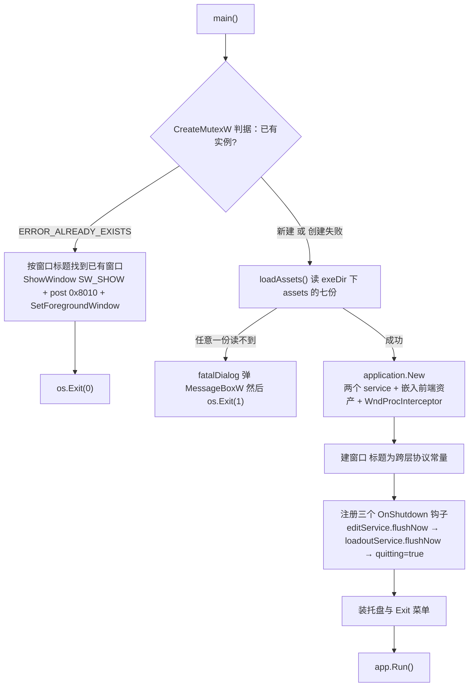
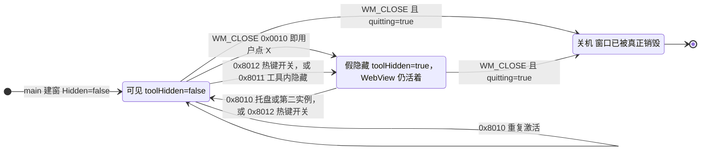

# 可视工具（Go + Wails）：启动外壳、两个服务与窗口状态机

可视工具是三个交付单元里唯一有界面的那个：独立进程里的一个 Wails v3 应用（Go 主程序 + `go:embed` 的 React 前端 + 一个托盘图标），产物就是 mod 目录下的 `SigilLoadout.exe`。它与游戏进程**没有任何进程内联系**——往外只伸两条线：磁盘上两个 JSON（它写、托管 mod 读）和几条 Win32 窗口消息（`0x8010` / `0x8012`，托管侧与工具之间不传任何数据）。两条线的边界在 [系统总览](/openwiki/architecture/overview.md) 里；两个文件的形状、校验与 mtime 语义在 [两个配置文件与跨语言常量契约](/openwiki/concepts/config-file-contracts.md)。

这一页讲这个进程自己的五件事：**启动期的两个出口**（单实例判定、坏安装）、**应用装配**（两个 service 与它们暴露给前端的绑定、嵌入的前端、窗口尺寸、托盘、关机钩子）、**窗口显隐状态机**（假隐藏/还原、焦点归还、X 按钮与热键）、**写侧那套落盘机制**（防抖、原子替换、退出时兜底），以及它**读写的两个目录**（随包的 `exeDir()\assets\` 与用户配置的 `%LOCALAPPDATA%\GBFRSigilLoadout`）。前端 shell 自己的职责（页签、语言切换、焦点保持、文案表）在 [可视工具前端 shell](/openwiki/architecture/visual-tool-frontend.md)，本页只在两条链交叉的地方记一句结论。

## 启动顺序：两个出口都排在装配之前

`main()` 的顺序是有意的：单实例判定在最前，随包资产读在第二，两者的失败出口都在"装配一个 Wails 应用"之前——坏安装不该先起一个窗口再报错。

启动顺序：单实例判定与随包资产加载都先于任何 Wails 装配，两者的失败各有唯一出口；三个关机钩子排在 `app.Run()` 之前。

### 单实例：只创建、不持有

判据是 `CreateMutexW` 对命名互斥体 `Local\GBFRSigilLoadout` 返回的 `ERROR_ALREADY_EXISTS`。这条路径刻意**没有** `WaitForSingleObject`，因此也没有"释放"可做（对不拥有的互斥体调 `ReleaseMutex` 只会以 `ERROR_NOT_OWNER` 失败）；句柄也故意不 `CloseHandle`——命名对象活到进程退出，而那正是这个判据需要的时间窗。`CreateMutexW` 本身失败（`handle == 0`）时只记一行日志，然后**无锁继续**：宁可两个实例并存，也不要起不来。那行 `syscall.UTF16PtrFromString` 的转换必须内联在实参里，因为 `uintptr` 不是 GC 引用，存进变量后那块 UTF-16 缓冲可能在真正调用前就被回收。

第二次启动的行为是"激活已有窗口然后退出"：按窗口标题 `FindWindowW` 找到已有窗口，`ShowWindow(hwnd, SW_SHOW)`、`PostMessage(hwnd, 0x8010)`、`SetForegroundWindow(hwnd)`，随后 `os.Exit(0)`。注意它 post 的是 `0x8010`（激活）而不是 `0x8012`（开关）：**只有热键是开关，重复启动 exe 永远是"显出来"**。又因为 `ensureSingleInstance()` 是 `main()` 的第一句、排在 `loadAssets()` 之前，第二次启动不会因为自己那份 `assets\` 有问题而弹框。

### 坏安装的唯一出口

`-H windowsgui` 链接出来的 exe 没有控制台（`tools/build-release.ps1` 的 `go build -ldflags "-H windowsgui -s -w"`），写到 stderr 没人看得见。所以"随包数据读不到"这件事只有一条出路：`fatalDialog` 用 `MessageBoxW`（`MB_ICONERROR`）说清缺的是哪一份、它应当与 `SigilLoadout.exe` 一起放在 `assets\` 下，然后 `os.Exit(1)`。触发点只有一处：`main()` 里 `loadAssets()` 返回错误。

## 装配：一个进程里的三半

装配本身很短，但每一行都对应一个改错就会出症状的决定。

### 两个 service 与嵌入式前端

`application.New` 注册两个 Go 侧后端：`LoadoutService`（配装与显示名）与 `EditService`（因子数值编辑）。它们的导出方法就是前端能调用的全部后端面，而前端够到它们的方式有两条：

- `LoadoutService` 那七个方法走**生成好的绑定模块**——`App.tsx` 从 `../bindings/sigilloadout/loadoutservice` 直接 `import`（`SaveLoadout`、`LoadConfig`、`MinimiseApp`…）；模块由此处的 Go 方法签名生成，改签名不重新生成就编不过 `typecheck`。
- `EditService` 那四个方法走**按名调用**：因子编辑面板写的是 `Call.ByName("main.EditService." + 方法名)`（`LoadEdits` / `SaveEdits` / `SkillMap` / `SkillTable`），那个服务名前缀是前端里的手写字面量，与 Go 侧类型之间没有任何编译期检查。同一个面板里 `saveFailedEvent` 的字面量也是照抄一遍（见下文）。

前端的资产走 `go:embed all:frontend/dist`，由 `AssetFileServerFS(assets)` 作为资源处理器。

这条嵌入是**编译期**的，于是引出两条构建期约束：`frontend\dist\`（vite 的产物）与 `frontend\bindings\`（`wails3 generate bindings` 的产物）**都不入库**（见 `SigilLoadout/.gitignore`）。所以先跑 bindings 生成、再跑 `npm --prefix frontend run build` 是不可省的两步——没有 `frontend\dist\` 时 `go:embed` 匹配不到文件，`go build` 直接失败。发布链的完整顺序（bindings → `typecheck` → 前端测试 → `npm run build` → `wails3 generate syso` → `go vet` → `go test` → `go build`）见 [构建与发布](/openwiki/operations/build-and-release.md)。

**随包数据一份都不嵌进 exe**：源码树里 `SigilLoadout\assets\` 与打包后 `<mod>\assets\` 是同一个布局，所以既没有也不需要"开发副本"（见 [外部生成器 gen 与随包数据资产](/openwiki/integrations/external-generator-and-assets.md)）。

Windows 选项里两个开关决定了整条显隐链的可行性：`DisableQuitOnLastWindowClosed: true`（关掉最后一扇窗口不等于退出进程，所以 `WM_CLOSE` **可以**被改写成"假隐藏"），以及 `WndProcInterceptor: handleWndMsg`——这一版 Wails 没有暴露 `WebviewWindow` 的 HWND 取用口，于是每条消息都兼作一条针对该窗口的命令。

### 窗口尺寸约束与其它编译期字面量

Wails v3 的尺寸是**整扇窗口外框（含标题栏）**的 DIP。初值 `Width: 888 + 16`、`Height: 840`；下限 `MinWidth: 760 + 16`、`MinHeight: 560`。

关键的一条：**最小宽度取的是较窄那页需要的 760，而不是因子编辑页的 888**。把下限钉在 888 上，窗口就再也缩不动；低于 888 时因子编辑页横向滚动，而不是把列切掉。两个宽度在源码里都写成 `<数> + 16`（所以实际下限是 776、初值是 904），而尺寸这一整套的口径是"整扇外框（含标题栏）的 DIP"。560 是**挑的**下限而不是量出来的——两页里每个列表都能滚，窗口矮了只是少显示几行、不破布局。

这些数字是**编译期字面量，不是设置项**，原因很直接：可视工具没有自己的设置文件。它唯一写盘的东西是 `loadout.json` 与 `sigiledits.json` 这两份**给 mod 看的数据**（连界面语言也住在 `loadout.json` 的 `lang` 里），所以没有地方可以承载一个"窗口宽度"配置；改它只能改源码并重编。

同一类常量还有一批，其中几个是**跨语言协议的字面部分**，改错不会编译失败、只在游戏里表现成错值：

| 字面量 | 值 | 为什么它是常量而不是可配置项 |
| --- | --- | --- |
| 窗口初值 / 下限 | `888+16` / `760+16` / `840` / `560` | 没有设置文件可承载；下限是"较窄那页不横向滚动"与"还能缩"之间的取舍 |
| 启用槽上限 `MaxSlots` | `16` | 只数**启用**行；Go / C# / TS 三处对拍。它既不是游戏本体的槽数，也不是虚拟槽容量（原生 `kVirtualSlotCapacity` 是 24 = 3 内置专属 + 21 通用），所以**"调大上限"的边界由原生通用槽容量决定**：`TestVirtualSlotCapacityFitsPlayerSlots` 要求它不超过 24 − 3 = 21，超了不会报错、只会被原生静默截断——见 [虚拟槽位、模板因子与专属开关](/openwiki/concepts/virtual-slots-and-exclusives.md) |
| 参槽数 `LevelValueCount` | `10` | 一行技能数值有十个参槽，Go / C# / TS 三处对拍；写多写少都只在游戏里看得出来 |
| 防抖窗口 `debounceDelay` | `500ms` | 它是"一串按键只换来一次写入"的取舍值，只在工具进程内可见 |
| 窗口标题 `toolWindowTitle` | `GBFR Sigil Loadout` | 托管侧按同一个字符串 `FindWindow`；改了就要两边同时改 |
| 两条消息 `wmActivate` / `wmToggle` | `0x8010` / `0x8012` | 同上，托管侧 `Hotkey.cs` 声明的是同一对值 |
| 互斥体名 `mutexName` | `Local\GBFRSigilLoadout` | 单实例判定的凭据，只在工具进程内可见 |

其中跨语言的那几组由 `SigilLoadout/sharedconstants_test.go` 对拍（`TestSharedConstantsAgreeAcrossLanguages`）：它证明的是"这些字面量当前两两相等"，不是"边界已证明"。同一道门也钉着本页依赖的另外几组字面量：用户配置目录名、`loadout.json` / `sigiledits.json` 两个文件名、`sigiledits.json` 的五个成员名，以及"保存失败"那个事件名——Go 发、前端收，两边各写一份。唯一的例外是 `0x8011`（工具进程内 post 的假隐藏命令）：它没有第二处声明，所以不在对拍名单里。

### 托盘与退出

托盘是 `app.SystemTray.New()`：`SetIcon(trayIconBytes)`、`SetTooltip(toolWindowTitle)`、`AttachWindow(win)`，左键 `OnClick` 起一个 goroutine 走 `trayOnClick()`，菜单只有一项 `Exit` → `app.Quit()`。这里刻意**不**调 `tray.Show()`：`app.Run()` 之前 `SystemTray` 的 impl 还是 nil，`Show()` 会立刻返回。托盘的图标必须是 `.ico`：Wails 对 PNG 会把原图直接交给 `CreateIconFromResourceEx`，alpha 被处理坏（实测渲染暗一半、没有白），只有 ICO 才按 `SM_CXSMICON` 挑精确档位。同一份 `icon.ico` 也是 exe 的链接期资源（`tools/build-release.ps1` 用它跑 `wails3 generate syso`），所以托盘、标题栏与任务栏本来就是同一张图；`go:embed` 进来的 `icon.png` 只在 macOS/Linux 用，Windows 上不喂标题栏（Wails 的 `setIcon` 在那里是空实现）。

那次 `generate syso` 同时吃 `-icon icon.ico` 与 `-manifest SigilLoadout\app.manifest`，而那份清单刻意只保留 `asInvoker` 这类最小内容、**不写** `dpiAware` / `dpiAwareness`：DPI 感知一直由 Wails 运行时自己设置（`setupDPIAwareness`），在清单里再声明一份就等于顺手改了行为——图标这件事不该带这种副作用。

`trayOnClick()` 的两条纪律值得记住：只在"窗口不是前台"或"正假隐藏"时才 post `0x8010`（否则每个左键点击都会重放一次激活），并且整段带 `recover`——它跑在一个无人接管的 goroutine 里。

### 关机钩子的顺序

`app.OnShutdown` 依次注册三个钩子：`editService.flushNow`、`loadoutService.flushNow`、以及 `func() { quitting.Store(true) }`。三个钩子绑定的正是 `main()` 里创建的那两个 service 实例——防抖的状态住在实例里，新建一个实例来 flush 等于什么都没写。

- 前两个兜住防抖里还压着的那份编辑。两个 service 的落盘都是 500ms 防抖（`debouncedWriter`），窗口可能在防抖窗口里就被关掉，而**刚做的那次编辑才是用户想留下的**；`flushNow` 取走待写（取走即消费），所以它和定时器都不会写第二遍。
- 第三个是时序不变量：框架 `cleanup()` 里的 `shutdownTasks` 跑在 `window.Close()` **之前**，`quitting` 必须先立起来，否则下面那记 `WM_CLOSE` 会被状态机当成"用户点了 X"而改成假隐藏——顺带在退出路上抢一次游戏前台并注入一次点击。

退出路径因此只有一条：`app.Quit()`（托盘菜单 `Exit`）→ `OnShutdown` → 框架 `cleanup()` → `window.Close()` → `WM_CLOSE`（此时 `quitting` 已为真，交回默认处理，窗口真的销毁）。

## 窗口显隐状态机

状态机只有两个可见态加一个终态：**可见**、**假隐藏**、**关机（窗口已销毁）**。三个态之间靠四条消息和工具内部的调用切换，全部由 `windowstate.go` 拥有。

窗口三态与触发消息：非退出流程下的 WM_CLOSE 只是换个可见态，只有 quitting 已置位时它才真的销毁窗口。

### 三条自定义消息

三条消息都落在 `WM_APP`（`0x8000`）之后的自定义区，语义按"谁 post"划分：

| 消息 | 值 | 谁发 | 处理 |
| --- | --- | --- | --- |
| `WM_CLOSE` | `0x0010` | 用户点标题栏 X；关机时由框架 `window.Close()` 发 | `quitting` 为真→交回默认处理（真销毁）；否则假隐藏 |
| `wmActivate` | `0x8010` | 托盘左键、第二个实例（两条都在工具自己那侧） | 记下抢焦点前的前台窗口 → 必要时 `revealTool` → `Restore`/`Show`/`Focus` |
| `wmFakeHide` | `0x8011` | 工具自己（`hideToTray`，即前端 Esc 那条路） | `hideNow`，必须跑在 UI 线程 |
| `wmToggle` | `0x8012` | 游戏内热键（执行者是托管侧 `Hotkey`） | 记下前台窗口 → 按 `toolHidden` 决定呼出还是收起 |

`0x8010`、`0x8012` 与窗口标题是**跨层协议常量**：托管侧 `Hotkey.ToolWindowTitle` 用同一个字符串 `FindWindow` 找窗口（找不到就 `Process.Start` 拉起 `SigilLoadout.exe`），`Hotkey.WmActivate` / `Hotkey.WmToggle` 声明的是同一对值，`SigilLoadout/sharedconstants_test.go` 把它们对拍。不过托管侧当前唯一的调用点走的是 `ActivateWindow(existing, toggle: true)`，也就是说**热键这条路只 post `0x8012`**；`0x8010` 实际由工具那侧发出（托盘左键，以及第二个实例的激活路径）。`0x8011` 只在工具进程内 post，没有第二处声明，所以不在对拍名单里。任何不是这四条的消息（以及窗口还没建好、`win == nil` 时的一切消息）都以"未处理"返回，交回 Wails 的默认处理。

### 假隐藏是什么

"假隐藏"不是 `ShowWindow(SW_HIDE)`，而是把窗口外框留成 shown、内容不可见：

- `SetWindowLongW(GWL_EXSTYLE)`：加上 `WS_EX_LAYERED | WS_EX_TOOLWINDOW | WS_EX_TRANSPARENT`，清掉 `WS_EX_APPWINDOW`；再 `SetWindowPos(..., SWP_FRAMECHANGED)` 让改动生效。清 `WS_EX_APPWINDOW` 是必须的——它是 Wails 建窗口时为"有任务栏按钮"设上的，不清掉假隐藏期间图标还留在任务栏；`WS_EX_TRANSPARENT` 把光标交给下面的窗口，否则那只看不见的窗口还能被命中测试。
- `SetLayeredWindowAttributes(hwnd, 0, 0, LWA_ALPHA)`：整窗 alpha 0（等于鼠标穿透）。
- `EnableWindow(hwnd, FALSE)`：禁用输入并顺带移走焦点。

WebView 照旧渲染，所以再显出来**不白闪**，过程中也根本没有 `ShowWindow` 那一下切换。代价是：窗口整场都保持 shown，`IsWindowVisible` 再也分不出这两态——**要判断可见性只能读 `toolHidden`**。`revealTool` 是它的逆操作：加回 `WS_EX_APPWINDOW`、清掉 `WS_EX_TOOLWINDOW | WS_EX_TRANSPARENT`、alpha 调回 255、`EnableWindow(hwnd, TRUE)`。

`fakeHide` 只 `PostMessage(0x8011)`，真正的动作在 `hideNow` 里跑，因为它必须在**窗口自己的 UI 线程**上执行：`SetForegroundWindow` 等的是窗口自身线程，而那个线程正阻塞在这个调用里。

### 焦点归还：顺序即不变量

假隐藏要回答"把焦点还给谁"。`returnFocusTo` 在工具抢走焦点**之前**记下当时的前台窗口（热键那条路上就是游戏），`hideNow` 里按顺序做三件事：

1. 先 `returnFocusTo.Swap(0)` 取走目标（取走即消费）。取到 0 说明这次不是被召唤出来的（从托盘或资源管理器直接打开、或"可见时按 Esc / 点 X"），于是回落到 `nextForegroundWindow(hwnd)`——沿 Z 序向下找第一个**可见、启用、带标题**的顶层窗口，最多走 16 步；Windows 会把隐藏/禁用的窗口继续当作前台窗口，所以不能只问 `GetForegroundWindow`。
2. 再 `SetForegroundWindow(target)`。**必须排在 `EnableWindow(FALSE)` 之前**：`EnableWindow(FALSE)` 会同步移走焦点，那之后设置前台就没有权限了。
3. 最后才 `EnableWindow(hwnd, FALSE)`。

记目标时还有一条细节：`0x8010`/`0x8012` 只在"当时的前台窗口不是 0、也不是工具自己"时才覆盖 `returnFocusTo`，否则**保留上一个目标**。这条正是"可见时按热键收起"能正确回到游戏的原因——那一刻前台就是工具自己。

### 那记被重放的光标隐藏点击

`SetForegroundWindow` 成功之后，只有同时满足两个条件才注入点击：**这次是被游戏召唤的**（`summoned`，即 `returnFocusTo` 真的有过值），**且目标窗口属于游戏**。游戏把光标停在那里，只在下一记鼠标按下时才隐藏，所以焦点变化后的第一下点击会被吞掉（游戏内实测）；重放就是补这一下。它跑在一个单独的 goroutine 里：先睡 20ms 给游戏处理焦点变化，然后 `mouse_event(LEFTDOWN)`、再睡 20ms、`mouse_event(LEFTUP)`（按住"这么久"的理由：轮询会漏掉零长度的点击，1ms 又太短）。直接打开的工具从不注入——一个发给任意前台程序的无条件点击是明确的危险动作，所以 `isGameWindow` 用 `OpenProcess(PROCESS_QUERY_LIMITED_INFORMATION)` + `QueryFullProcessImageNameW` 拿进程映像名，只认 `granblue_fantasy_relink.exe`。

### 谁在什么时候调用它

- **前端 Esc**：`App.tsx` 的 Esc 处理最终调绑定的 `MinimiseApp()`，也就是落到下一条那串 `hideToTray` 路径上——这是唯一不由 Win32 消息驱动的隐藏入口。判定细节（捕获阶段监听、浮层选择器、`keyup` 之后再等 150ms）归 [可视工具前端 shell](/openwiki/architecture/visual-tool-frontend.md)。
- **`MinimiseApp`**：`LoadoutService` 上唯一一条与窗口行为有关的绑定，实现就一行 `hideToTray()` → `findToolWindow()` → `fakeHide`（同一 service 的其余绑定全是数据读写）。X 按钮不走它，走 `WndProcInterceptor`。
- **热键**：托管侧注册全局热键，按一下就 post `0x8012`（开关）；托管侧随后还会在**它自己**的进程里调一次 `SetForegroundWindow`——`RegisterHotKey` 的那次按下被 Windows 当成用户输入，激活权在那个进程手上。收起那一半由工具把焦点还给游戏，此时对已禁用的工具窗口调它会失败，而那正是想要的。
- **托盘左键**：只在需要时 post `0x8010`，见上文。

三个钩子共享的状态都是原子量（`toolHidden atomic.Bool`、`returnFocusTo atomic.Uintptr`、`quitting atomic.Bool`），因为消息处理跑在 UI 线程，而托盘点击跑在 `go trayOnClick()` 起的另一个 goroutine 上。

这一层**没有自动化测试**：仓库里没有 windowstate 或 win32 的测试文件，而它做的又全是 UI 线程与 Win32 行为（没有窗口就没有可断言的对象）。护着它的是三样东西：下面那张不变量表、`sharedconstants_test.go` 对跨语言标题/消息的对拍，以及 `tool-debug.log`。

## 文件职责边界

这四个文件划的边界是"Win32 细节 / 状态机语义 / 落盘机制"：

| | `win32.go` | `windowstate.go` |
| --- | --- | --- |
| 内容 | `user32.dll` / `kernel32.dll` 的 LazyDLL 与 proc 声明、`WS_EX_*` / `SWP_*` 常量、消息值常量、互斥体名，以及薄包装 `findToolWindow` / `foregroundWindow` / `isGameWindow` / `nextForegroundWindow` / `debugf` | 三态的全部语义：`toolHidden` / `returnFocusTo` / `quitting`，`fakeHide` / `hideNow` / `revealTool` / `hideToTray` / `handleWndMsg` |
| 持有的状态 | 无（一个 `gwlExStyle` 常量除外） | 全部 |
| 改它时的心态 | 照着 Win32 文档核对常量与调用约定 | 想清楚"这条消息之后窗口处于哪一态、焦点在谁手上" |

这条边界的价值就是：状态机的规则**只有一处可读**，Win32 声明可以放心照着文档抄。`win32.go` 里唯一带业务判断的函数是 `isGameWindow`，它存在的理由是把住那记危险注入。

写侧也是同一种切法——两个文件各自只有一件事：

| | `debouncedwrite.go` | `atomicwrite.go` |
| --- | --- | --- |
| 内容 | 泛型骨架 `debouncedWriter[T]`：一个待写槽、一个定时器、一把 `mu`、一个 `write` 回调，加上"失败就放回待写 + 记日志 + 推给前端"这三件统一动作 | 一个函数 `writeFileAtomic(path, data)`：同目录唯一临时文件 + `rename` |
| 知道什么 | 知道"什么时候"写（尾沿防抖、退出时 `flushNow`），不知道写什么格式 | 知道"怎么"写才不会被读到半截，不知道写的是哪个文件的内容 |
| 谁在用 | 两个 service 各持一个实例（`LoadoutService` 写配装，`EditService` 写编辑列表） | `writeLoadoutFile` 与 `writeEdits` 两个调用点 |

## 两个目录：随包资产只有一种布局，用户配置住在 LOCALAPPDATA

工具读写的东西分两处，各自的路径算法都只有一处实现，而且都刻意不写成"开发模式 / 安装模式"两套：

**随包资产**（`assetsDir` 常量 + `exeDir()`）。九份资产一份都不嵌进 exe（嵌了就成了第二套加载机制，而且"换一份数据"必须重编）。`assetsDir` 就是字面量 `assets`，路径由 `exeDir()\assets\` 拼出，所以**只有一种布局**：源码树里是 `SigilLoadout\assets\`（生成器的落点，原生工程每次编译前也把 `sigils.chara.json` 写回这里），打包后是 `<mod>\assets\`，两者形状完全一致——既没有也不需要"开发副本"，发布链反过来还会把 `SigilLoadout\` 下那种旧式同名副本删掉。

直接后果是一条操作纪律：**不要在 `SigilLoadout\` 里用 `go run .` 启动它**。`exeDir()` 取的是可执行文件所在目录，而 `go run` 把二进制放在临时目录，那里没有 `assets\`：`loadAssets()` 当场失败，用户看到的就是"坏安装"对话框 + 退出码 1（测试进程同理，所以 `loadAssetsFrom(dir)` 留了目录参数这条缝）。要在源码树里跑就先 `go build -o SigilLoadout.exe .`（产物落在 `SigilLoadout\`，与 `assets\` 同级）再运行。

读法刻意分两类：

- **启动期一次装进内存的七份**（`loadAssets()` → `loadAssetsFrom(dir)`）：`sigils.lang.json`、`chara.lang.json`、`skill_status.json`，以及 `skill.zh.json` / `skill.en.json` / `skill.ja.json` / `skill.ko.json`——四份语言表**无条件全部读**，哪怕只用中文。任意一份缺失都在 `main()` 里当场 `fatalDialog`。
- **按需每次重读的两份**（`readModFile(exeDir()\assets\...)`）：`sigils.json` 与 `sigils.chara.json`。玩家可能替换它们，所以每次调用拿最新的那份，不做缓存。

这条"九份不嵌"的约定还有一道发布门禁兜着：`tools/build-release.ps1` 用一份**独立写死**的必需文件名单（刻意不从源目录或 csproj 派生，否则"忘了加"与"被误删"两种漏法它都查不到）检查包里同时有 `SigilLoadout.exe` 与 `assets\` 下那九份，漏一份就构建失败——否则漏掉的那份会变成"装上就弹框退出"的工具。

`loadAssetsFrom(dir)` 的目录参数是给测试用的缝：`assets_test.go` 的 `TestMain` 用它把源码树的 `assets/` 装进来（测试进程的 `exeDir()` 是 `go test` 的临时目录，那里没有 `assets\`），同时把**整个测试进程**的 `LOCALAPPDATA` 指向临时目录——写盘是防抖的（`SaveLoadout` 之后 500ms 才触发），而 `t.Setenv` 在测试结束时就还原，不沙箱的话那记定时器会落到真实的 `%LOCALAPPDATA%\GBFRSigilLoadout`。九份资产各自的形状、读者与漂移后果见 [外部生成器 gen 与随包数据资产](/openwiki/integrations/external-generator-and-assets.md)。

**用户配置**（`userCfgDir()`）是另一处，工具两个 service 的落盘都落在这里。它用 `%LOCALAPPDATA%` 拼目录名 `GBFRSigilLoadout`（`LOCALAPPDATA` 为空时才回落到 exe 旁），刻意**不**回落到 `os.UserConfigDir()`——那个 API 在 Windows 上返回 Roaming 的 `%AppData%`，而 C# 那半算的是 `Environment.SpecialFolder.LocalApplicationData`。目录名与两个文件名各只有一处声明，由 `sharedconstants_test.go` 与 C# 侧对拍。放在这里的理由是这个位置能活过 mod 目录的整体更新。

## 写侧：防抖、原子替换、退出兜底

可视工具往 `%LOCALAPPDATA%\GBFRSigilLoadout\` 写两个文件：`loadout.json` 与 `sigiledits.json`。它们是**跨进程契约**而不是工具的内部状态：另一边（托管 mod）只读，按 mtime 发现变更，中间没有协商也没有通知。本页只记**本进程内**这条链的三件事，跨进程那一半（形状、校验责任、1 MiB 上限、两种 mtime 门的语义）全在 [两个配置文件与跨语言常量契约](/openwiki/concepts/config-file-contracts.md)。

1. **谁决定"什么时候写"**：`debouncedWriter`（`debouncedwrite.go`）。`SaveLoadout` / `SaveEdits` 自己只做校验与补齐，然后把**整份**状态交给 `submit`：它把这份值放进唯一的待写槽（后来者直接替换前者），再 `Reset` 那 500ms 定时器（首次是 `time.AfterFunc`）。定时器是**尾沿**触发的，所以一串按键只换来一次写入，而且写下的永远是屏幕上最后的状态——这正是"前端保持愚笨、每次改动都交一份、从不等待回答"能成立的前提，也是 `SaveEdits` 没有状态可以回传、于是不可能返回写入错误的原因。落盘只在持有该实例 `mu` 时发生，两个 service 各自串行。
2. **怎么写**：`writeFileAtomic`（`atomicwrite.go`）。两个调用点（`writeLoadoutFile`、`writeEdits`）都走它：先 `os.MkdirAll` 配置目录（首次写盘时才创建），再在**同一目录**用 `os.CreateTemp` 造一个唯一临时名 `<文件名>.<随机>.tmp`，写完整份、`Close`，最后 `os.Rename` 覆盖目标。临时文件只有两个结局（rename 到位，或被删），所以一处 `defer os.Remove` 就覆盖了所有路径；而唯一临时名让并发的两次保存不会共用中转文件——半写完的文件不可能被 rename 到位。直接 `O_TRUNC` 写目标会留下一个"读到半截"的窗口，而在另一侧反复读这份文件的 mod 只能看到坏 JSON。
3. **谁在退出时兜底**：`main()` 的那两个 `OnShutdown` 钩子。窗口可能在 500ms 窗口里就被关掉，而刚做的那次编辑才是用户想留下的，所以 `flushNow` 停表、取走待写、立刻写出。**取走即消费**：`flushLocked` 拿的是 `pending` 然后在写之前把它置 nil，所以已经写过的不在待写里，`flushNow` 再调多少次都不会写第二遍；没有待写时它什么都不做。

写失败时没有调用方可以返回——错误发生在定时器的 goroutine 上，`Save*` 早就返回了。所以 `flushLocked` 统一做三件事：把待写**放回**、`log.Printf` 一行、向前端推 `GBFR.SigilLoadout.SaveFailed`（`application.Get()` 为 nil 时只留日志）。放回意味着一次瞬时 IO 失败不是永久丢失：下一次防抖或退出时那次 `flushNow` 就是重试。

这几条各有 Go 测试钉着：`TestSaveLoadoutWritesAndLeavesNoTempFiles` 断言落盘后配置目录里**只有** `loadout.json`（不留中转文件）、`TestConcurrentSavesNeverTearTheFile` 断言并发保存之后磁盘上是某一次完整载荷、`TestSaveEditsWaitsForTheEditingToStop` 用 `synctest` 把"安静期被重启"从关于时钟的陈述变成关于代码的陈述、`TestSaveEditsSurvivesAWriteItCannotMake` 断言失败被记进日志且待写仍在、`TestFlushWithNothingPendingDoesNothing` 断言空 flush 不写第二遍。

前端这一侧对应的一条纪律：**它自己不写盘**。每次编辑把整份载荷交给 `SaveLoadout`（或编辑列表交给 `SaveEdits`），Go 侧替换待写并重启定时器，所以落盘的永远是屏幕上最后的状态；定时器触发时写入已经失败到无法返回给调用方，于是改成推那个事件给前端显示。前端侧与之配套的那些纪律（读回来之前绝不写盘、页签保持挂载以留住编辑状态）归 [可视工具前端 shell](/openwiki/architecture/visual-tool-frontend.md)；本页只记这条边界结论：**500ms 防抖窗口里，一份还没落盘的编辑状态必须继续活着**。

## 诊断

这一整套逻辑跑在一个 `-H windowsgui` 进程里，没有控制台，也不能靠日志找问题。`debugf` 是唯一的抓手：只有 exe 旁的 `tool-debug.on` 存在时，它才往同目录的 `tool-debug.log` 追一行带毫秒时间戳的记录——正式安装从不建这个标记，于是它一直静默。假隐藏这条路上的每一步（post 与目标 hwnd、`foregroundWindow()`、`SetForegroundWindow` 的返回值与调用后的前台、`EnableWindow` 的返回值）都记了一行，看不清"焦点还给谁了"时先看这个文件。

## 不变量与失败语义

| 不变量 | 违反后的症状 |
| --- | --- |
| `quitting` 必须在框架 `window.Close()` 之前置位 | 退出被改写成假隐藏，框架的干净收尾永远不跑，还会在退出路上抢一次游戏前台并注入一次点击 |
| 焦点必须在 `EnableWindow(FALSE)` **之前**还回去 | 焦点留在工具上，而 mod 只在游戏是前台时才响应热键——下一次按 F1 被忽略 |
| 判断可见性只能读 `toolHidden`，不能问 `IsWindowVisible` | 假隐藏期间窗口外框一直是 shown，任何"看不见就显示"的写法都会漏掉一整态 |
| `fakeHide` 只 post，不直接调用 | `SetForegroundWindow` 在等窗口自己的线程，而该线程正阻塞在这个调用里 |
| 注入点击仅限"被召唤"且目标是游戏窗口 | 无条件点击会打进任意前台程序 |
| 窗口标题与 `0x8010` / `0x8012` 必须与托管侧一致 | 托管侧按标题找不到窗口 → 每次热键都 `Process.Start` 一个新实例，而新实例的单实例判据同样找不到那个窗口，于是原地退出：热键表现成"什么都不发生"；对拍测试 `TestSharedConstantsAgreeAcrossLanguages` 会立刻红 |
| 两个 service 的防抖必须由 `flushNow` 兜住退出 | 关窗口时防抖里那份编辑丢失，用户看到的是"最后一次改动没生效" |
| 防抖的待写必须被**取走**而不是被读 | 同一个待写被写两遍（退出时那次还会多推一轮"保存失败"事件） |
| 临时文件必须与目标**同目录**且名字唯一 | 跨卷 `rename` 可能失败；两次并发保存共用中转文件 → 半写的文件被 rename 到位 |
| 写失败必须把待写放回 | 一次瞬时 IO 失败变成永久丢失（下一次防抖或退出就是重试的机会） |
| 托盘图标必须是 `.ico` | PNG 会经 `CreateIconFromResourceEx` 被处理坏（alpha 丢失、渲染暗一半） |
| `frontend\dist` 必须在 `go build` 之前由 vite 产出 | `go:embed all:frontend/dist` 匹配不到文件，工具根本编不出来 |
| 包里的 `assets\` 必须与 exe 同目录 | 启动期那七份少一份就 `fatalDialog` + 退出码 1；`go run .` 就是这个不变量的典型违反形态（`exeDir()` 是临时目录），发布门禁的必需文件名单则把它挡在发布之前 |

降级而不断死的三处：`CreateMutexW` 失败时只记一行日志、无锁继续（可能出现两个实例）；随包数据缺一份则立刻 `fatalDialog` + 退出码 1——"装上却读不到 assets"是坏安装，说清楚比装死好；写盘失败时保留待写并推事件，宁可让用户看到"保存失败"也不静默丢一份编辑。

## 相关页面

- [系统总览：三个单元与它们的边界](/openwiki/architecture/overview.md) —— 这个进程在整体里的位置与三条通道。
- [可视工具前端 shell](/openwiki/architecture/visual-tool-frontend.md) —— 同一进程里 React 那半的职责：页签、语言切换、焦点保持与文案表。
- [两个配置文件与跨语言常量契约](/openwiki/concepts/config-file-contracts.md) —— 写侧那两个文件的形状、校验、mtime 与常量对拍。
- [构建与发布](/openwiki/operations/build-and-release.md) —— 前端产物、`.syso` 与打包门禁在这条链上的位置。
- [外部生成器 gen 与随包数据资产](/openwiki/integrations/external-generator-and-assets.md) —— 九份资产各自的读者与漂移后果。
- [托管 mod（C# Reloaded 外壳）](/openwiki/architecture/managed-mod.md) 与 [工作流：热键呼出/收起可视工具](/openwiki/workflows/hotkey-summon.md) —— 消息另一端的完整时序。
- [宿主与依赖边界（Reloaded-II / 数据管理器）](/openwiki/integrations/host-and-dependencies.md)
