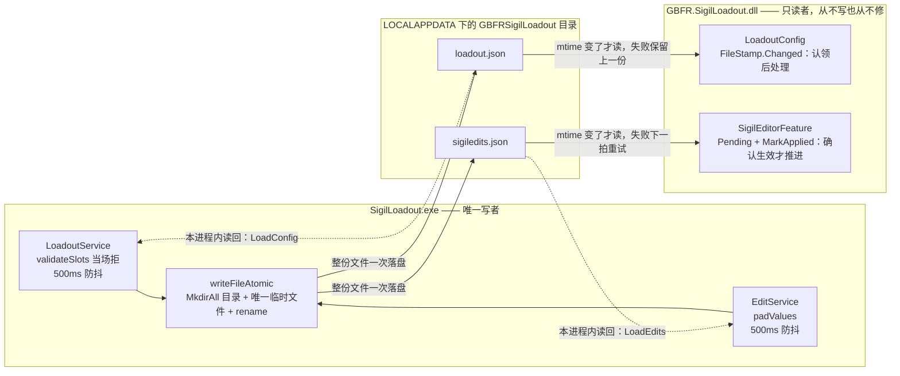
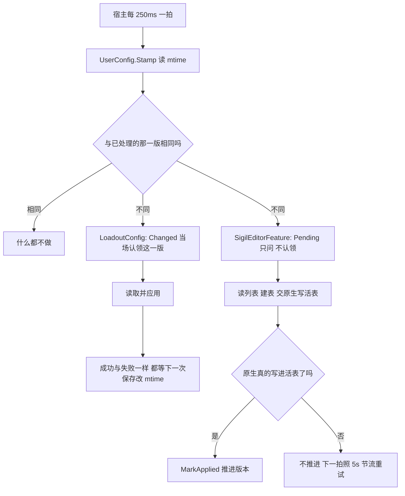

# 两个配置文件与跨语言常量契约

可视工具（`SigilLoadout.exe`）与托管 mod（`GBFR.SigilLoadout.dll`）分居两个进程，之间**没有**任何进程内通道。它们唯一的通道是两个文件，住在 `%LOCALAPPDATA%\GBFRSigilLoadout\`：

- `loadout.json` —— 玩家配装。可视工具由 `LoadoutService` 写，托管侧由 `LoadoutConfig` 读。
- `sigiledits.json` —— 因子数值编辑列表。可视工具由 `EditService` 写，托管侧由 `SigilEditorFeature` 读。

这条契约有三个不易察觉的性质，本页就是讲清它们：

1. **单向写者、无协商**。两个文件各有唯一写者（可视工具），托管 mod 只读、从不改写也从不修复。两侧因此可以任意先后启动、任意重启，中间不需要握手。
2. **变更靠 mtime 发现**。没有通知、没有握手文件、没有锁，托管侧的 250ms 维护拍比一次文件修改时间就决定了要不要处理这一版（`FileStamp`）。
3. **常量是协议的字面部分**，而它们分居 C# / Go / TS / C++ 四种语言里。这类值写错**不会编译失败**，只会表现成游戏里的错值——所以「各只有一处声明 + 一道对拍」是这里唯一的防线，而那道防线本身有明确的边界（见下文第 7、8 节）。

各单元内部的结构与时序不在本页：托管外壳见 [托管 mod（C# Reloaded 外壳）](/openwiki/architecture/managed-mod.md)，两条端到端流程见 [工作流：配装从界面到游戏状态](/openwiki/workflows/loadout-apply.md) 与 [工作流：因子数值编辑与热应用](/openwiki/workflows/sigil-edit-apply.md)，测试与门禁的全貌见 [验证地图：测试与门禁各护什么](/openwiki/testing/verification-map.md)。

## 1. 路径：两侧各算一次，中间没有协商

路径**不落盘**、没有配置文件记录它，两侧各写一份推导代码，算出来的必须是同一个字符串：

```text
%LOCALAPPDATA%\GBFRSigilLoadout\{loadout.json, sigiledits.json}
```



唯一写者、只读者与两道 mtime 门的关系：两个文件各有一个写者和一个托管侧读者，中间没有第三个参与者。虚线是工具自己把文件读回编辑器状态（同一进程内，不属于跨进程契约）。

| 侧 | 推导位置 | 目录名从哪来 | 文件名从哪来 |
| --- | --- | --- | --- |
| C# | `UserConfig.FilePath(name)` | `Environment.GetFolderPath(Environment.SpecialFolder.LocalApplicationData)` + 字面量 `"GBFRSigilLoadout"` | 调用方传：`LoadoutConfig` 传 `"loadout.json"`、`SigilEditorFeature` 传 `ConfigFileName` |
| Go | `loadoutservice.go` 的 `userCfgDir()` / `editservice.go` 的 `configPath()` | 环境变量 `LOCALAPPDATA`（为空时回落 `exeDir()`）+ `userCfgDirName` | `loadoutFileName` / `editListName` 各自一处 |

三条**为什么**值得写下来，因为它们各自都曾经是一个真实选项：

- **为什么不放在 mod 目录**：mod 目录每次更新会被整个替换，要活过一次更新的东西都不能放在那里（`UserConfig` 的类注释）。
- **为什么 Go 不回落到 `os.UserConfigDir()`**：它在 Windows 返回 `%APPDATA%`（Roaming），与 C# 的 `LocalApplicationData` 是两个目录，于是两侧各自看得见一个「自己的」配置文件而互不干扰——症状是配置完全没生效、编辑永远不落地，且**两边都不报错**。
- **为什么目录名与文件名「各只有一处声明」**：两侧算的是同一个字符串，中间没有任何协商点，所以每一处常量只能有一个出处，否则「改了一边」既没有编译错误、也没有运行时报错，只有一道对拍能发现。
- **谁创建目录**：只有写入侧。`writeFileAtomic` 在写之前 `MkdirAll` 出 `%LOCALAPPDATA%\GBFRSigilLoadout`，所以首次保存不需要用户先建目录；两个读取侧（`LoadoutConfig`、`Config.Load`）只读，从不创建、也从不写。

### 每个常量的声明位置与漂了的表现

下表包含 `sharedconstants_test.go` 里**全部**对拍项；与本页主题无关的几组（窗口标题与两条窗口消息、`skill_status` 行布局）在这里只列坐标与症状，展开在它们各自的页里。

| 常量（值） | 声明位置（全部） | 对拍 | 漂了会表现成什么症状 |
| --- | --- | --- | --- |
| 用户配置目录名 `GBFRSigilLoadout` | C# `UserConfig.cs`；Go `loadoutservice.go`（`userCfgDirName`） | ✓ | 两侧各写进一个自己的目录：工具「保存成功」，游戏里什么都没变；编辑列表永远读不到。无任何报错 |
| 配装文件名 `loadout.json` | C# `LoadoutConfig.cs`（`UserConfig.FilePath("loadout.json")`）；Go `loadoutservice.go`（`loadoutFileName`） | ✓ | 同上；而托管侧只有在读不到 `loadout.json`（含从来没写过）时才回到内置专属模板，日志 `loadout.json removed; restored the built-in exclusive template.` |
| 编辑列表文件名 `sigiledits.json` | C# `SigilEditorFeature.cs`（`ConfigFileName`）；Go `editservice.go`（`editListName`） | ✓ | 同上；日志里会出现 `sigil edit: no edit list yet at …(the tool writes it there)`，而工具那边一切正常 |
| 启用槽上限 `MaxSlots = 16`（只数启用的行） | C# `LoadoutConfig.cs`（`MaxSlots`，注释里写明与 Go 那处同步）；Go `loadoutservice.go`；TS `frontend/src/model.ts`（`MAX_SLOTS`，同一常数也是编辑器至少显示的行数，见 `padSlots`） | ✓ | 三处不等价就会「存盘成功、游戏里什么都没变」：Go/前端允许的那一行被 C# 判成 `more than 16 enabled slots` 而**拒掉整份文件**，旧配置继续生效 |
| 缺失 cap 时的回落等级 `DefaultLevel = 15` | C# `LoadoutConfig.cs`；TS `model.ts`（`DEFAULT_LEVEL`） | ✓ | 手改文件漏写 `level` 时，工具与游戏落在不同等级上；前端的 cap 基准也跟着错（`capOfSkill`/`capOfMain`） |
| 未选副技能的哨兵 `UnwornCharacterHash = 0x887AE0B0` | C# `LoadoutConfig.cs`；C++ `native_internal.h`（`kUnwornCharacterHash`） | ✓ | 槽位错位：某个真实角色 hash 被当成「未选择」，或「未选择」被当成一个真实技能去查表 |
| 参槽数 `LevelValueCount = 10` | C# `Config.cs`；Go `editservice.go`；TS `frontend/src/skills.ts`（`SLOTS`） | ✓ | 写多一个：托管侧循环的上界是两者的较小值，多出来的数字被**静默忽略**；写少一个：那个槽位永远保持游戏原值，编辑看起来「没生效」 |
| `sigiledits.json` 的成员名 `edits` / `enabled` / `key` / `level` / `values` | C# `Config.cs` 的五个 `[JsonPropertyName]`；Go `editservice.go` 的五个 struct tag | ✓ | 只改一边仍能编译、别的测试也全绿；游戏里表现成「每条编辑都被跳过」（`key` 读成空串 → `skip (key is not an 8-digit hex hash yet)`）或整份文件读不出来 |
| 工具窗口标题 `GBFR Sigil Loadout` | C# `Hotkey.cs`（`ToolWindowTitle`）；Go `main.go`（`toolWindowTitle`） | ✓ | 找窗口失败 → 每次热键都试图新起一个实例（第二实例由命名互斥体拦下并去激活）。见 [工作流：热键呼出/收起可视工具](/openwiki/workflows/hotkey-summon.md) |
| 显示/开关消息 `0x8010` / `0x8012` | C# `Hotkey.cs`（`WmActivate`/`WmToggle`）；Go `*.go`（`wmActivate`/`wmToggle`） | ✓ | 热键按下去工具没反应：窗口不显示、或（开关语义反了）第二次按不再收起 |
| `skill_status` 表头 8 / 行 52 / 行内 Key 偏移 40 | C# `SigilEditorFeature.cs`；C++ `src/table_slot.cpp` | ✓ | 行错位：把数值写进别的行或行外。见 [skill_status 表与活表写入闸门](/openwiki/concepts/skill-status-table.md) |
| 写盘失败事件名 `GBFR.SigilLoadout.SaveFailed` | Go `editservice.go`（`saveFailedEvent`）；TS `SigilEditorPanel.tsx` | ✓ | 防抖写盘失败不再弹对话框，只在工具日志里留一行 |
| 单文件上限 `Config.MaxBytes = 1 MiB` | 只有 C# `Config.cs` 一处，两个文件共用 | —（没有第二处可漂） | 改它会同时改两个文件的上限；`LoadoutConfig` 那条异常消息里把数字又写成了字符串 `"loadout.json exceeds 1 MB"`，只是文案，不影响行为 |

`MaxSlots` 另有一条**只在原生侧才有**的上界，它不属于跨语言对拍：一张角色模板表只有 `kVirtualSlotCapacity = 24` 个槽，前 `kBuiltinExclusiveSlotCount = 3` 个留给内置专属槽（T1/T2/战气），所以通用槽余量是 21。原生 `ApplyLoadout` 用 `std::min(请求数, 余量)` 处理超出，**截断而不是拒写**——拒写会让整份配置连其余槽位一起失效，比截断更糟；但截断会打一行 `the request asked for general slots=…, which exceeds the … this build supports; only the first … were applied.`，因为「某几个槽位静默不生效」是最难查的症状。`sharedconstants_test.go` 的 `TestVirtualSlotCapacityFitsPlayerSlots` 单独断言 `MaxSlots ≤ 余量`：把三处 `MaxSlots` 一起改大而不动原生容量，对拍全绿，只有这条会红。

## 2. 校验责任：Go 当场拒，C# 只做形状校验

两个文件都是「工具写、mod 读」，但**谁有权说不**是分开的：

- **可视工具侧（Go）是唯一能对用户说话的一方**：`SaveLoadout` 实时校验，不合法当场返回错误，前端靠它弹框（`TestSaveLoadoutRejectsInvalidWithoutTouchingDisk` 断言被拒的保存在任何目录/文件建出来之前就中止，磁盘上不留痕迹）。但它**不修内容**：能接受的载荷经 500ms 防抖后**原样**写盘（`writeLoadoutFile` 写的就是 `[]byte(config)`，`TestSaveLoadoutWritesAndLeavesNoTempFiles` 断言读回来逐字节相同）。
- **托管侧（C#）只做形状校验**。它的不变量是「读不出来就保留上一份有效配置，绝不用半份配置去覆盖内存」；它不判断「这个因子选得对不对」「等级有没有超上限」——那张表（`assets\sigils.json`）的唯一读者是可视工具，所以上限判定属于前端，末端的死值判定在原生侧。
- **因此有一条规则是「一处拥有」而不是「各写一份」**：等级**上界**只由可视工具那一侧实现，C# 与 Go 都**不**判。夹的动作有两处、都在可视工具内：面板的 `LevelInput` 用 `max={capOfMain / capOfSkill}`（表里查不到那个技能时 max 回落 `DEFAULT_LEVEL`）在输入与滚轮步进上夹住，`model.ts` 把存档读成编辑器状态时用 `clampLevel` 按 cap 夹（cap 未知的 gem 原样保留原值，那一行在下次保存时被丢弃）。C# 的 `GetLevel` 只拒负数；Go 的 `validateSlots` 在等级上也只拒负数（与 cap 无关，任何情况下都无意义）。这条分工有两面后果：一份手改的 `loadout.json` 写了超过 cap 的等级会**原样通过两侧检查直达原生**，没有任何一层把它夹回去（这不是漏洞，而是「cap 表只有一处」的必然结论）；同时，同一规则的第三份副本会与真正的 cap 表漂移，而且判的还不是真正的不变量。
- 唯一的例外是**启用槽数上限**：它必须在两侧都判（Go 要先给用户报错，C# 要在读到一份手改文件时守住自己），所以它就是上表里被对拍钉住的那一条。

### loadout.json 的成员

形状（`LoadoutConfig` 的类注释与 `ParseAndValidate` 是权威）：

```text
{ lang, slots: [ { items: [ {gem, hash, level}, {hash, level}? ], enabled } ],
  exclusive: { 角色hash: { 技能hash: bool } } }
```

`items[0]` 是**因子**（`gem` = 物品 hash、`hash` = 它提供的主技能）；`items[1]` 是可选的副技能（只带 `hash`/`level`，没有 `gem`）。跨进程的读者只有 C# 一处（`LoadoutConfig`）；工具自己也会在启动时把它读回面板（`LoadoutService.LoadConfig`，文件不在就给 `{"lang":"","slots":[]}`），但这是同一进程内的事。

| 成员 | 类型 | 谁写 | C# 怎么读（跨进程的唯一读者） | 漂了 / 缺失的表现 |
| --- | --- | --- | --- | --- |
| `lang` | 字符串 | 前端写，Go 原样存 | **完全不读**（注释：`lang` 只有可视工具在意） | 只影响工具界面的语言选择。文件不存在时 Go 返回 `{"lang":"","slots":[]}`：空串不在语言表里，正是为了让前端保留「按系统语言猜」而不被写死成 `zh` |
| `slots` | 数组 | 前端（`buildLoadoutPayload` 每次都写） | 必需且必须是数组：根不是对象抛 `expected an object with a 'slots' array`，缺成员或不是数组抛 `missing 'slots' array` | 缺成员 = 整份文件被拒、保留上一份。Go 侧 `SaveLoadout` 同样当场拒它（`loadout.json needs a 'slots' array`），并连旧的裸数组形状（`[ { items, enabled } ]`）一起拒——放过去就是「工具说保存成功、游戏里什么都没变」。`"slots": []` 在两侧都是**合法**值，含义是「没有通用槽」（见第 3 节） |
| `slots[].items` | 数组，长度 1–2 | 前端 | 必需、数组、长度 ≥ 1；只读 `items[0]` 与 `items[1]` | Go 在存盘时拒掉长度 > 2（`items must have 1 or 2 entries`）；手改的文件绕过 Go 之后，第 3 项及以后被 C# **静默忽略** |
| `items[0].gem` | 字符串（8 位十六进制物品 hash） | 前端（`buildLoadoutPayload` 解析出的物品 hash） | `GetProperty("gem")`，非十六进制或为 0 → `slot N: bad sigil hash` | 成员缺失会让 `GetProperty` 直接抛 `KeyNotFoundException`，落进外层 catch 变成通用的 `Invalid loadout.json; kept previous configuration: …` |
| `items[0].hash` | 字符串（8 位十六进制技能 hash） | 前端（主技能 hash） | 必需（`TryGetProperty`），缺失 → `slot N: main item carries no skill hash`；解析不出十六进制 → `bad main skill hash` | 拼错成别的名字 = 同一句话。**这是 mod 不再持有因子表的直接后果**：主技能只能随载荷走，所以两侧都拒空——Go 的 `validateSlots` 也拒掉 `main item hash is empty` 的载荷（前端两个都写，它拒的是手改坏的文件） |
| `items[1].hash` | 字符串（8 位十六进制技能 hash） | 前端（有副技能才写） | 只有**整个 `items[1]` 不存在**才等于「没有副技能」；这一项存在就必须带 `hash`（`GetProperty` 缺成员直接抛 `KeyNotFoundException` → 整份文件被拒），非十六进制 → `bad secondary skill hash` | 手改出的 `{"level":15}` 第二项会被判成坏文件（不是「没有副技能」）；Go 侧同样在存盘前拒掉 `items[1].hash` 为空的载荷（`second item hash is empty`） |
| `items[*].level` | 整数 | 前端（已夹在自己的 cap 内） | 缺失 → `DefaultLevel`（15）；负数 → `must not be negative`；上界不判 | 漏写 `level` 时工具与游戏必须落回同一个数，这正是 `DefaultLevel` 被对拍的原因 |
| `slots[].enabled` | 布尔 | 前端（永远显式写） | `!TryGetProperty("enabled", …) \|\| GetBoolean()` —— **缺成员算启用**；成员存在但不是一个布尔值时 `GetBoolean()` 抛错，落进外层 catch → 整份文件被拒 | 见下面那条真实回归 |
| `exclusive` | 对象：角色 hash → { 技能 hash: 布尔 } | 前端（只写**关掉**的槽） | 只把值为 `false` 的项变成 override；外层键解析不成角色 hash 就记一行 `exclusive: '…' is not a character hash; ignored.` | 成员名拼错、或这个成员存在但不是对象，C# 都当它不存在 = 所有专属开关静默失效（三槽全开）。PL 码不是这里的身份，所以按 PL 码写的键会被忽略并记日志 |

**「缺 `enabled` = 启用」是三个实现的一致约定**，也是曾经的 bug 现场：Go 侧用 `bool` 时，一份没写 `enabled` 的文件在 Go 数出 0 个启用、在 mod 那边数出十几个 → 存盘成功、游戏里什么都没变。现在 Go 用 `*bool`、C# 用 `TryGetProperty` 的短路、前端用 `s.enabled !== false`，`TestValidateSlotsTreatsMissingEnabledAsEnabled` 把这条钉成回归测试。

两侧的遍历顺序不同，这决定了一行「坏在哪」是否会被发现：C# 先判 `enabled`（`false` 就 `continue`，连这一行的 `items` 都不看），再判启用槽数上限，最后才判 `items` 的形状；Go 的 `validateSlots` 则对**每一行**都要求 `items` 结构合法（含被禁用的行），只有「数进去几个」这件事排除禁用行。所以「禁用的行 + 坏 `items`」这种手改文件在 mod 侧被静默跳过（那一行的内容本来也不参与任何事），而同一形状的载荷若从工具那边保存，会被 Go 拒掉。

### sigiledits.json 的成员

形状（`Config.cs` 的 `[JsonPropertyName]` 与 `editservice.go` 的 struct tag 就是文件格式）：

```text
{ edits: [ { enabled, key, level, values: [ 10 × (数字 | null) ] } ] }
```

这个文件的读者有两处：托管侧的 `Config.Load`，以及工具自己的 `LoadEdits`（面板启动时把磁盘上的列表读回编辑器状态）。

| 成员 | 类型 | 谁写 | 两侧怎么读 | 漂了 / 缺失的表现 |
| --- | --- | --- | --- | --- |
| `edits` | 数组 | Go（`writeEdits`，缩进 2） | C#：必需、必须是数组，否则抛三种各有措辞的错误（不是对象 / 没有该成员 / 不是数组）；Go：`LoadEdits` 把缺失或 `null` 归一成空列表 | 手改的 `{"edits":null}` 或 `{}`：工具读成空列表，mod 把它当坏形状**拒绝**并保留现状——两侧对同一份手改文件反应不同，这是有意的（空列表是真实状态，坏文件不是） |
| `enabled` | 布尔 | 前端 | C# 默认 `true`（`= true` 初始化式）；Go 零值 `false` | 手改的记录漏写这个成员时，mod 按启用生效、编辑器显示成未勾选——两边不一致 |
| `key` | 字符串（8 位十六进制 hash） | 前端 | C# 解析不出就逐条 `skip (key is not an 8-digit hex hash yet)` | 拼错一边就整列读成空串，**每条编辑都被跳过**，而编译与测试都绿 |
| `level` | 整数 | 前端 | C# 缺省 15；`< 1` 在强制转换**之前**判（否则负数会变成几十亿，症状会伪装成「行没找到」） | 等级落到游戏没读的那一行时，编辑写下去也不会有可见效果 |
| `values` | 数组：10 × （数字 或 `null`） | 前端（`padValues` 补齐/截到正好 10） | C#：读的时候把显式 `"values": null` 规整成 10 长数组；非有限数（例如手写的 `1e39`，`System.Text.Json` 给的是 ±Infinity）→ 那个槽位跳过并记 `slot N is not a finite number` | `null` = 「那个槽位保持游戏原样」。写全值就是用旧副本盖掉没编辑过的槽位，所以只写用户设过的数字 |
| 未知成员 | — | — | 两侧都忽略。**旧拼写**（`Edits`/`Enabled`/`Key`/`Level`/`Values`）读成空列表 | 「从头来过」是既定形状：不读取、不改写，下一次保存写出当前格式（`TestLoadEditsDoesNotReadAFileFromTheOldKeySpelling` 把它钉成决定而不是意外） |

托管读侧还有一条与「成员」无关的整体规则：**只有外层形状算错误**。`Config.Options` 是有意留空的（不开大小写折叠、不猜名字）；认不出的记录内成员读成默认值，随后由 `PatchRows` 逐条报 `skip`，而不是把整份文件判成读不出来。

## 3. 三种缺失语义：空数组、缺成员、坏文件

「什么都不做」和「把它清空」在这条契约里是**三件不同的事**，而且两个文件对同一类缺失的动作并不一样。这是最容易改错的一处。

| 情形 | `loadout.json` | `sigiledits.json` |
| --- | --- | --- |
| **文件不在**（mtime = `UserConfig.NoFile`） | `NativeCore.ApplyLoadout(null, null)`：恢复**内置专属模板**（注释：没有通用槽 = 内置模板，没有开关 = 专属全开），日志 `loadout.json removed; restored the built-in exclusive template.`。这条路径**提前 return**，不走下面的读取——否则 `new FileInfo(...)` 的 `Length` 必抛，每局多一条假的「保留上一份」 | 热应用路径：空列表 → 把**未编辑**的表发布回去（删除文件 = 撤销所有编辑）。启动那次：`applied == 0` 直接不写表（那一局的表本来就是原样），日志用「还没有编辑列表，或读不出来」的措辞 |
| **`"slots": []` / `"edits": []`**（存在但是空） | 真实答案：「没有通用槽」——通用槽交回内置行为，但**文件里的 `exclusive` 仍然生效**：`ApplyLoadout(null, overrides)` | 真实答案：0 条编辑。热应用路径会把未编辑的表发布回去（所以运行中把列表清空 = 撤销全部编辑） |
| **缺成员 / 形状不对 / JSON 坏 / 超过 1 MiB** | 日志 `Invalid loadout.json; kept previous configuration: …`，内存里一个字节都不动 | 日志 `sigil edit: list load failed: …`（`Config.Load` 的三种形状错误各说各的），什么都不写、也不推进版本 |

两个「不」是刻意的：

- 托管侧**从不写这两个文件、也从不修复它们**。它没有能力把「读不出来」变成「一个合理的默认值」——那份默认值就是用户刚才的编辑，猜错等于替他丢数据。
- 工具侧**不做补救性读取**。`LoadEdits` 只把「文件不存在」当空列表；存在但解析不了是**错误**，因为空列表是一个真实状态（所有编辑都关掉了），把坏文件显示成空列表正是「一次误触按键把这份空覆盖回用户编辑内容」的路径。

## 4. mtime 版本门：两种语义，各有各的理由

`UserConfig.Stamp(path)` 是 `File.GetLastWriteTimeUtc` 的唯一实现；文件不存在时它给的是 FILETIME 0（1601-01-01），也就是 `UserConfig.NoFile`。**它必须与 `FileStamp._applied` 的初值 `default(DateTime)`（0001-01-01）不同**：这样「文件被删掉」才是一版真实、可比较的变更，两个特性都不需要额外字段去记住「以前有过文件」。首次启动没有 `loadout.json` 时，这一版会被处理恰好一次（就是恢复内置模板那条路径）。

`FileStamp` 提供两半，调用方在遇到文件版本那一刻选哪一半，决定了失败之后的整个行为：

| 特性 | 用哪一半 | 失败之后 | 为什么 |
| --- | --- | --- | --- |
| `LoadoutConfig`（配装） | `Changed()`：**认领后处理**，无论成败 | 保留上一份配置，**这一版不再重试**；下一次保存自然会改 mtime | 单次应用；同一份坏配置每 250ms 重试一次只会把同一个报错灌满日志。错误的原因照常报，去重靠「版本变了才说」 |
| `SigilEditorFeature`（因子编辑） | `Now()` + `Pending()` + `MarkApplied()`：**确认生效后才推进** | 那一版还欠着，下一拍会再来（同版本按 5s 节流、且只报一次） | 拒写时**内存里一个字节都没变**。这里「认领」等于宣告「处理过了」，而实际什么都没写——编辑静默丢失且不再重试。什么时候算处理完由调用方在那一刻调 `MarkApplied` |



同一拍里两种版本门的语义差异：左边那一版认领之后就不再出现，右边的版本在真正写进游戏内存之前一直欠着。

`MarkApplied` 在托管侧只有两处（都在 `SigilEditorFeature` 内）：`Publish` 里原生**确实**改写了行之后，以及「新表与内存里那份逐字节相同」这条捷径上（内存里已经是这一版的字节，所以这一版确实处理完了；不标记的话 `Pending` 永远为真，而这条捷径又让节流的「同版本」条件失效，于是每 250ms 白重建一次表）。启动那次的 `Bootstrap` 另有一条顺序规则：**版本号必须在读内容之前取**，造表之后再复查一次 mtime——反过来就会用「T4 的版本号」标记「T1 的内容」，内存里是旧内容而编辑静默丢失。

### 写入侧让 mtime 成为一个可用的版本号

两个 service 的落盘骨架相同（`debouncedWriter`）：每次调用替换待写并重启定时器，500ms 静止之后才写出，退出时 `flushNow` 兜住最后一次编辑；写盘走 `writeFileAtomic`（同目录唯一临时文件 + rename）。这带来两件对读侧很重要的事：

- **读侧不可能看到半截文件**。直接 `O_TRUNC` 会留下一个「读到半截」的窗口，那一侧只能看到坏 JSON——而坏 JSON 的语义是「保留上一份」，会把一次正常保存变成一次无意义的回退。
- **一次落盘就是屏幕上最后的那一整个状态**，所以「一次 mtime 变更」与「一份完整可用的新配置」是同义词。写入失败时待写会被放回并推给前端（事件名见上表），不是丢弃。

门的判据是 mtime **相等**，不是内容哈希：内容变了而 mtime 没变的一版是看不见的。正常的写入路径不会产生这种情形（防抖至少隔开两次落盘，远大于 Windows 的 mtime 粒度）。读侧因此不需要缓存文件内容：每一版都是「现取 mtime → 现读文件」，而因子编辑那条路还多一道纪律——造表之后再复查一次 mtime，变了就整版作废（见上）。

## 5. 大小上限

两个文件共用 **1 MiB**（`Config.MaxBytes`，唯一的数值声明在 `Config.cs`），两侧的读取入口都在**解析之前**先看 `Length`，超了当错误处理而不是当一次读取：

| 文件 | 检查点 | 超限的后果 |
| --- | --- | --- |
| `sigiledits.json` | `Config.Load` 开头 | 抛 `sigiledits.json exceeds 1048576 bytes` → 托管侧报 `list load failed`、什么都不写、不推进版本 |
| `loadout.json` | `LoadoutConfig.TryApply` 开头（用同一个 `Config.MaxBytes`） | 抛 `loadout.json exceeds 1 MB` → 保留上一份配置 |

文件可以手改，失控的那一份该是一条记进日志的错误，而不是一次几个 GB 的读取。

## 6. 这一页不覆盖的第三个「配置」

`%LOCALAPPDATA%\GBFRSigilLoadout` 之外还有一份 `HotkeyConfig.json`（热键），它住在 Reloaded-II 的 **mod 配置目录**里，由 `Configurator`（`IConfiguratorV3`）交给启动器渲染，见 [宿主与依赖边界（Reloaded-II / 数据管理器）](/openwiki/integrations/host-and-dependencies.md)。

托管侧**有意不为这两个文件实现任何 Reloaded 配置接口**：那会让启动器多出一个 "Mod configuration" 窗口，而它渲染不了列表（只能显示一对没有意义的 Capacity/Count）。编辑列表归工具所有，托管侧这一半就是纯数据——这也是为什么路径算在 `UserConfig` 里而不由启动器传进来。

## 7. sharedconstants_test.go：对拍的范围

`SigilLoadout/sharedconstants_test.go` 是跨语言常量的唯一机械防线。它的机制有四个值得知道的细节：

1. **每条声明必须正好匹配一次**（`len(matches) != 1` 就报错）。正则写松了就会对着文件里第一个碰巧像它的东西比，比出来还是绿的——假绿比红更贵。这也是为什么 Go 侧那几个成员名的正则锚在 `type SigilSkill struct {` 上：`json:"key"` 在本包里合法地出现两次（`SigilSkill` 与 `SkillInfo`，两个不同的文件格式）。
2. **Go 的声明属于包、不属于文件**，所以 `"*.go"` 表示把本包所有非测试源文件拼起来找。一次纯粹的文件搬移不该让断言变红——它盯的是「值漂没漂」。
3. **比较是大小写不敏感的**（`strings.EqualFold`），这对 `0x887AE0B0` 这类十六进制值正合适。但它同时是成员名字段的盲区（见下）。
4. **文件被改名或搬走时是硬失败**（`t.Fatalf("reading %s: %v")`），不是静默跳过——这一点是对的。

覆盖范围就是第 1 节那张表的全部行：`MaxSlots`、`DefaultLevel`、`UnwornCharacterHash`、`LevelValueCount`、目录名、两个文件名、五个 `sigiledits.json` 成员名、窗口标题、两条窗口消息、`skill_status` 的三个布局常量、保存失败事件名。

同一文件里还有第二个测试，它做的**不是**对拍而是容量断言：`TestVirtualSlotCapacityFitsPlayerSlots` 读 `native_internal.h` 的 `kVirtualSlotCapacity` 与 `kBuiltinExclusiveSlotCount`，用它们的差去比 Go 侧的 `MaxSlots`。「三处 `MaxSlots` 是否一样」仍归上面那次对拍，所以两个测试各管一半：一个管「三处相等」，一个管「这个数原生装得下」。

## 8. 这道门证明不了什么

**绿不等于契约已证明。**`sharedconstants_test.go` 只证明「这些字面量当前两两相等」，下面这些它一个字都没说：

| 缺口 | 具体后果 |
| --- | --- |
| **`loadout.json` 的成员名完全不在对拍范围里** | `slots`/`items`/`gem`/`hash`/`level`/`enabled`/`exclusive`/`lang` 是**两处**独立的字面量：C# 侧是 `TryGetProperty("…")`，Go 侧是 struct tag。改一边能编译、全部测试绿。C# 缺 `slots`/错形状会抛错（降级成可见的「保留上一份」），Go 的 `json:"slots"` 漂了也会被 `SaveLoadout` 那条「缺成员即拒」当场拦下（工具里报错，而不是静默写出一份游戏读不懂的文件）；但 `exclusive` 拼错是**静默**的（专属开关全部失效），`enabled` 拼错则会让“缺成员算启用”这条约定失效 |
| **只有大小写不同的一种漂移能通过** | `edits` vs `Edits`、`key` vs `Key` 会被 `EqualFold` 判成一致，而两个 JSON 格式都是**大小写敏感**的（C# 有意关掉折叠，Go 侧也精确匹配）。旧拼写文件读成空列表这件事，恰恰是靠 Go 的行为测试而不是靠这道对拍来钉住的 |
| **只比常量、不比推导** | 目录名比的是字面量「`GBFRSigilLoadout`」，没比基准目录：C# 用 `SpecialFolder.LocalApplicationData`，Go 用环境变量 `LOCALAPPDATA` 且带一个 `exeDir()` 回落。基准漂了（例如有人把 Go 改成 `os.UserConfigDir`），这道门仍然是绿的 |
| **同侧重复或搬移不一定红** | 名字精确到文件的组（如 `loadoutservice.go` 里的 `MaxSlots`）只在**那一个文件**里找：在别的文件里再加一份副本不会被发现，而这一份正好会与另一份漂移 |
| **对拍不证明「这个数值是可行的」** | 它只保证三处字面量当前相等。把 `MaxSlots` 三处一起改成 25，对拍仍然全绿，而原生只放得下 21 个通用槽。这条边界由同一文件里的 `TestVirtualSlotCapacityFitsPlayerSlots` 单独守（见第 7 节），不在对拍的结论里 |
| **比的是字面量，不是行为** | 「空数组 ≠ 缺成员」「缺 `enabled` = 启用」「坏文件保留上一份」「1 MiB 上限」「两种 mtime 门」全都不在它的结论里 |

行为那一半由别的东西守住：Go 侧有 `TestValidateSlots*`（含「缺 `enabled` 算启用」与「等级超 cap 仍合法」）、`TestSaveLoadout*`（含被拒的保存不碰磁盘、缺 `slots` 成员与旧的裸数组形状各有一条、并发保存不撕裂文件、防抖只落最后一份）、`TestLoadEdits*`（空列表 vs 解析不了、旧拼写、`[]` 而不是 `null`）、`TestPadValuesAlwaysGivesTenSlots`、`TestUserCfgDirMatchesModPath`、容量预算那条 `TestVirtualSlotCapacityFitsPlayerSlots` 与 [验证地图：测试与门禁各护什么](/openwiki/testing/verification-map.md) 里列出的其余套件；前端有 `frontend/src/index.test.ts` 的「落盘载荷」一组，钉住 `buildLoadoutPayload` 写出的形状（空槽不写进文件、解析不出的主因子整行跳过、没有副技能就不写第二项、副技能带自己的等级、`enabled` 原样保留、`exclusive` 全空时不写这个成员）与 cap 缺失时回落到 `DEFAULT_LEVEL`。**托管侧没有测试工程**（解决方案里只有原生工程与托管工程），所以 `LoadoutConfig` / `Config.Load` 的读取行为只能在游戏日志里观察——这也是「文档表」和这道对拍必须同时维护、谁都不能替代谁的原因。
