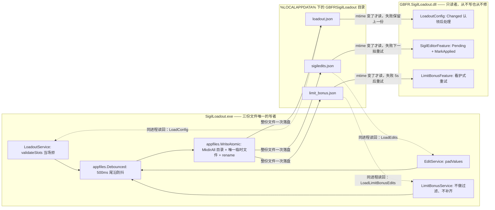
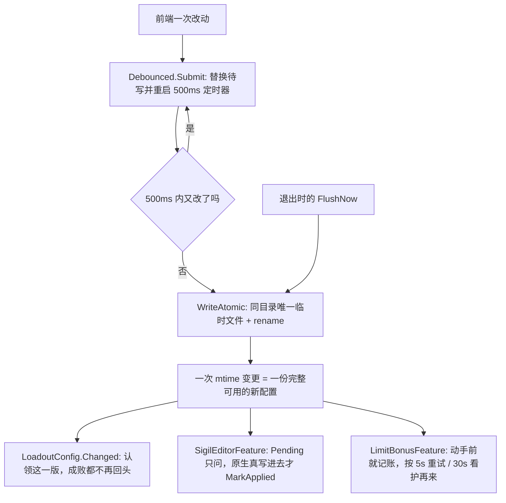

# 三份配置文件与跨语言常量契约

可视工具（`SigilLoadout.exe`）与托管 mod（`GBFR.SigilLoadout.dll`）分居两个进程，之间**没有**任何进程内通道。它们唯一的通道是三份文件，住在 `%LOCALAPPDATA%\GBFRSigilLoadout\`：

- `loadout.json` —— 玩家配装。可视工具由 `LoadoutService` 写，托管侧由 `LoadoutConfig` 读。
- `sigiledits.json` —— 因子数值编辑列表。可视工具由 `EditService` 写，托管侧由 `SigilEditorFeature` 读。
- `limit_bonus.json` —— 能力强化编辑列表（能力数值）。可视工具由 `LimitBonusService` 写，托管侧由 `LimitBonusFeature` 读。

这条契约有四条不易察觉的性质，本页就是讲清它们：

1. **单向写者、无协商**。三份文件各有唯一写者（可视工具），托管 mod 只读、从不改写也从不修复。两侧因此可以任意先后启动、任意重启，中间不需要握手。
2. **变更靠 mtime 发现**。没有通知、没有握手文件、没有锁，托管侧的 250ms 维护拍比一次文件修改时间就决定了要不要处理这一版；但**每份文件的门是同一套接口的三种用法**（认领式 / 确认式 / 看护式），失败之后的行为因此不同（见第 5 节）。
3. **两份「编辑列表」共用一份外层形状契约**（`EditListJson.cs`），而 `limit_bonus.json` 与 `sigiledits.json` 在**空列表**上含义相反：一边是「撤销全部编辑」，一边是「没有要写的」。这是本页最容易改错的一处。
4. **常量是协议的字面部分**，而它们分居 C# / Go / TS / C++ 四种语言里。这类值写错**不会编译失败**，只会表现成游戏里的错值——所以「各只有一处声明 + 一道对拍」是这里唯一的防线，而那道防线只覆盖**两侧都至少有一处声明**的值，本身也有明确的边界（见第 8、9 节）。

各单元内部的结构与时序不在本页：托管外壳见 [托管 mod（C# Reloaded 外壳）](/openwiki/architecture/managed-mod.md)，三条端到端流程见 [工作流：配装从界面到游戏状态](/openwiki/workflows/loadout-apply.md)、[工作流：因子数值编辑与热应用](/openwiki/workflows/sigil-edit-apply.md) 与 [工作流：能力强化数值应用](/openwiki/workflows/limit-bonus-apply.md)，两张被改写的表的布局见 [skill_status 表与活表写入闸门](/openwiki/concepts/skill-status-table.md) 与 [limit_bonus_param 表与能力强化](/openwiki/concepts/limit-bonus-table.md)，测试与门禁的全貌见 [验证地图：测试与门禁各护什么](/openwiki/testing/verification-map.md)。

## 1. 路径：两侧各算一次，中间没有协商

路径**不落盘**、没有配置文件记录它，两侧各写一份推导代码，算出来的必须是同一个字符串：

```text
%LOCALAPPDATA%\GBFRSigilLoadout\{loadout.json, sigiledits.json, limit_bonus.json}
```


```mermaid
flowchart LR
    subgraph Tool["SigilLoadout.exe —— 三份文件唯一的写者"]
        LS["LoadoutService: validateSlots 当场拒"]
        ES["EditService: padValues"]
        LB["LimitBonusService: 不做过滤、不补齐"]
        DB["appfiles.Debounced: 500ms 尾沿防抖"]
        AW["appfiles.WriteAtomic: MkdirAll 目录 + 唯一临时文件 + rename"]
    end
    subgraph Dir["%LOCALAPPDATA% 下的 GBFRSigilLoadout 目录"]
        LO["loadout.json"]
        SE["sigiledits.json"]
        LBJ["limit_bonus.json"]
    end
    subgraph Mod["GBFR.SigilLoadout.dll —— 只读者，从不写也从不修"]
        LC["LoadoutConfig: Changed 认领后处理"]
        SF["SigilEditorFeature: Pending + MarkApplied"]
        LF["LimitBonusFeature: 看护式重试"]
    end
    LS --> DB
    ES --> DB
    LB --> DB
    DB --> AW
    AW -->|"整份文件一次落盘"| LO
    AW -->|"整份文件一次落盘"| SE
    AW -->|"整份文件一次落盘"| LBJ
    LO -->|"mtime 变了才读，失败保留上一份"| LC
    SE -->|"mtime 变了才读，失败下一拍重试"| SF
    LBJ -->|"mtime 变了才读，失败 5s 后重试"| LF
    LO -.->|"同进程读回：LoadConfig"| LS
    SE -.->|"同进程读回：LoadEdits"| ES
    LBJ -.->|"同进程读回：LoadLimitBonusEdits"| LB
```

唯一写者、只读者与三扇 mtime 门的关系：三份文件各有一个写者和一个托管侧读者，中间没有第三个参与者。虚线是工具自己把文件读回编辑器状态（同一进程内，不属于跨进程契约）。

| 文件 | 谁写 | 谁读（跨进程） | 路径由哪一处算出来 |
| --- | --- | --- | --- |
| `loadout.json` | `LoadoutService.SaveLoadout`（Go），写前端给的字节 | `LoadoutConfig`；工具自己也读回面板（`LoadoutService.LoadConfig`，同一进程） | 目录 `appfiles.UserDir()` + `service/loadoutservice.go` 的 `loadoutFileName`；C# 侧 `LoadoutConfig` 的 `UserConfig.FilePath("loadout.json")` |
| `sigiledits.json` | `EditService.SaveEdits`（Go） | `SigilEditorFeature`；工具自己也读回面板（`EditService.LoadEdits`） | 目录 `appfiles.UserDir()` + `service/editservice.go` 的 `editListName`；C# 侧 `SigilEditorFeature` 的 `ConfigFileName` |
| `limit_bonus.json` | `LimitBonusService.SaveLimitBonusEdits`（Go） | `LimitBonusFeature`；工具自己也读回面板（`LimitBonusService.LoadLimitBonusEdits`） | 目录 `appfiles.UserDir()` + `service/limitbonusservice.go` 的 `limitBonusEditListName`；C# 侧 `LimitBonusFeature` 的 `ConfigFileName` |

两侧的推导：

| 侧 | 推导位置 | 目录名从哪来 | 文件名从哪来 |
| --- | --- | --- | --- |
| C# | `UserConfig.FilePath(name)` | `Environment.GetFolderPath(Environment.SpecialFolder.LocalApplicationData)` + 字面量 `"GBFRSigilLoadout"` | 调用方传：`LoadoutConfig` 传 `"loadout.json"`、`SigilEditorFeature` 传 `ConfigFileName`、`LimitBonusFeature` 传自己的 `ConfigFileName` |
| Go | `appfiles.UserDir()` | 环境变量 `LOCALAPPDATA`（为空时回落 `appfiles.ExeDir()`）+ `appfiles.UserDirName` | 三个常量各一处：`loadoutFileName` / `editListName` / `limitBonusEditListName` |

三条**为什么**值得写下来，因为它们各自都曾经是一个真实选项：

- **为什么不放在 mod 目录**：mod 目录每次更新会被整个替换，要活过一次更新的东西都不能放在那里（`UserConfig` 的类注释）。
- **为什么 Go 不回落到 `os.UserConfigDir()`**：它在 Windows 返回 `%APPDATA%`（Roaming），与 C# 的 `LocalApplicationData` 是两个目录，于是两侧各自看得见一个「自己的」配置文件而互不干扰——症状是配置完全没生效、编辑永远不落地，且**两边都不报错**。
- **为什么目录名与文件名「各只有一处声明」**：两侧算的是同一个字符串，中间没有任何协商点，所以每一处常量只能有一个出处，否则「改了一边」既没有编译错误、也没有运行时报错，只有一道对拍能发现。
- **谁创建目录**：只有写入侧。`appfiles.WriteAtomic` 在写之前 `os.MkdirAll` 出 `%LOCALAPPDATA%\GBFRSigilLoadout`，所以首次保存不需要用户先建目录；三个读取侧（`LoadoutConfig`、`EditListJson.Load` 的两个调用方）只读文件，从不创建、也从不写。

Go 侧三份文件的目录推导现在**只有一处实现**（`appfiles.UserDir()`，由 `configPath()` / `loadoutservice.go` / `limitBonusConfigPath()` 三个调用点各自拼上自己的文件名），所以「工具写进哪个目录」这件事不可能三份文件各说各的。

### 每个常量的声明位置与漂了的表现

下表就是 `SigilLoadout/sharedconstants_test.go` 里 `groups` 的**逐条**重列（当前 18 组）：每一行是一位组，列出的声明位置就是这一组要比对的全部 decls——两侧（或三侧）都在这张表里，没有第二处声明的值不会出现。与本页主题无关的几组（窗口标题、热键开关消息、`skill_status` 行布局）在这里只列坐标与症状，展开在它们各自的页里。

| 常量（值） | 声明位置（= 该组的全部 decls） | 盯的是哪份文件 | 漂了会表现成什么症状 |
| --- | --- | --- | --- |
| 用户配置目录名 `GBFRSigilLoadout` | C# `UserConfig.cs`（`FilePath` 里那个字面量）；Go `appfiles/paths.go`（`UserDirName`） | 三份都受影响 | 两侧各写进一个自己的目录：工具「保存成功」，游戏里什么都没变；编辑列表永远读不到。无任何报错 |
| 配装文件名 `loadout.json` | C# `LoadoutConfig.cs`（`UserConfig.FilePath("loadout.json")`）；Go `service/loadoutservice.go`（`loadoutFileName`） | `loadout.json` | 同上；而托管侧只有在读不到 `loadout.json`（含从来没写过）时才回到内置专属模板，日志 `loadout.json removed; restored the built-in exclusive template.` |
| 因子编辑列表文件名 `sigiledits.json` | C# `SigilEditorFeature.cs`（`ConfigFileName`）；Go `service/editservice.go`（`editListName`） | `sigiledits.json` | 同上；日志里会出现 `sigil edit: no edit list yet at …(the tool writes it there)`，而工具那边一切正常 |
| 启用槽上限 `MaxSlots = 16`（只数启用的行） | C# `LoadoutConfig.cs`；TS `frontend/src/lib/model.ts`（`MAX_SLOTS`，同一常数也是编辑器至少显示的行数，见 `padSlots`）；Go `service/loadoutservice.go` | `loadout.json` | 三处不等价就会「存盘成功、游戏里什么都没变」：Go/前端允许的那一行被 C# 判成 `more than 16 enabled slots` 而**拒掉整份文件**，旧配置继续生效 |
| 缺失 cap 时的回落等级 `DefaultLevel = 15` | C# `LoadoutConfig.cs`；TS `frontend/src/lib/model.ts`（`DEFAULT_LEVEL`）——只有这两处：Go 既不声明它也不判等级上界 | `loadout.json` | 手改文件漏写 `level` 时，工具与游戏落在不同等级上；前端的 cap 基准也跟着错（`capOfSkill`/`capOfMain`） |
| 未选副技能的哨兵 `UnwornCharacterHash = 0x887AE0B0` | C# `LoadoutConfig.cs`；C++ `native_internal.h`（`kUnwornCharacterHash`） | `loadout.json` | 槽位错位：某个真实角色 hash 被当成「未选择」，或「未选择」被当成一个真实技能去查表 |
| 参槽数 `LevelValueCount = 10` | C# `Config.cs`；Go `service/editservice.go`；TS `frontend/src/lib/skills.ts`（`SLOTS`） | `sigiledits.json` | 写多一个：托管侧循环的上界是两者的较小值，多出来的数字被**静默忽略**；写少一个：那个槽位永远保持游戏原值，编辑看起来「没生效」 |
| `sigiledits.json` 的成员名 `edits` / `enabled` / `key` / `level` / `values`（对拍里是**五个**独立的组） | C# `Config.cs` 的五个 `[JsonPropertyName]`；Go `service/editservice.go` 的五个 struct tag | `sigiledits.json` | 只改一边仍能编译、别的测试也全绿；游戏里表现成「每条编辑都被跳过」（`key` 读成空串 → `skip (key is not an 8-digit hex hash yet)`）或整份文件读不出来 |
| 工具窗口标题 `GBFR Sigil Loadout` | C# `Hotkey.cs`（`ToolWindowTitle`）；Go `window/win32.go`（`Title`；组里按 `*.go` 整个模块找） | —（进程间握手，不是配置文件） | 找窗口失败 → 每次热键都试图新起一个实例（第二实例由命名互斥体拦下并去激活）。见 [工作流：热键呼出/收起可视工具](/openwiki/workflows/hotkey-summon.md) |
| 游戏内热键的开关消息 `0x8012` | C# `Hotkey.cs`（`WmToggle`）；Go `window/win32.go`（`wmToggle`） | —（同上） | 热键按下去工具没反应：窗口不显示、或（开关语义反了）第二次按不再收起 |
| `skill_status` 表头 `8` | C# `SigilEditorFeature.cs`（`FileHeaderSize`）；C++ `src/table_slot.cpp`（`kTableHeaderBytes`） | —（活表布局） | 行错位：把数值写进别的行或行外。见 [skill_status 表与活表写入闸门](/openwiki/concepts/skill-status-table.md) |
| `skill_status` 行 `52` | C# `SigilEditorFeature.cs`（`RowSize`）；C++ `src/table_slot.cpp`（`kTableRowBytes`） | —（同上） | 同上 |
| `skill_status` 行内 Key 偏移 `40` | C# `SigilEditorFeature.cs`（`KeyOffset`）；C++ `src/table_slot.cpp`（`kRowKeyOffset`） | —（同上） | 同上 |
| 写盘失败事件名 `GBFR.SigilLoadout.SaveFailed` | Go `appfiles/debouncedwrite.go`（`SaveFailedEvent`）；TS `frontend/src/hooks/usePanelFailure.ts`（`SAVE_FAILED`） | 三份共用（推给前端的通知） | 防抖写盘失败不再弹对话框，只在工具日志里留一行 |

**`limit_bonus.json` 一整份文件都不在这张表里。**它的文件名（C# `LimitBonusFeature.ConfigFileName` 与 Go `limitBonusEditListName`）和它的四个成员名（`edits` / `enabled` / `key` / `values`，C# 的 `[JsonPropertyName]` 与 Go 的 struct tag）**都是两侧各有一处声明**，本来完全符合收录门槛，却至今没有对拍覆盖：这是这道门当前最大的缺口，也是第 8、9 节的第一个例子。

**已退化成单处声明的值不是对拍项**，所以它们同样不在上表里：没有第二处可漂，机械防线就无从下手，只能靠注释与同一侧的使用点维持。

| 值 | 现在只在哪一处声明 | 为什么现在没有对拍 |
| --- | --- | --- |
| `0x8010`（`wmActivate`） | Go `window/win32.go` | 托盘左键与「第二个实例」这两条激活路径 post 的就是它，**只有工具自己发**；托管侧已经不再声明它——热键那条路只发开关 `0x8012`，于是这一对消息里只剩开关是两侧常量 |
| `0x8011`（`wmFakeHide`） | Go `window/win32.go` | 工具 post 给自己的 UI 线程（X 按钮、前端 Esc 的假隐藏），从来没有第二方要跟它对齐 |
| `0x8014`（`WmSyncRegistration`） | C# `Hotkey.cs` | 只 post 给托管侧自己那条 message-only 窗口（请它重新对一次「该不该注册这个键」），同样没有第二方 |
| `LevelOffset = 48` | C# `SigilEditorFeature.cs` | 行内偏移是**相对行首**的，只有托管侧用它去找 `Level` 列，原生侧没有第二份声明 |
| `UserConfig.MaxBytes = 1 MiB` | C# `UserConfig.cs` | 三份文件共用同一个数，见第 6 节 |

`MaxSlots` 另有一条**只在原生侧才有**的上界，它不属于跨语言对拍：一张角色模板表只有 `kVirtualSlotCapacity = 24` 个槽，前 `kBuiltinExclusiveSlotCount = 3` 个留给内置专属槽（T1/T2/战气），所以通用槽余量是 21。原生 `ApplyLoadout` 用 `std::min(请求数, 余量)` 处理超出，**截断而不是拒写**——拒写会让整份配置连其余槽位一起失效，比截断更糟；但截断会打一行 `the request asked for general slots=…, which exceeds the … this build supports; only the first … were applied.`，因为「某几个槽位静默不生效」是最难查的症状。`sharedconstants_test.go` 的 `TestVirtualSlotCapacityFitsPlayerSlots` 单独断言 `MaxSlots ≤ 余量`：把三处 `MaxSlots` 一起改大而不动原生容量，对拍全绿，只有这条会红。

## 2. 校验责任：Go 当场拒，C# 只做形状校验

三份文件都是「工具写、mod 读」，但**谁有权说不**是分开的：

- **可视工具侧（Go）是唯一能对用户说话的一方**：`SaveLoadout` 实时校验，不合法当场返回错误，前端靠它弹框（`TestSaveLoadoutRejectsInvalidWithoutTouchingDisk` 断言被拒的保存在任何目录/文件建出来之前就中止，磁盘上不留痕迹）。但它**不修内容**：能接受的载荷经 500ms 防抖后**原样**写盘（`writeLoadoutFile` 写的就是 `[]byte(config)`，`TestSaveLoadoutWritesAndLeavesNoTempFiles` 断言读回来逐字节相同）。两份编辑列表的 Go 保存路径连校验都没有（`SaveEdits` 只 `padValues` 后交防抖，`SaveLimitBonusEdits` 直接交防抖），因为那两份文件的内容规则归前端与 mod 各自判定。
- **托管侧（C#）只做形状校验**。它的不变量是「读不出来就保留上一份有效配置，绝不用半份配置去覆盖内存」；它不判断「这个因子选得对不对」「等级有没有超上限」——那张表（`assets\sigils.json`）的唯一读者是可视工具，所以上限判定属于前端，末端的死值判定在原生侧。
- **因此有一条规则是「一处拥有」而不是「各写一份」**：等级**上界**只由可视工具那一侧实现，C# 与 Go 都**不**判。夹的动作有两处、都在可视工具内：面板的 `LevelInput` 用 `max={capOfMain / capOfSkill}`（表里查不到那个技能时 max 回落 `DEFAULT_LEVEL`）在输入与滚轮步进上夹住，`model.ts` 把存档读成编辑器状态时用 `clampLevel` 按 cap 夹（cap 未知的 gem 原样保留原值，那一行在下次保存时被丢弃）。C# 的 `GetLevel` 只拒负数；Go 的 `validateSlots` 在等级上也只拒负数（与 cap 无关，任何情况下都无意义）。这条分工有两面后果：一份手改的 `loadout.json` 写了超过 cap 的等级会**原样通过两侧检查直达原生**，没有任何一层把它夹回去（这不是漏洞，而是「cap 表只有一处」的必然结论）；同时，同一规则的第三份副本会与真正的 cap 表漂移，而且判的还不是真正的不变量。
- 唯一的例外是**启用槽数上限**：它必须在两侧都判（Go 要先给用户报错，C# 要在读到一份手改文件时守住自己），所以它就是上表里被对拍钉住的那一条。

### 两份编辑列表共用的外层形状契约

`sigiledits.json` 与 `limit_bonus.json` 的外层形状由 `EditListJson.Load<T>(path, emptyArrayMeans)` 一处负责，三条形状检查各有措辞、且带着**文件名**：

| 情况 | 抛出的错误 |
| --- | --- |
| 超过 `UserConfig.MaxBytes` | `<文件名> exceeds 1048576 bytes` |
| 根不是 JSON 对象 | `<文件名> must be a JSON object, got <ValueKind>` |
| 没有 `edits` 成员 | `<文件名> has no 'edits' member; an empty array is how the list is emptied` |
| `edits` 不是数组 | `<文件名>'s 'edits' is <ValueKind>, not an array (an empty array means <emptyArrayMeans>)` |

`emptyArrayMeans` 由调用方给，因为两份文件的空数组含义相反：`Config.Load` 传 `'undo every edit'`，`LimitBonusConfig.Load` 传 `'nothing to write'`。`JsonSerializerOptions` 也是默认构造（`new()`）——**不折叠大小写、不猜名字**，所以 `edits`/`Edits` 是两个不同的成员（见第 3 节）。

**只有外层形状算错误。**记录内认不出的成员读成默认值，随后由各自的扫描逐条报「跳过」，而不是把整份文件判成读不出来。

### loadout.json 的成员

形状（`LoadoutConfig` 的类注释与 `ParseAndValidate` 是权威）：

```text
{ lang, slots: [ { items: [ {gem, hash, level}, {hash, level}? ], enabled } ],
  exclusive: { 角色hash: { 技能hash: bool } } }
```

`items[0]` 是**因子**（`gem` = 物品 hash、`hash` = 它提供的主技能）；`items[1]` 是可选的副技能（只带 `hash`/`level`，没有 `gem`）。跨进程的读者只有 C# 一处（`LoadoutConfig`）；工具自己也会在启动时把它读回面板（`LoadoutService.LoadConfig`，文件不在就给 `{"lang":"","slots":[]}`），但这是同一进程内的事。

| 成员 | 类型 | 谁写 | C# 怎么读（跨进程的唯一读者） | 漂了 / 缺失的表现 |
| --- | --- | --- | --- | --- |
| `lang` | 字符串 | 前端写，Go 原样存 | **完全不读**（注释：`lang` 只有可视工具在意） | 只影响工具界面的语言选择。文件不存在时 Go 返回 `{"lang":"","slots":[]}`：空串不在语言表里，正是为了让前端保留「按系统语言猜」而不被写死成 `zh` |
| `slots` | 数组 | 前端（`buildLoadoutPayload` 每次都写） | 必需且必须是数组：根不是对象抛 `expected an object with a 'slots' array`，缺成员或不是数组抛 `missing 'slots' array` | 缺成员 = 整份文件被拒、保留上一份。Go 侧 `SaveLoadout` 同样当场拒它（`loadout.json needs a 'slots' array`），并连旧的裸数组形状（`[ { items, enabled } ]`）一起拒——放过去就是「工具说保存成功、游戏里什么都没变」。`"slots": []` 在两侧都是**合法**值，含义是「没有通用槽」（见第 4 节） |
| `slots[].items` | 数组，长度 1–2 | 前端 | 必需、数组、长度 ≥ 1；只读 `items[0]` 与 `items[1]` | Go 在存盘时拒掉长度 > 2（`items must have 1 or 2 entries`）；手改的文件绕过 Go 之后，第 3 项及以后被 C# **静默忽略** |
| `items[0].gem` | 字符串（8 位十六进制物品 hash） | 前端（`buildLoadoutPayload` 解析出的物品 hash） | `GetProperty("gem")`，非十六进制或为 0 → `slot N: bad sigil hash` | 成员缺失会让 `GetProperty` 直接抛 `KeyNotFoundException`，落进外层 catch 变成通用的 `Invalid loadout.json; kept previous configuration: …` |
| `items[0].hash` | 字符串（8 位十六进制技能 hash） | 前端（主技能 hash） | 必需（`TryGetProperty`），缺失 → `slot N: main item carries no skill hash`；解析不出十六进制 → `bad main skill hash` | 拼错成别的名字 = 同一句话。**这是 mod 不再持有因子表的直接后果**：主技能只能随载荷走，所以两侧都拒空——Go 的 `validateSlots` 也拒掉 `main item hash is empty` 的载荷（前端两个都写，它拒的是手改坏的文件） |
| `items[1].hash` | 字符串（8 位十六进制技能 hash） | 前端（有副技能才写） | 只有**整个 `items[1]` 不存在**才等于「没有副技能」；这一项存在就必须带 `hash`（`GetProperty` 缺成员直接抛 `KeyNotFoundException` → 整份文件被拒），非十六进制 → `bad secondary skill hash` | 手改出的 `{"level":15}` 第二项会被判成坏文件（不是「没有副技能」）；Go 侧同样在存盘前拒掉 `items[1].hash` 为空的载荷（`second item hash is empty`） |
| `items[*].level` | 整数 | 前端（已夹在自己的 cap 内） | 缺失 → `DefaultLevel`（15）；负数 → `must not be negative`；上界不判。成员存在但不是整数时 `GetInt32()` 抛错 → 整份文件被拒 | 漏写 `level` 时工具与游戏必须落回同一个数，这正是 `DefaultLevel` 被对拍的原因 |
| `slots[].enabled` | 布尔 | 前端（永远显式写） | `!TryGetProperty("enabled", …) \|\| GetBoolean()` —— **缺成员算启用**；成员存在但不是一个布尔值时 `GetBoolean()` 抛错，落进外层 catch → 整份文件被拒 | 见下面那条真实回归 |
| `exclusive` | 对象：角色 hash → { 技能 hash: 布尔 } | 前端（只写**关掉**的槽） | 只把值为 `false` 的项变成 override；外层键解析不成角色 hash 就记一行 `exclusive: '…' is not a character hash; ignored.`，内层认不出的键记 `exclusive: '…' has a non-hash skill key '…'; ignored.` | 成员名拼错、或这个成员存在但不是对象，C# 都当它不存在 = 所有专属开关静默失效（三槽全开）。PL 码不是这里的身份，所以按 PL 码写的键会被忽略并记日志 |

**「缺 `enabled` = 启用」是三个实现的一致约定**，也是曾经的 bug 现场：Go 侧用 `bool` 时，一份没写 `enabled` 的文件在 Go 数出 0 个启用、在 mod 那边数出十几个 → 存盘成功、游戏里什么都没变。现在 Go 用 `*bool`（`loadoutSlot.Enabled`，`nil` 与 `true` 同义）、C# 用 `TryGetProperty` 的短路、前端用 `s.enabled !== false`，`TestValidateSlotsTreatsMissingEnabledAsEnabled` 把这条钉成回归测试。

两侧的遍历顺序不同，这决定了一行「坏在哪」是否会被发现：C# 先判 `enabled`（`false` 就 `continue`，连这一行的 `items` 都不看），再判启用槽数上限，最后才判 `items` 的形状；Go 的 `validateSlots` 则对**每一行**都要求 `items` 结构合法（含被禁用的行），只有「数进去几个」这件事排除禁用行。所以「禁用的行 + 坏 `items`」这种手改文件在 mod 侧被静默跳过（那一行的内容本来也不参与任何事），而同一形状的载荷若从工具那边保存，会被 Go 拒掉。

## 3. 两份编辑列表的成员：sigiledits.json 与 limit_bonus.json

两份「编辑列表」的名字就是契约（如上节：`EditListJson` 不折叠大小写），而两份各自的记录成员由各自的 `[JsonPropertyName]` / struct tag 声明：

```text
sigiledits.json  { edits: [ { enabled, key, level, values: [ 10 × (数字 | null) ] } ] }
limit_bonus.json { edits: [ { enabled, key, values: [ N × 数字 ] } ] }        // N ∈ [1,10]
```

两份文件的读者各有两处：托管侧的 `Config.Load` / `LimitBonusConfig.Load`，以及工具自己的 `LoadEdits` / `LoadLimitBonusEdits`（面板启动时把磁盘上的列表读回编辑器状态）。

| 成员 | 类型 | 谁写 | 两侧怎么读 | 漂了 / 缺失的表现 |
| --- | --- | --- | --- | --- |
| `edits` | 数组 | Go（`writeEdits`，缩进 2） | C#：必需、必须是数组（三种错误见上节）；Go：`LoadEdits` 把缺失或 `null` 归一成空列表 | 手改的 `{"edits":null}` 或 `{}`：工具读成空列表，mod 把它当坏形状**拒绝**并保留现状——两侧对同一份手改文件反应不同，这是有意的（空列表是真实状态，坏文件不是） |
| `enabled` | 布尔 | 前端 | C# 默认 `true`（`= true` 初始化式）；Go 零值 `false` | 手改的记录漏写这个成员时，mod 按启用生效、编辑器显示成未勾选——两边不一致（与 `limit_bonus.json` 的同一栏不同，见下） |
| `key` | 字符串（8 位十六进制 hash） | 前端 | C# 解析不出就逐条 `skip (key is not an 8-digit hex hash yet)` | 拼错一边就整列读成空串，**每条编辑都被跳过**，而编译与测试都绿 |
| `level` | 整数 | 前端 | C# 缺省 15；`< 1` 在强制转换**之前**判（否则负数会变成几十亿，症状会伪装成「行没找到」） | 等级落到游戏没读的那一行时，编辑写下去也不会有可见效果 |
| `values` | 数组：10 × （数字 或 `null`） | 前端（`padValues` 补齐/截到正好 10） | C#：读的时候把显式 `"values": null` 规整成 10 长数组；非有限数（例如手写的 `1e39`，`System.Text.Json` 给的是 ±Infinity）→ 那个槽位跳过并记 `slot N is not a finite number`；写入循环的上界取「两侧参槽数的较小值」 | `null` = 「那个槽位保持游戏原样」。写全值就是用旧副本盖掉没编辑过的槽位，所以只写用户设过的数字 |
| 未知成员 | — | — | 两侧都忽略。**旧拼写**（`Edits`/`Enabled`/`Key`/`Level`/`Values`）读成空列表 | 「从头来过」是既定形状：不读取、不改写，下一次保存写出当前格式（`TestLoadEditsDoesNotReadAFileFromTheOldKeySpelling` 把它钉成决定而不是意外） |

`limit_bonus.json` 自己那一份：

| 成员 | 类型 | 谁写 | 两侧怎么读 | 漂了 / 缺失的表现 |
| --- | --- | --- | --- | --- |
| `edits` | 数组 | Go（`writeLimitBonusEdits`，缩进 2） | 外层形状同上（共用 `EditListJson`）；Go 的 `LoadLimitBonusEdits` 把缺失或 `null` 归一成空列表，`limitBonusEditList` 与 `LimitBonusConfig` 同名对应 | 与 `sigiledits.json` 一样：工具读成空列表，mod 把坏形状拒掉并**保留这一版还欠着** |
| `enabled` | 布尔 | 前端（`withFirstValue` 恒写 `true`：这一页没有启用开关，记录存在即代表要生效） | **缺成员在两侧都算「开着」**：C# 的 `LimitBonusEdit.Enabled` 初值就是 `true`，Go 的 `LimitBonusEdit` 有一个自定义 `UnmarshalJSON`，先把 `Enabled` 预置 `true` 再解 | 手写进文件的条目省掉这一栏是常事；两边读法不同会让屏幕上显示的和游戏里正在生效的正好相反。`TestLoadLimitBonusEditsTreatsAMissingEnabledAsOn` 同时钉住「明写 `false` 的条目仍然关着」 |
| `key` | 字符串（8 位十六进制，如 `0D0BCF24`） | 前端（来自资产的参数行 Key） | C# 的 `TryParseKey` 要求**正好 8 位**十六进制（短于 8 位在因子那边合法，在这张表里会指到别的行）；Go 侧不过滤 | 整条记录被跳过（`skipped++`，只体现在汇总行里）。原生侧另外要求这个 Key 在整张表里**恰好出现一次**：不唯一是 `-10`、找不到是 `-11`，各留一行日志 |
| `values` | 数组：N × 数字，N ∈ [1,10] | 前端（`withFirstValue` 恒写长度 **1**，即只写 Lv1；Lv2/Lv3 保持游戏原值） | 数组**长度就是写几档**（`values[i]` 进 `Lv(i+1)`），没提到的槽一个字节都不碰；C# 把长度不在 1..10 的记录整条跳过，原生也以 `-8` 拒掉同样的输入 | 长度越界 = 整条不生效（不是写零）；成员类型不对（标量、字符串）会让**整份文件**在两侧都读不出来——这也是前端不必对数值再做形状检查的原因 |

### `limit_bonus.json` 的两个特例

这两条都是「与另一份编辑列表不同」的地方，改任何一边之前都值得先读一遍：

1. **缺 `enabled` 的条目在两侧都算「开着」**。`sigiledits.json` 那条路没有这个待遇（C# 靠初始化式、Go 的零值是 `false`，两边不一致），`limit_bonus.json` 这一侧则专门给 Go 写了自定义 `UnmarshalJSON` 把契约的初值补上，前端 `asEdit` 也照这个规矩读（`record.enabled ?? true`）。理由是手写进这份文件的条目省掉 `enabled` 是常事。
2. **它只写内存，没有「还原默认值」的第二条路。**这张表不经过数据管理器重新注册（游戏不会在读档时重新解析它），所以写进活表的值**没有第二份原始值可以拿回来**：`sigiledits.json` 里「删掉文件 / 把列表清空」等于「撤销全部编辑」，`limit_bonus.json` 里同样的动作只是「**没有要写的**」——不碰任何一行，也不会把之前写进去的数值改回来。要还原默认值得由工具**把默认值当一次编辑写下来**（资产里带着每个参数行的默认档值，见 `assets/limit_bonus.json`；`param.default` 也正是空框里的占位符）。

## 4. 三种缺失语义：文件不在、空数组、坏文件

「什么都不做」和「把它清空」在这条契约里是**几件不同的事**，而且三份文件对同一类缺失的动作并不一样。这是最容易改错的一处。

| 情形 | `loadout.json` | `sigiledits.json` | `limit_bonus.json` |
| --- | --- | --- | --- |
| **文件不在**（mtime = `UserConfig.NoFile`） | `NativeCore.ApplyLoadout(null, null)`：恢复**内置专属模板**（注释：没有通用槽 = 内置模板，没有开关 = 专属全开），日志 `loadout.json removed; restored the built-in exclusive template.`。这条路径**提前 return**，不走下面的读取——否则 `new FileInfo(...)` 的 `Length` 必抛，每局多一条假的「保留上一份」 | 热应用路径：空列表 → 把**未编辑**的表发布回去（删除文件 = 撤销所有编辑）。启动那次：`applied == 0` 直接不写表（那一局的表本来就是原样），日志用「还没有编辑列表，或读不出来」的措辞 | 空列表 → **什么都不写**（`0 applied, 0 skipped, 0 refused (of 0 entries in the list)`）。没有「撤销」这条路：写进活表的值不会被文件缺席改回来（见上节特例 2）。工具那侧读到空列表，也从不写回文件 |
| **`"slots": []` / `"edits": []`**（存在但是空） | 真实答案：「没有通用槽」——通用槽交回内置行为，但**文件里的 `exclusive` 仍然生效**：`ApplyLoadout(null, overrides)`，日志 `loadout.json has no general slots; built-in exclusive template active.` | 真实答案：0 条编辑。热应用路径会把未编辑的表发布回去（所以运行中把列表清空 = 撤销全部编辑） | 「没有要写的」= 不碰任何一行（运行中把列表清空同样不会撤销已写入的数值） |
| **缺成员 / 形状不对 / JSON 坏 / 超过 1 MiB** | 日志 `Invalid loadout.json; kept previous configuration: …`，内存里一个字节都不动 | 日志 `sigil edit: list load failed: …`（`EditListJson` 的三种形状错误各说各的），什么都不写、也不推进版本 | 日志 `limit bonus edit: the edit list could not be read (…); nothing was written and this version stays pending`，同样什么都不写 |

两个「不」是刻意的：

- 托管侧**从不写这三份文件、也从不修复它们**。它没有能力把「读不出来」变成「一个合理的默认值」——那份默认值就是用户刚才的编辑，猜错等于替他丢数据。
- 工具侧**不做补救性读取**。`LoadEdits` / `LoadLimitBonusEdits` 只把「文件不存在」当空列表；存在但解析不了是**错误**，因为空列表是一个真实状态（所有编辑都关掉了 / 一栏都没开），把坏文件显示成空列表正是「一次误触按键把这份空覆盖回用户编辑内容」的路径。

## 5. mtime 版本门：同一套接口，三种用法

`UserConfig.Stamp(path)` 是 `File.GetLastWriteTimeUtc` 的唯一实现；文件不存在时它给的是 FILETIME 0（1601-01-01），也就是 `UserConfig.NoFile`。**它必须与 `FileStamp._applied` 的初值 `default(DateTime)`（0001-01-01）不同**：这样「文件被删掉」才是一版真实、可比较的变更，三个特性都不需要额外字段去记住「以前有过文件」。首次启动没有 `loadout.json` 时，这一版会被处理恰好一次（就是恢复内置模板那条路径）。

`FileStamp` 提供两半：`Changed()`（认领后处理）与 `Now()` + `Pending()` + `MarkApplied()`（确认生效才推进）。调用方在遇到文件版本那一刻选哪一半，决定了失败之后的整个行为——能力强化的那一半干脆两半都不用，自己记账：

| 特性 | 用哪一半 | 失败之后 | 为什么 |
| --- | --- | --- | --- |
| `LoadoutConfig`（配装） | `Changed()`：**认领后处理**，无论成败 | 保留上一份配置，**这一版不再重试**；下一次保存自然会改 mtime | 单次应用；同一份坏配置每 250ms 重试一次只会把同一个报错灌满日志。错误的原因照常报，去重靠「版本变了才说」 |
| `SigilEditorFeature`（因子编辑） | `Now()` + `Pending()` + `MarkApplied()`：**确认生效后才推进** | 那一版还欠着，下一拍会再来（同版本按 5s 节流、且只报一次） | 拒写时**内存里一个字节都没变**。这里「认领」等于宣告「处理过了」，而实际什么都没写——编辑静默丢失且不再重试。什么时候算处理完由调用方在那一刻调 `MarkApplied` |
| `LimitBonusFeature`（能力强化） | 只用 `Now()`，另用自己的 `_lastAttemptVersion`，而且**在派人干活之前就推进** | 同一版永远会再来一次：还没落地过按 5s 重试间隔，落地过按 30s **看护**间隔（游戏重新解析这张表时靠它再落一次） | 这一版的「处理完」不是一个终点：这张表不经过数据管理器，值什么时候进游戏（读档、页面「全部习得」）不由 mod 决定，所以门必须能重复问同一版。`Pending` + `MarkApplied` 是「成功即收工」，装不下看护，因此那一半不用（调了也没人读） |


```mermaid
flowchart TD
    E["前端一次改动"] --> S["Debounced.Submit: 替换待写并重启 500ms 定时器"]
    S --> T{"500ms 内又改了吗"}
    T -->|"是"| S
    T -->|"否"| W["WriteAtomic: 同目录唯一临时文件 + rename"]
    X["退出时的 FlushNow"] --> W
    W --> M["一次 mtime 变更 = 一份完整可用的新配置"]
    M --> G1["LoadoutConfig.Changed: 认领这一版，成败都不再回头"]
    M --> G2["SigilEditorFeature: Pending 只问，原生真写进去才 MarkApplied"]
    M --> G3["LimitBonusFeature: 动手前就记账，按 5s 重试 / 30s 看护再来"]
```

写入到版本门的时序：防抖只负责「编辑停下来才落盘」，原子替换保证每一次 mtime 变更都对应一整份文件，三扇门各自决定这一版还算不算「欠着」。

同一拍里三种门的语义差异：认领之后那一版就不再出现，确认式的那一版在真正写进游戏内存之前一直欠着，看护式的那一版则永远会被再问一次。

`MarkApplied` 在托管侧只有两处（都在 `SigilEditorFeature` 内）：`Publish` 里原生**确实**改写了行之后，以及「新表与内存里那份逐字节相同」这条捷径上（内存里已经是这一版的字节，所以这一版确实处理完了；不标记的话 `Pending` 永远为真，而这条捷径又让节流的「同版本」条件失效，于是每 250ms 白重建一次表）。启动那次的 `Bootstrap` 另有一条顺序规则：**版本号必须在读内容之前取**，造表之后再复查一次 mtime——反过来就会用「T4 的版本号」标记「T1 的内容」，内存里是旧内容而编辑静默丢失。

托管侧的维护拍由 `Mod.cs` 的 250ms 定时器驱动，一句 `Interlocked` 挡掉重入，四个阶段依次是 `LoadoutConfig.Tick`、`SigilEditorFeature.Tick`、`LimitBonusFeature.Tick`、`Hotkey.Tick`。

### 写入侧让 mtime 成为一个可用的版本号

三个 service 的落盘骨架相同（`appfiles.Debounced`）：每次调用替换待写并重启定时器，`appfiles.DebounceDelay`（500ms）静止之后才写出，退出时 `FlushNow` 兜住最后一次编辑（`main.go` 里三个 `OnShutdown`）；写盘走 `appfiles.WriteAtomic`（同目录唯一临时文件 + `rename`）。这带来两件对读侧很重要的事：

- **读侧不可能看到半截文件**。直接 `O_TRUNC` 会留下一个「读到半截」的窗口，那一侧只能看到坏 JSON——而坏 JSON 的语义是「保留上一份」，会把一次正常保存变成一次无意义的回退。唯一临时名还让并发的两次保存不会共用中转文件。
- **一次落盘就是屏幕上最后的那一整个状态**，所以「一次 mtime 变更」与「一份完整可用的新配置」是同义词。写入失败时待写会被放回（下一次防抖或 `FlushNow` 就是重试）并推给前端（事件名见上表），不是丢弃。

门的判据是 mtime **相等**，不是内容哈希：内容变了而 mtime 没变的一版是看不见的。正常的写入路径不会产生这种情形（防抖至少隔开两次落盘，远大于 Windows 的 mtime 粒度）。读侧因此不需要缓存文件内容：每一版都是「现取 mtime → 现读文件」，而因子编辑那条路还多一道纪律——造表之后再复查一次 mtime，变了就整版作废（见上）。

## 6. 大小上限

三份文件共用 **1 MiB**（`UserConfig.MaxBytes`，唯一的数值声明在 `UserConfig.cs`），读取入口都在**解析之前**先看长度，超了当错误处理而不是当一次读取：

| 文件 | 检查点 | 超限的后果 |
| --- | --- | --- |
| `sigiledits.json` | `EditListJson.Load` 开头（`new FileInfo(path).Length`） | 抛 `sigiledits.json exceeds 1048576 bytes` → 托管侧报 `list load failed`、什么都不写、不推进版本 |
| `limit_bonus.json` | 同上（同一处代码，文件名来自路径） | 抛 `limit_bonus.json exceeds 1048576 bytes` → 同样什么都不写（`the edit list could not be read`） |
| `loadout.json` | `LoadoutConfig.TryApply` 开头（用同一个 `UserConfig.MaxBytes`） | 抛 `loadout.json exceeds 1 MB` → 保留上一份配置 |

文件可以手改，失控的那一份该是一条记进日志的错误，而不是一次几个 GB 的读取。注意这道闸只装在**读侧**：工具自己写盘时不做大小检查（它的载荷来自编辑器状态，长度有界），所以一份手改的超大文件只有 mod 会拒，而「工具说保存成功、游戏里什么都没变」正是那时的症状。

## 7. 不属于这份契约的一份配置：HotkeyConfig.json

`%LOCALAPPDATA%\GBFRSigilLoadout` 之外还有一份 `HotkeyConfig.json`（热键），它住在 Reloaded-II 的 **mod 配置目录**里（`loader.GetModConfigDirectory(ModId)`），由 `Configurator`（`IConfiguratorV3`）交给启动器渲染，见 [宿主与依赖边界（Reloaded-II / 数据管理器）](/openwiki/integrations/host-and-dependencies.md)。

托管侧**有意不为这三份用户配置文件实现任何 Reloaded 配置接口**：那会让启动器多出一个 "Mod configuration" 窗口，而它渲染不了列表（只能显示一对没有意义的 Capacity/Count）。编辑列表归工具所有，托管侧那一半就是纯数据——这也是为什么路径算在 `UserConfig` 里而不由启动器传进来。

## 8. sharedconstants_test.go：对拍的范围

`SigilLoadout/sharedconstants_test.go` 的 `TestSharedConstantsAgreeAcrossLanguages` 是跨语言常量的唯一机械防线。它的机制有四个值得知道的细节：

1. **每条声明必须正好匹配一次**（`len(matches) != 1` 就报错）。正则写松了就会对着文件里第一个碰巧像它的东西比，比出来还是绿的——假绿比红更贵。这也是为什么 Go 侧那些记录内成员名（`enabled`/`key`/`level`/`values`）的正则锚在 `type SigilSkill struct {` 上：`json:"key"` 在本包里合法地出现五次（`SigilSkill`、`LimitBonusEdit` 与 `tables.go` 里那三个不同的文件格式），只有锚到结构体上才是想要的那一个。
2. **Go 的声明属于模块、不属于文件**，所以 `"*.go"` 表示从 `SigilLoadout/` 递归拼起所有非测试 `.go`（跳过 `frontend/` 与 `build/`，它们不属于本模块）。一次纯粹的文件搬移不该让断言变红——它盯的是「值漂没漂」，这也是 `Title` 从 `main.go` 搬进 `window/win32.go` 之后这道门照旧为绿的原因。
3. **比较是大小写不敏感的**（`strings.EqualFold`），这对 `0x887AE0B0` 这类十六进制值正合适。但它同时是成员名字段的盲区（见下）。
4. **文件被改名或搬走时是硬失败**（`t.Fatalf("reading %s: %v")`），不是静默跳过——这一点是对的。

覆盖范围就是第 1 节那张表——当前 **18 组**（表里把 `sigiledits.json` 的五个成员名合成一行写，所以是 14 行对 18 组），逐条是：`MaxSlots`、`DefaultLevel`、`UnwornCharacterHash`、`LevelValueCount`、用户配置目录名、`loadout.json` 与 `sigiledits.json` 两个文件名、`sigiledits.json` 的五个成员名（各成一组）、窗口标题、游戏内热键的**开关**消息 `0x8012`、`skill_status` 的表头 8 / 行 52 / 行内 Key 偏移 40（各成一组）、保存失败事件名 `GBFR.SigilLoadout.SaveFailed`。按文件归一下：`loadout.json` 有文件名、`MaxSlots`、`DefaultLevel`、`UnwornCharacterHash` 四组（后两个常数只在 C# 与 TS / C++ 之间有第二处声明）；`sigiledits.json` 有文件名与五个成员名共六组，再加 `LevelValueCount`；用户配置目录名那一组算三份文件的共同前提，而**`limit_bonus.json` 一组都没有**。

同一文件里还有第二个测试，它做的**不是**对拍而是容量断言：`TestVirtualSlotCapacityFitsPlayerSlots` 读 `native_internal.h` 的 `kVirtualSlotCapacity` 与 `kBuiltinExclusiveSlotCount`，用它们的差去比 Go 侧的 `MaxSlots`。「三处 `MaxSlots` 是否一样」仍归上面那次对拍，所以两个测试各管一半：一个管「三处相等」，一个管「这个数原生装得下」。

## 9. 这道门证明不了什么

**绿不等于契约已证明。**`sharedconstants_test.go` 只证明「这两三处字面量当前相等」，下面这些它一个字都没说：

| 缺口 | 具体后果 |
| --- | --- |
| **`limit_bonus.json` 整份文件不在名单里** | 它的文件名与四个成员名（`edits`/`enabled`/`key`/`values`）都是**两侧各有一处声明**、完全符合收录门槛，却没有任何一组盯着它们：`key` 拼错一边会让每条强化都不生效（记录被整条跳过），`enabled` 拼错则让「缺成员 = 开着」这条约定失效，而两者都只会在游戏里表现成错值。补这些组还需要像 `SigilSkill` 那样把正则锚到 `type LimitBonusEdit struct {` 上（`json:"key"` 在本包里出现五次） |
| **只在单侧声明的常量根本不在名单里** | 收录门槛是「至少两侧各有一处声明」，所以单处声明的值没有任何机械防线。`0x8010` 就是活例子：它曾由 `Hotkey.cs` 与 `win32.go` 两侧声明，托管侧撤掉那条声明之后就退化成 Go 的单处声明，于是「这个值漂了立刻红」这句话对它不再成立；`0x8011`、`0x8014`、`UserConfig.MaxBytes`、C# 的 `LevelOffset` 同理。这类值只能靠注释（`win32.go` 那几行就写着「只有工具自己发它」）与同一侧的使用点维持 |
| **`loadout.json` 的成员名也不在范围里** | `slots`/`items`/`gem`/`hash`/`level`/`enabled`/`exclusive`/`lang` 是**两处**独立的字面量：C# 侧是 `TryGetProperty("…")`，Go 侧是 struct tag。改一边能编译、全部测试绿。C# 缺 `slots`/错形状会抛错（降级成可见的「保留上一份」），Go 的 `json:"slots"` 漂了也会被 `SaveLoadout` 那条「缺成员即拒」当场拦下（工具里报错，而不是静默写出一份游戏读不懂的文件）；但 `exclusive` 拼错是**静默**的（专属开关全部失效），`enabled` 拼错则会让「缺成员算启用」这条约定失效 |
| **只有大小写不同的一种漂移能通过** | `edits` vs `Edits`、`key` vs `Key` 会被 `EqualFold` 判成一致，而两份 JSON 格式都是**大小写敏感**的（`JsonSerializerOptions` 有意默认、Go 侧也精确匹配）。旧拼写文件读成空列表这件事，恰恰是靠 Go 的行为测试而不是靠这道对拍来钉住的 |
| **只比常量、不比推导** | 目录名比的是字面量「`GBFRSigilLoadout`」，没比基准目录：C# 用 `SpecialFolder.LocalApplicationData`，Go 用环境变量 `LOCALAPPDATA` 且带一个 `ExeDir()` 回落。基准漂了（例如有人把 Go 改成 `os.UserConfigDir`），这道门仍然是绿的 |
| **同侧重复或搬移不一定红** | 名字精确到文件的组（如 `service/loadoutservice.go` 里的 `MaxSlots`）只在**那一个文件**里找：在别的文件里再加一份副本不会被发现，而这一份正好会与另一份漂移 |
| **对拍不证明「这个数值是可行的」** | 它只保证三处字面量当前相等。把 `MaxSlots` 三处一起改成 25，对拍仍然全绿，而原生只放得下 21 个通用槽。这条边界由同一文件里的 `TestVirtualSlotCapacityFitsPlayerSlots` 单独守（见第 8 节），不在对拍的结论里 |
| **比的是字面量，不是行为** | 「空数组 ≠ 缺成员」「缺 `enabled` = 启用」「坏文件保留上一份」「1 MiB 上限」「三种 mtime 门」「空数组在两份编辑列表里含义相反」全都不在它的结论里 |

## 10. 行为那一半由谁守

**托管侧没有测试工程。**解决方案里只有 GBFR.SigilLoadout.Native 与 GBFR.SigilLoadout 两个工程，所以 `LoadoutConfig` / `Config.Load` / `LimitBonusConfig.Load` / `LimitBonusFeature.Apply` 的读取行为只能在游戏日志里观察——这也是「文档表」（本页第 2、3、4 节那几张）和这道对拍必须同时维护、谁都不能替代谁的原因。

其余部分各有各的守门人：

- **Go**（`SigilLoadout/`）：`TestValidateSlots*`（含「缺 `enabled` 算启用」与「等级超 cap 仍合法」）、`TestSaveLoadout*`（含被拒的保存不碰磁盘、缺 `slots` 成员与旧的裸数组形状各有一条、并发保存不撕裂文件、防抖只落最后一份）、`TestLoadEdits*`（空列表 vs 解析不了、旧拼写、`[]` 而不是 `null`）、`TestSaveEditsSurvivesAWriteItCannotMake`（写盘失败留在待写里、下一次 `FlushNow` 补上）、`TestPadValuesAlwaysGivesTenSlots`、`TestUserCfgDirMatchesModPath`、`limitbonusservice_test.go` 里那组（**线格式逐字节**、防抖、缺 `enabled` 算开着、成员类型不对整份拒、`{}` 到线上写成 `[]`、读不创建文件）与容量预算那条 `TestVirtualSlotCapacityFitsPlayerSlots`，再加上 [验证地图：测试与门禁各护什么](/openwiki/testing/verification-map.md) 里列出的其余套件。
- **前端**（`frontend/src/lib/`）：`index.test.ts` 的「落盘载荷」一组钉住 `buildLoadoutPayload` 写出的形状（空槽不写进文件、解析不出的主因子整行跳过、没有副技能就不写第二项、副技能带自己的等级、`enabled` 原样保留、`exclusive` 全空时不写这个成员）与 cap 缺失时回落到 `DEFAULT_LEVEL`；`limitbonus.test.ts` 钉住能力强化那条记录的形状（`values` 恒长 1、清空不产生记录、`asEdit` 按 `enabled ?? true` 读回）；`skills.test.ts` 与 `exclusive.test.ts` 各自守住自己那一页的规则。
