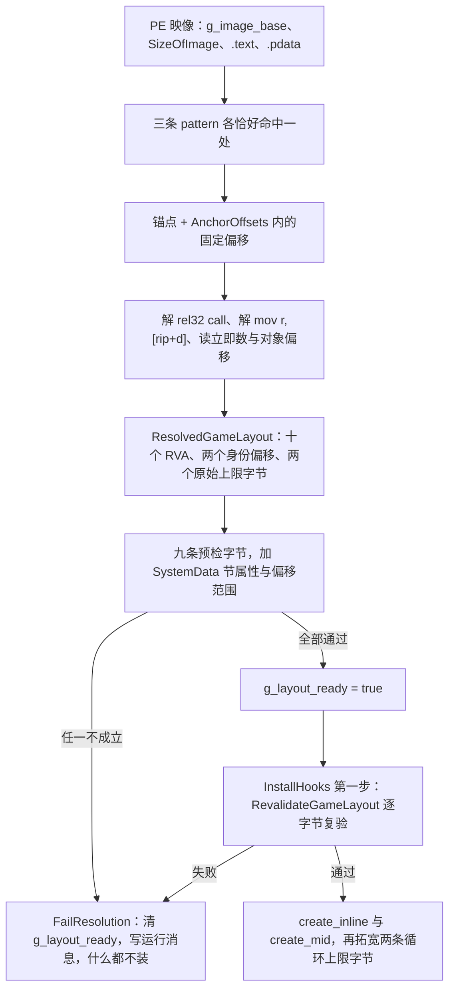

# 语义锚点与布局解析（fail-closed 的核心）

这套 mod 不持有任何游戏地址常量。`ResolvedGameLayout` 里的十个 RVA、两个 status 身份字段偏移、两个原始循环上限字节，全部在启动时从游戏自己的 PE 映像里现推：先从 `.text` 里认出三条语义锚点 pattern（唯一命中），再从锚点加固定偏移、解 rel32 call、解 `mov r,[rip+d]`、读立即数与对象偏移，最后用九条预检字节逐条作证。任何一步不成立就 **一个钩子、一个字节补丁都不装**，游戏照常启动，失败原因落在日志与运行消息里。

这一页讲的就是这条链：锚点长什么样、怎么变成 RVA、怎么复验、坏在哪一步怎么修。布局解析的消费方（钩子装在哪、循环上限怎么用）在[游戏侧注入运行期](/openwiki/workflows/skill-injection-runtime.md)；`Initialize` 的阶段链与失败回滚在[原生核心（C++ DLL）](/openwiki/architecture/native-core.md)；离线回归闸门在[验证地图](/openwiki/testing/verification-map.md)。

## 输出：`ResolvedGameLayout`

解析基准是 `g_image_base`（`Initialize` 第一行取 `GetModuleHandleW(nullptr)`），所有字段都是 **RVA**，用时现加基址。消费者只有两处：`skill_hooks.cpp`（钩子落点、循环上限、return-address 分类）与 `safe_game_access.cpp`（读身份、调状态重建）。

| 字段 | 怎么来的 | 谁用 |
| --- | --- | --- |
| `skill_apply_loop_limit_immediate_rva` | `apply_loop + kApplyLoopAnchors.loop_limit_immediate`（= `+4`），正好指在 `83 FF 0D` 的那个立即数上 | `ApplySkillLoopLimits` 拓宽它、`DisableGameplayHooksAndRestore` 还原它 |
| `skill_category_loop_limit_immediate_rva` | `category_loop + 6`，指在 `49 83 FD 0D` 的立即数上 | 同上（两条必须同宽，见事务式改写） |
| `skill_apply_getter_return_rva` | `apply_loop + 0x29` | detour 里拿 `_ReturnAddress()` 与它比对，判定"这次调用来自 apply 循环" |
| `skill_category_getter_return_rva` | `category_loop + 0x6E` | 同一判定；`OnSkillFetch` 还直接把它写进 `context.rip` |
| `skill_fetch_path_rva` | `category_loop + 0x1E` | `safetyhook::create_mid` 的落点 |
| `skill_fetch_call_path_rva` | `category_loop + 0x60` | 目前只解析并预检，没有任何钩子消费它 |
| `get_gem_data_by_index_rva` | `apply_loop + 0x24` 与 `category_loop + 0x69` 两处 rel32 call 各自解出的目标，且必须**指向同一个函数** | `safetyhook::create_inline` 的落点 |
| `status_notifier_rva` | notifier 命中处本身（`kNotifierRvaOffset = 0`） | 只有解析期用它读身份偏移；没有钩子 |
| `status_rebuild_rva` | apply helper 之前至多 16 个 `.pdata` 条目里唯一的那个候选 | `SafeInvokeStatusRebuild` 去调它 |
| `system_data_global_rva` | getter 函数体内 SystemData 锚点解出的 `mov rdi,[rip+d]` 的目标 | 通过节属性校验后留在布局里并打进日志；目前没有别的消费者 |
| `status_character_hash_offset` / `status_context_mode_offset` | 从 `8B 81` / `8B 88` 两条 opcode + disp32 配对读出（见下） | `SafeReadStatusIdentity` 每次读身份 |
| `skill_apply_original_limit` / `skill_category_original_limit` | 解析时从两个立即数字节读到的值，并已要求等于 `kNativeInternalSlotCount`（13） | 回滚上限字节时的还原值 |

这张表里没有一个字面 RVA：写死在源码里的只有 pattern 字节、掩码、锚点内偏移、call-site 偏移、身份解码点和预检字节——全部是**相对量**。所以游戏更新后要重导的是"对着新 exe 对字节"，不是改一个地址常量（见下文「游戏更新了怎么重导」）。

## 四条 pattern 与掩码约定

`layout_resolver.cpp` 里共有四条 pattern，全部用**显式掩码字符串**：`'x'` 精确匹配、`'?'` 通配。

| pattern | 认的是什么 | 掩码 | 通配的位置 |
| --- | --- | --- | --- |
| `kApplyLoopPattern` | apply 循环：`inc edi` + `cmp edi, 0x0D` + `jz rel32` + `vmovups [rbp-0x10], xmm6` | `"xxxxxxx????xxxxx"` | `jz` 的 rel32（每台机器/每个构建都不同） |
| `kCategoryLoopPattern` | category 循环：`inc r13` + `cmp r13, 0x0D` + `jz rel32` | `"xxxxxxxxx????"` | 同上 |
| `kNotifierPattern` | status notifier 序言 + 一段 `mov [rsp+…]` 清零 + `cmp ecx, 0x887AE0B0` / `mov ecx,[rax+disp]` 的身份判定 | 五段 `'x'` 夹两处 `"????"` | `mov r14,[rip+disp32]` 的 rip 位移、`call rel32` 的位移 |
| `kSystemDataPattern` | getter 体内的 `mov rdi,[rip+disp32]` / `lea rcx,[rdi+disp32]` / `mov rax,[rdi+disp32]` | `"xxx????xxx????xxx????xxx"` | 三处 disp32 |

`MakePattern` 用 `static_assert(ByteCount + 1 == MaskCount)` 钉住"掩码是同一长度的字符串字面量"（掩码数组的 `MaskCount` 含结尾 NUL，所以比字节数组多 1）；`PatternView::size` 取的是字节数组长度。也就是说，**掩码写短或写长一个字符是编译错误，不是运行期行为**——它不保证掩码内容对得上字节，那是人要对的东西。

`FindUniquePattern` 的语义要认清：

- 只在 `image.code_rva` / `image.code_size`（PE 代码段）范围内扫；
- 先找出掩码里**第一个通配位**，用那个位置上的字节做预筛（一个精确字节的过滤比逐字节比快得多）；整条 pattern 若没有 `'x'`（全通配）直接拒绝；
- 要求**恰好一处命中**：第二处命中出现就立即返回 `false`，不必数完；
- 它只负责"找唯一命中"，不负责判"这是不是要找的那条指令"。所以通配的位置必须恰好是那种"每台机器都不同"的位移字节，写错就是命中别处或命中不到——而这两种情况都会让解析失败，不会静默装错钩子。

> **坑一（"0 = 通配"那一套）**：仓库里**两套掩码约定并存且刻意不合并**——`layout_resolver.cpp` 用上面的显式 mask，`table_slot.cpp` 的 `CountMatches` 用 **`0 = 通配`**（非 0 才比）。两套的差别正好在"0 是不是通配"：在 `layout_resolver.cpp` 里那些 0 只是占位（匹配时由 `'?'` 决定跳过，字节值根本不读），而 `table_slot.cpp` 里 **0 本身就是通配符**。所以改 `table_slot.cpp` 的三条 pattern 时，**每个 0 都必须落在该通配的位置上**（rip 位移那 3 个字节）；若有一个 0 本来是想精确匹配的 0，匹配会**静默变宽**，后果是"命中数 ≠ 1"，于是 fail-closed：游戏照常启动、槽不解析、之后热应用只会拒写（`GBFR20_TABLE_SLOT_UNRESOLVED`），只有日志说得清原因。改这三条 pattern 时逐个数字对一遍，别只改个数。

## 从锚点到 RVA 的推导链

锚点内偏移只写在一处（`AnchorOffsets`），因为它被用三次：认领 RVA、读循环上限/解 call、最终预检。

```cpp
inline constexpr AnchorOffsets kApplyLoopAnchors   {4,    0x29, 0,    0,    0   };
//                          loop_limit_immediate = 4, getter_return = 0x29
inline constexpr AnchorOffsets kCategoryLoopAnchors{6,    0,    0x1E, 0x60, 0x6E};
//                          loop_limit = 6, fetch_path = 0x1E, fetch_call_path = 0x60, category_getter_return = 0x6E
inline constexpr uintptr_t kNotifierRvaOffset          = 0;
inline constexpr uintptr_t kNotifierCharacterOpcodeOffset = 0x45;
```

推导分六步，每步都有自己的失败 stage 名：

1. **唯一命中**（`unique semantic anchors`）：三条 pattern 各恰好命中一处，否则 `FailResolution`。
2. **循环/getter 契约**（`skill loop/getter contract`）：两个上限立即数字节读出来必须都等于 `kNativeInternalSlotCount`（13）且彼此相等；`DecodeRel32Call(apply_loop + 0x24)` 与 `DecodeRel32Call(category_loop + 0x69)` 各自解出一个目标，且两者必须相同——**两个独立调用点互相印证**，这就是 getter 的 RVA。
3. **函数边界**（`runtime-function boundaries`）：getter 必须是 `.pdata` 里某个函数的**起始**（`BeginAddress == getter RVA`）并通过 `kGetterPreflight`（12 字节序言）；`apply_loop` 必须落在某个 runtime function 内（apply helper，后面找状态重建要靠它）。
4. **状态重建**（`status rebuild call graph`）：在 apply helper **之前至多 16 个** `.pdata` 条目里找候选，候选必须（a）以自己的 `BeginAddress` 开头就匹配 `kStatusRebuildPreflight`，（b）函数体里**至少两处** rel32 call 指向 apply helper 的入口；候选恰好一个才算数。
5. **SystemData**（`SystemData getter anchor` / `SystemData/global-array decoding`）：在 getter 自己的 runtime function 范围内唯一命中 `kSystemDataPattern`，解出 `mov rdi,[rip+disp32]` 的目标（必须落在映像内）；再读另外两条指令的 disp32（偏移 `+10` 与 `+17`），两者必须**相等**且是"合理对象偏移"：非 0、`<= 0x200000`、按 `alignof(uintptr_t)`（8）对齐、且 `<= UINT32_MAX - sizeof(uintptr_t)`。
6. **身份字段偏移**（`status identity offsets`）：`getter + 0x1F` 的 16 位必须是 `0x818B`（即字节 `8B 81` = `mov eax,[rcx+disp32]`），于是 `+0x21` 的 disp32 就是 **context mode 偏移**；`notifier + 0x45` 的 16 位必须是 `0x888B`（字节 `8B 88` = `mov ecx,[rax+disp32]`），于是 `+0x47` 的 disp32 就是 **character hash 偏移**。两个偏移随后还要过同一套"合理对象偏移"检查（这里要求按 `alignof(uint32_t)` = 4 对齐）。



推导链：锚点 → 偏移/解码 → RVA 结构体 → 预检 → 复验 → 才允许改游戏字节。

`notifier` 这条 pattern 有个容易被忽略的耦合：它里面那段精确字节 `B9 B0 E0 7A 88`（`mov ecx, 0x887AE0B0`）**就是 `kUnwornCharacterHash` 这个哨兵常量本身**。所以哨兵与锚点是绑定的：改哨兵常量就必须同步改 `kNotifierBytes` 与它的掩码，否则 notifier 再也命中不到，整套布局解析随之失败。

## 预检：把"认领"和"作证"写在同一行

`PreflightCheck` 表把每个认领的 RVA 与它的预检字节放在**同一行**（`{rva, expected span, preflight_offset}`），所以"这个 RVA 是这么算出来的"和"它有这串字节"不可能分开改。共九条；`system_data_global_rva` 不在其中，它靠节属性作证（必须落在 `IMAGE_SCN_MEM_READ | IMAGE_SCN_MEM_WRITE` 且**不带** `IMAGE_SCN_MEM_EXECUTE` 的节里）。

`preflight_offset` 的规则只有两条例外，其余为 0：两条循环上限 RVA 由"锚点 + delta"得来，而它们的预检验的是**锚点本身**，所以这两条的 `preflight_offset` 必须等于 `kApplyLoopAnchors.loop_limit_immediate` / `kCategoryLoopAnchors.loop_limit_immediate`——写成别的数字就会去比对别处的字节。比对位置是 `rva - preflight_offset`，下溢（`rva < preflight_offset`）在比较之前就被拒。

两个实现细节：

- 表里的预检是运行期长度的 `std::span`，所以走 `MatchesPreflight`（内部是 `MatchesBytesAt`，SEH 包裹、按传入长度比），而不是按数组类型取长度的 `MatchesBytes<Size>` 模板——后者的长度来自数组类型，一旦长度是运行期得来的，缓冲尾部就会被一起比进去。这条区分在 `native_internal.h` 里对那两个函数是明写的。
- 失败时先逐条打印 `layout preflight FAILED: rva=0x… preflight_offset=0x… checked_at=0x… bytes=…`，再返回 `false`。解析失败只说"在哪个 stage"，这一行才说清是**哪一条**预检、拿哪个地址比的。

`ValidateResolvedGameLayout` 把上面这些收在一起（预检 + SystemData 节属性 + 两个身份偏移范围 + 两个上限立即数字节读回等于解析时记录的原值），解析时与复验时跑的是**同一个函数**。

## `RevalidateGameLayout`：已发布布局的逐字节复验

`RevalidateGameLayout` 不重新找锚点、也不看 PE 时间戳：它要求 `g_layout_ready` 为真且 `g_image_base` 非 0，重建一次 PE 视图，然后拿 `g_game_layout` 再跑一遍 `ValidateResolvedGameLayout`。也就是说，它证明的是"**当初记下的那些地址上，现在还是那些字节**"。

生产代码里它只有一个调用点：`InstallHooks` 的第一个子阶段 `required-byte-rva-preflight`，紧接其后才是 `create_inline`（getter）与 `create_mid`（fetch 路径）。这个顺序不是排版：

> **坑二：锚点必须在 safetyhook 改写 `.text` 之前解析。** `get_gem_data_by_index_rva` 正是 `create_inline` 的目标，而 `kGetterPreflight` 检的就是该函数开头的 12 个字节——钩子一装，那 12 个字节就变成跳转指令，此后任何一次 `RevalidateGameLayout` 都会失败。同理 `ResolveTableSlot()` 刻意排在 `InstallHooks()` **之前**（`Initialize` 里的注释明写理由）：槽发布锚点要用没被改写的字节匹配。所以这条链上的顺序是"解析 → 复验 → 才允许改写 `.text`"，中间的复验是唯一能在装钩子前发现"`.text` 已经被人动过"的闸。

还有一条只在使用顺序上体现的不变量：复验会把两个循环上限的立即数字节与 `skill_apply_original_limit` / `skill_category_original_limit`（解析时读到的 13）比对，而 `ApplySkillLoopLimits` 会把这两个字节改成 `13 + 虚拟槽数`。**所以复验只能在拓宽那两个字节之前跑**——这也是 `InstallHooks` 先做 `required-byte-rva-preflight`、最后才做 `skill-loop-limit-patches` 的原因之一。

## 解析失败就什么都不装

每一步失败都走同一个出口：

```cpp
bool FailResolution(std::string_view stage) {
    ResetGameLayout();
    SetRuntimeMessage(std::format(
        "Game layout resolution failed at {}; gameplay hooks were not installed and persisted "
        "sigil selections were left unchanged.",
        stage));
    return false;
}
```

`Initialize` 拿到 `false` 就 `finish_initialization(false)` 并返回 0：没有钩子、没有字节补丁、模板表与持久化的因子选择一个都不动。可能的 `stage` 取值共十个：`PE image validation`、`unique semantic anchors`、`skill loop/getter contract`、`runtime-function boundaries`、`status rebuild call graph`、`SystemData getter anchor`、`SystemData/global-array decoding`、`status identity offsets`、`status identity offset ranges`、`resolved layout final validation`（另有预检那行详细日志）。日志里最后完成的阶段行是**显式**的（`CompleteStartupPhase`），所以"卡住的启动"能靠阶段序列 + 第一个失败 stage 定位。

成功路径只报两件有用的事：`Layout resolved and validated from semantic anchors (PE 0x{:X}).`（时间戳用来认游戏构建），以及**另起一行**的 `getter=0x… SystemData=0x…`——只有在查"钩子落到别处"这类疑难 session 时才需要，平时扫日志不该被这串地址堵住眼睛。

`ResetGameLayout()` 只把 `g_layout_ready` store 成 `false`，**不清** `ResolvedGameLayout` 结构体：已发布的布局在进程余下时间里保持不变，清空这个平凡结构体会与"刚在关机或安装失败回滚前读到上一份真状态"的读者相争。读者全部用 acquire 读这个标志（`SafeReadStatusIdentity`、`SafeInvokeStatusRebuild`、`ApplySkillLoopLimits`、热重建路径、`DisableGameplayHooksAndRestore` 的还原路径），标志为假时它们全部退化成 no-op 或拒绝，而不是拿一个半截布局去算地址。

## 游戏更新了怎么重导

**第一步永远是本地跑一遍 harness**：`tests/NativeLayoutHarness`（或 `tools/build-release.ps1`，它在设置了 `GBFR_EXE` 时会调用同一个脚本，失败即抛错、没设置就打印 `layout harness: skipped` 继续）。它拿真实 exe 跑一遍**生产代码**的解析器，输出 `ResolveGameLayout` 是否成功、`RevalidateGameLayout` 是否通过、以及"改坏一个字节后是否被拒"。失败时它抛出的就是"生产解析器拒绝了这个 exe：锚点对不上（游戏更新了，需要重导）"。日志里的失败 stage 与 `layout preflight FAILED` 那行告诉你是哪一环——按 stage 反查上面的推导链六步，就知道该动哪张表。**改这段代码或游戏更新时，harness 是本地唯一能给出答案的东西**：它证伪用真实字节，不依赖任何人的记忆或一张地址表。

要重新对的常量（都住在 `layout_resolver.cpp`，只有 `kNativeInternalSlotCount` 在 `native_internal.h`）：

1. **四条 pattern 的字节与掩码**：`kApplyLoopBytes` / `kCategoryLoopBytes` / `kNotifierBytes` / `kSystemDataBytes` 与对应 mask 字符串。掩码里 `'?'` 必须落在真正会变的位移字节上；长度关系由 `MakePattern` 的 `static_assert` 兜住。
2. **偏移表**：`kApplyLoopAnchors`、`kCategoryLoopAnchors` 两行，以及只以立即数形式写在函数体里的 call-site（`apply_loop + 0x24`、`category_loop + 0x69`）。
3. **身份解码点**：`getter + 0x1F` / `+0x21` 与 `notifier + kNotifierCharacterOpcodeOffset`（`0x45`）/ `+0x47`，以及两个期望 opcode（`0x818B`、`0x888B`）——opcode 变了说明读偏移的那条指令换了形状。
4. **九条预检字节**：`kSkillApplyLoopPreflight`、`kSkillApplyGetterReturnPreflight`、`kSkillCategoryLoopPreflight`、`kSkillFetchPreflight`、`kSkillFetchCallPathPreflight`、`kSkillCategoryGetterReturnPreflight`、`kGetterPreflight`、`kStatusRebuildPreflight`、`kStatusNotifierPreflight`，以及两条 `preflight_offset` 必须与偏移表保持一致。
5. **槽数与它的三处孪生**：`kNativeInternalSlotCount`（13）同时出现在"两个立即数字节必须等于它"、`kApplyLoopBytes` 的第 5 个字节（`0x0D`）、`kCategoryLoopBytes` 的第 7 个字节（`0x0D`）里——游戏原生槽数一变，这三处一起变。
6. **`GemData` 的布局**（`sizeof == 0x24` 的 `static_assert` 与逐字段偏移）：它不跨 ABI，但字段顺序/大小变了就要跟着对模板合成与读取路径；这类改动**不必**动 ABI 版本号。

仓库里**没有可硬编码的期望地址**：`layout_resolver.cpp` 从不拿任何 RVA 与常量比较，唯一的期望值是锚点附近那些相对量、pattern 字节与预检字节；harness 也刻意不写任何期望地址（见下）。这条性质的实际意义是——重导工作不是"改一个地址数字"，而是"对着新 exe 重新对字节"，并且每次都能由 harness 在本地证伪。找不到唯一命中时**不要**加"扫描兜底"或写死地址：拒装的代价只是这台机器上钩子没生效，而猜错地址的代价是把游戏的内存改坏。

## 验证现状与覆盖面

唯一的自动化验证是 `tests/NativeLayoutHarness`：它把一个 PE32+ exe 按段映射进 `SizeOfImage` 大小的缓冲（`MapImage`），把缓冲首址当作 `g_image_base`，然后断言三件事——

1. `ResolveGameLayout()` 必须成功（锚点还在）；
2. `RevalidateGameLayout()` 必须过（解析结果在字节上自证）；
3. 把 `skill_fetch_path_rva` 处的一个字节翻一位之后，`RevalidateGameLayout()` **必须**失败——这一条才是"fail-closed 真的会拒"的证明。

它离线编译**生产代码**的 `layout_resolver.cpp` 与 `safe_game_access.cpp`，只 stub 掉 `g_image_base`、`g_layout_ready`、`g_hooks_ready`、`g_game_layout`、`Log`、`SetRuntimeMessage` 这些外部符号；`run.ps1` 用 `cl.exe /std:c++latest /EHa /O2 /utf-8 /Zc:threadSafeInit` 编译（并带上 `third_party` 头目录，因为 `native_internal.h` 含 safetyhook 头）。命令行给 `-Exe` 或环境变量 `GBFR_EXE`；两者都没有就打 `NATIVE_LAYOUT=SKIP` 并以 0 退出——**SKIP 不是通过**，它只是让闸门在任何机器上都能跑。成功时打印 `NATIVE_LAYOUT=PASS` 与 `NATIVE_LAYOUT_FAIL_CLOSED=PASS`。

它覆盖不到的部分要诚实记住：钩子的实际落点与运行时行为（`create_inline` / `create_mid` / 循环上限补丁）、身份的读取路径、状态重建调用、活表写入，都只能在真机游戏里验证。覆盖面与其余套件见[验证地图](/openwiki/testing/verification-map.md)。
