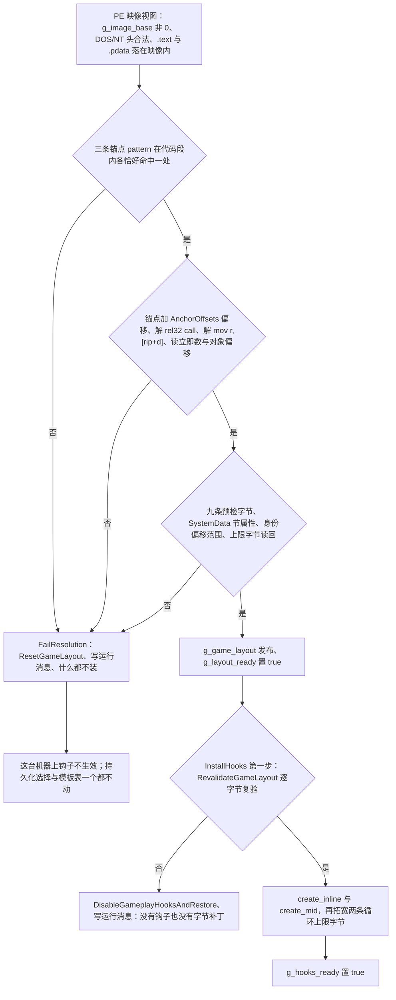
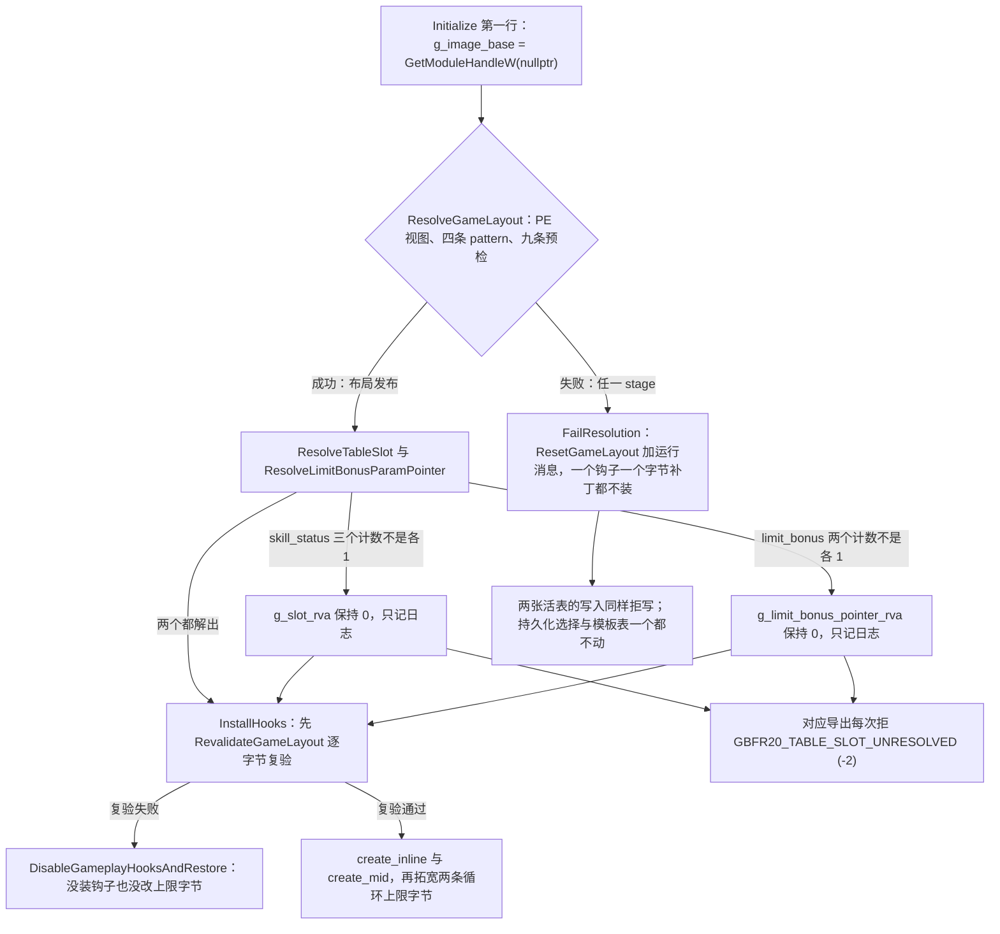

# 语义锚点与布局解析（fail-closed 的核心）

这套 mod 不持有任何游戏地址常量。运行期要用到的每一个地址，都在启动时从游戏自己的 PE 映像里现推，靠两族语义锚点：

- **布局那一族**（`layout_resolver.cpp`）认出四条 pattern（三条语义锚点，加一条落在 getter 函数体内的 SystemData 锚点），每条各要求唯一命中，再从锚点加固定偏移、解 rel32 call、解 `mov r,[rip+d]`、读立即数与对象偏移，最后用九条预检字节逐条作证：结果是 `ResolvedGameLayout` 的十个 RVA、两个 status 身份字段偏移、两个原始循环上限字节。**任何一步不成立就一个钩子、一个字节补丁都不装**，游戏照常启动。
- **两张活表发布位置那一族**（`table_slot.cpp`）认出四条 pattern，解出游戏发布 `skill_status` 的**槽首**（槽是 `handle@+0` / `buffer@+8` / `?@+0x10` 三段式）与 `limit_bonus_param` 的**指针字段**。这一族失败**不挡初始化、不影响钩子**：只让对应那个导出从此一律拒写（`GBFR20_TABLE_SLOT_UNRESOLVED`，-2），日志说清是哪一步。

这一页讲的就是这两条链：每条锚点长什么样、要求命中几次、怎么变成 RVA、怎么复验、坏在哪一步、失败时停在哪。布局解析的消费方（钩子装在哪、循环上限怎么用）在[游戏侧注入运行期](/openwiki/workflows/skill-injection-runtime.md)；`Initialize` 的阶段链与失败回滚在[原生核心（C++ DLL）](/openwiki/architecture/native-core.md)；两张活表的行布局与写入闸门在 [skill_status 表与活表写入闸门](/openwiki/concepts/skill-status-table.md) 与 [limit_bonus_param 表](/openwiki/concepts/limit-bonus-table.md)；离线回归闸门在[验证地图](/openwiki/testing/verification-map.md)。

## 输出：`ResolvedGameLayout`

解析基准是 `g_image_base`（`Initialize` 第一行取 `GetModuleHandleW(nullptr)`），所有字段都是 **RVA**，用时现加基址。结构体与 `kNativeInternalSlotCount` 声明在 `native_internal.h`，解析、校验、复验都在 `layout_resolver.cpp`。字段消费者只有两个翻译单元：`skill_hooks.cpp`（钩子落点、循环上限、return-address 分类）与 `safe_game_access.cpp`（读身份、调状态重建）；`template_loadout.cpp` 的热路径只消费"布局就绪"这个标志，不读字段。

| 字段 | 怎么解出 | 谁消费 | 在九条预检内 |
| --- | --- | --- | --- |
| `skill_apply_loop_limit_immediate_rva` | `apply_loop + kApplyLoopAnchors.loop_limit_immediate`（= `+4`），正好指在 `83 FF 0D` 的那个立即数上 | `ApplySkillLoopLimits` 拓宽它、`DisableGameplayHooksAndRestore` 还原它 | 是：`kSkillApplyLoopPreflight`，且 `preflight_offset` 必须 = `4`（检的是锚点本身） |
| `skill_apply_getter_return_rva` | `apply_loop + 0x29` | detour 里拿 `_ReturnAddress()` 与它比对，判定"这次调用来自 apply 循环" | 是：`kSkillApplyGetterReturnPreflight`，`preflight_offset` = 0 |
| `skill_category_loop_limit_immediate_rva` | `category_loop + 6`，指在 `49 83 FD 0D` 的立即数上 | 同第一行（两条必须同宽，见事务式改写） | 是：`kSkillCategoryLoopPreflight`，`preflight_offset` 必须 = `6` |
| `skill_fetch_path_rva` | `category_loop + 0x1E` | `safetyhook::create_mid` 的落点 | 是：`kSkillFetchPreflight` |
| `skill_fetch_call_path_rva` | `category_loop + 0x60` | **没有消费者**：只解析、只预检 | 是：`kSkillFetchCallPathPreflight` |
| `skill_category_getter_return_rva` | `category_loop + 0x6E` | 同一 return-address 判定；`OnSkillFetch` 还直接把它写进 `context.rip` | 是：`kSkillCategoryGetterReturnPreflight` |
| `get_gem_data_by_index_rva` | `apply_loop + 0x24` 与 `category_loop + 0x69` 两处 rel32 call 各自解出的目标，且必须**指向同一个函数** | `safetyhook::create_inline` 的落点 | 是：`kGetterPreflight`（12 字节序言） |
| `status_rebuild_rva` | apply helper 之前至多 16 个 `.pdata` 条目里唯一的那个候选 | `SafeInvokeStatusRebuild` 去调它 | 是：`kStatusRebuildPreflight` |
| `status_notifier_rva` | notifier 命中处本身（`kNotifierRvaOffset = 0`） | 只在解析期用它读身份偏移；没有钩子 | 是：`kStatusNotifierPreflight` |
| `system_data_global_rva` | getter 函数体内 SystemData 锚点解出的 `mov rdi,[rip+d]` 的目标 | **没有别的消费者**：通过节属性校验后留在布局里并打进日志 | **否**——它靠节属性作证：必须落在 `READ \| WRITE` 且**不带** `EXECUTE` 的节里 |
| `status_character_hash_offset` | notifier `+0x45` 处的 opcode `0x888B`（字节 `8B 88`）之后、`+0x47` 的 disp32 | `SafeReadStatusIdentity` 每次读身份 | **否**——另一套检查：opcode 配对读 + 4 对齐的合理对象偏移 |
| `status_context_mode_offset` | getter `+0x1F` 处的 opcode `0x818B`（字节 `8B 81`）之后、`+0x21` 的 disp32 | 同上 | **否**——同上 |
| `skill_apply_original_limit` / `skill_category_original_limit` | 解析时从两个立即数字节读到的值，并已要求等于 `kNativeInternalSlotCount`（13） | 回滚上限字节时的还原值 | 特殊：预检比的是锚点那串字节（其中含这两个立即数），`ValidateResolvedGameLayout` 末尾再把它们读回来与记录值逐一比对 |

这张表里没有一行是字面地址：写死在源码里的只有 pattern 字节、掩码、锚点内偏移、call-site 偏移、身份解码点和预检字节——**全部是相对量**。所以游戏更新后要重导的是"对着新 exe 对字节"，而不是改一个地址常量（见下文「游戏更新了怎么重导」）。

## 先有 PE 视图：一切读取都先过范围闸

`TryBuildImageView` 是所有解析的第一步，它自己就是一道 fail-closed 闸（失败 stage 名就是 `PE image validation`）：

1. `g_image_base != 0`；
2. DOS 头 magic 正确，且 `e_lfanew` 落在 `sizeof(IMAGE_DOS_HEADER)` 与 `0x100000 - sizeof(IMAGE_NT_HEADERS64)` 之间——这个上界的用处是"后面几次读都落在已映射的头区域里"，畸形 `e_lfanew` 永远碰不到未映射内存；
3. NT signature、PE32+ magic、`SizeOfImage` 落在 `0x1000`..`0x20000000`（给这个尺寸一个合理上界）；
4. 代码段：先按名字找 `.text`，找不到才退回"最大的 `IMAGE_SCN_MEM_EXECUTE` 段"，并要求它的 `VirtualAddress`/`VirtualSize` 落在映像内且非空；
5. 异常目录（`.pdata`，`IMAGE_DIRECTORY_ENTRY_EXCEPTION`）必须存在、至少容得下一条 `IMAGE_RUNTIME_FUNCTION_ENTRY`、且落在映像内。

此后每次读字节都先过 `RangeInsideImage`（`rva <= size && len <= size - rva`），字节比较一律 SEH 包裹。PE 视图的"所有权"也在这套划分里：`ImageView` / `IsRvaInSection` / `TryBuildImageView` 都是 `layout_resolver.cpp` 匿名命名空间的私货，头文件只对外暴露 `IsInWritableImageSection`、`TryGetCodeSection`（与 `CodeSectionView`）——**两张活表的定位（`table_slot.cpp` 的 `ResolveTableSlot` 与 `ResolveLimitBonusParamPointer`）复用的就是同一份 `.text` 定义**，而 `DecodeRipTarget`（住在 `safe_game_access.cpp`）是布局锚点与两张表的槽/指针锚点共用的唯一 RIP-rel32 算术（位移在指令 `+d`、指令长 N、目标必须落在映像内）。也就是说"怎么找代码、怎么算 rip 相对寻址"各只有一份实现。

## 四条 pattern 与两套掩码约定

`layout_resolver.cpp` 里共有四条 pattern，全部用**显式掩码字符串**：`'x'` 精确匹配、`'?'` 通配。它们的字节与"必须命中几次"见下面「八个 pattern 一览」那张表；这里只说语义：

- `kApplyLoopPattern`：apply 循环——`inc edi` + `cmp edi, 0x0D` + `jz rel32` + `vmovups [rbp-0x10], xmm6`，掩码 `"xxxxxxx????xxxxx"`，通配处是 `jz` 的 rel32（每台机器/每个构建都不同）。
- `kCategoryLoopPattern`：category 循环——`inc r13` + `cmp r13, 0x0D` + `jz rel32`，掩码 `"xxxxxxxxx????"`，通配处同上。
- `kNotifierPattern`：status notifier 序言 + 一段 `mov [rsp+…]` 清零 + `cmp ecx, 0x887AE0B0` / `mov ecx,[rax+disp]` 的身份判定；掩码是五段 `'x'` 夹两处 `"????"`——从第 21 个字节起 4 个通配（`mov r14,[rip+disp32]` 的 rip 位移）、再 25 个精确字节后 4 个通配（`call rel32` 的位移）、末尾 22 个精确字节，合起来 75 字节。
- `kSystemDataPattern`：getter 体内的 `mov rdi,[rip+disp32]` / `lea rcx,[rdi+disp32]` / `mov rax,[rdi+disp32]`，掩码 `"xxx????xxx????xxx????xxx"`，三处 disp32 通配。

`MakePattern` 用 `static_assert(ByteCount + 1 == MaskCount)` 钉住"掩码是同一长度的字符串字面量"（掩码数组的 `MaskCount` 含结尾 NUL，所以比字节数组多 1）；`PatternView::size` 取的是字节数组长度。也就是说，**掩码写短或写长一个字符是编译错误，不是运行期行为**——它不保证掩码内容对得上字节，那是人要对的东西。

`FindUniquePattern` 的语义要认清：

- 只在 `image.code_rva` / `image.code_size`（PE 代码段）范围内扫；SystemData 那条例外，它的"范围"是 getter 那个 runtime function；
- 预筛用的是掩码里**第一个 `'x'`（精确字节）所在位置**：先用那个位置上的字节做过滤，再逐字节比（一个精确字节的过滤比逐字节比快得多）。整条 pattern 若一个 `'x'` 都没有（全通配）直接拒绝——否则预筛无从谈起；
- 要求**恰好一处命中**：第二处命中出现就立即返回 `false`，不必数完；
- 它只负责"找唯一命中"，不负责判"这是不是要找的那条指令"。所以通配的位置必须恰好是那种"每台机器都不同"的位移字节，写错就是命中别处或命中不到——而这两种情况都会让解析失败，不会静默装错钩子。

> **坑一（"0 = 通配"那一套）**：仓库里**两套掩码约定并存且刻意不合并**——`layout_resolver.cpp` 用上面的显式 mask，`table_slot.cpp` 的 `CountMatches` 用 **`0 = 通配`**（非 0 才比）。两套的差别正好在"0 是不是通配"：在 `layout_resolver.cpp` 里那些 0 只是占位（匹配时由 `'?'` 决定跳过，字节值根本不读），而 `table_slot.cpp` 里 **0 本身就是通配符**。所以改 `table_slot.cpp` 那四条 pattern（`kRowLoopSetup`、`kBufferPointerLoad`、`kSlotBaseStore`、`kLimitBonusRowLoopSetup`）时，**每个 0 都必须落在该通配的位置上**（两条发布指令的 rip 位移那几字节）；若有一个 0 本来是想精确匹配的 0，匹配会**静默变宽**，后果是"命中数 ≠ 1"，于是 fail-closed：游戏照常启动、对应那张表的定位保持未解析（`g_slot_rva` / `g_limit_bonus_pointer_rva` 保持 0）、之后热应用只会拒写，只有日志说得清原因。改这几条 pattern 时逐个数字对一遍，别只改个数。

## 从锚点到 RVA 的推导链

锚点内偏移只写在一处（`AnchorOffsets`），因为它被用三次：认领 RVA、读循环上限/解 call、最终预检。

```cpp
struct AnchorOffsets {
    uintptr_t loop_limit_immediate = 0;
    uintptr_t getter_return = 0;
    uintptr_t fetch_path = 0;
    uintptr_t fetch_call_path = 0;
    uintptr_t category_getter_return = 0;
};

inline constexpr AnchorOffsets kApplyLoopAnchors   {4,    0x29, 0,    0,    0   };
//                          loop_limit_immediate = 4, getter_return = 0x29
inline constexpr AnchorOffsets kCategoryLoopAnchors{6,    0,    0x1E, 0x60, 0x6E};
//                          loop_limit = 6, fetch_path = 0x1E, fetch_call_path = 0x60, category_getter_return = 0x6E

// notifier 命中处本身就是 status_notifier_rva；它的字段偏移另算（见读身份那段）。
inline constexpr uintptr_t kNotifierRvaOffset = 0;
inline constexpr uintptr_t kNotifierCharacterOpcodeOffset = 0x45;
```

推导分六步，每步都有自己的失败 stage 名：

1. **唯一命中**（`unique semantic anchors`）：三条锚点 pattern 各恰好命中一处，否则 `FailResolution`。（SystemData 那条不在这一步，它只能在自己的函数范围里找。）
2. **循环/getter 契约**（`skill loop/getter contract`）：两个上限立即数字节读出来必须都等于 `kNativeInternalSlotCount`（13）且彼此相等；`DecodeRel32Call(apply_loop + 0x24)` 与 `DecodeRel32Call(category_loop + 0x69)` 各自解出一个目标，且两者必须相同——**两个独立调用点互相印证**，这就是 getter 的 RVA。
3. **函数边界**（`runtime-function boundaries`）：getter 必须是 `.pdata` 里某个函数的**起始**（`BeginAddress == getter RVA`）、落在 `READ | EXECUTE` 节里，并通过 `kGetterPreflight`（12 字节序言）；`apply_loop` 必须落在某个 runtime function 内（apply helper，后面找状态重建要靠它）。
4. **状态重建**（`status rebuild call graph`）：在 apply helper **之前至多 16 个** `.pdata` 条目里找候选，候选必须（a）以自己的 `BeginAddress` 开头就匹配 `kStatusRebuildPreflight`，（b）函数体里**至少两处** rel32 call 指向 apply helper 的入口（逐字节偏移地数 `E8 rel32`，不靠块结构猜）。候选恰好一个才算数。
5. **SystemData**（`SystemData getter anchor` / `SystemData/global-array decoding`）：在 getter 自己的 runtime function 范围内唯一命中 `kSystemDataPattern`，解出 `mov rdi,[rip+disp32]` 的目标（必须落在映像内）；再读另外两条指令的 disp32（偏移 `+10` 与 `+17`），两者必须**相等**且是"合理对象偏移"：非 0、`<= 0x200000`、按 `alignof(uintptr_t)`（8）对齐、且 `<= UINT32_MAX - sizeof(uintptr_t)`。
6. **身份字段偏移**（`status identity offsets` / `status identity offset ranges`）：`getter + 0x1F` 的 16 位必须是 `0x818B`（即字节 `8B 81` = `mov eax,[rcx+disp32]`），于是 `+0x21` 的 disp32 就是 **context mode 偏移**；`notifier + 0x45` 的 16 位必须是 `0x888B`（字节 `8B 88` = `mov ecx,[rax+disp32]`），于是 `+0x47` 的 disp32 就是 **character hash 偏移**。两个偏移随后还要过同一套"合理对象偏移"检查（这里要求按 `alignof(uint32_t)` = 4 对齐）。

第 6 步这两处的"证据强度"刻意不同，值得记住：notifier 那两个 disp32（当前构建里 hash 偏移是 `0x5EA8`）**本身就是 `kNotifierBytes` 里的精确字节**，所以对象布局一改，锚点会先命中不到；而 getter 的 `8B 81`/disp32 不在任何 pattern 里（`kGetterPreflight` 只覆盖序言），只靠 opcode 配对 + 范围检查兜住。改游戏侧对象布局时，前者会在锚点阶段失败，后者会落到 `status identity offsets` —— 两个 stage 名指向的就是这两个不同的原因。


```mermaid
flowchart TD
    IMG["PE 映像视图：g_image_base 非 0、DOS/NT 头合法、.text 与 .pdata 落在映像内"] --> UNC{"三条锚点 pattern 在代码段内各恰好命中一处"}
    UNC -->|否| FAIL["FailResolution：ResetGameLayout、写运行消息、什么都不装"]
    UNC -->|是| DEC{"锚点加 AnchorOffsets 偏移、解 rel32 call、解 mov r,[rip+d]、读立即数与对象偏移"}
    DEC -->|否| FAIL
    DEC -->|是| PF{"九条预检字节、SystemData 节属性、身份偏移范围、上限字节读回"}
    PF -->|否| FAIL
    PF -->|是| PUB["g_game_layout 发布、g_layout_ready 置 true"]
    PUB --> RV{"InstallHooks 第一步：RevalidateGameLayout 逐字节复验"}
    RV -->|否| ROLL["DisableGameplayHooksAndRestore、写运行消息：没有钩子也没有字节补丁"]
    RV -->|是| HK["create_inline 与 create_mid，再拓宽两条循环上限字节"]
    HK --> READY["g_hooks_ready 置 true"]
    FAIL --> NOOP["这台机器上钩子不生效；持久化选择与模板表一个都不动"]
```

图：从锚点命中到装钩子的判定流；三个"否"分支都汇进同一条 fail-closed 出口——布局不发布，钩子与字节补丁都不装。

`notifier` 这条 pattern 还有个容易被忽略的耦合：它里面那段精确字节 `B9 B0 E0 7A 88`（`mov ecx, 0x887AE0B0`）**就是 `kUnwornCharacterHash` 这个哨兵常量本身**。所以哨兵与锚点是绑定的：改哨兵常量就必须同步改 `kNotifierBytes` 与它的掩码，否则 notifier 再也命中不到，整套布局解析随之失败。

## 预检：把"认领"和"作证"写在同一行

`PreflightCheck` 表把每个认领的 RVA 与它的预检字节放在**同一行**（`{rva, expected span, preflight_offset}`），所以"这个 RVA 是这么算出来的"和"它有这串字节"不可能分开改。共九条；`system_data_global_rva` 不在其中，它靠节属性作证（`READ | WRITE` 且**不带** `EXECUTE`）。

`preflight_offset` 的规则只有两条例外，其余为 0：两条循环上限 RVA 由"锚点 + delta"得来，而它们的预检验的是**锚点本身**，所以这两条的 `preflight_offset` 必须等于 `kApplyLoopAnchors.loop_limit_immediate` / `kCategoryLoopAnchors.loop_limit_immediate`——写成别的数字就会去比对别处的字节。比对位置是 `rva - preflight_offset`：`rva < preflight_offset` 在短路求值里先被拒（即便漏过去，`MatchesPreflight` 的 `RangeInsideImage` 也会挡下这个回绕出来的地址）。

三个实现细节：

- 表里的预检是运行期长度的 `std::span`，所以走 `MatchesPreflight`（`RangeInsideImage` 之后是 SEH 包裹的 `MatchesBytesAt`，按传入长度比），而不是按数组类型取长度的 `MatchesBytes<Size>` 模板——后者的长度来自数组类型，一旦长度是运行期得来的，缓冲尾部就会被一起比进去。这条区分在 `native_internal.h` 里对那两个函数是明写的（`MatchesBytesAtRva` 那类模板只在固定长度的序言上用：getter、状态重建）。
- 失败时先逐条打印 `layout preflight FAILED: rva=0x… preflight_offset=0x… checked_at=0x… bytes=…`，再返回 `false`。解析失败只说"在哪个 stage"，这一行才说清是**哪一条**预检、拿哪个地址比的。
- 预检字节表（含那九条与两套 pattern 用的字节）只住在 `layout_resolver.cpp` 的匿名命名空间里：只那一个翻译单元用，放进共享头等于把实现细节当模块接口发布。

`ValidateResolvedGameLayout` 把上面这些收在一起（预检 + SystemData 节属性 + 两个身份偏移范围 + 两个上限立即数字节读回等于解析时记录的原值），解析时与复验时跑的是**同一个函数**。

## `RevalidateGameLayout`：已发布布局的逐字节复验

`RevalidateGameLayout` 不重新找锚点、也不看 PE 时间戳：它要求 `g_layout_ready` 为真且 `g_image_base` 非 0，重建一次 PE 视图，然后拿 `g_game_layout` 再跑一遍 `ValidateResolvedGameLayout`。也就是说，它证明的是"**当初记下的那些地址上，现在还是那些字节**"。它唯一的生成代码调用点是 `InstallHooks` 的第一个子阶段 `required-byte-rva-preflight`。

生产代码里它只有这一个调用点，紧接其后才是 `create_inline`（getter）与 `create_mid`（fetch 路径）。这个顺序不是排版：

> **坑二：锚点必须在 safetyhook 改写 `.text` 之前解析。** `get_gem_data_by_index_rva` 正是 `create_inline` 的目标，而 `kGetterPreflight` 检的就是该函数开头的 12 个字节——钩子一装，那 12 个字节就变成跳转指令，此后任何一次 `RevalidateGameLayout` 都会失败。同理 `ResolveTableSlot()` 与 `ResolveLimitBonusParamPointer()` 都刻意排在 `InstallHooks()` **之前**（`Initialize` 里的注释明写理由）：两张表的锚点要用没被改写的字节匹配。所以这条链上的顺序是"解析 → 复验 → 才允许改写 `.text`"，中间的复验是唯一能在装钩子前发现"`.text` 已经被人动过"的闸。

还有一条只在使用顺序上体现的不变量：复验会把两个循环上限的立即数字节与 `skill_apply_original_limit` / `skill_category_original_limit`（解析时读到的 13）比对，而 `ApplySkillLoopLimits` 会把这两个字节改成 `13 + 虚拟槽数`。**所以复验只能在拓宽那两个字节之前跑**——这也是 `InstallHooks` 先做 `required-byte-rva-preflight`、最后才做 `skill-loop-limit-patches` 的原因之一。

## 第二族：两张活表的发布位置

`table_slot.cpp` 覆盖**两张**活表，它们的行形状不同，所以锚点与"身份"的证法也不同：

| | `skill_status`（因子技能） | `limit_bonus_param`（能力强化数值） |
| --- | --- | --- |
| 表形状 | 8 字节行数头 + 52 字节行 | 8 字节行数头 + 84 字节行 |
| 行循环锚点 | `kRowLoopSetup`（12 字节，`imul rdi, rsi, 0x34` + `add rdi, rbx` + `vxorps`） | `kLimitBonusRowLoopSetup`（7 字节，`imul r14, rsi, 0x54` + `add r14, rbx`） |
| 窗口内的门 | 两条发布指令各必须恰好 1 | 只要求"缓冲区指针加载"恰好 1；槽发布那条**刻意不作门** |
| 解出的东西 | 槽首 RVA（指针字段固定在槽 +8，不另存） | **指针字段本身**的 RVA（没有槽） |
| 静态交叉验证 | 两条锚点的目标必须正好差 8 | 没有第二条指令可比 |
| 身份由谁承担 | 槽首↔指针字段的 +8 关系 + 运行期逐行 `Key` 比对 | 运行期：行数落在 1..2²⁰、目标 `Key` 在整张表里恰好一次 |

### `skill_status`：行循环锚点 + 两条发布指令

`ResolveTableSlot` 要求 `SearchAnchorWindow` 数出的三个计数**各恰好 1**：行循环锚点、`kBufferPointerLoad`（`mov rbx,[rip+d]` = 缓冲区指针字段，槽 +8）、`kSlotBaseStore`（`mov [rip+d],rcx` 槽首、`vmovups [rip+d],xmm0` 指针字段）。为什么两条发布指令要配一个窗口：同一个函数里每一张表都有一份发布指令，只有落在行循环锚点**前面**的那一对属于 `skill_status`；窗口取 `0x800` 对真实距离有充裕余量，又刚好把隔壁那张表挡出去。

解出来的两个目标还要过两道：两条锚点都是 7 字节的 `mov r,[rip+d]` / `mov [rip+d],r`，位移都在指令 `+3`，所以两条都用 `DecodeRipTarget(…, 3, 7, …)` 解；解出的 `slot_rva` 与 `buffer_pointer_rva` **必须正好差 8**，且两者都要落在可写映像节里（`IsInWritableImageSection`：`READ | WRITE` 且**不带** `EXECUTE`；槽首按 24 字节查）。任何一条不成立都只记一行日志并返回——`g_slot_rva` 保持 0。

运行期只记这一个值：指针字段固定在槽 +8，所以 `TryGetLiveTableBuffer` 每次调用现算 `g_image_base + slot_rva + 8`，先过 `IsGameRange(…, kReadableProtect)` 再 `SafeReadUint64`。游戏重新解析并发布新缓冲区时，下一个调用就跟上了——这里不存在"缓存失效"这个概念。

### `limit_bonus_param`：只有一条发布指令

第二张表的行循环锚点是 `imul r14, rsi, 0x54`（`4C 6B F6 54`）+ `add r14, rbx`（`49 01 DE`）这 7 个字节：里面没有 rel32、没有 rip 位移，所以它是**纯语义锚点**——只要这张表还是 84 字节行，这段指令序列就还在（实测在全 `.text` 里只出现一次）。

它的窗口里**只要求两个计数各恰好 1**：行循环锚点，加"缓冲区指针加载"那一条。槽发布那条 `kSlotBaseStore` 与这张表的发布指令形状不同，实测在这个窗口里 0 命中，**拿它当门等于永远拒写**——所以 `slot_store_matches` 只写进日志。这是同一套机制里唯一一处"故意不用某个锚点"的地方，读日志时别把它当成漏检。

解出的目标是**指针字段本身**的 RVA，不是槽首：这张表没有 `skill_status` 那条发布指令，无法静态交叉验证"槽首 = 指针字段 − 8"，所以 `ResolveLimitBonusParamPointer` 直接 `DecodeRipTarget(…, 3, 7, …)` 出 `pointer_rva`，过一遍可写段检查后存进 `g_limit_bonus_pointer_rva`；运行期 `TryGetLiveLimitBonusBuffer` 读的就是 `g_image_base + pointer_rva`（同样 `IsGameRange` + `SafeReadUint64`，每次现读）。

静态证据少了那一层，身份就改由运行期承担，所以 `SetLimitBonusLevels` 的三道门里有两道是"这真的是那张表吗"：行数必须落在 `1 .. kLimitBonusMaxPlausibleRows`（`1 << 20`，真机约 1123 行，充裕余量），否则拒 `-9`；目标 `Key` 在整张表里必须**恰好一次**（重复 `-10`、找不到 `-11`），都不靠猜——拒绝的代价只是这一次编辑不落地，值仍在磁盘上。

### 两族共用的扫描机制

- `SearchAnchorWindow` 是一个带 `__try` 的独立函数：SEH 帧里只许有平凡类型、也不能与需要栈展开的对象同处一个函数（MSVC C2712），所以拼日志、构造消息都留在调用方。三个计数（`row_loop` / `buffer_load` / `slot_store`）一律数出来，**要不要拿哪条当门由调用方决定**；行循环 pattern 由调用方以模板参数传入（两张表行步长不同），窗口里那两条发布指令是共享模式。
- 窗口宽度 = `min(0x800, 锚点之前的字节数)`。宽度连 `kSlotBaseStore` 的长度（20）都不到时**直接提前返回**：此时窗口里根本没扫过，两个窗口内计数保持 0。失败日志报的是**实际扫过的宽度**（`window_bytes`）而不是那个常量——锚点靠段首时会报一个从没扫过的宽度，排查时会被引到错的方向。
- 两张表失败时的行为与布局解析**刻意不同**：布局是钩子的前提（地址猜错会直接改坏游戏内存），所以一步不成立就什么都不装；而槽/指针字段只影响写入，所以失败**不挡初始化、不进 `g_hooks_ready`**，只让对应那个导出从此拒写（`-2`）。也就是说"钩子装好了但某张表没解出来"和"表解出来了但钩子没装成"都是合法结局。

## 八个 pattern 一览（字节、命中数、失败停在哪）

`??` 表示该位置是通配（`layout_resolver.cpp` 里由掩码的 `'?'` 决定，`table_slot.cpp` 里由字节值 `0` 决定）。字节与命中数是这张表唯一需要维护的东西——它们不是地址，但仍然必须逐个对齐。

| pattern（文件） | 认的是什么 | 字节 | 扫描范围与必须命中次数 | 不成立时停在哪 |
| --- | --- | --- | --- | --- |
| `kApplyLoopBytes`（`layout_resolver.cpp`，16 字节，掩码 `"xxxxxxx????xxxxx"`） | apply 循环：`inc edi` + `cmp edi, 0x0D` + `jz rel32` + `vmovups [rbp-0x10], xmm6` | `FF C7 83 FF 0D 0F 84 ?? ?? ?? ?? C5 F8 11 75 F0` | 整个 `.text`，恰好 1 | stage `unique semantic anchors` → `FailResolution`：一个钩子、一个字节补丁都不装 |
| `kCategoryLoopBytes`（`layout_resolver.cpp`，13 字节，掩码 `"xxxxxxxxx????"`） | category 循环：`inc r13` + `cmp r13, 0x0D` + `jz rel32` | `49 FF C5 49 83 FD 0D 0F 84 ?? ?? ?? ??` | 整个 `.text`，恰好 1 | 同上 |
| `kNotifierBytes`（`layout_resolver.cpp`，75 字节，掩码为五段 `'x'` 夹两处 `????`） | status notifier 序言 + 清零 + `mov r14,[rip+d]` + `call rel32` + `cmp ecx, 0x887AE0B0` / `mov ecx,[rax+d]` 身份判定 | `41 56 56 57 53 48 83 EC 38 44 89 C6 89 D3 48 89 CF 4C 8B 35 ?? ?? ?? ?? C6 44 24 30 00 C6 44 24 28 00 C6 44 24 20 00 4C 89 F1 31 D2 45 31 C0 45 31 C9 E8 ?? ?? ?? ?? 80 B8 BC 5E 00 00 00 B9 B0 E0 7A 88 74 06 8B 88 A8 5E 00 00 39 D9` | 整个 `.text`，恰好 1 | 同上 |
| `kSystemDataBytes`（`layout_resolver.cpp`，26 字节，掩码 `"xxx????xxx????xxx????xxx"`） | getter 体内的 `mov rdi,[rip+d]` / `lea rcx,[rdi+d]` / `mov rax,[rdi+d]` | `48 8B 3D ?? ?? ?? ?? 48 8D 8F ?? ?? ?? ?? 48 8B 87 ?? ?? ?? ?? FF 50 18` | **只在 getter 的 runtime function 范围内**，恰好 1 | stage `SystemData getter anchor` → `FailResolution` |
| `kRowLoopSetup`（`table_slot.cpp`，12 字节，"0 = 通配"） | `skill_status` 行循环：`imul rdi, rsi, 0x34` + `add rdi, rbx` + `vxorps xmm8, xmm8, xmm8` | `48 6B FE 34 48 01 DF C4 41 38 57 C0`（无 0 字节，全部精确） | 整个 `.text`，恰好 1 | `ResolveTableSlot` 只记日志返回：`g_slot_rva` 保持 0，初始化与钩子不受影响；之后每次 `GBFR20_WriteSkillStatusTable` 拒 `-2` |
| `kBufferPointerLoad`（`table_slot.cpp`，14 字节） | `mov rbx,[rip+d]`（缓冲区指针字段）+ `mov rsi,[rbx]`（行数）+ `add rbx, 8`（首行） | `48 8B 1D ?? ?? ?? ?? 48 8B 33 48 83 C3 08` | 行循环锚点前的窗口内恰好 1（两张表各数一次） | `skill_status`：同上（拒 `-2`）；`limit_bonus_param`：`ResolveLimitBonusParamPointer` 记日志返回，之后每次 `GBFR20_SetLimitBonusLevels` 拒 `-2` |
| `kSlotBaseStore`（`table_slot.cpp`，20 字节） | `mov [rip+d],rcx`（槽首）+ `vmovups xmm0,[rbp-0x10]` + `vmovups [rip+d],xmm0`（槽 +8 指针） | `48 89 0D ?? ?? ?? ?? C5 F8 10 45 F0 C5 F8 11 05 ?? ?? ?? ??` | 窗口内恰好 1，**只对 `skill_status` 是门**（对 `limit_bonus_param` 实测 0 命中、刻意不要求） | `skill_status`：同上；`limit_bonus_param`：只进日志，不影响解析 |
| `kLimitBonusRowLoopSetup`（`table_slot.cpp`，7 字节） | `limit_bonus_param` 行循环：`imul r14, rsi, 0x54` + `add r14, rbx` | `4C 6B F6 54 49 01 DE`（无 0 字节，全部精确） | 整个 `.text`，恰好 1 | `ResolveLimitBonusParamPointer` 记日志返回：`g_limit_bonus_pointer_rva` 保持 0，之后每次 `GBFR20_SetLimitBonusLevels` 拒 `-2` |

四条 `layout_resolver.cpp` 的 pattern 里都**没有**"这个字节是它自己"的判据以外的语义：唯一性由命中数保证，`FindUniquePattern` 不判"这是不是要找的指令"。四条 `table_slot.cpp` 的 pattern 同理，只是通配约定换成了 `0`（见坑一）。

## 失败路径


```mermaid
flowchart TD
    START["Initialize 第一行：g_image_base = GetModuleHandleW(nullptr)"] --> LAYOUT{"ResolveGameLayout：PE 视图、四条 pattern、九条预检"}
    LAYOUT -->|"失败：任一 stage"| NOINSTALL["FailResolution：ResetGameLayout 加运行消息，一个钩子一个字节补丁都不装"]
    LAYOUT -->|"成功：布局发布"| TABLES["ResolveTableSlot 与 ResolveLimitBonusParamPointer"]
    TABLES -->|"skill_status 三个计数不是各 1"| SLOTZERO["g_slot_rva 保持 0，只记日志"]
    TABLES -->|"limit_bonus 两个计数不是各 1"| LBZERO["g_limit_bonus_pointer_rva 保持 0，只记日志"]
    TABLES -->|"两个都解出"| HOOKS["InstallHooks：先 RevalidateGameLayout 逐字节复验"]
    SLOTZERO --> HOOKS
    LBZERO --> HOOKS
    HOOKS -->|"复验失败"| ROLL["DisableGameplayHooksAndRestore：没装钩子也没改上限字节"]
    HOOKS -->|"复验通过"| PATCH["create_inline 与 create_mid，再拓宽两条循环上限字节"]
    SLOTZERO --> REFUSE["对应导出每次拒 GBFR20_TABLE_SLOT_UNRESOLVED (-2)"]
    LBZERO --> REFUSE
    NOINSTALL --> NOWRITE["两张活表的写入同样拒写；持久化选择与模板表一个都不动"]
```

图：三条失败路径的落点——布局解析失败什么都不装，两张表的定位失败只让对应导出拒写，而钩子那一步的复验失败会连已装的钩子和字节补丁一起回滚。

## 解析失败就什么都不装

每一步失败都走同一个出口：

```cpp
bool FailResolution(std::string_view stage) {
    ResetGameLayout();
    SetRuntimeMessage(std::format(
        "Game layout resolution failed at {}; gameplay hooks were not installed and persisted "
        "sigil selections were left unchanged.",
        stage));
    return false;
}
```

`Initialize` 拿到 `false` 就 `finish_initialization(false)` 并返回 0：没有钩子、没有字节补丁、模板表与持久化的因子选择一个都不动。可能的 `stage` 取值共十个：`PE image validation`、`unique semantic anchors`、`skill loop/getter contract`、`runtime-function boundaries`、`status rebuild call graph`、`SystemData getter anchor`、`SystemData/global-array decoding`、`status identity offsets`、`status identity offset ranges`、`resolved layout final validation`（另有预检那行详细日志）。日志里最后完成的阶段行是**显式**的（`CompleteStartupPhase`），所以"卡住的启动"能靠阶段序列 + 第一个失败 stage 定位。

成功路径只报两件有用的事：`Layout resolved and validated from semantic anchors (PE 0x{:X}).`（时间戳用来认游戏构建），以及**另起一行**的 `getter=0x… SystemData=0x…`——只有在查"钩子落到别处"这类疑难 session 时才需要，平时扫日志不该被这串地址堵住眼睛。

`ResetGameLayout()` 只把 `g_layout_ready` store 成 `false`，**不清** `ResolvedGameLayout` 结构体：已发布的布局在进程余下时间里保持不变，清空这个平凡结构体会与"刚在关机或安装失败回滚前读到上一份真状态"的读者相争。读这个标志的地方全部用 acquire：`RevalidateGameLayout`、`SafeReadStatusIdentity`、`SafeInvokeStatusRebuild`、热重建入口（`RebuildPartyStatusesOnce`）、热路径拓宽上限前的守卫（`ApplyLoadout`）、`DisableGameplayHooksAndRestore` 的还原路径——标志为假时它们全部退化成 no-op 或拒绝，而不是拿一个半截布局去算地址。有一个例外值得记住：`ApplySkillLoopLimits` 自己**不读**这个标志，它两处调用点各自把关——`InstallHooks` 在复验通过之后才调，`ApplyLoadout` 的热路径则在 `g_hooks_ready` 与 `g_layout_ready` 都为真时才调。

## 游戏更新了怎么重导

**第一步永远是本地跑一遍 harness**：`tests/NativeLayoutHarness`，或 `tools/build-release.ps1` 里那段布局回归（当前脚本约 L218-L226：它排在 native/managed/工具的构建之后、搬运 assets 与清理 `dist` **之前**；设置了 `$env:GBFR_EXE` 就调用同一个 `run.ps1`，非 0 退出即 `throw "Layout harness failed with exit code N."` 中止发布，没设置就打印 `layout harness: skipped (set GBFR_EXE to run it).` 继续发布）。harness 拿真实 exe 跑一遍**生产代码**的解析器，输出 `ResolveGameLayout` 是否成功、`RevalidateGameLayout` 是否通过、以及"改坏一个字节后是否被拒"。失败时它抛出的就是"生产解析器拒绝了这个 exe：锚点对不上（游戏更新了，需要重导）"。日志里的失败 stage 与 `layout preflight FAILED` 那行告诉你是哪一环——按 stage 反查上面的推导链六步，就知道该动哪张表。**改这段代码或游戏更新时，harness 是本地唯一能给出答案的东西**（但它只覆盖布局那一族，见下）；它证伪用真实字节，不依赖任何人的记忆或一张地址表。

要重新对的常量（布局那一族都住在 `layout_resolver.cpp`，只有 `kNativeInternalSlotCount` 在 `native_internal.h`；两张表的锚点住在 `table_slot.cpp`）：

1. **八条 pattern 的字节与掩码**：`kApplyLoopBytes` / `kCategoryLoopBytes` / `kNotifierBytes` / `kSystemDataBytes` 与对应 mask 字符串；`kRowLoopSetup` / `kBufferPointerLoad` / `kSlotBaseStore` / `kLimitBonusRowLoopSetup`（这四条按 `0 = 通配`）。掩码里 `'?'`（或那一族里的 `0`）必须落在真正会变的位移字节上；长度关系由 `MakePattern` 的 `static_assert` 兜住，`table_slot.cpp` 那边没有编译期保护，只能人对。
2. **偏移表**：`kApplyLoopAnchors`、`kCategoryLoopAnchors` 两行，以及只以立即数形式写在函数体里的 call-site（`apply_loop + 0x24`、`category_loop + 0x69`）、`ResolveTableSlot` / `ResolveLimitBonusParamPointer` 里 `DecodeRipTarget` 的 `(3, 7)` 与 `+8` 关系、`kAnchorWindowBytes`（`0x800`）。
3. **身份解码点**：`getter + 0x1F` / `+0x21` 与 `notifier + kNotifierCharacterOpcodeOffset`（`0x45`）/ `+0x47`，以及两个期望 opcode（`0x818B`、`0x888B`）——opcode 变了说明读偏移的那条指令换了形状；对象布局变了则要先改 `kNotifierBytes` 里那段精确的 `mov ecx,[rax+disp32]` 字节。
4. **九条预检字节**：`kSkillApplyLoopPreflight`、`kSkillApplyGetterReturnPreflight`、`kSkillCategoryLoopPreflight`、`kSkillFetchPreflight`、`kSkillFetchCallPathPreflight`、`kSkillCategoryGetterReturnPreflight`、`kGetterPreflight`、`kStatusRebuildPreflight`、`kStatusNotifierPreflight`，以及两条 `preflight_offset` 必须与偏移表保持一致。
5. **槽数与它的三处孪生**：`kNativeInternalSlotCount`（13）同时出现在"两个立即数字节必须等于它"、`kApplyLoopBytes` 的第 5 个字节（`0x0D`）、`kCategoryLoopBytes` 的第 7 个字节（`0x0D`）里——游戏原生槽数一变，这三处一起变。
6. **两张表的行步长出现在两处**：`skill_status` 的 52（`0x34`）既是 `kTableRowBytes` 也在行循环锚点字节里，`limit_bonus_param` 的 84（`0x54`）同样是 `kLimitBonusRowBytes` 与 `kLimitBonusRowLoopSetup` 的孪生——行步长一改，锚点本身就不成立了，必须两侧一起改；行内 `Key` 偏移（`+40` / `+52`）与 Lv 槽起点（`+12`）不进任何 pattern，但写入路径要靠它们。
7. **`GemData` 的布局**（`sizeof == 0x24` 的 `static_assert` 与逐字段偏移）：它不跨 ABI，但字段顺序/大小变了就要跟着对模板合成与读取路径；这类改动**不必**动 ABI 版本号。

仓库里**没有可硬编码的期望地址**：`layout_resolver.cpp` 从不拿任何 RVA 与常量比较，`table_slot.cpp` 也不；唯一的期望值是锚点附近那些相对量、pattern 字节与预检字节；harness 也刻意不写任何期望地址（见下）。这条性质的实际意义是——重导工作不是"改一个地址数字"，而是"对着新 exe 重新对字节"，并且每次都能由 harness 在本地证伪。找不到唯一命中时**不要**加"扫描兜底"或写死地址：拒装的代价只是这台机器上钩子没生效（或那张表只读不写），而猜错地址的代价是把游戏的内存改坏。

## 验证现状与覆盖面

唯一的自动化验证是 `tests/NativeLayoutHarness`：它把一个 PE32+ exe 按段映射进 `SizeOfImage` 大小的缓冲（`MapImage`），把缓冲首址当作 `g_image_base`，然后断言三件事——

1. `ResolveGameLayout()` 必须成功（锚点还在）；
2. `RevalidateGameLayout()` 必须过（解析结果在字节上自证）；
3. 把 `skill_fetch_path_rva` 处的一个字节翻一位之后，`RevalidateGameLayout()` **必须**失败——这一条才是"fail-closed 真的会拒"的证明。

它离线编译**生产代码**的 `layout_resolver.cpp` 与 `safe_game_access.cpp`，只 stub 掉 `g_image_base`、`g_layout_ready`、`g_hooks_ready`、`g_game_layout`、`Log`、`SetRuntimeMessage` 这些外部符号；`run.ps1` 用 `cl.exe /std:c++latest /EHa /O2 /utf-8 /Zc:threadSafeInit` 编译（并带上 `third_party` 头目录，因为 `native_internal.h` 含 safetyhook 头）。命令行给 `-Exe` 或环境变量 `GBFR_EXE`；两者都没有就打 `NATIVE_LAYOUT=SKIP` 并以 0 退出——**SKIP 不是通过**，它只是让闸门在任何机器上都能跑。要注意 SKIP 发生在编译**之后**：`run.ps1` 先经 `vswhere` 找 `vcvars64.bat`（找不到就抛错）、再编出 `%TEMP%\NativeLayoutHarness.exe`，最后才判 `-Exe`。所以"在任何机器上都能跑"靠的是 `build-release.ps1` 在没设 `GBFR_EXE` 时根本不调用 `run.ps1`；直接手跑 `run.ps1` 是需要 VS 工具链的。成功时打印 `NATIVE_LAYOUT=PASS` 与 `NATIVE_LAYOUT_FAIL_CLOSED=PASS`。

**覆盖面的切分要按锚点族记，别混：**

| 锚点 / 判据 | 离线证据 | 只有真机才能回答的 |
| --- | --- | --- |
| `layout_resolver.cpp` 四条 pattern 的唯一命中、九条预检、SystemData 节属性、两个身份偏移范围、两个上限字节读回 | harness（1)(2) 覆盖：这些字节在这个 exe 里还在、且解析结果能自证 | 钩子是否真的挂在 `skill_fetch_path_rva` / `get_gem_data_by_index_rva` 上、detour 里的 return-address 判定是否命中 |
| 布局的 fail-closed 行为 | harness 断言 3 覆盖：翻一位字节后复验必须失败 | 复验失败时的回滚序列在游戏里是否真的没留下补丁 |
| `table_slot.cpp` 的四条 pattern（两张表）、`+8` 关系、窗口宽度、可写段判定 | **没有**——`run.ps1` 只编译 `layout_resolver.cpp` 与 `safe_game_access.cpp`，不含 `table_slot.cpp` | 日志 `Table slot: resolved slot=0x…` / `Limit bonus table: resolved pointer field=0x…`，或"命中数不是 1"的那两行 |
| 两张表写入的每一道闸与拒绝码 | **没有**（同上） | `GBFR20_WriteSkillStatusTable` / `GBFR20_SetLimitBonusLevels` 的返回值与托管侧日志 |

还有一条要读准：**"解析通过"不等于"行为正确"。** harness 证的是"这些锚点在这个 exe 里还认得出来、且字节复验能拒绝被改坏的映像"，不是"钩子挂对了位置""解出的槽就是游戏正在用的那张表""写进去的值在游戏里生效"（`skill_status` 还有个"游戏在读档/开界面时重新解析表"的时间窗）。钩子落点、身份读取路径、状态重建调用、活表写入的实际效果，都只能在真机游戏里验证。覆盖面与其余套件见[验证地图](/openwiki/testing/verification-map.md)。
