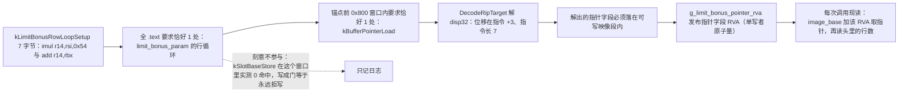
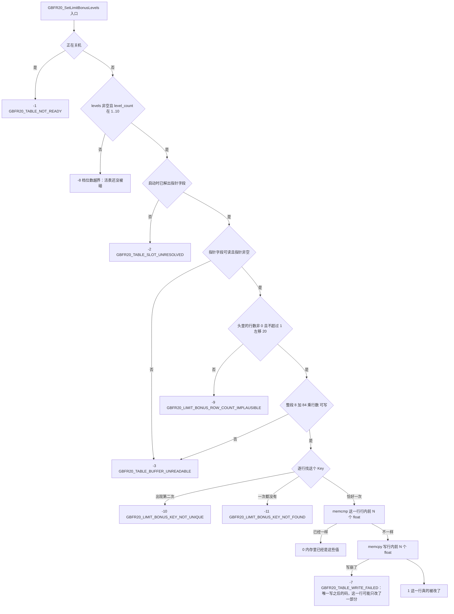

# limit_bonus_param 活表与能力强化数值

`limit_bonus_param` 是这套 mod 改写的**第二张活表**，「活表」的词义与 [skill_status 表与活表写入闸门](/openwiki/concepts/skill-status-table.md) 里那份一样：游戏已经解析好、正在用的那份，不是文件里的那一份。界面上这一页叫**角色强化**（`tabLimitBonus` 那格的文案），代码与 mod 侧的名字是 `limit_bonus_param`；它承载的是每张**能力**强化节点的**数值**（造成的伤害 / 冷却时间 / 效果持续时间这类），与因子技能那张表没有交集。

活表的形状（`src/table_slot.cpp` 的 `kLimitBonus*` 常量是唯一依据）：

```
[ 8 字节行数头（原生按 u64 读） ][ 84 字节行 ][ 84 字节行 ] ...
```

两侧的分工，与 `skill_status` 那条链刻意不同：

| 谁 | 干什么 | 代码 |
| --- | --- | --- |
| 可视工具 / 托管 mod（C#） | 按 Key 逐条交出一个能力的**前 N 档数值**（一个 `float` 数组），从不持有表、也不持有地址 | `LimitBonusFeature.cs`、`LimitBonusConfig.cs` |
| 原生核心（C++） | 从语义锚点解出 `limit_bonus_param` 的**指针字段**，逐行找 Key、只写那一行行内的前 N 个 `float` | `src/table_slot.cpp` |

端到端那条链（防抖写盘、5 秒重试 / 30 秒看护、失败时屏幕上与游戏里各是什么）在 [工作流：能力强化数值编辑与热应用](/openwiki/workflows/limit-bonus-apply.md)；本页讲表本身、写入闸门与它赖以成立的那条身份证明。

## 行布局与常量（只有原生侧一处声明）

行内偏移相对**行首**：

| 偏移 | 字段 | 谁碰它 |
| --- | --- | --- |
| 表头 `+0` | 行数（`u64`） | 原生只读：行数闸（`-9`）与算整段长度 `8 + 84 × 行数` |
| 行内 `+12 .. +51` | `float` `Lv1..Lv10`（10 × 4 字节） | 原生只写**前 N 个**（`N = level_count`），没被用到的槽一个字节都不碰 |
| 行内 `+52` | `Key`（`u32` 哈希） | 只读：认行 + 这张表的身份证明（编辑从不碰 Key） |
| 行内 `+56 .. +83` | 这份 mod 不使用的那部分布局 | 没人碰 |

钉住它的常量与它们在源码里的唯一出处（`GBFR.SigilLoadout.Native/src/table_slot.cpp`）：

| 常量 | 值 | 为什么 |
| --- | --- | --- |
| `kLimitBonusHeaderBytes` | `8` | 行数头 |
| `kLimitBonusRowBytes` | `84` | 行步长；行循环锚点里的立即数 `0x54` 就是它 |
| `kLimitBonusLevelOffset` | `12` | `Lv1` 的位置，`Lv1..Lv10` 共 40 字节 |
| `kLimitBonusMaxLevels` | `10` | 这张表的全部数值槽数（也就是 `level_count` 的上界） |
| `kLimitBonusKeyOffset` | `52` | 行的身份；写入从不碰它 |
| `kLimitBonusMaxPlausibleRows` | `1 << 20` | 行数的合理上界；真机 1123 行，`1 << 20` 是充裕余量，足以让「指针字段被改写、指到别处」几乎撞不进来 |

**这些常量在源码里各只有一处声明，没有第二个副本可漂。** 托管侧不解析这张表（它只交 Key 与数值），所以不存在 `skill_status` 那样的「C# 与 C++ 各存一份、由 `sharedconstants_test.go` 对拍」的关系；`sharedconstants_test.go` 的名单里没有任何 `limit_bonus` 项，连 `limit_bonus.json` 这个文件名都不在里面（那条只由 `SigilLoadout/service/limitbonusservice_test.go` 的线格式测试钉住）。唯一有第二处声明的是那个 `10`：C# 的 `LimitBonusFeature.MaxLevels` 与原生 `kLimitBonusMaxLevels`，但它也**不在对拍名单里**，而且两侧漂了的表现是**不对称**的——C# 侧越界的记录整条跳过并记一行日志（不会发出调用），原生侧则是 `-8` 拒写。

## 指针字段怎么解出来（锚点 + 窗口）

这张表**没有** `skill_status` 那条发布指令，所以没有「槽首 = 指针字段 − 8」这条交叉验证，也没有槽的概念：只解出**缓冲区指针字段本身**的 RVA。第一步是它自己的行循环锚点（`src/table_slot.cpp` 的 `kLimitBonusRowLoopSetup`，7 字节，`0` 字节一个都没有，所以不受「`0 = 通配`」那套约定的坑影响）：

```
4C 6B F6 54        imul r14, rsi, 0x54       ; end = count*84
49 01 DE           add  r14, rbx             ; + rows
```

这 7 字节里没有 rel32、没有 rip 位移，源码注释记录的实测结果是「在全 `.text` 里只出现一次」；换版本只要这张表还是 84 字节行，这段指令序列就还在。第二步复用 `skill_status` 那套共享模式：在锚点**前 `0x800` 字节窗口**里找恰好一次的「缓冲区指针加载」（`kBufferPointerLoad`，4 个 `0` 是 `disp32` 通配）：

```
48 8B 1D disp32    mov  rbx, [rip+disp32]    ; 缓冲区指针字段
48 8B 33           mov  rsi, [rbx]           ; rowCount
48 83 C3 08        add  rbx, 8               ; 首行
```



上图：从行循环锚点到「指针字段 RVA 已缓存」的整条推导；任何一步不成立都只记日志、指针字段保持未解析。

几处必须读准的性质：

- **窗口里那条槽发布指令（`kSlotBaseStore`）刻意不作门。** 源码注释写的是：这张表的发布指令与 `skill_status` 的形状不同，实测在这个窗口里 **0 命中**，拿它当门等于永远拒写。所以 `ResolveLimitBonusParamPointer` 只要求 `row_loop_matches == 1` 且 `buffer_load_matches == 1`；失败日志还是会把 `slot_store` 的计数打出来，并注明它「deliberately not required」。
- 窗口宽度取的是 `min(0x800, 锚点之前的字节数)`，连 `kSlotBaseStore.size()`（20 字节）都不到时**直接提前返回**：此时窗口里根本没扫过，窗口内那两个计数保持 0，于是同样落进 fail-closed。日志报的是**实际扫过的宽度**而不是那个常量。
- 解出的 RVA 要过 `IsInWritableImageSection`（段标志含 `READ | WRITE` 且不含 `EXECUTE`）——这是「以后能原地写」的前置证明，不是可选的稳妥。
- **缓存的只有指针字段的 RVA 一个原子量**（`g_limit_bonus_pointer_rva`，`0` = 还没解析出来；单写者、读者只 load，不需要锁）。缓冲区地址**每次调用现读**（`g_image_base + pointer_rva` 处的 8 字节指针，`TryGetLiveLimitBonusBuffer`），所以游戏换掉那份缓冲区时下一个调用就跟上了，这里不存在「缓存失效」这个概念。这一点与 `skill_status` 侧存的是**槽首 +8 的算式**不同：那张表存槽首，这张表存指针字段自己。
- 时机：`ResolveLimitBonusParamPointer()` 在 `runtime.cpp` 的 `Initialize` 里与 `ResolveTableSlot()` 并排，排在 `InstallHooks()` **之前**——safetyhook 会改写 `.text`，锚点要用没被改写的字节匹配。它与钩子装没装成无关，失败也不拿它当初始化门，只影响热应用：之后每次调用都拒 `-2`。

## 写入闸门与拒绝码

入口在 `exports.cpp` 的 `SetLimitBonusLevelsEntry`：先查 `g_shutting_down`（是则 `-1`），**刻意不要求 `g_hooks_ready`**（写的是数据表，与钩子装没装成无关），再 `EnsureInitialized()`，然后进 `src/table_slot.cpp` 的 `SetLimitBonusLevels`。顺序如下，写之前的每一道闸拒写时**一个字节都不动**：

1. **入口 · 正在关机** → `-1`：只查 `g_shutting_down`。
2. **闸一 · 档数** → `-8`：`levels == nullptr || level_count == 0 || level_count > 10`。这是唯一在碰游戏内存之前就能给出的判定，活表还没被读。
3. **闸二 · 指针字段已解出** → `-2`：`g_limit_bonus_pointer_rva != 0`；未初始化过也是它。
4. **闸三 · 指针字段可读且指针非空** → `-3`。
5. **闸四 · 行数可信** → `-9`：头里的 `u64` 读得到、不为 `0`、且不超过 `kLimitBonusMaxPlausibleRows`。这一道唯一的用途是挡「指针字段被别的东西改写、指到一段随便可读的内存」——行数不可信时按它算长度也没有意义。
6. **闸五 · 整段缓冲区可写** → `-3`：`IsGameRange(缓冲区, 8 + 84 × 行数, kWritableProtect)`。
7. **闸六 · 目标 Key 在整张表里恰好一次** → `-10`（出现两次）/ `-11`（一次都没有）。
8. **写** → `1` = 这一行真的被改了，`0` = 内存里已经是这些值，`-7` = 那一次行写崩了（SEH 兜住）。



上图：写入闸门的顺序与各自的拒绝码；**只有过了最后一道闸（Key 恰好一次）进入写入之后，才可能出现部分写入**。

| 拒绝码 | 位置 | 判据（源码） |
| --- | --- | --- |
| `GBFR20_TABLE_NOT_READY` (-1) | 入口 | `exports.cpp` 的入口查 `g_shutting_down`（与 `skill_status` 共用这个码的数值） |
| `GBFR20_LIMIT_BONUS_LEVEL_COUNT_UNEXPECTED` (-8) | 闸一 | `levels == nullptr \|\| level_count == 0 \|\| level_count > 10` |
| `GBFR20_TABLE_SLOT_UNRESOLVED` (-2) | 闸二 | `g_limit_bonus_pointer_rva == 0`（锚点那次解析失败后它一直是 0） |
| `GBFR20_TABLE_BUFFER_UNREADABLE` (-3) | 闸三 / 闸五 | 指针字段那 8 字节不可读、读到的指针为 0；或整段缓冲区不满足可写保护位 |
| `GBFR20_LIMIT_BONUS_ROW_COUNT_IMPLAUSIBLE` (-9) | 闸四 | 头里 `u64` 读不到，或为 0，或 `> 1 << 20` |
| `GBFR20_LIMIT_BONUS_KEY_NOT_UNIQUE` (-10) | 闸六 | 逐行扫描时同一个 Key 命中第二次 |
| `GBFR20_LIMIT_BONUS_KEY_NOT_FOUND` (-11) | 闸六 | 整张表扫完没有这个 Key |
| `GBFR20_TABLE_WRITE_FAILED` (-7) | 写之后 | 行写崩（SEH 兜住）后返回；也是 `GuardAbi` 兜住导出内任何异常时的兜底值 |

- **返回值语义与 `skill_status` 不同。** 那条导出回的是「实际改写的 52 字节行数」，这条回的是 `1` / `0`：一次调用只认一个 Key、只动一行，所以「改了几行」没有信息量，有信息量的是「这一行到底动了没有」。
- **共用四个码的数值，但人话解释是两个函数。** `-1` / `-2` / `-3` / `-7` 与 `skill_status` 同值，措辞却来自另一处（`exports.cpp` 的 `LimitBonusRefusalReason`）：两张表的「没解析出来」指的是**不同的锚点**，所以「`limit_bonus_param` 的指针字段没在启动时解出」必须按这张表说。
- **同一种拒写只报一行日志。** 每个入口各有一个静态 `last_refusal`，拒绝码变了（或中间成功过一次）才再报。这条对 `SetLimitBonusLevels` 尤其必要：调用方**每个能力各调一次**，逐条报会把日志刷满，而原因逐字相同。
- **拒写不是数据丢失。** 编辑留在 `limit_bonus.json` 里，托管侧按 5 秒重试 / 30 秒看护的节奏再交一次；「表还没进内存」导致的 `-2` / `-3` 在屏幕上是同一件事，所以同一版只报一次。这条链的节奏与可见后果见 [工作流：能力强化数值编辑与热应用](/openwiki/workflows/limit-bonus-apply.md)。

## 身份证明：为什么是「Key 恰好出现一次」

`skill_status` 那张表的身份是**表级**的：逐行比对 `Key`（几十 KB、数千行）。`limit_bonus_param` 这条链拿不到那条发布指令，于是身份改由**运行期的 Key 唯一性**承担：一次调用要求目标 Key 在整张表里**恰好出现一次**。

这条证明对这张表比「槽首 = 指针字段 − 8」更强，理由有两个：

1. **它不随编辑变化。** 本 mod 只写行内 `Lv` 槽、从不碰 `Key`，所以「唯一」这件事每次应用都成立——它不是一次性的闸。
2. **它把「这是同一张表」变成可验证的字节事实，而不是对锚点的信任。** 锚点只证「这段代码在遍历一张 84 字节行的表」，指针字段仍可能被别的 mod 或别的代码改写；逐行扫完并发现这个 Key 恰好一次，是对**运行中那份缓冲区**的实证。

两个失败码的分工也在这条逻辑里：

- **`-10`（同一个 Key 出现多次）**：发现第二个命中就**立刻**拒写，而不是覆盖第一个。源码注释把理由写明了：覆盖会把「指针字段指错了一段内存」变成一次静默的半成功。
- **`-11`（表里没有这个 Key）**：可能不是那张表，也可能那条能力本来就没有行。`LimitBonusRefusalReason` 对这个码的措辞如实承认了这两种可能，所以它不能当「表一定是错的那张」来读。

行数闸（`-9`，上界 `1 << 20`）是唯一一道针对「指针指到别处」的启发式闸：它不证明什么，只是让「指到一段随便可读的内存且头里的 `u64` 恰好落进 0..`1 << 20`」这件事几乎撞不进来。

## 一个 Key 一条记录、`values[i]` 写进 `Lv(i+1)`、界面只写 Lv1

这三句话在三个程序里各有各的实现，合起来才是这张表的写入契约。先把契约本身说清：

- **一个 Key 一条记录**：编辑列表按 `limit_bonus_param` 的**参数行 Key** 索引，每条记录只指向一行。
- **`values[i]` 写进 `Lv(i+1)`**：`levels` 的第 `i` 个 `float` 落进行内 `kLimitBonusLevelOffset + 4i`，`N = level_count` 完全由调用方给的数组长度决定，`Lv(N+1)..Lv10` 一个字节都不碰。
- **界面只写 Lv1**：这一页写出去的数组长度恒为 1，所以 `Lv2..Lv10` 在游戏里保持原值。

| 侧 | 谁在实现哪一句 | 代码 |
| --- | --- | --- |
| TS（可视工具前端） | 「只写 Lv1」：`withFirstValue(param, value)` 交出的记录**长度恒为 1**（`values: [value]`），`valueAt` 只读 `values[0] ?? param.default`；清空（`value === null`）返回 `null` = 整条记录不存在，**绝不按 `default` 补齐档位** | `frontend/src/lib/limitbonus.ts` |
| Go（可视工具后端） | 文件形状与「列表里是什么就存什么」：`LimitBonusEdit{Enabled, Key, Values []float64}` 逐字成员名（`enabled` / `key` / `values`），自定义 `UnmarshalJSON` 把缺 `enabled` 的条目读成**开着**；这里不校验长度、不补齐、不筛选——「哪些记录算一栏」由前端决定，「档位数越界」由 mod 侧整条跳过 | `service/limitbonusservice.go` |
| C#（托管 mod） | 「数组长度就是 `level_count`」：`LimitBonusEdit.Values` 是 `float[]`，`Values.Length` 不在 `1..MaxLevels`（`= 10`）或 Key 不是正好 8 位十六进制时**整条跳过**；否则每条启用记录各调一次 `NativeCore.SetLimitBonusLevels`，`NativeCore.Interop.cs` 把 `levels.Length` 直接当 `levelCount` 传下去 | `LimitBonusConfig.cs`、`LimitBonusFeature.cs`、`NativeCore.Interop.cs` |
| C++（原生核心） | 落点：`memcpy(target + kLimitBonusLevelOffset, levels, level_count * sizeof(float))`，写前先 `memcmp` 一遍决定回 `0` 还是 `1` | `src/table_slot.cpp` |

由此得出两条容易读反的结论：

- **「只写 Lv1」不是原生的限制，而是调用方给的 `N = 1`。** 原生支持到 10，手写 `limit_bonus.json` 里放一个 3 个数的数组（≤10）同样会写 `Lv1..Lv3`；反过来，界面**不会**把没填的档位按 `default` 补齐——那等于把用户从没填过的数写进游戏，多改了后面几档。
- **「一个 Key 一条记录」与「表里恰好一次」不是同一条约束。** 前者在**文件**这一层：前端用 `skills.ts` 的 `dedupeBy`（地址就是记录自己的参数行 Key）留**最后一条已启用的**，因为 mod 按顺序遍历、每条已启用的各写一次，同一 Key 两条时游戏最终拿到的是最后一条已启用的。后者在**活表**这一层：同一 Key 在表里出现两行直接 `-10` 拒写。文件里两条 → 后一条生效；表里两行同 Key → 拒写。

界面上一个节点挂 1 条参数行（能力强化），或 3 条（「全部上限」类，默认值永远相同——游戏就是同一个数同时加到三项上），所以面板的一个数值框会遍历 `ability.params` 逐个 `withFirstValue`：**填一个值 = 写给这个节点的全部参数行**，而这一页没有启用开关（记录存在本身就代表要生效）。渲染与交互那一半见 [可视工具前端（React）](/openwiki/architecture/visual-tool-frontend.md)。

## 值的两种时间语义，与「这张表不被重新解析」

改完一个数之后，游戏里发生的事分两条时间线：

- **节点描述是实时读表的**，所以改完立刻看得见——界面上的描述文字（来自当前语言的文案表，见下节）与游戏里的节点说明都会变。
- **实际数值要等重算**：天赋 / 能力的数值在读档（回标题 → 继续）或该页「全部习得」时才重新计算。所以「可见」与「实际生效」是两件事，改完当场看角色面板上的数字不一定变。

这一点与 `skill_status` 那条链的另一个差别更要紧：**这张表不在读档时被重新解析**（`LimitBonusFeature.cs` 的头注释记录的是实测结果：回标题读档之后缓冲区地址与写入的值都还在）。由此有三条后果：

- **整条链不经过数据管理器。** `LimitBonusFeature` 里没有任何 `IDataManager` 引用，也没有 `AddOrUpdateExternalFile` / `UpdateIndex` 这一步——没有「重新注册一份表」这件事，只写内存里那一份。这也是它与因子编辑那条链看起来对称、其实不对称的地方（对比见 [skill_status 表与活表写入闸门](/openwiki/concepts/skill-status-table.md)）。
- **没有「还原默认值」的第二条路。** 因子编辑可以把「未编辑的表」重新发布回去实现撤销；这张表只写内存、没有第二份原始值可以拿回来，所以要还原默认值得由工具**把默认值当一次编辑写下来**（资产里有每一行的 Lv1 默认档值）。同理，`limit_bonus.json` 里空数组 / 空列表在这里的含义是「**没有要写的**」，**不是**「撤销全部编辑」。
- **没有文件也不是错误。** 读不到文件（`FileNotFoundException` / `DirectoryNotFoundException`）在托管侧就是空列表 = 什么都不写；这与 `loadout.json` 那条链「没有文件 = 恢复内置模板」是两种不同的反应。

## 支撑它的资产三件套

这一页要显示什么，由三份随包资产决定，它们在启动时被读一次（`service/assets.go` 的 `loadAssetsFrom` → `loadLimitBonusTables`）：

| 资产 | 形状 | 谁读它 |
| --- | --- | --- |
| `assets/limit_bonus.json`（**骨架，语言无关**） | `{characters: [{id, bonuses: [{key, hash, params: [{key, default}], bonusType}]}]}`：`bonuses` 的每个元素**就是 `limit_bonus` 的一行**，`params[].key` 才是写内存时指的那个参数行，`params[].default` 是这一行 `Lv1` 的游戏默认值（空框的占位符），`bonusType` 是游戏的分类（0 属性 / 1 专属 / 2 能力，非 0 的行名字前画一个圆点） | 前端与 Go（`LimitBonusTable`） |
| `assets/limit_bonus.<lang>.json`（zh / en / ja / ko） | `{bonuses: {能力短名 → 名字}, effects: {参数行 Key → 效果模板}}`；模板里的 `{0}` 是那一档的数值（界面把模板里的 `{0}` 换成框号 `{1}` 显示，因为数字已经在右边的框里） | 前端与 Go（`LimitBonusText`） |
| `assets/chara.json`（角色属性，语言无关） | 顶层就是 PL 码 → `{hash, element, color}`：颜色按属性在生成期算好写进来，界面一次取值就拿到，不必再查第二张调色表（那张已删） | `LimitBonusService.Characters()` |

几处刻意的设计：

- **文案表不同构复制骨架。** 骨架里带一份文案、四门语言就是四棵整树，所以文案单独按 id 索引成一份表；代价是「缺 key 就是缺」——文案表缺哪个 id，界面就照实显示那个 id 或留一个占位符，**不回退**到别的语言（`LoadLimitBonus` 对认不出来的语言返回空表）。这与 `assets.go` 里 `pick` 给因子文案 / 因子名 / 角色名回落中文是两套不同的规矩，差别是刻意的。
- **角色名不在这三份里。** 它只有 `chara.lang.json` 一个来源，由前端按当前语言取好传下来。
- **两份语言清单必须在启动时对得上。** `loadAssetsFrom` 用 `slices.Equal(assetLangCodes(), limitBonusLangCodes())` 对拍技能资产与能力强化资产覆盖的语言；一旦不一致就直接启动失败——否则屏幕上出现的是整页 id，而不是一条错误。缺任何一份资产同样在启动时报出来（宁可起不来，也不要静默显示一串哈希）。
- **打包与生成。** `tools/build-release.ps1` 的补齐名单与必需文件清单都含 `limit_bonus.json`、`limit_bonus.zh/en/ja/ko.json` 与 `chara.json`：缺了先从未入库的 `gen\output\` 同名预制品补，再没有才让仓库外的生成器 `gen` 出一遍。这份门禁只保证「在场」，不比对内容——「资产与 gen 里的真相一致」在本仓库没有任何机械证据，细节见 [外部生成器 gen 与随包数据资产](/openwiki/integrations/external-generator-and-assets.md)。

## 与 skill_status 的差异一览

| 面 | `skill_status` | `limit_bonus_param` |
| --- | --- | --- |
| 行布局 | 8 字节头 + 52 字节行；行内 `LevelValue1..10 @+0`、`Key @+40`、`Level @+48` | 8 字节头 + 84 字节行；行内 `Lv1..Lv10 @+12`、`Key @+52` |
| 输入 | **一整张表**（字节数组），形状由调用方的表定义 | **一个 Key + 前 N 档数值**（一个 `float` 数组），从不持有表 |
| 返回值 | 实际改写的 52 字节行数（0 = 内存已一致） | `1` = 这一行真被改了，`0` = 内存已一致 |
| 锚点 | 行循环锚点（12 字节）+ 窗口里**两条**发布指令，且必须差 8 | 行循环锚点（7 字节）+ 窗口里**一条**指针加载；槽发布指令实测 0 命中，不作门 |
| 缓存的地址 | 槽首 RVA（指针在槽 +8） | **指针字段**的 RVA |
| 身份证明 | 逐行 `Key` 对拍（表级，`-6`） | 目标 Key 在整张表里恰好一次（`-10` / `-11`） |
| 自有拒绝码 | `-4`、`-5`、`-6` | `-8`、`-9`、`-10`、`-11` |
| 是否重新注册回归档 | 是（经数据管理器，读档会重新解析） | 否（不经数据管理器，这张表不被重新解析） |
| 还原编辑 | 发布未编辑的表即可 | 只能把默认值当一次编辑写下来 |

## 改动前要注意的

- **行步长变了，锚点也必须重导。** 那条 7 字节锚点里没有 rel32、没有 rip 位移，但立即数 `0x54`（= 84）**就是行步长**；「84 字节行」与「这段指令序列」是同一个事实的两面。同理，`Key` 偏移 52 或 `Lv1` 偏移 12 漂了，不会编译失败，只会「认成别的行」或把数值写进行内别的地方。
- **别把槽发布指令加成门。** `kSlotBaseStore` 在这个窗口里实测 0 命中；一旦有人为了「和 `skill_status` 一样严」加上它，结果是**永远拒写**（每次都 `-2`），而且日志会说「命中数不是 1」。
- **不要再加「全内存扫描」兜底。** `table_slot.cpp` 文件顶部那条硬约束对两张表都成立：扫描证明不了唯一重要的事（「这块缓冲区就是游戏在用的那块」静态证不出来），而拒写的代价只是这一局内存不变（编辑在游戏下一次解析或重启后照样生效），扫描却是 5~6 秒的慢路径。
- **`0 = 通配` 那个约定要逐个数字对一遍。** `CountMatches` 把 pattern 里的 `0` 当通配（非 0 才比），所以窗口里那条 `kBufferPointerLoad` 的 4 个位移字节必须落在该通配的位置上；若有一个 `0` 本来是想精确匹配的，匹配会静默变宽，后果是「命中数 ≠ 1」，于是 fail-closed。
- **SEH 帧里不能有需要析构的局部对象**（MSVC C2712）：所以逐行找 Key 并写那一行的 `WriteLimitBonusRow`、以及 `TryGetLiveLimitBonusBuffer` 都是独立函数，构造消息、拼串留在调用方。
- **单写者原子量就够，别加锁。** `g_limit_bonus_pointer_rva` 只在启动期被写一次，读者只 `load`；缓冲区指针每次调用现读。并发与关停次序见 [并发、锁序与生命周期守卫](/openwiki/concepts/threading-and-locks.md)。

## 这份代码被验证到什么程度

- **Go 侧**（`SigilLoadout/service/limitbonusservice_test.go`）：`limit_bonus.json` 的线格式被**逐字节**钉住（防抖尾沿、原子替换、成员拼法）；缺 `enabled` 读成开着；坏文件是会点出文件名的错误而不是空列表；资产可用性（Key 与哈希必须 8 位十六进制、`hash == key`、每行 `default` 非 0、每门语言都覆盖骨架里的每条 id、效果模板必须含 `{0}` 且不能含别的占位符、四门语言的词真的不一样）对着真实文件断言。
- **TS 侧**（`frontend/src/lib/limitbonus.test.ts`，用手搓夹具）：`valueAt` 只读下标 0、`effectLabel` 把 `{0}` 换成 `{1}`、`asEdit` 的归一化、`withFirstValue` 长度恒为 1、清空 = 删掉整条记录、以及「一个 Key 最多一条编辑」用的那个地址。
- **没有离线证据的部分**：`tests/NativeLayoutHarness` 只编译 `layout_resolver.cpp` 与 `safe_game_access.cpp`，**不含 `table_slot.cpp`**——所以这张表的锚点命中数、rip 位移解码、可写段判定、以及写入的每一道闸都只能在真机取实证；`sharedconstants_test.go` 也覆盖不到它的任何常量（见「行布局与常量」）。真机上要读的三行日志是原生那句 `Limit bonus table: resolved pointer field=0x...`（或「命中数不是 1」那一行）、拒写时的 `SetLimitBonusLevels: refused (<码>): ...`、以及托管侧的 `limit bonus edit: <落地> applied, <跳过> skipped, <被拒> refused`。读法与故障路由见 [日志与故障定位](/openwiki/operations/logging-and-diagnostics.md)。
