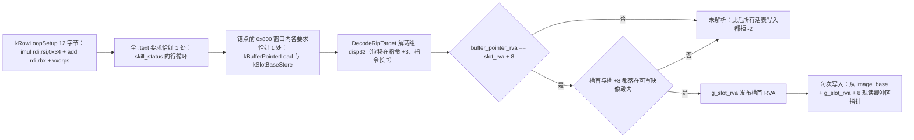
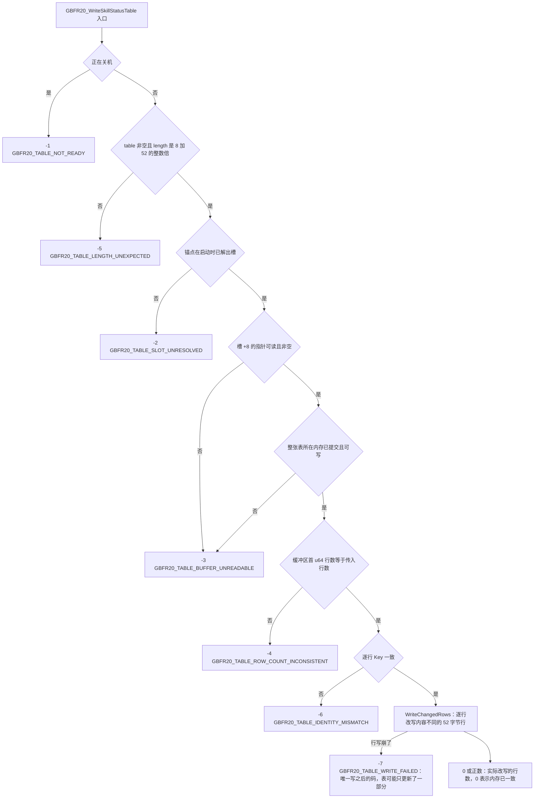

# skill_status 表与活表写入闸门

`skill_status` 是这套 mod 唯一被真正改写的游戏数据表——词表 `CONTEXT.md` 里的**活表**指的就是它：「游戏已经解析好、正在用的那份技能表。不是文件里的那一份」。本页全篇只用这个词义：从归档读出来的那份是候选，游戏手里那份才是活表。其余写游戏内存的地方只有两条技能循环上限立即数与钩子字节（见 [工作流：游戏侧注入运行期](/openwiki/workflows/skill-injection-runtime.md)）。它的形状是：

```
system/table/skill_status.tbl
[ 8 字节 int64 行数头 ][ 52 字节行 ][ 52 字节行 ] ...
```

两侧各有一个二进制、各存一份这个形状的常量，中间通过 ABI v20 的 `GBFR20_WriteSkillStatusTable` 交换**整张表**：

| 谁 | 干什么 | 代码 |
| --- | --- | --- |
| 托管 mod（C#） | 从数据管理器拿到归档里的原表，按 `(Key, Level)` 打行，把整张表交给原生 | `SigilEditorFeature.cs` |
| 原生核心（C++） | 从语义锚点解出「游戏发布该表的那个固定槽」，把传入表与**活表**逐行比对后原地改写 | `src/table_slot.cpp` |

托管侧**不持有也不扫描**活表地址，只交表；地址解析全部在原生侧。端到端链路（mtime 门、重新注册、重试节流）在 [工作流：因子数值编辑与热应用](/openwiki/workflows/sigil-edit-apply.md)，本页讲表本身与写入闸门。

## 行布局与两侧声明

行的字段（偏移相对**行首**，对着 GBFRDataTools 的 `skill_status.headers` 与 `GameTable.cs` 里那句 `8 + RowSize * rowCount == file.Length` 断言核对过）：

| 偏移 | 字段 | 谁碰它 |
| --- | --- | --- |
| `+0 .. +36` | `float LevelValue1..10` | 托管侧写（10 个 float × 4 字节） |
| `+40` | `Key`（技能哈希，`u32`） | 只读：匹配落点 + 原生的身份检查 |
| `+44` | `LevelDescription` | 没人碰（布局的一部分，本 mod 不使用） |
| `+48` | `Level`（`u32`） | 托管侧只读：匹配落点 |

第 k 行从 `8 + 52k` 开始，行按 `Key` 分组、`Level` 升序。`LevelValue7..10` 只在 2.0.0 之后存在；更早的构建是 **36 字节一行、`Key` 在 `+24`**，所以动手前必须先验形状（见下节）。

两侧的声明与它们各自被什么钉住：

| 常量 | 托管侧（`SigilEditorFeature.cs`） | 原生侧（`src/table_slot.cpp`） | 谁钉着它 |
| --- | --- | --- | --- |
| 表头 8 字节 | `FileHeaderSize = 8` | `kTableHeaderBytes = 8` | `sharedconstants_test.go` 的 `skill_status 表头字节` 组 |
| 行 52 字节 | `RowSize = 52` | `kTableRowBytes = 52` | `skill_status 行字节` 组 |
| `Key@ +40` | `KeyOffset = 40` | `kRowKeyOffset = 40` | `skill_status 行内 Key 偏移` 组 |
| `Level@ +48` | `LevelOffset = 48` | 无对应声明（原生整行比、整行写，不需要它） | **不对拍**：只有一处声明，没有第二个可漂的副本，所以刻意不收 |

对拍组的每一条声明必须**正好**匹配一次、并按大小写不敏感比较值——正则写松了会对着文件里第一个碰巧像它的东西比，比出来还是绿的（假绿）。这里要特别说清一个容易误判的点：**这三个表布局常量没有任何 `static_assert` 兜着**。`native_api.h` 里仅有的两处 `static_assert` 钉的是跨 ABI 的 `GBFR20_TemplateSlot` 与 `GBFR20_ExclusiveOverride` 的尺寸（与托管侧 `EnsureAbiLayout` 的封送尺寸自检一一对应），与表布局无关；钉住行布局的只有上面这份 Go 对拍。

参槽数 `LevelValueCount = 10` 是三处声明（C# `Config.SigilSkill`、Go `editservice.go`、前端 `skills.ts` 的 `SLOTS`），由同一测试的 `LevelValue 参槽数` 组钉住；技能说明里的 `{N}` 就是 `LevelValue(N+1)`。

## 托管侧：从归档读出、按 `(Key, Level)` 打行

托管侧要的表**来自游戏自己的归档**（`IDataManager.GetArchiveFile("system/table/skill_status.tbl")`），不是硬编码的字节。拿到之后先过一道形状预检 `HasPatchableLayout`：

- 行数 `declaredRows` 取自首 8 字节（托管侧按 `BitConverter.ToInt64` 读，即**有符号**；原生侧按 `u64` 读）；
- 判定写成 `declaredRows > 0 && body >= 0 && declaredRows == body / RowSize && body % RowSize == 0`（`body = length - 8`），**而不是** `8 + 52*rows == length`：文件头那 8 个字节是任意值，乘法会在 `long` 上回绕，构造一个回绕后刚好相等的行数就能过预检；整除 + 取余同时说明最后一行是完整的。

过不了这条的表（2.0 之前的 36 字节行、将来任何一次列变动）会被拒，日志报出实际字节数与头里声明的行数，**一个字节都不进游戏**——这正是要点：那时的偏移量会把编辑写进错误的行或行外，而且不吭声。

打行是 `PatchRow`：按 52 字节步长找 `Key@+40` 与 `Level@+48` 同时相等的行，把 `Values[i]` 写进 `row + i*4`（第 i 个参槽）。三条刻意的排除：

- `Values[i]` 为 `null` → 保留游戏原样。只写用户设过的数字，所以本工具一无所知的参槽不可能被游戏表的旧副本盖掉。数组由配置层（Go 的 `padValues` / C# 的 `Config.Load`）补齐到正好 10 个，`null` 就是「没说」。
- 不是有限数（手改 `sigiledits.json` 可以写出 `1e39`，`System.Text.Json` 不报错、给的是 ±`Infinity`）→ 跳过并记一行，游戏不会拿着无穷大去做它自己的算术。
- `Level < 1` → 在强制转换成 `uint` **之前**跳过；负数经 `(uint)` 会变成几十亿，行查找会以「行没找到」收场，读起来像配置里键写错了。

## 原生侧：活表的槽是怎么解出来的

游戏把每张表解析成一份拷贝，并把它发布进一个**固定槽**（三段式：`handle@+0` / `buffer@+8` / `?@+0x10`，共 24 字节）。原生侧不靠地址常量，靠两步语义锚点（`src/table_slot.cpp`）：

1. **行循环锚点** `kRowLoopSetup`，12 字节，纯语义、没有 rel32 也没有 rip 位移：

   ```
   48 6B FE 34        imul rdi, rsi, 0x34        ; end = count*52
   48 01 DF           add  rdi, rbx              ; + rows
   C4 41 38 57 C0     vxorps xmm8, xmm8, xmm8
   ```

   换版本只要这张表还是 52 字节行，这段指令序列就还在。

2. **锚点前 `0x800` 字节窗口**里必须各恰好出现一次的**两条发布指令**，rip 位移都是通配：

   ```
   48 8B 1D disp32     mov  rbx, [rip+disp32]    ; 缓冲区指针字段（槽 +8）
   48 8B 33            mov  rsi, [rbx]           ; rowCount
   48 83 C3 08         add  rbx, 8               ; 首行
   ---
   48 89 0D disp32     mov     [rip+disp32], rcx  ; 槽首（24 字节槽）
   C5 F8 10 45 F0      vmovups xmm0, [rbp-0x10]  ; 刚从文件解析出的表头
   C5 F8 11 05 disp32  vmovups [rip+disp32], xmm0 ; 槽 +8：缓冲区指针
   ```

   **为什么要配一个窗口**：这两条发布指令在同一个函数里每一张表都有一份，只有落在行循环锚点**前面**的那一对属于 `skill_status`。窗口取 `0x800` 是「对真实距离有充裕余量，又刚好把隔壁那张表挡出去」（源码注释给的就是这两条理由）。



上图：从两个语义锚点到「槽 → 缓冲区指针」的整条推导；任何一处不成立都只记日志、槽保持未解析。

解析后的检查与状态（`ResolveTableSlot`）：

- 两条锚点的位移都得用 `DecodeRipTarget`（住在 `safe_game_access.cpp`、与布局锚点共用同一份 RIP-rel32 算术）解出来，并且**必须正好差 8**：槽首那条 `mov [rip+d],rcx` 与指针那条 `mov rbx,[rip+d]`，位移都在指令 `+3`、指令都长 7 字节；解不出这一对就不认。
- 解出来的 `slot_rva` 与 `slot_rva + 8` 都必须落在**可写**的映像段内（`IsInWritableImageSection` = 段标志含 `IMAGE_SCN_MEM_READ | IMAGE_SCN_MEM_WRITE` 且不含 `IMAGE_SCN_MEM_EXECUTE`）。这条是「以后能原地写」的前置证明，而不是可选的稳妥。
- 三条锚点的命中数**各必须恰好 1**，否则整体 fail-closed：只记一行说明日志，槽不解析。失败日志报的是**实际扫过的窗口宽度**（`min(0x800, 锚点之前的字节数)`）而不是那个常量——锚点靠段首时会报一个从没扫过的宽度，排查时会被引到错的方向。窗口宽度连 `kSlotBaseStore` 的长度都不到时**直接提前返回**：此时窗口里根本没扫过，两个窗口内计数保持 0。
- 成功的记忆只有槽首 RVA 一个原子量 `g_slot_rva`（单写者、读者只 load，不需要锁；并发细节见 [并发、锁序与生命周期守卫](/openwiki/concepts/threading-and-locks.md)）。**缓冲区指针每次调用现读**（`g_image_base + slot_rva + 8`），所以游戏换掉那份表（重新解析、发布新缓冲区）时下一个调用就跟上了，这里不存在「缓存失效」这个概念。

时机上，`ResolveTableSlot()` 排在 `InstallHooks()` **之前**：safetyhook 会改写 `.text`，而锚点要用没被改写的字节匹配。它与钩子装没装成无关，失败也不拿它当初始化门，只影响热应用——之后每次写入都拒 `-2`。要把这一点读准：这个槽的解出成功与否**不参与** `g_hooks_ready`，所以「钩子装好了但槽没解出来」和「槽解出来了但钩子没装成」都是合法结局。

## 写入闸门：入场两道 + 五道 fail-closed + 写

`GBFR20_WriteSkillStatusTable(table, length)` 的返回值：`>= 0` 是**实际不同并被改写的 52 字节行数**（`0` = 内存里已经是这些字节），`< 0` 是拒绝码。顺序如下，写之前的每一道闸拒写时**一个字节都不动**：

1. **入场 · 正在关机** → `-1`：要求 `!g_shutting_down`；入口**刻意不要求 `g_hooks_ready`**（写的是数据管理器供给的那张表，与钩子装没装成无关）。
2. **入场 · 传入表形状** → `-5`：要求 `table != nullptr && length > 8 && (length - 8) % 52 == 0`；因此 0 行的表（`length == 8`）也被拒。这是**唯一在碰游戏内存之前就能给出的判定**。
3. **闸一 · 槽已解出** → `-2`：要求 `g_slot_rva != 0`。
4. **闸二 · 槽 +8 的指针可读且非空** → `-3`：要求 `IsGameRange(slot + 8, 8, kReadableProtect)` 通过，且读到的指针不为 0。
5. **闸三 · 整张表所在内存已提交且可写** → `-3`：要求 `IsGameRange(buffer, length, kWritableProtect)`，可跨多个区域、一个区域一个区域往前走。
6. **闸四 · 行数一致** → `-4`：要求缓冲区首 `u64` 读得到且等于 `(length - 8) / 52`。
7. **闸五 · 逐行 `Key` 一致** → `-6`：要求 `SameRowIdentity` 逐行比过 `8 + 52*row + 40` 处的 4 字节。
8. **写**：`WriteChangedRows` 逐行改写内容不同的行。**写之后唯一的码是 `-7`**。



上图：写入闸门的顺序与各自的拒绝码；**只有过了最后一道闸（逐行 Key 一致）进入写入之后，才可能出现部分写入**。

| 拒绝码 | 位置 | 判据（源码） |
| --- | --- | --- |
| `GBFR20_TABLE_NOT_READY` (-1) | 入场 | `exports.cpp` 的入口查 `g_shutting_down` |
| `GBFR20_TABLE_LENGTH_UNEXPECTED` (-5) | 入场 | `table == nullptr \|\| length <= 8 \|\| (length - 8) % 52 != 0` |
| `GBFR20_TABLE_SLOT_UNRESOLVED` (-2) | 闸一 | `g_slot_rva == 0`（锚点那次解析失败后它一直是 0） |
| `GBFR20_TABLE_BUFFER_UNREADABLE` (-3) | 闸二 / 闸三 | 槽 +8 处 8 字节不可读，或读到的指针为 0；或整表不满足可写保护位 |
| `GBFR20_TABLE_ROW_COUNT_INCONSISTENT` (-4) | 闸四 | 缓冲区首 `u64` 读不到，或与 `(length - 8) / 52` 不等 |
| `GBFR20_TABLE_IDENTITY_MISMATCH` (-6) | 闸五 | `SameRowIdentity` 逐行 `memcmp` 4 字节 |
| `GBFR20_TABLE_WRITE_FAILED` (-7) | 写之后 | 行写崩（SEH 兜住）后返回；也可能是 `GuardAbi` 兜住导出内任何异常时的兜底值 |

几个必须保持的性质：

- **表的形状由调用方给的那张表定义**（那份来自归档，是权威），原生只检查游戏那份与它一致：先是首 `u64` 与 `(length - 8) / 52` 相等，再是逐行 `Key` 相等。所以这里**没有写死的行数常量**，行数更多的构建不用改写入路径。真正的耦合只有两个：52 字节/行，以及 `Key` 在行内的偏移 40——后者动了要**两侧一起**改（见上面的对拍表），`Key` 偏移漂了不会编译失败，只会「认成别的表」或让身份检查静默失效。
- **`-1` 的实现比它的注释窄。** `native_api.h` 写的是「原生核心没初始化好，或正在关机」，但入口只查 `g_shutting_down`；它仍然会调 `EnsureInitialized()`，而初始化本身是 `std::call_once`——若那一局里 `Initialize()` 已经在 exe 校验或布局解析处失败早退，槽就永远解不出来，于是活表写入给的是 `-2` 而不是 `-1`。运维上「刷不到 `-1` 却一直 `-2`」是正常组合。
- **`-7` 是最保守的兜底值**。除了行写崩，`GuardAbi` 也用它兜住导出内任何异常：报成 `-7`（表可能只更新了一部分）比报成「一个字节都没动」的码更安全。见 [原生核心（C++ DLL）](/openwiki/architecture/native-core.md)。
- **逐行写只写「内容真的不一样」的行**。6 条编辑就是 6 行，写窗口于是是 **312 字节**，而不是整张表的 ≈328 KB（6,320 行）——游戏任何时刻撞上「半更新的一行」的窗口因此小约三个数量级。行数取自活表首 `u64`（闸四已保证它与传入表一致）。
- **拒写只在拒绝码变化时报一次日志**（静态 `last_refusal` 原子量），成功过一次就清零。理由是实际噪声：拒写每 5 秒重试一次，而游戏把那张表读进内存之前必然一直是 `-3`，逐字相同的消息会刷屏。每个码的人话解释只有 `exports.cpp` 的 `SkillStatusRefusalReason` 一处（`default` 分支只说「未知码」），托管侧只记「被拒 + 码」。
- **拒写不是数据丢失**。托管侧那条唯一的路径是「先重新注册、再写内存」：`AddOrUpdateExternalFile` + `UpdateIndex` 在前（注册便宜，而且游戏若真的重新解析送达的文件，那次解析也必须看到新值），写入被拒就留下候选表（`_retryTable`）并按 `RetryIntervalMs`（5 秒）节流重试——同一版本的重试**直接复用那份候选**，不必再从归档重建一遍（328 KB 读 + 6,320 次行比较）。所以拒写的后果只是**这一局内存不变**，编辑会在游戏下一次解析或重启后落地。反过来，只有真的写进了内存才 `MarkApplied` 推进 mtime 版本；失败路径不推进版本，下一拍自然还会重试。

## 身份检查为什么是必须的

`Key` 序列是这张表的**身份**，而且它天生满足两个要求：

1. **编辑从不碰它。** 本 mod 只写 `LevelValue1..10`（以及托管侧的匹配只读 `Level`），所以逐行 `Key` 比对与编辑内容无关——每次应用都过得去，它不是「一次性」的闸。
2. **它让「这是同一张表」成为可验证的事实，而不是对锚点的信任。** 锚点只证「这段代码发布了一张 `skill_status`」，行数与内容仍可能是另一份拷贝；逐行 `Key` 比对把「同一张表」落到可检验的字节上。行数一致（`-4`）不足以替代它：任何一张同长度的表都能过。

它同时是**别的 mod 改过 `Key` 的表会被拒写而不是被覆盖**的原因：那种表的活体 `Key` 与本 mod 从归档建出来的表对不上，于是 `-6` 拒写，本 mod 不会用一份「按归档重建」的 `Key` 去盖掉别人改过的值。这也是把 `kRowKeyOffset = 40` 放在两侧常量、由 `sharedconstants_test.go` 钉住的原因。

## 不要再加回内存扫描（硬约束）

`table_slot.cpp` 里删掉过一版「全内存扫描」兜底，源码里只剩文件顶部那段「不要再加回来」的注释。**不要再加回来**，理由就是那段注释给的两条：

- 它证明不了唯一重要的事——「这块缓冲区就是游戏在用的那块」**静态证不出来**；
- 而拒写的代价小得多：这一局内存不变，编辑在游戏下一次解析或重启后照样生效（表已经重新注册过），扫描则是 **5~6 秒的慢路径**。

用一个慢得多的过程去换一个本来就不成立的可信度，是纯亏。

改 `table_slot.cpp` 时另有两条容易踩空的地方：

- **`0 = 通配`这个约定有个前提：pattern 里每个 `0` 字节都必须落在「该通配」的位置上。** 加新 pattern 时若有一个 `0` 是想精确匹配的 `0`，匹配会静默变宽，后果是「命中数 != 1」，于是 fail-closed——槽不解析（之后所有活表写入一律 `-2`），只有日志说得出原因；槽的成败与钩子互不相干，所以游戏照常运行。改这几条 pattern 时**逐个数字对一遍**，别只改个数。（`layout_resolver.cpp` 的 `kXxxPattern` 用显式 mask 字符串，两套约定并存、各自只服务一个文件，见 [语义锚点与布局解析](/openwiki/concepts/game-layout-anchors.md)。）
- **带 `__try` 的函数里不能有需要析构的局部对象**（MSVC C2712），所以 `.text` 扫描（`SearchAnchorWindow`）、逐行 `Key` 比对（`SameRowIdentity`）、逐行写（`WriteChangedRows`）各自是独立函数，构造消息、拼串留在调用方（`safe_game_access.cpp` 里那个「日志拼串放在外面」的注释说的是同一条约束）。

行布局真的变了（游戏更新、列变动）时改什么：先改两侧成对的常量（`FileHeaderSize` / `RowSize` / `KeyOffset` / `LevelOffset` 与 `kTableHeaderBytes` / `kTableRowBytes` / `kRowKeyOffset`，参槽数 `LevelValueCount` / `SLOTS` 同理），再重导行循环锚点与窗口里的两条发布指令。若「52 字节/行」与 `Key@+40` 这两个关系本身还在、只是行数变了，写入路径（校验、逐行写）不用动；若行不再按 52 字节排布，锚点也就认不出来了——那时拒写是唯一正确的反应。

## 这份代码被验证到什么程度

- `sharedconstants_test.go` 的 `skill_status 表头字节` / `skill_status 行字节` / `skill_status 行内 Key 偏移` 三组做的是**跨语言对拍**（C# 与 C++ 两处声明，值必须一致，且每处声明必须正好匹配一次）。它是「漂了立刻红」，**不是**「边界已证明」：它不知道这些值对不对，只知道两侧一样。`Level@+48` 不在其中（只有一处声明），原生那三条锚点字节序列也不在其中。
- `tests/NativeLayoutHarness` 只离线编译 `layout_resolver.cpp` 与 `safe_game_access.cpp`，**不含 `table_slot.cpp`**：锚点命中数、rip 位移的 `+8` 关系、可写段判定、以及写入的每一道闸都没有离线证据（该 harness 自己的三项断言——`ResolveGameLayout` 成功、`RevalidateGameLayout` 通过、翻一位字节后复验必须失败——都只覆盖布局解析那条链）。
- 因此这条路径的实证只能在真机游戏里取得：锚点还认不认得出来（日志 `Table slot: resolved slot=0x...` 或「命中数不是 1」那一行）、写进去几行（托管侧 `hot apply: SUCCESS - rows=<改写行数> ...`）、以及被拒时是哪个码（原生 `WriteSkillStatusTable: refused (<码>): ...`）。读法与故障路由见 [日志与故障定位](/openwiki/operations/logging-and-diagnostics.md)；各套件护什么见 [验证地图](/openwiki/testing/verification-map.md)。
