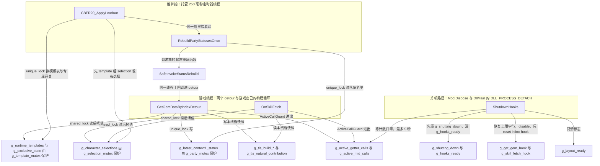
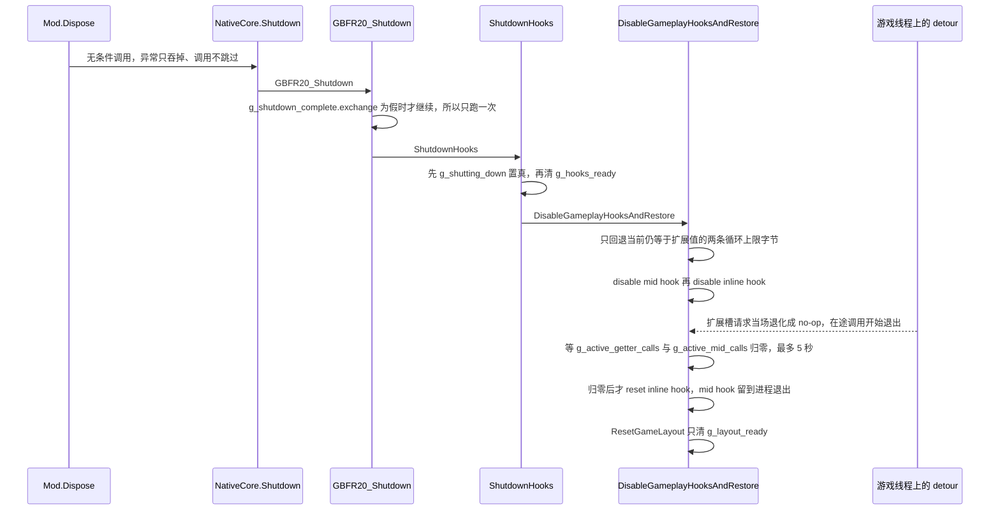
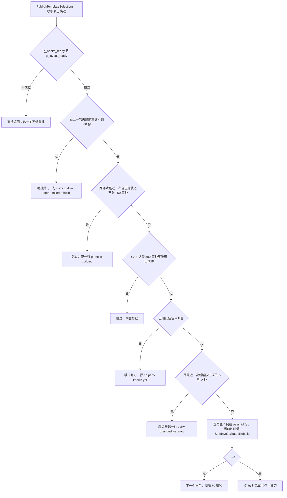
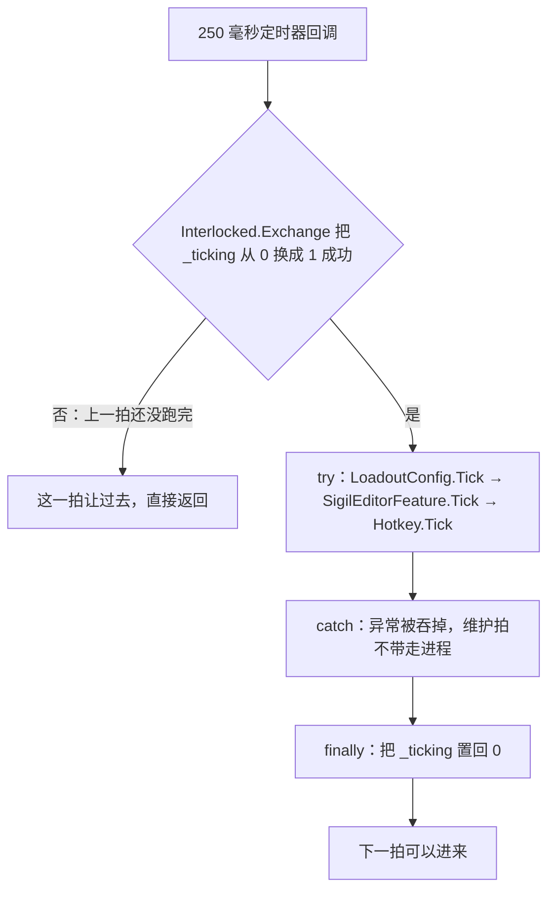

# 并发、锁序与生命周期守卫

这份代码跑在几个互不可见的执行上下文里：游戏自己构建角色状态的线程（下面简称**游戏线程**）、托管 mod 的 250ms 维护拍线程、可视工具的 Go 进程、以及进程退出时的关机路径。它没有对游戏做任何线程编组，也没有握手协议——所有跨上下文的协调都收在这几处：两把 `shared_mutex`、一组 `thread_local` 快照、两个在途计数器、一组时间戳原子量、两道文件 mtime 门，以及 `extern "C"` 边界上的异常与输入守卫。

本页只写仓库里真实存在、且被注释论证过的耦合。各个机制自己的语义在别处：[原生核心（C++ DLL）](/openwiki/architecture/native-core.md) 讲 ABI 与生命周期，[虚拟槽位、模板因子与专属开关](/openwiki/concepts/virtual-slots-and-exclusives.md) 讲槽位模型，[两个配置文件与跨语言常量契约](/openwiki/concepts/config-file-contracts.md) 讲文件契约与两种 mtime 门，[skill_status 表与活表写入闸门](/openwiki/concepts/skill-status-table.md) 讲表写入。

## 1. 三个写者与它们碰的共享状态



三个写者、它们碰的共享状态，以及每一次访问拿的是哪把锁。

| 共享状态 | 保护方式 | 写者 | 读者 |
| --- | --- | --- | --- |
| `g_runtime_templates`、`g_character_template_index`、`g_exclusive_state` | `g_template_mutex`（`shared_mutex`） | `InitializeRuntimeTemplates`、`ApplyLoadout`（都在 `unique_lock` 下） | detour 的 `TryGetRuntimeSlot`（`shared_lock`，拷值返回） |
| `g_character_selections` | `g_selection_mutex`（`shared_mutex`） | `InstallDefaultTemplateSelections`（`unique_lock`） | detour 的 `GetSelection`（`shared_lock`，返回数组副本） |
| `g_latest_context1_status` | `g_party_mutex`（`mutex`） | 游戏线程的 `RememberContext1Status` | `LatestContext1Status`、`TryClaimRebuildNow` 与 `RebuildPartyStatusesOnce` |
| `g_runtime_message`（跨 ABI 的那份诊断消息） | `g_message_mutex`（`mutex`） | `SetRuntimeMessage`（初始化各阶段、装机失败的收尾、以及 detour 里贡献结算那一格；先锁外 `Log`、再在 `scoped_lock` 下替换字符串） | `GBFR20_CopyRuntimeMessage`（锁内拷成局部 `std::string`，锁外写进调用方缓冲） |
| `g_context1_pass_id`、`g_last_game_context1_ms`、`g_last_game_build_ms`、`g_hot_rebuild_not_before_ms`、`g_party_changed_ms`、`g_hot_rebuild_cooldown_until_ms` | `std::atomic`（acquire/release 或 CAS） | 游戏线程的 detour、维护拍的重建循环 | 同上两者 |
| `g_active_getter_calls` / `g_active_mid_calls` | 原子量，无锁 | 两个 detour 的 `ActiveCallGuard` | 关机排空循环 |
| `g_tls_build_*` / `g_tls_natural_contribution` / `g_tls_hot_rebuild_build` | `thread_local`，本就不共享 | 同线程的 detour，以及同线程上跑的 `SafeInvokeStatusRebuild` | 同线程的 detour |
| `g_virtual_slot_count`、`g_hooks_ready`、`g_layout_ready`、`g_shutting_down`、`g_shutdown_complete`、`g_slot_rva` | `std::atomic` | `ApplyLoadout`、`InstallHooks`、`ShutdownHooks`、`GBFR20_Shutdown`、`ResolveTableSlot` | 所有入口的第一道闸 |

读这张表要配一句话：**没有一处会去"等游戏"**。detour 在游戏线程上只做"加共享锁、读、拷值、返回"（规则 2），维护拍的那次重建调用则是**同步**跑在定时器线程上（规则 9），于是"我们什么时候动手"只能靠时间戳推断，而不是靠握手。

`g_message_mutex` 是 detour 自己唯一会取的那把额外锁：贡献结算那一格走 `SetRuntimeMessage`，它只在 `scoped_lock` 下替换一个 `std::string`，不跨越任何游戏调用，也不与 `g_template_mutex` / `g_selection_mutex` / `g_party_mutex` 嵌套——所以"锁内不回到游戏代码"这条不变量在所有路径上都成立。它换来的是一句可信的运行时消息：写者在锁外先 `Log`，读者 `GBFR20_CopyRuntimeMessage` 在锁内拷成局部字符串、锁外再 `memcpy` 给调用方，两边的长度口径由它自己返回（`buffer_size` 为 0 时只问需要多大）。

## 2. 原生侧：锁序 template → selection

**规则 1：唯一同时持有两把 `shared_mutex` 的地方是 `InstallDefaultTemplateSelections`，顺序是 `g_template_mutex` → `g_selection_mutex`；任何路径都不许反过来。**

代码里这条顺序只写在那一处，理由也写在那里：「锁顺序：template -> selection（与运行期写者一致）；只在 selection mutex 下遍历模板表就是数据竞争」。运行期的写者顺序也遵守它：`ApplyLoadout` 先在 `g_template_mutex` 下改模板表与专属开关，释放后才走 `PublishTemplateSelections`（后者内部才取 selection 锁）。`g_template_mutex` 保护的并不只有模板数组：`g_character_template_index`（角色 → 模板表下标）与按角色的专属开关 `g_exclusive_state` 同在这把锁下，`ApplyLoadout` 在同一个 `unique_lock` 里整体替换开关、并按新开关重算每个角色的 slot 0/1/2。

- **违反后果（死锁）**：反序取锁与 detour 的读路径叠加时，游戏线程可以在持 `g_selection_mutex` 时等 `g_template_mutex`，而维护拍持 `g_template_mutex` 等 `g_selection_mutex`。detour 在游戏线程上跑，这个死锁卡住的是游戏的技能构建。
- **违反后果（数据竞争）**：绕开 `g_template_mutex` 遍历模板表或读 `g_exclusive_state`，会读到正在被 `ApplyLoadout` 改写的槽位——症状是某个角色的某个槽位用上了别的配置（旧槽位），且没有日志。

**规则 2：热路径只以 `shared_lock` 拷贝值，然后在锁内不做任何回调游戏的事。**

`GetSelection` 与 `TryGetRuntimeSlot` 都是"加共享锁 → 找键 → 拷一份值出来 → 返回"，调用方拿到的是副本而不是引用（返回 `std::array`、或写进 `TemplateGemSlot& out`）。`g_runtime_templates` 与 `g_character_selections` 的读者因此可以在游戏线程上并发进入，且不会在持锁期间再进游戏代码。两个函数都顺手把异常挡在自己内部（`noexcept` + `catch (...)`，退化成"没有 gem / 没有选择"并记一行），因为它们的调用点就在 detour 里。

- **违反后果（把游戏拖进锁内）**：detour 持锁期间若回调游戏（分配、日志回调、再进 getter，甚至间接触发一次状态重建），持锁时间就不再由我们控制——游戏线程会在同一把锁上与自己相遇，而一旦那条重入路径需要写档（共享档升独占档），就是标准明确不允许的自锁；即使不死锁，技能构建也会开始等维护拍的写者。

**规则 2 的边界**：别把它读成"detour 里一把锁都不取、一次分配都没有"。贡献结算那一格确实会 `std::format` 出一行消息并去取 `g_message_mutex`（见 §1 表），失败路径也会 `Log`。真正的不变量只有两条：**持 `g_template_mutex` / `g_selection_mutex` 期间绝不回到游戏代码**，以及**任何锁都不跨越游戏调用**。改 detour 时按这两条判，而不是按"钩子里不许有锁"判。

**规则 3：不需要锁的状态就只用原子量或 `thread_local`，不额外加锁；前提是"单写者"或"明确的发布顺序"能被指出来。**

- `table_slot.cpp` 的 `g_slot_rva` 是单写者：`ResolveTableSlot()` 只在 `Initialize` 里被调一次，而 `Initialize` 本身被 `EnsureInitialized` 的 `std::call_once` 挡住。读者只 `load`，所以一个原子量就够；而且缓冲区指针每次调用**现读**（槽 +8 那个字段），注释写明"每次问都重新读指针，不缓存地址……所以这里不存在『缓存失效』这个概念"。
- `g_layout_ready` 是"先写结构体、再 release store 标志"：`ResolveGameLayout` 先做完最终校验、`g_game_layout = layout`，然后才 release store 标志，读者一律 acquire。`ResetGameLayout` 只把标志清掉、**不回写结构体**，注释给了理由：那会与"刚在关机或安装失败回滚前读到上一份真状态"的读者相争。
- `g_virtual_slot_count` 是另一条发布顺序：`ApplyLoadout` 先把新计数 release store 出去，再改游戏那两条循环上限字节；字节补丁失败就把计数写回旧值并返回失败。理由写在代码里——detour 按这个计数给虚拟槽设闸，所以它必须已经与游戏线程下一轮循环看到的补丁一致。
- `exports.cpp` 里"同一种拒写只报一次"的 `last_refusal` 也是一个静态原子量，靠 exchange 语义而不是锁去重。

**违反后果（读到半发布状态）**：`g_layout_ready` 若不是"结构体先写好、再用 release 发布"，读者会在偏移还是 0 的时候就开始用它们——`SafeReadStatusIdentity` 会从错误的偏移取 `character_hash`，之后一切按身份与偏移做的算术都跟着错（轻则注入失效，重则按错地址写内存）。

## 3. `thread_local` 构建快照：为什么不能用「以 status 地址为键的授权表」

**规则 4：一次构建 = 一条线程上同步跑完扩展槽 13…N，所以"本次构建用哪套槽位"只放进 `thread_local`；快照一次 store，整个构建都读这一份。**

`skill_hooks.cpp` 顶部的这段注释就是这条不变量本身：

```cpp
// 一次构建 = 一条线程上同步跑完扩展槽 13…N，所以 "本次构建用哪套槽位" 只要 thread_local：
// 构建开始时（第一个扩展槽）快照一次 store，整个构建都读这一份。别改回"以 status 地址为键的
// 授权表"：status 对象是轮换的、地址跨角色复用，残留授权会命中复用地址并注入旧槽位。
```

快照由 `ObserveBuildStart` 在扩展槽第一格做（规则与副作用清单见 [skill-injection-runtime](/openwiki/workflows/skill-injection-runtime.md)）：写 `g_tls_build_selection` / `g_tls_build_has_selection` / `g_tls_build_status` / `g_tls_build_character`。构建循环内 `TryLoadVirtualSkillSelection` 只在**这次调用确实来自两条技能循环之一**（`from_apply_loop || from_category_loop`）**且** `status` 与 `character_hash` 都对上、且快照里真有选中的槽位时，才用快照；否则回落成"现查 `GetSelection`"。构建循环之外的取用（UI / 效果读这份 status 的因子）永远走现查这条路，没有第二条。

- **违反后果（旧槽位）**：改回以 `status` 地址为键的授权表，残留授权会命中**被复用的地址**——`status` 对象是轮换的、地址跨角色复用。表现是给这个角色注入了上一个角色那份授权里的槽位，而且没有任何一处会报错。
- **违反后果（错的选择快照）**：只比 `status` 地址不够。同一线程上换一个角色时可能拿到完全相同的地址，于是这个角色会用上**上一个角色那次构建的槽位选择**——"哪些槽位启用"由别人决定，而槽位号本身仍然合法，日志里看不出异常。`character_hash` 这一项就是为这条而存在的。

**规则 5：TLS 状态机里的匹配条件不许缩水。**

`NaturalContributionFrame` 同样是 `thread_local`，并且比对 `status` + `character_hash` + `context_mode` + `next_slot` **四项**：任何一项不符就整帧作废（`g_tls_natural_contribution = {}`）。只有把这套槽位真的注进去的最后一格（`slot_index == GetExpandedInternalSlotCount() - 1`）才结算，且结算前还要重读一次身份确认（`SafeReadStatusIdentity` + 角色与 context 都对）。成功那条"Skill contribution confirmed … N/N"每会话只报一次，失败的 `N/M` 仍然每次都报。

- **违反后果（假的 9/9 确认）**：少比一项就会把另一次构建、另一份 `status` 的复制记进这一份的计数里——会话里那条 "Skill contribution confirmed" 会变成一句不成立的断言，而这正是排查注入是否生效的唯一正向证据。

## 4. `ActiveCallGuard` 与拆卸时排空在途 detour

**规则 6：`ActiveCallGuard` 只包住 detour 的函数体——进入加一、退出减一、`acq_rel`；它不覆盖 safetyhook stub 的收尾指令。**

```cpp
struct ActiveCallGuard {
    explicit ActiveCallGuard(std::atomic_uint32_t& value) : counter(value) {
        counter.fetch_add(1, std::memory_order_acq_rel);
    }
    ~ActiveCallGuard() {
        counter.fetch_sub(1, std::memory_order_acq_rel);
    }
    std::atomic_uint32_t& counter;
};
```

`GetGemDataByIndexDetour` 和 `OnSkillFetch` 的第一条语句就是这个守卫，所以计数覆盖整段 detour 体（包括转发给原生 getter 的那条路）。计数的用途只有一个：关机时知道"还有多少调用在 detour 里没退出来"。两个计数都用 `acq_rel` 加减、排空循环用 acquire load 读，所以"看到 0"是一个同步点，不是只靠数值巧合。

**规则 7：拆卸顺序固定为"先恢复上限字节 → 再 disable 两个钩子 → 等两个计数归零（最多 5 秒）→ 只 `reset()` inline hook"。**

三个步骤各自都有"换个顺序就崩"的理由：

- **先恢复上限字节，后拆钩子。** `DisableGameplayHooksAndRestore` 里的注释：两个 detour 活着时，`slot >= 13` 的请求仍被它们挡住；先拆钩子会留下一段窗口，让原始那个只有 13 格的 getter 被问到 `slot 13+N`。回退本身也带条件：只回退"当前字节仍等于我们那个扩展值"的那一处，已经恢复过（或从未打过补丁）的不能碰。
  - **违反后果（越界读）**：原始 getter 按 13 格数组的边界读出去，读到相邻内存并当成 `GemData` 使用。
- **排空 `g_active_getter_calls` 与 `g_active_mid_calls` 之后才 `reset()`。** 超时（5 秒）时的选择是**把钩子留着**（已经 disable、上限字节已恢复），因为进程本就在关机中，宁可留几页也不释放活调用可能仍在执行的内存。
  - **违反后果（崩溃）**：跳过排空直接 `reset()`，`VirtualFree` 掉线程仍在执行的那几页。
- **刻意不 `reset()` mid hook（`g_skill_fetch_hook`）。** 理由写在注释里：`ActiveCallGuard` 只包住 detour 的函数体，而 safetyhook 的 stub 在它返回之后还要跑收尾指令——计数器先归零，`reset()` 就会 `VirtualFree` 掉线程仍在执行的那几页。`disable()` 已还原目标字节，留几页到进程退出是安全的。
  - **违反后果（崩溃）**：把"计数器归零"当成"这条路径已经走完"的唯一证据，就会在 stub 的尾声上释放代码页。

**规则 8：`g_shutting_down` 是每个入口的第一道闸，`DllMain` 的 `DLL_PROCESS_DETACH` 也只置这一个标志。**

`DLL_PROCESS_DETACH` 里不做拆卸，只把 `g_shutting_down` 置真——它是"进程要没了"的第一手信号。此后 `GBFR20_ApplyLoadout` 直接返回 0、`GBFR20_WriteSkillStatusTable` 返回 `GBFR20_TABLE_NOT_READY`；两个 detour 都查这个标志，查到就把扩展槽的请求当成"没有注入"（`GetGemDataByIndexDetour` 返回 0、`OnSkillFetch` 把 `rax` 置 0 并跳到循环出口）。唯一不设这道闸的是 `slot_index < 13` 的请求——它们本来就直接转发给原生 getter，与注入无关。

- **违反后果（用半拆的内存）**：在途 detour 若在拆卸过程中继续处理扩展槽，就会走进即将被回滚或释放的路径——而且这是在"进程本来要退出"的时刻炸，排查时最容易归错因。
- **副产品（帮排空完成）**：正因为 detour 会立刻退化成 no-op，排空循环才能在 5 秒内等到计数归零。这条闸与规则 7 是配套的，撤掉任何一半，另一半都会变成长时间等待或直接释放活代码。

`GBFR20_Shutdown` 自己用 `g_shutdown_complete.exchange(true)` 保证 `ShutdownHooks` 只跑一次；托管侧 `Mod.Dispose()` 则**无条件**调用 `NativeCore.Shutdown()`（`Initialize` 一旦返回，DLL 已加载、日志回调已挂上、钩子可能已经装好，之后的每一步都可能抛异常把控制权交到 `Dispose`），异常被吞掉但调用不会被跳过。

- **违反后果（钩子留在游戏里）**：用"全都成功之后才置位"的标志门住 Shutdown，失败路径就会把原生钩子留在游戏进程里——字节补丁还在、钩子还在，而 mod 已经认为自己在拆卸。

`DllMain` 的 `DLL_PROCESS_DETACH` 是这条链之外的另一条入口，它只置 `g_shutting_down`：进程正在被拆时能做的安全动作只有让在途 detour 立刻退化成 no-op，剩下的释放交给托管侧的 `Dispose`。

关停的完整顺序只在一处，而且每一步都有先后理由（标志先立、上限字节与钩子再拆、在途调用排空之后才释放最后那几页）：



关停时序：置标志 → 还原上限字节 → disable → 排空 → 释放，超时则留在"已 disable、未释放"这一步。

## 5. 热重建：时间戳闸门与轮次记账

**规则 9：配装改动之后只做两件事——换掉选择（对所有角色），然后对已知的出战角色各重建一次状态。这条路径必须有，因为战斗里游戏自己不会重建角色状态。**

`PublishTemplateSelections` 是唯一入口，它只有两步：`InstallDefaultTemplateSelections()` 与 `RebuildPartyStatusesOnce()`。注释写下了为什么第二步不能省：战斗里游戏自己不会重建角色状态，"等下一场战斗"在战斗中永远等不到；同一段注释也声明这是本项目**唯一**会去动游戏活对象的地方。

调用链是：托管 250ms 维护拍 → `LoadoutConfig.Tick` → `NativeCore.ApplyLoadout` → `GBFR20_ApplyLoadout` → `ApplyLoadout` → `PublishTemplateSelections` → `RebuildPartyStatusesOnce` → `SafeInvokeStatusRebuild`。`GBFR20_ApplyLoadout` 是普通 `DllImport`，没有任何编组回游戏线程的机制，所以这次"动游戏活对象"的调用发生在工具自己的定时器线程上。这正是闸门只能用时间戳推断、而不能直接问游戏"你现在在不在建状态"的原因。



热重建的判据顺序、逐角色的轮次判据、以及失败后的冷却。

`TryClaimRebuildNow` 名字叫 `TryClaim` 而不是 `Can`，因为它**有副作用**，而且那个副作用就是节流本身：过了前两条之后它用 CAS 把"下一次最早什么时候"推掉固定字面量 500ms。调用方不能把它当纯谓词。

| 判据 | 常量 / 值 | 语义 | 跳过时 |
| --- | --- | --- | --- |
| 失败冷却 | `kHotRebuildCooldownMs` = 60000 | 上一次重建 `ok=0` 之后 60 秒内不再动手 | 一行 `cooling down after a failed rebuild` |
| 游戏构建静默 | `kGameBuildQuietMs` = 250 | 游戏最近 250ms 内自己建过状态就不动手 | 一行 `game is building` |
| 节流窗口 | 字面量 500ms（CAS 认领） | 认领成功才允许这一拍动手 | **静默**（每拍都可能命中） |
| 队伍名单非空 | 查 `g_latest_context1_status` 是否为空 | 一个出战角色都还没认出来就不动手 | 一行 `no party known yet; skipped` |
| 换队禁重建 | 字面量 2000ms | 新增队伍成员之后 2 秒内不动手 | 一行 `party changed just now` |
| 队伍装配轮次切分 | `kAssemblyWindowMs` = 1000 | 两次**游戏自己**的 context-1 构建间隔超过 1 秒才算新的一轮 | 不是跳过理由，是记账口径（规则 10） |

- **违反后果（竞态崩溃）**：我们的调用和游戏自己的构建同时碰一份 `status` 就是竞态——注释里那句是"崩溃前的 `ok=0` 都出在这种重叠里"。250ms 这个宽度是实测选出来的：游戏建状态时是**连续**调 detour 的，250ms 足以识别"正在建"；换成"最近 5 秒建过"会挡掉界面上几乎每一次改动。
- **违反后果（日志淹没）**：每拍都可能命中的那条判据必须静默——写日志只会把真正有信息量的跳过淹掉。反过来，冷却、队伍未知、换队太近这三条要出声，因为它们不是每拍都会命中。

两个细节必须照代码读，不能照注释读：

- **注释与代码已经分叉。** 文件顶部那段注释写着"'游戏正在建'与 CAS 这两条**刻意静默**"，但代码里 `game is building` 这条现在**确实**写了一行日志；真正静默的只有 CAS 节流那一条。改这块时以代码为真。
- **节流之后的判据同样会花掉那 500ms。** 空队伍与换队两条排在 CAS 认领**之后**，所以它们跳过时那一拍已经认领走的窗口不会退回——这是有意为之（注释："这条排在节流之后：所以『队伍还没认出来』同样会推掉那 500ms"）。而"钩子/布局就绪"不在这份判据清单里：它是 `RebuildPartyStatusesOnce` 的前置条件，不成立就静默返回。

**规则 10：热重建只认"当前这轮队伍装配里建出来的对象"——`pass_id` 必须等于当前轮。**

`g_latest_context1_status` 每个角色只留**最近一次** context-1 构建用的 `status`，并且连同 `pass_id`（它属于哪一轮队伍装配）一起记。轮次只在**游戏自己**的构建之间推进：两次游戏构建间隔超过 `kAssemblyWindowMs`（1000ms）才算新的一轮；我们自己的重建调用带 `g_tls_hot_rebuild_build` 标记，它带来的构建不切轮，只把目标角色留在当前轮里——否则被打断的那一轮成员会被误判为过期。

这个标记能用 `thread_local` 是有前提的：`SafeInvokeStatusRebuild` 在维护拍线程上**同步**调用游戏的状态重建函数，而重建函数会回调进 detour（也就是在同一条线程上），所以标记与它标记的那批构建落在同一条线程里，跨线程看不见也不需要看见。出战队伍名单就是 `g_latest_context1_status` 的键集，没有第二份。

- **违反后果（戳内存垃圾）**：换人/切场景时被移出的人那份对象会被游戏拆掉，而**身份残留还在、身份校验照样通过**——`SafeReadStatusIdentity` 读到的 `character_hash` 和 `context_mode` 仍然对得上，于是重建它就是戳已释放的内存。所以闸判的是**对象还新不新，不是指针记不记得住**。
- **违反后果（打到不在场上的人）**：跳过"队伍名单 = `g_latest_context1_status` 的键集"这张唯一名单、去别处维护第二份出战名单，就会出现两份不一致的成员表——重建打到已经离场的人身上，正是上一条那个场景。

`SafeInvokeStatusRebuild` 自己还有一层与时间戳无关的闸：调用前读一次身份，要求 `character_hash` 与要重建的角色一致、`context_mode` 合法，不成立就**拒绝调用**（`refused before the call (identity mismatch)`）；调用后再读一次，要求角色与 context 都没变——重建函数自己把对象换掉了的话，这一次也不算成功（`identity changed after the call`）。两次身份校验都用 SEH 兜住，而这个失败就是"对象已经没了"的第一手信号：注释写明 AV 出在读该对象字段的指令上。失败回到调用方就是规则 9 那条冷却。

热重建的单角色失败还有一个必须保留的副作用：`g_hot_rebuild_cooldown_until_ms` 被置成 `now + kHotRebuildCooldownMs`。每人只调一次、不重试、角色之间 `Sleep(50)`——旧版危险之处（注释里明确写着）是"1 秒一次、整场不停、目标跟着装备页选中的人跑"，而 `ok=0` 的那份对象已经被留在可疑状态，之后往往紧跟着崩溃。冷却 60 秒而不是整场报废，是为了不让人以为功能坏了。

## 6. 托管侧：维护拍单飞、两种 mtime 版本门

**规则 11：250ms 维护拍必须单飞——`Interlocked.Exchange(ref _ticking, 1)` 挡住重入，三个阶段都按"这一拍让过去"处理。**

定时器回调不串行，上一拍没跑完下一拍就会进来。三个阶段（`LoadoutConfig.Tick`、`SigilEditorFeature.Tick`、`Hotkey.Tick`）各自都只把"漏掉一拍"当成让过去，所以在定时器里统一挡住，不必每处各防一遍。整个回调还套在 `try/catch` 里：维护拍绝不能把进程带走。

- **违反后果（同一拍跑两遍）**：`FileStamp._applied`、`SigilEditorFeature` 的 `_lastAttemptMs` / `_loggedAttemptUtc` / `_retryTable` / `_retryTableStamp` 都是无锁的普通字段，两个 tick 同时跑就会把同一版当成新版本处理两次，或把"内容属于哪一版"记乱（版本号与候选表配错之后，那一版会被判成"已应用"）。原生侧的两次 `ApplyLoadout` 会在 `g_template_mutex` 上串行，但两次 `PublishTemplateSelections` 会撞在同一个 500ms 节流窗口上，第二次**静默**跳过——界面上连改几下时，真正的重建次数就少一次。



一拍的重入保护：`_ticking` 只允许一个 tick 进入三个阶段，退出时无条件放行，所以"漏掉一拍"是唯一的并发表现。

**规则 12：`FileStamp` 的两种语义不能混用——配装用"认领后处理"（`Changed()`），编辑列表用"确认生效才推进"（`Pending()` + `MarkApplied()`）。**

| 特性 | 用的那一半 | 为什么 |
| --- | --- | --- |
| `LoadoutConfig`（配装） | `Changed()`：**无论成败都算处理过** | 单次应用；失败就保留上一份配置，下一次保存自然会改 mtime。否则同一份坏配置每 250ms 重试一次，只会把同一个报错灌满日志 |
| `SigilEditorFeature`（编辑列表） | `Pending(Now())` + 只在原生确实改写了行之后（或内存里已经是这一版的字节）才 `MarkApplied(stamp)` | 读不出表、原生拒写都提前 return，那一版还欠着，下一拍会再来 |

门本身、以及"为什么磁盘上的一次写入可以当作版本号"的跨语言口径在 [两个配置文件与跨语言常量契约](/openwiki/concepts/config-file-contracts.md)（那里的 §4）。这里只记它与并发有关的两面：

- **违反后果（丢编辑）**：编辑列表改用"认领后处理"，一次拒写就会把那一版编辑永久吃掉——内存里一个字节都没变，而门已经宣布"处理过了"。
- **违反后果（日志淹没）**：配装改用"确认生效"，一份坏 `loadout.json` 会每 250ms 重报一次同样的错。
- **配套的顺序纪律**：`SigilEditorFeature.Bootstrap` 里"版本号必须在**读内容之前**取"，造表之后再复查一次 mtime（`_stamp.Now() != stamp` 就整版作废、不推进版本）。反过来就是"内容来自 T1、版本号来自 T4"，中间落盘的那次保存会被 `MarkApplied(T4)` 判成已生效，而内存里是旧内容——编辑静默丢失且不再重试。
- **同版本重试的节流**：拒写期间每 5 秒重试一次（`RetryIntervalMs`），并复用上一次留下的候选表（`_retryTable` + `_retryTableStamp`），否则每次重试都要从归档重建 328 KB。同版本重试的日志是静默的，版本一变才重新开口——因为**原生在自己那句 `refused` 里打字**，托管侧的静默管不到。

## 7. Go 侧：防抖写、原子替换、退出 flush

可视工具是两个 service 共用一个防抖骨架（`debouncedWriter[T]`）：**待写只有一份、写盘只在 `mu` 里发生**。`submit` 替换待写并重启定时器（`debounceDelay` = 500ms），所以一串连续编辑只换来一次落盘，落盘的永远是屏幕上最后的状态，绝不会是若干次按键的混合。前端对此刻意保持无知：每次变化把整份列表交出去、不等答复。

**规则 13：落盘一律经 `writeFileAtomic`——同目录唯一临时文件 + rename，或者什么都不改。**

- **违反后果（读到半截配置）**：直接 `O_TRUNC` 写会留下一个"读到半截"的窗口，而运行中的 mod 会反复读这两份文件——那边只能看到坏 JSON。`TestConcurrentSavesNeverTearTheFile` 就是对这条的断言：并发保存之后，磁盘上的内容必须**逐字等于某一次**完整保存，不是任意拼接。
- **违反后果（共用中转文件）**：临时名不是唯一的（比如固定 `path + ".tmp"`），并发的两次保存会写到同一个中转文件上，半写完的内容照样可能被 rename 到位。

**规则 14：退出时必须把压着的那份交出去（`flushNow`），写失败要把待写放回。**

`main.go` 把 `editService.flushNow` 与 `loadoutService.flushNow` 都注册在 `app.OnShutdown` 上；`flushNow` 先停定时器，再在 `mu` 里把待写**取走**（不是读取）后落盘，所以第二次 flush 不会写第二遍。`flushLocked` 在写失败时把 `pending` 放回原处、记一行日志、并把 `saveFailedEvent` 推给前端——这个失败已经没有调用方可以返回了。

- **违反后果（丢编辑）**：窗口在防抖窗口里就关掉，而被压在待写里的正是用户刚做的那次编辑。这是防抖设计自身引入的窗口，`flushNow` 是唯一的堵法。
- **违反后果（永久丢失）**：一次瞬时 IO 失败若直接丢弃待写，那条编辑就再也不会被重试（下一次防抖或退出时的 `flushNow` 本来就是它的重试点）。

## 8. ABI 边界：异常守卫与输入闸

**规则 15：异常绝不能跨出 `extern "C"`——所有可能抛的导出都从 `GuardAbi` 走，"throw" 变成"拒绝值 + 一行原因"。**

```cpp
template <typename Fn, typename T>
T GuardAbi(const char* what, T refusal, Fn&& body) noexcept {
    try {
        return body();
    }
    catch (...) {
        Log(std::format("{}: threw; reported as a refusal.", what));
        return refusal;
    }
}
```

- **违反后果（`std::terminate` 带走游戏）**：`extern "C"` 的契约里没有"异常"这一项，一个未接住的 `throw` 直接终止进程——而且是在宿主进程里。
- **配套的 `noexcept` 取舍**：会抛的内部实现（`ApplyLoadout`、`SetRuntimeMessage`）刻意**不**标 `noexcept`，因为标了之后 `throw` 会在函数出口先变成 `std::terminate`，`GuardAbi` 根本来不及接（这条写进了 `native_internal.h` 的声明旁边）。反过来，`Log` 声明为 `noexcept` 并真的不抛（格式化失败退化成不带时间戳的原文，宿主回调那一份单独兜），因为所有失败路径和 `catch` 块都在用它。
- **守卫之内还有一道输入闸**：`ApplyLoadoutEntry` 先看 `slot_count` / `override_count` 是否超过上界（`kVirtualSlotCapacity`、`kRuntimeTemplateCapacity * 3`），超了就以 0 拒绝——因为下面是按调用方给的计数逐个读那两块内存，凭空来的计数会一路读到调用方数组之外。
- **拒绝值取"最保守"那一档**：`GBFR20_WriteSkillStatusTable` 的兜底是 `GBFR20_TABLE_WRITE_FAILED`（-7），因为它是唯一"写之后"的码——把"守卫兜住了异常"报成 -7，比报成"一个字节都没动"的码安全。
- **日志桥两侧都要兜**：原生的 `Log` 不抛；托管侧的 `ForwardNativeLog` 整个包在 `try/catch` 里，因为"诊断回调绝不能让异常展开回原生钩子代码"（那会顺着 detour 展开进游戏）。回调委托由静态字段持有不回收，拆卸时才 `SetLogCallback(IntPtr.Zero)`。

## 9. 这份代码被验证到什么程度

这些并发不变量**没有**自动化覆盖，必须诚实记住：

- Go 侧唯一测到的并发行为是防抖与原子替换：`TestSaveEditsWaitsForTheEditingToStop`（synctest 气泡里断言安静期内不落盘、第二次编辑重启窗口、最后只落一次最后状态）、`TestSaveEditsSurvivesAWriteItCannotMake`（做不成的写入必须可见且不带走工具，而且失败的那份仍在待写里——同一个 `flushNow` 在障碍消失后能把它写下去，这是"失败就放回"的唯一自动化证据）、`TestConcurrentSavesNeverTearTheFile`。它们验证的是写入端的行为，不是"运行中的 mod 读到了什么"。
- 原生侧唯一的离线闸门是 `tests/NativeLayoutHarness`，它把 `layout_resolver.cpp` 与 `safe_game_access.cpp` 编进一个离线可执行文件，只断言三件事：布局解析成功、解析结果逐字节自证、以及把一个 hook 点的字节翻一位之后复验必须失败。它**不碰**任何锁、TLS 快照、在途计数或热重建闸门。
- 因此锁序、排空、250ms 构建静默窗口、60 秒冷却、2 秒换队禁令、轮次闸这些只能靠真机日志验证：`hot rebuild: skipped (...)`、`hot rebuild: char=... ok=N`、`ctx1 build: char=... pass=...`、`party+ char=...` 是它们的唯一观测面（见 [日志与故障定位](/openwiki/operations/logging-and-diagnostics.md)）。读日志时注意规则 9 那条分叉：`game is building` 会出现在日志里，尽管注释说它该静默。

覆盖面与其余套件见 [验证地图](/openwiki/testing/verification-map.md)。

## 10. 改这份代码时的边界

- **别把"以 `status` 地址为键的授权表"加回来**（`skill_hooks.cpp` 顶部注释写了"别改回"）。地址跨角色复用是常态，不是边界情况。
- **在 `thread_local` 快照上追加匹配项时，只能加不能减**；`status` 与 `character_hash` 两项缺一不可。
- **新增取锁路径时先问"它和 template → selection 谁在外层"**；`InstallDefaultTemplateSelections` 是唯一同时持两把锁的地方，别造出第二个反序点。往 `g_template_mutex` 下加新状态时，把"要求调用方持锁"写进函数名或注释（`ReadExclusiveStateLocked` / `ApplyExclusiveSwitchesLocked` 就是这么做的）。
- **detour 的函数体之外不要动在途计数的语义**：计数只承诺"detour 体还没退出来"，`reset()` 的门槛比它更严（见规则 7 的第三条）。
- **`g_shutting_down` 必须在任何拆卸动作之前置**：它是让在途 detour 立刻退化成 no-op 的那一半，撤掉它排空循环就只能干等超时；往 `ShutdownHooks` 里插新步骤时，插在标志之后、`DisableGameplayHooksAndRestore` 之前或之内都行，插到标志之前不行。
- **在 detour 里新增锁之前先问"这把锁会不会跨越一次游戏调用"**：`g_message_mutex` 那种只包住一次字符串替换的可以（它不与另外三把锁嵌套），包住游戏调用的不行——那会把游戏线程拖进我们的锁里。
- **热重建的闸门只许收紧到被实测证明有必要**：每加一条判据都要知道它会挡掉界面上多少次改动（250ms 与 5 秒的对比就是这么定下来的），每减一条都要说明崩溃窗口为什么不再存在。也不要往"唯一会去动游戏活对象"的那条路径之外再加调用。
- **注释分叉时以代码为准**：`selection_store.cpp` 顶部注释说"游戏正在建"与 CAS 两条跳过都应静默，代码里前者会记一行。改这块时别照抄注释，也别只改注释了事。
- **配装与编辑列表的 mtime 门不许互换**：一个要"失败就等下一版"，一个要"失败就下一拍再来"。
- **新增导出时同时接上 `GuardAbi`**，并且不要给会抛的内部实现标 `noexcept`；细节与三处成对修改的位置见 [原生核心（C++ DLL）](/openwiki/architecture/native-core.md)。
