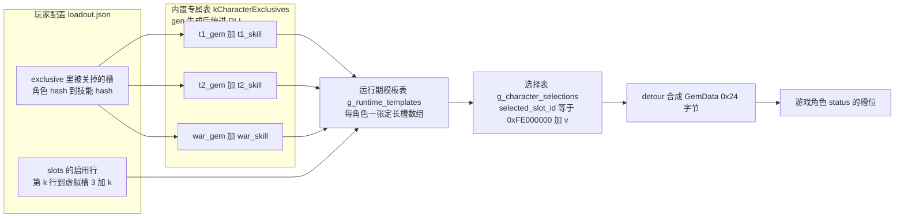
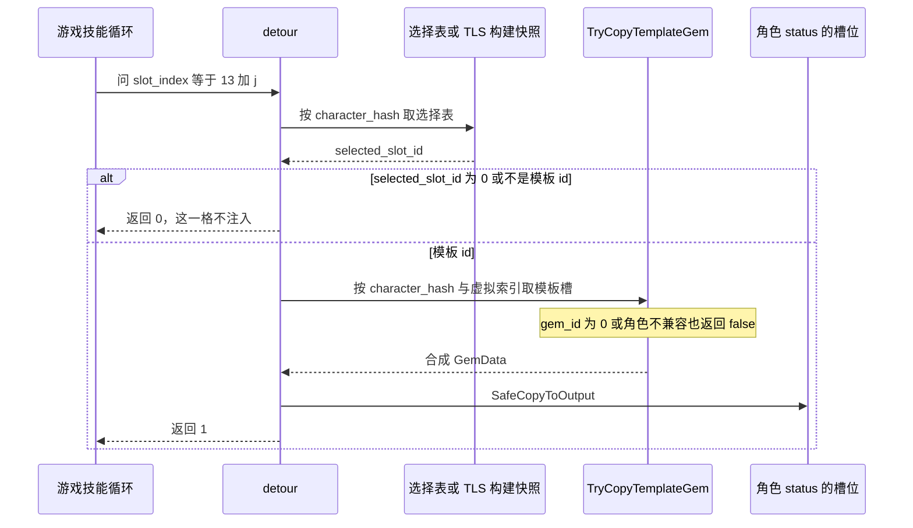

# 虚拟槽位、模板因子与专属开关

「虚拟槽位」是 mod 自己扩出来的因子槽：它们不在本体那 13 个内部槽里，也不占用库存、不写存档，而是由原生核心在**游戏读某个内部槽**的那一刻合成一份 `GemData` 顶上。本页讲清三件事：**槽位怎么编号、每个槽的因子从哪来、专属开关与角色限制怎么落在槽上**。

读这份代码需要的其余上下文分布在别页：ABI 导出面与生命周期见 [原生核心（C++ DLL）](/openwiki/architecture/native-core.md)，钩子怎么把槽塞进角色状态见 [工作流：游戏侧注入运行期](/openwiki/workflows/skill-injection-runtime.md)，`loadout.json` 的形状与三语言常量对拍见 [两个配置文件与跨语言常量契约](/openwiki/concepts/config-file-contracts.md)，并发与锁序见 [并发、锁序与生命周期守卫](/openwiki/concepts/threading-and-locks.md)，生成器与随包数据见 [外部生成器 gen 与随包数据资产](/openwiki/integrations/external-generator-and-assets.md)，端到端流程见 [工作流：配装从界面到游戏状态](/openwiki/workflows/loadout-apply.md)。

## 1. 编号约定（写死，前后一致）

三套编号同时存在，混起来就会把「某几个槽静默不生效」当成 bug 去查：

| 编号 | 范围 | 谁在用 |
| --- | --- | --- |
| **本体内部槽 `i`** | `0 .. 12`（`kNativeInternalSlotCount = 13`） | 游戏自己的 getter 与两条技能循环 |
| **虚拟槽位 `v`** | `0 .. N-1`；**`0` = T1、`1` = T2、`2` = 战气**，`3` 起是玩家通用槽 | 模板表、选择表；ABI 的 `slot_count` 只数通用槽 |
| **扩展内部槽 `13 + v`** | `13 .. 13 + N - 1` | 两条技能循环问 detour 的那个 `slot_index` |

后两套只差一个常量：读侧进入 detour 后立刻 `virtual_index = slot_index - kNativeInternalSlotCount`。形状由三条 `inline constexpr` 定下（`native_internal.h`）：

- `kBuiltinExclusiveSlotCount = 3`：每个角色模板里 mod 自己注入的专属槽数，玩家配置只填它们**之后**的槽位。
- `kVirtualSlotCapacity = 24`：即 3 个内置专属槽 + 最多 21 个通用槽；`CharacterTemplate` 是每个角色一张定长 `std::array<TemplateGemSlot, 24>`。注释还写明了它必须容得下 `kBuiltinExclusiveSlotCount + 托管侧 MaxSlots`（有测试钉着，见第 8 节）。
- `kRuntimeTemplateCapacity = 32`：运行期模板表能放多少个角色行。`InitializeRuntimeTemplates` 里有一条 `static_assert(std::size(kCharacterExclusives) <= kRuntimeTemplateCapacity)`——专属表比这张表大不是运行期故障，而是编译不过。

数量由 `g_virtual_slot_count` 发布（初值 = `kBuiltinExclusiveSlotCount`，即启动时只有内置专属槽），`GetExpandedInternalSlotCount() = 13 + N` 就是两条游戏循环上限字节要改成的值，也是 detour 给扩展槽设闸的界。这条计数的发布**顺序**（先 store 计数、再拓宽 `.text` 字节、失败回滚计数）见 [原生核心（C++ DLL）](/openwiki/architecture/native-core.md)。

## 2. 一个角色模板有哪些槽

模板表里每个角色一张定长数组，槽位顺序固定，前三个槽写死是内置专属，其余全部留给玩家配置：

| 模板槽序号 | 来源 | 槽里放什么 | 玩家能改吗 |
| --- | --- | --- | --- |
| `0` | 内置专属 **T1** | `MakeSingleSkillSlot(t1_gem, t1_skill)`：`skill1_level = 15`、`sigil_level = 15`、`skill2` = 未选中哨兵 | 只能**整体开关**，不能换因子、不能改等级 |
| `1` | 内置专属 **T2** | 同上，换 `t2_gem` / `t2_skill` | 同上 |
| `2` | 内置专属 **战气** | 同上，换 `war_gem` / `war_skill` | 同上 |
| `3 + k` | `loadout.json` 第 `k` 个**启用**行 | `GBFR20_TemplateSlot` 的六个字段原样搬进模板槽（因子、主技能与其等级、可选副技能与其等级、显示等级） | 是（因子/技能/等级都由可视工具写进载荷） |

因此**一个角色模板的槽数 = 3 + 本次配置的通用槽数**，也就是 `g_virtual_slot_count`；本体那 13 个槽不在模板表里，是游戏自己的数据。

**标签从哪来**：内置专属三槽在面板上的名字取**因子物品 hash** 在 `sigils.lang.json` 里的条目（缺条目就显示裸 hash），行标签取 PL 码在 `chara.lang.json` 里的角色名；写进文件的键始终是**技能 hash**（见第 6 节）。玩家通用槽的主下拉值则由可视工具写进载荷的 `items[0]`，原生侧一概不查名字表。

**容量被截断的后果**：通用槽只取前 `kVirtualSlotCapacity - kBuiltinExclusiveSlotCount = 21` 行（`effective_count`），第 22 个及以后的**启用行整行不生效**——那些模板槽位置被写成空槽 `TemplateGemSlot{}`，于是既不发布也不注入，只有一行日志会说（见第 8 节）。托管路径根本到不了这个上限：`MaxSlots = 16`（Go / C# / TS 三处对拍），C# 在读到第 17 个启用行时就拒掉整份文件并保留上一份配置。

## 3. 三层表：模板表 → 选择表 → 合成 `GemData`

原生侧只有两张表，写者与读者各一对：

- **模板表 `g_runtime_templates`**（`CharacterTemplate`，按角色）：每个虚拟槽放一个 `TemplateGemSlot{gem_id, skill1, skill1_level, skill2, skill2_level, sigil_level}`。`gem_id == 0` 就是空槽。
- **选择表 `g_character_selections`**（按角色，`std::array<uint32_t, 24>`）：每个虚拟槽存一个 **selected_slot_id**——不是 gem hash，而是**模板 slot-id** `0xFE000000 + v`；`0` 表示这个槽不发东西。



内置专属表与玩家配置合成同一张运行期模板表，再经选择表进入游戏状态。

专属行与配置行进同一个模板表，非空槽统一发布成 `0xFE000000 + v`，空槽不发。读侧的 detour 用 `GetSelection(character_hash)` 拿到某角色的选择表，取出 `selection[v]`，再拿这个 id 回模板表合成一份游戏那份 `GemData`（0x24 字节，不跨 ABI）：



一次请求要么合成一份 `GemData`，要么返回「这一格没有」。

读侧还有三件事值得记住（细节在 [工作流：游戏侧注入运行期](/openwiki/workflows/skill-injection-runtime.md)）：

- `slot_index < 13` 直接转发原始 getter；`slot_index >= GetExpandedInternalSlotCount()` 返回 0 而**不**转发——原始 getter 只有 13 格，转过去就是读它自己数组的边界之外。
- 来自两条技能数据循环的扩展槽第一格（= 一次构建的开始）会把选择表快照进 thread_local，本次构建的所有槽都读这份快照，所以「游戏正在建状态时改配装」不会得到半新半旧的角色；构建循环之外的读取（界面或效果去读这份 status）刻意**不**走快照，直接读当前那张表——没有第二条路。
- `TryGetRuntimeSlot` 以 `g_virtual_slot_count` 为闸并要求 `gem_id != 0`：收窄配装之后，残留的旧槽数据不会被服务，空槽永远不产出 `GemData`。运行期确认（「虚拟槽真的进了角色状态」）是 `expected`/`injected` 那对计数：期望值 = 选择表里非零槽的数量，只对 context-1 记账，全中才报一次 confirmed。

## 4. 为什么模板 slot-id 取高位区间

```cpp
inline constexpr uint32_t kTemplateSlotIdBase = 0xFE000000u;
```

三个理由，都是这条编码存在的**全部**理由：

1. **与真实库存 id 永不冲突。** 游戏自己的库存 slot id 是 `0 .. 5099`，`0xFE000000 + v`（v < 24）落在完全不同的量级。判据只有一个函数 `IsTemplateSlotId(slot_id) = slot_id >= kTemplateSlotIdBase`，原生侧任何地方都不需要再了解这个编码，将来若真有以库存为后端的槽，两种来源也不会撞号。整条虚拟槽设计——同一张选择表同时装专属槽与玩家通用槽、靠 `slot_id` 一个字段认出来源——就建立在「永不冲突」这个前提上。
2. **`0` 留给「空槽」。** 选择表用 `0` 表示「这格不发东西」，`fill(0)` 就是清空；所以模板 id 必须离 0 足够远，`0` 不能是某个合法模板 id。
3. **这个 mod 没有以库存为后端的虚拟槽路径。** 选择表里只可能出现模板 id 与 `0`；`TryCopySelectedVirtualGem` 对非模板 id 直接返回 `false`，**不**把它转发给任何库存查询——上游那套 selector/inventory API 已从 ABI 里全部删除，残留的「库存 id 落到选择表」是一种不存在的情形，而不是第二条路。

合成的 `GemData` 里 `slot_id` 就是那个模板 id、`worn_by` 是未佩戴哨兵（见第 7 节），所以游戏侧看到的是一枚「没被任何角色佩戴的合成因子」，不去库存里找它。

## 5. 专属表：编译中间产物，不是数据文件

`kCharacterExclusives` 表（角色 → 三个专属槽的 gem 与技能）来自 `src/exclusive_table.inc`：

```cpp
// native_internal.h
// 角色限制表（哪个角色戴哪个专属 gem）由 src/exclusive_table.inc 编译进来，
// 所以运行期没有数据文件要读，启动时也没有可 fail closed 的东西。
```

- **谁生成**：仓库**外面**那个共享生成器 `gen`（`..\..\gen`）的 `exclusive` 子命令，数据源是 `gen` 的 `game\sigils\exclusive.go`。vcxproj 的 `GenerateExclusiveTable` 目标排在 `ClCompile` 之前，每次编译跑 `go run . exclusive -mod "$(MSBuildProjectDirectory)\.."`；`Inputs` 逐条列出 gen 的 `main.go`、`game\sigils\exclusive.go`、`sigils.go`、`json.go` 与 `assets\sigils.json`，`Outputs` 是两份产物（`.inc` 与 `sigils.chara.json`），末尾再 `Touch` 一次把产物的时间戳推到源之后（gen 内容没变时不写文件，否则 MSBuild 会一直判过期）。
- **不入库**：`.gitignore` 明确忽略 `GBFR.SigilLoadout.Native/src/exclusive_table.inc`。它是构建中间产物，所以「生成物是否过期、要不要提交」这个问题对它**不存在**：每次编译前都重生成，没有 `.inc` 时连编译都过不去（`template_loadout.cpp` 直接 `#include` 它）。
- **因此**：改专属数据**要去改 gen**；手改 `.inc` 会在下一次编译被冲掉，而「在本仓库里加一个生成脚本」也不是这里的做法（`exclusive_table.inc` 表头自己也写着「勿手改」）。
- **另一个产物待遇不同**：`SigilLoadout/assets/sigils.chara.json` 由同一条命令产出、**入库**且随包发布，于是它会被同一次生成重写。它只有可视工具读（`LoadoutService.LoadExclusives` 每次都现读磁盘），mod 侧与原生侧都不读——这正是不需要托管侧维护一张 T1/T2/战气对照表的前提。

表里每个角色一行、每行三个 `(gem, skill)` 对，行数由第 1 节那条 `static_assert` 卡在 `kRuntimeTemplateCapacity = 32` 以内。古兰（`0x2A26B1B2`）与姬塔（`0xA4ACBA76`）共用**同一组** gem 与技能（所以两行内容相同），这正是 `IsCharacterCompatible` 认这一对、以及前端把共享 PL 码的角色合并成一行开关的前提。生成时已核对它与 `sigils.json` 的 `character` 列一致——这条核对只发生在 gen 里，本仓库无从复核。

`RequiredCharacterForGem` 直接在**已经编译进来的注入表**里反查一个 gem 属于哪个角色，不另存一张限制表——它唯一的调用点是 `TryCopyTemplateGem`，而那里只会看到注入表自己的 gem。玩家通用槽里的 gem 大多不在表里，于是要求角色 = `0` = 对任何角色都通过；若玩家把一个专属 gem 放进通用槽，它**仍然**受角色限制（`IsCharacterCompatible` 会在 `TryCopyTemplateGem` 里拒掉不匹配的角色）。可视工具侧的主因子下拉只收「组里至少有一个非专属行」的组，专属因子由专属页管理，所以这是纵深防御而不是常规路径。

## 6. 专属开关：以 skill hash 传递

专属开关跨 ABI 的形状是 `GBFR20_ExclusiveOverride{ character_hash, skill_hash, disabled }`（`pack(1)`，0x0C）。头文件在结构体上方把语义写死，两条都要记住：

- **未出现的角色 = 三个专属槽全开**：`ReadExclusiveStateLocked` 对缺失条目一律返回 `ExclusiveAll`。
- **调用方从不发 `disabled == 0` 的条目**：`native_api.h` 的注释直接写了这句，托管侧也只把 JSON 里的 `false` 变成一条 `disabled = 1` 的 override，所以 `true` 与「没提到」在协议上是同一件事。原生侧对 `disabled == 0` 仍然跳过（防御，不是常规路径）。

其余要点：

- **槽位由 skill hash 决定，不由调用方指定。** `ExclusiveBitForSkill` 用本文件里那张专属表把技能 hash 翻成 `ExclusiveT1 / ExclusiveT2 / ExclusiveWar` 位。所以托管侧（C# 与前端）都不必知道哪个 hash 是 T1、哪个是战气，也不必读 `sigils.chara.json`。认不出的 `(角色, 技能)` 对被直接忽略（`character_hash == 0`、`disabled == 0`、角色不在模板索引里、技能 hash 不属于该角色的三个槽，四条都是 skip）。
- **语义是整体替换。** `ApplyExclusiveSwitchesLocked` 先 `clear()` 整张 `g_exclusive_state`，再按这次的 override 重建（同一角色的多条 override 从 `ExclusiveAll` 起逐位清），所以「同一份配置里删掉某个 `false` 条目」就会把那个槽重新打开；关掉的状态不会跨调用累积。
- **关掉一个槽 = 那个槽变空槽。** `ApplyExclusiveStateLocked` 每次先把 `slots[0..2]` 清成 `TemplateGemSlot{}` 再按位填回，于是被关的槽 `gem_id == 0`，发布时被跳过（`InstallDefaultTemplateSelections` 对空槽 `continue`），detour 那一格什么也不注入。用户看到的就是「这个角色少一个专属因子」，而不是「多一个空条目」。
- **一次点击要写到两个角色上。** 古兰/姬塔共享 PL0000、专属相同，所以前端把「这个 PL 码对应的所有角色 hash」一起写进 `exclusive`（`exclusiveTable.filter(e => e.player === player).map(e => e.hash)`），面板才继续是一行（`ExclusivePanel` 按 `player` 去重）。文件里的键恒为**角色 hash**（身份），不是 PL 码——PL 码只用来显示与合并。文件形状只记**被关掉的槽**：打开是删键而不是写 `true`，一个角色不再有任何关闭项时整条键也删掉；面板的勾选初值是 `state?.[skillHash] ?? true`，与「未提到 = 全开」同义。

前端的两个 hash 各管一头、不能对调：`gems` 是 `[因子物品 hash, 技能 hash]`，**技能 hash** 才是状态键（写进文件的键），**因子物品 hash** 才是名字表 `sigils.lang.json` 的键（面板标签）。取错下标会让整页标签退化成裸 hash——这正是 `exclusive.test.ts` 钉住的那条。

## 7. 角色兼容与 `kUnwornCharacterHash` 哨兵

```cpp
inline constexpr uint32_t kUnwornCharacterHash = 0x887AE0B0;
inline constexpr uint32_t kGranCharacterHash   = 0x2A26B1B2;
inline constexpr uint32_t kDjeetaCharacterHash = 0xA4ACBA76;
```

`IsCharacterCompatible(required, actual)` 三个分支：`required == 0`（无限制）→ 通过；两者相等 → 通过；两者**都是队长**（古兰或姬塔）→ 通过。三条 `static_assert` 把「古兰/姬塔互认」和「古兰不认某个别的角色」钉在编译期。

`skill2` 必须用**未选中哨兵**而不是 `0`：

```cpp
// native_internal.h
// 单技能槽必须用 kUnwornCharacterHash (0x887AE0B0)：填 0 会让游戏在完整
// sigil 列表里多渲染一条空的 Lv1 条目。
```

同一个常量还有另外两处用法，它们必须始终是同一个值：合成 `GemData` 时的 `worn_by = kUnwornCharacterHash`，以及托管侧 `LoadoutConfig` 在载荷没有副技能时的兜底 `skill2Hash = UnwornCharacterHash`（「未选择」是一个**值**，不是一个缺省）。C# 与 C++ 两处声明由 `sharedconstants_test.go` 对拍（`UnwornCharacterHash（skill2 的"不选择"哨兵）` 那一组）。

`skill1_level` 与 `sigil_level` 相互独立：前者是技能效果等级，后者是因子在列表里的显示等级。内置专属槽由 `MakeSingleSkillSlot` 固定成技能 15 级、`sigil_level = 15`、`skill2_level = 0`；玩家通用行的 `sigil_level` 直接取主技能等级（`LoadoutConfig` 里 `SigilLevel = level1`），不是另一个可编辑字段。

## 8. 容量与两道边界：拒绝 vs 截断

`kVirtualSlotCapacity = 24` 是**数组的**上限（3 + 21）。围绕它有两道语义完全不同的边界：

| 边界 | 位置 | 触发条件 | 行为 |
| --- | --- | --- | --- |
| ABI 闸 | `ApplyLoadoutEntry`（`exports.cpp`） | `slot_count > 24`，或 `override_count > 32 × 3 = 96`（`kRuntimeTemplateCapacity * 3`） | **整份拒绝**：记一行 `counts out of range` 并返回 0，什么都不动 |
| 通用槽截断 | `ApplyLoadout`（`template_loadout.cpp`） | 请求的通用槽 > 21 | 取前 21 个、**照常应用其余槽位**，同时记一行日志（请求数、上限、实际数都打出来） |

为什么 ABI 闸要拒绝而不是截断：它下面按调用方的计数逐个读那两块内存，而专属开关那块没有自己的容器大小可依——一个凭空来的计数会一路读到调用方数组之外，所以这里是「形状不对就不碰」，且这一步排在 `EnsureInitialized` 之前。

为什么 22~24 是截断而不是拒绝：

```cpp
// 超容量不是被拒绝，而是被截断：拒绝会让整份配置连其余槽位一起失效，比截断更糟——但必须让它
// **可见**，否则症状只是"某几个槽位静默不生效"。
```

实践上这条日志几乎只见于直接调 ABI 的调用方：托管路径上到不了 21——`MaxSlots = 16` 是三处声明的保守上限（Go 的 `validateSlots`、C# 的 `LoadoutConfig`、前端的 `MAX_SLOTS`，由 `sharedconstants_test.go` 的对拍组钉住），C# 在读到第 17 个启用行时就拒掉**整份文件**并保留上一份配置（Go 的 `validateSlots` 与 `loadoutservice_test.go` 对同一条上限另有一套用例，其中「超一行但那一行禁用」是合法的）。`native_internal.h` 里 `kVirtualSlotCapacity` 的注释把这层耦合写成要求：容量必须容得下 `kBuiltinExclusiveSlotCount + MaxSlots`，`sharedconstants_test.go` 的 `TestVirtualSlotCapacityFitsPlayerSlots` 就是这条断言——容量不够不会编译失败，只会让多出来的槽被静默截断（只有日志会说）。

另一个真实后果是**通用槽的索引按启用行的顺序分配**：`LoadoutConfig.ParseAndValidate` 跳过 `enabled: false` 的行、只把启用行按顺序交给原生，所以禁用中间一行会让它后面的行整体前移一位（虚拟索引 `3 + k` 里的 `k` 是「第几个启用行」，不是「文件里的第几行」）。同时 `slots.Count == 0`（文件存在但没有通用行）与「完全没有配置文件」是两种不同路径，但落到原生是同一种结果（`slots == nullptr`）。

## 9. 空/缺语义与「一次调用」

`GBFR20_ApplyLoadout(slots, slot_count, overrides, override_count)` 一次带两张表，任一半是 `nullptr` / 0 都表示「这一半没有」：

| 入参 | 含义 | 结果 |
| --- | --- | --- |
| `slots == nullptr`（或 `slot_count == 0`） | 没有通用槽 | 所有角色的 `slots[3..]` 被擦成空槽：只剩内置专属模板（每个角色三个专属槽） |
| `overrides == nullptr`（或 `override_count == 0`） | 没有开关 | 专属三槽全开（缺失条目 = `ExclusiveAll`） |

擦除与填充是同一个循环：`ApplyLoadout` 对每个角色、每个 `slot_index` 取 `config_index < effective_count ? slots[config_index] : TemplateGemSlot{}`。托管侧对应两条不同的日志：`loadout.json` 被删是 `loadout.json removed; restored the built-in exclusive template.`，文件存在但 `slots` 为空是 `loadout.json has no general slots; built-in exclusive template active.`。

**为什么两半挤进一个导出**：它们收尾于同一个「重新发布」步骤（`PublishTemplateSelections` = 发布选择 + 排一次状态重建）。分成两个导出，代价是每份配置把同一张表发布并打印两遍。

**拒绝不半应用**：`ApplyLoadout` 的失败点只有一处——拓宽两条循环上限字节失败。它在动模板表**之前**就返回（并且把 `g_virtual_slot_count` 恢复成上一次的值），所以「被拒」= 上一份配置原样仍在生效，托管侧那句 `Native rejected the custom loadout; kept previous configuration.` 是准确的。

## 10. 发布步骤与它的门禁行

`PublishTemplateSelections` 是模板表变过之后**唯一**的收尾入口（以前三个调用点各拼一遍同一序列，而「钩子还没装好就不排重建」这个条件只写在其中两个里）。调用点两处：`ApplyLoadout` 的末尾，以及启动路径 `runtime.cpp` 里 `InitializeRuntimeTemplates()` 之后那一次（那时钩子还没装，所以只发布选择、不排重建）。它做两件事：

1. `InstallDefaultTemplateSelections()`：在 `g_template_mutex → g_selection_mutex` 的锁序下（唯一同时持有两把锁的地方），对每个已知角色 `slots.fill(0)`，再对 `index < min(g_virtual_slot_count, kVirtualSlotCapacity)` 且 `gem_id != 0` 的槽写 `MakeTemplateSlotId(index)`。
2. `RebuildPartyStatusesOnce()`：对**已知的出战角色**各调一次游戏的状态重建函数。不重建的话改动要等到下一次开战才会进战斗状态——游戏在战斗中途不会自己重建 context-1。

摘要行同时是验证门禁，所以只在安装数量真的变了时才打印（用户只改了某个因子等级、槽位数量没变时不刷同一行）：

```text
Installed built-in template loadout selections=N. exclusive slots 1-3 (T1/T2/war), general slots 4-M; inventory-independent.
```

`; inventory-independent.` 那一截是这张表的性质声明：这些因子不来自库存，删档、换角色、清库存都不影响它们。

## 11. 不变量与失败语义（改之前先看这张表）

| 不变量 | 违反后的症状 |
| --- | --- |
| 虚拟编号 `0/1/2` = T1/T2/战气，`3+` = 通用槽，且三处（专属表行序、开关位、面板列序）一致 | 面板上「T1 的勾」实际关掉战气；或某个角色的某个槽永远关着 |
| 模板 id 必须 `>= 0xFE000000`，选择表用 `0` 表示空 | 真实库存 id 被当成模板 id：合成出一份谁也认不出的 `GemData`，或空槽被当成有因子 |
| `skill2` 用 `kUnwornCharacterHash`，永不写 `0`（三处声明同值） | 游戏在完整因子列表里多渲染一条空的 Lv1 条目 |
| 选择表里只放 `0xFE000000 + v` 或 `0`；非模板 id 不转发任何库存路径 | 出现「第二条路」，而这条路上没有实现 |
| `gem_id == 0` 的槽不发布、不服务 | 空槽被当成「有一个因子」，注入一份空 `GemData` |
| 计数先发布、再拓宽循环上限字节，失败回滚计数 | 计数说还有 N 个虚拟槽、上限字节说 13 → 循环越过 13 格数组 |
| 通用槽索引 = 第几个**启用**行 | 禁用中间一行之后，后面所有行的因子整体挪位 |
| 专属开关整份替换（`clear()` 后重建） | 以为关掉的槽仍关着（或反过来：以为还开着的槽被前一份配置关着） |
| 专属表行数 `<= kRuntimeTemplateCapacity`（`static_assert`）、且 `kBuiltinExclusiveSlotCount + MaxSlots <= kVirtualSlotCapacity`（有测试） | 前者编译不过；后者是静默截断，只有一行日志 |
| `GemData.worn_by` = 哨兵（与 `skill2` 同一个值） | 这条合成记录不再被标成「未佩戴」；它与 `skill2` 是同一个「未选中」编码，改了就等于同时改了两处语义，而没有自动化测试能发现 |

## 12. 这份实现被验证到什么程度

- **跨语言常量**：`sharedconstants_test.go` 钉住 `MaxSlots = 16`（C# / TS / Go 三处）与 `UnwornCharacterHash = 0x887AE0B0`（C# / C++ 两处）；同一个文件里的 `TestVirtualSlotCapacityFitsPlayerSlots` 另把「原生放得下 `MaxSlots` 个通用槽」钉在 `kVirtualSlotCapacity - kBuiltinExclusiveSlotCount` 上。前两组证明的是「多处声明同一个字面量」，**不**证明原生真的按哨兵语义在用那个值。
- **专属页数据**：`frontend/src/exclusive.test.ts` 钉住「标签取物品 hash 的名字、状态键取技能 hash」、只写 `false`、打开即删键、槽全开后该角色不再出现在状态里、共享 PL 码联动成两个角色，以及 `parseExclusiveTable` 的信任边界（形状不完整整条丢，非数组抛给界面）。
- **随包数据**：`loadoutservice_test.go` 的 `TestCharaNamesCoverTheExclusiveTableInEveryUILanguage` 要求 `sigils.chara.json` 每行都是三槽记录且 PL 码在 `chara.lang.json` 的 zh/en/ja/ko 四种语言里都有名字——这条守的是专属页的行标签（缺的只是让整行退回 PL 码）。发布构建另有一样「在场」检查：打包清单里必须有 `assets\sigils.chara.json`。
- **覆盖不到的部分**：`exclusive_table.inc` 本身没有任何自动化测试（它每次编译重生成，「过期」不是问题），生成时与 `sigils.json` 的一致性核对只发生在 gen 里；模板槽 → `GemData` 的合成路径、`slot_id` 会不会被游戏侧别处解释、以及「关掉一个专属槽」在界面上的实际表现，都只能在真机游戏里验证。运行期唯一的正面证据是那条 `Skill contribution confirmed for 0x…: N/N virtual sigils reached the context-1 status.`（每会话一行）。

## 改这份代码/这份数据的边界

- **改专属数据** → 去 gen 的 `game\sigils\exclusive.go`，不要手改 `src/exclusive_table.inc`（下一次编译就没了），也不要指望「生成物是否过期」的门禁帮你发现漂移；改完注意 `sigils.chara.json` 也会被同一条命令重写（入库的那份需要一起提交）。
- **改容量或边界** → 至少同时看四处：`kVirtualSlotCapacity`（原生数组与截断上限）、`MaxSlots`（三语言、带对拍，还有 `TestVirtualSlotCapacityFitsPlayerSlots`）、`kRuntimeTemplateCapacity`（模板行数与 ABI 的 override 上界 `32 × 3`）、`ApplyLoadoutEntry` 的 `kMaxTemplateSlots` / `kMaxExclusiveOverrides`（ABI 拒绝闸）。
- **加一类虚拟槽** → 要动的是：专属行结构、`ExclusiveState` 位、`ExclusiveBitForSkill`，以及所有 `0/1/2` 的硬编码约定（前端面板就是按 `gems` 的下标顺序渲染的，`exclusiveSlots` 是唯一读法）。
- **不要给 `GemData` 加导出收发**：它不跨 ABI 是原生核心结构的前提，模板 slot 才是边界上的形状（`GBFR20_TemplateSlot`，六个字段、`static_assert` 对齐）。
