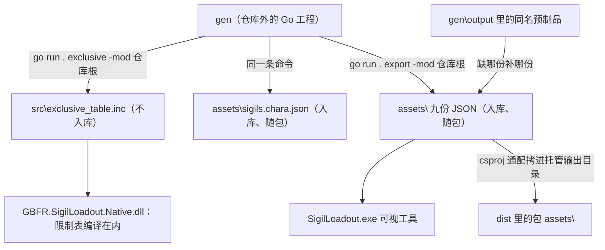

# 外部生成器 gen 与随包数据资产

这套 mod 的数据分三层落地，读方也正好是三个程序：**原生 DLL** 把角色专属限制表**编译进去**（运行期不读任何数据文件），**托管 mod（C#）**从游戏归档里取 `skill_status.tbl`（见 [skill_status 表与活表写入闸门](/openwiki/concepts/skill-status-table.md)），而**随包的九份 JSON 只有可视工具读**（外加仓库里的测试，见「测试也读同一批文件」）。这九份不是手写的：它们由**仓库外的共享生成器 `gen`** 产出。

关键前提先说清楚：**`gen` 不在本仓库里**（它在仓库旁的 `..\gen`，是个 Go 工程），本仓库里不放任何生成脚本——`tools\` 下只有 `build-release.ps1` 与 `deploy.ps1`，`docs\` 是空的。因此**本仓库无法单独完成一次发布构建**：唯一那份"专属表"的产物 `src\exclusive_table.inc` 在 `.gitignore` 里，任何克隆都不带它，只能由 `gen` 生成——而它又是原生 DLL 的编译输入（详见「对 gen 的硬依赖」）。

## 谁产出、谁消费



产物路径：gen（以及 `gen\output\` 里的同名预制品）→ `SigilLoadout\assets\` 九份 → 打包进 `dist`。

图中省略了目录：九份都住在源码树的 `SigilLoadout\assets\`（`gen\output\` 里放的是同名预制品），`exclusive_table.inc` 住在 `GBFR.SigilLoadout.Native\src\`。

## gen 的对外契约

只描述命令与产物，不涉及它内部怎么实现。**仓库里能观察到两条调用**，两条都在下面各自的机制里被引用：

| 调用 | 谁在什么时候调 | 产物 |
| --- | --- | --- |
| `go run . exclusive -mod <仓库根>` | 原生工程的 `GenerateExclusiveTable` 目标，在 `ClCompile` 之前（`WorkingDirectory` 是 `..\..\gen`）；MSBuild 判定过期时才真的跑 | `GBFR.SigilLoadout.Native\src\exclusive_table.inc`（不入库）**和** `SigilLoadout\assets\sigils.chara.json`（入库、随包） |
| `go run . export -mod <仓库根>` | 发布脚本的随包数据段，在九份里**有任意一份缺席、且 `gen\output\` 里没有同名预制品**时跑一次（工作目录 `..\gen`） | 补齐 `SigilLoadout\assets\` 九份里缺席的那些 |

`exclusive` 那条另有一层不可见的耦合：它产出的 `exclusive_table.inc` 会被 `template_loadout.cpp` include 进去，成为 `kCharacterExclusives`（每行 = 角色 hash + T1 / T2 / 战气 三个槽各自的 gem hash 与技能 hash）。原生侧**不另存一张"限制表"**：`RequiredCharacterForGem` 直接在这张已经编译进来的表里找某个 gem 属于谁。生成时已核对过它与 `sigils.json` 的 `player` 列一致——这条核对只发生在 `gen` 里，本仓库无从复核。

剩下七份资产（`sigils.lang.json`、`chara.lang.json`、`skill_status.json`、`skill.zh/en/ja/ko.json`）本仓库只消费、不生成：它们由 `gen` 的哪一步写出、数据源是什么，都看不到；本仓库对它们**没有任何内容新鲜度门禁**（连"与上游对拍"也没有），只有包内在场清单与 Go 测试里的交叉一致性。`gen` 内部还有哪些子命令、它的审阅数据长什么样，同样不在本仓库的视野里——仓库里今天已没有任何对审阅表（`*.xlsx`）或 `--check` 对拍的引用。

## 对 gen 的硬依赖

**一处：原生工程的 `GenerateExclusiveTable` 目标。**

```xml
<Target Name="GenerateExclusiveTable" BeforeTargets="ClCompile"
        Inputs="$(MSBuildProjectDirectory)\..\..\gen\main.go;$(MSBuildProjectDirectory)\..\..\gen\game\sigils\exclusive.go;$(MSBuildProjectDirectory)\..\..\gen\game\sigils\sigils.go;$(MSBuildProjectDirectory)\..\..\gen\game\sigils\json.go;$(MSBuildProjectDirectory)\..\SigilLoadout\assets\sigils.json"
        Outputs="$(MSBuildProjectDirectory)\src\exclusive_table.inc;$(MSBuildProjectDirectory)\..\SigilLoadout\assets\sigils.chara.json">
    <Exec Command="go run . exclusive -mod &quot;$(MSBuildProjectDirectory)\..&quot;" WorkingDirectory="$(MSBuildProjectDirectory)\..\..\gen" />
    <Touch Files="$(MSBuildProjectDirectory)\src\exclusive_table.inc;$(MSBuildProjectDirectory)\..\SigilLoadout\assets\sigils.chara.json" />
</Target>
```

要点有几处，任一条都不能按旧描述理解：

- **它由 `Inputs`/`Outputs` 判过期，不是"无条件跑"**。源文件（或 `assets\sigils.json`）比产物新时才会执行那条 `Exec`；都对得上时 MSBuild 直接跳过，`go run` 根本不发生。所以"编一次原生 DLL 就要有 Go 工具链"这句话只对**需要重生成**的那次成立。
- **但全新克隆一定属于"需要重生成"**：`src\exclusive_table.inc` 不在版本控制里（`.gitignore` 明确列出），克隆里没有它，Outputs 缺失 → 目标必跑 → 那条 `Exec` 的工作目录 `..\..\gen` 若不存在（或机器上没有 Go），**编译就此中断，只有 `go run` 的原始报错**。MSBuild 的 Inputs/Outputs 只能省掉一次多余的重跑，它没法让 `.inc` 凭空出现——这就是"本仓库无法单独完成一次发布构建"的根。
- **`assets\sigils.json` 被列进了 `Inputs`**：改这份入库的因子表，也会让目标判过期，于是顺手重生成 `.inc` 与 `sigils.chara.json`。Inputs 里不能写通配符（MSBuild 不展开），所以这份名单是逐条列死的，加 gen 源文件必须同时改这里。
- **末尾的 `Touch` 是配套的一步，不是装饰**：gen 在数据没变时不写文件，产物 mtime 于是永远落后于源，MSBuild 会一直判过期；`Touch` 只推两个产物的时间戳，不动内容。

**另一处：发布脚本的随包数据段**（fail-closed，且只在真的缺资产时才需要 gen 在场，见下节）。

## 构建期：资产补齐与必需文件清单

`tools\build-release.ps1` 与数据资产相关的动作只有**两处**，位置与时机都不同：

**一、随包数据段：逐份补齐（在找 MSBuild 之前）**

对九份名字逐个走同一条三步链：

1. `SigilLoadout\assets\<name>` 在场 → 跳过（**这是常态**：九份都入库，正常检出直接过）；
2. 否则看 `..\gen\output\<name>`：有同名预制品就**拷**进 `assets\`（`Copy-Item -Force`，只拷不比对）；
3. 否则才跑生成器：连 `..\gen\main.go` 都不在就抛出——「随包数据缺 `<name>`，而生成器不在（它不在本仓库里）：补进 `SigilLoadout\assets\`，或把 `gen\` 放回仓库旁」；`main.go` 在就在 `..\gen` 里跑 `go run . export -mod <仓库根>`，退出码非零即抛（"gen export failed; the packaged assets are still incomplete."），跑完那一份仍然没有也抛。报错会带上脚本算出的 `gen` 绝对路径（本页不写死本机路径）。

三件事值得写清楚：**它跑在版本号闸门之后、编译之前**；**它是"保证在场"，不是"内容比对"**——预制品和刚生成的那份在这道链里没有区别，陈旧与否无从判断；**它需要的是仓库旁的 `gen` 目录本身**，第 2 步连 Go 工具链都不需要，只有第 3 步才要。而 `gen` 与 `gen\output` 都在仓库外，所以这条捷径并不能让"只有本仓库的人"补出资产。

**二、必需发布文件清单（打包之后、压缩之前）**

包目录里必须逐个存在 `GBFR.SigilLoadout.dll`、`GBFR.SigilLoadout.Native.dll`、`SigilLoadout.exe`、`icon.png`，外加九份 `assets\sigils.json`、`assets\sigils.chara.json`、`assets\sigils.lang.json`、`assets\chara.lang.json`、`assets\skill_status.json`、`assets\skill.zh.json`、`assets\skill.en.json`、`assets\skill.ja.json`、`assets\skill.ko.json`，缺一份即失败。这份名单**故意独立**，不从源目录或 csproj 派生：派生出来的清单与源目录共享同一个真相，于是"忘了加"和"被误删"两种漏法它都查不到（脚本注释里记着实测：藏掉一份资产，派生版门禁的退出码仍是 0）。

（`GBFR.SigilLoadout.csproj` 那条注释仍把这道检查描述成"源目录 ⊆ 包目录"，实际脚本查的是上面这份手写名单——以脚本为准。）
包内那九份是 csproj 用通配从 `..\SigilLoadout\assets\*` 拷进托管输出目录、再由脚本把输出目录整体复制进包目录的，所以打包这一步同时就是随包发布。

**今天没有的两道（别按旧文档找）**

- **没有 `sigils.json` 与 `gen` 审阅表的一致性对拍**：脚本里既没有 `sigils-json` 调用，也没有任何 `--check`；`assets\sigils.json` 缺席时它走的是上面那条"补齐"链，而不是拒绝。
- **没有 `sigils.chara.json` 的入库对账**：脚本今天不调用 `git`（唯一一处提到 git 的是"bindings 是 git 忽略的生成产物"这条注释）。曾经那道 `git status --porcelain -- SigilLoadout/assets/sigils.chara.json` 收尾门禁已被删除。

也就是说：**发布脚本对九份资产只保证在场，完全不比对内容**；谁都不替谁发现漂移。

**顺序上还有一处容易被忽略的耦合**：资产补齐段跑在原生构建之前，而原生构建的目标一旦重跑就会重写入库的 `SigilLoadout\assets\sigils.chara.json`（它是那个 Target 的 Output）。包内那份来自托管输出目录，而托管输出是在原生构建**之后**由 csproj 的通配刷新的——所以随包的一定是最后一次产出的那份，但**没有任何一步去比对它是不是已经提交进仓库**。

门禁之外，入库资产之间的**交叉一致性**由测试在构建里守住（`go vet` 与 `go test ./...` 都是发布流程的一部分）：

- `sigils.lang.json` 每种语言的名字数必须等于 `sigils.json` 的行数、覆盖每一行，且日文不能是英文的拷贝；
- `chara.lang.json` 每种语言必须覆盖 `sigils.chara.json` 每一行的 `player` 码；
- `skill_status.json` 与四份 `skill.<lang>.json` 的 key 集合必须一致、互不缺失，且每个等级行都带满十个参槽。

**行数不在任何检查里。** 本仓库对 `sigils.chara.json` 只查"每行正好三对 gems"与语言覆盖，不查角色行数（曾经有过"正好 87 条"的门禁，已删）：mod 侧不再持有那个数字，角色→三个专属槽的映射由编译进原生 DLL 的 `kCharacterExclusives` 派生，托管侧只按技能 hash 转发；行数只有 `gen` 知道。

## 九份随包资产

目录只有一处：源码树里的 `SigilLoadout\assets\`，也就是打包后的 `<mod>\assets\`（见下节）。带语言维度的六份（`sigils.lang.json`、`chara.lang.json`、四份 `skill.<lang>.json`）的语言集合都是 `zh`、`en`、`ja`、`ko`，不认得的语言在 Go 侧一律回落 `zh`。

「谁生成」一列要这么读：所有九份都源自 `gen`，但只有 `sigils.chara.json` 的产出命令是仓库里看得见的；其余八份本仓库只知道"缺席时脚本会用 `gen\output\` 的预制品或 `go run . export` 补"，具体由 gen 哪一步写出、数据源是什么，看不到。

| 资产 | 谁生成 | 谁读、什么时候读 | 是否入库 | 缺了/漂移的后果 |
| --- | --- | --- | --- | --- |
| `sigils.json` | `gen`（命令不可见；缺席时脚本用 `gen\output\` 预制品或 `export` 补） | 只有可视工具：Go 的 `LoadSigils()` 原样返回字符串，前端 `parseSigilRows` 再分出物品行与技能行（Go 与前端测试也把这一份当夹具读） | 入库、随包 | 缺：工具起不到因子表（factor 页报错）；名字/等级上限/合法副技能全都推不出来。行里**不带名字**（名字在 `sigils.lang.json`，测试会拒绝行内出现 `name`/`zh`） |
| `sigils.chara.json` | `go run . exclusive -mod <仓库根>`——它同时也是原生工程那个 Target 的 Output，会随构建被重写 | 只有可视工具：`LoadExclusives()` → 前端 `parseExclusiveTable`。名字表以 `gems[0]`（因子物品 hash）为键，写给游戏的开关状态键是 `gems[1]`（技能 hash）；**原生 DLL 不读这个文件**（限制表编译在 `exclusive_table.inc` 里），C# 侧只转发技能 hash | 入库、随包，但可能被构建改写且**无人对账** | 缺：专属因子页报错，mod 本体照常工作。形状不完整的行被前端整条丢掉（不是数组才抛错）；行数与"三对 gems"以外的一切无人检查 |
| `sigils.lang.json` | `gen`（命令不可见，同 `sigils.json`） | 工具启动期 `loadAssets()` → `GemNames(lang)`，一次装进内存 | 入库、随包 | 缺：`main()` 里当场 `fatalDialog`，工具根本起不来。少条目：名字回落成裸 hash；行数不等或日文等于英文：Go 测试失败 |
| `chara.lang.json` | `gen`（命令不可见） | 工具启动期 → `CharaNames(lang)`（键就是 `sigils.chara.json` 的 `player`，文件里还带着 `NP*` 那样的非角色码） | 入库、随包 | 缺：启动 fatal。少条目：专属页整行标签退化成 PL 码 |
| `skill_status.json` | `gen`（命令不可见） | 工具启动期 → `SkillTable()`，喂因子编辑页显示的起始数值与参槽含义 | 入库、随包 | 缺：启动 fatal。漂移：编辑页显示的起始数字与游戏原表对不上（真正被改写的是 C# 从归档读的原表） |
| `skill.zh.json`<br>`skill.en.json`<br>`skill.ja.json`<br>`skill.ko.json` | `gen`（命令不可见；四份是一批） | 工具启动期，**四份无条件全部读进来** → `SkillMap(lang)` | 入库、随包 | 缺**任何一份**（哪怕只用中文）：启动 fatal。漂移（少一个 key）：该语言的 tooltip 变空；Go 测试会拒 |

两份表的读法还各有契约：`sigils.json` 的行带 `key`、`hash`、`skill1`、`mix`、`category`、`player`、`onlyone`、`cap`、`lot`，物品行与技能行靠 `hash`／`skill1` 的关系区分（物品行 `hash != skill1`，非物品技能行 `hash == skill1`）；前端 `skillTableOf` 取每个 `skill1` 的首行、跳过 `player` 非空的专属行来构造技能字典，`itemRowsOf` 只收物品行作为主因子的可选项。`skill_status.json` 只收**真正带数字的等级**（大多数等级行全零，指向零行的编辑在游戏那里根本不会被读）。

`[等级, 值]` 这种元组是**线格式合同**：`skill_status.json` 的 `rows` 与 `skill.<lang>.json` 的 `explain` 都写成二元组，Go 侧解码后必须原样编码回去。丢了这个编码，Go 测试与前端 `tsc` 都会全绿，而用户看到的只是空 tooltip 与 0 占位——所以有一条按字节钉住它的测试。

## 只有一份布局：源码树 = 包

这九份**一份都不嵌进 `SigilLoadout.exe`**（`go:embed` 只嵌 `frontend/dist`、`icon.png`、`icon.ico`）：嵌了就成了第二套加载机制，换一份数据还得重编工具。工具读的是**相对 exe 目录**的 `assets\`：

- `loadoutservice.go` 里 `assetsDir = "assets"`，路径由 `exeDir()\assets\` 拼出；**没有「开发副本」**，源码树里跑和跑打包出来的那份用的是同一个布局（测试要读源码树那一份时，靠的是 `loadAssetsFrom(dir)` 那个目录参数）；
- `GBFR.SigilLoadout.csproj` 用通配把 `..\SigilLoadout\assets\*` 拷成输出目录的 `assets\%(Filename)%(Extension)`（`PreserveNewest`）——用通配而不是逐份列，是因为「有没有全进包」另由上面那份独立清单门禁查；
- 打包用的就是托管工程的输出目录，所以这一步同时就是随包发布；
- 发布脚本还会主动删掉旧的开发副本（`SigilLoadout\sigils.json`、`SigilLoadout\sigils.chara.json`），那段「同步开发副本」的步骤已经不存在了。

读的时机刻意分两类：只有启动期用得着的七份一次装进内存；`sigils.json` 与 `sigils.chara.json` **每次调用重读**——玩家可能替换它们，要拿每次调用时最新的那份。

### 测试也读同一批文件

九份资产的读者不止可视工具，测试直接读源码树里那一份：

- Go 测试进程由 `assets_test.go` 的 `TestMain` 调 `loadAssetsFrom("assets")` 把它们装进来一次——生产路径是 `exeDir()\assets\`，而 `go test` 进程的 `exeDir()` 是临时目录，所以 `readAssetMap` / `loadAssetsFrom` 都带一个目录参数当缝；同一处还把整个测试进程的 `LOCALAPPDATA` 指到临时目录；
- `loadoutservice_test.go` 与前端 `index.test.ts` 又直接按相对路径读入库的 `assets\sigils.json` / `assets\sigils.chara.json`，把**真实的**表当夹具（夹具会和 App 的构造各自漂移，表是唯一的真相）。

所以「资产形状变了」这件事在本地就能被 `go test ./...` / `npm test` 看见，而不必等到装上工具。

## 改数据时的操作面

- **改因子表**：在 `gen` 里改它的数据源、重出，再把新的一份落回 `SigilLoadout\assets\sigils.json` 并提交。构建**不会**替你核对它与 `gen` 是否一致（对拍那道门禁已不存在），它只在缺席时才去 `gen` 补一份；同时因为 `assets\sigils.json` 被列进 vcxproj 的 `Inputs`，下一次编原生会连带重生成 `exclusive_table.inc` 与 `sigils.chara.json`。
- **改了 `gen` 的专属数据源**：下一次编译原生（目标判过期那次）会重写入库的 `assets\sigils.chara.json`。**没有任何门禁会提醒你把它提交**——发布前自己 `git status` 看一眼；随包发出去的就是工作区里那份。
- **只改了原生代码**：`exclusive_table.inc` 可能被重生成，但它是 `.gitignore` 里的中间产物，提交与否都不影响任何门禁。
- **改了那七份「只消费」的资产**：没有任何门禁会告诉你它们与 `gen` 里的数据源对不上；能挡住的只有包内在场清单与测试的交叉一致性。
- **没有 `gen`**：全新克隆编不出原生 DLL（`.inc` 不是仓库内容，而它是编译输入），发布构建也会在缺资产时停下并说明 gen 不在仓库旁。反过来，`gen` 跑过一次之后，`.inc` 与九份都在场，MSBuild 会跳过那次 `Exec`——`Inputs`/`Outputs` 只是省掉一次不必要的重跑，**不是**把这个依赖变成可选。

相关页面：[构建与发布](/openwiki/operations/build-and-release.md)、[可视工具](/openwiki/architecture/visual-tool.md)、[虚拟槽位与专属因子](/openwiki/concepts/virtual-slots-and-exclusives.md)、[验证地图](/openwiki/testing/verification-map.md)。
