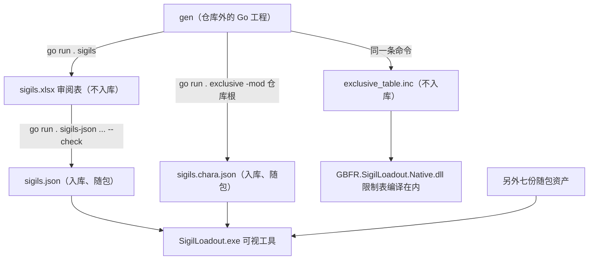

# 外部生成器 gen 与随包数据资产

这套 mod 的数据分三层落地，读方也正好是三个程序：**原生 DLL** 把角色专属限制表**编译进去**（运行期不读任何数据文件），**托管 mod（C#）**从游戏归档里取 `skill_status.tbl`（见 [skill_status 表与活表写入闸门](/openwiki/concepts/skill-status-table.md)），而**随包的九份 JSON 只有可视工具读**。这九份不是手写的：它们由**仓库外的共享生成器 `gen`** 产出，而 `gen` 同一个命令的另一样产物（原生侧的 `exclusive_table.inc`）又刻意**不入库**。本页讲的就是这条产线、它的产物契约、以及构建期拦住漂移的两道门禁。

关键前提先说清楚：**`gen` 不在本仓库里**（它在仓库旁的 `..\gen`，是个 Go 工程），本仓库不再放任何生成脚本。因此**本仓库无法单独完成一次发布构建**，甚至单独编译原生 DLL 也不行——原因见「对 gen 的硬依赖」。

## 谁产出、谁消费



图中省略了目录：`sigils.xlsx` 住在 `gen\output\`，`sigils.json` / `sigils.chara.json` / 另外七份住在 `SigilLoadout\assets\`，`exclusive_table.inc` 住在 `GBFR.SigilLoadout.Native\src\`。

## gen 的对外契约

只描述命令与产物，不涉及它内部怎么实现。仓库里能观察到的调用点有三处：

| 调用 | 谁在什么时候调 | 产物 |
| --- | --- | --- |
| `go run . sigils` | 人手工跑（门禁失败信息里也会指这句） | 审阅表 `gen\output\sigils.xlsx`（与 `texts.xlsx` 同待遇：生成物，住在 `gen\output\`，**不入任何仓库**） |
| `go run . sigils-json <xlsx> <json> [--check]` | 构建期由 `tools\build-release.ps1` 调用（带 `--check`）；人写回入库那份时手工调用 | 从审阅表写出 `SigilLoadout\assets\sigils.json`；`--check` 只对拍不写 |
| `go run . exclusive -mod <仓库根>` | **每次编译原生工程前**由 vcxproj 的 `GenerateExclusiveTable` 目标调用（`BeforeTargets="ClCompile"`，`WorkingDirectory` 是 `..\..\gen`） | `GBFR.SigilLoadout.Native\src\exclusive_table.inc`（不入库）**和** `SigilLoadout\assets\sigils.chara.json`（入库、随包） |

第二条命令的两个参数就是"审阅表 → 入库表"的方向：构建里跑的是同一个命令加 `--check`，所以门禁比的就是**入库的那份与审阅表是否一致**，不需要游戏数据在场。

其余七份资产（`sigils.lang.json`、`chara.lang.json`、`skill_status.json`、`skill.zh/en/ja/ko.json`）本仓库只消费、不生成：它们的产出方式由 `gen` 决定，本仓库对它们**没有内容新鲜度门禁**，只有下面说的那份"在场清单"门禁和 Go 测试里的交叉一致性。

## 对 gen 的硬依赖

`GBFR.SigilLoadout.Native.vcxproj` 里的 `GenerateExclusiveTable` 目标**没有 `Condition`**，`BeforeTargets="ClCompile"`：只要编译清单里那一堆 `.cpp` 需要被编译，MSBuild 就会先 `go run . exclusive` 一次。所以**原生 DLL 的编译本身就依赖 `..\gen` 在场 + 机器上有 Go 工具链**，缺任何一个都会在编译阶段失败。

发布构建把失败原因写在了闸门里，而不是让 `go run` 抛一句难懂的错：

- `..\gen\output\sigils.xlsx` 不在 → 抛出并提示先 `cd gen && go run . sigils`，**不得跳过一致性检查**；
- `..\gen\main.go` 不在 → 抛出并明说"共享生成器不在 `..\gen`（它不在本仓库里）……所以本仓库无法单独完成一次发布构建：把 `gen\` 放回仓库旁，或在有它的机器上构建"。

反过来说：`gen` 在不在、`gen` 里有什么，是本仓库无从校验的上游——这也解释了为什么下面那道"内容对拍"门禁只比对本仓库入库的那一份。

## 构建期：两道数据门禁（外加一道清单门禁）

`tools\build-release.ps1` 里与数据资产相关的检查有三处，位置和时机都不同：

**一、`sigils.json` 新鲜度门禁（任何编译之前）**

```
go run . sigils-json <仓库外>\gen\output\sigils.xlsx SigilLoadout\assets\sigils.json --check
```

不一致就是"忘了跑生成器"——构建**不自动生成数据**（免得每次发布都重新产出数据源），只拒绝。它只比对本仓库里入库的那一份，不需要游戏数据在场；同一段代码顺带检查了那张审阅表与 `gen\main.go` 是否存在（见上节）。

**二、`sigils.chara.json` 收尾门禁（打包之前）**

这是本页最重要的区分所在：`exclusive_table.inc` 不入库（`.gitignore` 里明确列了它），是构建中间产物，"生成物是否过期"这个问题对它没有意义——每次编译前都重生成。但**同一条命令还重写了入库的 `SigilLoadout\assets\sigils.chara.json`**。改写本身不是错误（说明 `gen` 里的数据源变了），但那份差异**必须进仓库**，否则随包发布出去的就是一份没人提交过的数据。

所以构建末尾、打包之前查一次：

```
git status --porcelain -- SigilLoadout/assets/sigils.chara.json
```

有输出即失败，报错会要求"把它一起提交，或撤销 `gen` 的 `sigils/exclusive.go` 里引起改写的改动"。只查这一个路径，不把开发中的其它改动算进来。检出里**没有 `.git`**（例如解压出来的源码包）时，会明说"跳过（这里‘未提交’没有意义）"——**不假装跑过**。

**三、九份资产的在场清单门禁**

打包完成后逐个检查包内必须有 `assets\sigils.json`、`assets\sigils.chara.json`、`assets\sigils.lang.json`、`assets\chara.lang.json`、`assets\skill_status.json`、`assets\skill.zh.json`、`assets\skill.en.json`、`assets\skill.ja.json`、`assets\skill.ko.json`（外加四个 exe/dll/图标文件）。这份名单**故意独立**，不从源目录或 csproj 派生：派生出来的清单与源目录共享同一个真相，于是"忘了加"和"被误删"两种漏法它都查不到（实测过：藏掉一份资产，派生版门禁退出码仍是 0）。漏一份就等于发一个启动即报错的工具。

历史的门禁只剩一半：以前还有一道"character 行必须正好 87 条"，已删——mod 侧不再持有那个数字，而 `gen` 产出的角色行数本仓库无从校验。

门禁之外，入库资产之间的**交叉一致性**由 Go 测试在构建里守住（`go test ./...` 是发布流程的一部分）：

- `sigils.lang.json` 每种语言的名字数必须等于 `sigils.json` 的行数、覆盖每一行，且日文不能是英文的拷贝；
- `chara.lang.json` 每种语言必须覆盖 `sigils.chara.json` 每一行的 `player` 码；
- `skill_status.json` 与四份 `skill.<lang>.json` 的 key 集合必须一致、互不缺失，且每个等级行都带满十个参槽。

## 九份随包资产

目录只有一处：源码树里的 `SigilLoadout\assets\`，也就是打包后的 `<mod>\assets\`（见下节）。除特别说明外，八个语言/文案字段的源语言集合都是 `zh`、`en`、`ja`、`ko`，不认得的语言在 Go 侧一律回落 `zh`。

| 资产 | 内容形状 | 读者 | 读的时机 | 缺失/漂移的后果 |
| --- | --- | --- | --- | --- |
| `sigils.json` | `{"sigils":[…]}`，行有 `key`、`hash`、`skill1`、`skill2`、`mix`、`category`、`player`、`onlyone`、`cap`、`lot`；**物品行 `hash != skill1`、非物品技能行 `hash == skill1`**。行里**不带名字**（名字在 `sigils.lang.json`，测试会拒绝行内出现 `name`/`zh`） | 只有可视工具：Go 的 `LoadSigils()` 原样返回字符串，前端 `parseSigilRows` 再分出物品行与技能行 | 按需：每次调用重读磁盘（工具挂载时读一次） | 缺：工具起不到因子表（factor 页报错）；名字/等级上限/合法副技能全都推不出来。行数与名字表不一致：Go 测试在构建里失败 |
| `sigils.chara.json` | 数组，每行 `{hash, player, gems}`；`gems` 是**正好三对** `[因子物品 hash, 技能 hash]`，顺序即 T1 / T2 / 战气 | 只有可视工具：`LoadExclusives()` → 前端 `parseExclusiveTable`。名字表以 `gems[0]`（因子物品 hash）为键，写给游戏的开关状态键是 `gems[1]`（技能 hash）；**原生 DLL 不读这个文件**（限制表编译在 `exclusive_table.inc` 里），C# 侧只转发技能 hash | 按需：每次调用重读磁盘。同时它又是 `go run . exclusive` 的产物，每次编译原生前被重写 | 缺：专属因子页报错，mod 本体照常工作。形状不完整的行被前端整条丢掉（不是数组才抛错）。漂移（构建重写后没提交）：收尾门禁在打包前拒绝发布 |
| `sigils.lang.json` | `{语言: {因子/技能 hash: 显示名}}` | 工具启动期 `loadAssets()` → `GemNames(lang)` | 启动期一次性装进内存 | 缺：`main()` 里当场 `fatalDialog`，工具根本起不来。少条目：名字回落成裸 hash；行数不等或日文等于英文：Go 测试失败 |
| `chara.lang.json` | `{语言: {PL 码: 角色名}}`（键就是 `sigils.chara.json` 的 `player`） | 工具启动期 → `CharaNames(lang)` | 启动期 | 缺：启动 fatal。少条目：专属页整行标签退化成 PL 码 |
| `skill_status.json` | `{技能 hash: {"key": 游戏短 id, "rows": [[等级, [10 个数值]]]}}`；**只收真正带数字的等级**（大多数等级行全零，指向零行的编辑游戏在那里根本不读） | 工具启动期 → `SkillTable()`，喂因子编辑页显示的起始数值与参槽含义 | 启动期 | 缺：启动 fatal。漂移：编辑页显示的起始数字与游戏原表对不上（真正被改写的是 C# 从归档读的原表） |
| `skill.zh.json`<br>`skill.en.json`<br>`skill.ja.json`<br>`skill.ko.json` | `{技能 hash: {"name", "summary", "explain": [[等级, 文案]]}}`；文案里的 `{N}` 指第 N+1 个参槽（`LevelValue(N+1)`） | 工具启动期，**四份无条件全部读进来** → `SkillMap(lang)` | 启动期 | 缺**任何一份**（哪怕只用中文）：启动 fatal。漂移（少一个 key）：该语言的 tooltip 变空；Go 测试会拒 |

`[等级, 值]` 这种元组是**线格式合同**：`skill_status.json` 的 `rows` 与 `skill.<lang>.json` 的 `explain` 都写成二元组，Go 侧解码后必须原样编码回去。丢了这个编码，Go 测试与前端 `tsc` 都会全绿，而用户看到的只是空 tooltip 与 0 占位——所以有一条按字节钉住它的测试。

## 只有一份布局：源码树 = 包

这九份**一份都不嵌进 `SigilLoadout.exe`**（`go:embed` 只嵌 `frontend/dist`、`icon.png`、`icon.ico`）：嵌了就成了第二套加载机制，换一份数据还得重编工具。工具读的是**相对 exe 目录**的 `assets\`：

- `loadoutservice.go` 里 `assetsDir = "assets"`，路径由 `exeDir()\assets\` 拼出；**没有"开发副本"**，源码树里跑和跑打包出来的那份用的是同一个布局；
- `GBFR.SigilLoadout.csproj` 用通配把 `..\SigilLoadout\assets\*` 拷成输出目录的 `assets\%(Filename)%(Extension)`（`PreserveNewest`）——用通配而不是逐份列，是因为"有没有全进包"另由上面那份独立清单门禁查；
- 打包用的就是托管工程的输出目录，所以这一步同时就是随包发布；
- 发布脚本还会主动删掉旧的开发副本（`SigilLoadout\sigils.json`、`SigilLoadout\sigils.chara.json`），那段"同步开发副本"的步骤已经不存在了。

读的时机刻意分两类：只有启动期用得着的七份一次装进内存；`sigils.json` 与 `sigils.chara.json` **每次调用重读**——玩家可能替换它们，要拿每次调用时最新的那份。

## 改数据时的操作面

- **改因子表**：先在 `gen` 里重出审阅表（`go run . sigils`），改它，再用 `go run . sigils-json <xlsx> <仓库>\SigilLoadout\assets\sigils.json` 写回入库那份。构建不替你生成，只拿 `--check` 对拍。
- **改了 `gen` 的专属数据源**：下一次编译原生时会重写 `assets\sigils.chara.json`。把那份改动**一起提交**，否则收尾门禁在打包前拒发。
- **只改了原生代码**：`exclusive_table.inc` 会重生成，但它是 `.gitignore` 里的中间产物，提交与否都不影响门禁。
- **没有 `gen`**：原生 DLL 编不出来（vcxproj 的 `BeforeTargets` 目标无条件跑），发布构建也会在最早的两道检查里停下来并说明原因。

相关页面：[构建与发布](/openwiki/operations/build-and-release.md)、[可视工具](/openwiki/architecture/visual-tool.md)、[虚拟槽位与专属因子](/openwiki/concepts/virtual-slots-and-exclusives.md)、[验证地图](/openwiki/testing/verification-map.md)。
