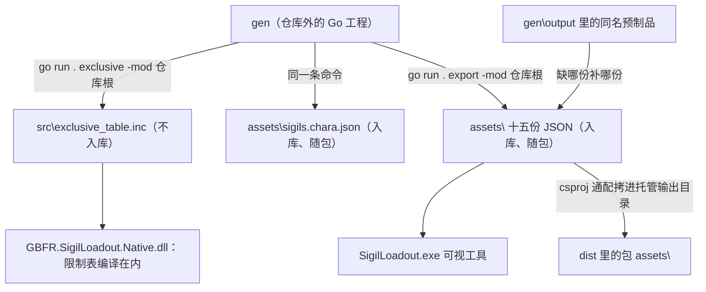

# 外部生成器 gen 与随包数据资产

这套 mod 的数据分三层落地，读方也正好是三个程序：**原生 DLL** 把角色专属限制表**编译进去**（运行期不读任何数据文件），**托管 mod（C#）**从游戏归档里取 `skill_status.tbl` 与 `limit_bonus_param` 活表（见 [skill_status 表与活表写入闸门](/openwiki/concepts/skill-status-table.md)、[limit_bonus_param 活表与能力强化数值](/openwiki/concepts/limit-bonus-table.md)），而**随包的十五份 JSON 只有可视工具读**（外加仓库里的测试，见「测试也读同一批文件」）。这十五份不是手写的：它们由**仓库外的共享生成器 `gen`** 产出。

关键前提先说清楚，两条都要先接受：

- **`gen` 不在本仓库里**（它在仓库旁的 `..\gen`，是个 Go 工程）。本仓库里不放任何生成脚本——`tools\` 下只有 `build-release.ps1` 与 `deploy.ps1`。于是**本仓库无法单独完成一次发布构建**：唯一那份「专属表」的产物 `src\exclusive_table.inc` 在 `.gitignore` 里，任何克隆都不带它，只能由 `gen` 生成——而它又是原生 DLL 的编译输入（详见「对 gen 的硬依赖」）。注意这一条**不是**指资产：十五份 JSON 都入库，README 的构建前提因此写着「`assets/` 数据已入库，无需额外生成」——它说的是资产，`.inc` 不在其中。
- **「资产与 gen 里的真相一致」这件事，本仓库没有任何机械证据。** 发布脚本对十五份只保证「在场」（缺了就补、不比对内容），打包后只查一份手写名单，Go 测试只证明入库的这几份**彼此**自洽（外加第 2 节那道语言清单对拍）。谁都不比对它们与生成器里的上游数据源。所以「构建会校验随包数据」是错的理解：它会拦住「少一份」，拦不住「内容陈旧或漂移」。

## 谁产出、谁消费


```mermaid
flowchart TD
    GEN["gen（仓库外的 Go 工程）"]
    PRE["gen\output 里的同名预制品"]
    GEN -- "go run . exclusive -mod 仓库根" --> INC["src\exclusive_table.inc（不入库）"]
    GEN -- "同一条命令" --> CJ["assets\sigils.chara.json（入库、随包）"]
    GEN -- "go run . export -mod 仓库根" --> SHIPPED["assets\ 十五份 JSON（入库、随包）"]
    PRE -- "缺哪份补哪份" --> SHIPPED
    INC --> DLL["GBFR.SigilLoadout.Native.dll：限制表编译在内"]
    SHIPPED --> TOOL["SigilLoadout.exe 可视工具"]
    SHIPPED -- "csproj 通配拷进托管输出目录" --> DIST["dist 里的包 assets\"]
```

这张图显示 gen（及其 `gen\output\` 预制品）与三类消费者之间的关系：`.inc` 只喂原生编译，十五份 JSON 只喂可视工具并原样进包。

产物路径：gen（以及 `gen\output\` 里的同名预制品）→ `SigilLoadout\assets\` 十五份 → 打包进 `dist`。

图中省略了目录：十五份都住在源码树的 `SigilLoadout\assets\`（`gen\output\` 里放的是同名预制品），`exclusive_table.inc` 住在 `GBFR.SigilLoadout.Native\src\`。

## gen 的对外契约

只描述命令与产物，不涉及它内部怎么实现。**仓库里能观察到两条调用**，两条都在下面各自的机制里被引用：

| 调用 | 谁在什么时候调 | 产物 |
| --- | --- | --- |
| `go run . exclusive -mod <仓库根>` | 原生工程的 `GenerateExclusiveTable` 目标，在 `ClCompile` 之前（`WorkingDirectory` 是 `..\..\gen`）；MSBuild 判定过期时才真的跑 | `GBFR.SigilLoadout.Native\src\exclusive_table.inc`（不入库）**和** `SigilLoadout\assets\sigils.chara.json`（入库、随包） |
| `go run . export -mod <仓库根>` | 发布脚本的随包数据段，在十五份里**有任意一份缺席、且 `gen\output\` 里没有同名预制品**时跑一次（工作目录 `..\gen`） | 补齐 `SigilLoadout\assets\` 十五份里缺席的那些 |

`exclusive` 那条另有一层不可见的耦合：它产出的 `exclusive_table.inc` 会被 `template_loadout.cpp` include 进去，成为 `kCharacterExclusives`（每行 = 角色 hash + T1 / T2 / 战气 三个槽各自的 gem hash 与技能 hash）。原生侧**不另存一张「限制表」**：`RequiredCharacterForGem` 直接在这张已经编译进来的表里找某个 gem 属于谁。生成时已核对过它与 `sigils.json` 的 `player` 列一致——这条核对只发生在 `gen` 里，本仓库无从复核。

剩下十四份资产（`sigils.json`、`sigils.lang.json`、`chara.lang.json`、`chara.json`、`skill_status.json`、四份 `skill.<lang>.json`、`limit_bonus.json`、四份 `limit_bonus.<lang>.json`）本仓库只消费、不生成：它们由 `gen` 的哪一步写出、数据源是什么，都看不到；本仓库对它们**没有任何内容新鲜度门禁**（连「与上游对拍」也没有），只有包内在场清单、启动期的语言清单对拍与 Go 测试里的交叉一致性。`gen` 内部还有哪些子命令、它的审阅数据长什么样，同样不在本仓库的视野里——仓库里今天已没有任何对审阅表（`*.xlsx`）或 `--check` 对拍的引用。

## 对 gen 的硬依赖

**一处：原生工程的 `GenerateExclusiveTable` 目标。**

```xml
<Target Name="GenerateExclusiveTable" BeforeTargets="ClCompile"
        Inputs="$(MSBuildProjectDirectory)\..\..\gen\main.go;$(MSBuildProjectDirectory)\..\..\gen\game\sigils\exclusive.go;$(MSBuildProjectDirectory)\..\..\gen\game\sigils\sigils.go;$(MSBuildProjectDirectory)\..\..\gen\game\sigils\json.go;$(MSBuildProjectDirectory)\..\SigilLoadout\assets\sigils.json"
        Outputs="$(MSBuildProjectDirectory)\src\exclusive_table.inc;$(MSBuildProjectDirectory)\..\SigilLoadout\assets\sigils.chara.json">
    <Exec Command="go run . exclusive -mod &quot;$(MSBuildProjectDirectory)\..&quot;" WorkingDirectory="$(MSBuildProjectDirectory)\..\..\gen" />
    <Touch Files="$(MSBuildProjectDirectory)\src\exclusive_table.inc;$(MSBuildProjectDirectory)\..\SigilLoadout\assets\sigils.chara.json" />
</Target>
```

要点有几处，任一条都不能按旧描述理解：

- **它由 `Inputs`/`Outputs` 判过期，不是「无条件跑」**。源文件（或 `assets\sigils.json`）比产物新时才会执行那条 `Exec`；都对得上时 MSBuild 直接跳过，`go run` 根本不发生。所以「编一次原生 DLL 就要有 Go 工具链」这句话只对**需要重生成**的那次成立。
- **但全新克隆一定属于「需要重生成」**：`src\exclusive_table.inc` 不在版本控制里（`.gitignore` 明确列出），克隆里没有它，Outputs 缺失 → 目标必跑 → 那条 `Exec` 的工作目录 `..\..\gen` 若不存在（或机器上没有 Go），**编译就此中断**。这一段**没有任何友好包装**：能看到的就是 MSBuild 对 `Exec` 的退出码报错与/或 `go run` 的原始输出；即便退回到「MSBuild 跳过了生成、或拿到了空产物」，编译也会停在 `template_loadout.cpp` 的 `#include "exclusive_table.inc"` 上（"cannot open include file"）。发布脚本那侧也不会补充因果解释，只把整步报成 `Native build failed with exit code <N>.`。MSBuild 的 Inputs/Outputs 只能省掉一次多余的重跑，它没法让 `.inc` 凭空出现——这就是「本仓库无法单独完成一次发布构建」的根。
- **`assets\sigils.json` 被列进了 `Inputs`**：改这份入库的因子表，也会让目标判过期，于是顺手重生成 `.inc` 与 `sigils.chara.json`。Inputs 里不能写通配符（MSBuild 不展开），所以这份名单是逐条列死的，加 gen 源文件必须同时改这里。
- **末尾的 `Touch` 是配套的一步，不是装饰**：gen 在数据没变时不写文件，产物 mtime 于是永远落后于源，MSBuild 会一直判过期；`Touch` 只推两个产物的时间戳，不动内容。

**另一处：发布脚本的随包数据段**（fail-closed，且只在真的缺资产时才需要 gen 在场，见下节）。它的三条出口各有一句原样报错：

| 触发条件 | 原样抛出的信息 |
| --- | --- |
| 缺某一份、`gen\output\` 里也没有、`..\gen\main.go` 不在 | `随包数据缺 ${name}，而生成器不在 $genDir（它不在本仓库里）：补进 SigilLoadout\assets\，或把 gen\ 放回仓库旁。`（`$genDir` 是脚本算出的绝对路径，本页不写死本机路径） |
| `gen export` 退出码非零 | `gen export failed; the packaged assets are still incomplete.` |
| `gen export` 跑完那一份仍然没有 | `gen export 之后仍然没有 assets\${name}。` |

## 构建期：资产补齐与必需文件清单

`tools\build-release.ps1` 与数据资产相关的动作只有**两处**，位置与时机都不同：

**一、随包数据段：逐份补齐（在找 MSBuild 之前）**

脚本里有一份写死的十五个名字的清单，逐个走同一条三步链：

1. `SigilLoadout\assets\<name>` 在场 → 跳过（**这是常态**：十五份都入库，正常检出直接过）；
2. 否则看 `..\gen\output\<name>`：有同名预制品就**拷**进 `assets\`（`Copy-Item -Force`，只拷不比对）；
3. 否则才跑生成器：连 `..\gen\main.go` 都不在就抛出（上表第一行那句）；`main.go` 在就在 `..\gen` 里跑 `go run . export -mod <仓库根>`，退出码非零即抛，跑完那一份仍然没有也抛。

三件事值得写清楚：**它跑在版本号闸门之后、编译之前**；**它是「保证在场」，不是「内容比对」**——预制品和刚生成的那份在这道链里没有区别，陈旧与否无从判断；**它需要的是仓库旁的 `gen` 目录本身**，第 2 步连 Go 工具链都不需要，只有第 3 步才要。而 `gen` 与 `gen\output` 都在仓库外，所以这条捷径并不能让「只有本仓库的人」补出资产。

**二、必需发布文件清单（打包之后、压缩之前）**

包目录里必须逐个存在四个非资产文件——`GBFR.SigilLoadout.dll`、`GBFR.SigilLoadout.Native.dll`、`SigilLoadout.exe`、`icon.png`——外加 `assets\` 下**十五份**：`sigils.json`、`sigils.chara.json`、`sigils.lang.json`、`chara.lang.json`、`skill_status.json`、`skill.zh.json`、`skill.en.json`、`skill.ja.json`、`skill.ko.json`、`limit_bonus.json`、`limit_bonus.zh.json`、`limit_bonus.en.json`、`limit_bonus.ja.json`、`limit_bonus.ko.json`、`chara.json`。缺一份即以 `Required release file was not packaged: <路径>` 失败。这份名单**故意独立**，不从源目录或 csproj 派生：派生出来的清单与源目录共享同一个真相，于是「忘了加」和「被误删」两种漏法它都查不到（脚本注释里记着实测：藏掉一份资产，派生版门禁的退出码仍是 0）。

（`GBFR.SigilLoadout.csproj` 那条注释仍把这道检查描述成「源目录 ⊆ 包目录」，实际脚本查的是上面这份手写名单——以脚本为准。）
包内那十五份是 csproj 用通配从 `..\SigilLoadout\assets\*` 拷进托管输出目录、再由脚本把输出目录整体复制进包目录的，所以打包这一步同时就是随包发布。

**今天没有的两道（别按旧文档找）**

- **没有 `sigils.json` 与 `gen` 审阅表的一致性对拍**：脚本里既没有 `sigils-json` 调用，也没有任何 `--check`；`assets\sigils.json` 缺席时它走的是上面那条「补齐」链，而不是拒绝。
- **没有 `sigils.chara.json` 的入库对账**：脚本今天不调用 `git`（唯一一处提到 git 的是「bindings 是 git 忽略的生成产物」这条注释）。曾经那道 `git status --porcelain -- SigilLoadout/assets/sigils.chara.json` 收尾门禁已被删除。

也就是说：**发布脚本对十五份资产只保证在场，完全不比对内容**；谁都不替谁发现漂移。这一条是本页最容易被误读的地方——构建全绿不等于随包数据与 `gen` 一致。

**顺序上还有一处容易被忽略的耦合**：资产补齐段跑在原生构建之前，而原生构建的目标一旦重跑就会重写入库的 `SigilLoadout\assets\sigils.chara.json`（它是那个 Target 的 Output）。包内那份来自托管输出目录，而托管输出是在原生构建**之后**由 csproj 的通配刷新的——所以随包的一定是最后一次产出的那份，但**没有任何一步去比对它是不是已经提交进仓库**。

门禁之外，入库资产之间的**交叉一致性**由测试在构建里守住（`go vet` 与 `go test` 都是发布流程的一部分），见「交叉一致性由谁守」。

## 十五份随包资产

目录只有一处：源码树里的 `SigilLoadout\assets\`，也就是打包后的 `<mod>\assets\`（见下节）。下表的「产出者」一列要这么读：十五份都源自 `gen`，但只有 `sigils.chara.json` 的产出命令是仓库里看得见的；其余十四份本仓库只知道「缺席时脚本会用 `gen\output\` 的预制品或 `go run . export` 补」，具体由 gen 哪一步写出、数据源是什么，看不到。

| 文件 | 产出者 | 消费者（调用点） | 读的时点 | 缺失或漂移时的表现 |
| --- | --- | --- | --- | --- |
| `sigils.json` | `gen`（命令不可见；缺席时脚本用 `gen\output\` 预制品或 `export` 补） | 只有可视工具：`LoadoutService.LoadSigils()` 原样返回字符串 → 前端 `parseSigilRows` 分出物品行与技能行 → `skillTableOf` / `itemRowsOf`（Go 测试与前端 `index.test.ts` 也把这一份当夹具读） | **按需**：每次调用重读 | 缺：因子页整页报错（`App.tsx` 的 failure kind `sigil`），可选项、名字、等级上限、合法副技能全都推不出来。内容漂移：无人察觉。行里**不带名字**（名字在 `sigils.lang.json`，测试会拒绝行内出现 `name`/`zh`） |
| `sigils.chara.json` | `go run . exclusive -mod <仓库根>`——它同时也是原生工程那个 Target 的 Output，会随构建被重写 | 只有可视工具：`LoadoutService.LoadExclusives()` → 前端 `parseExclusiveTable` → `ExclusivePanel` 用 `exclusiveSlots` 渲染（两个函数都在 `model.ts`：`parseExclusiveTable` 是唯一的形状闸门，`exclusiveSlots` 是唯一解构 `gems` 下标的地方）。名字表以 `gems[0]`（因子物品 hash）为键，写给游戏的开关状态键是 `gems[1]`（技能 hash）；**原生 DLL 不读这个文件**（限制表编译在 `exclusive_table.inc` 里），C# 侧只转发技能 hash | **按需**：每次调用重读 | 缺：专属因子页报错，mod 本体照常工作。形状不完整的行被前端整条丢掉（不是数组才抛错）；行数与「三对 gems」以外的一切无人检查 |
| `sigils.lang.json` | `gen`（命令不可见，同 `sigils.json`） | 启动期装表 → `LoadoutService.GemNames(lang)`（`App.tsx` 在语言变化时拉一次 `GemNames`/`CharaNames` 并按语言缓存） | **启动期**（一次装进内存） | 缺：`main()` 里当场 `window.Fatal`，工具根本起不来（弹窗里带出错的文件路径）。少条目：名字回落成裸 hash；行数不等或日文等于英文：Go 测试失败 |
| `chara.lang.json` | `gen`（命令不可见） | 启动期装表 → `CharaNames(lang)`，与 `GemNames` 同一次前端调用、共用 `pick()` 的语言回落（键就是 `sigils.chara.json` 的 `player`，文件里还带着 `NP*` 那样的非角色码） | **启动期** | 缺：启动 fatal。少条目：专属页与能力强化页的行标签退化成 PL 码 |
| `chara.json` | `gen`（命令不可见） | 启动期装表 → `LimitBonusService.Characters()` → `App.tsx` 挂载时取一次，交给专属因子页与能力强化页上色（**一次取值就拿到颜色**，没有第二步查找） | **启动期** | 缺：启动 fatal。缺某一条：那一行的名字继承默认前景色（`color` 为 undefined），不是整页坏掉 |
| `limit_bonus.json`（骨架） | `gen`（命令不可见） | 启动期装表 → `LimitBonusService.LoadLimitBonusCharacters()`：有哪个角色、哪些能力、每个参数行的 Lv1 默认值 | **启动期** | 缺：启动 fatal。漂移：界面空框里的占位数字与游戏原值对不上。**它与用户配置目录里同名的 `limit_bonus.json` 不是一份东西**（那份是编辑列表，工具写、mod 读，见下） |
| `skill_status.json` | `gen`（命令不可见） | 启动期装表 → `EditService.SkillTable()`，喂因子编辑页显示的起始数值与参槽含义 | **启动期** | 缺：启动 fatal。漂移：编辑页显示的起始数字与游戏原表对不上（真正被改写的是 C# 从归档读的原表） |
| `limit_bonus.zh.json`<br>`limit_bonus.en.json`<br>`limit_bonus.ja.json`<br>`limit_bonus.ko.json` | `gen`（命令不可见；四份是一批） | 启动期**四份无条件全部读进来**（循环 `limitBonusLangCodes()`）→ `LimitBonusService.LoadLimitBonus(lang)`：能力短名与效果模板（`{0}` 就是该档数值） | **启动期** | 缺**任何一份**（哪怕只用中文）：启动 fatal。缺某一条 key：界面照实显示 `AB_PL1400_06` 或一个空描述——**不回落**到别的语言；Go 测试会拒 |
| `skill.zh.json`<br>`skill.en.json`<br>`skill.ja.json`<br>`skill.ko.json` | `gen`（命令不可见；四份是一批） | 启动期**四份无条件全部读进来**（循环 `assetLangCodes()`）→ `EditService.SkillMap(lang)` | **启动期** | 缺**任何一份**（哪怕只用中文）：启动 fatal。漂移（少一个 key）：该语言的 tooltip 变空；Go 测试会拒 |

两份表的读法还各有契约：`sigils.json` 的行带 `key`、`hash`、`skill1`、`skill2`、`mix`、`category`、`player`、`onlyone`、`cap`、`lot`，物品行与技能行靠 `hash`／`skill1` 的关系区分（物品行 `hash != skill1`，非物品技能行 `hash == skill1`）；前端 `skillTableOf` 取每个 `skill1` 的首行、跳过 `player` 非空的专属行来构造技能字典，`itemRowsOf` 只收物品行作为主因子的可选项。

`skill_status.json` 只收**真正带数字的等级**（大多数等级行全零，指向零行的编辑在游戏那里根本不会被读），资产里因此每行至少有一个非零值、等级从 1 起且严格升序。

`[等级, 值]` 这种元组是**线格式合同**：`skill_status.json` 的 `rows` 与 `skill.<lang>.json` 的 `explain` 都写成二元组（`SkillRow` / `ExplainBand`，编码与解码都在 `service\tables.go`），Go 侧解码后必须原样编码回去。丢了这个编码，Go 测试与前端类型检查都会全绿，而用户看到的只是空 tooltip 与 0 占位——所以有一条按字节钉住它的测试。

`limit_bonus.json` 那三件套另有分工，与因子那几份刻意不同构：骨架（语言无关的 `id` + 数值）取一次，**每语言一份按 id 索引的文案**跟着界面语言重取（键重复的只是键，而不是四棵整树），角色名只有 `chara.lang.json` 一个来源、颜色只有 `chara.json` 一处（生成期按 `element` 算好写进 `color`，原来那张六色调色表已经删了）。

## 读的时机：启动期一次装表 vs 每次调用按需读

十五份的分界是**13 + 2**，落在 `service\assets.go` 的两个入口上：

- **启动期一次装表（13 份）**：`main()` 开头调一次 `service.LoadAssets()`，它转手 `loadAssetsFrom(appfiles.ExeDir()\assets\)`，把 `sigils.lang.json`、`chara.lang.json`、`skill_status.json`、四份 `skill.<lang>.json`、`limit_bonus.json`、`chara.json`、四份 `limit_bonus.<lang>.json` 装进包级变量。任一份缺失（错误里带完整路径）、或不是合法 JSON（错误里带文件名）都会让这次装载返回错误，`main()` 把它交给 `window.Fatal`：`MessageBox` 显示「随包数据读不到，工具无法启动」加那句话与出处，然后退出（exe 是 `-H windowsgui`，没有控制台）；也就是说用户看到的正是「缺的是哪一份」。理由写在注释里：它们只用来显示，换掉文件要重启才看得见。
- **每次调用按需读（2 份）**：`LoadSigils()` 与 `LoadExclusives()` 走 `readModFile(filepath.Join(assetsDir, name))`，**每次调用**都从 exe 旁重新读盘、原样返回字符串。理由是玩家可能替换这两份文件，要拿每次调用时最新的那份（mod 目录每次更新都会被换掉，用户配置另住在 `appfiles.UserDir()`）。

承载类型与 JSON 元组编码单独放在 `service\tables.go`；装表、按需读盘与语言清单对拍都在 `service\assets.go`（`readAsset[T]` 是表类资产唯一的读法，`readAssetMap` 只是它的一层别名；`readModFile` 是按需那一类的读法），服务本身只管 RPC 与它们各自的编辑文件。

**语言回落只共用一处，且有一处例外。** 三个查表入口——`LoadoutService.GemNames`、`LoadoutService.CharaNames`、`EditService.SkillMap`——都过 `pick(lang, tables)`：不认得的语言拿到 `zh` 的那一份，而不是空表；单个条目缺失则由消费方回落成裸 hash（专属页与能力强化页的角色名回落成 PL 码）。`LimitBonusService.LoadLimitBonus` 刻意**不走 `pick`**：不认得的语言拿到的是**空表**，界面于是照实显示 id 或空描述，而不是拿另一种语言的词冒充（大小写也不折叠，语言码由界面直接给）。

## 语言清单对拍：技能资产四门 vs 能力强化资产四门

两套「每语言一份」的资产——`skill.<lang>.json`（技能文案）与 `limit_bonus.<lang>.json`（能力强化文案）——各自在 `service\assets.go` 里写死一份语言清单：`assetLangCodes()`（`zh/en/ja/ko`）与 `limitBonusLangCodes()`（同样四门）。**刻意不复用同一份**，因为它们是两次独立生成的文件，「各自有哪几门」应该各自说一次；但各自说一次不等于可以让它们悄悄分叉，所以 `loadAssetsFrom` 读完之后用 `slices.Equal` 对拍一次，不一致就直接返回错误，`main()` 把它交给 `window.Fatal`：

```
语言清单对不上：技能资产有 %v，能力强化资产有 %v；界面能选的每一门语言两边都要有
```

**缺失或分叉时的后果只有一种：工具起不来**（`MessageBox` 里是上面那句话，不是界面上某一块空白）。这不是过度反应：界面按 `lang.ts` 的 `LANGS` 取文案，而两套资产对「没这一门语言」的反应都不是报错——技能那侧 `pick()` 静默回落 `zh`，能力强化那侧静默交空表——所以清单一旦分叉，屏幕上出现的是整页 id 或空描述，而不是任何提示。

**这道门禁只管两套资产之间。** 前端 `lang.ts` 的 `LANGS` 不与任何一份 Go 清单对拍：`LANGS` 多一门（界面上能选、两套资产都没有）或少一门（资产有第四门、界面上选不到）都不会有门禁报错；交叉一致性测试与启动装载也都只遍历写死的那四种语言。

## 只有一份布局：源码树 = 包

这十五份**一份都不嵌进 `SigilLoadout.exe`**（`go:embed` 只嵌 `frontend/dist`、`icon.png`、`icon.ico`）：嵌了就成了第二套加载机制，换一份数据还得重编工具。工具读的是**相对 exe 目录**的 `assets\`：

- `service\assets.go` 里 `assetsDir = "assets"`，路径由 `appfiles.ExeDir()\assets\` 拼出；**没有「开发副本」**，源码树里跑和跑打包出来的那份用的是同一个布局（测试要读源码树那一份时，靠的是 `loadAssetsFrom(dir)` 那个目录参数）；
- `GBFR.SigilLoadout.csproj` 用通配把 `..\SigilLoadout\assets\*` 拷成输出目录的 `assets\%(Filename)%(Extension)`（`PreserveNewest`）——用通配而不是逐份列，是因为「有没有全进包」另由上面那份独立清单门禁查；
- 打包用的就是托管工程的输出目录，所以这一步同时就是随包发布；
- 发布脚本还会主动删掉旧的开发副本（`SigilLoadout\sigils.json`、`SigilLoadout\sigils.chara.json`），那段「同步开发副本」的步骤已经不存在了。

### 测试也读同一批文件

十五份资产的读者不止可视工具，测试直接读源码树里那一份：

- Go 测试进程由 `service\assets_test.go` 的 `TestMain` 调 `loadAssetsFrom(filepath.Join("..", "assets"))` 把启动期那十三份装进来一次——生产路径是 `appfiles.ExeDir()\assets\`，而 `go test` 进程的 `ExeDir()` 是临时目录，所以 `readAsset` / `loadAssetsFrom` 都带一个目录参数当缝；同一处还把整个测试进程的 `LOCALAPPDATA` 指到临时目录；
- `service\loadoutservice_test.go` 另按相对路径直接读**两份**入库表当夹具：`..\assets\sigils.json`（`TestGemNamesCoverTheTableInEveryUILanguage`）与 `..\assets\sigils.chara.json`（`TestCharaNamesCoverTheExclusiveTableInEveryUILanguage`）；
- 前端 `lib\index.test.ts` 读入库的 `../../../assets/sigils.json`、`lib\chara.test.ts` 读入库的 `../../../assets/chara.json` 当夹具；专属表那侧的 `lib\exclusive.test.ts` 用的是内联夹具（不读入库文件），能力强化那侧的 `lib\limitbonus.test.ts` 也用手搓夹具——它钉的是规则本身，资产的不变量交给 Go 侧按真实文件断言（见下）。

所以「资产形状变了」这件事在本地就能被 `go test ./...` / `npm test` 看见，而不必等到装上工具。

### 交叉一致性由谁守

入库资产之间的交叉一致性由 Go 测试在发布构建里守住（构建会跑 `go vet` 与 `go test`）：

- `sigils.lang.json` 每种语言的名字数必须等于 `sigils.json` 的行数、覆盖每一行，且日文不能是英文的拷贝；
- `chara.lang.json` 每种语言必须覆盖 `sigils.chara.json` 每一行的 `player` 码（同时每行必须是「正好三对 gems」的角色条目）；
- `skill_status.json` 与四份 `skill.<lang>.json` 的 key 集合必须互相一致、互不缺失，且每个等级行都带满十个参槽；
- `limit_bonus.json` 骨架与四份 `limit_bonus.<lang>.json`：能力与参数行的 Key 必须是正好 8 位十六进制（mod 的 `TryParseKey` 只认这个写法）、能力的 `hash == key`、每个参数行的 Lv1 默认值非零、骨架上的**每一条**能力与参数行都要有名字与效果模板、效果模板必须含 `{0}` 且不含界面上填不了的别的占位符、四门语言的词不能互相相等；`chara.json` 每行的 `color` 必须是 `#` 开头、能直接上屏的值。

这些断言只说明「入库的这几份彼此对得上」，它们看不到 `gen`：**行数不在任何检查里**就是同一个道理的反面例子。本仓库对 `sigils.chara.json` 只查「每行正好三对 gems」与语言覆盖，不查角色行数（曾经有过「正好 87 条」的门禁，已删）：mod 侧不再持有那个数字，角色→三个专属槽的映射由编译进原生 DLL 的 `kCharacterExclusives` 派生，托管侧只按技能 hash 转发；行数只有 `gen` 知道。

## 改数据时的操作面

- **改因子表**：在 `gen` 里改它的数据源、重出，再把新的一份落回 `SigilLoadout\assets\sigils.json` 并提交。构建**不会**替你核对它与 `gen` 是否一致（对拍那道门禁已不存在），它只在缺席时才去 `gen` 补一份；同时因为 `assets\sigils.json` 被列进 vcxproj 的 `Inputs`，下一次编原生会连带重生成 `exclusive_table.inc` 与 `sigils.chara.json`。
- **改了 `gen` 的专属数据源**：下一次编译原生（目标判过期那次）会重写入库的 `assets\sigils.chara.json`。**没有任何门禁会提醒你把它提交**——发布前自己 `git status` 看一眼；随包发出去的就是工作区里那份。
- **只改了原生代码**：`exclusive_table.inc` 可能被重生成，但它是 `.gitignore` 里的中间产物，提交与否都不影响任何门禁。
- **改了那十四份「只消费」的资产**（含 `limit_bonus.*`、`chara.json`）：没有任何门禁会告诉你它们与 `gen` 里的数据源对不上；能挡住的只有包内在场清单、启动期的语言清单对拍与测试的交叉一致性。
- **加一种语言**：得同时动至少五处——两份名字文件里的那一个语言桶、该语言的 `skill.<lang>.json`、该语言的 `limit_bonus.<lang>.json`、`assetLangCodes()` 与 `limitBonusLangCodes()` 两个循环（前端另要动 `lang.ts` 的 `LANGS` 与 `messages.ts`）。少任何一处都不会静默通过：两套资产清单不一致会**启动 fatal**，某一门的 `skill.<lang>.json` / `limit_bonus.<lang>.json` 缺席也是**启动 fatal**，而「界面能选但资产没有」只会安静地显示 id——因为 `LANGS` 没有任何门禁盯着。
- **判「内容是不是最新」只能靠人**：构建唯一的回答是「十五份在场」，`git status` 能告诉你 `sigils.chara.json` 被构建改过，但没有任何一步能把入库的那份与 `gen` 的上游对起来。
- **没有 `gen`**：全新克隆编不出原生 DLL（`.inc` 不是仓库内容，而它是编译输入，失败会以 MSBuild / `go run` 的原始报错出现），发布构建也会在缺资产时停下并说明 gen 不在仓库旁。反过来，`gen` 跑过一次之后，`.inc` 与十五份都在场，MSBuild 会跳过那次 `Exec`——`Inputs`/`Outputs` 只是省掉一次不必要的重跑，**不是**把这个依赖变成可选。

相关页面：[构建与发布](/openwiki/operations/build-and-release.md)、[可视工具](/openwiki/architecture/visual-tool.md)、[虚拟槽位与专属因子](/openwiki/concepts/virtual-slots-and-exclusives.md)、[limit_bonus_param 活表与能力强化数值](/openwiki/concepts/limit-bonus-table.md)、[验证地图](/openwiki/testing/verification-map.md)。
