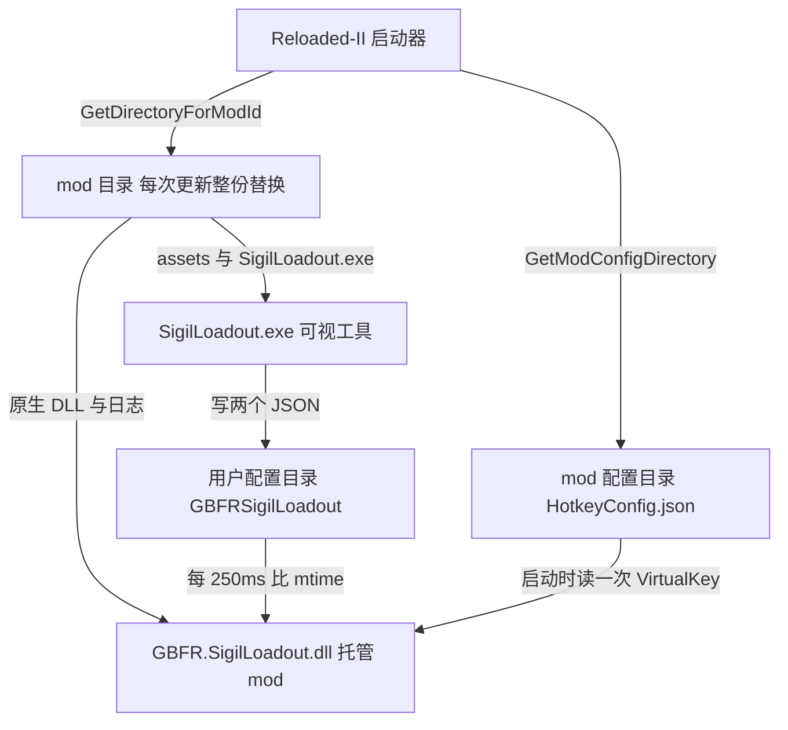
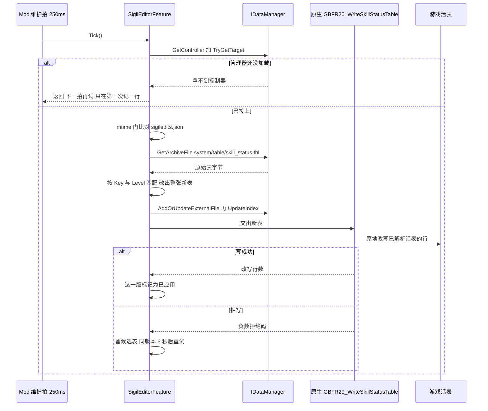

# 宿主与依赖边界（Reloaded-II / 数据管理器）

<!-- openwiki: broken internal link [/openwiki/concepts/skill_status-table.md] file "/openwiki/concepts/skill_status-table.md" does not exist. Fix the href or restore the target, then delete this comment. -->
托管那一半（`GBFR.SigilLoadout.dll`）自己没有生命周期、没有调度器、也没有读游戏数据的能力：它的生成、驱动、停机全来自 Reloaded-II，它拿到的游戏数据全来自 gbfrelink.utility.manager。本页讲这两条外侧边界的确切条款——**接口成员与清单字段各自在运行期造成什么后果**、**三个目录分别装什么、能不能活过一次更新**、**日志落在哪**、**数据管理器缺席时到底降级成什么样**。单元内部的职责划分见 [托管 mod（C# Reloaded 外壳）](/openwiki/architecture/managed-mod.md)，表布局与活表写入闸门的细节见 [skill_status 表与活表写入闸门](/openwiki/concepts/skill_status-table.md)。

## 1. 宿主契约：`IMod` 的六个成员

启动器只认这几个入口；它们的行为全部落在 `Mod` 一个类里（`Mod.cs`）：

| 成员 | 本 mod 的实现 | 后果 |
| --- | --- | --- |
| `Start(IModLoaderV1)` / `StartEx(IModLoaderV1, IModConfigV1)` | 都转调同一个私有 `QueueStart`，用 `Interlocked.Exchange(ref _startRequested, 1)` 只放行一次 | 启动器的两个入口重入不会造出第二个 250 ms 维护定时器。`StartEx` 直接把参数里的 `config.ModVersion` 用于日志，不重读 `ModConfig.json` |
| `CanUnload()` | `=> false` | 启动器不会对本 mod 做"卸载"。原因写在代码里：原生钩子没法安全暂停/卸下，所以这里不向启动器承诺一个不存在的能力 |
| `CanSuspend()` | `=> false` | 同上；`Suspend()` / `Resume()` 是空实现（代码注释：不会被调） |
| `Unload()` | `=> Dispose()` | 与 `Disposing` 属性指向同一个幂等实现 |
| `Disposing` | `=> Dispose` | 启动器在进程拆卸时经由它收尾 |
| `Start` 的内部流程 | 见图与下表 | 日志 → 原生核心 → 配装 → 热键 → 因子编辑器 → 维护定时器；任何一步抛异常都记一行 `Initialization failed:` 并转 `Dispose()` |

`Dispose()` 的语义值得单独记住，它有一条刻意的"无条件"：

- 先停维护定时器、`_sigilEditor.Dispose()`、`Hotkey.Shutdown()`；
- 然后**无条件**调 `NativeCore.Shutdown()`，不再被"全都成功之后才置位"的标志门着。理由在代码注释里：`Initialize` 一旦返回，原生 DLL 已经加载、日志回调已经挂上、钩子可能已经装好，之后的每一步都可能抛异常把控制权交到这里；如果这时不关停，失败路径就会把原生钩子留在游戏里。`Shutdown` 自身异常安全（异常被吞）。
- 最后释放文件日志。

`_disposed` 保证重复调用无副作用。

### 启动阶段日志是显式的契约

`QueueStart` 与 `NativeCore` 各有一段计时，统一由 `NativeCore.StartupPhaseLine` 拼成一行：

```text
Startup phase=<name> state=complete|failed elapsed_ms=<n>.
```

阶段名依次为 `native-library-load`（DLL 加载与 ABI 握手，归 `NativeCore`）、`native-core`（`GBFR20_Initialize` 的返回值即 `hooksReady`）、`sigil-editor`、`managed-initialize`。钩子没装成不算启动失败：会额外记一行 `Native core loaded without hooks: <消息>`（消息来自 `GBFR20_CopyRuntimeMessage`），其余功能照常——因子编辑器与原生核心无关。

## 2. 宿主契约：`ModConfig.json` 逐字段的实际后果

清单文件只有一处，读它的是启动器（外加发布脚本对版本号的对拍）。下表是**代码里真正会受影响的字段**：

| 字段（值） | 谁读 | 实际后果 |
| --- | --- | --- |
| `ModId: "GBFR.SigilLoadout"` | 启动器；代码里以 `Mod.ModId` 常量复现 | 它是 `loader.GetDirectoryForModId(ModId)` 与 `loader.GetModConfigDirectory(ModId)` 的实参，也是 mod 文件夹名。两处字面量漂了就等于问启动器要另一个目录（仓库里没有门禁钉这一对） |
| `ModDll: "GBFR.SigilLoadout.dll"` | 启动器 | 入口程序集；`csproj` 的 `AssemblyName` 是同一个名字，两处同样没有门禁 |
| `ModNativeDll64: ""`（两个都空） | 启动器 | 原生 DLL **不**由启动器加载：`NativeCore.Configure(modDirectory)` + `SetDllImportResolver` 按绝对路径 `mod目录\GBFR.SigilLoadout.Native.dll` 自己 `NativeLibrary.Load`。于是 ABI 握手与结构体布局自检都是本仓库自己的事，不走启动器的 native 加载通道 |
| `ModVersion: "0.6.0"` | `StartEx` 的参数、发布脚本 | 写进会话日志行 `GBFR Sigil Loadout v0.6.0 (ABI 20)`；`build-release.ps1` 把 `ModConfig.json` 当**版本号唯一权威源**，要求与 `-Version`、`SigilLoadout/frontend/package.json`、`package-lock.json` 一致，并在 `dist` 写 `.build-complete` 供 `deploy.ps1` 回查。`csproj` 刻意不写 `<Version>`，所以托管程序集自身的版本与它无关 |
| `ModName: "GBFR Sigil Loadout (2.0.5)"` | 启动器列表 UI | 不参与任何运行时分支。括号里的 `2.0.5` 是**游戏版本**标签（原生源码注释与提交信息都这样用它），与本 mod 的 `ModVersion` 是两个量，不要"顺手对齐" |
| `CanUnload: false` | 启动器 | 与 `Mod.CanUnload()` 是同一事实的两份声明（后者才是运行期判据）；仓库里没有门禁钉这一对 |
| `SupportedAppId: ["granblue_fantasy_relink.exe"]` | 启动器 | 把加载限定在游戏进程内。因此本 mod 的所有文件系统副作用都发生在游戏进程里，而热键那条链（`Process.GetProcessesByName("SigilLoadout")`、`FindWindow`）是跨进程的 |
| `ModDependencies: []` | 启动器 | 没有硬依赖：缺任何东西都不拦加载 |
| `OptionalDependencies: ["gbfrelink.utility.manager"]` | 启动器 | 缺管理器**不拦加载**；代码也**不依赖任何加载顺序**——`SigilEditorFeature` 的注释明说"管理器可能比本 mod 晚加载"，所以取控制器是每拍重试（第 5 节） |
| `ModIcon: "icon.png"` | 启动器（从 mod 根读） | 发布脚本随包拷一份 `icon.png`；工具窗口/托盘用的是同一张图（工具那份编译进 exe） |
| `HasExports` / `IsLibrary` / `Tags` / `ProjectUrl` / `ReleaseMetadataFileName` / `PluginData` / `ModR2RManagedDll32/64` | 启动器、发布流程 | 仓库代码里没有任何分支读它们 |

**发布时的门禁只覆盖两件事**：版本号对拍（上表 `ModVersion` 那一行）与"一个包该有哪些文件"的清单（`GBFR.SigilLoadout.dll`、`GBFR.SigilLoadout.Native.dll`、`SigilLoadout.exe`、`icon.png`、`assets\` 下九份）。清单**故意独立**、不从 csproj 或源目录派生，否则"忘了加"和"被误删"都查不出来。清单以外的字段（`ModDll`、`CanUnload`、`SupportedAppId`、`OptionalDependencies`……）没有任何脚本校验——它们的不变量靠"每条声明只有一处"维持。构建与发布的完整流程见 [构建与发布](/openwiki/operations/build-and-release.md)。

## 3. 三个目录，三种生存期

托管侧同时碰三个目录，它们**都不由 mod 自己决定位置相等**，而且更新时的命运不同：

| 目录 | 路径从哪来 | 装什么 | 更新 mod 时 |
| --- | --- | --- | --- |
| **mod 目录** | `loader.GetDirectoryForModId(ModId)` | `GBFR.SigilLoadout.dll`、`GBFR.SigilLoadout.Native.dll`、`SigilLoadout.exe`、`assets\`、`icon.png`、`ModConfig.json`、`README.md`，以及运行期追加的 `GBFR.SigilLoadout.log`（+ `.1`） | **整份替换**（`deploy.ps1` 是"拷到同级新目录、成功了才删旧的"）。所以任何要活过一次更新的状态都不能放这里 |
| **mod 配置目录** | `loader.GetModConfigDirectory(ModId)` | `HotkeyConfig.json`（`HotkeyConfig.FileName`） | 位置与保留策略由启动器决定：mod 只把启动器给的路径转交给 `Configurator`，从不自己拼这个路径 |
| **用户配置目录** | **mod 自己算**：`UserConfig.FilePath(name)` = `%LOCALAPPDATA%\GBFRSigilLoadout\<name>` | `loadout.json`（配装）、`sigiledits.json`（因子编辑列表）——两者都由可视工具写、mod 只读 | 不受影响。目录名与两个文件名是跨进程协议，Go 那侧各有一处声明、由 `sharedconstants_test.go` 对拍；详见 [两个配置文件与跨语言常量契约](/openwiki/concepts/config-file-contracts.md) |



三个目录各自的来源与"谁在更新时替换它"。

两条推论值得记住：

1. **只有用户配置目录是"两侧各算一次"的协议**，另两个都是向启动器要来的。于是两侧算法漂了（mod 与工具）只会污染用户配置目录，不会污染前两个；反过来，mod 配置目录的迁移完全由启动器驱动，mod 侧 `Configurator.Migrate` 是空实现——因为路径每次都是启动器传进来的。
2. `assets\` 只被**可视工具**按 `exeDir()\assets\` 读（九份全读，一份都不嵌进 exe）。托管侧不读它，原生侧的限制表已编译进 DLL。

### 配置页连接器

`Configuration/Configurator.cs` 实现 `IConfiguratorV3`，只暴露一个条目 `HotkeyConfig`，并让启动器按属性表渲染（`TryRunCustomConfiguration() => false`，没有自定义窗口）。注意这里有**两份对象、两次读盘**：

- 启动器自己实例化 `Configurator()`（无参）、`SetModDirectory` / `SetConfigDirectory`，为的只是渲染与保存；
- 托管侧另外 `new Configurator(loader.GetModConfigDirectory(ModId))`，取 `Configurations[0]` 转成 `HotkeyConfig`，只为拿 `VirtualKey`，**启动时读一次**。读失败（例如目录无效）就回落 F1 并记一行 `Hotkey configuration unavailable: …; falling back to the default F1 hotkey.`。

保存由 `Configurable.Save`/`OnSave` 负责（序列化到 `FilePath`）；但 `ConfigurationUpdated` 在本 mod 里被实现成**永不触发的空操作**，见第 7 节。

## 4. 日志落点

托管侧没有自己的日志系统，只有一处 `Log(string)`，它同时写两个汇：

| 汇 | 位置/形态 | 规则 |
| --- | --- | --- |
| 文件 | `mod目录\GBFR.SigilLoadout.log` | **追加**写，`AutoFlush = true`；单份超过 4 MiB 时把当前份删掉旧的 `.1` 再改名为 `.1`（只留一代）。轮转失败被吞掉——最坏情况只是这份日志继续变大 |
| 启动器 | `ILogger.WriteLine`（`loader.GetLogger()`） | 与文件行完全相同；写失败同样被吞掉 |

同一行格式：`[HH:mm:ss.fff] [GBFR Sigil Loadout] <消息>`（`LogTag` 是面向玩家的前缀，`ModId` 保持技术性）。因为文件是跨会话追加的，**每次运行的第一行** `======== Session Start yyyy-MM-dd HH:mm:ss ========` 是"新的一次运行从这里开始"的唯一记号；紧跟着一行 `GBFR Sigil Loadout v<ModVersion> (ABI 20)`。

原生侧的行经 `GBFR20_SetLogCallback` 回传：`NativeCore.ForwardNativeLog` 加上 `Native: ` 前缀转发到同一个 `Log`（回调委托由静态字段持有不回收，免得原生去调一个已释放的函数指针）。

两条硬性约束（代码里都写了理由）：**文件日志与外部日志器出错都绝不影响 mod 生命周期**；`Dispose` 之后再写日志只会写进已释放的 `StreamWriter` 并抛异常被吞。

## 5. 数据管理器：唯一表来源，且是可选依赖

因子编辑那一半（`SigilEditorFeature`）不读磁盘上的 `.tbl`：表的字节只有一个来源——`IDataManager.GetArchiveFile("system/table/skill_status.tbl")`。它连自己的配置目录、文件名、Win32 具名事件都没有：日志、生命周期、"什么时候该重新应用"全部跟着宿主走，由宿主那个 250 ms 的维护拍驱动。

### 取控制器：可选依赖的确切语义

```csharp
if (!_loader.GetController<IDataManager>().TryGetTarget(out IDataManager? dm) || dm is null)
```

- 这件事在 `Start` 时做一次，之后**每一拍再做一次**，直到接上为止。
- 只在**第一次**没拿到时记一行：`sigil edit: IDataManager is not available yet; the edit list waits for gbfrelink.utility.manager to load`（由一个 `_waitedForManager` 标志保证不刷屏）；接上时记一行 `sigil edit: IDataManager attached`。
- 接口包只以 `PackageReference … ExcludeAssets="runtime"` 出现，仓库里没有它的源码或程序集：**"控制器未注册时 `GetController<T>()` 返回空弱引用还是抛异常"在本仓库内看不到**。整条重试路径的设计（每拍再试 + 只第一次记一行）显示期望的是前者；如果实际是抛异常，那"缺管理器只是降级"这条结论就不成立——这是一个明确的验证缺口，不是已证事实。

`OptionalDependencies` 因此只承担一件事：缺管理器时启动器仍然加载本 mod。任何加载顺序保证代码都不依赖（注释：管理器可能比本 mod 晚加载）。这也是**唯一**一条让因子编辑功能"以后自己接上"的路径，没有重试次数上限、没有超时。

### 缺席时的降级边界

缺管理器的后果被刻意收在一个功能内：

- `Bootstrap` 在拿不到控制器时直接返回，**一步都不做**：不读表、不改表、不写内存；其余初始化（原生核心、`LoadoutConfig`、热键、维护定时器）完全不受影响。
- 日志这一路径上真正会出现的是上面那句"在等它加载"。`TryReadTable` 里那句 `sigil edit FAIL: IDataManager controller not found (is gbfrelink.utility.manager enabled?)` 位于"已经接上之后"的读表路径（`_dm` 非 null 才会走到），所以**整个会话都没有管理器**时并不会出现那一行。
- 因子编辑器与原生核心互不相干：`NativeCore.Initialize` 的返回值（`hooksReady`）不影响它是否构造与启动；它自己的任何失败都只记日志，绝不把整个 mod 带走。

接上之后，读表还有一道形状闸门：`GetArchiveFile` 返回 `null`/空 → 记 `GetArchiveFile('…') returned nothing`；形状不是"8 字节头 + 52 字节行"（用整除做预检、不用乘法，避免头部任意值构造出回绕后恰好相等的行数）→ 报出实际字节数、头里声明的行数，并且**什么都不写**。宁可不改，也不把值写进错误的行或行外。

## 6. 为什么"重新注册"与"就地写内存"两件都要做

`Publish(table, stamp)` 是**唯一**那条把表交给游戏的路径，启动那次写与运行中的热应用走的是同一条（见下节）。它做两件事，顺序固定：



取控制器、mtime 门、注册、就地写、成功/拒写两条收尾的全过程。

**注册**（`RegisterWithManager` → `AddOrUpdateExternalFile(TablePath, table)` 再 `UpdateIndex()`）解决的是"游戏还会再解析这张表一次"：游戏在读档、开界面时会重新解析 `skill_status.tbl`，之后每次解析读的都是管理器供给的那份文件。不重新注册，那些解析会用**旧值把行重建出来，当场抹掉实时编辑**。`native_api.h` 里同样把这件事写成契约的一部分：调用方已经把它建好的表重新注册过，所以编辑会在游戏下一次解析时落地（或重启之后）。

**就地写内存**（`NativeCore.WriteSkillStatusTable` → `GBFR20_WriteSkillStatusTable`）解决的是"现在就要可见"：原生用启动时从语义锚点解出的槽拿到游戏那份活表的地址，把不一样的行原地写进去（零扫描、零地址缓存）。托管侧既不持有地址也不扫内存。

三条容易改错的细节：

1. **顺序是注册在前**：它便宜，而且它（或任何别的触发）引起的那次重解析必须已经看到新值。
2. **注册失败不拦住内存写**：`RegisterWithManager` 抛异常只记一行 `hot apply: re-register EXCEPTION (continuing with the memory write): …`，然后照常做内存写。
3. **拒写不是无事发生**：原生返回负数（`-1..-7`，权威定义在 `native_api.h`）表示一个字节都没写（唯一例外是 `-7`，表可能只更新了一部分）。这一层只说自己这层的后果：编辑已写进文件、也重新注册过，**游戏下一次解析会拿到它**。

拒写之后的状态机：候选表留在 `_retryTable`（同一版本重试直接复用它，不必再从归档重建 328 KB 的表），这一版的 mtime **不被标记为已应用**，于是下一次 `Tick` 的 mtime 门还会放行；同一版本的重复失败按 `RetryIntervalMs = 5000` 节流（换文件立刻处理）。250 ms 只是投递节奏——不是量：数值要到下一场战斗才生效，250 ms 换掉的是一条阻塞在 `WaitOne` 的线程和一个内核事件对象。

## 7. 代码里怎么用 vs 文档怎么承诺

玩家文档（随包进 mod 目录的 `GBFR.SigilLoadout/README.md`、仓库根 `README.md`）面向"能不能用"；代码是唯一的行为权威（`AGENTS.md` 的 OpenWiki 段：源码与测试是权威，文档里的未知项只是验证缺口）。三处读写方式不同，值得分开记：

| 文档的说法 | 源码的实际行为 | 差异的性质 |
| --- | --- | --- |
| "改动时游戏内该因子的说明实时更新；实际效果在下一场战斗开始时生效"、"无需重启，运行中的游戏随即把编辑应用到它已经读进内存的那张表上" | 成立，但**只在原生就地写成功时**。拒写（游戏还没把表读进内存、或这张表与本 mod 认得的那张身份不符）时内存一个字节都没变，编辑已写进文件并重新注册，等游戏下一次解析才落地；日志明说："the edit list is saved and re-registered, so the game picks it up at its next parse" | 文档描述的是成功路径，源码里还有一条**只出现在日志里**的拒写路径（同版本重试 5 秒一次） |
| "**需要** gbfrelink.utility.manager 才能用这一页"、"没装的话 mod 照常加载，只是编辑器没有表可改——日志里会说一句在等它" | 一致：缺它时托管侧一行都不写，其余功能照常，日志出现"在等它加载"那句 | 一致（但注意工具那一侧收不到任何通知：它不是"这一页不可用"，而是编辑永远不落地） |
| "它**不带 `.tbl` 文件**……所以能和其他**改表** mod 并存" | 不带 `.tbl` 文件属实；但源码里没有任何与其他改表 mod 的仲裁：它把自己那份 `skill_status.tbl` 注册进管理器的供给集合，并且原生的身份闸门会**逐行比 Key**——Key 被别的 mod 改过的表会被拒写（`-6`）而不是被覆盖 | 文档承诺的是"不覆盖别人的文件"，不是"两个改表 mod 的结果可预测" |
| 配置界面里 `HotkeyConfig.MenuHotkey` 的描述"Changes apply immediately / 修改实时生效" | **不成立**：热键只在启动时读一次（`InitializeHotkeyConfiguration` → `Hotkey.Configure`），`Configurable` 的 `ConfigurationUpdated` 被实现成永不触发的空操作，注释写明官方那份运行期热重载因为"实测改热键要重启游戏才生效"而被去掉；源码里没有重注册路径 | 冲突，**以源码为准**：改热键需要重启游戏 |

第一条还有一个语义前提，术语以 `CONTEXT.md` 为准：**"表已经被改写"与"可见"是两件事**——就地写成功只保证游戏手里那份表变了，角色状态要到下一次战斗开始才重算。

## 8. 宿主提供的唯一调度器

托管侧没有别的时间来源：`Mod` 建一个 250 ms 的 `System.Threading.Timer`，每拍依次调 `LoadoutConfig.Tick(Log)`、`_sigilEditor?.Tick()`、`Hotkey.Tick(Log)`。三条约定必须记住：

- **回调不串行**：上一拍没跑完，下一拍就会进来。代码用一个 `_ticking` 标志（`Interlocked.Exchange`）统一丢掉重叠的拍，而不是让每个阶段各防一遍——每个阶段本来就都把"让过去"当成正常情况（mtime 门不认领、热键只是采样）。
- **整拍外面套 catch-all**：维护拍绝不能把进程带走。
- **热键只是回退**：`RegisterHotKey` 成功时 `Hotkey.Tick` 第一行就返回，消息窗口线程独立负责按键；只有 `RegisterHotKey` 失败（键被占用、消息窗口建不出来）时才由这拍轮询 `GetAsyncKeyState`。热键那条链的完整时序见 [工作流：热键呼出/收起可视工具](/openwiki/workflows/hotkey-summon.md)。

## 9. 改这里之前的检查清单

- 动 `ModConfig.json` 的 `ModId` / `ModDll`：同时改 `Mod.ModId` / `csproj` 的 `AssemblyName`——没有脚本会替你发现。
- 动 `CanUnload`：它是"清单 + `Mod.CanUnload()`"两份声明，只改一处不会报错，只会让启动器与你自己的声明不一致。
- 想在托管侧读游戏数据：目前唯一的入口是 `IDataManager`，而且它可能是缺席的；任何新的读取都必须回答"管理器不在时怎么办"。
- 想把可变状态写进 mod 目录：不行，那个目录每次更新被整份替换。
- 想让热键/配置改完立刻生效：现在没有这条路径；加它就要回到 `ConfigurationUpdated` 上（那份空操作是刻意的）。
