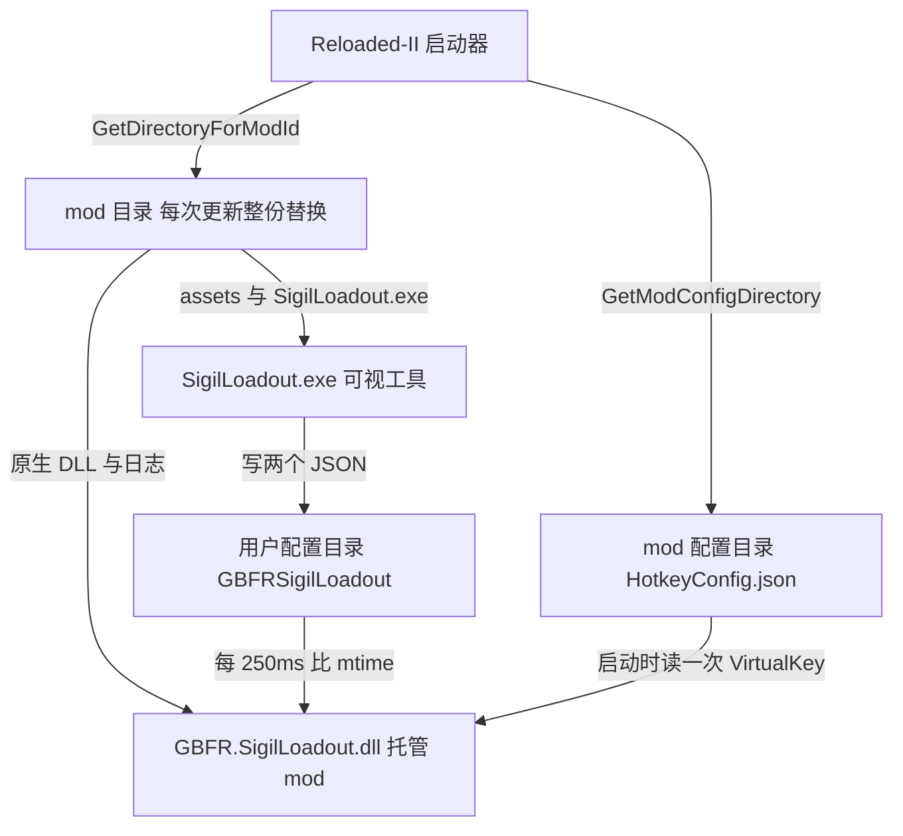
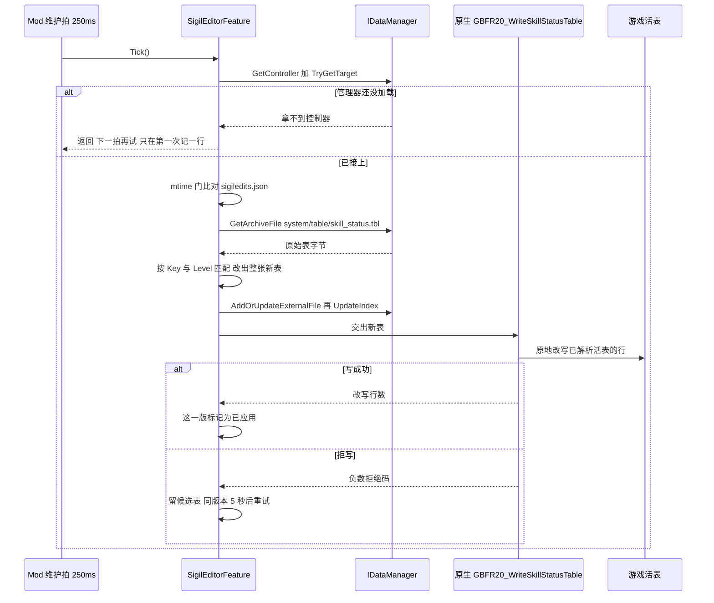

# 宿主与依赖边界（Reloaded-II / 数据管理器）

<!-- openwiki: broken internal link [/openwiki/concepts/skill_status-table.md] file "/openwiki/concepts/skill_status-table.md" does not exist. Fix the href or restore the target, then delete this comment. -->
托管那一半（`GBFR.SigilLoadout.dll`）自己没有生命周期、没有调度器、也没有读游戏数据的能力：它的生成、驱动、停机全来自 Reloaded-II，它拿到的游戏数据全来自数据管理器 gbfrelink.utility.manager。本页讲这两条外侧边界的确切条款——**接口成员与清单字段各自在运行期造成什么后果**、**三个目录分别装什么、能不能活过一次更新**、**三类外部依赖各自怎么落地（哪些只借接口、哪些被编进 DLL、哪些随包）**、**日志落在哪**、**数据管理器缺席时到底降级成什么样**，单元内部的职责划分见 [托管 mod（C# Reloaded 外壳）](/openwiki/architecture/managed-mod.md)，表布局与活表写入闸门的细节见 [skill_status 表与活表写入闸门](/openwiki/concepts/skill_status-table.md)，原生 DLL 内部的阶段链与 ABI 导出面见 [原生核心（C++ DLL）](/openwiki/architecture/native-core.md)，从一次编辑到游戏内存的完整链路见 [工作流：因子数值编辑与热应用](/openwiki/workflows/sigil-edit-apply.md)。

## 1. 宿主契约：`IMod` 的六个成员

启动器只认这几个入口；它们的行为全部落在 `Mod` 一个类里（`Mod.cs`）：

| 成员 | 本 mod 的实现 | 后果 |
| --- | --- | --- |
| `Start(IModLoaderV1)` / `StartEx(IModLoaderV1, IModConfigV1)` | 都转调同一个私有 `QueueStart`，用 `Interlocked.Exchange(ref _startRequested, 1)` 只放行一次 | 启动器的两个入口重入不会造出第二个 250 ms 维护定时器。`StartEx` 直接把参数里的 `config.ModVersion` 用于日志，不重读 `ModConfig.json` |
| `CanUnload()` | `=> false` | 启动器不会对本 mod 做"卸载"。原因写在代码里：原生钩子没法安全暂停/卸下，所以这里不向启动器承诺一个不存在的能力 |
| `CanSuspend()` | `=> false` | 同上；`Suspend()` / `Resume()` 是空实现（代码注释：不会被调） |
| `Unload()` | `=> Dispose()` | 与 `Disposing` 属性指向同一个幂等实现 |
| `Disposing` | `=> Dispose` | 启动器在进程拆卸时经由它收尾 |
| `Start` 的内部流程 | 见图与下表 | 日志 → 原生核心 → 配装 → 热键 → 因子编辑特性（`SigilEditorFeature`） → 维护定时器；任何一步抛异常都记一行 `Initialization failed:` 并转 `Dispose()` |

`Dispose()` 的语义值得单独记住，它有一条刻意的"无条件"：

- 先停维护定时器、`_sigilEditor.Dispose()`、`Hotkey.Shutdown()`；
- 然后**无条件**调 `NativeCore.Shutdown()`，不再被"全都成功之后才置位"的标志门着。理由在代码注释里：`Initialize` 一旦返回，原生 DLL 已经加载、日志回调已经挂上、钩子可能已经装好，之后的每一步都可能抛异常把控制权交到这里；如果这时不关停，失败路径就会把原生钩子留在游戏里。`Shutdown` 自身异常安全（异常被吞）。
- 最后把 `_fileLog` 置 `null` 并释放它（见第 5 节：从此只剩启动器那一个日志汇）。

`_disposed` 保证重复调用无副作用。

### 启动阶段日志是显式的契约

`QueueStart` 与 `NativeCore` 各有一段计时，统一由 `NativeCore.StartupPhaseLine` 拼成一行：

```text
Startup phase=<name> state=complete|failed elapsed_ms=<n>.
```

阶段名依次为 `native-library-load`（DLL 加载与 ABI 握手，归 `NativeCore`）、`native-core`（`GBFR20_Initialize` 的返回值即 `hooksReady`）、`sigil-editor`、`managed-initialize`。钩子没装成不算启动失败：会额外记一行 `Native core loaded without hooks: <消息>`（消息来自 `GBFR20_CopyRuntimeMessage`），其余功能照常——因子编辑特性与原生核心无关。

## 2. 宿主契约：`ModConfig.json` 逐字段的实际后果

清单文件只有一处，读它的只有两类东西：启动器，以及发布脚本（唯一读到的字段是版本号）。下表的"字面值"一列是当前仓库里的值，"症状"一列回答"填错会看到什么"。

| 字段（当前字面值） | 谁读 | 运行期后果 | 填错 / 改错的症状 |
| --- | --- | --- | --- |
| `ModId: "GBFR.SigilLoadout"` | 启动器；代码里以 `Mod.ModId` 常量复现 | 它是 `loader.GetDirectoryForModId(ModId)` 与 `loader.GetModConfigDirectory(ModId)` 的实参，也是 mod 文件夹名 | 值漂了就等于向启动器要另一个目录（要回来的那个目录是否就是放 DLL 的那一份，取决于启动器的目录策略——本仓库内不可证）。而原生 DLL 只从 `GetDirectoryForModId` 给的那个目录按名字加载（`NativeCore.Configure` + `SetDllImportResolver`），所以最可能的现场是最早那条日志就是 `Initialization failed: … Native core not found: <路径>`，`Dispose` 随即把已就位的部分全拆掉。仓库里没有任何门禁钉住这一对 |
| `ModName: "GBFR Sigil Loadout (2.0.5)"` | 启动器列表 UI | **不参与任何运行期分支**：仓库里没有代码读 `ModName` | 只影响列表显示。括号里的 `2.0.5` 是名字的一部分，与本 mod 的 `ModVersion`（0.6.0）是两个量——把两者"顺手对齐"会改掉一个既没有读者、也没有门禁的字符串 |
| `ModAuthor: "baagod"`、`ModDescription: "<中英一段说明>"` | 启动器（列表与详情） | 仓库里没有任何读者 | 改错无人报错 |
| `ModVersion: "0.6.0"` | `StartEx` 的参数、发布脚本 | 写进会话日志行 `GBFR Sigil Loadout v0.6.0 (ABI 20)`；`build-release.ps1` 把 `ModConfig.json` 当**版本号唯一权威源**，要求与 `-Version`、`SigilLoadout/frontend/package.json`、`package-lock.json` 一致，并把结论写进 `dist\.build-complete` 供 `deploy.ps1` 回查；`csproj` 刻意不写 `<Version>` | 这是清单里**唯一**有门禁的字段：只改一处就发布会被 `throw` 拦住（`Version mismatch` / `… bump it too`）。托管程序集自身的版本与它无关，别去 `csproj` 里找它 |
| `ModDll: "GBFR.SigilLoadout.dll"` | 启动器 | 入口程序集；`csproj` 的 `AssemblyName` 是同一个名字 | 两处漂了启动器就找不到入口（启动器侧后果不可证）；仓库里同样没有门禁 |
| `ModIcon: "icon.png"` | 启动器（从 mod 根读） | 列表里的图标；发布清单强制这个文件在包里 | 丢了会被发布门禁拦住（`Required release file was not packaged: …icon.png`） |
| `ModNativeDll32: ""`、`ModNativeDll64: ""` | 启动器 | **两个都必须保持空串**：原生 DLL 不走启动器的 native 加载通道（理由见下） | 填上任何值就为同一份 DLL 多开一条本仓库未验证的加载通道，而本 mod 自己的加载路径根本不读这两个字段——等于多出一条没人维护的重复加载 |
| `ModR2RManagedDll32: ""`、`ModR2RManagedDll64: ""` | 启动器 | 没有 ReadyToRun 变体；仓库里没有读者 | 改错无人报错 |
| `CanUnload: false` | 启动器；代码里 `Mod.CanUnload() => false` | 同一事实的两份声明 | 只改一处不会报错，只会让清单与运行期判据不一致（`CanSuspend` / `Suspend` / `Resume` 同理） |
| `SupportedAppId: ["granblue_fantasy_relink.exe"]` | 启动器 | 把加载限定在游戏进程内；同一个进程名在原生自身校验、热键前台判定、可视工具的点击重放守卫里各出现一次 | 写错或漏掉 = 匹配不到游戏进程（启动器侧后果不可证），而热键那条链与工具那记点击注入会静默失效——四处各写一份字面量，没有对拍 |
| `ModDependencies: []` | 启动器 | 没有硬依赖：缺任何东西都不拦加载 | 往这里加东西就把"可选"变成"缺就拦"，而本 mod 的代码从不检查依赖是否在场 |
| `OptionalDependencies: ["gbfrelink.utility.manager"]` | 启动器 | 缺数据管理器**不拦加载**；代码也不依赖加载顺序（注释明说管理器可能比本 mod 晚加载），所以取控制器是每拍重试（第 6 节） | 删掉它只影响启动器的排序/提示；"编辑会不会落地"由取控制器那条重试路径决定，与这里无关 |
| `Tags: []`、`HasExports: false`、`IsLibrary: false`、`IsUniversalMod: false`、`ReleaseMetadataFileName: "GBFR.SigilLoadout.ReleaseMetadata.json"`、`PluginData: {}`、`ProjectUrl: "https://…"` | 启动器与发布流程 | 仓库代码里没有任何分支读它们；`ReleaseMetadataFileName` 声明的那个文件既不在发布清单里、也没有生成步骤 | 改错无人报错 |

### 为什么两个 `ModNativeDll*` 是空串

它们**故意留空**，因为原生核心不由启动器加载：

1. `csproj` 把 `GBFR.SigilLoadout.Native.dll` 当普通内容文件拷进输出目录（`CopyToOutputDirectory`），发布脚本再把它当必需文件收进包——它和托管 dll 一样，只是 mod 目录里的一个文件；
2. 运行期由 `NativeCore.Configure(modDirectory)` 记住 `mod目录\GBFR.SigilLoadout.Native.dll` 的绝对路径，并通过 `NativeLibrary.SetDllImportResolver` 在第一次 P/Invoke 时自己 `NativeLibrary.Load`。

于是 ABI 版本握手（`GBFR20_GetAbiVersion` 对上 `NativeCore.AbiVersion`）、结构体封送尺寸自检、以及"找不到 DLL 时抛什么"全部是本仓库自己的事，不走启动器的 native 加载通道。填上 `ModNativeDll64` 会让启动器也去加载同一份 DLL（启动器侧后果在本仓库内不可证）；而本 mod 的加载路径不读这两个字段，所以改动它们对本 mod 的可见行为没有影响——这正是"保持空串"的理由：一条 DLL 只留一条加载路径。

顺带一提，原生工程本身也只编 x64（解决方案里只有 `Debug|x64` 与 `Release|x64`，链接选项写死 `/machine:x64`），所以那两个栏位里也没有第二份产物可指。

### 启动器侧语义是验证缺口，不是本页的事实

上表"谁读"那一列里凡是写着"启动器"的，**在本仓库内不可证**：`Reloaded.Mod.Interfaces` 只以 `PackageReference … ExcludeAssets="runtime"` 出现（`gbfrelink.utility.manager.Interfaces` 同样），启动器自己的实现——目录怎么定、`CanUnload: false` 被怎么对待、`SupportedAppId` 怎么匹配进程——没有源码或程序集可读。仓库里能钉住的只有**本 mod 这一侧的声明**（字段值，以及它在代码里复现了哪几处），所以那些字段的启动器侧语义是验证缺口。运行期真正可观察的后果只有两条：`ModId` 决定 `loader.GetDirectoryForModId` / `loader.GetModConfigDirectory` 要回来的目录（第 3 节），`ModVersion` 由 `StartEx` 带进来并进会话日志。

### 发布门禁只钉住版本号，不钉字段

与 `ModConfig.json` 有关的门禁只有一条：**版本号对拍**（上表 `ModVersion` 那一行）。清单里其它字段（`ModDll`、`CanUnload`、`SupportedAppId`、`OptionalDependencies`……）没有任何脚本或测试校验——它们的不变量靠"每条声明只有一处可查"维持。

包内"该有哪些文件"是另一件事，由 `build-release.ps1` 里一份独立的 13 项清单持有（托管 dll、原生 dll、工具 exe、`icon.png`、`assets\` 下九份）。那份清单**故意不从 csproj 或源目录派生**，否则"忘了加"和"被误删"两种漏法它都查不出来。它只保证文件在场，与清单字段无关；构建链的其它门禁（数据新鲜度、布局回归、生成资产、遗留产物、可变配置、PDB）见 [构建、发布与部署链](/openwiki/operations/build-and-release.md)。

## 3. 三个目录，三种生存期

托管侧同时碰三个目录：两个的路径是向启动器要来的、用户配置目录是自己算的，而三者在更新时的命运不同：

| 目录 | 路径从哪来 | 装什么 | 读 / 写方 | 更新 mod 时 |
| --- | --- | --- | --- | --- |
| **mod 目录** | `loader.GetDirectoryForModId(ModId)` | `GBFR.SigilLoadout.dll`、`GBFR.SigilLoadout.Native.dll`、`SigilLoadout.exe`、`assets\`、`icon.png`、`ModConfig.json`、`README.md`，以及运行期追加的 `GBFR.SigilLoadout.log`（+ `.1`） | 发布链整份写入；启动器从 mod 根读清单与图标；托管 mod 从同目录加载原生 DLL、写日志；可视工具按 `exeDir()` 读自己的资产 | **整份替换**（`deploy.ps1` 是"拷到同级新目录、成功了才删旧的"）。所以任何要活过一次更新的状态都不能放这里——唯一的例外是那份**追加写**的日志，它随更新丢历史（第 5 节） |
| **mod 配置目录** | `loader.GetModConfigDirectory(ModId)` | `HotkeyConfig.json`（`HotkeyConfig.FileName`） | 启动器的配置页读写（保存走 `Configurable.Save`）；托管 mod **只读一次**，且路径每次都由启动器传进来、从不自己拼 | 位置与保留策略由启动器决定：mod 只把启动器给的路径转交给 `Configurator` |
| **用户配置目录** | **mod 自己算**：`UserConfig.FilePath(name)` = `%LOCALAPPDATA%\GBFRSigilLoadout\<name>` | `loadout.json`（配装）、`sigiledits.json`（因子编辑列表） | 两者都由可视工具写、mod 每隔 250 ms 只看 mtime；mod 从不写它 | 不受影响。目录名与两个文件名是跨进程协议，Go 那侧各有一处声明、由 `sharedconstants_test.go` 对拍；详见 [两个配置文件与跨语言常量契约](/openwiki/concepts/config-file-contracts.md) |



三个目录各自的来源与"谁在更新时替换它"。

一句话记住这张表：**可变状态一律不在 mod 目录**。玩家状态只有用户配置目录一个去处（配装与编辑列表都住在那里），mod 目录里唯一会被运行期改写的文件是那份**追加写**的日志，而它每次更新丢历史——这正是"更新 mod 不丢配置"能成立的全部理由。

两条推论值得记住：

1. **只有用户配置目录是"两侧各算一次"的协议**，另两个都是向启动器要来的。于是两侧算法漂了（mod 与工具）只会污染用户配置目录，不会污染前两个；反过来，mod 配置目录的迁移完全由启动器驱动——`Configurator.Migrate` 是个空实现，因为路径每次都由启动器传进来，没有要搬的东西。
2. `assets\` 只被**可视工具**按 `exeDir()\assets\` 读（九份全读，一份都不嵌进 exe）。托管侧不读它，原生侧的限制表已编译进 DLL。

### 配置页连接器

`Configuration/Configurator.cs` 实现 `IConfiguratorV3`，只暴露一个条目 `HotkeyConfig`，并让启动器按属性表渲染（`TryRunCustomConfiguration() => false`，没有自定义窗口）。注意这里有**两份对象、两次读盘**：

- 启动器自己实例化 `Configurator()`（无参）、`SetModDirectory` / `SetConfigDirectory`，为的只是渲染与保存；
- 托管侧另外 `new Configurator(loader.GetModConfigDirectory(ModId))`，取 `Configurations[0]` 转成 `HotkeyConfig`，只为拿 `VirtualKey`，**启动时读一次**。读失败（例如目录无效）就回落 F1 并记一行 `Hotkey configuration unavailable: …; falling back to the default F1 hotkey.`。

这里还要分清一件事：**"文件不存在"不等于"读失败"**。`Configurable.ReadFrom` 在文件缺失时直接给一份默认实例（于是热键就是默认的 F1），只有反序列化或目录访问真的抛异常时才会走到上面那行 `Hotkey configuration unavailable:`。两种情形行为相同（都用 F1）、日志不同——排查时先看有没有那行，就知道是"还没配过"还是"配了但读不出来"。

保存由 `Configurable.Save`/`OnSave` 负责（序列化到 `FilePath`）；但 `ConfigurationUpdated` 在本 mod 里被实现成**永不触发的空操作**，见第 8 节。

## 4. 依赖清单：三类外部依赖，三种落地方式

发布包里**没有任何第三方二进制**：该有的东西由发布链逐个点名（两个本仓库二进制、可视工具 exe、`icon.png`、`assets\` 九份、`ModConfig.json`、`README.md`），没有任何接口 DLL 或第三方运行库。能做到这一点，是因为三类外部依赖各自被"消化"在不同阶段：

| 依赖 | 声明在哪 | 怎么落地 | 随包？ | 失效形态 |
| --- | --- | --- | --- | --- |
| Reloaded-II 接口（`Reloaded.Mod.Interfaces 2.5.0`） | `GBFR.SigilLoadout.csproj` 的 `PackageReference … ExcludeAssets="runtime"` | 编译期给出 `IMod` / `IModLoader` / `ILogger` / `IConfiguratorV3` 这些类型；**实现**在运行期由启动器在游戏进程里给出 | 否 | 编译期对不上就编不过；运行期的接口版本没有任何声明与门禁，本仓库内不可证 |
| 数据管理器接口（`gbfrelink.utility.manager.Interfaces 1.2.0`） | 同一个 `csproj`，同样 `ExcludeAssets="runtime"` | 编译期只有接口；实例在运行期由另一个 mod（gbfrelink.utility.manager）注册，用 `GetController<IDataManager>()` 取 | 否 | 缺席只是降级（第 6 节）；"控制器未注册时返回空弱引用还是抛异常"仍不可证 |
| 编进 DLL 的 C++ 源码（`third_party\safetyhook.cpp` + `safetyhook.hpp`、`third_party\Zydis.c` + `Zydis.h`） | `GBFR.SigilLoadout.Native.vcxproj` 的 `ClCompile`/`ClInclude`；`third_party` 只是被加进 `AdditionalIncludeDirectories` | 直接编进 `GBFR.SigilLoadout.Native.dll`（`Zydis.c` 按 `CompileAs=C` 编，两份各自关掉一个只属于它们的警告：`safetyhook.cpp` 4834、`Zydis.c` 4201） | 否（包里没有第三份 DLL） | 没有包管理器、也没有还原步骤：升级 = 换文件 |

`ExcludeAssets="runtime"` 不是"省几个 KB"，而是把这两份接口的边界钉死：它们**只**以引用程序集参与编译，所以托管工程的输出目录里不会有这两份接口 DLL——`csproj` 拷进输出的只有 `ModConfig.json`、`README.md`、`assets\` 与原生 DLL，发布脚本再从这个输出目录整份取件。接口的实现在运行期只能来自宿主——这正是第 2 节"启动器侧语义不可证"的结构性原因，不是本仓遗漏。逐包的细节表在 [托管 mod（C# Reloaded 外壳）](/openwiki/architecture/managed-mod.md)。

vendored 那两份是**合并成单文件**的第三方源码（两份都带 `DO NOT EDIT. This file is auto-generated by amalgamate.py` 头），仓库里没有版本清单——版本只写在文件自己身上（`Zydis.h` 的 `ZYDIS_VERSION` 是 `0x0004000000000000`，即 4.0.0）。safetyhook 用 Zydis 解码指令来搬运被钩函数开头的指令，所以这两份在编译上是一对，不能只换一份。原生侧另有两处把"vendored 版本的行为"当成前提，换库时会先撞上它们：

- `skill_hooks.cpp`：`safetyhook::create_inline` / `create_mid` 在 vendored 版本里**失败返回空 hook 而不抛**，于是每个钩子阶段自己判返回值、自己记一条 `failed`（而不是靠异常兜底）。
- `runtime.cpp`：safetyhook 会改写 `.text`，所以热应用要用的那个槽必须在装钩子**之前**解析（锚点要用没被改写的字节匹配）。

还有一类输入也来自仓库外，但落地方式与上面三类都不同：**外部生成器 `gen`**——`assets\` 九份与原生自己的限制表都由它产出（原生工程每次编译前会调一次 `go run . exclusive`），产物随包。那是另一套边界，见 [外部生成器 gen 与随包数据资产](/openwiki/integrations/external-generator-and-assets.md)。

### 两个编译单位与它们之间的耦合

`GBFR-Sigil-Loadout.sln` 里只有两个工程：`GBFR.SigilLoadout.Native`（仅 x64 的 `DynamicLibrary`，产物落 `bin\$(Configuration)`）与 `GBFR.SigilLoadout`（SDK 风格托管工程）。托管工程在解决方案里**显式依赖原生工程**（`ProjectDependencies`），所以按解决方案构建时原生先跑。

但这条耦合**不是** `ProjectReference`：托管工程对原生 DLL 的关系只是一次文件拷贝——`csproj` 用 `<None Include="..\GBFR.SigilLoadout.Native\bin\$(Configuration)\GBFR.SigilLoadout.Native.dll" Link="GBFR.SigilLoadout.Native.dll" CopyToOutputDirectory="PreserveNewest" />` 把原生 DLL 拉进输出目录（`PreserveNewest` 只在源较新时才拷），发布脚本再从输出目录整份取件。所以**单独 `dotnet build` 托管工程不会重建原生 DLL**，拿到的是上一次构建留在 `bin\$(Configuration)` 里的那份；顺序由解决方案的工程依赖或发布脚本第一步那次显式 `msbuild /t:Rebuild` 保证（见 [构建、发布与部署链](/openwiki/operations/build-and-release.md)）。托管侧也不引用原生侧的任何托管类型——两者之间只有 ABI：导出面在 `native_api.h`，托管侧映射在 `NativeCore.Interop.cs`，运行期还有 ABI 版本号与结构体尺寸/偏移自检（见 [原生核心（C++ DLL）](/openwiki/architecture/native-core.md)）。

## 5. 日志落点

托管侧没有自己的日志系统，只有一处 `Log(string)`，它同时写两个汇：

| 汇 | 位置/形态 | 规则 |
| --- | --- | --- |
| 文件 | `mod目录\GBFR.SigilLoadout.log` | **追加**写，`AutoFlush = true`；轮转只在**每次启动、打开日志之前**判一次：现有份超过 4 MiB 就把旧的 `.1` 删掉、再把当前份改名成 `.1`（只留一代）。所以单场长会话可以超过 4 MiB。轮转失败被吞掉——最坏情况只是这份日志继续变大 |
| 启动器 | `ILogger.WriteLine`（`loader.GetLogger()`） | 与文件行完全相同；写失败同样被吞掉。`Dispose` 把 `_fileLog` 置 `null` 之后，只剩这一个汇 |

同一行格式：`[HH:mm:ss.fff] [GBFR Sigil Loadout] <消息>`（`LogTag` 是面向玩家的前缀，`ModId` 保持技术性）。因为文件是跨会话追加的，**每次运行的第一行** `======== Session Start yyyy-MM-dd HH:mm:ss ========` 是"新的一次运行从这里开始"的唯一记号；紧跟着一行 `GBFR Sigil Loadout v<ModVersion> (ABI 20)`。

原生侧的行经 `GBFR20_SetLogCallback` 回传：`NativeCore.ForwardNativeLog` 加上 `Native: ` 前缀转发到同一个 `Log`（回调委托由静态字段持有不回收，免得原生去调一个已释放的函数指针）。

两条硬性约束（代码里都写了理由）：**文件日志与外部日志器出错都绝不影响 mod 生命周期**（两处写各自被 catch 吞掉）；`Dispose` 之后再写日志也不会抛——`_fileLog` 已是 `null`，那一行只会进启动器。逐行的读法与"某类症状该搜哪一句"见 [日志与故障定位](/openwiki/operations/logging-and-diagnostics.md)。

## 6. 数据管理器：唯一表来源，且是可选依赖

因子编辑那一半（`SigilEditorFeature`）不读磁盘上的 `.tbl`：表的字节只有一个来源——`IDataManager.GetArchiveFile("system/table/skill_status.tbl")`。它连自己的配置目录、文件名、Win32 具名事件都没有：日志、生命周期、"什么时候该重新应用"全部跟着宿主走，由宿主那个 250 ms 的维护拍驱动。

### 取控制器：可选依赖的确切语义

```csharp
if (!_loader.GetController<IDataManager>().TryGetTarget(out IDataManager? dm) || dm is null)
```

- 这件事在 `Start` 时做一次，之后**每一拍再做一次**，直到接上为止。
- 只在**第一次**没拿到时记一行：`sigil edit: IDataManager is not available yet; the edit list waits for gbfrelink.utility.manager to load`（由一个 `_waitedForManager` 标志保证不刷屏）；接上时记一行 `sigil edit: IDataManager attached`。
- 接口包只以 `PackageReference … ExcludeAssets="runtime"` 出现，仓库里没有它的源码或程序集：**"控制器未注册时 `GetController<T>()` 返回空弱引用还是抛异常"在本仓库内看不到**。整条重试路径的设计（每拍再试 + 只第一次记一行）显示期望的是前者；如果实际是抛异常，那"缺管理器只是降级"这条结论就不成立——这是一个明确的验证缺口，不是已证事实。

`OptionalDependencies` 因此只承担一件事：缺管理器时启动器仍然加载本 mod。任何加载顺序保证代码都不依赖（注释：管理器可能比本 mod 晚加载）。这也是**唯一**一条让因子编辑功能"以后自己接上"的路径，没有重试次数上限、没有超时。

### 缺席时的降级边界

缺管理器的后果被刻意收在一个功能内：

- `Bootstrap` 在拿不到控制器时直接返回，**一步都不做**：不读表、不改表、不写内存；其余初始化（原生核心、`LoadoutConfig`、热键、维护定时器）完全不受影响——`Mod` 里那几行注释就是这条边界，因子编辑特性与钩子成没成无关。
- 日志这一路径上真正会出现的是上面那句"在等它加载"。`TryReadTable` 里那句 `sigil edit FAIL: IDataManager controller not found (is gbfrelink.utility.manager enabled?)` 位于"已经接上之后"的读表路径（`_dm` 非 null 才会走到），所以**整个会话都没有管理器**时并不会出现那一行。
- 因子编辑特性自己的任何失败都只记日志，绝不把整个 mod 带走。

接上之后，读表还有一道形状闸门：`GetArchiveFile` 返回 `null`/空 → 记 `GetArchiveFile('…') returned nothing`；形状不是"8 字节头 + 52 字节行"（用整除做预检、不用乘法，避免头部任意值构造出回绕后恰好相等的行数）→ 报出实际字节数、头里声明的行数，并且**什么都不写**。宁可不改，也不把值写进错误的行或行外。

对玩家而言这条降级的可见形态只有一个：**编辑永远不落地**（工具那侧收不到任何通知），而 mod 其余部分照常。逐条日志、拒写与重试的完整读法见 [工作流：因子数值编辑与热应用](/openwiki/workflows/sigil-edit-apply.md)。

## 7. 为什么"重新注册"与"就地写内存"两件都要做

`Publish(table, stamp)` 是**唯一**那条把表交给游戏的路径：启动那次写（`Bootstrap` 把刚建好的表交给 `TryApply`）与运行中的热应用（`Tick` 过了 mtime 门再建一次）在 `TryApply` 处汇合，细节见 [工作流：因子数值编辑与热应用](/openwiki/workflows/sigil-edit-apply.md)。它做两件事，顺序固定：



取控制器、mtime 门、注册、就地写、成功/拒写两条收尾的全过程。

**注册**（`RegisterWithManager` → `AddOrUpdateExternalFile(TablePath, table)` 再 `UpdateIndex()`）解决的是"游戏还会再解析这张表一次"：游戏在读档、开界面时会重新解析 `skill_status.tbl`，之后每次解析读的都是管理器供给的那份文件。不重新注册，那些解析会用**旧值把行重建出来，当场抹掉实时编辑**。`native_api.h` 里同样把这件事写成契约的一部分：调用方已经把它建好的表重新注册过，所以编辑会在游戏下一次解析时落地（或重启之后）。

**就地写内存**（`NativeCore.WriteSkillStatusTable` → `GBFR20_WriteSkillStatusTable`）解决的是"现在就要可见"：原生用启动时从语义锚点解出的槽拿到游戏那份活表的地址，把不一样的行原地写进去（零扫描、零地址缓存）。托管侧既不持有地址也不扫内存。

三条容易改错的细节：

1. **顺序是注册在前**：它便宜，而且它（或任何别的触发）引起的那次重解析必须已经看到新值。
2. **注册失败不拦住内存写**：`RegisterWithManager` 抛异常只记一行 `hot apply: re-register EXCEPTION (continuing with the memory write): …`，然后照常做内存写。
3. **拒写不是无事发生**：原生返回负数（`-1..-7`，权威定义在 `native_api.h`）表示一个字节都没写（唯一例外是 `-7`，表可能只更新了一部分）。这一层只说自己这层的后果：编辑已写进文件、也重新注册过，**游戏下一次解析会拿到它**。拒写后这一版的 mtime 不被标记为已应用，候选表留在 `_retryTable` 供同版本重试复用，同一版本的重试按 `RetryIntervalMs = 5000` 节流（文件一变立刻处理）。250 ms 只是投递节奏——不是量：数值要到下一场战斗才生效。

## 8. 代码里怎么用 vs 文档怎么承诺

玩家文档（随包进 mod 目录的 `GBFR.SigilLoadout/README.md`、仓库根 `README.md`）面向"能不能用"；代码是唯一的行为权威（`AGENTS.md` 的 OpenWiki 段：源码与测试是权威，文档里的未知项只是验证缺口）。下面几处的读写方式不同，值得分开记：

| 文档的说法 | 源码的实际行为 | 差异的性质 |
| --- | --- | --- |
| "改动时游戏内该因子的说明实时更新；实际效果在下一场战斗开始时生效"、"无需重启，运行中的游戏随即把编辑应用到它已经读进内存的那张表上" | 成立，但**只在原生就地写成功时**。拒写（游戏还没把表读进内存、或这张表与本 mod 认得的那张身份不符）时内存一个字节都没变，编辑已写进文件并重新注册，等游戏下一次解析才落地；日志明说："the edit list is saved and re-registered, so the game picks it up at its next parse" | 文档描述的是成功路径，源码里还有一条**只出现在日志里**的拒写路径（同版本重试 5 秒一次） |
| "**需要** gbfrelink.utility.manager 才能用这一页"、"没装的话 mod 照常加载，只是编辑器没有表可改——日志里会说一句在等它" | 一致：缺它时托管侧一行都不写，其余功能照常，日志出现"在等它加载"那句 | 一致（但注意工具那一侧收不到任何通知：它不是"这一页不可用"，而是编辑永远不落地） |
| "它**不带 `.tbl` 文件**……所以能和其他**改表** mod 并存" | 不带 `.tbl` 文件属实；但源码里没有任何与其他改表 mod 的仲裁：它把自己那份 `skill_status.tbl` 注册进管理器的供给集合，并且原生的身份闸门会**逐行比 Key**——Key 被别的 mod 改过的表会被拒写（`-6`）而不是被覆盖 | 文档承诺的是"不覆盖别人的文件"，不是"两个改表 mod 的结果可预测" |
| 配置界面里 `HotkeyConfig.MenuHotkey` 的描述"Changes apply immediately / 修改实时生效" | **不成立**：热键只在启动时读一次（`InitializeHotkeyConfiguration` → `Hotkey.Configure`，注释写明"热键读一次配置就定下来（运行期不再改键）"），`Configurable` 的 `ConfigurationUpdated` 是永不触发的空操作，注释写明官方那份运行期热重载因为"实测改热键要重启游戏才生效"而被去掉；源码里没有重注册路径 | 冲突，**以源码为准**：改热键需要重启游戏 |
| 随包 README 末尾那句"构建命令与验证清单在仓库根的 `README.md`"；`tools\build-release.ps1` 注释里的"README「构建与部署」里写了" | **两处指向都已失效**：仓库根 `README.md` 现在是面向玩家的安装 / 使用 / 致谢三节，全文没有一条构建、部署或验证命令（`docs\` 目录为空，也没有第二处承接它们）；随包 README 里唯一还成立的入口是它上一行给的那个 GitHub 仓库链接 | 文档搬家后的残留指向，与源码行为无关：可执行的构建 / 发布说明以 [构建与发布链](/openwiki/operations/build-and-release.md) 为准，验证与门禁清单以 [验证地图：测试与门禁各护什么](/openwiki/testing/verification-map.md) 为准 |

最后一行是这次要记住的落差：随包 README 与发布脚本的注释都还停在"仓库根 README 是构建手册"这个旧前提上，照着它们找命令会一无所获——涉及构建命令、发布门禁与验证清单时，直接看上面链接的两页。

第一条还有一个语义前提，术语以 `CONTEXT.md` 为准：**"表已经被改写"与"可见"是两件事**——就地写成功只保证游戏手里那份**活表**变了，角色状态（游戏已把新值算进角色描述）要到下一次战斗开始才重算。

## 9. 宿主提供的唯一调度器

托管侧没有别的时间来源：`Mod` 建一个 250 ms 的 `System.Threading.Timer`，每拍依次调 `LoadoutConfig.Tick(Log)`、`_sigilEditor?.Tick()`、`Hotkey.Tick(Log)`。三条约定必须记住：

- **回调不串行**：上一拍没跑完，下一拍就会进来。代码用一个 `_ticking` 标志（`Interlocked.Exchange`）统一丢掉重叠的拍，而不是让每个阶段各防一遍——每个阶段本来就都把"让过去"当成正常情况（mtime 门不认领、热键只是采样）。
- **整拍外面套 catch-all**：维护拍绝不能把进程带走。
- **热键只是回退**：`RegisterHotKey` 成功时 `Hotkey.Tick` 第一行就返回，消息窗口线程独立负责按键；只有 `RegisterHotKey` 失败（键被占用、消息窗口建不出来）时才由这拍轮询 `GetAsyncKeyState`。热键那条链的完整时序见 [工作流：热键呼出/收起可视工具](/openwiki/workflows/hotkey-summon.md)。

## 10. 改这里之前的检查清单

- 动 `ModConfig.json` 的 `ModId` / `ModDll`：同时改 `Mod.ModId` / `csproj` 的 `AssemblyName`——没有脚本会替你发现；`ModId` 漂了最可能的现场是"原生 DLL 找不到"。
- 动 `ModName`：它没有读者，但括号里那个 `2.0.5` 不是 `ModVersion`；两者不是同一个量，别顺手对齐。
- 别给 `ModNativeDll32/64` 填值：那会给同一份 DLL 多开一条未经本仓库验证的加载通道，而本 mod 的加载路径不读这两个字段。
- 动 `SupportedAppId` 或改名游戏进程：同一个进程名还写在原生自身校验、热键前台判定与可视工具的 `isGameWindow` 点击重放守卫里，四处都要跟上。
- 动 `CanUnload`：它是"清单 + `Mod.CanUnload()`"两份声明，只改一处不会报错，只会让启动器与你自己的声明不一致。
- 升两个接口包（`Reloaded.Mod.Interfaces` / `gbfrelink.utility.manager.Interfaces`）：清单里没有它们的版本声明，也没有门禁；改的是编译期的引用程序集，运行期的实现始终来自宿主与对方 mod。
- 动原生依赖：`third_party\` 里是 vendored 源码（编进 DLL，没有包管理器、没有还原步骤），升级就是换文件；换之前先看 `skill_hooks.cpp` 与 `runtime.cpp` 里那两处把 vendored 行为当前提的注释（失败不抛、会改写 `.text`）。
- 单独 `dotnet build` 托管工程不会重建原生 DLL（那条耦合是文件拷贝，不是 `ProjectReference`）：发布前要么按解决方案构建，要么用发布脚本。
- 想在托管侧读游戏数据：目前唯一的入口是 `IDataManager`，而且它可能是缺席的；任何新的读取都必须回答"管理器不在时怎么办"。
- 想把可变状态写进 mod 目录：不行，那个目录每次更新被整份替换（追加写的日志是唯一例外，且它随更新丢历史）。
- 想让热键/配置改完立刻生效：现在没有这条路径；加它就要回到 `ConfigurationUpdated` 上（那份空操作是刻意的）。
- 想补"构建 / 部署 / 验证"的说明：别往仓库根 `README.md` 里加——它现在是玩家页；随包 README 末尾那句与 `tools\build-release.ps1` 的注释都还指着它的旧构建章节，是两处待修的失效指向。
