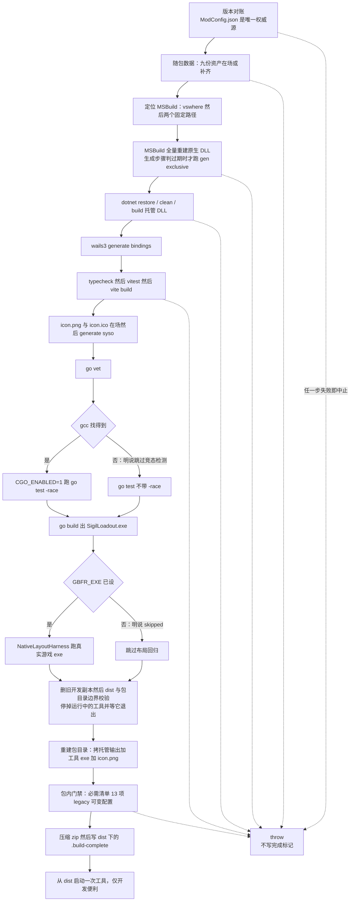
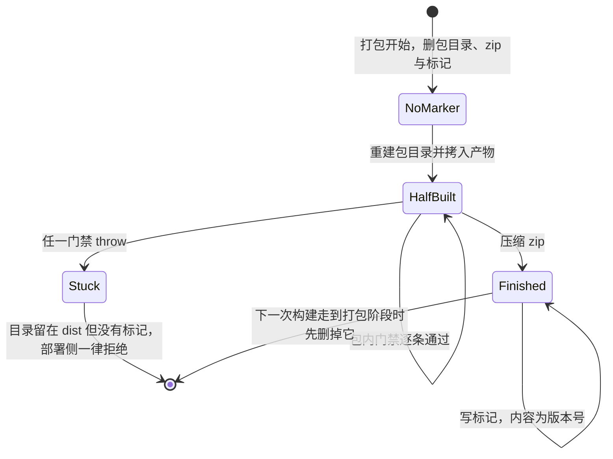
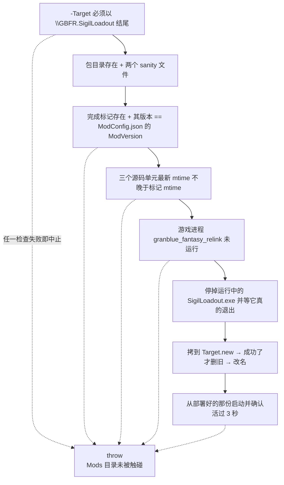

# 构建、发布与部署链

这套 mod 的发布是**两个 PowerShell 脚本**，没有别的入口：`tools\build-release.ps1` 把源码编译成 `dist\GBFR.SigilLoadout\` 目录与配套的 `dist\GBFR-Sigil-Loadout-<版本>.zip`，`tools\deploy.ps1` 把那个目录**整份替换**进 Reloaded-II 的 Mods 目录。仓库里**没有 CI 构建或发布工作流**（`.github\workflows\` 下只有 OpenWiki 的每日更新任务），所以整条链都是本机 Windows 操作，并且假定一整条工具链已经装好。

两个脚本共用同一套约定：`$ErrorActionPreference = 'Stop'`，每一步外部命令都查 `$LASTEXITCODE` 并 `throw`，**任一步失败即中止**。仅有的两处"允许跳过"全在构建侧、而且都会**明说自己跳过了**（找不到 `gcc` 时的竞态检测、没有 `GBFR_EXE` 时的布局回归）；部署侧没有任何跳过条件。

## 怎么跑：前置条件与最短命令

命令就是 [最短上手路径](/openwiki/quickstart.md) 里那两条，本页不发明第三条：

```
pwsh -File tools\build-release.ps1
pwsh -File tools\deploy.ps1 -Target "<Reloaded-II>\Mods\GBFR.SigilLoadout"
```

脚本**不替你装任何前置依赖**（不跑 `npm install`、不预取 NuGet 包）。缺任何一项的表现如下：

| 前置 | 谁在用 | 缺了会怎样 |
| --- | --- | --- |
| 仓库**旁边**的 `..\gen`（Go 工程，不在本仓库里） | 补齐缺失的随包资产（先找 `gen\output\`，再在 `gen` 里跑 `go run . export`；`build-release.ps1:51-79`）；原生编译前生成 `src\exclusive_table.inc` 与 `..\SigilLoadout\assets\sigils.chara.json`（vcxproj 的 `GenerateExclusiveTable`） | 有资产缺失时直接抛出，并明说生成器不在本仓库里（要么把那几份文件补进 `SigilLoadout\assets\`，要么把 `gen\` 放回仓库旁）；`src\exclusive_table.inc` 缺席（新克隆必然如此）时，原生那一步会以 MSBuild / `go run` 的原始报错失败，这一条路径没有友好提示 |
| 带 C++ 工作负载的 **VS 2022 Build Tools**（`MSBuild.exe`、`cl.exe`） | 原生 DLL、布局 harness | `MSBuild was not found. Install Visual Studio 2022 Build Tools with the C++ workload.` |
| **Go**（PATH 上） | `gen` 的两条子命令、工具的 `go vet`/`go test`/`go build` | 对应那一步退出码非 0 |
| **Node/npm**，且 `SigilLoadout\frontend\node_modules` 已装好 | 前端 typecheck / vitest / vite build | 脚本里没有安装步骤，这三条命令直接失败 |
| **`wails3`** | `generate bindings`、`generate syso` | `Wails bindings generation failed with exit code N.` / `Windows resource (.syso) generation failed with exit code N.` |
| **.NET 8 SDK** | 托管 mod（`GBFR.SigilLoadout.csproj` 的 `TargetFramework` 是 `net8.0-windows`） | `dotnet restore/clean/build` 失败 |

**`-Target` 的默认值不通用**：`tools\deploy.ps1:3` 里写死的是某台机器上的绝对路径（`C:\Users\baago\Desktop\Reloaded-II\Mods\GBFR.SigilLoadout`），换机器必须显式传参；脚本的第一个检查就是拒绝不以 `\GBFR.SigilLoadout` 结尾的目标，因为紧接着的替换是一次递归删除。

## 读者入口：README.md 不再承载构建命令

仓库根 `README.md` 现在只讲玩家要用的东西——安装、使用（`F1` 呼出配装工具）、下载链接与致谢——**没有任何构建或部署命令**。构建与发布的可执行入口只有 `tools\build-release.ps1` 与 `tools\deploy.ps1` 两个脚本，文字入口是本页与 [验证地图：测试与门禁各护什么](/openwiki/testing/verification-map.md)（后者逐个说明构建里跑的那些测试各护什么、能证明什么）。

两处指向旧章节的说法因此已经指空，知道一下可以少白找一轮：随包进 mod 目录的 `GBFR.SigilLoadout\README.md` 第 42 行仍写着"构建命令与验证清单在仓库根的 `README.md`"，而 `build-release.ps1:236-238` 那句"（README「构建与部署」里写了）"所指的是一个已不存在的章节。

## 两段式与各自的职责边界

| 脚本 | 输入 | 输出 | 谁持有哪份真相 |
| --- | --- | --- | --- |
| `tools\build-release.ps1` | 三个单元的源码 + 仓库旁的 `gen` + 已装好的 `frontend\node_modules` | `dist\GBFR.SigilLoadout\`（包目录）、`dist\GBFR-Sigil-Loadout-<版本>.zip`、`dist\.build-complete` | 发布版本号、**"一个包该有哪些文件"**、所有编译期闸门 |
| `tools\deploy.ps1` | `dist\GBFR.SigilLoadout\` | Reloaded-II Mods 下的 `GBFR.SigilLoadout\`，并从那份重启可视工具 | 只问"这到底是不是一次**跑完了的**构建的产物"，不重复持有文件清单 |

仓库根的 `GBFR-Sigil-Loadout.sln` 只服务 IDE：它用 `ProjectDependencies` 声明托管工程依赖原生工程，而发布脚本**不用它**，而是分别调 `MSBuild` 建原生工程、`dotnet build` 建托管工程——顺序约束因此落在工程文件里，而不是解决方案配置里。



构建流水线的阶段顺序与两条跳过分支（`gcc` 缺失时的竞态检测、未设 `GBFR_EXE` 时的布局回归）；每个阶段失败都会 `throw` 中止，`dist\.build-complete` 只在整个链路跑完时才写。

### 逐道步骤：它保证什么、失败怎么响、何时跳过

下表按执行顺序列出构建侧每一步。**判据行**是 `tools\build-release.ps1` 里做那件事的行号（对应当前脚本），**失败信息**是脚本原样抛出的文本（`N` 表示退出码、`…` 表示被替换进路径、文件名或版本号的具体值）。

| 步骤 | 判据行 | 它保证什么 | 失败怎么响（原样）与跳过条件 |
| --- | --- | --- | --- |
| 版本三方对账 | `:15-39` | 发布版本号只有一个源，且随包的工具前端与 lock 不会停在旧版本上 | `Version mismatch: -Version … but ModConfig.json declares ….` / `SigilLoadout\frontend\package.json declares … but the release is …; bump it too.` / `SigilLoadout\frontend\package-lock.json carries version … time(s); both the root entry and the root-package entry need it. Bump it together with package.json.`；无跳过 |
| 九份随包数据在场或补齐 | `:51-79` | 编译与打包要用的那九份资产至少有文件在场（缺的当场补，内容一个字节都不比对） | `随包数据缺 <name>，而生成器不在 <gen 绝对路径>（它不在本仓库里）：补进 SigilLoadout\assets\，或把 gen\ 放回仓库旁。` / `gen export failed; the packaged assets are still incomplete.` / `gen export 之后仍然没有 assets\<name>。`；文件已在场时静默 `continue`，补齐成功时打印 `assets\<name> <- gen\output` 或 `assets\<name> <- gen export` |
| 定位 MSBuild | `:81-102` | 下面那次原生编译有编译工具链可用 | `MSBuild was not found. Install Visual Studio 2022 Build Tools with the C++ workload.`；无跳过（`vswhere` → 两个 BuildTools 固定路径 → 抛错） |
| 原生全量重建 | `:104-112` | 原生 DLL 是新编的；`src\exclusive_table.inc` 与 `SigilLoadout\assets\sigils.chara.json` 在被 MSBuild 判过期时同时刷新 | `Native build failed with exit code N.`；无跳过（那两条生成步骤是否跑由工程文件的 `Inputs`/`Outputs` 决定，见下文） |
| 托管 restore / clean / build | `:114-132` | 托管 DLL 是新编的，且离线也能绿 | `Managed restore failed with exit code N.` / `Managed clean failed with exit code N.` / `Managed build failed with exit code N.`；无跳过；`--ignore-failed-sources -p:NuGetAudit=false` 只为让离线构建保持绿色 |
| 工具链：bindings → typecheck → vitest → vite build | `:134-155` | 类型检查、测试与前端产物按正确顺序过一遍，`frontend\dist` 是 `go:embed` 的输入 | `Wails bindings generation failed with exit code N.` / `Tool frontend typecheck failed with exit code N.` / `Tool frontend tests failed with exit code N.` / `Tool frontend build failed with exit code N.`；无跳过，顺序不可换（理由见下） |
| 图标在场 → 生成 `.syso` | `:156-168` | exe 的链接期资源由入库的 `.ico` 现生成 | `Tool icon is missing: …` / `Tool .ico is missing: …` / `Windows resource (.syso) generation failed with exit code N.`；无跳过 |
| `go vet` → `go test` → `go build` | `:169-209` | 工具源码干净、测试通过、产物是 GUI 子系统程序 | `Tool go vet failed with exit code N.` / `Tool Go tests failed with exit code N.` / `Tool build failed with exit code N.`；找不到 gcc 时**只**跳过竞态检测并明说：`  gcc not found: tests run without -race (data-race detection skipped).` |
| 布局回归 | `:214-222` | 生产布局解析器在这个游戏 exe 上仍认得锚点，且会拒绝被改坏的映像 | `Layout harness failed with exit code N.`（harness 自己也会抛「生产解析器拒绝了这个 exe：锚点对不上（游戏更新了，需要重导）」之类的错）；未设 `$env:GBFR_EXE` 时打印 `layout harness: skipped (set GBFR_EXE to run it).` |
| 删旧开发副本 | `:224-232` | 随包数据只有 `assets\` 一份，exe 旁边的裸副本不会混进来 | 不抛错：删掉 `SigilLoadout\sigils.json` 与 `SigilLoadout\sigils.chara.json`，各打印一行 `Removed a stale dev copy outside assets\: …`；文件不在就什么都不做 |
| dist / 包目录位置安全 | `:238-247` | 紧接着的递归删除只会打到仓库内的 dist 与它下面的包目录 | `Refusing to clean a dist path outside the repository: …` / `Refusing to clean a package path outside dist: …`；无跳过 |
| 停掉正在运行的工具 | `:249-261` | 打包前 `dist\GBFR.SigilLoadout\SigilLoadout.exe` 不再被锁住 | 不抛错：打印 `Stopped the running SigilLoadout.exe so dist can be replaced.`，随后最多轮询等 15 秒 |
| 重建包目录 | `:263-282` | 包目录是这次构建凭空重建的（旧包目录、同名 zip 与完成标记都已删），产物从托管输出目录整份拷来 | `Loadout tool exe was not built: …`；无跳过 |
| 必需文件清单 13 项 | `:284-308` | 「一个包该有哪些文件」由这一份清单持有 | `Required release file was not packaged: <绝对路径>`；无跳过 |
| 删 PDB / 裁 `runtimes\` | `:310-322` | 包里不带托管 PDB，`runtimes\` 只留 `win-x64` | 直接删，不抛错 |
| legacy 产物与可变配置 | `:324-344` | 两套槽位逻辑不会同时生效；玩家运行期状态不会随包发布 | `Legacy ExtraSigilSlots artifact was packaged: …` / `Mutable config state must be runtime-created and was packaged unexpectedly: …`；无跳过（fail closed 而不是替你删掉） |
| 压缩 zip + 写完成标记 | `:346-354` | zip 是给玩家的分发形态，标记只在链路真正跑完时才出现 | 无跳过；`Compress-Archive` 之后才 `Set-Content`，最后为开发方便从 dist 启动一次工具 |

## 版本号的唯一权威源

`GBFR.SigilLoadout\ModConfig.json` 的 `ModVersion`（当前值 `0.6.0`）是发布版本号的唯一权威源：脚本读它作为默认版本，`-Version` 只是"发布时可选覆盖手段"，且必须与它**逐字相等**，否则直接抛 `Version mismatch: …`。`-Version` 只接受 `^[0-9A-Za-z][0-9A-Za-z._-]*$`。

随后是两处对账，因为**可视工具自己也是一份带版本号的 npm 包**，而这两处以前根本没人管——工具界面与包名可以一直停在旧值上：

- `SigilLoadout\frontend\package.json` 的 `version` 必须等于发布版本，否则提示"bump it too"；
- `SigilLoadout\frontend\package-lock.json` 里该版本号必须出现**至少两次**。

`package-lock.json` 的这一条是**按文本数**而不是解析 JSON 的：它的 `packages` 映射有一个空字符串键（`""` 那个根条目），`ConvertFrom-Json` 会为"名称为空字符串的属性"报错。所以脚本用正则数 `"version": "<V>"` 的出现次数，要求 ≥2（根的 `version` 与 `packages[""]` 的那条）。这条门禁的存在理由是：只改 `package.json` 是**最自然**的漏法，而 `npm ci`/`vite` 都不会替你把 lock 里的版本改掉。

版本号只影响 zip 文件名与完成标记的内容，因此两处一致性检查不需要碰程序集版本：`GBFR.SigilLoadout.csproj` **刻意不写 `<Version>`**——那会再造一处需要与 `ModConfig.json` 同步的版本号。同一段里还关掉了 `EnableSourceLink` 与 `IncludeSourceRevisionInInformationalVersion`（默认两者都是 `true`，会把源链接写进 PDB、把 commit sha 追加到 informational version 上），与 Go 那边加 `-buildvcs=false` 是同一个动机：**同一份源码编出同一份元数据**。

一个**没有门禁**的字段：`ModConfig.json` 的 `ModName`（当前值 `"GBFR Sigil Loadout (2.0.5)"`）是启动器列表里显示的名字，由宿主读取——**本仓库没有任何脚本读它**，`build-release.ps1` 从同一个文件里只取 `ModVersion`。所以括号里的 `2.0.5` 与 mod 的发布版本（`0.6.0`）不是同一个量，把它和 `ModVersion`"顺手对齐"是错的；反过来，改显示名时也没有任何构建期检查会拦你。

## 构建前的随包数据：只补缺，不对拍

`SigilLoadout\assets\` 下的九份资产（`sigils.json`、`sigils.chara.json`、`sigils.lang.json`、`chara.lang.json`、`skill_status.json`、`skill.zh.json`、`skill.en.json`、`skill.ja.json`、`skill.ko.json`）都是 `gen` 的产物、随包发布。版本对账之后的第一个动作，就是逐份看它们在不在，处置方式是**当场补齐**而不是拒绝发布：

- **已在场**：什么都不做（`continue`，连一行输出都没有）。
- **不在场**：先看上游有没有现成的同名文件 `..\gen\output\<name>`，有就 `Copy-Item` 过来并打印 `assets\<name> <- gen\output`。
- **仍然不在场**：以 `..\gen` 为工作目录跑 `go run . export -mod <仓库根>`，成功后打印 `assets\<name> <- gen export`；退出码非 0 是 `gen export failed; the packaged assets are still incomplete.`，跑完仍然没有那份文件是 `gen export 之后仍然没有 assets\<name>。`
- **连生成器都没有**（`..\gen\main.go` 不在）时直接抛：`随包数据缺 <name>，而生成器不在 <gen 绝对路径>（它不在本仓库里）：补进 SigilLoadout\assets\，或把 gen\ 放回仓库旁。`

**在场的文件一个字节都不比对。** 当前脚本里既没有 `go run . sigils-json … --check` 这道新鲜度对拍，也没有审阅表 `gen\output\sigils.xlsx` 的在场检查——入库的 `sigils.json` 与生成器里的数据源是否一致，发布链**没有任何机械证据**。能挡住资产问题的只剩两处，而且都在同一趟构建里：包内九份的在场清单（缺一份就 `Required release file was not packaged`），以及 `go test ./...` 对入库资产做的交叉一致性检查（语言覆盖、元组形状、等级行）。这两处都只证明"入库的那份内部自洽"，不证明它等于生成器里的真相。

所以这条链的语义是"**缺什么补什么**"：`gen` 里那份数据仍然先于本仓库（补进来的东西就是从它那儿来的），但"补进来的这份有没有被人看过"已经没有闸门过问。生成器三类产物的待遇差异见 [外部生成器 gen 与随包数据资产](/openwiki/integrations/external-generator-and-assets.md)。

## 三个单元的编译顺序

顺序是 **原生 → 托管 → 工具**，而且不是"随便排的舒服顺序"，两条硬约束都写在工程文件里：

- `GBFR.SigilLoadout.csproj:41-43` 用 `PreserveNewest` 从 `..\GBFR.SigilLoadout.Native\bin\$(Configuration)\` 把原生 DLL 拷进托管输出目录（`GBFR.SigilLoadout.Native.dll`）。先建托管就会拷到**上一次**的原生 DLL——打包用的是托管输出目录，于是发出去的是旧原生核心。
- `GBFR.SigilLoadout.Native.vcxproj:117-127` 的 `GenerateExclusiveTable` 目标 `BeforeTargets="ClCompile"`，并且带 `Inputs`/`Outputs`：五个输入（`..\..\gen\main.go` 与 `gen\game\sigils\` 下的 `exclusive.go`、`sigils.go`、`json.go`，加上 `..\SigilLoadout\assets\sigils.json`）里任一个比两个输出（`src\exclusive_table.inc`、`..\SigilLoadout\assets\sigils.chara.json`）新、或输出缺失时，MSBuild 才在 `..\..\gen` 里跑 `go run . exclusive -mod <仓库根>`；跑完用 `Touch` 把两个输出的时间戳推新——`gen` 内容没变时不写文件，不推时间戳这个目标就会一直判过期。工程文件在这里的注释里补了一句约束：`Inputs` 必须**逐条列文件**（`gen` 的四个源路径没有一条是通配符），因为 MSBuild 不展开这里的通配符。所以 `gen` 里**新增**的源文件不会自动进入这套过期判断——只改那个新文件不会触发重新生成，得把它的路径手工补进 `Inputs`。

也就是说 `..\gen` 是**条件性**的硬前置，两个条件彼此独立：

- 九份资产里有任何一份不在场时，构建第一步就要用它（缺 `gen\main.go` 时那句报错会明说生成器不在本仓库里）；
- `src\exclusive_table.inc` 是 `.gitignore` 列着的生成物、被 `template_loadout.cpp:36` include，而它正是那个目标的输出之一：**输出缺失时目标一定跑**，所以新克隆（`.inc` 从来不在库里）必然要求 `gen` 与机器上的 Go，缺了就只有 `go run` 的原始报错。

反过来，如果九份资产齐全、`src\exclusive_table.inc` 与 `assets\sigils.chara.json` 又都比 `gen` 那几个源新，MSBuild 会直接跳过这个目标、那次构建也就不碰 `gen`——这条路既没有闸门也没有提示，判断它会不会被走到只能看那几个输入与输出的时间戳关系。

原生用 `/t:Rebuild`（强制全量），托管走 `restore --ignore-failed-sources -p:NuGetAudit=false` → `clean` → `build --no-incremental --no-restore`。两处都指向同一件事：**不要拿增量结果当发布产物**。`NuGetAudit=false` 与 `--ignore-failed-sources` 是为了让离线构建保持绿色；漏洞检查是另一条命令（`dotnet list package --vulnerable`），不在发布链里。

## 工具链：为什么是这个顺序

`SigilLoadout.exe` 是 Wails v3 应用，它的阶段顺序每一步都在防一种**后续步骤查不出来的错**：

| 顺序 | 命令 | 这一步防的是什么 |
| --- | --- | --- |
| 1 | `wails3 generate bindings` | bindings 是 **gitignore 的生成物**（`SigilLoadout\.gitignore` 忽略 `frontend\bindings\`），而 `App.tsx` 直接 `import … from "../bindings/sigilloadout/loadoutservice"`。缺了它，typecheck 与 vite build 都会红。`tsconfig.json` 因此保持 `noImplicitAny: false`——生成的 JS 没有 `.d.ts`，打开只会对那一句 import 报 TS7016 |
| 2 | `npm --prefix frontend run typecheck`（`tsc --noEmit`） | **vite 只抹掉类型、不做检查**；后面的任何一步都不会发现类型错误，所以必须先跑编译器 |
| 3 | `npm --prefix frontend test`（`vitest run`） | 带着红的测试集发出去的就是没检查过的版本 |
| 4 | `npm --prefix frontend run build` | 产出 `frontend\dist\`，它是 `//go:embed all:frontend/dist` 的输入，会被编进 exe |
| 5 | `icon.png` / `icon.ico` 在场检查 → `wails3 generate syso -arch amd64 -icon icon.ico -manifest app.manifest -out rsrc_windows_amd64.syso` | Windows 只认**链接期资源**（`.syso`），而 `.syso` 要 `.ico`。两个图标都是**手工准备的静态资产**，刻意不为它留生成器（`SigilLoadout\.gitignore` 只忽略生成的 `.syso`，两份图标本身入库） |
| 6 | `go vet ./...` | — |
| 7 | `go test -race ./...`（找不到 gcc 时退回 `go test ./...` 并**明说**跳过竞态检测） | `-race` 需要 cgo、cgo 需要 gcc，而工位上 gcc 通常不在 PATH 上。脚本在 `D:\Programs\mingw64\bin`、`C:\msys64\mingw64\bin`、`C:\mingw64\bin` 里找一遍。`CGO_ENABLED=1` 只在这一条命令上生效再还原——否则下面 `go build` 出来的 exe 会凭空多出一个 libc 依赖 |
| 8 | `go build -trimpath -buildvcs=false -ldflags "-H windowsgui -s -w" -o SigilLoadout.exe .` | `-H windowsgui` 决定它是 GUI 子系统程序；`-buildvcs=false` 同托管侧的 SourceLink 决定 |

产物名 `SigilLoadout.exe` 是**协议的一部分**：托管侧热键按 `Path.Combine(_modDirectory, "SigilLoadout.exe")` 找它（见 [宿主与依赖](/openwiki/integrations/host-and-dependencies.md)）。`ModConfig.json` 的 `ModIcon: "icon.png"` 也是同名的那个文件，打包时从 `SigilLoadout\icon.png` 拷进包根。

## 离线布局回归（可跳过）

`tests\NativeLayoutHarness\run.ps1` 用**真实游戏 exe** 跑一遍生产解析器：`ResolveGameLayout()` 必须成功、`RevalidateGameLayout()` 必须过、然后把一个 hook 点上的字节翻一位，`RevalidateGameLayout()` **必须失败**。它护的是 `layout_resolver.cpp`——仓库里最危险的那段代码；改它或游戏更新时，这是唯一能在本地给出答案的东西（见 [游戏布局锚点](/openwiki/concepts/game-layout-anchors.md)）。harness 本身由 `vcvars64.bat` 导入环境后用 `cl.exe` 把 `program.cpp` + `layout_resolver.cpp` + `safe_game_access.cpp` 编到 `%TEMP%\NativeLayoutHarness.exe`。

跳过条件是脚本刻意设计的：游戏 exe 路径是本机环境、不入库，闸门必须能在任何机器上跑。所以 `build-release.ps1` 只在 `$env:GBFR_EXE` 有值时调用它，否则打印 `layout harness: skipped (set GBFR_EXE to run it).`；`run.ps1` 在没收到 `-Exe` 时自己也打印 `NATIVE_LAYOUT=SKIP (未给 -Exe / $env:GBFR_EXE)` 并以 0 退出。

## 打包与包内门禁

打包前先做安全解析：`dist` 必须位于仓库根之下、包目录必须位于 `dist` 之下，否则拒绝清理（紧接着是递归删除）。然后强杀正在运行的 `SigilLoadout.exe` 并**等到它真的退出**（最长 15 秒）——它锁着 `dist\GBFR.SigilLoadout\SigilLoadout.exe`，会让递归清理失败；等待而不是固定延时，是因为工具持有单实例 mutex，与这次关闭赛跑的重启只会激活那个正在死掉的窗口。

接着是"删干净再重建"：删包目录、删同名 zip、**删完成标记**，重建包目录，把托管输出目录 `bin\<Configuration>\*` 整份拷进来，再补 `SigilLoadout.exe` 与 `icon.png`。随后是三道包内门禁：

- **必需文件清单**——13 项：`GBFR.SigilLoadout.dll`、`GBFR.SigilLoadout.Native.dll`、`SigilLoadout.exe`、`icon.png`，以及 `assets\` 下九份（`sigils.json`、`sigils.chara.json`、`sigils.lang.json`、`chara.lang.json`、`skill_status.json`、`skill.zh.json`、`skill.en.json`、`skill.ja.json`、`skill.ko.json`）。（`ModConfig.json`、`README.md`、`deps.json` 靠拷整份输出目录带进来，不在清单里。）清单**故意独立**：不从源目录或 csproj 派生，因为派生出来的清单与它们共享同一个真相，于是"忘了加"和"被误删"两种漏法它都查不到（实测过：藏掉一份资产，派生版门禁的退出码仍是 0）。要注意 csproj 的注释把这道检查描述成"源目录 ⊆ 包目录"，而脚本里实际的形态就是这份**写死的清单**——所以往 `SigilLoadout\assets\` 加一份新资产时，必须同时把它加进清单，否则它缺了也没人查。
- **legacy 产物**——文件名匹配 `GBFR.ExtraSigilSlots*` 或 `*ExtraSigilSlots20*` 即失败。它是上游旧实现的 DLL，混进包里意味着两套槽位逻辑同时生效。
- **可变配置**——`GBFR.SigilLoadoutConfig.ini` / `.pending` 出现在包里即失败。玩家状态必须由运行期在 mod 目录之外创建；这里**故意 fail closed 而不是替你删掉**，因为"它为什么会进包"才是要看见的信息。同一段里 `GBFR.SigilLoadout.pdb` 是直接删掉的（mod 不发 PDB），`runtimes\` 只留 `win-x64`。

漏一份在必需清单里的文件，报出来的就是 `Required release file was not packaged: <绝对路径>`——该看的是"它为什么没进来"，而不是去改清单迁就目录。

### 生成资产：收尾处现在没有门禁

`gen exclusive`（原生编译被判过期时才跑的那一步）会**重写入库的** `SigilLoadout\assets\sigils.chara.json`，同一命令的另一样产物 `src\exclusive_table.inc` 则不入库。改写本身不是错误（它说明 `gen` 里的数据源变了），但当前脚本在打包前**没有任何收尾检查**：

- 没有 `git status --porcelain -- SigilLoadout/assets/sigils.chara.json` 那道"改动必须进仓库"的门禁，也没有别的"未提交"检查；
- 对这份文件唯一的机械保证，就是它在必需清单的 13 项里——只查**在不在**，不查**内容从哪来**。

后果值得记住：`gen` 里数据源变化引起的重写如果没被提交，这次构建照样会把那份没人看过的数据打进包、写完成标记，于是它长着"一次跑完了的构建"的样子。要发现它只能靠包内清单（只查在场）与提交时的人眼。

## 完成标记与 dist 的生命周期

`dist\.build-complete` 是这套链上最关键的一个小文件：打包**一开始就删掉它**，而它只在**所有闸门通过之后**才被写入（内容只有版本号、不带换行）。语义是"这是一次跑完了的构建的产物"。



`dist\.build-complete` 的状态迁移：标记只在链路跑到最后时才出现，任何中途失败都会留下"有目录、没标记"的状态。

为什么不能只比时间：构建失败时 `dist` 会原封不动留着上一次的产物，脚本照样装上去并报"成功"（踩过一次）。两个脚本的检查是**互补**的：

- 早阶段失败（例如 typecheck 红，还没走到删标记那一步）时，旧标记与旧产物都还在原地 → 挡它的是 `deploy.ps1` 的**源码时间戳**检查；
- 晚阶段失败（打包已经开始，标记已被删掉）时 → 挡它的是**标记缺失**。

最后 `Compress-Archive` 压缩包目录（zip 里因此自带顶层 `GBFR.SigilLoadout` 文件夹，解压即 Mods 目录结构），写标记，然后为了开发方便从 `dist` 里启动一次工具。

一个值得知道的局限：包目录与 zip 名**不含** `-Configuration`，而标记只记版本号。所以 `-Configuration Debug` 会覆盖同名产物，且部署侧的检查区分不出它是 Debug 构建。

## 部署：先验证"这是不是一次完整构建的产物"



部署前的检查顺序；全部通过才会动 Reloaded-II 的 Mods 目录。

| 检查 | 判据行（`tools\deploy.ps1`） | 失败信息（原样） | 跳过条件 |
| --- | --- | --- | --- |
| 目标路径后缀 | `:11-15` | `Refusing to deploy to a path that is not the mod folder: …` | 无 |
| 包目录存在且含两个 sanity 文件 | `:19-26` | `No built package at … Run build-release.ps1 first.` / `Built package is incomplete: … (missing …). Run build-release.ps1 again.` | 无 |
| 完成标记在场 | `:31-34` | `No build-completion marker at … - this dist is not the product of a finished build. Run build-release.ps1.` | 无 |
| 标记版本 == `ModVersion` | `:35-39` | `dist was built as version '…' but the repo declares '…'. Run build-release.ps1.` | 无 |
| 三个源码单元最新 mtime 不晚于标记 | `:41-59` | `The sources changed after the last build (… is newer than the completion marker). Run build-release.ps1 before deploying.` | 无 |
| 游戏未运行 | `:61-64` | `The game is running; close it first (its Reloaded-II mods are loaded from the Mods folder).` | 无 |
| staged 替换 | `:85-96` | —（失败时留下 `$Target.new` 或原目录，不会留下半新半旧的 Mods 目录） | 无 |
| 部署后重启并用 3 秒存活确认 | `:98-104` | `SigilLoadout.exe did not stay running after deploy.` | 无（第一次没活下来会全停再试一次，这不是"跳过"） |

逐条与理由：

1. **目标路径后缀**：下文是一次递归删除，`-Target` 敲错绝不能打到无关路径。
2. **包存在且含 `GBFR.SigilLoadout.dll` 与 `SigilLoadout.exe`**：这里只问"它是不是一个包"——"该有哪些文件"的清单只有一个持有者（构建脚本），避免两处清单各自漂移。
3. **完成标记存在**，且其内容与 `GBFR.SigilLoadout\ModConfig.json` 的 `ModVersion` 相同：拦"上一次跑完的产物"和"为另一个版本构建的产物"。
4. **源码时间戳**：只比**参与构建的三个单元**（`GBFR.SigilLoadout\`、`GBFR.SigilLoadout.Native\`、`SigilLoadout\`，排除 `node_modules`、`bin`、`obj`、`dist`、`.git` 这几层目录）里最新的一个文件与标记的 mtime。工具脚本与文档**刻意不算进来**——改了它们并不需要重新构建，算进来只会让这道闸门在无关改动上挡路，久了就会被绕过。前端产物由 `go:embed` 编进 `SigilLoadout.exe`，所以 `SigilLoadout\` 一并算作构建输入。
5. **游戏已关闭**：`granblue_fantasy_relink` 在跑就拒绝——它的 mod DLL 正是从 Mods 目录加载的。
6. 停掉工具并等待退出（同构建脚本，单实例 mutex 的理由）。
7. **staged 替换**：先整份拷进同级 `<$Target>.new`，成功了才删旧目录、再改名。"先删后拷"中途失败就没有退路。
8. 从**刚部署好的那份**重启工具，3 秒后确认进程还在；第一次没活下来（残留实例还占着 mutex）就全停掉再试一次，仍失败即抛 `SigilLoadout.exe did not stay running after deploy.`。

注意 `deploy.ps1` 部署的是**解包目录** `dist\GBFR.SigilLoadout`，不校验 zip；zip 只是给玩家/Nexus/GitHub Release 用的分发形态。

## 刻意不做的事

- **不比对随包数据的内容**：九份资产只做"在场或补齐"（缺的先从 `gen\output` 拷，再不然在 `gen` 里跑一次 `go run . export`），发布链里没有任何一步把入库那份与生成器里的数据源对拍；也没有一步检查它们有没有被提交。
- **不为图标留生成器**：`icon.png`（主图）与 `icon.ico`（exe 资源 + 托盘，内含多档尺寸）都是入库的静态资产，只在改图标时手工重出一次；`.syso` 由 `wails3 generate syso` 从 `.ico` 现生成。托盘 `go:embed` 的也是同一份 `.ico`。
- **不给托管工程加 `<Version>`**：那会再造一处需要与 `ModConfig.json` 同步的版本号；托管程序集自身的版本与发布版本无关。
- **不清理"同名 go build 残留"**：`go.mod` 的模块名是 `sigilloadout`，而产物叫 `SigilLoadout.exe`——两者只差大小写，Windows 不区分大小写，所以那一步清理删掉的就是产品本身。要做纯编译检查就加 `-o <临时路径>`，别在构建脚本里写清理。
- **没有 CI**：发布是本地操作，前置条件见本页开头那张表（带 C++ 工作负载的 VS 2022 Build Tools、仓库旁的 `gen\`、Go、Node 与已装好的 `frontend\node_modules`、`wails3`、.NET 8 SDK）。
- **不替你装依赖**：不跑 `npm install`，也不在线取 NuGet 包（离线也要能绿）。

## 相关页面

- [快速上手](/openwiki/quickstart.md) —— 最短命令与按任务路由
- [系统总览：三个单元与它们的边界](/openwiki/architecture/overview.md) —— 三个产物的运行时域与依赖关系
- [外部生成器 gen 与随包数据资产](/openwiki/integrations/external-generator-and-assets.md) —— 九份资产的形状、读者与生成器调用点
- [宿主与依赖](/openwiki/integrations/host-and-dependencies.md) —— `ModConfig.json` 各字段的运行期后果与三个目录的分工
- [验证地图：测试与门禁各护什么](/openwiki/testing/verification-map.md) —— 构建里跑的那些测试各自保证什么
