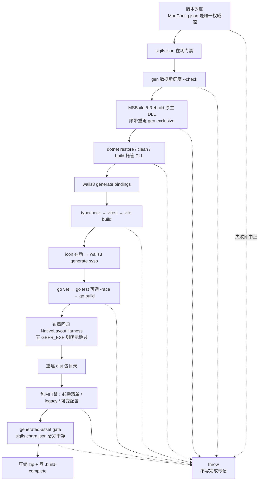
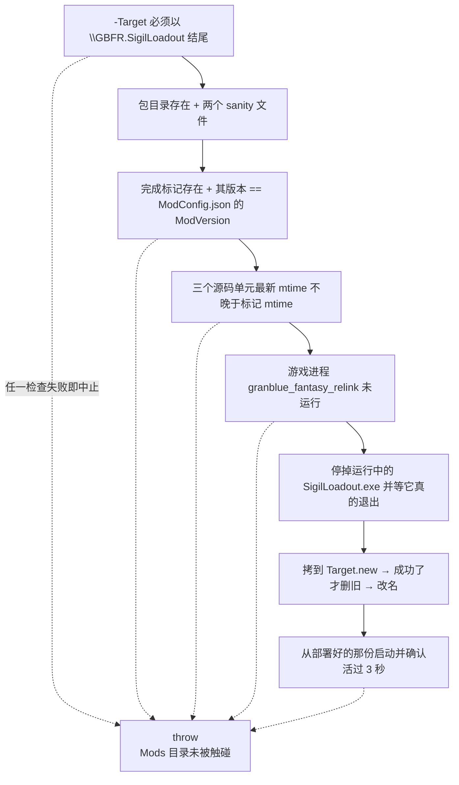

# 构建、发布与部署链

这套 mod 的发布是**两个 PowerShell 脚本**，没有别的入口：`tools\build-release.ps1` 把源码编译成 `dist\GBFR.SigilLoadout\` 目录与同名 zip，`tools\deploy.ps1` 把那个目录**整份替换**进 Reloaded-II 的 Mods 目录。仓库里**没有 CI 构建或发布工作流**（`.github\workflows\` 下只有 OpenWiki 的更新任务），所以整条链都是本机 Windows 操作，且是"先在本地装好一整条工具链"的前提型脚本。

两个脚本共用同一套约定：`$ErrorActionPreference = 'Stop'`，每一步外部命令都查 `$LASTEXITCODE` 并 `throw`，**任一步失败即中止**——不存在"跳过继续"的路径。唯一两处"允许跳过"的地方都会**明说自己跳过了**（`gcc` 缺失时的 `-race`、没有 `GBFR_EXE` 时的布局回归、没有 `.git` 时的生成资产门禁），不是静默通过。

## 两段式与各自的职责边界

| 脚本 | 输入 | 输出 | 谁持有哪份真相 |
| --- | --- | --- | --- |
| `tools\build-release.ps1` | 三个单元的源码 + 仓库旁的 `gen` + 已装好的 `frontend\node_modules` | `dist\GBFR.SigilLoadout\`（包目录）、`dist\GBFR-Sigil-Loadout-<版本>.zip`、`dist\.build-complete` | 发布版本号、**"一个包该有哪些文件"**、所有编译期闸门 |
| `tools\deploy.ps1` | `dist\GBFR.SigilLoadout\` | Reloaded-II Mods 下的 `GBFR.SigilLoadout\`，并从那份重启可视工具 | 只问"这到底是不是一次**跑完了的**构建的产物"，不重复持有文件清单 |

`deploy.ps1` 的 `-Target` 默认值是**某台机器上的绝对路径**（`C:\Users\baago\Desktop\Reloaded-II\Mods\GBFR.SigilLoadout`），换机器必须显式传参；它的第一个检查就是拒绝不以 `\GBFR.SigilLoadout` 结尾的目标——因为紧接着的替换是一次递归删除。



构建流水线的阶段顺序；每个阶段失败都会 `throw` 中止，`dist\.build-complete` 只在整个链路跑完时才写。

| 阶段 | 闸门（失败即中止） | 为什么它在**这一步** |
| --- | --- | --- |
| ① 版本对账 | `-Version` / `ModConfig.json` / `package.json` / `package-lock.json` 四方一致 | 在编译之前，用几毫秒拦住一次注定要被部署检查打回的构建 |
| ② 数据门禁 | `assets\sigils.json` 在场；`gen` 审阅表在场；`--check` 对拍 | 同上，早失败；且不依赖游戏数据在场 |
| ③ 原生 | `MSBuild.exe` 能找到；`/t:Rebuild` 退出码为 0 | 必须在托管之前：托管工程的输出目录要拷它的 DLL |
| ④ 托管 | `dotnet restore/clean/build` 退出码为 0 | — |
| ⑤ 工具 | bindings → typecheck → vitest → vite → syso → vet → test → build 逐条退出码为 0 | 顺序不可换，理由见下节 |
| ⑥ 布局回归 | `GBFR_EXE` 在场时 harness 退出码为 0 | 用真实游戏 exe，故只能可选 |
| ⑦ 重建 dist | dist / 包目录在仓库内；工具进程已退出 | 后面跟着递归删除 |
| ⑧ 包内 | 13 项必需文件齐；无 legacy 产物；无可变配置 | 打包完成后、压缩之前 |
| ⑨ 生成资产 | `sigils.chara.json` 相对入库版本必须干净 | 原生编译刚重写过它，必须在**它之后**查 |
| ⑩ 产物 | zip + `.build-complete`（内容为版本号） | 完成标记必须是最后一步 |

## 版本号的唯一权威源

`GBFR.SigilLoadout\ModConfig.json` 的 `ModVersion` 是发布版本号的唯一权威源：脚本读它作为默认版本，`-Version` 只是"发布时可选覆盖手段"，且必须与它**逐字相等**，否则直接抛 `Version mismatch: …`。`-Version` 只接受 `^[0-9A-Za-z][0-9A-Za-z._-]*$`。

随后是两处对账，因为**可视工具自己也是一份带版本号的 npm 包**，而这两处以前根本没人管——工具界面与包名可以一直停在旧值上：

- `SigilLoadout\frontend\package.json` 的 `version` 必须等于发布版本，否则提示"bump it too"；
- `SigilLoadout\frontend\package-lock.json` 里该版本号必须出现**至少两次**。

`package-lock.json` 的这一条是**按文本数**而不是解析 JSON 的：它的 `packages` 映射有一个空字符串键（`""` 那个根条目），`ConvertFrom-Json` 会为"名称为空字符串的属性"报错。所以脚本用正则数 `"version": "<V>"` 的出现次数，要求 ≥2（根的 `version` 与 `packages[""]` 的那条）。这条门禁的存在理由是：只改 `package.json` 是**最自然**的漏法，而 `npm ci`/`vite` 都不会替你把 lock 里的版本改掉。

版本号只影响 zip 文件名与完成标记的内容，因此两处一致性检查不需要碰程序集版本：`GBFR.SigilLoadout.csproj` **刻意不写 `<Version>`**——那会再造一处需要与 `ModConfig.json` 同步的版本号。同一段里还关掉了 `EnableSourceLink` 与 `IncludeSourceRevisionInInformationalVersion`（默认两者都是 `true`，会把源链接写进 PDB、把 commit sha 追加到 informational version 上），与 Go 那边加 `-buildvcs=false` 是同一个动机：**同一份源码编出同一份元数据**。

一个**没有门禁**的字段：`ModName` 里的括号数字（当前是 `(2.0.5)`）与 `ModVersion` 无关，任何脚本都不校验它。要改显示名只能自己保证一致。

## 构建前的两道数据门禁

它们合起来表达一条设计决定：**构建不替你生成数据**。每次发布都重跑生成器会让"数据源"与"审阅过的数据"之间多出一层无人复核的自动改写，所以脚本只做对拍，不一致就拒绝。

1. **在场**：`SigilLoadout\assets\sigils.json` 必须存在，否则工具起来没有因子表。
2. **新鲜度**：以仓库**外面**的 `..\gen` 为工作目录跑
   `go run . sigils-json <...>\gen\output\sigils.xlsx <仓库>\SigilLoadout\assets\sigils.json --check`。
   不一致 = 忘了跑生成器，报错里直接指路 `go run . sigils`。
   这一步顺带检查那张审阅表与 `gen\main.go` 是否存在，缺了就说清"共享生成器不在 `..\gen`（它不在本仓库里）……所以本仓库无法单独完成一次发布构建"——而不是让 `go run` 抛一句看不懂的错。

历史门禁只剩一半：以前还有一道"character 行必须正好 87 条"，已经删掉（mod 侧不再持有那个数字）。生成器产物的完整待遇差异见 [外部生成器 gen 与随包数据资产](/openwiki/integrations/external-generator-and-assets.md)。

## 三个单元的编译顺序

顺序是 **原生 → 托管 → 工具**，而且不是"随便排的舒服顺序"，两条硬约束都写在工程文件里：

- `GBFR.SigilLoadout.csproj` 用 `PreserveNewest` 从 `..\GBFR.SigilLoadout.Native\bin\$(Configuration)\` 把原生 DLL 拷进托管输出目录（`GBFR.SigilLoadout.Native.dll`）。先建托管就会拷到**上一次**的原生 DLL——打包用的是托管输出目录，于是发出去的是旧原生核心。
- `GBFR.SigilLoadout.Native.vcxproj` 的 `GenerateExclusiveTable` 目标没有 `Condition`、`BeforeTargets="ClCompile"`：只要需要编译，MSBuild 就先在 `..\..\gen` 里跑一次 `go run . exclusive -mod <仓库根>`。这就是"原生 DLL 的编译本身就依赖仓库外的 `gen` 与机器上的 Go"的由来。

原生用 `/t:Rebuild`（强制全量），托管走 `restore --ignore-failed-sources -p:NuGetAudit=false` → `clean` → `build --no-incremental --no-restore`。两处都指向同一件事：**不要拿增量结果当发布产物**。`NuGetAudit=false` 与 `--ignore-failed-sources` 是为了让离线构建保持绿色；漏洞检查是另一条命令（`dotnet list package --vulnerable`），不在发布链里。

MSBuild 的发现方式是 `vswhere -latest -products * -requires Microsoft.Component.MSBuild -find 'MSBuild\**\Bin\MSBuild.exe'`，退回到两个 BuildTools 固定路径，仍找不到就要求装带 C++ 工作负载的 VS 2022 Build Tools。

## 工具链：为什么是这个顺序

`SigilLoadout.exe` 是 Wails v3 应用，它的阶段顺序每一步都在防一种**后续步骤查不出来的错**：

| 顺序 | 命令 | 这一步防的是什么 |
| --- | --- | --- |
| 1 | `wails3 generate bindings` | bindings 是 **gitignore 的生成物**（`SigilLoadout\.gitignore` 忽略 `frontend\bindings\`），而 `App.tsx` 直接 `import … from "../bindings/sigilloadout/loadoutservice"`。缺了它，typecheck 与 vite build 都会红。`tsconfig.json` 因此保持 `noImplicitAny: false`——生成的 JS 没有 `.d.ts`，打开只会对那一句 import 报 TS7016 |
| 2 | `npm --prefix frontend run typecheck`（`tsc --noEmit`） | **vite 只抹掉类型、不做检查**；后面的任何一步都不会发现类型错误，所以必须先跑编译器 |
| 3 | `npm --prefix frontend test`（`vitest run`） | 带着红的测试集发出去的就是没检查过的版本 |
| 4 | `npm --prefix frontend run build` | 产出 `frontend\dist\`，它是 `//go:embed all:frontend/dist` 的输入，会被编进 exe |
| 5 | `icon.png` / `icon.ico` 在场检查 → `wails3 generate syso -arch amd64 -icon icon.ico -manifest app.manifest -out rsrc_windows_amd64.syso` | Windows 只认**链接期资源**（`.syso`），而 `.syso` 要 `.ico`。两个图标都是**手工准备的静态资产**（`.ico` 十档），刻意不为它留生成器 |
| 6 | `go vet ./...` | — |
| 7 | `go test -race ./...`（找不到 gcc 时退回 `go test ./...` 并**明说**跳过竞态检测） | `-race` 需要 cgo、cgo 需要 gcc，而工位上 gcc 通常不在 PATH 上。脚本在 `D:\Programs\mingw64\bin`、`C:\msys64\mingw64\bin`、`C:\mingw64\bin` 里找一遍。`CGO_ENABLED=1` 只在这一条命令上生效再还原——否则下面 `go build` 出来的 exe 会凭空多出一个 libc 依赖 |
| 8 | `go build -trimpath -buildvcs=false -ldflags "-H windowsgui -s -w" -o SigilLoadout.exe .` | `-H windowsgui` 决定它是 GUI 子系统程序；`-buildvcs=false` 同托管侧的 SourceLink 决定 |

两个前置条件脚本**不替你做**：`frontend\node_modules` 必须已装好（脚本里没有 `npm install`/`npm ci`），`wails3`、`go`、`dotnet`、`node`/`npm` 必须在 PATH 上（缺 `wails3` 只会在那一条命令的退出码上暴露）。

产物名 `SigilLoadout.exe` 是**协议的一部分**：托管侧热键按 `Path.Combine(_modDirectory, "SigilLoadout.exe")` 找它（见 [宿主与依赖](/openwiki/integrations/host-and-dependencies.md)）。`ModConfig.json` 的 `ModIcon: "icon.png"` 也是同名的那个文件，打包时从 `SigilLoadout\icon.png` 拷进包根。

## 离线布局回归（可跳过）

`tests\NativeLayoutHarness\run.ps1` 用**真实游戏 exe** 跑一遍生产解析器：`ResolveGameLayout()` 必须成功、`RevalidateGameLayout()` 必须过、然后把一个 hook 点上的字节翻一位，`RevalidateGameLayout()` **必须失败**。它护的是 `layout_resolver.cpp`——仓库里最危险的那段代码；改它或游戏更新时，这是唯一能在本地给出答案的东西（见 [游戏布局锚点](/openwiki/concepts/game-layout-anchors.md)）。harness 本身由 `vcvars64.bat` 导入环境后用 `cl.exe` 把 `program.cpp` + `layout_resolver.cpp` + `safe_game_access.cpp` 编到 `%TEMP%\NativeLayoutHarness.exe`。

跳过条件是脚本刻意设计的：游戏 exe 路径是本机环境、不入库，闸门必须能在任何机器上跑。所以 `build-release.ps1` 只在 `$env:GBFR_EXE` 有值时调用它，否则打印 `layout harness: skipped (set GBFR_EXE to run it).`；`run.ps1` 在没收到 `-Exe` 时自己也打印 `NATIVE_LAYOUT=SKIP` 并以 0 退出。

## 打包与包内门禁

打包前先做安全解析：`dist` 必须位于仓库根之下、包目录必须位于 `dist` 之下，否则拒绝清理（紧接着是递归删除）。然后强杀正在运行的 `SigilLoadout.exe` 并**等到它真的退出**（最长 15 秒）——它锁着 `dist\GBFR.SigilLoadout\SigilLoadout.exe`，会让递归清理失败；等待而不是固定延时，是因为工具持有单实例 mutex，与这次关闭赛跑的重启只会激活那个正在死掉的窗口。

接着是"删干净再重建"：删包目录、删同名 zip、**删完成标记**，重建包目录，把托管输出目录 `bin\<Configuration>\*` 整份拷进来，再补 `SigilLoadout.exe` 与 `icon.png`。随后是三道包内门禁：

- **必需文件清单**——13 项：`GBFR.SigilLoadout.dll`、`GBFR.SigilLoadout.Native.dll`、`SigilLoadout.exe`、`icon.png`，以及 `assets\` 下九份。（`ModConfig.json`、`README.md`、`deps.json` 靠拷整份输出目录带进来，不在清单里。）清单**故意独立**：不从源目录或 csproj 派生，因为派生出来的清单与它们共享同一个真相，于是"忘了加"和"被误删"两种漏法它都查不到（实测过：藏掉一份资产，派生版门禁的退出码仍是 0）。漏一份就等于发一个启动即报错的工具。
- **legacy 产物**——文件名匹配 `GBFR.ExtraSigilSlots*` 或 `*ExtraSigilSlots20*` 即失败。它是上游旧实现的 DLL，混进包里意味着两套槽位逻辑同时生效。
- **可变配置**——`GBFR.SigilLoadoutConfig.ini` / `.pending` 出现在包里即失败。玩家状态必须由运行期在 mod 目录之外创建；这里**故意 fail closed 而不是替你删掉**，因为"它为什么会进包"才是要看见的信息。同一段里 `GBFR.SigilLoadout.pdb` 是直接删掉的（mod 不发 PDB），`runtimes\` 只留 `win-x64`。

### 生成资产门禁（打包前最后一道）

原生编译那一步已经重跑过 `gen exclusive`，而它**重写了入库的** `SigilLoadout\assets\sigils.chara.json`（同一命令的另一样产物 `src\exclusive_table.inc` 则不入库）。改写本身不是错误（说明 `gen` 里的数据源变了），但那份差异**必须进仓库**，否则随包发布的就是一份没人提交过的数据——而"文件既是生成物又是入库数据"这个问题没有别的地方能看见。所以打包前只查这一处：

```
git status --porcelain -- SigilLoadout/assets/sigils.chara.json
```

有输出即失败，报错要求"把它一起提交，或撤销 `gen` 的 `sigils/exclusive.go` 里引起改写的改动"。检出里**没有 `.git`**（例如解压出来的源码包）时，脚本明说跳过——"这里‘未提交’没有意义"——**不假装跑过**。

## 完成标记与 dist 的生命周期

`dist\.build-complete` 是这套链上最关键的一个小文件：打包**一开始就删掉它**，而它只在**所有闸门通过之后**才被写入（内容只有版本号、不带换行）。语义是"这是一次跑完了的构建的产物"。

为什么不能只比时间：构建失败时 `dist` 会原封不动留着上一次的产物，脚本照样装上去并报"成功"（踩过一次）。两个脚本的检查是**互补**的：

- 早阶段失败（例如 typecheck 红）时，旧标记与旧产物都还在原地 → 挡它的是 `deploy.ps1` 的**源码时间戳**检查；
- 晚阶段失败（打包已经开始）时，标记已经被删掉 → 挡它的是**标记缺失**。

最后 `Compress-Archive` 压缩包目录（zip 里因此自带顶层 `GBFR.SigilLoadout` 文件夹，解压即 Mods 目录结构），写标记，然后为了开发方便从 `dist` 里启动一次工具。

一个值得知道的局限：包目录与 zip 名**不含** `-Configuration`，而标记只记版本号。所以 `-Configuration Debug` 会覆盖同名产物，且部署侧的检查区分不出它是 Debug 构建。

## 部署：先验证"这是不是一次完整构建的产物"



部署前的检查顺序；全部通过才会动 Reloaded-II 的 Mods 目录。

逐条与理由：

1. **目标路径后缀**：下文是一次递归删除，`-Target` 敲错绝不能打到无关路径。
2. **包存在且含 `GBFR.SigilLoadout.dll` 与 `SigilLoadout.exe`**：这里只问"它是不是一个包"——"该有哪些文件"的清单只有一个持有者（构建脚本），避免两处清单各自漂移。
3. **完成标记存在**，且其内容与 `GBFR.SigilLoadout\ModConfig.json` 的 `ModVersion` 相同：拦"上一次跑完的产物"和"为另一个版本构建的产物"。
4. **源码时间戳**：只比**参与构建的三个单元**（`GBFR.SigilLoadout\`、`GBFR.SigilLoadout.Native\`、`SigilLoadout\`，排除 `node_modules|bin|obj|dist|.git`）里最新的一个文件与标记的 mtime。工具脚本与文档**刻意不算进来**——改了它们并不需要重新构建，算进来只会让这道闸门在无关改动上挡路，久了就会被绕过。前端产物由 `go:embed` 编进 `SigilLoadout.exe`，所以 `SigilLoadout\` 一并算作构建输入。
5. **游戏已关闭**：`granblue_fantasy_relink` 在跑就拒绝——它的 mod DLL 正是从 Mods 目录加载的。
6. 停掉工具并等待退出（同构建脚本，单实例 mutex 的理由）。
7. **staged 替换**：先整份拷进同级 `<$Target>.new`，成功了才删旧目录、再改名。"先删后拷"中途失败就没有退路。
8. 从**刚部署好的那份**重启工具，3 秒后确认进程还在；第一次没活下来（残留实例还占着 mutex）就全停掉再试一次，仍失败即抛 `SigilLoadout.exe did not stay running after deploy.`。

注意 `deploy.ps1` 部署的是**解包目录**，不校验 zip；zip 只是给玩家/Nexus/GitHub Release 用的分发形态。

## 刻意不做的事

- **不自动跑 gen 重新生成数据**：构建只拿 `--check` 对拍并拒绝。发布链里没有任何自动改写数据源的步骤。
- **不为图标留生成器**：`icon.png`（主图）与 `icon.ico`（exe 资源 + 托盘，十档）都是入库的静态资产，只在改图标时手工重出一次；`.syso` 由 `wails3 generate syso` 从 `.ico` 现生成。托盘 `go:embed` 的也是同一份 `.ico`。
- **不给托管工程加 `<Version>`**：那会再造一处需要与 `ModConfig.json` 同步的版本号；托管程序集自身的版本与发布版本无关。
- **不清理"同名 go build 残留"**：`go.mod` 的模块名是 `sigilloadout`，而产物叫 `SigilLoadout.exe`——两者只差大小写，Windows 不区分大小写，所以那一步清理删掉的就是产品本身。要做纯编译检查就加 `-o <临时路径>`，别在构建脚本里写清理。
- **没有 CI**：发布是本地操作，前置条件包括带 C++ 工作负载的 VS 2022 Build Tools、仓库旁的 `gen\`、Go、Node 与已装好的 `frontend\node_modules`、`wails3`、.NET 8 SDK。
- **不替你装依赖**：不跑 `npm install`，也不在线取 NuGet 包（离线也要能绿）。

## 常见失败与判据行

| 症状 | 判据行（原样） | 下一步 |
| --- | --- | --- |
| 缺 gen（原生编不出来、发布构建停在最早两道检查） | `sigils.json freshness source is missing: …（审阅表在 gen 里生成，不入库；先 cd gen && go run . sigils，不得跳过一致性检查）` 或 `共享生成器不在 …（它不在本仓库里）。…本仓库无法单独完成一次发布构建…` | 把 `gen\` 放回仓库旁，或在有它的机器上构建 |
| 忘了跑生成器，数据与审阅表不一致 | `sigils.json 与 gen\output\sigils.xlsx 不一致：先跑 gen 的 go run . sigils（审阅表在 gen\output\）` | 在 `gen` 里重出审阅表并写回入库那份 |
| 版本号没一起 bump | `Version mismatch: -Version … but ModConfig.json declares …` / `SigilLoadout\frontend\package.json declares … but the release is …; bump it too.` / `…package-lock.json carries version … time(s); both the root entry and the root-package entry need it.…` | 三处一起改 |
| 包少了文件（工具启动即报错） | `Required release file was not packaged: …` | 看是哪一份，别改清单去迁就目录 |
| 包里混进旧实现或玩家配置 | `Legacy ExtraSigilSlots artifact was packaged: …` / `Mutable config state must be runtime-created and was packaged unexpectedly: …` | 从源目录里找出它为什么进来 |
| 原生编译重写了 `sigils.chara.json` 但没提交 | `sigils.chara.json 与入库版本不一致（这次构建重写了它）：… 把它一起提交，或撤销 gen 的 sigils/exclusive.go 里引起改写的改动。` | 提交那份数据，或撤销上游改动 |
| dist 不是一次跑完的构建产物 | `No build-completion marker at …` / `dist was built as version '…' but the repo declares '…'. Run build-release.ps1.` / `The sources changed after the last build (… is newer than the completion marker). Run build-release.ps1 before deploying.` | 重跑 `build-release.ps1` |
| 部署目标不像 mod 目录 | `Refusing to deploy to a path that is not the mod folder: …` | 检查 `-Target` |
| 游戏还开着 | `The game is running; close it first (its Reloaded-II mods are loaded from the Mods folder).` | 先退游戏 |
| 唯一一处"删掉了产品"的错法 | `Loadout tool exe was not built: …` | 说明有人加了"清理裸 `go build` 残留"的步骤 |
| `-race` 被跳过（不是失败） | `  gcc not found: tests run without -race (data-race detection skipped).` | 想让竞态检测真的跑，装 mingw 并放进 PATH |
| 布局回归被跳过（不是失败） | `layout harness: skipped (set GBFR_EXE to run it).` | 设 `$env:GBFR_EXE` 再构建 |

## 相关页面

- [系统总览：三个单元与它们的边界](/openwiki/architecture/overview.md) —— 三个产物的运行时域与依赖关系
- [外部生成器 gen 与随包数据资产](/openwiki/integrations/external-generator-and-assets.md) —— 九份资产的形状、读者与生成器调用点
- [宿主与依赖](/openwiki/integrations/host-and-dependencies.md) —— `ModConfig.json` 各字段的运行期后果与三个目录的分工
- [验证地图：测试与门禁各护什么](/openwiki/testing/verification-map.md) —— 构建里跑的那些测试各自保证什么
