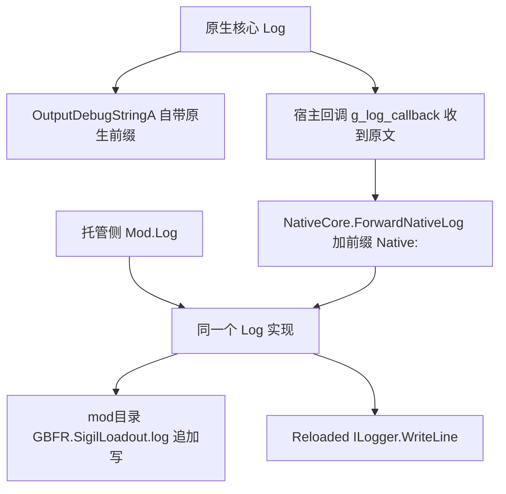
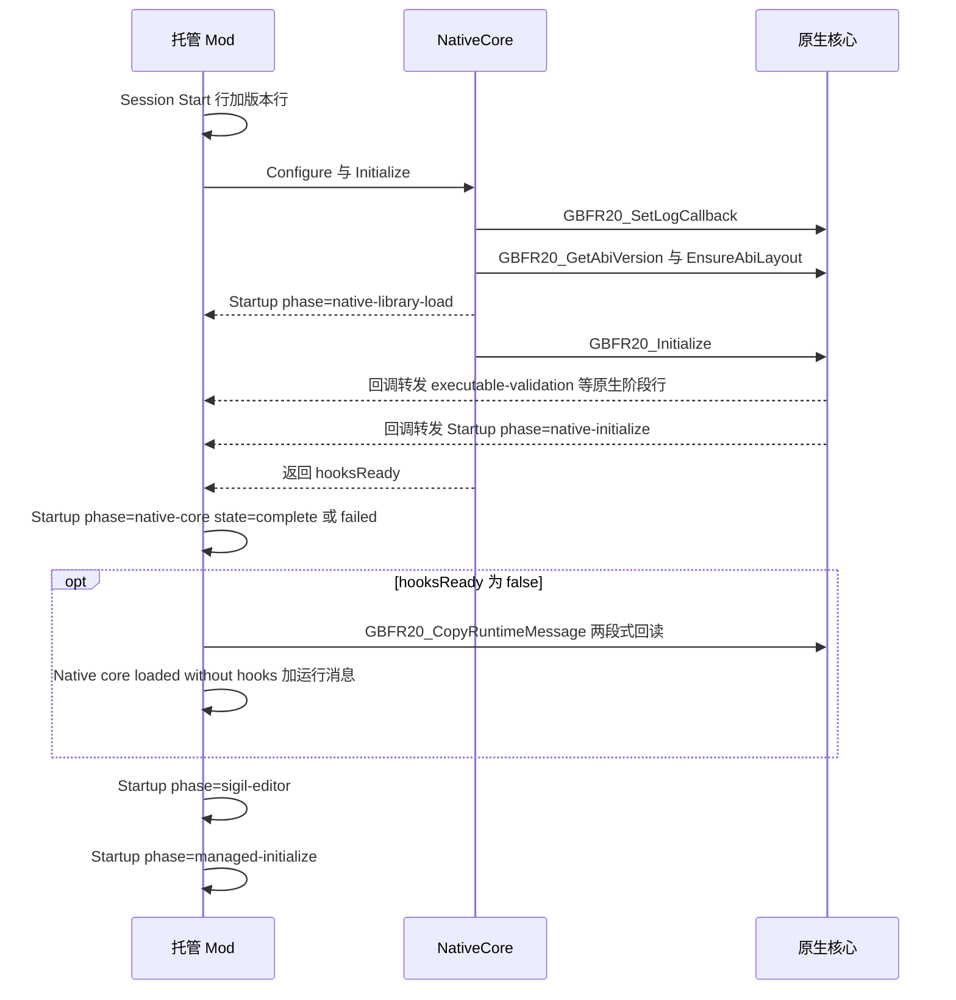

# 日志与故障定位

这套 mod 的失败几乎都是 **fail-soft**：钩子装不上不会拦住游戏，原生拒写不会抛异常，配置读坏不会弹窗（见 [托管 mod](/openwiki/architecture/managed-mod.md)）。于是"为什么没生效"的答案基本只存在于一行日志里。本页只回答操作问题：日志在哪、一行长什么样、某类症状该搜哪一句、那一句意味着什么、下一步做什么。

行里的关键字（`Startup phase=`、`refused`、`ctx1 build`、`party+`、`hot rebuild: skipped`）在两侧实现里就是字面量，可以原样粘进搜索框。

## 1. 读哪一份文件

| 汇 | 位置与形态 | 谁写进去 |
| --- | --- | --- |
| 文件（唯一要看的） | `mod目录\GBFR.SigilLoadout.log`，**追加**写、`AutoFlush`；行格式 `[HH:mm:ss.fff] [GBFR Sigil Loadout] <消息>` | 托管侧唯一的 `Log`，以及经回调转发进来的原生行 |
| 启动器 | Reloaded-II 的 `ILogger.WriteLine`（同一行） | 同上，异常被吞 |
| 调试器 | `OutputDebugStringA`，原生那一份自带 `[HH:mm:ss.mmm] [GBFR Sigil Loadout Native] ` | 原生 `Log` 自己 |

三条关于这份文件的规则：

- **单份上限 4 MiB，只留一代。** 打开之前先看现有长度，超了就删掉旧的 `.1`、把当前份改名成 `GBFR.SigilLoadout.log.1`；轮转失败被 catch 掉（最坏是这份继续变大）。轮转只在**每次启动**判一次，所以单场长会话可以超过 4 MiB。
- **mod 目录每次更新会被整份替换**，历史因此随更新丢一次。正因文件跨会话追加，`======== Session Start yyyy-MM-dd HH:mm:ss ========` 是"这次运行从这里开始"的唯一记号，紧随的 `GBFR Sigil Loadout v<版本> (ABI 20)` 用来确认跑的是哪一版。
- **关停之后原生日志不再进文件**：`NativeCore.Shutdown` 在 `finally` 里把回调置 0，之后原生再说什么只有调试器能看到。

## 2. 原生日志是怎么进到这份文件里的



原生行与托管行走同一个汇；原生的时间戳只出现在调试器那一份里。

两个必须记住的点：

- 回调拿到的消息是**原文**，托管侧统一加 `Native: ` 前缀，所以文件里原生行长这样：`[12:34:56.789] [GBFR Sigil Loadout] Native: Startup phase=native-initialize state=complete elapsed_ms=812.`。搜 `Native: Startup phase=` 就能只看原生的阶段行。
- 转发回调本身被静态字段持有（委托被回收之后原生就在调已释放的函数指针），转发体内所有异常都吞掉——诊断回调绝不让异常展开回原生钩子代码。

## 3. 阶段行：唯一的启动契约

```text
Startup phase=<阶段> state=complete|failed elapsed_ms=<n>.
```

格式只有两处实现、两侧各一份（托管 `NativeCore.StartupPhaseLine`，原生 `CompleteStartupPhase`），所以搜索 `Startup phase=` 就能同时拿到两侧的全部阶段。



原生阶段行夹在 `native-library-load` 与 `native-core` 之间，因为它们都由同一次 `GBFR20_Initialize` 产生。

| 侧 | 阶段名（按发生顺序） | 备注 |
| --- | --- | --- |
| 托管 | `native-library-load` | DLL 加载、ABI 握手、`EnsureAbiLayout` 自检；失败后紧跟 `Initialization failed: …`。**它发在调 `GBFR20_Initialize` 之前**，只量了这三步 |
| 原生 | `executable-validation` | 进程名必须是 `granblue_fantasy_relink.exe` |
| 原生 | `semantic-layout-resolution` | 布局解析；具体断在哪一阶段要看运行消息 |
| 原生 | `template-selection-install` | 数据编译进来，固定 `complete` |
| 原生 | `native-hook-install` | 内含四个子阶段（下表） |
| 原生 | `native-initialize` | 原生整条链的收尾，`state` 就是钩子成没成 |
| 托管 | `native-core` | `GBFR20_Initialize` 的返回值就是 `hooksReady`；**这是"钩子装没装"的判据行** |
| 托管 | `sigil-editor` | 因子编辑器构造 + 启动（唯一慢到值得单独计时的托管步骤） |
| 托管 | `managed-initialize` | 整条 `QueueStart` |
| 原生子阶段 | `required-byte-rva-preflight`、`gem-data-getter-hook`、`skill-fetch-hook`、`skill-loop-limit-patches` | `InstallHooks` 的四步；任一步失败即回滚字节与已装钩子 |

原生子阶段由一个 RAII 对象报：析构时报 `state=failed`，调用点显式 `Succeeded()` 才报 `complete`。所以阶段体抛异常（工程按 `/EHa` 编译）时，栈展开也会留下"崩在哪个阶段"。反过来说，"某一阶段行缺失"里包含一条真实信息：那次运行根本没走到那里。

`elapsed_ms` 两侧各用各的时钟（原生 `GetTickCount64`，托管 `Stopwatch`），只适合比较同一侧相邻行的相对量级。

## 4. 运行消息（`GBFR20_CopyRuntimeMessage`）

- 原生 `SetRuntimeMessage` 做两件事：先把消息 `Log` 出去，再在 mutex 下存进 `g_runtime_message`。所以**消息本身总是会出现在日志里**（以原生行的形式）。
- 托管侧只在 `hooksReady == false` 时回读一次，打出一行 `Native core loaded without hooks: <消息>`。回读是两段式：先 `GBFR20_CopyRuntimeMessage(nullptr, 0)` 问需要多少字节（含结尾 NUL；异常 → 0），上限 64 KiB，返回值 `<= 1` 视为空。
- 于是**同一句原因会出现两次**：一次原生行（`Native: Game layout resolution failed at …`），一次托管行（`Native core loaded without hooks: Game layout resolution failed at …`）。要看"钩子为什么没装"，直接读后一行——它就在 `Startup phase=native-core state=failed` 下面。
- 运行消息是**单人份**、只保存最近一条。健康会话里它最后往往被实战确认消息（`Skill contribution confirmed for 0x…`）覆盖，所以不要指望任何时刻都能回读到 `Native hooks installed: N virtual slots.`——那一句只有它刚被 `SetRuntimeMessage` 写下的那一次在日志里。

### 为什么那行没出现：去重规则

这套日志刻意留白，缺一行往往就是设计。搜不到某行之前先对照：

| 去重规则 | 涉及的行 | 什么时候才会有 |
| --- | --- | --- |
| 拒绝码变了才报 | `WriteSkillStatusTable: refused (<码>): <原因>` | 与上一次报过的码不同；中间成功过一次会清零，下一次拒写值得再报 |
| 同一版文件只报一次 | `hot apply: …`、`sigil edit: …`、`sigil edit FAIL: …` 系列 | `sigiledits.json` 的 mtime 变了才重新开口；同版重试全程静默 |
| 版本门无条件认领 | `Invalid loadout.json; kept previous configuration: …`、`Applied custom loadout, slots=N.` | `loadout.json` 每次 mtime 变化只处理一次，成败一样 |
| 数量变了才报 | `Installed built-in template loadout selections=…` | 装出来的槽位总数与上次不同 |
| 记录真变了才报 | `ctx1 build: …`、`party+ …` | 一次构建会被两条循环各问一次，只有第一份记录打印；见过的角色不再打印 |
| 进程内只报一次 | `sigil edit: IDataManager is not available yet; …` | 第一次没拿到数据管理器时 |
| 节流窗口刻意静默 | `hot rebuild` 那一组 | 节流 CAS 命中时不打印（每个 tick 都可能命中）；其他跳过原因各有自己一行 |

推论：**"还在拒写"这件事在日志里看不出来**。想确认现在还拒不拒，在工具里再存一次并看是否出现 `hot apply: SUCCESS`。

## 5. 五类典型故障

每张表是"症状 → 该搜的日志行 → 含义 → 下一步"。尖括号是占位符，不是字面量。

### 5.1 钩子未装

症状：进游戏后虚拟槽位不生效（预配的角色专属槽没出现），且搜不到 `Native hooks installed:`。

| 该搜的日志行 | 含义 | 下一步 |
| --- | --- | --- |
| `Startup phase=native-core state=failed` | `GBFR20_Initialize` 返回 0。mod 照常加载，配装与因子编辑仍然工作 | 往上找第一条 `state=failed` 的原生阶段行 |
| `Native core loaded without hooks: <运行消息>` | 原生给出的失败原因 | 按消息分流 |
| `Startup phase=native-library-load state=failed` + `Initialization failed: …` | DLL 加载 / ABI 握手 / 布局自检没过 | `Native core not found: <路径>` → 装包不全；`Native ABI mismatch: managed 20, native <x>.` 或 `ABI layout mismatch: …` → 两边 DLL 不是同一版 |
| `Startup phase=executable-validation state=failed` | 进程不是 `granblue_fantasy_relink.exe` | 确认注入到了游戏本体 |
| `layout preflight FAILED: rva=0x… preflight_offset=0x… checked_at=0x… bytes=…` | 布局解析停在**具体哪一条**预检上 | 游戏构建变了，见 [语义锚点与布局解析](/openwiki/concepts/game-layout-anchors.md) |
| `Startup phase=gem-data-getter-hook state=failed`（或另外三个子阶段之一） | `InstallHooks` 在这一步失败；循环上限字节与已装钩子已回滚 | 运行消息里是同一个原因（如 `Failed to install the GemData getter hook.`） |
| `Table slot: resolved slot=0x…`（成功）/ `Table slot: …; nothing resolved.`（失败，四条各指一步） | 活表槽的解析结果。**它与钩子成没成无关**——`ResolveTableSlot` 排在装钩子之前，失败只记日志不中止 | 失败会让活表写入永远是 -2，见 5.2 |

布局失败时 `Startup phase=semantic-layout-resolution state=failed` 也在，但"断在哪一阶段"那句话只在运行消息里。

### 5.2 活表拒写

症状：工具里改了因子数值、文件也存了，游戏里没变。术语上这是"活表"没被改写，见 [skill_status 表与活表写入闸门](/openwiki/concepts/skill-status-table.md)。

| 该搜的日志行 | 含义 | 下一步 |
| --- | --- | --- |
| `hot apply: the native write was refused (<码>); the edit list is saved and re-registered, so the game picks it up at its next parse` | 托管层只说本层后果：没写进内存，但表已存盘且已重新注册 | 看紧跟其上的原生行拿码和原因 |
| `WriteSkillStatusTable: refused (<码>): <人话原因>` | 码 + 原因；**只在码变化时出现一次** | 按码分流 |
| `hot apply: SUCCESS - rows=<n> of the game's own table rewritten in place at its boot slot in <ms> ms` | 真的写进去了，`<n>` 是改写的 52 字节行数 | 这是"这一版处理完了"的唯一记号 |
| `sigil edit FAIL: system/table/skill_status.tbl is not the 8-byte header + 52-byte row table this mod patches: <字节数> bytes, header rows=<行数>. Nothing applied.` | 传入表形状不对（托管侧预检，早于原生） | 游戏表布局变了 |

| 码 | 含义 | 下一步 |
| --- | --- | --- |
| -1 `NOT_READY` | 原生没初始化好，或正在关机 | 关机路径上属正常 |
| -2 `SLOT_UNRESOLVED` | 启动时锚点没解出槽 | 搜 `Table slot:` 系列 |
| -3 `BUFFER_UNREADABLE` | 槽里没指针，或那块内存不可写 | 最常见的是游戏还没把表读进内存：等（下一次解析或重启后落地），不要当成配置错误 |
| -4 `ROW_COUNT_INCONSISTENT` | 活表首 u64 与传入表的行数不符 | 不是同一张表 |
| -5 `LENGTH_UNEXPECTED` | 传入长度不是 `8 + 52×行数` | 见上面的 FAIL 行 |
| -6 `IDENTITY_MISMATCH` | 逐行 `Key` 对不上（Key 被别的 mod 改过，或表换了） | 别覆盖，查冲突的改表 mod |
| -7 `WRITE_FAILED` | 写的过程中崩了，表**可能只更新了一部分** | 唯一"写之后"的码，按最保守处理 |

拒写期间托管侧每 5 秒重试一次（250ms 一拍没意义），候选表被复用所以不必每次从归档重建 328 KB；这些重试**不产生日志**。

### 5.3 IDataManager 未就绪

症状：因子编辑一直不生效；日志里没有 `sigil edit: IDataManager attached`。

| 该搜的日志行 | 含义 | 下一步 |
| --- | --- | --- |
| `sigil edit: IDataManager is not available yet; the edit list waits for gbfrelink.utility.manager to load` | 可选依赖还没加载；这句只说一次 | 确认 gbfrelink.utility.manager 已装且启用；只要它出现，维护拍每 250ms 会一直重试 |
| `sigil edit: IDataManager attached` | 接上了 | 之后才可能有 `hot apply` 系列 |
| `sigil edit FAIL: IDataManager controller not found (is gbfrelink.utility.manager enabled?)` | 这一拍想读表，但手上没有管理器 | 同第一行 |
| `sigil edit FAIL: GetArchiveFile('system/table/skill_status.tbl') returned nothing` | 管理器在，但归档里取不到这张表 | 游戏数据或依赖版本问题 |
| `sigil edit: nothing applied - the table could not be read, or its layout is not the one this build patches (see the lines above)` | 这一版没造出表 | 读它上方的 FAIL 行；特性已"启动过"，但每一拍仍会重来 |

编辑列表本身读不出来是另一回事（`sigil edit: list load failed: …`，见 5.5）。

### 5.4 资产缺失

症状：双击 `SigilLoadout.exe` 弹一个红叉对话框，然后什么都不发生——`-H windowsgui` 没有控制台，写到 stderr 没人看得见。

| 该搜的日志行 | 含义 | 下一步 |
| --- | --- | --- |
| 对话框正文：`随包数据读不到，工具无法启动：` + 具体错误 + `它应当与 SigilLoadout.exe 一起放在 assets\ 下。` | 启动期要读的七份之一读不到或不是合法 JSON；工具随即 `exit 1` | 错误文本里带着出错路径（`读随包数据 <路径>: …`）或 `随包数据 <名字> 不是合法 JSON: …` |
| 工具窗口里的失败提示（无日志行） | `sigils.json` / `sigils.chara.json` 是**按需读**的，失败不弹对话框、也不进任何日志 | 在这两个文件上找原因：它们在 `assets\` 下 |
| `SigilLoadout.exe not found in the mod directory.` | 热键或托盘想拉起工具，但 mod 目录里没有它 | 装包不全 |
| `Native core not found: <路径>`（出现在 `Initialization failed: …` 里） | 原生 DLL 缺失或路径不对 | 装包不全 |
| `sigil edit FAIL: GetArchiveFile(…) returned nothing` | 游戏归档侧取不到表 | 见 5.3 |

随包数据一共九份，启动时读**七份**（`sigils.lang.json`、`chara.lang.json`、`skill_status.json`，以及 `skill.<zh|en|ja|ko>.json` 四份），另两份按需读。

### 5.5 配置坏文件

两个 JSON 的失败语义**不一样**：`loadout.json` 坏了就"保留上一份有效配置"，`sigiledits.json` 坏了就"什么都不写"（绝不把一份不完整的表盖进游戏）。两者都是同一版只报一次。

| 该搜的日志行 | 含义 | 下一步 |
| --- | --- | --- |
| `Invalid loadout.json; kept previous configuration: <消息>` | 形状 / 大小（>1 MB）/ JSON 坏；上一份有效配置继续生效 | 修或删 `%LOCALAPPDATA%\GBFRSigilLoadout\loadout.json` |
| `loadout.json removed; restored the built-in exclusive template.` | 文件被删是**真实答案**（= 只剩内置专属模板），不是错误 | 无需处理 |
| `loadout.json has no general slots; built-in exclusive template active.` | 配置存在但通用槽为空 | 正常 |
| `Native rejected the custom loadout; kept previous configuration.` | 原生拒绝了这次应用（如计数越界） | 结合紧邻的原生行定位 |
| `Applied custom loadout, slots=<n>.` | 应用成功 | 是否"可见"还要等下一场战斗 |
| `exclusive: '<键>' is not a character hash; ignored.` / `has a non-hash skill key '<键>'; ignored.` | `exclusive` 里用了显示标签之类的非 hash 键 | 用角色 hash / 技能 hash |
| `sigil edit: list load failed: <异常>` | `sigiledits.json` 读不出来（不是 JSON 对象、没有 `edits` 成员、`edits` 不是数组、超过 1 MB） | 修文件；这一拍什么都不写，下一拍还会重试 |
| `sigil edit: no edit list yet at <路径> (the tool writes it there)` | 文件还不存在 | 用工具存一次；这也是"工具从没跑过"的记号 |
| `sigil edit: no edit reached a row (<n> enabled); not writing the table back` | 列表读到了，但一条都没落到行上 | 往上找逐条的跳过原因 |
| `sigil edit:   skip (disabled)` / `skip (key is not an 8-digit hex hash yet)` / `skip (level <n> is below the first level)` / `<KEY> L<LEVEL>: row not found` / `slot <n> is not a finite number (<值>)` | 逐条被跳过的原因 | 按行修 `sigiledits.json` |
| `Hotkey configuration unavailable: <消息>; falling back to the default F1 hotkey.` | 热键配置读不出来 | 不影响其它功能，F1 仍可用 |
| `RegisterHotKey unavailable (key may be taken); fallback polling active.` | 该键被别的程序占用，退回 250ms 轮询 | 换一个键 |

## 6. 配装热重建：跳过与失败的行

这一组行来自维护拍驱动的状态重建，是第二条高频日志来源。跳过大多**是正常的**——改动仍会在游戏下一次自然构建时落地。

| 该搜的日志行 | 含义 | 下一步 |
| --- | --- | --- |
| `hot rebuild: skipped (game is building)` | 游戏此刻正在建状态（250ms 静默窗内） | 正常；同一份 status 被两边同时碰就是竞态 |
| `hot rebuild: skipped (party changed just now)` | 换人 / 切场景后 2 秒内 | 正常，实测崩溃都发生在这个窗口里 |
| `hot rebuild: skipped (cooling down after a failed rebuild)` | 上一次重建失败后的 60 秒冷却 | 等冷却；反复出现就看 `status rebuild:` |
| `hot rebuild: no party known yet; skipped` | 还没认出队伍 | 进场景 / 战斗后会出现 `ctx1 build`、`party+` |
| `hot rebuild: char=0x… skipped (left the party: assembly <a> < <b>)` | 这份 status 属于上一轮装配，游戏已把它拆掉 | 正常：不去戳内存垃圾 |
| `hot rebuild: char=0x… status=0x… pass=… ok=0` + `hot rebuild: cooling down 60s (a rebuild failed)` | 重建调用失败 | 真因看同一拍的 `status rebuild:` 行 |
| `status rebuild: refused before the call (identity mismatch)` / `the game's rebuild raised; the object was probably gone` / `identity changed after the call` | 三种失败原因：身份不符 / 重建抛异常 / 重建后身份变了 | 都表示对象已不可信，进入 60 秒冷却 |
| `ctx1 build: char=0x… status=0x… pass=…` | 观察到一次 context-1（在场那份）构建；记录真变了才打印 | 这是"游戏认出了这个角色在场"的证据 |
| `party+ char=0x… (<n> known)` | 首次见到某个角色 | 队伍名单在增长 |
| `Skill contribution confirmed for 0x…: <n>/<m> virtual sigils reached the context-1 status.` | 虚拟槽位真的进了角色状态；每会话只报一次 | 健康会话里出现一次即可 |
| `Skill contribution incomplete for 0x…: <n>/<m> …` | 有槽位没进去；**每次**都报 | 看 `hot rebuild` 是否被跳过、配装是否超容量 |

## 7. 可视工具：诊断默认静默，以及怎么打开

工具的窗口状态诊断走一个**标记文件开关**：

- `debugf` 每次调用先看 `exeDir()\tool-debug.on` 是否存在；不存在立即返回，不存在就什么文件都不产生。存在则向同目录 `tool-debug.log` 追加一行 `HH:MM:SS.mmm <消息>`。
- **为什么默认静默**：正式安装从不创建那个标记，所以玩家永远不会在 mod 目录里多出诊断文件（mod 目录每次更新会被整份替换，也不适合放可变状态）。
- **怎么打开**：在 `SigilLoadout.exe` 旁边（也就是 mod 目录）建一个**空文件** `tool-debug.on`。内容不参与判断（只看存不存在），也**不需要重启**——每次调用都重新判定；删掉即恢复静默，`tool-debug.log` 是追加写的，自己删即可。
- **打开后能读到什么**：假隐藏 / 显出这条链上的每一步，例如 `fakeHide post hwnd=… target=…`、`hideNow hwnd=… fg=… target=…`、`pre-setfg fg=… target=…`、`SetForegroundWindow(<hwnd>) ret=… err=… fgNow=…`、`replay cursor-hiding click (hold)`、`EnableWindow ret=…`、`revealTool hwnd=…`、`WM_CLOSE hwnd=…`、`0x8010 prev=… hidden=…`。
- **它不含单实例与托盘那几行**：那几处走标准库 `log`，而 exe 以 `-H windowsgui` 编译、全代码里没有任何 `log.SetOutput`，所以正式构建里那几行无处可见。
- 写不进日志文件时静默返回；实现是每次调用 OpenFile + Close，适合窗口事件这种低频量，别往里塞高频采样。

单实例与关闭路径：

- 单实例判据是 `CreateMutexW("Local\\GBFRSigilLoadout")` 返回 `ERROR_ALREADY_EXISTS`。第二次启动找到已有窗口 → `ShowWindow(SW_SHOW)` + post `0x8010` + `SetForegroundWindow` → `os.Exit(0)`。它**不持有**互斥体（没有 `WaitForSingleObject`、也不 `ReleaseMutex`），句柄刻意不关——命名对象要活到进程退出才满足这个判据；创建失败只记一行然后继续跑。可观察的结果只有"已经开着的窗口被拉到前台"。
- 关闭路径要防的是防抖里压着的那份编辑：`app.OnShutdown` 注册了两个 `flushNow`（编辑列表与配装各一个），并且必须在 `window.Close()` 之前置 `quitting`，否则那记 `WM_CLOSE` 会被当成"用户点了 X"改道成假隐藏（`windowstate.go` 是这条状态机的唯一所有者）。
- 写盘失败的可见通道**不在日志里**：`debouncedWriter` 把待写放回、`log.Printf`（GUI 构建里看不到），再向前端发 `GBFR.SigilLoadout.SaveFailed` 事件 → 工具窗口里弹失败对话框。所以看到"保存失败"提示时，别去翻 `tool-debug.log`。

## 8. 这些契约由谁钉住

- `SigilLoadout/sharedconstants_test.go` 对拍两份字面量：窗口标题（mod 靠它找窗口）、三条窗口消息、用户配置目录与两个文件名、以及 `GBFR.SigilLoadout.SaveFailed` 事件名（Go 发、前端收——只改一边不会编译失败，只会让那张失败对话框永远不弹）。
- `SigilLoadout/editservice_test.go` 的写失败用例：写入做不成时那行必须落进日志（测试直接抓 `log` 输出），并且待写必须放回——没有后续编辑而直接退出时，`flushNow` 是它唯一的机会。
- `tests/NativeLayoutHarness` 用真实游戏 exe 验布局解析与 fail-closed（改坏一个 hook 字节必须让复验失败）；不给 `GBFR_EXE` 时它打印 `NATIVE_LAYOUT=SKIP` 并以 0 退出，所以它是一条可跳过的门禁，见 [构建、发布与部署链](/openwiki/operations/build-and-release.md)。
