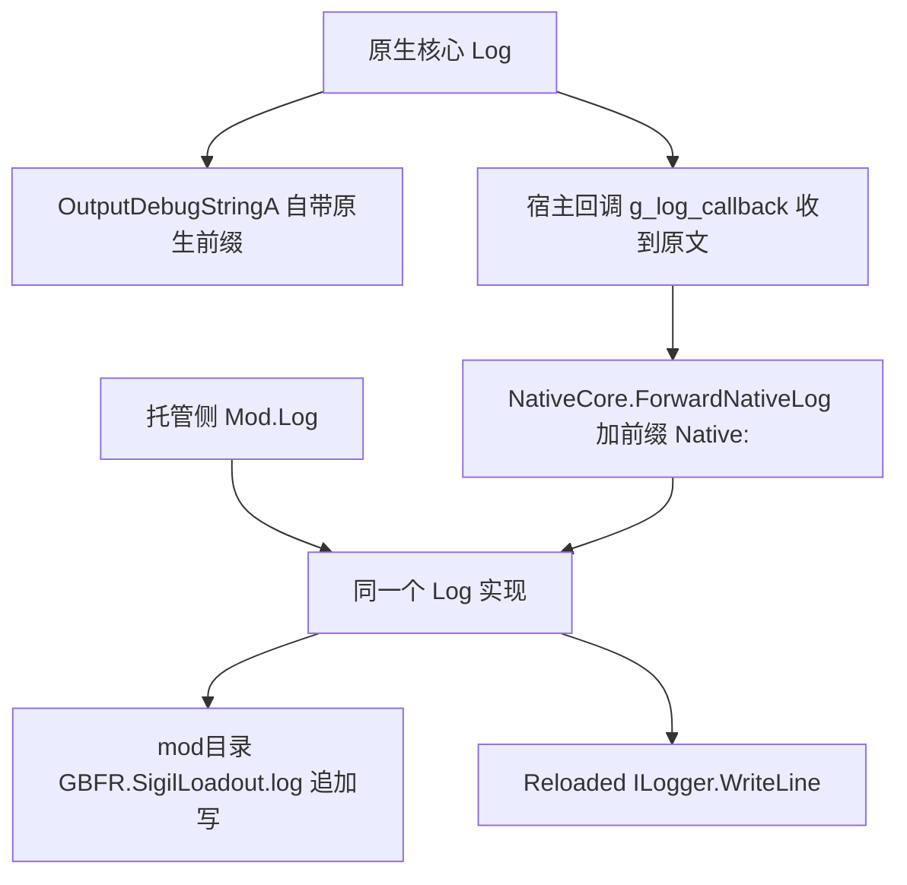
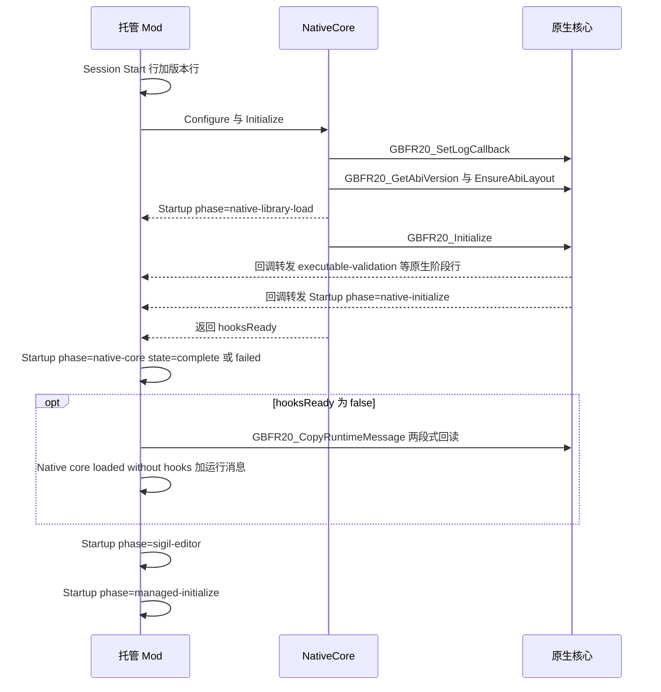
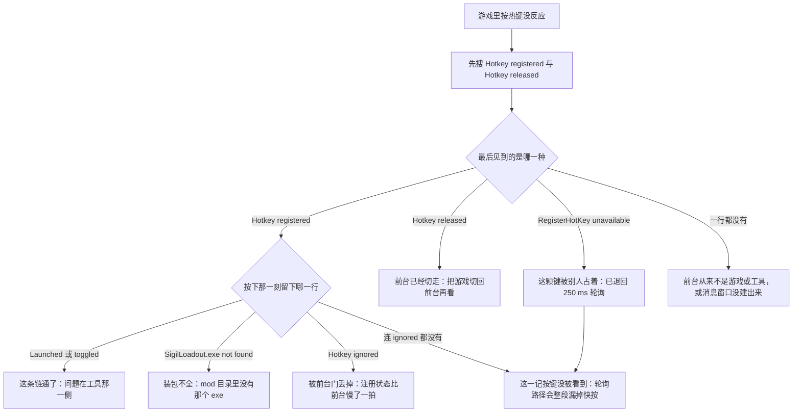

# 日志与故障定位

这套 mod 的失败几乎都是 **fail-soft**：钩子装不上不会拦住游戏，原生拒写不抛异常，配置读坏不弹窗（见 [托管 mod（C# Reloaded 外壳）](/openwiki/architecture/managed-mod.md)）。于是"为什么没生效"的答案基本只存在于一行日志里。

本页按**症状**组织，不按文件组织：每一类症状给一条「**先看哪一行 → 再看哪一行 → 决定性判据**」的定位顺序，再附该症状可能出现的全部行与它们的含义。行里的关键字（`Startup phase=`、`refused`、`hot apply:`、`ctx1 build`、`party+`、`hot rebuild: skipped`、`Hotkey registered` / `Hotkey released`）在实现里就是字面量，可以原样粘进搜索框。

## 1. 三类日志落点：先确认在看哪一份

| 汇 | 位置与形态 | 谁写进去 |
| --- | --- | --- |
| 文件（唯一要看的） | `mod目录\GBFR.SigilLoadout.log`，**追加**写、`AutoFlush`；行格式 `[HH:mm:ss.fff] [GBFR Sigil Loadout] <消息>` | 托管侧唯一的 `Log`（`Mod.Log`），以及经回调转发进来的原生行 |
| 启动器 | Reloaded-II 的 `ILogger.WriteLine`（同一行文本） | 同上，写失败被吞 |
| 调试器 | `OutputDebugStringA`，**只有这一份**带原生自己的时间戳与 `[GBFR Sigil Loadout Native]` 前缀 | 原生 `Log` 自己 |

**原生侧没有独立的日志文件**：它只往 `OutputDebugStringA` 写一份、再调宿主注册的回调（见下一节）。要找原生说的话，就在托管那份文件里搜 `Native: `。

四条关于这份文件的规则：

- **单份上限 4 MiB，只留一代。** 打开之前先看现有长度，超了就删掉旧的 `.1`、把当前份改名成 `GBFR.SigilLoadout.log.1`；轮转失败被 catch 掉（最坏是这份继续变大）。轮转只在**每次启动**判一次，所以单场长会话可以超过 4 MiB。
- **mod 目录每次更新会被整份替换**，历史因此随更新丢一次。正因文件跨会话追加，`======== Session Start yyyy-MM-dd HH:mm:ss ========` 是"这次运行从这里开始"的唯一记号，紧随的 `GBFR Sigil Loadout v<版本> (ABI 20)` 用来确认跑的是哪一版。用户配置不在 mod 目录，而在 `%LOCALAPPDATA%\GBFRSigilLoadout`（见 [两个配置文件与跨语言常量契约](/openwiki/concepts/config-file-contracts.md)）。
- **日志文件本身是初始化路径上的硬依赖**：轮转失败会被吞，但 `StreamWriter` 建不出来（目录不可写、文件被独占）会直接走 `QueueStart` 的兜底 catch，打一行 `Initialization failed: <异常>` 然后 `Dispose()`——此时 mod 不再工作，而那一行只可能出现在 Reloaded-II 的 `ILogger` 里，因为文件汇还没建起来。
- **关停之后原生日志不再进文件**：`NativeCore.Shutdown` 在 `finally` 里把回调置 0，之后原生再说什么只有调试器能看到。

## 2. 原生行是怎么进到这份文件里的



原生行与托管行走同一个汇；原生的时间戳只出现在调试器那一份里。

三个必须记住的点：

- 回调拿到的消息是**原文**，托管侧统一加 `Native: ` 前缀，所以文件里原生行长这样：`[12:34:56.789] [GBFR Sigil Loadout] Native: Startup phase=native-initialize state=complete elapsed_ms=812.`。搜 `Native: Startup phase=` 就能只看原生的阶段行。
- 转发回调本身被静态字段持有（委托被回收之后原生就在调已释放的函数指针），转发体内所有异常都吞掉——诊断回调绝不让异常展开回原生钩子代码（见 [原生核心（C++ DLL）](/openwiki/architecture/native-core.md)）。
- 原生 `Log` 自己也保证不抛：格式化失败退化成不带时间戳的原文，宿主回调那一份单独兜。

## 3. 两个契约：阶段行与运行消息

### 3.1 阶段行是唯一的启动契约

```text
Startup phase=<阶段> state=complete|failed elapsed_ms=<n>.
```

格式只有两处实现、两侧各一份（托管 `NativeCore.StartupPhaseLine`，原生 `CompleteStartupPhase`），所以搜索 `Startup phase=` 就能同时拿到两侧的全部阶段。



原生阶段行夹在 `native-library-load` 与 `native-core` 之间，因为它们都由同一次 `GBFR20_Initialize` 产生。

| 侧 | 阶段名（按发生顺序） | 备注 |
| --- | --- | --- |
| 托管 | `native-library-load` | DLL 加载、ABI 握手、`EnsureAbiLayout` 自检；失败后紧跟 `Initialization failed: …`。**它发在调 `GBFR20_Initialize` 之前**，只量了这三步 |
| 原生 | `executable-validation` | 进程名必须是 `granblue_fantasy_relink.exe` |
| 原生 | `semantic-layout-resolution` | 布局解析失败时：解析链的哪一步看运行消息里的 `… failed at <阶段>`，哪一条预检看 `layout preflight FAILED` 行 |
| 原生 | `template-selection-install` | 数据编译进来，固定 `complete` |
| 原生 | `native-hook-install` | 内含四个子阶段（下表） |
| 原生 | `native-initialize` | 原生整条链的收尾，`state` 就是钩子成没成 |
| 托管 | `native-core` | `GBFR20_Initialize` 的返回值就是 `hooksReady`；**这是"钩子装没装"的判据行** |
| 托管 | `sigil-editor` | 因子编辑器构造 + 启动（唯一慢到值得单独计时的托管步骤） |
| 托管 | `managed-initialize` | 整条 `QueueStart` |
| 原生子阶段 | `required-byte-rva-preflight`、`gem-data-getter-hook`、`skill-fetch-hook`、`skill-loop-limit-patches` | `InstallHooks` 的四步；任一步失败即回滚字节与已装钩子 |

原生子阶段由一个 RAII 对象上报：析构时若没人报过就报 `state=failed`，调用点则显式调 `Succeeded(<布尔结果>)` 把实际结果写成 `complete`/`failed`。所以阶段体抛异常（工程按 `/EHa` 编译）时，栈展开也会留下"崩在哪个阶段"的阶段行。反过来说，"某一阶段行缺失"里包含一条真实信息：那次运行根本没走到那里。

`elapsed_ms` 两侧各用各的时钟（原生 `GetTickCount64`，托管 `Stopwatch`），只适合比较同一侧相邻行的相对量级。

### 3.2 运行消息（`GBFR20_CopyRuntimeMessage`）

- 原生 `SetRuntimeMessage` 做两件事：先把消息 `Log` 出去，再在 mutex 下存进 `g_runtime_message`。所以**消息本身总是会出现在日志里**（以原生行的形式）。
- 托管侧只在 `hooksReady == false` 时回读一次，打出一行 `Native core loaded without hooks: <消息>`。回读是两段式：先 `GBFR20_CopyRuntimeMessage(nullptr, 0)` 问需要多少字节（含结尾 NUL；异常 → 0），上限 64 KiB，返回值 `<= 1` 视为空。
- 于是**同一句原因会出现两次**：一次原生行（`Native: Game layout resolution failed at resolved layout final validation; gameplay hooks were not installed and persisted sigil selections were left unchanged.`），一次托管行（`Native core loaded without hooks: ` 加同一句）。要看"钩子为什么没装"，直接读后一行——它就在 `Startup phase=native-core state=failed` 下面。
- 运行消息是**单人份**、只保存最近一条。健康会话里它最后往往被实战确认消息（`Skill contribution confirmed for 0x…`）覆盖，所以不要指望任何时刻都能回读到 `Native hooks installed: N virtual slots.`——那一句只有它刚被 `SetRuntimeMessage` 写下的那一次在日志里。

### 3.3 缺一行往往就是设计：去重规则

这套日志刻意留白。搜不到某行之前先对照：

| 去重规则 | 涉及的行 | 什么时候才会有 |
| --- | --- | --- |
| 拒绝码变了才报 | `WriteSkillStatusTable: refused (<码>): <原因>` | 与上一次报过的码不同；中间成功过一次会清零，下一次拒写值得再报 |
| 同一版文件只报一次 | `hot apply: …`、`sigil edit: …`、`sigil edit FAIL: …` 系列 | `sigiledits.json` 的 mtime 变了才重新开口；同版重试全程静默（另有 5 秒节流） |
| 版本门无条件认领 | `Invalid loadout.json; kept previous configuration: …`、`Applied custom loadout, slots=<n>.` | `loadout.json` 每次 mtime 变化只处理一次，成败一样 |
| 数量变了才报 | `Installed built-in template loadout selections=…` | 装出来的槽位总数与上次不同 |
| 记录真变了才报 | `ctx1 build: …`、`party+ …` | 一次构建会被两条循环各问一次，只有第一份记录打印；见过的角色不再打印 |
| 进程内只报一次 | `sigil edit: IDataManager is not available yet; …` | 第一次没拿到数据管理器时 |
| 每会话只报一次 | `Skill contribution confirmed for 0x…: <n>/<m> virtual sigils reached the context-1 status.` | 第一次实战确认；`incomplete` 那一条**每次都报** |
| 节流窗口刻意静默 | `hot rebuild` 那一组 | 节流 CAS 命中时不打印（每个 tick 都可能命中）；其他跳过原因各有自己一行 |
| 注册状态翻转才动手 | `Hotkey registered: …` / `RegisterHotKey unavailable (key may be taken); fallback polling active.` / `Hotkey released: another program is in the foreground.` | 前台在「游戏或工具」与「别的程序」之间翻转的那一刻各写一行；因为只在**期望态变化**时动手，注册失败不会每拍重试、也不会每拍刷一行，而关停（消息循环退出）时只清标志、**不打** `released` |

推论：**"还在拒写"这件事在日志里看不出来**。想确认现在还拒不拒，在工具里再存一次并看是否出现 `hot apply: SUCCESS`。

## 4. 症状：游戏里没生效

**症状**：mod 装好了、游戏里也没崩，但虚拟槽位或改过的因子数值看起来没变化。

**先看哪一行 → 再看哪一行 → 判据**

1. **先**看这次运行的开头两行（`======== Session Start …`、`GBFR Sigil Loadout v… (ABI 20)`）：确认这段日志属于哪一次运行、跑的是哪一版——文件是跨会话追加的。
2. **再**搜 `Startup phase=`：`native-core state=complete` 还是 `failed`。**判据**：`failed` 就没有虚拟槽位，直接转 §5。
3. **再看**钩子装成之后那两条正面判据：`Native: Native hooks installed: <n> virtual slots.`（这次扩到几个虚拟槽）与 `Installed built-in template loadout selections=<n>. …; inventory-independent.`（内置专属模板装出几个槽）。
4. **如果只是因子数值没变**，搜 `hot apply:`。**判据**：出现 `hot apply: SUCCESS - rows=<n> …` 说明表已被改写；只有 `hot apply: the native write was refused (<码>)` 就转 §6；连 `hot apply` 都没有说明这一版根本没造出表（看 `sigil edit: …` 系列）。
5. **判据（时序）**：因子编辑的**描述**与**实际效果**是两件事——表被改写后游戏里对应的因子描述立刻更新，而**实际效果要到下一次战斗开始时生效**（见 [工作流：因子数值编辑与热应用](/openwiki/workflows/sigil-edit-apply.md)）。所以"描述变了、伤害没变"不是故障；"描述也没变"才是表没被改写。
6. **判据（虚拟槽位）**：进一次战斗后搜 `Skill contribution confirmed for 0x…: <n>/<m> virtual sigils reached the context-1 status.`——这是虚拟槽位真的进了角色状态的证据，每会话只报一次。它的 `incomplete` 版本**每次都报**，说明有槽位没进去：看 `hot rebuild` 是否被跳过（§9）、配装是否超容量。

其余相关行：

| 该搜的日志行 | 含义 | 下一步 |
| --- | --- | --- |
| `Native: Layout resolved and validated from semantic anchors (PE 0x…).` + `Native:   getter=0x… SystemData=0x…` | 布局解析成功，括号里那个 PE 时间戳就是这次匹配上的游戏构建 | 记录它；游戏更新后对不上就是重导信号，见 [语义锚点与布局解析（fail-closed 的核心）](/openwiki/concepts/game-layout-anchors.md) |
| `Applied custom loadout, slots=<n>.` | 玩家配置被接受并应用 | 是否"可见"还要等下一场战斗；链路见 [工作流：配装从界面到游戏状态](/openwiki/workflows/loadout-apply.md) |
| `Native: ApplyLoadout: counts out of range (slots <n> > 24, overrides <m> > 96); rejected.` | 调用方给的计数越界（上界是虚拟槽容量 24 与运行时模板容量 32 × 3），原生直接拒 | 配置或工具写的载荷不对 |
| `Skill contribution incomplete for 0x…: <n>/<m> virtual sigils reached the context-1 status.` | 有虚拟槽位没能进入 context-1 状态 | 看同拍的 `hot rebuild` 与配装容量 |
| `virtual skill selection: threw; treated as no selection.` / `TryGetRuntimeSlot: threw; treated as no gem in this slot.` | 运行期兜底异常，这一次当成"没有选择/没有因子" | 出现即异常路径，见 [工作流：游戏侧注入运行期（detour 与循环上限）](/openwiki/workflows/skill-injection-runtime.md) |

### 4.1 子症状：因子编辑一直不生效（数据管理器还没接上）

因子编辑要用的表来自 `gbfrelink.utility.manager`，而那是**可选依赖**，可能比本 mod 晚加载。所以"接上了吗"是这条链上第一个判据：

| 该搜的日志行 | 含义 | 下一步 |
| --- | --- | --- |
| `sigil edit: IDataManager is not available yet; the edit list waits for gbfrelink.utility.manager to load` | 可选依赖还没加载；这句**只说一次** | 确认 gbfrelink.utility.manager 已装且启用；只要它出现，维护拍每 250 ms 会重试直到接上 |
| `sigil edit: IDataManager attached` | 接上了 | 之后才可能有 `hot apply` 系列 |
| `sigil edit FAIL: IDataManager controller not found (is gbfrelink.utility.manager enabled?)` | 这一拍想读表，但手上没有管理器 | 同第一行 |
| `sigil edit FAIL: GetArchiveFile('system/table/skill_status.tbl') returned nothing` | 管理器在，但归档里取不到这张表 | 游戏数据或依赖版本问题 |
| `sigil edit: nothing applied - the table could not be read, or its layout is not the one this build patches (see the lines above)` | 这一版没造出表（特性已"启动过"，但每一拍仍会重来） | 读它上方的 FAIL 行 |
| `sigil edit: there is no edit list yet, or it could not be read (see the line above); nothing applied and the table was not written back` | 列表不存在也读不出来 | 区分"文件被删"（空列表，见 §8）与"读坏了" |

编辑列表本身读不出来是另一回事（`sigil edit: list load failed: …`，见 §8）。

## 5. 症状：钩子未装

**症状**：进游戏后虚拟槽位不生效（预配的角色专属槽没出现），且搜不到 `Native hooks installed:`。

**先看哪一行 → 再看哪一行 → 判据**

1. **先**搜 `Startup phase=native-core state=failed`。**判据**：这是托管的判据行，`GBFR20_Initialize` 返回了 0。mod 本身照常加载，因子编辑（活表写入不要求钩子）仍可能成功，但虚拟槽位不会有——配装应用会被原生拒（`Native rejected the custom loadout; kept previous configuration.`），因为 `GBFR20_ApplyLoadout` 以 `hooks_ready` 为前置条件。
2. **再**读它下面那一行 `Native core loaded without hooks: <运行消息>`。**判据**：这句就是原生给出的失败原因，按它分流到下表。
3. **然后**按原因往上找**最后一条** `state=failed` 的原生阶段行（`executable-validation` / `semantic-layout-resolution` / `native-hook-install` 或它的四个子阶段之一），它告诉你断在链路的哪一步。

| 该搜的日志行 | 含义 | 下一步 |
| --- | --- | --- |
| `Startup phase=native-library-load state=failed` + `Initialization failed: …` | DLL 加载 / ABI 握手 / 布局自检没过 | `Native core not found: <路径>` → 装包不全；`Native ABI mismatch: managed 20, native <x>.` 或 `ABI layout mismatch: …` → 两边 DLL 不是同一版 |
| `Startup phase=executable-validation state=failed` + `This native core only supports granblue_fantasy_relink.exe.` | 进程不是 `granblue_fantasy_relink.exe` | 确认注入到了游戏本体 |
| `Startup phase=semantic-layout-resolution state=failed` | 布局解析失败；这一行本身只说明失败发生在解析阶段 | 解析链的哪一步看运行消息里的 `Game layout resolution failed at <阶段>`，哪一条预检看下面那行 `layout preflight FAILED` |
| `Native:   layout preflight FAILED: rva=0x… preflight_offset=0x… checked_at=0x… bytes=…` | 布局解析停在**具体哪一条**预检上 | 游戏构建变了，见 [语义锚点与布局解析（fail-closed 的核心）](/openwiki/concepts/game-layout-anchors.md) |
| `Startup phase=gem-data-getter-hook state=failed`（或另外三个子阶段之一） | `InstallHooks` 在这一步失败；循环上限字节与已装钩子已回滚 | 运行消息里是同一个原因（如 `Failed to install the GemData getter hook.`） |
| `Native: Hook rollback: failed to restore the skill-apply loop limit.` / `…the skill-category loop limit.` | 回滚本身也没成：那个循环上限字节仍停在扩展值 | 关机重启前别再热重建；这是"回滚不完整"的唯一记号 |
| `Native: Hook teardown timed out waiting for in-flight calls; hooks left installed.` | 关机时在途 detour 没排空，宁可留着钩子也不释放活调用还在跑的内存 | 只出现在退出路径，正常关停不该有 |
| `Native: Table slot: resolved slot=0x…`（成功）/ 四条 `Table slot: …nothing resolved.`（失败） | 活表槽的解析结果。**它与钩子成没成无关**——`ResolveTableSlot` 排在装钩子之前，失败只记日志不中止 | 失败会让活表写入永远是 `-2`，见 §6 |

运行消息的具体取值（都在原生侧拼好，再经托管那行透出）：`Could not resolve the game executable path.`、`This native core only supports granblue_fantasy_relink.exe.`、`Game layout resolution failed at <阶段>; gameplay hooks were not installed and persisted sigil selections were left unchanged.`、`Resolved game layout changed before hook installation; no gameplay hook or byte patch was installed.`、`Failed to install the GemData getter hook.`、`Failed to install the skill fetch-path hook.`、`Failed to patch both native skill loop limits; changes were rolled back.`

## 6. 症状：活表拒写

**症状**：在工具里改了因子数值、文件也存了，游戏里没变。术语上这是"活表"没被改写，见 [skill_status 表与活表写入闸门](/openwiki/concepts/skill-status-table.md)。

**先看哪一行 → 再看哪一行 → 判据**

1. **先**搜 `hot apply:`。**判据**：`hot apply: SUCCESS - rows=<n> …` 是"这一版处理完了"的**唯一**记号；只要没有它，这一版就还没生效。
2. **再**看那一行拒写：`hot apply: the native write was refused (<码>); the edit list is saved and re-registered, so the game picks it up at its next parse`。托管层只说本层后果：没写进内存，但列表已存盘、已重新注册。
3. **然后**在它上方找原生行 `Native: WriteSkillStatusTable: refused (<码>): <人话原因>`，拿码与原因（**只在码变化时出现一次**）。**判据**：按下面的码表分流。
4. **如果连 `hot apply:` 都没有**，说明这一版根本没造出表，转 §4.1 与 §8 的 `sigil edit: …` 系列（最常见的是 `sigil edit: IDataManager is not available yet; …`）。

| 该搜的日志行 | 含义 | 下一步 |
| --- | --- | --- |
| `hot apply: the native write was refused (<码>); …` | 托管层只说本层后果：没写进内存，但表已存盘且已重新注册 | 看紧跟其上的原生行拿码和原因 |
| `Native: WriteSkillStatusTable: refused (<码>): <人话原因>` | 码 + 原因；只在码变化时出现一次 | 按码分流 |
| `hot apply: SUCCESS - rows=<n> of the game's own table rewritten in place at its boot slot in <ms> ms` | 真的写进去了，`<n>` 是改写的 52 字节行数 | 这是"这一版处理完了"的唯一记号 |
| `sigil edit FAIL: system/table/skill_status.tbl is not the 8-byte header + 52-byte row table this mod patches: <字节数> bytes, header rows=<行数>. Nothing applied.` | 传入表形状不对（托管侧预检，早于原生） | 游戏表布局变了 |
| `hot apply: nothing to apply - the table could not be read, or its layout is not the one this build patches (see the lines above)` | 这一版没造出表 | 读它上方的 FAIL 行 |
| `hot apply: the edit list matches what is already in memory; nothing to do` | 字节与已交上去的那份完全相同，跳过 | 正常；这一版也算处理完了 |

| 码 | 含义 | 下一步 |
| --- | --- | --- |
| -1 `NOT_READY` | 原生没初始化好，或正在关机 | 关机路径上属正常 |
| -2 `SLOT_UNRESOLVED` | 启动时锚点没解出槽 | 搜 `Table slot:` 系列 |
| -3 `BUFFER_UNREADABLE` | 槽里没指针，或那块内存不可写 | 最常见的是游戏还没把表读进内存：等（下一次解析或重启后落地），不要当成配置错误 |
| -4 `ROW_COUNT_INCONSISTENT` | 活表首 u64 与传入表的行数不符 | 不是同一张表 |
| -5 `LENGTH_UNEXPECTED` | 传入长度不是 `8 + 52×行数` | 见上面的 FAIL 行 |
| -6 `IDENTITY_MISMATCH` | 逐行 `Key` 对不上（Key 被别的 mod 改过，或表换了） | 别覆盖，查冲突的改表 mod |
| -7 `WRITE_FAILED` | 写的过程中崩了，表**可能只更新了一部分** | 唯一"写之后"的码，按最保守处理 |

拒写期间托管侧每 5 秒重试一次（250 ms 一拍没意义，而每次尝试都会走一遍原生写入），候选表被复用所以不必每次从归档重建 328 KB；同版重试**不产生日志**（原生也只在码变化时开口）。

## 7. 症状：工具起不来

**症状**：双击 `SigilLoadout.exe` 什么都不发生，或弹一个红叉对话框；也可能是"热键呼不出来"。

"按了热键没反应"这一类只从**注册状态**这一侧分流（判据的机制与两侧分工见 [托管 mod（C# Reloaded 外壳）](/openwiki/architecture/managed-mod.md) §8.2–8.4）：



热键没反应的定位顺序：先确定这颗键**此刻归谁**，再看按键那一刻有没有留下放行行。

**先看哪一行 → 再看哪一行 → 判据**

1. **先**看屏幕上有没有对话框。**判据**：有对话框就说明是**随包数据**（启动期读的那七份）缺了或不是合法 JSON，工具随即 `exit 1`——`-H windowsgui` 没有控制台，写 stderr 没人看得见，所以这是它唯一的出口。对话框正文：`随包数据读不到，工具无法启动：` + 具体错误 + `它应当与 SigilLoadout.exe 一起放在 assets\ 下。`
2. **如果窗口能开、只是呼不出来**，看 mod 侧日志里的热键几行（它们进的是 `GBFR.SigilLoadout.log`，不是工具日志）。**先**搜 `Hotkey registered` 与 `Hotkey released`：这对行是**状态翻转**才写的，所以要看**最后留下的是哪一个**（为什么键要在运行期交还，见 [托管 mod（C# Reloaded 外壳）](/openwiki/architecture/managed-mod.md) §8.2）。
   - 最后一次是 `Hotkey registered: <键名> (0x<码>) via RegisterHotKey.` → 这颗裸键此刻归本进程独占，按键由消息路径接住。**同一会话里它反复出现是正常的**：每切回一次前台就重新注册、重写一行。
   - 最后一次是 `Hotkey released: another program is in the foreground.` → 前台已经切走、键已还回去，这时按下去不会有反应，直到游戏或工具重新成为前台。**这一行不代表刚才注册成功过**：期望态一翻到"不是我们"就无条件打它，它上面那一条同类行也可能是 `RegisterHotKey unavailable …`。关停（消息循环退出）时只清两个标志、不打这一行，所以日志末尾缺 `released` 是正常的。
   - **一次都没有** → 这次运行里前台从来不是游戏或工具（mod 装好时游戏在后台、之后一直在别的窗口里操作，或启动器窗口一直握着焦点）：不是故障，切到游戏就会有第一行。若日志里同时有 `Hotkey message window creation failed; …`，那是另一个原因：窗口没建出来时根本不进这条同步逻辑，永远不会写这两行。
   - `RegisterHotKey unavailable (key may be taken); fallback polling active.` → 这颗键被别的程序占着，回退到 250 ms 轮询（这段期间仍可用）；它同样跟着期望态走，所以**每切回一次前台会再报一次**，而不是每拍刷一行。
   - `Hotkey message window creation failed; fallback polling active.` → 连消息窗口都建不出来，只剩轮询回退。
   - `Hotkey ignored: neither the game nor the tool was in the foreground.` → 这一记按键**被看到了**、但被前台门丢掉。它出现就说明前台已经不是游戏或工具，而**注册状态最多滞后一拍**（键还注册着的时候，这一记按键本该被系统吃掉、前台程序根本收不到它）；由轮询那半边负责响应时，在别的程序里按键也走这一行。
3. **再看**按热键那一刻的放行结果：`Launched loadout editor tool.`（真的起了进程，mod 目录里有 exe）或 `Loadout tool is already running; toggled.`（窗口已存在，这一记只是开关，见 [工作流：热键呼出/收起可视工具（F1 到窗口显隐的完整链路）](/openwiki/workflows/hotkey-summon.md)）或 `SigilLoadout.exe not found in the mod directory.`（装包不全，mod 目录里没有它）。这四行（连同 `Hotkey ignored: …`）在**注册路径与轮询路径上共用同一个实现**，所以选中的动作与措辞一致，缺行只说明这一记按键根本没被看到。
4. **判据（第二次启动）**：再点一次 exe 不会弹错、也不会留下任何日志——第二个实例检测到 `Local\GBFRSigilLoadout` 已存在，就把已有窗口 `ShowWindow(SW_SHOW)` + post `0x8010` + `SetForegroundWindow`，然后 `os.Exit(0)`。可观察的结果只有"已经开着的那个窗口被拉到前台"。

| 该搜的日志行 / 现象 | 含义 | 下一步 |
| --- | --- | --- |
| 对话框正文 `随包数据读不到，工具无法启动：` + `它应当与 SigilLoadout.exe 一起放在 assets\ 下。` | 启动期要读的七份之一读不到或不是合法 JSON；工具随即 `exit 1` | 错误文本里带着出错路径（`读随包数据 <路径>: …`）或 `随包数据 <名字> 不是合法 JSON: …` |
| 工具窗口里的失败提示（**无日志行、无对话框**） | `sigils.json` / `sigils.chara.json` 是**按需读**的，失败不弹对话框、也不进任何日志 | 在这两个文件上找原因：它们在 `assets\` 下 |
| `Hotkey registered: <键名> (0x<码>) via RegisterHotKey.` | 从这一刻起这颗裸键**全局独占**地归本进程（别的程序收不到它） | 反复出现是正常的：每次切回前台重新注册一行 |
| `Hotkey released: another program is in the foreground.` | 已 `UnregisterHotKey`、键还给别的程序；**无条件打出**，不代表刚才注册成功过 | 按下去没反应就是预期行为，切回前台再试；关停时不打这一行 |
| `Hotkey ignored: neither the game nor the tool was in the foreground.` | 这一记按键被看到、但被前台门丢掉：前台已经不是游戏或工具（注册状态最多滞后一拍），或此刻正由轮询那半边响应 | 一般无需处理，切回游戏再按；连续出现说明前台一直不是你 |
| `Hotkey configuration unavailable: <消息>; falling back to the default F1 hotkey.` | 热键配置读不出来 | 不影响其它功能，F1 仍可用 |
| `SigilLoadout.exe not found in the mod directory.` | 热键想拉起工具，但 mod 目录里没有它 | 装包不全 |
| `Native core not found: <路径>`（出现在 `Initialization failed: …` 里） | 原生 DLL 缺失或路径不对 | 装包不全 |
| 工具关于窗口状态的诊断 | 默认完全静默 | 建一个 `tool-debug.on` 打开，见 §10 |

随包数据一共九份，启动时读**七份**（`sigils.lang.json`、`chara.lang.json`、`skill_status.json`，以及 `skill.<zh|en|ja|ko>.json` 四份），另两份（`sigils.json`、`sigils.chara.json`）按需读。

按需读的那两份失败后只落在工具窗口那条状态条上（对应 `sigil` 与 `exclusive` 两个 kind），既不进任何日志、也不弹对话框——状态条上每句话各自意味着什么，见 §10.1。

## 8. 症状：配置坏文件

两个 JSON 的失败语义**不一样**：`loadout.json` 坏了就"保留上一份有效配置"，`sigiledits.json` 坏了就"什么都不写"（绝不把一份不完整的表盖进游戏）。两者的去重机制也不同：前者靠版本门的**认领**（`Changed()` 无论随后成败都推进版本），所以同一份坏配置只报一次、不会被 250 ms 一拍反复重灌；后者只在**确实写进游戏内存后**才推进版本，所以失败的那一版下一拍还会重试，但同版重试静默（5 秒节流）。

**先看哪一行 → 再看哪一行 → 判据**

1. **先**搜这一版有没有被报到：`Invalid loadout.json; kept previous configuration: <消息>` 或 `sigil edit: list load failed: <异常>`。**判据**：前者保留上一份配置，后者这一拍什么都不写；两条都只报一次。
2. **再**看逐条的跳过原因：`sigil edit:   skip (…)` 与 `sigil edit:   <KEY> L<LEVEL>: row not found` 系列。**判据**：`sigil edit: no edit reached a row (<n> enabled); not writing the table back` 说明列表读到了，但一条都没落到行上——真因就在它上面那几行里。
3. **判据（文件被删）**：`loadout.json removed; restored the built-in exclusive template.` 是**真实答案**而不是错误：删掉配装文件等于"只剩内置专属模板"。`sigil edit: no edit list yet at <路径> (the tool writes it there)` 同理，它也是"工具从没跑过"的记号。

| 该搜的日志行 | 含义 | 下一步 |
| --- | --- | --- |
| `Invalid loadout.json; kept previous configuration: <消息>` | 形状 / 大小（> 1 MB）/ JSON 坏；上一份有效配置继续生效 | 修或删 `%LOCALAPPDATA%\GBFRSigilLoadout\loadout.json` |
| `loadout.json removed; restored the built-in exclusive template.` | 文件被删是真实答案（= 只剩内置专属模板） | 无需处理 |
| `loadout.json has no general slots; built-in exclusive template active.` | 配置存在但通用槽为空 | 正常 |
| `Native rejected the custom loadout; kept previous configuration.` | 原生拒绝了这次应用（如计数越界，上方有 `Native: ApplyLoadout: counts out of range …`；钩子未装成时这一句没有对应的原生行） | 结合紧邻的原生行与 `Startup phase=native-core` 定位 |
| `Applied custom loadout, slots=<n>.` | 应用成功 | 是否"可见"还要等下一场战斗 |
| `exclusive: '<键>' is not a character hash; ignored.` / `exclusive: '<角色键>' has a non-hash skill key '<键>'; ignored.` | `exclusive` 里用了显示标签之类的非 hash 键 | 用角色 hash / 技能 hash，见 [虚拟槽位、模板因子与专属开关](/openwiki/concepts/virtual-slots-and-exclusives.md) |
| `sigil edit: list load failed: <异常>` | `sigiledits.json` 读不出来（不是 JSON 对象、没有 `edits` 成员、`edits` 不是数组、超过 1 MB） | 修文件；这一拍什么都不写，下一拍还会重试 |
| `sigil edit: no edit list yet at <路径> (the tool writes it there)` | 文件还不存在 | 用工具存一次；这也是"工具从没跑过"的记号 |
| `sigil edit: no edit reached a row (<n> enabled); not writing the table back` | 列表读到了，但一条都没落到行上 | 往上找逐条的跳过原因 |
| `sigil edit:   skip (disabled): <哈希>` / `skip (key is not an 8-digit hex hash yet): <键>` / `skip (level <n> is below the first level): <键>` / `<KEY> L<LEVEL>: row not found` / `<KEY> L<LEVEL>: slot <n> is not a finite number (<值>); left as the game has it` | 逐条被跳过的原因 | 按行修 `sigiledits.json` |
| `sigil edit: the edit list changed while the table was being built; it will be applied on the next tick` | 建表期间文件又变了，这一版作废（不推进版本） | 无需处理：下一拍按新版本重来 |
| `Hotkey configuration unavailable: <消息>; falling back to the default F1 hotkey.` / `RegisterHotKey unavailable (key may be taken); fallback polling active.` | 热键配置读不出来，或该键被别的程序占着（后者跟着注册状态翻转走，每切回一次前台再报一次） | 换一个键；不影响其它功能，判据链见 §7 |

## 9. 附：配装热重建那一组行

这一组行来自维护拍驱动的状态重建（配装改动除换选择外，还会对**已知的出战角色**各重建一次），是第二条高频日志来源。跳过大多**是正常的**——改动仍会在游戏下一次自然构建时落地（战斗中游戏不会自己重建 context-1，所以这条热重建是战斗里唯一的落地机会，见 [并发、锁序与生命周期守卫](/openwiki/concepts/threading-and-locks.md)）。

| 该搜的日志行 | 含义 | 下一步 |
| --- | --- | --- |
| `hot rebuild: skipped (game is building)` | 游戏此刻正在建状态（250 ms 静默窗内） | 正常；同一份 status 被两边同时碰就是竞态 |
| `hot rebuild: skipped (party changed just now)` | 换人 / 切场景后 2 秒内 | 正常，实测崩溃都发生在这个窗口里 |
| `hot rebuild: skipped (cooling down after a failed rebuild)` | 上一次重建失败后的 60 秒冷却 | 等冷却；反复出现就看 `status rebuild:` |
| `hot rebuild: no party known yet; skipped` | 还没认出队伍 | 进场景 / 战斗后会出现 `ctx1 build`、`party+`；注意这一条也会推掉那 500 ms 节流 |
| `hot rebuild: char=0x… skipped (left the party: assembly <a> < <b>)` | 这份 status 属于上一轮装配，游戏已把它拆掉 | 正常：不去戳内存垃圾 |
| `hot rebuild: char=0x… skipped (no context-1 status seen)` | 队伍名单里有、但没记到它那份对象 | 正常，等游戏自己构建 |
| `hot rebuild: char=0x… status=0x… pass=… ok=0` + `hot rebuild: cooling down 60s (a rebuild failed)` | 重建调用失败 | 真因看同一拍的 `status rebuild:` 行 |
| `status rebuild: refused before the call (identity mismatch) (char=0x… status=0x…)` / `the game's rebuild raised; the object was probably gone …` / `identity changed after the call …` | 三种失败原因：身份不符 / 重建抛异常 / 重建后身份变了 | 都表示对象已不可信，进入 60 秒冷却 |
| `ctx1 build: char=0x… status=0x… pass=…`（可带 ` (new object)`、` (via our rebuild)`、` (new party member)`） | 观察到一次 context-1（在场那份）构建；记录真变了才打印 | 这是"游戏认出了这个角色在场"的证据 |
| `party+ char=0x… (<n> known)` | 首次见到某个角色 | 队伍名单在增长 |

节流窗口（CAS 认领 500 ms）命中时**刻意静默**：每个 tick 都可能命中，写日志只会把有信息量的跳过淹掉。

## 10. 工具侧窗口诊断：默认静默，以及怎么打开

工具的窗口状态诊断走一个**标记文件开关**：

- `debugf` 每次调用先看 `exeDir()\tool-debug.on` 是否存在；不存在立即返回——**什么文件都不产生**。存在才向同目录 `tool-debug.log` 追加一行 `HH:MM:SS.mmm <消息>`。
- **为什么默认静默**：正式安装从不创建那个标记，所以玩家永远不会在 mod 目录里多出诊断文件（mod 目录每次更新会被整份替换，也不适合放可变状态）。
- **怎么打开**：在 `SigilLoadout.exe` 旁边（也就是 mod 目录）建一个**空文件** `tool-debug.on`。内容不参与判断（只看存不存在），也**不需要重启**——每次调用都重新判定；删掉即恢复静默，`tool-debug.log` 是追加写的，自己删即可。
- **打开后能读到什么**：假隐藏 / 显出这条链上的每一步，例如 `fakeHide post hwnd=… target=…`、`hideNow hwnd=… fg=… target=…`、`pre-setfg fg=… target=…`、`SetForegroundWindow(<hwnd>) ret=… err=… fgNow=…`、`replay cursor-hiding click (hold)`、`EnableWindow ret=…`、`revealTool hwnd=…`、`hideToTray (frontend Esc/X)`、`WM_CLOSE hwnd=…`、`WM_SYSCOMMAND SC_MINIMIZE hwnd=…`、`wmToggle hwnd=… fg=… hidden=… rf=… game=… -> <动作>`（这一记开关被判成收起 / 显出 / 丢掉哪一个）、`0x8010 prev=… hidden=…`（没覆盖焦点目标时写作 `0x8010 prev=… (kept …) hidden=…`）。
- **两处"缺行"是设计**：真正退出时那记 `WM_CLOSE`（`quitting` 已置）直接交回默认处理，**不打** `WM_CLOSE hwnd=…`；标题栏最小化走 `WM_SYSCOMMAND` 而不是 `WM_CLOSE`，所以那条路上只会有 `WM_SYSCOMMAND SC_MINIMIZE hwnd=…`。
- **它不含单实例与托盘那几行**：那几处走标准库 `log`，而 exe 以 `-H windowsgui` 编译、全代码里没有任何 `log.SetOutput`，所以正式构建里那几行无处可见。
- 写不进日志文件时静默返回；实现是每次调用 OpenFile + Close，适合窗口事件这种低频量，别往里塞高频采样。

单实例与关闭路径（这两条决定了"为什么点了没反应"）：

- 单实例判据是 `CreateMutexW("Local\\GBFRSigilLoadout")` 返回 `ERROR_ALREADY_EXISTS`。第二个实例只把已存在的窗口 `ShowWindow(SW_SHOW)` + post `0x8010` + `SetForegroundWindow`，然后 `os.Exit(0)`。它**不持有**互斥体（没有 `WaitForSingleObject`、也不 `ReleaseMutex`），句柄刻意不关——命名对象要活到进程退出才满足这个判据；创建失败只记一行然后继续跑。
- 关闭路径要防的是防抖里压着的那份编辑：`app.OnShutdown` 注册了两个 `flushNow`（编辑列表与配装各一个），并且必须在 `window.Close()` 之前置 `quitting`，否则那记 `WM_CLOSE` 会被当成"用户点了 X"改道成假隐藏（`windowstate.go` 是这条状态机的唯一所有者）。
- 写盘失败的可见通道**不在日志里**：`debouncedWriter` 把待写放回、`log.Printf`（GUI 构建里看不到，行形如 `sigil edit: creating the config folder <路径>: …`），再向前端发 `GBFR.SigilLoadout.SaveFailed` 事件 → 工具窗口里弹失败对话框。所以看到"保存失败"提示时，别去翻 `tool-debug.log`，那确实是唯一一条用户可见的通道。

### 10.1 工具侧唯一一条失败通道：`failureText` 的五个 kind

工具外壳（`App.tsx`）只有一条失败通道：失败是一个带 `kind` 的状态，由 `failureText` 渲染成 Tab 栏下方那一条 `aria-live` 状态条——谁失败都只是把它写进这里，屏幕上最多显示一条。**它不写日志、也不写 `tool-debug.log`**，所以"工具窗口里那句话"本身就是证据：先按它说的去查那份文件，而不是去找日志。`kind` 只有这五种，各自的屏幕原文在 `messages.ts`（随界面语言变）：

| `kind` | 屏幕上看到的中文 | 谁设置它 | 判据 / 下一步 |
| --- | --- | --- | --- |
| `sigil` | `因子表加载失败：<错误>` | 启动时 `LoadSigils()` 失败（`assets\sigils.json` 读不到或解析不了） | 按需读的那一份，见 §7 |
| `exclusive` | `专属因子表加载失败：<错误>` | 启动时 `LoadExclusives()` 失败（`assets\sigils.chara.json`） | 同上 |
| `config` | `配装加载失败：<错误>` | `LoadConfig()` 读不回来，或读回来的 `loadout.json` 过不了解析 | 此时前端**绝不写盘**（`loadoutRead` 仍为假），槽位被铺成空数组——屏幕上"空的"不等于磁盘被清空 |
| `save` | `自动保存失败：<错误>` | `saveNow` 里 `SaveLoadout` **当场**拒绝（形状/取值不当，见 §8） | 这是配装文件的形状问题；修文件，不要找日志 |
| `tables` | `数据表未加载，无法保存` | `saveNow` 发现因子表还没读回来，于是**拒绝保存**并把这条提示留下 | 真因在 `sigil` 那一条上，先修表 |

只有 `save` 会自己消失：下一次保存成功时 `saveNow` 就把 `save` 清掉（它只清这一种），另外四种要等另一个失败覆盖它、或窗口重开。另有两处最容易误判：

- **因子表读不回来时 `tables` 会顶掉 `sigil`**：你一动手编辑，状态条上真正的那条根因（`因子表加载失败：…`）就被"数据表未加载，无法保存"盖住了。屏幕上只剩后者时，要往上追 `sigil`。
- **`config` 失败时屏幕空、磁盘还在**：前端在配装读回来之前绝不写盘，所以那份空配装不会被写回，`loadout.json` 仍是原来那份（它坏在哪见 §8）。

状态条之外还有第二个对话框，归因子编辑页自己（标题 `读取失败` / `写入失败`）：

- 它接收编辑列表的读失败（`LoadEdits` / `SkillTable` / 语言文本表）与 `SaveEdits` **当场**拒绝（列表形状完全无法接受）。
- 它还接收**防抖之后才失败**的写盘：`debouncedWriter.flushLocked` 写失败时把待写放回（下一次防抖或退出时的 `flushNow` 就是重试）、`log.Printf`（GUI 构建里看不到）、再推 `GBFR.SigilLoadout.SaveFailed` 事件；那个事件唯一的监听方就是这个页面，所以连 `loadout.json`（配装）的防抖写失败也弹在这一页的对话框里，`<错误>` 里带着路径与原因。
- 事件名是**跨语言镜像常量**：Go 侧 `editservice.go` 的 `saveFailedEvent` 与前端 `SigilEditorPanel.tsx` 的 `SAVE_FAILED` 各写一份字面量，**必须同时改**——只改一边不会编译失败，只会让那个对话框永远不弹。

## 11. 这些契约由谁钉住

- `SigilLoadout/sharedconstants_test.go` 的 `TestSharedConstantsAgreeAcrossLanguages` 逐组对拍跨语言声明的字面量（C# / Go / TS / C++ 各写一份，写错**不会编译失败**，只会在游戏里表现成错值；每条声明必须**正好匹配一次**，正则写松了就会对着碰巧像它的东西比出假绿）：窗口标题（mod 靠它 `FindWindow` 找窗口）、热键开关消息（C# `Hotkey.WmToggle` 与 Go `wmToggle`，值 `0x8012`）、用户配置目录与两个文件名、`sigiledits.json` 的 `edits` / `enabled` / `key` / `level` / `values` 成员名、`MaxSlots`、`DefaultLevel`、`UnwornCharacterHash` 哨兵、参槽数 `LevelValueCount` 与 `skill_status` 的表头 / 行 / `Key` 偏移，以及 `GBFR.SigilLoadout.SaveFailed` 事件名——它有两份字面量（Go 的 `saveFailedEvent`、前端 `SigilEditorPanel.tsx` 的 `SAVE_FAILED`），Go 发、前端收，只改一边不会编译失败，只会让那张失败对话框永远不弹。注意 `0x8010` **已经不在**名单里：mod 侧不再声明它（这条激活命令只由工具自己 post），没有第二方要跟它对齐，也就没有可漂移的对。同一文件里的 `TestVirtualSlotCapacityFitsPlayerSlots` 另外断言 `MaxSlots` 放得进原生容量（`kVirtualSlotCapacity` 减掉内置专属槽数），超了会被静默截断、**只有日志会说**。
- `SigilLoadout/editservice_test.go` 的写失败用例：写入做不成时那行必须落进日志（测试直接抓 `log` 输出），并且待写必须放回——没有后续编辑而直接退出时，`flushNow` 是它唯一的机会。
- `tests/NativeLayoutHarness` 用真实游戏 exe 验布局解析与 fail-closed（改坏一个 hook 字节必须让复验失败，成功时打印 `NATIVE_LAYOUT=PASS` 与 `NATIVE_LAYOUT_FAIL_CLOSED=PASS`）；不给 `GBFR_EXE` 时 `run.ps1` 打印 `NATIVE_LAYOUT=SKIP (未给 -Exe / $env:GBFR_EXE)` 并以 0 退出，所以它是一条可跳过的门禁，见 [构建、发布与部署链](/openwiki/operations/build-and-release.md) 与 [验证地图：测试与门禁各护什么](/openwiki/testing/verification-map.md)。
