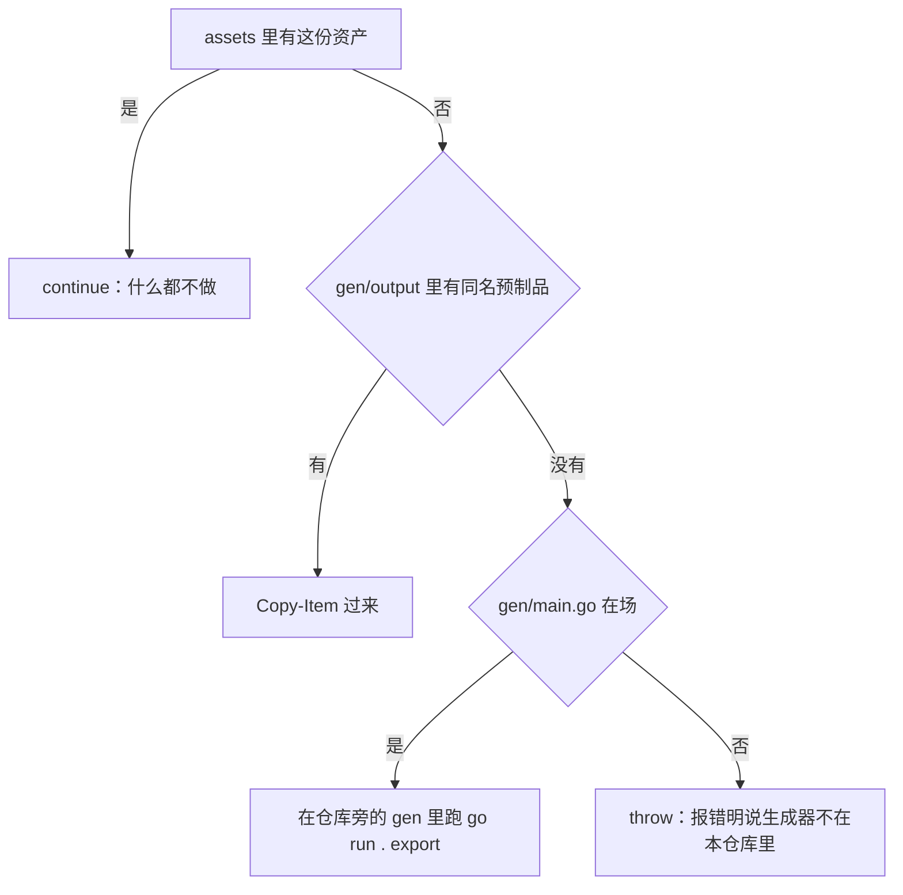

# Quickstart：任务路由与阅读顺序

本仓库是《Granblue Fantasy: Relink》的一个因子 mod：为每个角色预配**虚拟槽位**里的因子，不占用本体槽位、无需库存、不写存档；它同时内置**因子**参数编辑器，可以在工具里随时改写因子的等级数值。

交付面是三个二进制加一份随包数据：C# 托管 mod、C++ 原生核心、Go + Wails **可视工具**，以及仓库**外面**的生成器 `gen` 产出的 `SigilLoadout\assets\`（九份 JSON，与两个 DLL、`SigilLoadout.exe` 一起进包）。工具界面上那棵 React 树**不是第四个二进制**：它是 `SigilLoadout\frontend\` 下的一份源码，构建时由 `go:embed all:frontend/dist` 打进 `SigilLoadout.exe`（系统页见 [可视工具前端（React）](/openwiki/architecture/visual-tool-frontend.md)）。

本页只做两件事：给出最短上手路径，并按任务把读者送到该读的那一页。各单元内部的结构、时序与不变量在系统页与工作流页里讲，本页不复述——下面每一条路由都写明了"什么任务该读哪一页"。

## 一分钟版本

1. **先认词**。`CONTEXT.md` 是本项目的术语表：散落在文档、代码与日志里的说法在那里**各只有一条**，它约束**代码、文档与注释**的用词，唯一例外是可视工具面向玩家的文案（界面仍按游戏的「因子」措辞，写「主因子 / 副因子 / 搜索因子」）。词条就是 `CONTEXT.md:13-40` 的 `## Language` 段里这十一条：「原版」「本体」「因子」「参槽」「虚拟槽位」「因子组合」「固定副」「活表」「可见」「可视工具」「数据管理器」——文件里没有「技能表」这类独立词条。
2. **再认仓库约束**。`AGENTS.md` 有两条硬要求：**未经用户明确要求严禁执行 `git add` / `git commit`**；每次**精确修改（字符串替换）**改文件，**禁止覆盖重建**。同一文件还要求始终中文回复、动手前暴露假设而不是猜。
3. **认清三个交付单元与它们的边界**：[系统总览：三个单元与它们的边界](/openwiki/architecture/overview.md)。先读这一页——它讲清"谁在哪个进程里、哪份状态归谁、两侧靠什么通信"；嵌在工具里的那棵 React 树不是第四个二进制，但它有自己的系统页（[可视工具前端（React）](/openwiki/architecture/visual-tool-frontend.md)）。
4. **按任务路由**：见下面的路由表，以及 [六个目录分别有什么](#六个目录分别有什么)。
5. **改完先验证**：[验证地图](/openwiki/testing/verification-map.md) 回答"这次改动该跑什么、它保证什么、保证不了什么"。
6. **要发布**：[构建、发布与部署链](/openwiki/operations/build-and-release.md)——但先读下面那条「本仓库无法单独完成一次发布构建」。

## 三个交付单元与 gen

| 单元 | 源码位置 | 产物 | 它跑在哪 | 系统页 |
| --- | --- | --- | --- | --- |
| C# 托管 mod | `GBFR.SigilLoadout\` | `GBFR.SigilLoadout.dll` | 游戏进程内，由 Reloaded-II 按 `ModConfig.json` 加载 | [托管 mod（C# Reloaded 外壳）](/openwiki/architecture/managed-mod.md) |
| C++ 原生核心 | `GBFR.SigilLoadout.Native\` | `GBFR.SigilLoadout.Native.dll` | 同一个游戏进程内，**由托管侧自己**按 mod 目录加载（不走 Reloaded-II 的原生 DLL 字段） | [原生核心（C++ DLL）](/openwiki/architecture/native-core.md) |
| Go + Wails 可视工具（外壳） | `SigilLoadout\`（Go 模块 `sigilloadout`） | `SigilLoadout.exe` | 独立进程，读随包数据、写两个配置文件 | [可视工具（Go + Wails）](/openwiki/architecture/visual-tool.md) |
| React 前端（源码，不是独立产物） | `SigilLoadout\frontend\` | vite 产出 `frontend\dist`，被 `go:embed all:frontend/dist` 编进 `SigilLoadout.exe`；`frontend\dist`、`frontend\bindings` 与 `SigilLoadout.exe` 本身都不入库 | 与 Go 外壳同一个进程（WebView 里那棵 React 树） | [可视工具前端（React）](/openwiki/architecture/visual-tool-frontend.md) |

三个交付单元之间的关系不是"调用链"，而是三条通道：托管侧与原生核心之间是一条进程内的 C ABI（导出面在 `GBFR.SigilLoadout.Native/native_api.h`，`GBFR20_ABI_VERSION = 20`）；可视工具与 mod 之间**只有磁盘契约**（`%LOCALAPPDATA%\GBFRSigilLoadout\` 下的 `loadout.json` 与 `sigiledits.json`，可视工具是唯一写者，托管侧只读，靠 mtime 门发现新版本）；游戏内热键那条链只传 Win32 窗口消息、不传数据。三条通道的契约与状态归属全部在 [系统总览](/openwiki/architecture/overview.md)，两个 JSON 的成员名与 mtime 门在 [两个配置文件与跨语言常量契约](/openwiki/concepts/config-file-contracts.md)。

第四样东西是**仓库外的生成器 `gen`**（`..\gen`，一个 Go 工程）。它的产物按待遇分两类：**入库且随包**的 `SigilLoadout\assets\` 九份 JSON，以及**不入库**、只作编译输入的 `GBFR.SigilLoadout.Native\src\exclusive_table.inc`；谁产出谁消费、九份随包资产各被谁读，见 [外部生成器 gen 与随包数据资产](/openwiki/integrations/external-generator-and-assets.md)。

## 本仓库无法单独完成一次发布构建

这是入手前必须知道的一件事，否则会在最早两步撞上一句看不懂的构建报错：

- **生成器不在本仓库里**。`gen` 住在仓库旁的 `..\gen`，仓库里不放任何生成脚本。
- **随包数据那一步只补缺、不拒绝发布**。`tools\build-release.ps1:51-79` 是版本对账之后的第一个动作：九份资产逐份看在场不在场，缺的先从 `..\gen\output\<名字>` 拷一份过来，再没有就以 `..\gen` 为工作目录跑一次 `go run . export -mod <仓库根>`；只有在**跑完仍然没有那份文件、且 `..\gen\main.go` 也不在**时才 `throw`，报错原文是「随包数据缺 ${name}，而生成器不在 $genDir（它不在本仓库里）：补进 SigilLoadout\assets\，或把 gen\ 放回仓库旁。」（`$genDir` 展开成绝对路径）。
- **连单独编原生 DLL 也不行**：`GBFR.SigilLoadout.Native.vcxproj:121-127` 的 `GenerateExclusiveTable` 目标没有 `Condition`、`BeforeTargets="ClCompile"`，并带 `Inputs`/`Outputs` 判过期——输入里就有 `..\..\gen\main.go` 与 `gen` 的三个源文件，两个输出是 `src\exclusive_table.inc` 与 `..\SigilLoadout\assets\sigils.chara.json`。输出缺失时目标一定跑，而新克隆必然如此（`.inc` 从来不在库里），那一刻的工作目录是 `..\..\gen`、命令是 `go run . exclusive -mod <仓库根>`（因此还需要机器上有 Go）。这一段没有友好包装：能看到的就是 `go run` 的原始报错，或编译器停在 `#include "exclusive_table.inc"` 上。
- **两类产物的待遇差别**：`GBFR.SigilLoadout.Native/src/exclusive_table.inc` 不入库（`.gitignore:15-16` 明确列出），是每次编译前重生成的**构建中间产物**；同一条命令还重写**入库且随包**的 `SigilLoadout\assets\sigils.chara.json`，而入库的那份**没有任何内容对账**——"在场的文件一个字节都不比对"。



图：`tools\build-release.ps1:51-79` 对九份随包资产的四步处置——只保证在场或当场补齐，不比对内容。

结论：只有仓库时，**读代码、改代码、跑测试都可以**；**发布构建不行**——随包数据那段补不出缺的份，原生那一步也会因为 `src\exclusive_table.inc` 只能由 `gen` 生成而停下。

## 交叉验证与门禁：两个权威来源

判断"我这处改对了没有"时，这个仓库只有两处机械保证，别无其他：

| 你想确认的事 | 权威来源 | 它的边界 |
| --- | --- | --- |
| 跨语言协议字面量有没有漂（文件名、成员名、窗口消息、槽位数、`skill_status` 行布局…） | `SigilLoadout\sharedconstants_test.go` 的**对拍** | 它是"漂了立刻红"，**不是"边界已证明"**：它只证明这些字面量当前两两相等，不管推导过程，`loadout.json` 的成员名等不在范围内，大小写差异会被放过 |
| 这份源码能不能打包、这个 dist 能不能装 | `tools\build-release.ps1` 与 `tools\deploy.ps1` 的**门禁** | 当前检出里连 `.github\` 目录都没有，所以仓库**没有** CI 构建或发布工作流：`AGENTS.md:79-94` 的 OpenWiki 段记着的唯一自动化是一个定时刷新仓库 wiki 的 GitHub Actions 工作流（那个工作流文件本身不在检出中，也不构建、不测试、不发布），整条链只有本机入口；每个门禁的跳过条件它都会**明说自己跳过了** |

构建侧的门禁（版本对账、九份随包资产的在场或补齐、工具链顺序、包内必需文件清单 13 项）逐条理由与判据行在 [构建、发布与部署链](/openwiki/operations/build-and-release.md)，各测试"护住什么、护不住什么"在 [验证地图](/openwiki/testing/verification-map.md)。随包数据这一段只补缺：**在场的文件一个字节都不比对**，所以"构建会校验随包数据"是错的理解——它拦住"少一份"，拦不住"内容陈旧或漂移"。

## 按任务路由

| 你要做的事 | 按顺序读哪一页 | 从哪个入口下手 |
| --- | --- | --- |
| **改配装数据**（模板因子、专属槽开关、通用槽的数据来源） | [虚拟槽位、模板因子与专属开关](/openwiki/concepts/virtual-slots-and-exclusives.md) → [工作流：配装从界面到游戏状态](/openwiki/workflows/loadout-apply.md) → 数据源本身见 [外部生成器 gen 与随包数据资产](/openwiki/integrations/external-generator-and-assets.md) | `GBFR.SigilLoadout.Native/src/template_loadout.cpp`、`selection_store.cpp`、`SigilLoadout\assets\sigils.json`（`assets\sigils.chara.json` 由 `gen` 产出） |
| **改因子数值编辑**（编辑器里的等级数值、`sigiledits.json`） | [skill_status 表与活表写入闸门](/openwiki/concepts/skill-status-table.md) → [工作流：因子数值编辑与热应用](/openwiki/workflows/sigil-edit-apply.md) → 文件形状与成员名见 [两个配置文件与跨语言常量契约](/openwiki/concepts/config-file-contracts.md) | `SigilLoadout/editservice.go`、`GBFR.SigilLoadout/SigilEditorFeature.cs`、`GBFR.SigilLoadout/Config.cs`（载荷形状）、`GBFR.SigilLoadout.Native/src/table_slot.cpp` |
| **改钩子与语义锚点**（布局解析、两个 detour、循环上限） | [语义锚点与布局解析（fail-closed 的核心）](/openwiki/concepts/game-layout-anchors.md) → [工作流：游戏侧注入运行期](/openwiki/workflows/skill-injection-runtime.md) → [原生核心（C++ DLL）](/openwiki/architecture/native-core.md) → 改前必读 [并发、锁序与生命周期守卫](/openwiki/concepts/threading-and-locks.md) | `GBFR.SigilLoadout.Native/src/layout_resolver.cpp`、`skill_hooks.cpp`、`safe_game_access.cpp`、`exports.cpp`；离线验证用 `tests\NativeLayoutHarness\run.ps1` |
| **改托管侧**（生命周期、维护拍、日志、热键配置、NativeCore 门面） | [托管 mod（C# Reloaded 外壳）](/openwiki/architecture/managed-mod.md) → [宿主与依赖边界](/openwiki/integrations/host-and-dependencies.md)（`ModConfig.json` 逐字段后果、三个目录的分工） | `GBFR.SigilLoadout/Mod.cs`、`NativeCore.cs`、`NativeCore.Interop.cs`、`Hotkey.cs`、`HotkeyConfig.cs`、`LoadoutConfig.cs`、`UserConfig.cs` |
| **改热键**（换一个开关键、解释注册失败） | [工作流：热键呼出/收起可视工具](/openwiki/workflows/hotkey-summon.md) → [托管 mod（C# Reloaded 外壳）](/openwiki/architecture/managed-mod.md) | Reloaded 的 mod 配置目录下的 `HotkeyConfig.json`（托管侧自己写，见 `HotkeyConfig.cs`）、`Hotkey.cs`；注册失败会回落到 F1 |
| **改可视工具外壳（Go 侧）**（启动顺序、单实例、窗口显隐、托盘与窗口消息、资产加载） | [可视工具（Go + Wails）](/openwiki/architecture/visual-tool.md) → 热键呼出链路 [工作流：热键呼出/收起可视工具](/openwiki/workflows/hotkey-summon.md) | `SigilLoadout/main.go`、`startup.go`、`windowstate.go`、`win32.go`、`tray.go`、`loadoutservice.go` |
| **改界面外壳（React 侧）**（页签、语言切换、焦点与 Esc、i18n 文案、落盘顺序与失败提示） | [可视工具前端（React）](/openwiki/architecture/visual-tool-frontend.md) → [工作流：配装从界面到游戏状态](/openwiki/workflows/loadout-apply.md)（编辑通路与载荷规则；注意「切换语言」也走同一条写盘通路） → [可视工具（Go + Wails）](/openwiki/architecture/visual-tool.md)（前端那些调用落到的 Go 侧） | `SigilLoadout/frontend/src/App.tsx`（跨页状态 `:67-84`，落盘链 `saveNow` / `edit` 在 `:104-136`），以及同级的 `lang.ts`（`:8-9` 语言身份）、`messages.ts`（四语文案表）；入口与兜底在 `main.tsx`、`ErrorBoundary.tsx`，纯逻辑规则在 `model.ts`、`skills.ts`，面板在 `ExclusivePanel.tsx`、`SigilEditorPanel.tsx`、`SkillPicker.tsx` |
| **改数据资产与语言表**（`assets\` 下九份） | [外部生成器 gen 与随包数据资产](/openwiki/integrations/external-generator-and-assets.md) → [验证地图](/openwiki/testing/verification-map.md)（资产不变量由 Go 与前端测试守） | `SigilLoadout\assets\`；构建侧只做两件事：缺哪份补哪份（`tools\build-release.ps1:51-79`，不比对内容）与包内必需文件清单（`:286-308`） |
| **构建、发布、部署** | [构建、发布与部署链](/openwiki/operations/build-and-release.md) → [外部生成器 gen 与随包数据资产](/openwiki/integrations/external-generator-and-assets.md)（随包数据「只补缺、不对账」的实际语义） → [验证地图](/openwiki/testing/verification-map.md)（哪些门禁只在发布脚本里跑） | `tools\build-release.ps1`、`tools\deploy.ps1` |
| **排查故障**（游戏里没生效、钩子未装、活表拒写、工具起不来、配置坏文件） | [日志与故障定位](/openwiki/operations/logging-and-diagnostics.md)——五类典型故障各自的"决定性日志行" | mod 目录下的 `GBFR.SigilLoadout.log`（追加写、超 4 MB 轮转为 `.1`、每次运行有 `Session Start` 分隔行）；工具侧诊断默认静默，放一个 `tool-debug.on` 才开始往 exe 旁的 `tool-debug.log` 写 |
| **改完想证明它没坏** | [验证地图：测试与门禁各护什么](/openwiki/testing/verification-map.md) | `SigilLoadout\` 里的 `go test ./...`；`npm --prefix SigilLoadout\frontend test`；`tests\NativeLayoutHarness\run.ps1` |

### 六个目录分别有什么

- `architecture/`——三个单元的系统页与总览：[系统总览](/openwiki/architecture/overview.md)、[托管 mod](/openwiki/architecture/managed-mod.md)、[原生核心](/openwiki/architecture/native-core.md)、[可视工具（Go + Wails）](/openwiki/architecture/visual-tool.md)、[可视工具前端（React）](/openwiki/architecture/visual-tool-frontend.md)。
- `concepts/`——四套必须理解的不变量：[虚拟槽位、模板因子与专属开关](/openwiki/concepts/virtual-slots-and-exclusives.md)、[skill_status 表与活表写入闸门](/openwiki/concepts/skill-status-table.md)、[语义锚点与布局解析（fail-closed 的核心）](/openwiki/concepts/game-layout-anchors.md)、[并发、锁序与生命周期守卫](/openwiki/concepts/threading-and-locks.md)、[两个配置文件与跨语言常量契约](/openwiki/concepts/config-file-contracts.md)。
- `workflows/`——四条端到端链路：[配装从界面到游戏状态](/openwiki/workflows/loadout-apply.md)、[因子数值编辑与热应用](/openwiki/workflows/sigil-edit-apply.md)、[游戏侧注入运行期](/openwiki/workflows/skill-injection-runtime.md)、[热键呼出/收起可视工具](/openwiki/workflows/hotkey-summon.md)。
- `integrations/`——仓库外侧的边界：[外部生成器 gen 与随包数据资产](/openwiki/integrations/external-generator-and-assets.md)、[宿主与依赖边界](/openwiki/integrations/host-and-dependencies.md)。
- `operations/`——动手时要走的链：[构建、发布与部署链](/openwiki/operations/build-and-release.md)、[日志与故障定位](/openwiki/operations/logging-and-diagnostics.md)。
- `testing/`——[验证地图：测试与门禁各护什么](/openwiki/testing/verification-map.md)。

## 推荐的阅读顺序（想整体搞懂）

1. `CONTEXT.md` —— 词。
2. [系统总览](/openwiki/architecture/overview.md) —— 三个单元、三条通道、状态归属。
3. [托管 mod](/openwiki/architecture/managed-mod.md) → [原生核心](/openwiki/architecture/native-core.md) —— 进程内那两半（谁驱动谁、initialize 失败会回滚成什么样）。
4. [可视工具（Go + Wails）](/openwiki/architecture/visual-tool.md) → [可视工具前端（React）](/openwiki/architecture/visual-tool-frontend.md) + [两个配置文件与跨语言常量契约](/openwiki/concepts/config-file-contracts.md) —— 进程外那一半（外壳与界面）以及磁盘契约。
5. 挑一条工作流读到底：[配装](/openwiki/workflows/loadout-apply.md)、[因子数值编辑](/openwiki/workflows/sigil-edit-apply.md)、[游戏侧注入运行期](/openwiki/workflows/skill-injection-runtime.md)、[热键呼出](/openwiki/workflows/hotkey-summon.md)。
6. 动手前：[并发、锁序与生命周期守卫](/openwiki/concepts/threading-and-locks.md) —— 这套代码"不会把游戏弄崩"的不变量都在那一页。
7. 收尾：[验证地图](/openwiki/testing/verification-map.md) 与 [构建、发布与部署链](/openwiki/operations/build-and-release.md)。

## 最短上手路径

1. **先跑测试**（不需要游戏、不需要 `gen`，是这里最窄的验证）：

   ```
   cd SigilLoadout
   go test ./...
   ```

   Go 测试的工作目录是包目录 `SigilLoadout\`，文件路径都相对它；需要的 Go 版本由 `SigilLoadout\go.mod` 声明。前端纯逻辑测试同样不需要游戏：

   ```
   npm --prefix SigilLoadout\frontend test
   ```

   它需要已装好的 `SigilLoadout\frontend\node_modules`。
2. **改了布局解析（`layout_resolver.cpp` 或游戏更新）**——唯一能在本地给出答案的东西，需要一个真实游戏 exe：

   ```
   pwsh -File tests\NativeLayoutHarness\run.ps1 -Exe "<游戏 exe>"
   ```

   不给 `-Exe`（或 `$env:GBFR_EXE`）时它会打印 `NATIVE_LAYOUT=SKIP` 并以 0 退出——那等于没验。
3. **想看工具界面**：跑 `dist\GBFR.SigilLoadout\SigilLoadout.exe` 或部署后的 `Mods\GBFR.SigilLoadout\SigilLoadout.exe`，两者都把 `assets\` 放在 exe 旁边。**不要在 `SigilLoadout\` 里用 `go run .`**：随包数据按 `exeDir()\assets\` 读，而 `go run` 的 `exeDir()` 是临时目录，工具会直接弹"坏安装"对话框退出。要在源码树里跑就先 `go build -o SigilLoadout.exe .`（产物落在 `SigilLoadout\`，与 `assets\` 同级）再运行。改了 `SigilLoadout\frontend\src\` 之后要先重建前端才看得见：exe 里那份界面是构建期嵌进去的 `frontend\dist`——先 `wails3 generate bindings`（`frontend\bindings\` 是不入库的生成物，`App.tsx` 从它 import）再 `npm --prefix SigilLoadout\frontend run build`，最后重新 `go build`（或直接走 `tools\build-release.ps1`），否则看到的还是上一次的界面。
4. **要发布**：

   ```
   pwsh -File tools\build-release.ps1
   pwsh -File tools\deploy.ps1 -Target "<Reloaded-II>\Mods\GBFR.SigilLoadout"
   ```

   前置条件：仓库**旁边**的 `gen\`（九份资产缺任何一份、或 `src\exclusive_table.inc` 不在场时这条链就要用它；它不在本仓库里）、带 C++ 工作负载的 VS 2022 Build Tools（脚本用 `vswhere` 找 MSBuild）、Go、Node/npm（并已装好 `frontend\node_modules`）、`wails3`、.NET 8 SDK。`tools\deploy.ps1:3` 的 `-Target` 默认值是**某台机器上的绝对路径**，换机器必须显式传参；两个脚本都会在动手之前拒绝不像 mod 目录的目标、游戏还在运行、或 dist 不是一次跑完的构建产物。

## 三处最容易踩的边界

- **可变状态一律不在 mod 目录**。mod 目录每次更新被整份替换，所以 `loadout.json` 与 `sigiledits.json` 住在 `%LOCALAPPDATA%\GBFRSigilLoadout\`（热键那份 `HotkeyConfig.json` 例外，住在 Reloaded 的 mod 配置目录，由托管侧自己读写）；"配置没生效"先怀疑路径，而不是先怀疑解析。
- **原生 DLL 不是 Reloaded-II 加载的**。`ModConfig.json` 的 `ModNativeDll64` 是空的，托管侧在运行期按 mod 目录自己解析 `GBFR.SigilLoadout.Native.dll`——别为了"看起来完整"去补那个字段。
- **托管侧不持有游戏地址、也不维护按角色的槽表**。模板表、选择表、活表定位槽与虚拟槽位计数全归原生核心所有，专属开关以 **skill hash** 传递，"缓存失效"这个概念在这里不存在；改之前先回看 [系统总览](/openwiki/architecture/overview.md) 的「状态归属」一节。

术语一律以 `CONTEXT.md` 为准：本页只用「虚拟槽位」「因子」「活表」「可视工具」「数据管理器」这几个词，不另造同义词。
