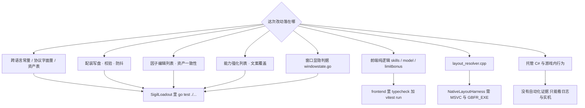
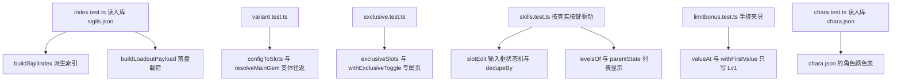

# 验证地图：测试与门禁各护什么

这套仓库**没有任何 CI 跑测试**：当前检出里没有 `.github\` 目录，`AGENTS.md` 的 OpenWiki 段只提到有一个定时的 OpenWiki GitHub Actions 工作流负责刷新仓库 wiki——它既不构建也不跑测试。所以"跑测试"这件事被强制的地方只有一处——`tools\build-release.ps1` 的工具链阶段。其余时候，跑什么由改动落在哪里决定。

本文回答三个问题：**改完该跑什么、它到底保证什么、它保证不了什么。**

## 三套测试与一个空洞

| 套件 | 代码位置 | 怎么跑 | 依赖 |
| --- | --- | --- | --- |
| Go 测试（6 个文件，3 个包：`main` / `service` / `window`） | `SigilLoadout\sharedconstants_test.go`、`SigilLoadout\service\*_test.go`、`SigilLoadout\window\windowstate_test.go` | 在 `SigilLoadout\` 里 `go test ./...` | 源码树里的 `SigilLoadout\assets\`（15 份）在场；不需要游戏 exe；`-race` 另需 gcc |
| 前端纯逻辑测试（6 个文件） | `SigilLoadout\frontend\src\lib\*.test.ts` | `npm --prefix SigilLoadout\frontend test`（= `vitest run`） | 已装好的 `frontend\node_modules`；`index.test.ts`、`chara.test.ts` 直接读入库的 `assets\sigils.json` / `assets\chara.json` |
| 离线布局回归 | `tests\NativeLayoutHarness\`（`program.cpp` + `run.ps1`） | `pwsh -File tests\NativeLayoutHarness\run.ps1 -Exe "<游戏 exe>"` | MSVC：脚本自己用 `vswhere` 找 VS、从 `vcvars64.bat` 导环境、调 `cl.exe`，**这一步排在 SKIP 判断之前**，所以缺 MSVC 时它是在编译处抛错，而不是打印 SKIP；游戏 exe 路径由 `-Exe` 或 `$env:GBFR_EXE` 给 |
| **托管 C#（`GBFR.SigilLoadout.dll`）** | — | — | **没有测试工程**：解决方案里只有原生工程与托管工程两个项目 |

Go 测试的工作目录是**包目录**：`service` 包的用例路径都相对 `SigilLoadout\service\`（资产是 `..\assets\`），根包（`main`）的 `sharedconstants_test.go` 与 `appfiles` 的路径相对 `SigilLoadout\`。前端测试读资产用的是相对测试文件自己的 `new URL("../../../assets/sigils.json", import.meta.url)`，所以与当前工作目录无关。

`appfiles` 包（`WriteAtomic`、`Debounced`、`UserDir`）**自己没有测试文件**：它的行为只通过 `service` 的用例被覆盖。

## 按改动面选验证

| 想改 X | 跑 Y | 机械保证 | 保证不了什么（只能实机/日志） |
| --- | --- | --- | --- |
| 跨语言常量 / 协议字面量 / 资产表 | 在 `SigilLoadout\` 里 `go test ./...` | 对拍组里每处声明**正好匹配一次**且两两相等（大小写不敏感）；原生容量容得下 `MaxSlots`；四张语言表与数值表键集一致、真的翻译过；四语言按 hash 覆盖 `sigils.json`；两种线格式（技能元组、`limit_bonus.json`）逐字节不变 | `loadout.json` 与 `limit_bonus.json` 的成员名不在对拍范围内；正则没覆盖到的第三处副本；真机读取时机 |
| 配装写盘 · 校验 · 防抖（`service\loadoutservice.go`、`appfiles\*.go`） | 同上；并发路径再加 `go test -race ./...`（需 gcc） | 校验边界与被拒保存**磁盘不留痕**、防抖只落最后一次、并发保存不撕文件、缺 `enabled` 视为启用 | 托管侧 `LoadoutConfig` 怎么读这份文件；游戏何时读它；写失败时前端是否真的弹出对话框 |
| 因子编辑列表服务（`service\editservice.go`） | 同上 | 落点与 mod 一致、防抖尾沿只落最后状态（`synctest`）、写失败被放回并记日志、`LoadEdits` 的缺失/损坏/旧拼写语义、参槽总是补齐十个 | mod（`SigilEditorFeature`）是否照这些语义应用；界面提示；**活表写入**是否真的生效 |
| 能力强化列表服务（`service\limitbonusservice.go`） | 同上 | `limit_bonus.json` 的线格式逐字节钉住、防抖尾沿（`synctest`）、缺 `enabled` 视为开着、成员类型不对整份拒绝读、空列表写成 `[]`、资产（骨架/文案/角色属性）的跨层假设 | mod（`LimitBonusFeature`）是否照这些语义应用；Lv1 之外的档位；**写进 limit_bonus_param 活行的时机与效果** |
| 前端纯逻辑（`lib\skills.ts`、`lib\model.ts`、`lib\limitbonus.ts`） | `npm --prefix SigilLoadout\frontend run typecheck`，然后 `npm --prefix SigilLoadout\frontend test` | 输入框按键状态机、每个地址最多一条编辑、什么算编辑、派生索引与落盘载荷、变体往返、专属页的唯一规则、能力强化页只写 Lv1、`chara.json` 的颜色表 | 组件渲染与事件、真实浏览器里的按键/滚轮行为、Go 与 C# 两侧对同一份文件的读取 |
| 窗口显隐 / F1 开关的判据（`window\windowstate.go` 的 `toggleActionFor`） | 在 `SigilLoadout\` 里 `go test ./window` | "给定三态组合该做什么"的整张判据表（呼出 / 收起 / 不动），含"工具自己有焦点→收起"与"别的程序在前台→不动" | 三个输入从哪来（`toolHidden` 镜像、`GetForegroundWindow`、按 pid 判"是不是我们"）；`hideNow` / `revealTool` 的 Win32 效果、焦点归还与那记重放点击；`WM_CLOSE` / `WM_SYSCOMMAND` / `0x8010` / `0x8011` 分支；实机上的显隐结果 |
| `layout_resolver.cpp` / `safe_game_access.cpp` | `pwsh -File tests\NativeLayoutHarness\run.ps1 -Exe "<游戏 exe>"`（需 MSVC；没给 exe 时 SKIP） | 生产解析器认得这份 exe 的锚点、解析结果过逐字节复验、改坏一个字节后复验必定失败 | 钩子落点对不对、真机效果、`table_slot.cpp` 那一侧的任何闸门、别的游戏版本 |
| 托管 C#（`LoadoutConfig`、`Config.Load`、`LimitBonusConfig.Load`、`SigilEditorFeature`、`Hotkey`） | 无（只有 `build-release.ps1` 的 `dotnet build` 编译它） | 只有"能编译" | 一切运行时行为，只能在游戏日志里观察 |
| 打包与发布产物 | `pwsh -File tools\build-release.ps1` | 版本号三处一致、必需文件 19 项在场、legacy 与可变配置 fail-closed、工具链顺序 | 包在实机上能否跑起来、装进游戏后是否生效 |

```mermaid
flowchart TD
    Q{"这次改动落在哪"} --> A["跨语言常量 / 协议字面量 / 资产表"]
    Q --> B["配装写盘 · 校验 · 防抖"]
    Q --> C["因子编辑列表 · 资产一致性"]
    Q --> H["能力强化列表 · 文案覆盖"]
    Q --> D["前端纯逻辑 skills / model / limitbonus"]
    Q --> F["窗口显隐判据 windowstate.go"]
    Q --> E["layout_resolver.cpp"]
    Q --> G["托管 C# 与游戏内行为"]
    A --> G1["SigilLoadout 里 go test ./..."]
    B --> G1
    C --> G1
    H --> G1
    F --> G1
    D --> G2["frontend 里 typecheck 加 vitest run"]
    E --> G3["NativeLayoutHarness 需 MSVC 与 GBFR_EXE"]
    G --> G4["没有自动化证据 只能看日志与实机"]
```

每档改动对应的套件；窗口显隐那一档只有那条纯判据进 Go 测试，最后一档是任何套件都不覆盖的部分。

想只跑一条不变量时，用 `-run` 收窄（都在 `SigilLoadout\` 里跑）：

| 想改的东西 | 最小命令 |
| --- | --- |
| 对拍名单 / 新增跨语言字面量 | `go test . -run TestSharedConstantsAgreeAcrossLanguages` |
| 原生容量、`MaxSlots` | `go test . -run TestVirtualSlotCapacityFitsPlayerSlots` |
| 配装校验边界 | `go test ./service -run TestValidateSlots` |
| 配装写盘 / 防抖 / 并发 | `go test ./service -run "TestSaveLoadout|TestConcurrentSaves"` |
| 编辑列表读回与落点 | `go test ./service -run "TestLoadEdits|TestSaveEdits"` |
| 能力强化列表 | `go test ./service -run "TestSaveLimitBonus|TestLoadLimitBonus"` |
| 资产内容不变量 | `go test ./service -run "TestSkillTables|TestLevelRanges|TestExcludedRows|TestKnownSkillRows|TestLimitBonus"` |
| 两种线格式 | `go test ./service -run "TestWireShapeStaysTuples|TestSaveLimitBonusEditsWritesTheAgreedShape"` |
| 窗口判据 | `go test ./window -run TestToggleActionFollowsTheUsersRule` |
| 前端某一组规则 | `npm --prefix SigilLoadout\frontend test -- src/lib/skills.test.ts` |

## Go 测试：三个包、六个文件

| 文件（包） | 条目数 | 它护什么 |
| --- | --- | --- |
| `SigilLoadout\sharedconstants_test.go`（`main`） | 2 | 跨语言常量对拍（18 组）+ 原生虚拟槽容量 |
| `SigilLoadout\service\assets_test.go`（`service`） | `TestMain` | 全包共用的沙箱与随包数据装载 |
| `SigilLoadout\service\loadoutservice_test.go`（`service`） | 13 | 用户目录、配装校验、写盘、防抖、并发、因子/角色名字覆盖 |
| `SigilLoadout\service\editservice_test.go`（`service`） | 18 | 编辑列表读/写/防抖/失败重试 + 技能资产不变量与线格式 |
| `SigilLoadout\service\limitbonusservice_test.go`（`service`） | 12 | 能力强化列表读/写/防抖/失败语义 + 能力强化资产与文案覆盖 |
| `SigilLoadout\window\windowstate_test.go`（`window`） | 1 | F1 三态显隐判据 |

`window` 与根包是**另外两个包**，所以它们不共享 `service` 的 `TestMain` 沙箱：`windowstate_test.go` 是一条纯函数表格用例，一个环境变量都用不上；`sharedconstants_test.go` 只读源码文本，也不写盘。

### `service` 包共用的沙箱（`assets_test.go`）

`TestMain` 在两件事上替**整个 `service` 包**把环境铺好，两条都有具体来历：

- `os.Setenv("LOCALAPPDATA", <临时目录>)`，而且是**整个测试进程**级别（不是 `t.Setenv`）。原因是写盘是防抖的：`Submit` 之后要过 `appfiles.DebounceDelay`（500ms）才真正触发写入，而 `t.Setenv` 在测试函数结束时就还原——那记定时器会落到**真实的** `%LOCALAPPDATA%\GBFRSigilLoadout` 里。
- `loadAssetsFrom(filepath.Join("..", "assets"))` 从源码树把随包数据装进来一次。生产路径是 `appfiles.ExeDir()\assets\`，而测试进程的 `exeDir()` 是 `go test` 的临时目录，那里没有 `assets\`。

单个用例仍然用 `t.Setenv` 把 `LOCALAPPDATA` 指到 `t.TempDir()`（`loadoutservice_test.go` 直接用 `t.Setenv`；`editservice_test.go` / `limitbonusservice_test.go` 用 `hermeticHome` 把 `USERPROFILE` / `HOME` / `LOCALAPPDATA` 一起指到一次性目录）。这类用例都在退出前调 `FlushNow()`——它 `Stop()` 掉定时器再落盘——所以不会留下一个指向已还原路径的定时器。

### `sharedconstants_test.go`：跨语言常量对拍与原生容量

这些值分别在 C# / Go / TS / C++ 里声明，写错**不会编译失败**，只在游戏里表现成错值——这类错误最难查，所以值得钉住。当前名单是 **18 组**：`MaxSlots`、`DefaultLevel`、`UnwornCharacterHash`、`LevelValue` 参槽数、用户配置目录名、配装文件名、因子编辑列表文件名、窗口标题、**游戏内热键的开关消息（`0x8012`，窗口消息只剩这一条）**、`skill_status` 的表头/行/行内 Key 偏移、`sigiledits.json` 的五个成员名、保存失败事件名。窗口消息退到只剩一条是因为入选门槛是"至少两侧各有一处声明"：`0x8010`（激活）与 `0x8011`（假隐藏）现在只由工具那侧声明与发送，没有第二方要跟它对齐，于是它们不再是"漂了立刻红"的可对拍值（详见 [两个配置文件与跨语言常量契约](/openwiki/concepts/config-file-contracts.md) 里那张单侧声明表）。

机制上有四个细节，读它时值得知道：

1. **每条声明必须正好匹配一次**（`len(matches) != 1` 即报错）。正则写松了就会对着文件里第一个碰巧像它的东西比，比出来仍然是绿的——假绿比红更贵。这也是为什么几个成员名的正则锚在 `type SigilSkill struct {` 上：`json:"key"` 在本包里合法地出现两次（`SigilSkill` 与 `SkillInfo`，两个不同的文件格式）。
2. **Go 的声明属于包、不属于文件**，所以 `"*.go"` 表示**递归**把本模块所有非测试源文件拼起来找（跳过 `frontend\` 与 `build\`）——一次纯搬移、甚至跨子包搬移，都不该让断言变红。
3. 比较是**大小写不敏感**的（`strings.EqualFold`）。
4. 文件被改名或搬走是**硬失败**（`t.Fatalf`），不是静默跳过。

同一个文件里还有第二条断言 `TestVirtualSlotCapacityFitsPlayerSlots`：从 `native_internal.h` 里读出 `kVirtualSlotCapacity`（24）减 `kBuiltinExclusiveSlotCount`（3），要求它容得下 `service.MaxSlots`。三处 `MaxSlots` 相等已由对拍负责，所以这条只看原生容不容得下——容量不够同样不会编译失败，只会让 `ApplyLoadout` 截断多出来的槽，而**只有日志会说**。

**它是"漂了立刻红"，不是"边界已证明"。** 它只证明这些字面量当前两两相等，下面这些一个字都没说：`loadout.json` 的成员名完全不在范围内（C# 是 `TryGetProperty("…")`、Go 是 struct tag，改一边能编译、全部测试绿）；`limit_bonus.json` 的**文件名与四个成员名**也不在任何对拍组里（C# 的 `LimitBonusConfig.cs` 用了逐字成员名，但只有 Go 侧那条字节级线格式断言钉住自己那一半）；只有大小写不同的漂移会被 `EqualFold` 放过，而两个 JSON 格式都大小写敏感；它比字面量、不比推导（目录名比的是 `GBFRSigilLoadout` 这个字符串，没人比"C# 用 `SpecialFolder.LocalApplicationData`、Go 用环境变量 `LOCALAPPDATA`"这层对应）；且名字精确到文件的组只在**那一个文件**里找，在别的文件里再加一份副本不会被发现。所以绿不等于契约已证明，文档表和对拍两边都得维护。

### `loadoutservice_test.go`：写盘与服务不变量

| 用例 | 护住的不变量 |
| --- | --- |
| `TestUserCfgDirMatchesModPath` | `appfiles.UserDir()` 必须落在 `%LOCALAPPDATA%\<UserDirName>`——mod 读的就是这里 |
| `TestValidateSlotsTreatsMissingEnabledAsEnabled` | **缺 `enabled` 与 `enabled:true` 同义**。这里曾经用 `bool`，于是同一份文件 Go 数出 0 个启用、mod 数出十几个，结果是"存盘成功、游戏里什么都没变" |
| `TestValidateSlots` | 结构违规当场拒：items 只能 1–2 项、第二项 hash 不能空、等级不能为负、启用行上限 `MaxSlots`（**只数启用的行**，所以"`MaxSlots` 行全启用"合法而"`MaxSlots+1` 行里禁用一行"也合法）、空 items、缺 gem、缺主技能 hash。同时钉住两条**刻意的合法值**：`"slots": []` 与"等级超过 cap"（cap 属于每条技能自己，只有前端与 mod 知道，写死一个数就是同一规则的第三份副本） |
| `TestSaveLoadoutWritesAndLeavesNoTempFiles` | 落盘内容与提交的字节**逐字节相同**，且目录里除了 `loadout.json` 不留任何 `.tmp` 中转文件 |
| `TestSaveLoadoutOverwritesExisting` | 第二次保存覆盖第一次：磁盘上是最后一次提交的字节 |
| `TestSaveLoadoutRejectsInvalidWithoutTouchingDisk` / `...RejectsTheOldBareArrayShape` / `...RejectsAnObjectWithoutSlots` | 被拒的保存在任何目录或文件建出来**之前**就中止——磁盘上不留痕迹。旧版本的裸数组形状与"缺 `slots` 成员"都必须当场报错，而不是被翻译成"空配置"写下去（后者会把一份读不出来的旧文件静默变成"配置被清空"），而 `"slots": []` 仍然是合法值 |
| `TestSaveLoadoutDefersTheWrite` / `...WritesOnlyTheLatestSubmission` | 防抖的尾沿语义：没到点不落盘（这正是"退出时 `FlushNow` 兜住最后一次编辑"能成立的前提）、只落盘**最后**交上来的那一份、且待写在 flush 时是被"取走"的（第二次 flush 找不到东西；判据用哨兵文件而不是私有字段） |
| `TestConcurrentSavesNeverTearTheFile` | 16 路并发保存之后，磁盘上必须是**某一次完整保存**的内容（`appfiles.WriteAtomic` 的同目录唯一临时名 + rename；直接 `O_TRUNC` 会留下"读到半截"的窗口） |
| `TestGemNamesCoverTheTableInEveryUILanguage` | 四种界面语言的 `sigils.lang.json` 与 `sigils.json` **按 hash 一一覆盖**，且 `sigils.json` 不再带 `name`/`zh`（名字只属于语言文件）；`ja` 至少有一条与 `en` 不同，防止"把英文抄了一遍" |
| `TestCharaNamesCoverTheExclusiveTableInEveryUILanguage` | `chara.lang.json` 覆盖 `sigils.chara.json` 的每个 PL 码，且每行必须是**三槽齐全**的角色条目 |

### `editservice_test.go`：编辑列表的读、写、防抖，以及技能资产一致性

- **写**：`TestSaveEditsWritesConfigWhereTheModReadsIt` 断言列表能反序列化回来、未被输入过的参槽在文件里就是 `null` 这个词（正是它告诉 mod 那一部分保持原样），位置走实现同一批常量（`localConfig` 用 `appfiles.UserDirName` + `editListName`），**不做同一份事实的第三份手抄**。
- **防抖**：`TestSaveEditsWaitsForTheEditingToStop` 用 `testing/synctest` 气泡把这件事从"关于时钟的陈述"变成"关于代码的陈述"——第二次编辑必须重启窗口，安静下来之后落地的必须是最后一次状态。一个不再重启定时器的实现会在这里失败，而不是在一台碰巧很慢的机器上蒙混过关。`limitbonusservice_test.go` 里有一份同形的用例。
- **写失败**：`TestSaveEditsSurvivesAWriteItCannotMake` 用一个普通文件占住配置文件夹的位置，让每一次 mkdir 与写入都必然失败。断言三件事：失败被记进日志（`creating the config folder`）、**待写被放回**（挪开挡路的东西后同一个 `FlushNow` 就能写下去，因为不编辑直接退出时那是它唯一的机会）、以及"没有 app 可通知"那条分支也能走完（测试进程里没有窗口）。
- **读**：`TestLoadEditsReadsTheUserConfig`（读回来的参槽会被补齐到十个）；`TestLoadEditsStartsWithNothing`（文件不存在 → 空列表，且**不创建**文件——面板在应用启动时就挂载，一份内置的起始编辑会让"打开可视工具"本身就是一次对游戏的改动）；`TestLoadEditsRejectsAFileItCannotParse`（解析不了 → 报错并**点出文件名**，因为显示成空列表看起来和"什么都没打开"一模一样，而下一次按键就会把这份空覆盖回用户的编辑）；`TestLoadEditsKeepsAnEmptyList` 与 `TestLoadEditsSpellsAnEmptyListAsAnArray`（`{"edits":[]}` 与 `{}` 都读成空列表，且到线格式上必须是 `[]` 而不是 `null`）；`TestLoadEditsDoesNotReadAFileFromTheOldKeySpelling`（旧拼写 `Edits`/`Enabled`/… 的文件既不读取也不改写——"从头来过"是既定形状，下一次保存写出当前格式）。
- **参槽归一**：`TestPadValuesAlwaysGivesTenSlots` 钉住短列表用 `nil` 补齐、长列表截断到 10。
- **线格式（手写契约）**：`TestWireShapeStaysTuples` 按**字节**钉住资产里的 `[等级, 数值]` / `[等级, 文案]` 元组形状。这是手写契约里没有别的机械校验的那一条：`MarshalJSON`（在 `tables.go` 上）一旦丢失或退回结构体字段语义，Go 测试与前端 `tsc` 都会全绿，而 `SigilEditorPanel.tsx` 的 `as Record<string, SkillText>` 会静默收下 `{Level, Text}`，用户看到的只是空 tooltip 与 0 占位。
- **资产不变量**：四张语言表与数值表的键集必须一致（`TestSkillTablesAgree`），且每个技能每个等级行都带齐 10 个参槽；`TestSkillTablesAreTranslated` 要求同一哈希在四种语言里名字各不相同（防止"把一份抄了四遍"）；`TestSkillMapFallsBack` 要求未知语言回落到非空表（探针刻意用 `de`——游戏文本里有它，界面语言没有）；`TestLevelRangesAreUsable` 要求等级升序、≥1、且每行至少有一个非零值；`TestKnownSkillRows` 用黑龙的咒印（`06719232`）钉住"只有带数字的等级进资产"（它 1–14 级全是零，所以那些行根本不在资产里）；`TestExcludedRowsAreGone` 断言四个并非真技能的行不出现在任何一张表里。
- **无事可做的 flush**：`TestFlushWithNothingPendingDoesNothing` 把文件删掉后再 flush，它不该回来。

`testing/synctest` 是较新的标准库，`go.mod` 声明的是 `go 1.27.0`——工具链太旧的机器连编译都过不去，这比测试失败更早暴露。

### `limitbonusservice_test.go`：能力强化列表与它那三份资产

能力强化页对应的是另一套文件与另一套资产（`service\limitbonusservice.go`、`assets\limit_bonus*.json`、`assets\chara.json`），它的用例与编辑列表**同形但不同事实**：

| 用例 | 护住的不变量 |
| --- | --- |
| `TestSaveLimitBonusEditsWritesTheAgreedShape` | `limit_bonus.json` 是一份**手写契约**（mod 那半逐字成员名匹配、不折叠大小写，而可视工具是唯一写入方），所以这里按**整段字节**比对落盘结果——加一个成员、改一个拼法、把浮点数写成字符串，都必须先在测试里看见 |
| `TestSaveLimitBonusEditsWaitsForTheEditingToStop` | 同 `synctest` 的防抖尾沿：第二次编辑重启窗口，安静后落地的必须是 `values: [500,600,321]` 那一份 |
| `TestLoadLimitBonusEditsReadsTheUserConfig` | 工具写的那份列表就是 mod 读的那一份：必须从同一个文件读回来 |
| `TestLoadLimitBonusEditsTreatsAMissingEnabledAsOn` | 缺 `enabled` 在这里是**开着**的（C# 的 `LimitBonusEdit.Enabled` 初值就是 `true`，而 Go 的零值是 `false`；手写文件里省掉这一栏是常事），但显式写成 `false` 的条目照旧关着 |
| `TestLoadLimitBonusEditsStartsWithNothing` / `...RejectsAFileItCannotParse` / `...SpellsAnEmptyListAsAnArray` | 与 `LoadEdits` 同一套规矩：没有文件 = 空列表且不创建文件；解析不了 = 带文件名的错误（空列表看起来和"一栏都没开"一模一样）；`{}` 读成空列表且到线格式上是 `[]` |
| `TestLoadLimitBonusEditsRejectsAFileWithTheWrongMemberTypes` | 成员类型不对的文件**整份读不出来**，而不是把坏值读成零值再写回去——Go 侧解 float 数组，mod 侧的 `float[]` 同样拒它。这一条也是前端不必再对数值做形状检查的原因 |
| `TestLimitBonusAssetsAreUsable` | 骨架（`limit_bonus.json`）与 `chara.json` 的跨层假设：Key 与参数行必须是 8 位十六进制（`isHexKey` 就是 mod 的 `TryParseKey` 那条规矩）；每个角色至少一个节点、每个节点至少一个参数行；**参数行的 Lv1 默认值不能是 0**（界面空框的占位符，也是"这条行有档位可写"的证据）；四门语言的文案表数量对得上；`chara.json` 每行都带能直接上屏的 `#rrggbb` |
| `TestLimitBonusTextsCoverTheSkeletonInEveryLanguage` | 一条都不能缺：骨架上每个节点在当前语言的文案表里都要有名字、每个参数行都要有效果模板（缺了只会显示 `AB_PL0700_01` 或空描述）；效果模板必须含 `{0}`、且不含 `{1}`…`{9}` 这类前端填不了的占位符；四门语言的词**真的不一样**（拿 `45E4F42E` 当判据，防"同一份表抄了四遍"） |
| `TestLoadLimitBonusDoesNotFallBack` / `TestTheSkeletonIsTheSameForEveryLanguage` | 认不出来的语言拿到**空表**而不是中文（"缺 key 就是缺"，不拿另一种语言的词冒充）；骨架与 `chara.json` 与语言无关，每个角色都要有属性名与颜色 |

另外一条只有 C# 侧写着的语义值得知道：`limit_bonus.json` 的空 `edits` 数组在 mod 那边是"没有要写的"，**不是**"撤销全部编辑"——这张表只写内存、不经过数据管理器，没有第二份原始值可以拿回来。

### `windowstate_test.go`：F1 三态判据的那张表

整层 Win32 窗口行为里只有一条纯判据被拉进自动化：`TestToggleActionFollowsTheUsersRule` 直接调 `toggleActionFor(hidden, selfForeground, gameForeground)`，把用户口述的规则写成五条表格用例——不建窗口、不碰线程、不读环境。

| 用例 | `hidden` / `selfForeground` / `gameForeground` | 期望 |
| --- | --- | --- |
| 游戏在前台，工具在托盘 → 呼出 | true / false / true | `actionReveal` |
| 游戏在前台，工具可见但在后面 → 呼出 | false / false / true | `actionReveal` |
| 工具自己有焦点 → 隐藏 | false / true / false | `actionHide` |
| 托盘里 + 别的程序在前台 → 不动 | true / false / false | `actionIgnore` |
| 可见但在后面 + 别的程序在前台 → 不动 | false / false / false | `actionIgnore` |

这张表值得钉住，是因为 F1 是**裸键**：放行只有两种情形（工具自己被激活、或游戏在前台），其余一律不动，否则在任何程序里按一下都会把工具弹出来。而放行条件与托管侧 `Hotkey.cs` 的 `SyncRegistration` / `ShouldOwnTheKey` 是同一个条件——那边管"这键归谁"（`RegisterHotKey` 的裸键是全局独占的，所以只在游戏或工具自己在前台时才注册），这边管"按下去做什么"；两侧都不能省，区别只是工具晚 ≤250ms 才看到前台变化，这一段滞后正是这条判据挡的东西。表格用例还隐含钉住了优先级：工具自己在前台时先判"收起"，而不是落到"呼出"。

**它的保证边界就是这张表。** 它不告诉你那三个输入是怎么算出来的（`toolHidden` 是假隐藏状态的镜像；`foregroundWindow()` 走 `GetForegroundWindow`；"工具自己在前台"由 `isOwnWindow` **按 pid** 判——工具进程里还挂着输入法/TSF 的顶层窗口，拿句柄比主窗口会让在工具里敲字时被当成"别的程序在前台"；`isGameWindow()` 用 `OpenProcess` + `QueryFullProcessImageNameW` 只认 `granblue_fantasy_relink.exe`）；不覆盖判成 `actionReveal` / `actionHide` 之后那串 Win32 动作实际做成了什么（ex-style 上 `WS_EX_APPWINDOW` / `TOOLWINDOW` / `TRANSPARENT` 三个标志的加减、整窗 alpha、**先还焦点再 `EnableWindow(FALSE)`** 这个顺序、以及那记重放的光标隐藏点击）；也不覆盖 `returnFocusTo` 的存储条件，以及不经过这条判据的几个入口（`WM_CLOSE`、`WM_SYSCOMMAND SC_MINIMIZE`、`0x8010`、`0x8011`）。所以"F1 真的把窗口收/放对了、焦点真的回到游戏"仍然只能靠 `tool-debug.log` 里那行 `wmToggle hwnd=… -> <动作>` 与游戏内实测。

## 前端 vitest：六个文件、只有纯逻辑

前端测试跑在纯 node 环境里，没有 `jsdom`、没有 `@testing-library`，`vite.config.ts` 里也没有 `test` 段（vitest 用默认环境）。原因是规则本身就不在组件里：`skills.ts` 的文件头写明"凡是由值单独决定的部分都在这，不碰 React 也不碰 DOM，所以能独立测试"，`limitbonus.ts` 的文件头抄了同一句。决定 `sigiledits.json`、`loadout.json` 与 `limit_bonus.json` 最终内容的正是这些规则，所以一张表比再来一张截图值钱。

```mermaid
flowchart TD
    T1["index.test.ts 读入库 sigils.json"] --> M1["buildSigilIndex 派生索引"]
    T1 --> M2["buildLoadoutPayload 落盘载荷"]
    T2["variant.test.ts"] --> M3["configToSlots 与 resolveMainGem 变体往返"]
    T3["exclusive.test.ts"] --> M4["exclusiveSlots 与 withExclusiveToggle 专属页"]
    T4["skills.test.ts 按真实按键驱动"] --> M5["slotEdit 输入框状态机与 dedupeBy"]
    T4 --> M6["levelsOf 与 parentState 列表显示"]
    T5["limitbonus.test.ts 手搓夹具"] --> M7["valueAt 与 withFirstValue 只写 Lv1"]
    T6["chara.test.ts 读入库 chara.json"] --> M8["chara.json 的角色颜色表"]
```

六个测试文件分别打在前端纯逻辑的哪一组函数上。

| 测试文件 | 被测试的模块 | 用例分组与各自护住什么 |
| --- | --- | --- |
| `index.test.ts` | `model.ts` | **跑入库的真实 `sigils.json`**（`readFileSync` + `new URL`，不是手搓夹具——夹具会和 App 的构造各自漂移）。两组：**真实 sigils.json 上的派生索引**（表非空且每个主下拉取值都有显示名；`lot` 里每个技能都是普通可作副的技能；唯一持有的组没有合法副技能；普通组的合法副集合非空；缺失 cap 回落 `DEFAULT_LEVEL`；`gemOf` 给出该组里一个真实物品 hash；池族的副技能在池里时写池版 hash）与**落盘载荷**（空槽不写进文件且 `exclusive` 不出现；解析不出的主因子**整行跳过**——空 id 会让 mod 拒掉整份文件；主因子写 `{gem, hash, level}`；副技能写 `hash` 并带上自己的等级、`enabled` 原样保留；`exclusive` 全空时不写这个成员，非空时原样带上） |
| `variant.test.ts` | `model.ts` | 两组：**载入 → 保存的变体往返**（保留存档里指名的那个变体而不改写成组里第一行、没有变体可保留时回落组里第一行、保留的变体与副技能冲突时交回固定副技能规则）与 **`resolveMainGem` 的池/固定副技能优先级**（没有副技能时也用池版；副技能是某变体的固定副技能时用那一版）。前者是必需的：钳蟹的共鸣 `1C4D37E4` 与永恒钳蟹因子 `426AD20E` 共享技能 `082033CB`，丢掉"存档里那个物品 hash"就分不出这两个变体 |
| `exclusive.test.ts` | `model.ts` | 三组：**`exclusiveSlots`**（标签取因子物品 hash 在 `sigils.lang.json` 里的名字、状态键取技能 hash——写反会让整页三个标签退化成裸 hash；名字缺失时显示 hash 而不换语言）；**`withExclusiveToggle`**（关一个槽只写 `false` 且写到共享同一 PL 码的每个角色上；重新打开是**删掉那个键**而不是写 `true`；槽全开后该角色不再出现在状态里；不碰状态里本来就有的其它角色）；**`parseExclusiveTable`**（形状不完整或非字符串的记录整条丢掉、只留三槽齐全的；不是数组则抛错，调用方转成界面错误提示） |
| `skills.test.ts` | `skills.ts` | 十个分组（下节按组列出） |
| `limitbonus.test.ts` | `limitbonus.ts`（+ `skills.ts` 的 `dedupeBy`） | 七个 describe，**刻意用手搓夹具**（资产的不变量由 Go 侧 `limitbonusservice_test.go` 对着真实文件断言，两边不必是同一份事实的第三次手抄）：**这一行显示什么**（没编辑过读游戏自己的 Lv1；有记录读第一格；`values: []` 等于没编辑；描述显示模板本身并把 `{0}` 换成框号 `{1}`，表里没有这个 Key 得空串且**不回退**到别的语言）；**读回来的记录**（没有 Key 记录的返回 `null`；Key 归一成大写而值列表原样保留；整个 `values` 不是数组时当作空、但记录仍占着它的 Key）；**一个 Key 最多一条编辑**（只钉这一页的地址：记录自己的 Key，规则本身与因子编辑页共用 `dedupeBy`）；**角色去重**（参数行 Key 集合相同的条目只留一份——古兰与姬塔是同一个能力树的两个人，判据是内容不是名字）；**改第一档落成什么记录**（写出去的 `values` 长度恒为 1 = 只写 Lv1，Lv2/Lv3 留给游戏原值；清空 = 删掉整条记录而不是替用户写一个默认值）；**同名只留第一个节点**（同名节点按 `names[key] ?? key` 去重，没名字的按自己的 Key 留）；**中西文之间补空格**（`spaceCJKAndLatin` 只在 CJK↔拉丁边界补一个空格，首尾不补） |
| `chara.test.ts` | 入库的 `assets\chara.json`（Go 侧 `limitbonusservice_test.go` 读的同一份真相） | 一个 describe、四条：顶层以 PL 码为键、每行只带 `hash` 与 `color`（那只六色调色表应该已经删掉）；每行颜色是能直接上屏的 `#rrggbb`（界面把这一栏直接交给 CSS，**前端不替它兜底**，"red"、`#abc` 这类合法写法会变成灰的）；属性 → 颜色与生成器那张表逐字对上、六个属性齐全且互不相同；六种颜色的出现次数加起来就是全部角色、每种至少分到一个 |

`skills.test.ts` 刻意不读夹具、也不经过浏览器，而是**按真实按键序列驱动**：测试里的 `type()` 替身把每个字符依次交给 `slotEdit`，模拟"光标在末尾、按键追加到显示内容之后"。分组如下：

| 分组（describe） | 钉住什么 |
| --- | --- |
| `a keystroke in a value box` | 小数与负数（含 `.5`、`-3.25`）能输入；`"0."`、`"-"` 是留在屏幕上的**半成品文本**而不是被提交（那次回归让输入 `0.5` 存成 `5`）；`"1-"`、`"1.."`、`"1e"`、`"1a"` 整键丢弃且输入框一点都不变（所以下一个数字接在原有内容后面）；清空输入框 = 把该槽交还给游戏自己的值（`null`） |
| `the two patterns` | 拒绝科学计数法；前导零被替换而不是拒绝该按键（`"04"`→4，但小数点需要的那个零留下，单独一个 `0` 仍是 `0`）；拒绝超过小数点前后各 6 位的数字——贴进来的 309 位数字会被提交成 `Infinity`，JSON 拒绝写它，此后每次保存都失败；被拒绝的按键不动已提交的值 |
| `stepping a slot` | 步进一位、保留两位小数；步进不得越过输入框自己的上界（停在 `999999` 的框按方向键原地不动） |
| `one edit per address` | `dedupe` 对同一 `(key, level)` **保留最后一条已启用的**记录、该地址一条已启用的都没有时保留最后一条（`it.each` 四种启用组合各自断言留下的是哪个数值），因为 mod 按顺序写每条已启用的编辑、游戏保留对同一地址的最后一次写入；地址都不重复时一条都不丢 |
| `what counts as an edit` | `isEdit`：勾选即编辑（哪怕什么都没输入，意思是"以游戏自己的数值开启"）、带数字即编辑（哪怕开关关着）、两者都没有则丢弃 |
| `the levels a skill shows` | `levelsOf` 显示资产里游戏真实带值的等级（不是两端之间的跨度）、把已启用的等级置顶（带着已关闭编辑的等级不自成一档）、保留只有记录才知道的等级、技能没有等级也没有记录时给空 |
| `父行的勾选态` | `parentState` 按**这一行显示的等级数**算全选/半选，而不是按记录条数（否则"11 个等级只开 1 个"会读成全选、半选态永不出现） |
| `the search` | `matches` 同时匹配显示名与 hash、对 hash 大小写不敏感、空查询串全部命中 |
| `the explanation a level shows` | `explainAt` 取覆盖该等级的那一段说明（不是最高那一行）；越界取最后一段、起点之前的等级取第一段；无分段返回空串；六个分段的因子走的是同一条 `findLast` |
| `the slot labels in a tooltip` | `slotLabel` 把游戏占位符的槽号写成从 1 开始的 `{N}`、去掉 `{0:.1f}` 这类数字格式与 `<d>` 标记 |

组件（`App.tsx`、`components\` 下的 `SigilEditorPanel.tsx`、`LimitBonusEditorPanel.tsx`、`SkillRow.tsx`、`SkillPicker.tsx`、`SlotEditor.tsx`、`ExclusivePanel.tsx`、`PanelFailureDialog.tsx`、`ErrorBoundary.tsx`）与 hooks（`useLangTable.ts`、`usePanelFailure.ts`、`useRowTooltip.ts`、`useWheelStep.ts`）**没有单元测试**：它们的规则已经被抽到上面几个模块里，剩下的渲染与事件只能人工在工具/浏览器里点。`npm run typecheck`（`tsc --noEmit`）是测试之外的另一半——`vite` 只抹掉类型、不做检查。

## NativeLayoutHarness：离线布局解析与 fail-closed 反证

`tests\NativeLayoutHarness\program.cpp` 是唯一覆盖原生侧的测试，它做三件事，全部**不启动游戏**：

1. `ResolveGameLayout()` 必须成功——真实 exe 里那些锚点还认得出来；
2. `RevalidateGameLayout()` 必须过——解析结果在字节上自证；
3. 把一个 hook 点上的字节翻一位（`image[g_game_layout.skill_fetch_path_rva] ^= 0x01`）⇒ `RevalidateGameLayout()` **必须失败**——证明 fail-closed 真的会拒（随后 `ResetGameLayout()`）。

它**刻意不硬编码任何期望地址**：游戏一更新就能直接跑。真正保护"锚点跑偏"的是第 2 步，它比的是那些位置上的实际字节。实现上，它把 PE32+ exe 按段映射进一块 `SizeOfImage` 大小的缓冲——解析器看到的就是"加载后"的样子——并为生产代码用到的那几个外部符号（`g_image_base`、`g_layout_ready`、`g_hooks_ready`、`g_game_layout`、`Log`、`SetRuntimeMessage`）提供定义，其余 extern 声明没被引用就不用给。它带自己的 SKIP 分支：不带参数直接跑这个 exe 时打印 `NATIVE_LAYOUT=SKIP (未给游戏 exe 路径)`。

`run.ps1` 的流程：用 `vswhere` 找到 VS，从 `vcvars64.bat` 把环境导进本进程（不经过 `cmd` 的引号嵌套），用参数数组调 `cl.exe` 把 `program.cpp` + `src\layout_resolver.cpp` + `src\safe_game_access.cpp`（含 `third_party` 头）编到 `%TEMP%\NativeLayoutHarness.exe`，然后跑它。**编译排在 SKIP 判断之前**，所以：

- 没有 `-Exe` / `$env:GBFR_EXE` 时，脚本打印 `NATIVE_LAYOUT=SKIP (未给 -Exe / $env:GBFR_EXE)` 并以 0 退出，理由是游戏 exe 路径属于本机环境、不入库；但这次 SKIP 仍要求 `vswhere` 与 `vcvars64.bat` 在场，否则前面那一步就抛错（`vcvars64.bat not found under: …`）；
- `build-release.ps1` 只在 `$env:GBFR_EXE` 有值时调用它，否则打印 `layout harness: skipped (set GBFR_EXE to run it).`。

所以"跳过"的准确含义是"这次没验这份 exe"，**不是**"验过了"：跳过时会打印 `SKIP`，但机器上必须有 MSVC 才能走到那行。

## 只在 `tools\build-release.ps1` 里跑的门禁

下面这些**没有任何独立的本地入口**——不跑发布脚本就没人跑它们：

| 门禁 | 为什么它在发布链里 |
| --- | --- |
| 版本对账 | `GBFR.SigilLoadout\ModConfig.json` 的 `ModVersion` 是版本号的唯一权威源；`-Version` 给了就必须与它相等（否则抛 `Version mismatch`）；`SigilLoadout\frontend\package.json` 的 `version` 必须相等；`package-lock.json` 里版本号必须出现至少两次（根条目与根包条目，按文本计数，因为它那个空字符串键让 `ConvertFrom-Json` 报错）。只改一处不会让任何测试变红，只会发一个自称是别的版本的包 |
| 随包数据"在场或补齐" | 脚本按一张 15 项名单检查 `SigilLoadout\assets\`，缺的先从仓库旁的 `gen\output` 拷，再没有才 `go run . export -mod <root>` 全出一遍（生成器不在本仓库里，缺 `gen\main.go` 就直接抛） |
| `wails3 generate bindings` → `npm run typecheck` → `npm test` → `npm run build` | 顺序不可换：`bindings` 是 gitignore 的生成物而面板直接 import 它；**vite 只抹掉类型、不做检查**，后面的步骤都不会发现类型错误；带着红的测试集发出去的就是没检查过的版本 |
| 图标在场检查 → `wails3 generate syso` | Windows 只认链接期资源（`.syso`），而 `.syso` 要 `.ico` |
| `go vet ./...` → `go test`（可选 `-race`）→ `go build` | — |
| `go test -race` | **需要 gcc**：`-race` 需要 cgo、cgo 需要 gcc，而工位上 gcc 通常不在 PATH 上。脚本在几个常见位置找一遍，找不到就退回 `go test ./...` 并**明说**跳过竞态检测，不静默降级。`CGO_ENABLED=1` 只在这一条命令上生效再还原（否则 `go build` 出来的 exe 会凭空多出一个 libc 依赖） |
| 布局回归 harness | 只在 `$env:GBFR_EXE` 有值时调用，否则打印 `layout harness: skipped` |
| 包内必需清单（19 项 = 4 个顶层文件 + 15 份 `assets\`） | 清单**故意独立**，不从源目录或 csproj 派生——派生的清单与它们共享同一个真相，于是"忘了加"和"被误删"两种漏法都查不到（实测过：藏掉一份资产，派生版门禁退出码仍是 0）。漏一份资产 = 发一个启动即报错的工具 |
| 托管 PDB 移除、`runtimes` 只留 `win-x64` | — |
| legacy `ExtraSigilSlots*` 产物、可变配置 `GBFR.SigilLoadoutConfig.ini/.pending` | 前者混进包里意味着两套槽位逻辑同时生效；后者**故意 fail closed 而不是替你删掉**，因为"它为什么会进包"才是要看见的信息 |

门禁之外还有两道纯防御性的边界检查（拒绝清理仓库外或 `dist` 外的路径），它们保护的不是行为正确性，而是"这次构建不会误删别人的目录"。整条链的产物是**一个 zip**：脚本先在 `dist\GBFR.SigilLoadout\` 里装配、逐项核对必需文件、再 `Compress-Archive` 到 `dist\GBFR-Sigil-Loadout-<版本>.zip`，最后把装配目录删掉（先写 `.tmp`、成功才改名落位）。所以 `dist` 里现在只有 `GBFR-Sigil-Loadout-0.7.1.zip`——**早先那个 `dist\.build-complete` 完成标记已经随"只产出 zip"那次改动一起删掉了**，`tools\deploy.ps1` 也不再校验标记或源码 mtime：它取 `dist` 里最新的那个 zip、要求游戏没在跑、停掉正在跑的工具、删掉旧的 mod 目录再解压、然后启动工具并在第一次没活下来时重试一次。部署侧因此不再有任何"这份产物是不是一次跑完了的构建"的判据——`dist` 里放着什么就装什么，换机器或删掉 `dist` 就必须从零重跑一遍构建。

`dist` 与 `*.zip` 都被根 `.gitignore` 忽略，所以包与 zip 都是本机状态、不入库。

## 这套验证的工作方式：先写复现它的测试

`AGENTS.md` 把验证倾向写成了两条硬要求：**"添加验证：为无效输入写测试，然后让它们通过"** 与 **"修复 bug：写复现它的测试，然后让它通过"**；OpenWiki 段另加一条"优先用能证明改动行为的最窄的安静验证，并保留完整的失败输出"；工作流那一段则直接写着"改完即部署：`build-release.ps1` → `deploy.ps1`"。

所以测试文件里普遍留着解释"这条用例在守什么"的注释，其中一部分明写是某次回归的现场：`0.5` 被写成 `5`（`"0."` 被当成数字）、清空输入框顺手撤销了勾选、`parentState` 按记录数算导致半选态永不出现、缺 `enabled` 被读成禁用、旧版本的裸数组被翻译成空配置、贴进长数字被提交成 `Infinity`、`exclusive` 的两个 hash 取错下标（整页标签退化成裸 hash）、`limit_bonus.json` 里手写成标量的数字让整份文件读不出来。另一部分注释明写是**钉住一个决定**而不是意外：旧拼写（`Edits`/`Enabled`）的文件读成空列表、`ja` 名字至少有一条与 `en` 不同、`TestLevelRangesAreUsable` 的"每行至少一个非零值"、`limit_bonus.<lang>.json` 的"缺哪个 id 就是缺，不回退"。

## 这套验证证明不了什么

必须诚实写出来的四类空洞：

1. **真机游戏内效果**。改完因子数值后是"游戏内描述同步更新、实际效果下一次战斗生效"，改完能力强化是"Lv1 节点同步更新、读档后生效"（见仓库根 `README.md` 的用法段）——任何套件都不碰游戏进程：harness 只把 exe 静态映射进内存，Go 与前端测试只碰文件与内存里的值。能力强化那条链路尤其只有离线证据：Go 侧只断言 `limit_bonus.json` 与那三份资产自洽，mod 读它、写 `limit_bonus_param` 活行的时机与结果只能在游戏里验。
2. **钩子的实际落点**。`skill_fetch_path_rva` 这类 RVA 只在真机里才有意义；harness 证明的是"这些锚点在这个 exe 里还认得出来、且字节复验能拒绝被改坏的映像"，**不是**"钩子挂对了位置"。结论：**锚点与布局在真机上的正确性只能靠离线 harness（对这份 exe 的字节）+ 游戏内实测**，两者都过才算数，harness 绿不能替代实测。
3. **性能与崩溃**。帧率影响、原生崩溃、Wails 窗口行为、托盘与热键，全部只在游戏/工具实际运行时暴露。窗口显隐那一档也一样：`windowstate_test.go` 只钉住"该做什么"的判据，假隐藏与还原那串 Win32 调用的真实效果（连同重放点击与焦点归还）只在运行时可观察。
4. **托管侧与若干原生路径没有离线证据**。托管 C# 没有测试工程，`LoadoutConfig` / `Config.Load` / `LimitBonusConfig.Load` 的读取行为只能在游戏日志里观察；harness 只编译 `layout_resolver.cpp` 与 `safe_game_access.cpp`，**不含 `table_slot.cpp`**——所以锚点命中数、可写段判定、以及写活表的每一道闸（各拒绝码）都只能靠真机日志。Go 的 `-race` 也只覆盖 Go 侧并发（`service` 与 `appfiles` 的并发保存），不覆盖托管侧与原生侧的竞态。

还有一处**不是空洞、而是缺口**的东西值得单列：跨语言对拍只覆盖"有第二处声明"的字面量，所以 `limit_bonus.json` 的文件名与成员名在 C# 侧改了名，Go 测试与前端 `tsc` 都不会红——它只由 Go 侧那条按字节比对的线格式用例守住自己那一半。改那个格式时必须同时改 `LimitBonusConfig.cs`、`limitbonusservice.go`，并重跑 `go test ./service -run TestSaveLimitBonusEditsWritesTheAgreedShape`。

## 相关页面

- 两个配置文件、`limit_bonus.json`、跨语言常量的对拍范围与缺口：[两个配置文件与跨语言常量契约](/openwiki/concepts/config-file-contracts.md)
- `skill_status` 行布局的对拍项与该路径的实证缺口：[skill_status 表与活表写入闸门](/openwiki/concepts/skill-status-table.md)
- 能力强化那张活表的布局、拒绝码与三侧只写 Lv1 的契约：[limit_bonus_param 活表与能力强化数值](/openwiki/concepts/limit-bonus-table.md)
- harness 保护的那段解析：[语义锚点与布局解析（fail-closed 的核心）](/openwiki/concepts/game-layout-anchors.md)
- 防抖与锁的完整语义：[线程模型与锁](/openwiki/concepts/threading-and-locks.md)
- 门禁在流水线里的顺序与理由：[构建、发布与部署链](/openwiki/operations/build-and-release.md)
- 配装保存到游戏读取之间的整条链：[工作流：配装保存与生效](/openwiki/workflows/loadout-apply.md)
- 编辑列表保存到活表写入的整条链：[工作流：因子编辑与生效](/openwiki/workflows/sigil-edit-apply.md)
- 那条三态判据在链路里的位置：[工作流：热键呼出/收起可视工具](/openwiki/workflows/hotkey-summon.md)
- 最短上手路径与命令入口：[最短上手路径](/openwiki/quickstart.md)
