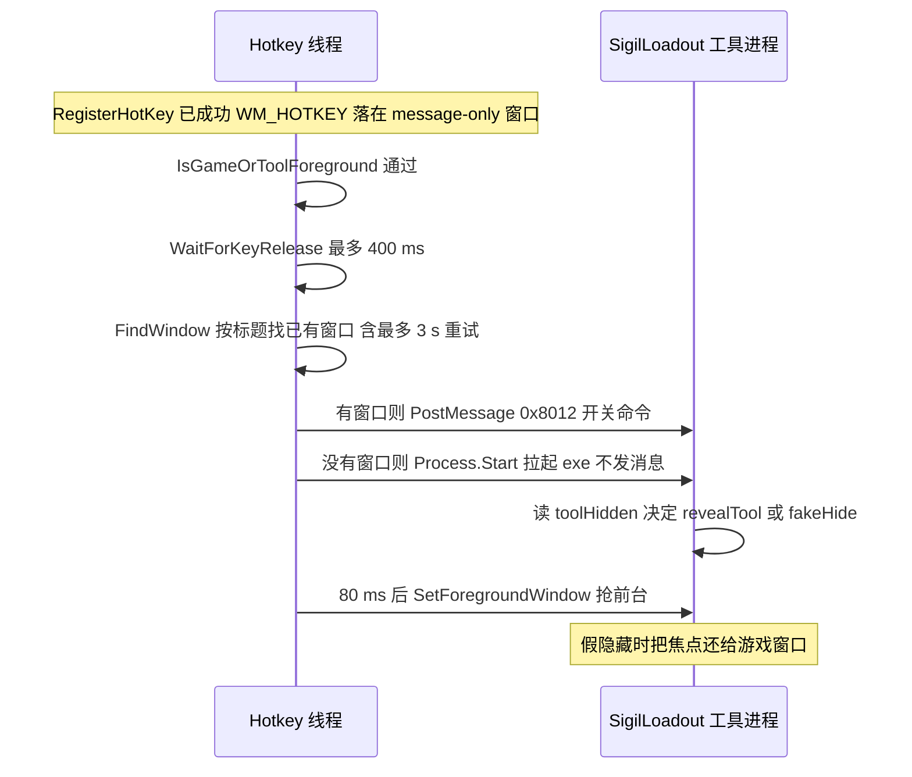
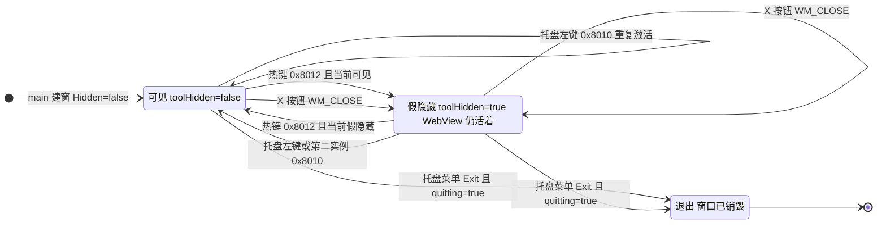

# 工作流：热键呼出/收起可视工具

游戏里按一下 F1（可配置），`SigilLoadout.exe` 的窗口就显出来；再按一下，它收回去。这条链横跨两个进程：注册热键和执行 `SetForegroundWindow` 的是**游戏进程里的托管 mod**，真正决定"显还是收"的是**工具进程自己**。两端之间只有窗口消息，**不传任何数据**——`0x8012`（热键的开关命令）与 `0x8010`（显示命令）的 `wParam` / `lParam` 全是 0，而且热键这条路只发前者。

三个入口汇到同一个窗口：**热键**（唯一有开关语义）、**标题栏 X 按钮**、**托盘左键与第二个实例**（永远是"显出来"）。这个划分不是风格问题，而是状态所有权的直接后果：工具可见/假隐藏的状态只存在于工具进程（`toolHidden`），mod 无从得知，所以热键只能发"开关"，而"显出来"是一个幂等的安全命令。工具那一侧的状态机与三条入口的完整语义在 [可视工具（Go + Wails）](/openwiki/architecture/visual-tool.md)；本页讲的是**按下去之后发生了什么**。



热键链路时序：mod 的消息窗口接住按键，按标题找到（或拉起）工具，发一条命令，然后由 mod 自己抢前台；收起那一半的焦点归还在工具侧完成。

## mod 侧：注册一次，消息驱动

`Hotkey.Configure` 每个 mod 生命周期只调一次（`Mod.QueueStart` 幂等），它做的事只有一件：起一条后台线程 `GBFR-Hotkey`，在那条线程上建一个 **message-only 窗口**（`CreateWindowEx` 的父窗口是 `HWND_MESSAGE = -3`，类名 `STATIC`，窗口名 `GBFRHotkey`——刻意与工具的窗口标题不同，`FindWindow` 按标题找工具时不会撞上 mod 自己的这扇隐形窗口），然后 `RegisterHotKey(hwnd, 0x47B1, MOD_NOREPEAT, vk)`。

消息驱动换掉了采样：`GetMessage` 循环只在有按键时醒来，所以既不丢也不重。两个细节是刻意的：

- **`MOD_NOREPEAT = 0x4000` 不能少。** 没有它，按住 F1 会连续产生 `WM_HOTKEY`，开关语义会变成反复横跳。
- **热键是无修饰键**（`fsModifiers` 里没有 `MOD_ALT`/`CONTROL`/`SHIFT`/`WIN`）。这不是偷懒，而是"游戏内工具"这个场景下唯一合理的选择；代价由前台门来付（见下一节）。

热键读一次就定下来：`HotkeyConfig.MenuHotkey` 从 Reloaded-II 的配置页（`HotkeyConfig.json`，配置页名 `Hotkey / 快捷键`）读出虚拟键，**运行期不再重注册**——`Configurable` 里官方模板那套运行期热重载被实现成永不触发的空操作，所以改热键要重启游戏。配置读不出来（目录无效、文件坏、强转失败）则记一行日志并以 `OverlayHotkey.F1` 配置，fallback 与正常路径共用同一个 `Hotkey.Configure`，所以"配置页坏了"不会让热键消失。手工编辑 JSON 写进枚举外的数字时，`HotkeyConfig.VirtualKey` 把它折回 F1（`JsonStringEnumConverter` 会收下任意整数，取值范围只能在派生属性里判）。

关停由 `Mod.Dispose` → `Hotkey.Shutdown` 完成，顺序也是有讲究的：置 `_threadExit` → 向消息窗口 post `WM_QUIT (0x0012)` → `Join(1000)`。**注销与 `DestroyWindow` 只由循环线程自己做**（跨线程 `DestroyWindow` 不安全；join 超时也不影响，因为关停路径从不跨线程碰这扇窗口），而 `_messageWindow` 只在 `RegisterHotKey` **之后**才发布出去——句柄可见就等于宣告"这对 (窗口, id) 已注册"。

### 这条链路上的常量

只列与热键呼出/收起直接相关的。`WM_APP` 之后的三条自定义消息由谁 post 决定语义：

| 值 | 声明处 | 作用 | 跨语言对拍 |
| --- | --- | --- | --- |
| 窗口标题 `GBFR Sigil Loadout` | C# `Hotkey.ToolWindowTitle`、Go `toolWindowTitle` | mod 用它 `FindWindow`；工具用它建窗 | ✓ |
| `wmToggle = 0x8012` | C# `Hotkey.WmToggle`、Go `win32.go` | 游戏内热键的开关命令 | ✓ |
| `wmActivate = 0x8010` | C# `Hotkey.WmActivate`、Go `win32.go` | 托盘 / 第二实例 / 兜底的显示命令 | ✓ |
| `wmFakeHide = 0x8011` | 只在 Go `win32.go` | 工具自己隐藏（前端 Esc）；mod 从不发 | ✗ 单处声明 |
| `WM_HOTKEY = 0x0312` | C# `Hotkey.cs` | 消息循环里唯一在意的消息 | ✗ |
| `MOD_NOREPEAT = 0x4000` | C# `Hotkey.cs` | 按住不重复触发 | ✗ |
| `HWND_MESSAGE = -3` | C# `Hotkey.cs` | message-only 父窗口 | ✗ |
| 热键 id `0x47B1` | C# `Hotkey.cs` | Register / Unregister 成对 | ✗ |
| `WM_CLOSE = 0x0010` | Go `windowstate.go` | X 按钮的假隐藏；退出时才真销毁 | ✗ |
| `WM_QUIT = 0x0012` | C# `Hotkey.cs` | 让消息循环退出 | ✗ |

窗口标题与三条 `WM_APP` 消息（`0x8010` / `0x8011` / `0x8012`）是同一组「工具窗口命令」跨语言常量，但对拍名单的边界更窄：只有**两侧都声明**的那几项（标题、`0x8010`、`0x8012`）被钉住；`0x8011` 只有 Go 一处声明——工具内部 post 给自己，没有第二方要跟它对齐，也就没有可漂移的对。

## 每次按下：前台门与按键抬起

`WM_HOTKEY` 到手后先过两道关，两道都不是可选的美化：

**前台门 `IsGameOrToolForeground`**：取 `GetForegroundWindow`，`GetWindowThreadProcessId` 拿 pid，再比进程名——只认 `granblue_fantasy_relink` 与 `SigilLoadout`。两个名字缺一不可：F2 这类无修饰键在别的程序里太常见，不该被全局抢走；而工具被呼出后自己就是前台（这正是 mod 那记 `SetForegroundWindow` 的作用），此时同一个按键必须还能把它收起来。取进程名可能抛（进程在比较之前退出），异常一律当"不是"。

**等按键抬起 `WaitForKeyRelease`**：最多 40 × 10 ms = 400 ms 轮询到键不再按下，然后才去拉工具。理由是同一颗键的 key-up 不能落到刚起来的启动器窗口上——那会被工具当成一次隐藏操作，于是"呼出"刚发生就自己收回去。这段等待只在消息路径上；轮询回退路径不等待（那一拍本来就是采样）。

整个处理被 `try/catch` 包住，异常绝不带走消息循环；`_threadExit` 会在处理前再查一次，把关停途中的在途热键丢掉。

## 找窗口、等窗口、拉起

`TryLaunchTool` 回答"工具在不在"，判据是窗口标题而不是进程：

1. `FindWindow(null, "GBFR Sigil Loadout")`。找到就走 `ActivateWindow(existing, toggle: true)`——post `0x8012`，日志 `Loadout tool is already running; toggled.`。
2. 没找到但 `SigilLoadout` 进程在跑（刚被拉起、窗口还没建出来），则 **60 × 50 ms 最多 3 秒**重试 `FindWindow`。这段等待窗就是为冷启动留的：进程已存在、窗口尚未出现的那几百毫秒里，若不等待就会重复 `Process.Start`。
3. 都没有 → 从**mod 目录**里取 `SigilLoadout.exe`，`Process.Start(UseShellExecute: true)`，日志 `Launched loadout editor tool.`。**这条路径不发任何消息、不抢前台**：新起的工具自己以 `Hidden: false` 建窗，本来就会显示。
4. exe 不在 mod 目录 → 只记一行 `SigilLoadout.exe not found in the mod directory.`。不弹框、不抛、不影响维护拍。

"窗口还在"是这条链能工作的前提：假隐藏从不销毁窗口（WebView 继续活着），所以工具整场游戏运行期间都只有一个标题可寻的窗口；重复按热键也不会重复起进程。真正拦住第二个实例的是工具那侧的命名互斥体 `Local\GBFRSigilLoadout`：第二次启动 exe 会按同一个标题找到已有窗口、`ShowWindow(SW_SHOW)` + post `0x8010` + `SetForegroundWindow`，然后 `os.Exit(0)`。

## 权限归属：为什么 `SetForegroundWindow` 必须跑在 mod 进程里

`ActivateWindow` 只有三行，但它是整条链路最容易改错的地方：

```
PostMessage(hWnd, (uint)(toggle ? WmToggle : WmActivate), IntPtr.Zero, IntPtr.Zero);
Thread.Sleep(80);
SetForegroundWindow(hWnd);
```

三步**全在 mod 进程里**。理由：Windows 把 `RegisterHotKey` 的那次按键当作真实的用户输入，**激活权属于注册热键的那个进程**——也就是游戏进程里的 mod。工具进程常驻后台，它自己去抢前台并没有这份权限。所以"谁发消息"和"谁抢前台"必须是同一个进程，不能把这个职责下推给工具。

`toggle` 形参默认 `false`（等于发 `0x8010`），但当前唯一的调用点是 `ActivateWindow(existing, toggle: true)`，所以**这条热键路径只会 post `0x8012`**；`0x8010` 的实际发送方是工具自己（托盘左键、第二个实例）。两个值仍各在两侧声明一份，由对拍测试钉住。

80 ms 是给工具处理消息的窗口：呼出那一半必须先由工具侧 `revealTool` 把窗口恢复可用（`EnableWindow(TRUE)`、alpha 回到 255），抢前台才有意义。

收起那一半则相反：工具把焦点还给游戏，此时 mod 对那扇刚被 `EnableWindow(FALSE)` 禁用的窗口调 `SetForegroundWindow` 会失败——**而这个失败正是想要的**，焦点本来就该在游戏那里。于是同一段代码同时服务两个方向，靠一侧成功、一侧失败各得其所。

注意区分：托盘左键（`tray.go`）与第二个实例（`startup.go`）那两条路上，`SetForegroundWindow` 是**工具进程自己**调的；只有热键这条路必须由 mod 代劳——激活权跟着 `RegisterHotKey` 那次按键走，而那次按键记在"注册热键的进程"名下，也就是游戏进程里的 mod，不是后台常驻的工具。

## 工具侧：三态、三条入口与焦点归还



窗口三态与能进到窗口的四条路：只有热键带开关语义，X 按钮只会收，托盘与第二实例只会显；唯一能把窗口真正销毁的是置了 `quitting` 的 `WM_CLOSE`。

四条路的后果**各不相同**，不能互相替换：

| 入口 | 发什么 | 后果 |
| --- | --- | --- |
| 游戏内热键 | `0x8012` | 唯一带开关语义的命令：可见就收、假隐藏就呼出；处理时先记下"工具抢走焦点之前的前台窗口"，再按 `toolHidden` 决定 `revealTool` + `Restore`/`Show`/`Focus` 还是 `fakeHide` |
| 标题栏 X 按钮 | `WM_CLOSE (0x0010)` | `quitting` 未置位时只假隐藏（WebView 保持活着）；置位时（框架 `cleanup()` → `window.Close()`）交回默认处理，窗口真的销毁。`quitting` 必须在 `window.Close()` 之前立起来（`main.go` 的关机钩子），否则退出会被改写成假隐藏 |
| 托盘左键 | `0x8010` | 永远"显出来"，不可能是收起。托盘只在"窗口不是前台"或"正假隐藏"时才 post，否则每个左键点击都会重放一次激活；随后由工具进程自己调 `SetForegroundWindow` |
| 第二个实例 | `0x8010` | 命名互斥体命中后按标题找到已有窗口，`ShowWindow(SW_SHOW)` + post + `SetForegroundWindow`，然后 `os.Exit(0)`——第二个进程不留下来，它只做一次激活 |

（工具自己还有第四条**内部**路径 `0x8011`：前端 Esc（150 ms 去抖）→ `MinimiseApp` → `hideToTray`。它不与 mod 通信，所以不在本页的消息表里。）

**焦点归还为什么是不变量。** `0x8010`/`0x8012` 的处理只在"当时的前台窗口不是 0、也不是工具自己"时才覆盖 `returnFocusTo`，否则保留上一个目标——这条正是"工具可见时按热键收起"能回到游戏的原因（那一刻前台就是工具自己）。`hideNow` 里三步的顺序不可交换：

1. `returnFocusTo.Swap(0)` 取走目标（取走即消费）。取到 0 说明这次不是被召唤出来的（从托盘或资源管理器打开），回落到 `nextForegroundWindow`——沿 Z 序向下找第一个**可见、启用、带标题**的顶层窗口，最多 16 步；Windows 会把隐藏/禁用的窗口继续当作前台窗口，所以不能只问 `GetForegroundWindow`。
2. `SetForegroundWindow(target)`。
3. 最后才 `EnableWindow(hwnd, FALSE)`。**必须在它之前**：`EnableWindow(FALSE)` 会同步移走焦点，那之后再想设置前台就没有权限了。

把焦点还给游戏是硬要求，因为 `IsGameOrToolForeground` 只认游戏与工具两个进程：如果不还，禁用后的窗口不再提供一个属于这两个进程的前台目标，**下一次按热键会被直接丢掉**，表现成"按了没反应"。

`SetForegroundWindow` 成功之后还有一处补丁：只有**这次是被游戏召唤的**（`returnFocusTo` 真的有过值）**且目标窗口确实属于游戏**时才注入一记点击。游戏把光标停在原处、只在下一记鼠标按下时才隐藏，所以焦点变化后的第一下点击会被吞掉（游戏内实测）；重放就是补上这一下（`LEFTDOWN` → 20 ms → `LEFTUP`，轮询会漏掉零长度的点击，1 ms 又太短），跑在单独的 goroutine 里。`isGameWindow` 用 `OpenProcess(PROCESS_QUERY_LIMITED_INFORMATION)` + `QueryFullProcessImageNameW` 拿进程映像名，只认 `granblue_fantasy_relink.exe`——直接打开的工具从不注入，因为向任意前台程序注入无条件点击是明确的危险动作。

## 为什么启动时不能预热工具进程

`Hotkey.Configure` 的注释里留着一条实测结论：**别改回"启动时 `Process.Start` 预热工具进程"，那会触发 .NET fatal**。于是工具进程只在两个时点起来：玩家手动运行，或者玩家在游戏里第一次按下热键。启动阶段（`QueueStart`）只做 `Configure` 起线程 + `RegisterHotKey`，**不拉起任何进程**。

代价是第一次按热键要等工具冷启动——而"进程已存在、窗口还没出现"那段正好由那 3 秒的 `FindWindow` 重试窗盖住。收益是 mod 的启动路径里没有第二个进程的创建，也没有随之而来的失败面。

## 回退：注册失败时退回 250 ms 轮询

`Hotkey.Tick` 挂在 mod 共用的 250 ms 维护拍上（与 `LoadoutConfig.Tick`、因子编辑同拍，整拍用 `_ticking` 串行化，重叠的拍丢掉）。它的第一行就是"注册成功则直接返回"；只有两种情况会真正走到采样：

- message-only 窗口建不出来（`CreateWindowEx` 返回 0）；
- `RegisterHotKey` 失败，通常是**这颗键已经被别的程序占了**。

两种情况各记一行日志（`Hotkey message window creation failed; fallback polling active.` / `RegisterHotKey unavailable (key may be taken); fallback polling active.`），然后由维护拍用 `GetAsyncKeyState` 的 `0x8000` 位做**边沿检测**（`_wasDown`）采样，同样要过前台门，命中则走同一个 `TryLaunchTool`。轮询是"零丢失"的退步：采样间隔内按下并抬起的按键会漏，而 `RegisterHotKey` 不会。

## 跨语言常量对拍

窗口标题与两条消息在 C#（`Hotkey.cs`）与 Go（`main.go` / `win32.go`）各自有声明，中间没有任何协商机制。`SigilLoadout/sharedconstants_test.go` 的 `TestSharedConstantsAgreeAcrossLanguages` 把它们钉在一起：每条声明必须**正好匹配一次**（正则写松了就会对着碰巧像它的东西比，比出来还是绿的——假绿），然后逐组 `EqualFold` 比较；Go 那侧按 `*.go` 拼接全部非测试源文件，所以一次纯搬移不会误报。同一道门也钉住了两个 JSON 文件名、`MaxSlots`、参槽数、哨兵与 `skill_status` 的行布局常量（见 [两个配置文件与跨语言常量契约](/openwiki/concepts/config-file-contracts.md)）。

漂移的症状值得记住：**标题漂了**，mod 的 `FindWindow` 永远找不到窗口，于是每次热键都试图拉起新实例，而新实例被命名互斥体拦下、去激活一个"找不到的窗口"后 `os.Exit(0)`——最终表现成"热键什么都不发生"；**消息值漂了**，工具要么不响应，要么开关语义反过来（第二次按不再收起）。这两个后果都不会编译失败，只会出现在游戏里。

这是一道对拍门，**不是"边界已证明"**：常量还要求两侧改不改、为什么是这个值，本页这张表与源码注释两边都得维护。而且它比的只有**字面量**——`EqualFold` 相等就算过，**语义没有任何机器检查**：把 `0x8010` 与 `0x8012` 的用途在某一侧写反（比如让工具把开关做成 `0x8010`），两侧数值仍然相等，测试照样是绿的，症状要等进游戏按热键才看得出。所以"哪个值是开关、哪个值是显示"这条约定只活在本页与两侧注释里。

## 不变量与失败语义

| 不变量 | 违反后的症状 |
| --- | --- |
| 热键只在注册它的进程里抢前台 | 工具是后台进程，`SetForegroundWindow` 没有激活权，窗口出来了但不聚焦或干脆不响应 |
| 收起时必须把焦点还给游戏（且在 `EnableWindow(FALSE)` 之前） | 前台不再属于游戏或工具 → 下一次热键被静默丢弃 |
| 同一颗键的 key-up 不能落到启动器窗口上 | 呼出后立刻被工具当成"隐藏"收回 |
| 无修饰键必须配前台门 | 其他程序里的 F2 被全局抢走；或呼出之后无法用同一个键收起 |
| `_messageWindow` 只在 `RegisterHotKey` 之后发布 | 关停路径可能对着"已发布但未注册"的窗口注销，成对关系被破坏 |
| 注销与 `DestroyWindow` 只由循环线程做 | 跨线程 `DestroyWindow` 不安全 |
| `MOD_NOREPEAT` 必须传 | 按住热键时开关反复横跳 |
| 消息循环绝不能因回调异常而死 | 热键彻底失效且只剩一行 catch 的日志 |
| 启动时不预热工具进程 | .NET fatal（源码注释里的实测结论） |
| 窗口标题与 `0x8010` / `0x8012` 两侧一致 | 见上一节；对拍测试立刻红 |
| 热键只读一次配置 | 配置页里"修改实时生效"的描述不成立，改键要重启游戏 |

降级都偏向"不带走游戏进程"：热键注册不上就退回轮询；`SigilLoadout.exe` 不在 mod 目录只记一行日志；工具那侧的单实例判定失手也只是两个实例并存。唯一"说清楚再退出"的是工具自己的坏安装（随包数据读不到 → `fatalDialog` + 退出码 1）。

## 运维：看什么、改什么

**mod 日志**（mod 目录下 `GBFR.SigilLoadout.log`）里与这条链直接相关的行：

- `Hotkey registered: F1 (0x70) via RegisterHotKey.` —— 正常路径，报的是实际生效的键。
- `RegisterHotKey unavailable (key may be taken); fallback polling active.` —— 键被占用，正在走轮询回退。
- `Hotkey message window creation failed; fallback polling active.` —— 消息窗口没建出来。
- `Launched loadout editor tool.` —— 这一次是冷启动。
- `Loadout tool is already running; toggled.` —— 这一次是开关已有窗口。
- `SigilLoadout.exe not found in the mod directory.` —— mod 目录不完整。
- `Hotkey configuration unavailable: …; falling back to the default F1 hotkey.` —— 配置页那份坏了。

**改键**：在 Reloaded-II 的配置页（`HotkeyConfig.json`，`Hotkey / 快捷键`）里选，可选值是 F1–F12 与 `Insert`/`Delete`/`Home`/`End`，默认 F1；改完**重启游戏**才生效。配置页的"Changes apply immediately / 修改实时生效"描述与源码不符，对照表在 [宿主与依赖边界（Reloaded-II / 数据管理器）](/openwiki/integrations/host-and-dependencies.md)。

**工具侧诊断**：焦点还给谁、`SetForegroundWindow` 的返回值与调用后的前台窗口、`EnableWindow` 的返回值都由 `debugf` 记进 exe 旁的 `tool-debug.log`，但只在 `tool-debug.on` 存在时才写（正式安装从不建这个标记）。看不清"焦点去哪了"时先看它。

## 相关页面

- [托管 mod（C# Reloaded 外壳）](/openwiki/architecture/managed-mod.md) —— 启动顺序里的热键装配与配置回退、维护拍为什么要能"让过去"。
- [可视工具（Go + Wails）：装配、单实例与窗口状态机](/openwiki/architecture/visual-tool.md) —— 消息另一端的窗口三态、假隐藏的扩展样式细节与托盘。
- [宿主与依赖边界（Reloaded-II / 数据管理器）](/openwiki/integrations/host-and-dependencies.md) —— 配置页"实时生效"为何不成立、`SupportedAppId` 如何限定这条链只发生在游戏进程内。
- [两个配置文件与跨语言常量契约](/openwiki/concepts/config-file-contracts.md) —— 对拍门与它钉住的全部常量、两个 JSON 的形状与 mtime 语义。
