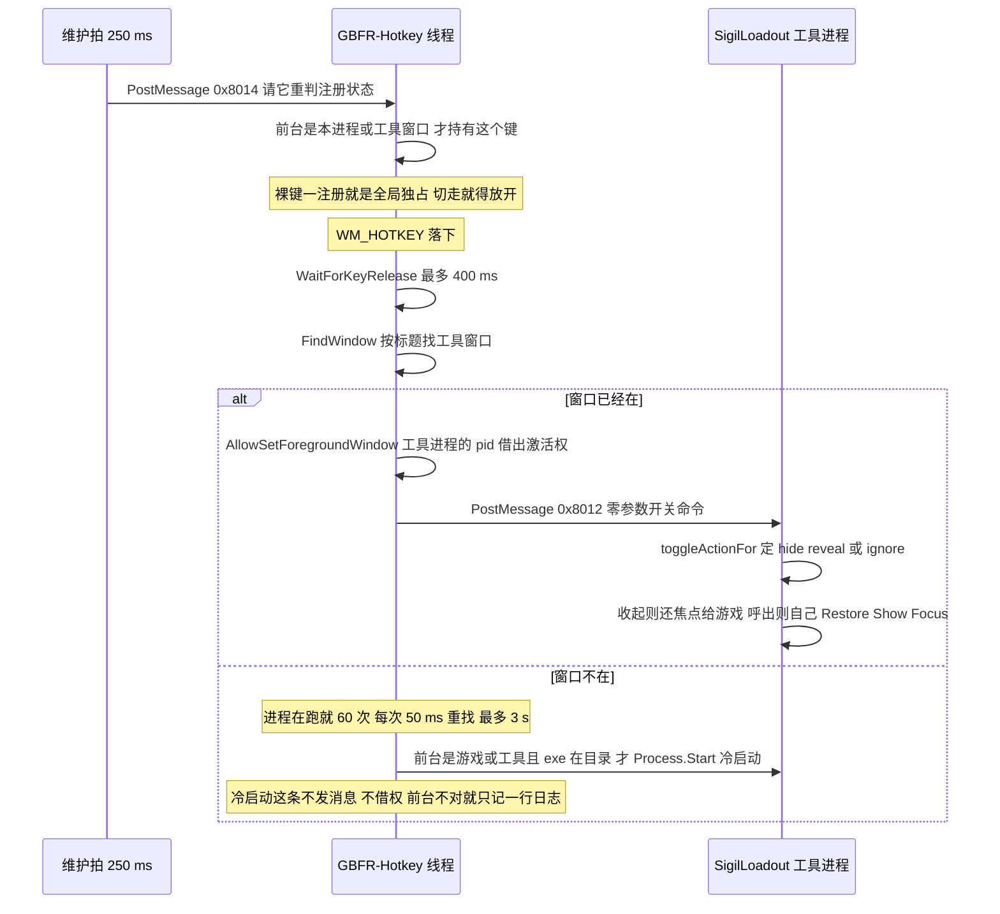
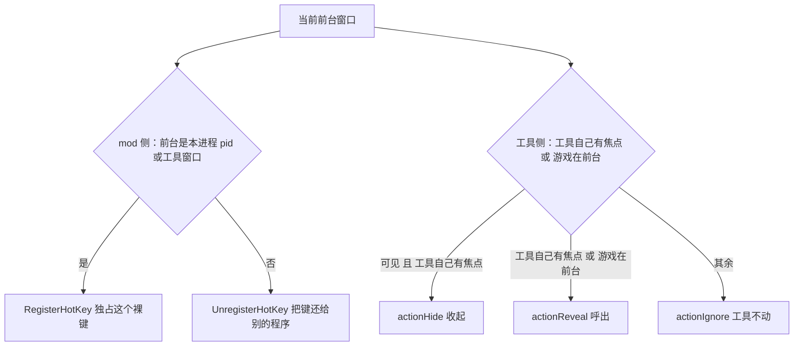
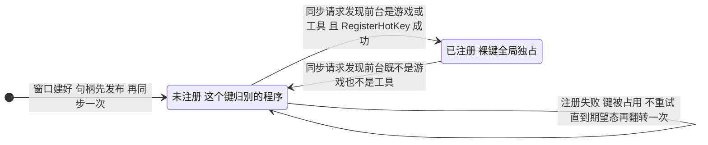
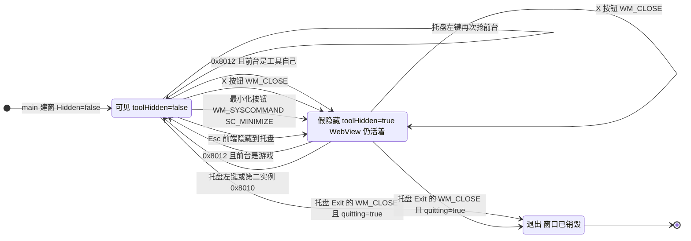

# 工作流：热键呼出/收起可视工具

游戏里按一下 F1（可配置），`SigilLoadout.exe` 的窗口就显出来；再按一下，它收回去。这条链横跨两个进程：注册热键、决定"这个键归谁"、把激活权借出去的是**游戏进程里的托管 mod**；真正决定"显还是收"的是**工具进程自己**。两端之间只有窗口消息、**不传任何数据**——热键这条路上 mod 只 post 一条零参数的 `0x8012`（`wParam` / `lParam` 全是 0）。

三个入口汇到同一扇窗口：**热键**（唯一有开关语义）、**标题栏 X 与最小化按钮**（只会收）、**托盘左键与第二个实例**（只会显）。这个划分不是风格问题，而是状态所有权的直接后果：工具的可见/假隐藏状态只存在于工具进程（`toolHidden`），mod 无从得知，所以热键只能发"开关"，而"显出来"是一条幂等的安全命令。工具那一侧的状态机、线程规则与假隐藏细节在 [可视工具（Go + Wails）](/openwiki/architecture/visual-tool.md)；本页讲的是**按下去之后发生了什么**，以及两个进程各自把住哪一道门。

## 一次按键的完整链路



热键链路时序：注册状态先跟着前台走（维护拍每 250 ms 让热键线程重判一次），按键落下后先等它抬起，再按标题找到（或拉起）工具。找到已有窗口那条路会**先把激活权借给工具进程**再 post `0x8012`，之后谁在前台完全由工具决定；冷启动那条什么都不发——新进程自己以 `Hidden: false` 建窗。

## 同一个条件，两处执行

这条链上最容易看错的一处是：mod 侧"要不要独占这个键"和工具侧"按下去做什么"用的是**同一个条件**——游戏在前台或工具自己有焦点。两侧都不能省，各自挡的却是不同的失败。



两侧的判据字面相同，读法与时机都不同：

| | mod 侧 `SyncRegistration` | 工具侧 `toggleActionFor` |
| --- | --- | --- |
| 判断依据 | 前台窗口句柄是否等于 `FindWindow(null, ToolWindowTitle)`；否则看前台窗口的进程 id 是否等于 `Environment.ProcessId`（mod 活在游戏进程里，所以"游戏在前台"不必查进程名） | 传入三元组：`toolHidden`、前台窗口是不是自己（`prev == hwnd`）、`isGameWindow(prev)`（按进程映像名后缀认 `granblue_fantasy_relink.exe`） |
| 什么时候判 | 收到 `0x8014` 同步请求时（由 250 ms 维护拍 post）；`WM_HOTKEY` 的处理本身**不重查**前台 | 收到 `0x8012` 的那一刻（冷启动等待窗里可能比按键晚几秒） |
| 挡的是什么 | **键的归属**：裸键一注册就全局独占，别的程序再也收不到它，所以只能在游戏或工具在前台那段时间持有 | **动作**：注册状态最多滞后一拍，这中间用户可能已经切走；而回退路径下压根没有注册状态可跟 |
| 结果 | `RegisterHotKey` / `UnregisterHotKey` | `actionHide` / `actionReveal` / `actionIgnore` |

**为什么工具侧这一份不是冗余。** 注册状态的每一次变化都只由"维护拍 post `0x8014` → 热键线程重判"驱动，所以注册状态与真实前台之间最多差一拍（≤250 ms）：用户在这一拍里切到别的程序，按键仍可能因为"键还没放开"而被系统消费，命令照样会到工具手上——那一刻只有工具自己知道"现在不该动"。第二段是回退路径（键被占用、消息窗口没建出来，或正按设计释放）：没有任何注册状态可以参考，按键来自 mod 的采样，也没有东西替工具挡。工具侧判据挡的正是这两段，删掉它就会出现"在别的程序里按 F1 把工具弹出来"。

## mod 侧：message-only 窗口 + 跟随前台的注册/释放

`Hotkey.Configure` 每个 mod 生命周期只调一次（`Mod.QueueStart` 幂等），它起一条后台线程 `GBFR-Hotkey`，在那条线程上建一个 **message-only 窗口**：`CreateWindowEx` 的父窗口是 `HWND_MESSAGE = -3`，类名 `STATIC`，窗口名 `GBFRHotkey`——刻意与工具的窗口标题不同，mod 按标题 `FindWindow` 找工具时不会撞上自己这扇隐形窗口。建不出来（返回 0）就记一行日志并放弃消息路径，退回轮询。

**句柄先发布，注册与否后定。** 窗口句柄在 `SyncRegistration()` 之前就写进 `_messageWindow`，因为每个维护拍都要往它 post 同步请求；"注册没注册"不再是建窗的副产品，而是 `_hotKeyRegistered` 里那个随前台变化的量。

注册状态本身是一个两态机，由同步请求驱动：



`SyncRegistration` 有两个刻意的设计：

- **只在"期望态"翻转时动手。** `_wantRegistered` 记住上一次算出来的结果，值没变就直接返回——否则键被别的程序占着时，会变成每个维护拍重试一次 `RegisterHotKey`、每个拍刷一条失败日志。
- **注册与释放各记一行日志**（`Hotkey registered: F1 (0x70) via RegisterHotKey.` / `Hotkey released: another program is in the foreground.`）。于是这两行是**每次前台归属变化各一条**，一次会话里可能反复出现——这是运维读日志时的预期，不是故障。

**热键是无修饰键，且必须传 `MOD_NOREPEAT`。** `fsModifiers` 里没有 `MOD_ALT`/`CONTROL`/`SHIFT`/`WIN`：游戏内这个场景下组合键会被游戏自己吃掉，裸键是合理选择，代价由上面那道"注册跟随前台"和工具侧判据一起付。`MOD_NOREPEAT = 0x4000` 则防住按住不放时的反复触发——没有它，开关语义会变成反复横跳。

**为什么启动时不能预热工具进程。** `Configure` 的注释里留着一条实测结论：**别改回"启动时 `Process.Start` 预热工具进程"，那会触发 .NET fatal**。所以启动阶段（`Configure`）只起线程、建窗口、同步一次注册，**不拉起任何进程**；工具只在玩家手动运行或在游戏里第一次按下热键时起来。代价是第一次按热键要等工具冷启动，而"进程已存在、窗口还没出现"那段正好由 mod 那 3 秒的重找窗口窗盖住。

**关停。** `Mod.Dispose` → `Hotkey.Shutdown`：置 `_threadExit` → 向消息窗口 post `WM_QUIT (0x0012)` → `Join(1000)`；`UnregisterHotKey` 与 `DestroyWindow` 只由消息循环线程自己执行（跨线程 `DestroyWindow` 不安全，join 超时也不影响，因为关停路径从不跨线程碰这扇窗口）。注意句柄现在**先于注册**发布，所以"句柄可见"不再等于"已注册"——它只等于"窗口可用、能收同步请求"。

### 这条链路上的命令与常量

| 消息 | 值 | 谁 post | 收方做什么 |
| --- | --- | --- | --- |
| `wmToggle` | `0x8012` | mod（游戏内热键，唯一一条；post 之前先借出激活权） | `toggleActionFor` 三态判定，再决定收起或呼出 |
| `wmActivate` | `0x8010` | 工具自己（托盘左键、第二个实例） | 记 `returnFocusTo` → 必要时 `revealTool` → `Restore`/`Show`/`Focus` |
| `wmFakeHide` | `0x8011` | 工具自己（前端 Esc、X 按钮、最小化按钮） | `hideNow`，必须跑在 UI 线程 |
| `WmSyncRegistration` | `0x8014` | mod 的维护拍 → mod 自己的消息窗口 | 重判"现在该不该注册这个键"（不出进程） |

其余与这条链相关、但没有第二个声明方的常量：

| 值 | 声明处 | 作用 | 跨语言对拍 |
| --- | --- | --- | --- |
| 窗口标题 `GBFR Sigil Loadout` | C# `Hotkey.ToolWindowTitle`、Go `toolWindowTitle`（`main.go`） | mod 用它 `FindWindow`；工具用它建窗 | ✓ |
| `wmToggle = 0x8012` | C# `Hotkey.WmToggle`、Go `win32.go` | 游戏内热键的开关命令 | ✓ |
| `wmActivate = 0x8010` | 只在 Go `win32.go` | 工具自己的激活命令；mod 侧已不再声明 | ✗ |
| `wmFakeHide = 0x8011` | 只在 Go `win32.go` | 工具自己隐藏 | ✗ |
| `WmSyncRegistration = 0x8014` | 只在 C# `Hotkey.cs` | 维护拍给热键线程的同步请求 | ✗ |
| `WM_HOTKEY = 0x0312` | C# | 消息循环里唯一在意的系统消息 | ✗ |
| `MOD_NOREPEAT = 0x4000` | C# | 按住不重复触发 | ✗ |
| `HWND_MESSAGE = -3` | C# | message-only 父窗口 | ✗ |
| 热键 id `0x47B1` | C# | Register / Unregister 成对 | ✗ |
| `WM_QUIT = 0x0012` | C# | 让消息循环退出 | ✗ |
| `WM_CLOSE = 0x0010` / `WM_SYSCOMMAND = 0x0112` / `SC_MINIMIZE = 0xf020` | Go `windowstate.go` | X 与最小化按钮都只假隐藏 | ✗ |

## 按下之后：借出激活权，而不是自己抢前台

`WM_HOTKEY` 到手后的处理只有两句，但两句都不是可选的美化：

- **先等按键抬起 `WaitForKeyRelease`**：最多 40 × 10 ms = 400 ms 轮询到键不再按下，然后才去拉工具。理由是同一颗键的 key-up 不能落到刚起来的工具窗口上——那会被工具当成一次隐藏，于是"呼出"刚发生就自己收回去。这段等待只在消息路径上，轮询回退路径不等待（那一拍本来就是采样）。
- **整段被 `try/catch` 包住**，异常绝不带走消息循环；处理前还会重查 `_threadExit`，把关停途中的在途热键丢掉。

`TryLaunchTool` 回答"工具在不在"，判据是**窗口标题**而不是进程：

1. `FindWindow(null, "GBFR Sigil Loadout")`。找到就走 `ActivateWindow(existing)`，日志 `Loadout tool is already running; toggled.`。
2. 没找到但 `SigilLoadout` **进程**在跑（刚被拉起、窗口还没建出来），则 **60 × 50 ms 最多 3 秒**重试 `FindWindow`。这段等待窗就是为冷启动留的：进程已存在、窗口尚未出现的那几百毫秒里，若不等待就会重复 `Process.Start`。（托管侧只剩 `IsToolProcessRunning` 还按进程名判断，而且它只用来决定"要不要等窗口"，不再是前台门。）
3. 都没有 → 先过一道 mod 自己的前台判据 `GameOrToolIsForeground()`：不是游戏也不是工具在前台就记 `Hotkey ignored: neither the game nor the tool was in the foreground.` 然后结束。这一步是必须的，因为**工具还没被启动，工具那套判据此刻还不存在**——少了它，在任何程序里按 F1 都会把工具弹出来。
4. 前台放行后从**mod 目录**取 `SigilLoadout.exe`，`Process.Start(UseShellExecute: true)`，日志 `Launched loadout editor tool.`。exe 不在 mod 目录就只记一行 `SigilLoadout.exe not found in the mod directory.`——不弹框、不抛、不影响维护拍。这条冷启动路径**不发消息、也不借激活权**：新起的工具自己以 `Hidden: false` 建窗。

真正把窗口带到用户手上的那一小段只有三行，而且**每一步都在讲权限归属**：

```
GetWindowThreadProcessId(hWnd, out uint toolPid);
AllowSetForegroundWindow((int)toolPid);
PostMessage(hWnd, (uint)WmToggle, IntPtr.Zero, IntPtr.Zero);
```

Windows 把 `RegisterHotKey` 的那次按下当成真实的用户输入，**激活权记在注册热键的那个进程名下**——也就是游戏进程里的 mod，不是常驻后台的工具。所以 mod 用 `AllowSetForegroundWindow` 把这份权限借给**工具的进程 pid**，借出之后工具自己那一记 `win.Focus()` 才真正生效。

也是因为这份权限只有 mod 有，mod 才刻意不再自己抢前台：源码注释写明了反面——**再抢一次会把焦点从游戏手里夺回来（游戏随即把光标放出来）**。于是"呼出"与"收起"两个方向完全交给工具那一处规则决定，mod 只做两件事：借权、发命令。呼出与收起共用同一条命令（`0x8012`）而不是两条，原因也在这里：方向由工具侧的状态与前台归属决定，mod 没有、也不该有这份知识。

## 工具侧：三态判定与焦点归还



窗口三态与能改变它的入口：只有热键带开关语义；X、最小化按钮与工具自己的 Esc 只会收；托盘与第二实例只会显；唯一能把窗口真正销毁的是置了 `quitting` 的 `WM_CLOSE`（只有托盘 Exit → `app.Quit()` 那条路走到它）。

`0x8012` 的处理顺序是"先判该不该动，再记目标，最后动手"：

1. 读当时的前台窗口 `prev`、`toolHidden`、`prev == hwnd`、`isGameWindow(prev)`，交给 `toggleActionFor` 得一个三态结果；
2. `actionIgnore` 直接返回——**连 `returnFocusTo` 都不动**（这条就是在别的程序里按的按键，工具完全不理）；
3. 否则若 `prev` 非 0 且不是工具自己，把 `prev` 记进 `returnFocusTo`（工具抢走焦点**之前**的前台窗口，热键那条路上就是游戏）；
4. `actionHide` 走 `fakeHide`（交给 UI 线程的 `hideNow`），`actionReveal` 走 `revealTool` + `Restore`/`Show`/`Focus`。

规则的唯一权威是 `windowstate.go` 的纯函数 `toggleActionFor(hidden, selfForeground, gameForeground)`，`windowstate_test.go` 的 `TestToggleActionFollowsTheUsersRule` 按用户口述的规则逐条钉住（含"别的程序在前台"那两例），所以这条规则可以被单独读、单独测：

| hidden | selfForeground | gameForeground | 结果 |
| --- | --- | --- | --- |
| true | false | true | `actionReveal`（游戏在前台、工具在托盘） |
| false | false | true | `actionReveal`（游戏在前台、工具可见但在后面） |
| 任意 | true | 任意 | `actionHide`（工具自己有焦点就是收起） |
| true | false | false | `actionIgnore` |
| false | false | false | `actionIgnore` |

**焦点归还为什么是不变量。** `hideNow` 里三步的顺序不可交换：

1. `returnFocusTo.Swap(0)` 取走目标（取走即消费）。取到 0 说明这次不是被召唤出来的（从托盘或资源管理器直接打开、或可见时按 Esc / 点 X），回落到 `nextForegroundWindow`——沿 Z 序向下找第一个**可见、启用、带标题**的顶层窗口，最多 16 步；Windows 会把隐藏/禁用的窗口继续当作前台窗口，所以不能只问 `GetForegroundWindow`。
2. `SetForegroundWindow(target)`。
3. 最后才 `EnableWindow(hwnd, FALSE)`。**必须在它之前**：`EnableWindow(FALSE)` 会同步移走焦点，那之后再想设置前台就没有权限了。

把焦点还给游戏是硬要求：两侧的判据都只放行"游戏在前台或工具自己有焦点"。如果收起之后焦点既没回到游戏、也没留在工具手上，mod 会放开这个键、工具也会对下一记 `0x8012` 返回 `actionIgnore`——用户看到的是"按了没反应"。

**那记重放的光标隐藏点击**只在两个条件同时成立时注入：`SetForegroundWindow` 这次真的成功（返回值非 0），**且目标窗口属于游戏**。判据刻意从"这次是被召唤的"改成了"焦点真的交回给了游戏"：目标由 Z 序兜底找来时也算，因为那记点击本来只可能打进游戏，而游戏接下来必定吞掉第一击（游戏把光标停在原处，只在下一记鼠标按下时才隐藏）。它跑在单独的 goroutine 里：先睡 20 ms 给游戏处理焦点变化，再 `LEFTDOWN`、睡 20 ms、`LEFTUP`（轮询会漏掉零长度的点击，1 ms 又太短）。`isGameWindow` 用 `OpenProcess(PROCESS_QUERY_LIMITED_INFORMATION)` + `QueryFullProcessImageNameW` 拿进程映像名，只认 `granblue_fantasy_relink.exe`——直接打开的工具从不注入，向任意前台程序注入无条件点击是明确的危险动作。

**工具自己隐藏还有一条不与 mod 通信的内部路径**：前端 Esc 在 keyup 之后等 150 ms 调绑定的 `ShellService.MinimiseApp`，落到 `hideToTray` → `findToolWindow` → `fakeHide`；X 按钮的 `WM_CLOSE` 处理里调的也是同一个 `fakeHide`；**最小化按钮（`WM_SYSCOMMAND` / `SC_MINIMIZE`）走的是第三条**，因为它根本不经过 `WM_CLOSE`——真最小化不经过 `hideNow`，那记光标隐藏点击就不会重放、焦点也不是明确交回去的（实测表现成"最小化之后指针留在游戏里"），所以它被改写成和 X 同一件事。三条路最后都收敛成"向工具自己的 UI 线程 post `0x8011`"。

**另外两条入口的语义是刻意不对称的**：托盘左键只在"窗口不是前台"或"正假隐藏"时才 post `0x8010`（否则每个左键点击都会重放一次激活），随后由工具进程自己调 `SetForegroundWindow`；第二个实例被命名互斥体 `Local\GBFRSigilLoadout` 拦下后，按标题找到已有窗口、`ShowWindow(SW_SHOW)` + post `0x8010` + `SetForegroundWindow`，然后 `os.Exit(0)`——它只做一次激活，不留下来。这两条路发的是 `0x8010`（永远是"显示/还原/聚焦"），而且 `SetForegroundWindow` 是**工具自己**调的；热键那条路上 mod 自己不调它，改成了借权。

## 回退：没注册成时退回 250 ms 轮询

`Hotkey.Tick` 挂在 mod 共用的 250 ms 维护拍上（与 `LoadoutConfig.Tick`、因子编辑同拍，整拍用 `_ticking` 串行化，重叠的拍丢掉）。它有两件事，顺序是硬要求：

1. **先 post 同步请求**：只要 `_messageWindow` 已经发布，就往它 post 一条 `0x8014`。这一句必须排在下面的提前返回**之前**：注册成功时"释放"这件事完全依赖维护拍送进来的同步请求，少一次就再也放不开这个键。
2. 然后 `if (_hotKeyRegistered) return;`——注册着的时候响应的责任在消息那一边，采样这半边必须闭嘴，否则一次按键会被处理两遍。

也就是说，**采样在"这个键现在没注册"时都是活的**，共有三种来源：消息窗口建不出来、`RegisterHotKey` 失败（键被别的程序占了）、以及**按设计被释放**（前台切到了别的程序）。采样本身不查前台（前台判据只剩两个地方：`SyncRegistration` 与冷启动分支），所以这段窗口里按下的键会照样走到 `TryLaunchTool`：已有窗口时它会 post `0x8012`，判成什么完全看工具接手那一刻前台是谁——前台是游戏就正常呼出/收起，前台是别的程序就是 `actionIgnore`；工具没开时会撞上 mod 那道前台判据并记一行 `Hotkey ignored: ...`。三种来源各有一条日志。

**两条路径对同一颗键的语义不同**，检出之后的行为却完全一样（都走同一个 `TryLaunchTool`）：

| | 键注册着（消息路径） | 键没注册（250 ms 采样） |
| --- | --- | --- |
| 谁发现按键 | 系统把 `WM_HOTKEY` 投进消息窗口，`GetMessage` 循环接收 | 维护拍采样 `GetAsyncKeyState` 的 `0x8000` 位 |
| 这颗键是否被系统拿走 | 是：key-down 被当成热键消费，前台窗口收不到它 | 否：按键照常送到前台窗口，游戏也会看到同一颗键 |
| 按住不放 | `MOD_NOREPEAT` 保证只触发一次 | 边沿检测（`down && !_wasDown`）同样只触发一次 |
| 快按 | 一次不漏（消息在队列里排着） | 相邻两拍之间按下又抬起的按键会被整段漏掉，且不留任何日志 |
| 采样时机 | 按键落下立即处理，跑在独立的 `GBFR-Hotkey` 线程上 | 跟着维护拍走，排在同拍里配装 tick 与因子编辑之后，会被更慢的阶段拖后 |
| 按键抬起 | `WaitForKeyRelease` 最多等 400 ms，先等 key-up 再拉工具 | 不等：检出边沿就去拉工具，key-up 可能落到刚聚焦的工具窗口上 |
| 触发条件 | 由"注册状态跟随前台"决定（前台不是游戏或工具时会主动放开） | 任何"没注册"的时刻都算，包括上面那次主动放开 |

所以回退不是等价替代：它照样能呼出/收起，但会在低概率下**静默丢掉一整个按键**，而且这颗键不再被系统从游戏那里拿走——游戏会照样收到它。

## 跨语言常量对拍

窗口标题与 `wmToggle` 在 C#（`Hotkey.cs`）与 Go（`main.go` / `win32.go`）各自声明，中间没有任何协商机制。`SigilLoadout/sharedconstants_test.go` 的 `TestSharedConstantsAgreeAcrossLanguages` 把它们钉在一起：每条声明必须**正好匹配一次**（正则写松了就会对着碰巧像它的东西比，比出来还是绿的——假绿），然后逐组 `EqualFold` 比较；Go 那侧按 `*.go` 拼接全部非测试源文件，所以一次纯搬移不会误报。同一道门也钉住了两个 JSON 文件名、`MaxSlots`、参槽数、哨兵与 `skill_status` 的行布局常量（见 [两个配置文件与跨语言常量契约](/openwiki/concepts/config-file-contracts.md)）。

**对拍名单的边界比"看起来该对拍的东西"更窄。** 现在只有两项在这条链上：窗口标题与 `wmToggle`。`wmActivate = 0x8010` 曾经两侧各有一份，现在**只有 Go 一处声明**（mod 已经不再发这条命令，所以 `Hotkey.cs` 里的 `WmActivate` 也随之消失），`wmFakeHide = 0x8011` 更是从工具进程内部 post、从来没有第二方——两者都没有第二个声明可漂，也就不在对拍名单里；`0x8014` 与之相反，只有 C# 一处声明、从不越过进程边界。

漂移的症状值得记住：**标题漂了**，mod 的 `FindWindow` 永远找不到窗口，于是每次热键都试图拉起新实例，而新实例被命名互斥体拦下、去激活一个"找不到的窗口"后 `os.Exit(0)`——最终表现成"热键什么都不发生"；**`wmToggle` 漂了**，工具根本不认这条消息（当成无关消息交回 Wails 的默认处理），表现成"按键没反应"（开关语义反过来则表现为第二次按不再收起）。这两个后果都不会编译失败，只会出现在游戏里。

这是一道对拍门，**不是"边界已证明"**：这些值该不该改、为什么是这个值，本页这张表与两侧源码注释两边都得维护。而且它比的只有**字面量**——`EqualFold` 相等就算过，**语义没有任何机器检查**：`0x8012` 到底代表哪条命令、两侧有没有用对，没有任何断言护着；把它的用途在某一侧写反，两侧数值仍然相等，测试照样是绿的，症状要等进游戏按热键才看得出。

## 不变量与失败语义

| 不变量 | 违反后的症状 |
| --- | --- |
| 裸键只在游戏或工具在前台时注册 | 别的程序再也收不到这个键（全局独占），像被永久抢走 |
| 期望态只在翻转时才动手 | 键被别的程序占着时每拍重试注册 + 每拍刷一条失败日志 |
| 同步请求必须发在 `Tick` 的提前返回之前 | 注册成功后前台切走也放不开，这个键一直被独占 |
| 激活权必须先借给工具进程 | 工具那记 `Focus` 被拒，窗口出来了但不聚焦 |
| mod 不再自己抢前台 | 呼出时把焦点从游戏手里夺回来（游戏随即把光标放出来） |
| 工具侧判据不能删 | 滞后一拍或回退路径下，F1 会在无关程序里把工具召出来 |
| 收起时必须把焦点还给游戏（且在 `EnableWindow(FALSE)` 之前） | 前台既不在游戏也不在工具 → 下一次热键被忽略，表现成"按了没反应" |
| 同一颗键的 key-up 不能落到工具窗口上 | 呼出后立刻被工具当成一次隐藏收回 |
| `MOD_NOREPEAT` 必须传 | 按住热键时开关反复横跳 |
| `_messageWindow` 在注册**之前**发布 | 不是错误，但句柄可见不再等于"已注册"；判断注册状态只能读 `_hotKeyRegistered` |
| 注销与 `DestroyWindow` 只由循环线程做 | 跨线程 `DestroyWindow` 不安全 |
| 消息循环绝不能因回调异常而死 | 热键彻底失效且只剩一行 catch 的日志 |
| 启动时不预热工具进程 | .NET fatal（源码注释里的实测结论） |
| 窗口标题与 `wmToggle` 两侧一致 | 见上一节；对拍测试立刻红 |
| 热键只读一次配置 | 配置页里"修改实时生效"的描述不成立，改键要重启游戏 |
| 工具没开时由 mod 自己判前台 | 在任何程序里按 F1 都会把工具弹出来 |

降级都偏向"不带走游戏进程"：热键注册不上就退回轮询；`SigilLoadout.exe` 不在 mod 目录只记一行日志；工具那侧的单实例判定失手也只是两个实例并存。唯一"说清楚再退出"的是工具自己的坏安装（随包数据读不到 → `fatalDialog` + 退出码 1）。

## 运维：看什么、改什么

**mod 日志**（mod 目录下 `GBFR.SigilLoadout.log`）里与这条链直接相关的行：

- `Hotkey registered: F1 (0x70) via RegisterHotKey.` —— 每次前台回到游戏或工具时报一条（报的是实际生效的键），不是一次会话一条。
- `Hotkey released: another program is in the foreground.` —— 前台切走、这个键已经还回去了。
- `RegisterHotKey unavailable (key may be taken); fallback polling active.` —— 键被占用，这次没注册上；要等期望态再翻转才会重试。
- `Hotkey message window creation failed; fallback polling active.` —— 消息窗口没建出来。
- `Loadout tool is already running; toggled.` —— 这一次是开关已有窗口。
- `Hotkey ignored: neither the game nor the tool was in the foreground.` —— 工具没开、前台又不是游戏或工具，这次按键直接丢掉。
- `Launched loadout editor tool.` —— 这一次是冷启动。
- `SigilLoadout.exe not found in the mod directory.` —— mod 目录不完整。
- `Hotkey configuration unavailable: …; falling back to the default F1 hotkey.` —— 配置页那份坏了。

**改键**：在 Reloaded-II 的配置页（`HotkeyConfig.json`，`Hotkey / 快捷键`）里选，可选值是 F1–F12 与 `Insert`/`Delete`/`Home`/`End`，默认 F1；改完**重启游戏**才生效。配置页的"Changes apply immediately / 修改实时生效"描述与源码不符，对照表在 [宿主与依赖边界（Reloaded-II / 数据管理器）](/openwiki/integrations/host-and-dependencies.md)。

**工具侧诊断**：`0x8012` 到手时会先记一行 `wmToggle hwnd=… fg=… hidden=… rf=… game=… -> …`，把那一刻的判据（前台窗口、`toolHidden`、记下的归还目标、目标是不是游戏、判定结果）全写出来；焦点还给谁、`SetForegroundWindow` 的返回值与调用后的前台窗口、注入点击的每一步也各有行。这些都只在 exe 旁存在 `tool-debug.on` 时才写进 `tool-debug.log`（正式安装从不建这个标记）。看不清"焦点去哪了"时先看它。

## 相关页面

- [托管 mod（C# Reloaded 外壳）](/openwiki/architecture/managed-mod.md) —— 启动顺序里的热键装配与配置回退、维护拍为什么要能"让过去"。
- [可视工具（Go + Wails）：装配、单实例与窗口状态机](/openwiki/architecture/visual-tool.md) —— 消息另一端的窗口三态、放行判据、假隐藏的扩展样式细节与托盘。
- [宿主与依赖边界（Reloaded-II / 数据管理器）](/openwiki/integrations/host-and-dependencies.md) —— 配置页"实时生效"为何不成立、`SupportedAppId` 如何限定这条链只发生在游戏进程内。
- [两个配置文件与跨语言常量契约](/openwiki/concepts/config-file-contracts.md) —— 对拍门与它钉住的全部常量、两个 JSON 的形状与 mtime 语义。
