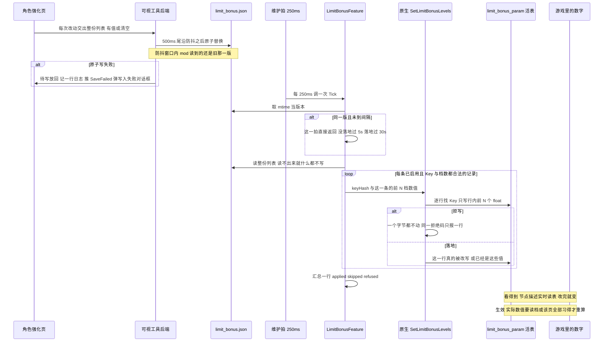
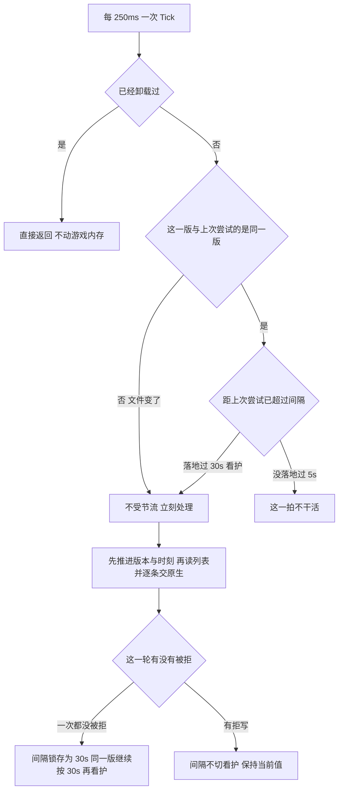

# 工作流：角色强化数值编辑与热应用

这条链路把一个数值框里的一次输入变成 `limit_bonus_param` 活表里被改写的若干 `float`。界面这一页叫**角色强化**（`messages.ts` 的 `tabLimitBonus`，中文就是「角色强化」），代码与 mod 侧的名字是能力强化；术语按 [CONTEXT.md](repo://CONTEXT.md) 用**能力**、**活表**、**数据管理器**，内存里那张表叫 `limit_bonus_param`。

四个程序/角色参与：

| 角色 | 在这条链上干什么 | 代码 |
| --- | --- | --- |
| 可视工具前端（React） | 一次输入 → 一条记录；每改一次就把**整份列表**交出去 | `SigilLoadout/frontend/src/components/LimitBonusEditorPanel.tsx`、`frontend/src/lib/limitbonus.ts` |
| 可视工具后端（Go / Wails） | 500ms 尾沿防抖 + 原子替换 `limit_bonus.json` | `SigilLoadout/service/limitbonusservice.go`、`appfiles/debouncedwrite.go`、`appfiles/atomicwrite.go` |
| 托管 mod（C#） | 250ms 维护拍里的一个阶段：按 mtime 判版本、逐条校验、每条一次原生调用 | `GBFR.SigilLoadout/LimitBonusFeature.cs`、`LimitBonusConfig.cs`、`NativeCore.Interop.cs` |
| 原生核心（C++） | 按 Key 唯一性认行，只写那一行行内前 N 个 `float` | `GBFR.SigilLoadout.Native/src/table_slot.cpp`、`src/exports.cpp` |

两侧之间**只有 `%LOCALAPPDATA%\GBFRSigilLoadout\limit_bonus.json` 一个通道**，没有握手、没有通知。路径与文件名、四个成员名、「各只有一处声明」的纪律与「空数组/坏文件」在三份文件里各自的含义见 [两个配置文件与跨语言常量契约](/openwiki/concepts/config-file-contracts.md)；行布局、锚点、`-8..-11` 四条自有拒绝码与写入闸门见 [limit_bonus_param 活表与能力强化数值](/openwiki/concepts/limit-bonus-table.md)，本页不复述它们。

## 全链路

上图：一次输入到活表的全程，以及两条时间线（下面「看得到 vs 生效」）。注意四个节奏是四个不同的数：**500ms**（编辑停下来没有，写盘侧）、**250ms**（维护拍多久问一次文件）、**5s / 30s**（同一版多久重交一次，读盘侧）。

## 一、界面上的一次输入落成什么记录

这一页一行就是**第一档**（`Lv1`），所以「一条编辑」的形状比因子编辑页窄得多（对比见 [工作流：因子数值编辑与热应用](/openwiki/workflows/sigil-edit-apply.md)）：

- **有值就是启用。** 这一页没有启用勾选框，`withFirstValue(param, value)` 交出的记录是 `{enabled: true, key: param.key, values: [value]}`——长度恒为 1。`enabled` 只在手写文件里才可能是 `false`。
- **一个框写给该节点的全部参数行。** 一个节点挂 1 条参数行（能力强化），或 3 条（「全部上限」类，三条默认值永远相同——游戏就是同一个数同时加到三项上），所以 `setValue` 遍历 `ability.params` 逐个 `withFirstValue`：填一个值 = 写这个节点的每条参数行各一条记录（3 条记录 = 3 次原生调用）。
- **清空 = 从列表里删掉整条记录**（`withFirstValue(param, null)` 返回 `null`）。这一行于是回到「完全没编辑过」的样子，而**不是**写一个默认值进去。本来就没编辑过时清空连一次落盘都不发生（`changed` 为假）。
- **列表还没读回来就绝不写盘**（`editListRead`）。此时屏幕上的 `Map` 是空的，交出去的这份空列表会被后端整体替换，用户其余的编辑一次就没了。
- **挂载只读一次，且只归一化、不写回**：`asEdit` 把 Key 归一成大写、把不是数组的 `values` 当空，**不打补丁、不落盘**——「打开一次可视工具」本身不是一次对游戏的改动。这一页与因子编辑页一样是 `keepMounted` 的，否则在防抖窗口内切走再切回来会读到还没写下的旧文件。
- **一个 Key 最多一条记录。** 地址就是记录自己的参数行 Key，`skills.ts` 的 `dedupeBy` 留**最后一条已启用的**（该 Key 一条已启用的都没有时留最后一条）。这一条与活表那层「Key 在整张表里恰好一次」不是同一条约束：文件里两条 → 后一条生效（mod 按列表顺序逐条各写一次），活表里两行同 Key → 直接 `-10` 拒写。

一处容易看漏的落差：手写进文件里的 `enabled: false` 记录**会被读进面板并照它的 `values[0]` 显示**（框里看得见那个数），随后每一次保存又把它原样写回；而 mod 跳过它，游戏里保持原值。也就是说，只有在你手改过文件的前提下，屏幕上的数字与游戏里正在生效的值才会不一致。

## 二、落盘：500ms 尾沿防抖 + 原子替换

`commit` 把整份列表交给 `SaveLimitBonusEdits`，**不等答复**；Go 侧只做一件事：`Submit("limit bonus edit", writeLimitBonusEdits, edits)`——把待写换成这一份并重置定时器。

- **尾沿防抖 500ms**（`appfiles.DebounceDelay`）：一串连续按键只换来一次写入，而写出的永远是**屏幕上最后的状态**。前端因此可以保持愚笨：每次改动都调用、从不等待。
- **原子替换**：先在同目录写唯一临时文件再 `rename`，所以轮询这份文件的 mod 不会读到半截 JSON。空列表在这条线格式上写成 `{"edits": []}`（不是 `null`）。
- **写失败**：此时已经没有调用方可以返回错误（失败发生在定时器的 goroutine 上），`flushLocked` 统一做三件事——把待写**放回**（一次瞬时 IO 失败不是永久丢失）、`log.Printf` 一行（label 就是 `limit bonus edit`）、推 `GBFR.SigilLoadout.SaveFailed` 事件；面板用与立即失败**同一个对话框**显示它，标题是页面文案的「写入失败」。关窗兜底是 `main.go` 里的 `app.OnShutdown(limitBonusService.FlushNow)`。
- **读回**：`LoadLimitBonusEdits` 把「文件不存在」读成空列表（没有内置的起始编辑），把「存在但读不出来/解析不了/成员类型不对」读成一条**点出文件名**的错误。面板拿到错误就弹「读取失败」，而 `Promise.all` 一起被拒 → 骨架没铺、`editListRead` 保持假，页面此后也不会写盘。
- **两边都不做形状校验的第三份副本**：Go 不筛选、不补齐（哪些记录算一栏由前端决定，档位数越界由 mod 整条跳过），只把列表原样序列化。线格式（成员名、两个空格的缩进、防抖尾沿语义）由 `service/limitbonusservice_test.go` 逐字节钉住。

## 三、托管侧：一个版本，两个间隔

`LimitBonusFeature` 没有启动时那一次写：`new LimitBonusFeature(Log)` 只是一句构造，第一次应用与之后的每一次应用都是维护拍里的同一个 `Tick`（`Mod` 那个 250ms 定时器依次调 `LoadoutConfig.Tick`、`SigilEditorFeature.Tick`、`_limitBonusEditor.Tick`、`Hotkey.Tick`，并用一个 `_ticking` 标志丢掉重叠的拍）。

上图：版本判据在**动手之前**推进，所以「没落地要重试」与「落地了还要再看护」用的是同一个机制，只是间隔不同；而 `_hasLandedOnce` 一旦置真就不再复位。

几个必须读准的地方：

- **版本判据只有文件 mtime 一个量**（`_stamp.Now()`）。`FileStamp` 的另一半（`Pending` + `MarkApplied`，即「确认生效之后才推进」）在这里**刻意不用**：那是「成功即收工」的语义，装不下「落地之后还要再看护」，所以调了也没人读。
- **版本在派人干活之前推进**，所以同一版永远会按间隔再来一次，拒写不会把这一版吃掉。这与因子编辑那条路（拒写就留住版本、靠 `Pending` 再放行）是两种记账法，效果相近、机制不同。
- **间隔 = 落地过 ? 30s : 5s**。5s 的理由写在常量旁边：这张表进内存是**分钟级**的事，250ms 一拍没意义。30s 是**看护**：万一游戏重新解析/替换了这张表（换版本、重新加载），这一版靠它再落一次——原生每次调用都重新读指针字段，所以表被换掉之后这一拍写进的是新的那一份。
- **「落地过」的判据是这一轮 `refused == 0`**，不是「至少写进去一条」。所以一份空列表、或所有记录都被跳过的那些轮同样把间隔切到 30s；而一旦切过去就**不回退**——之后某一版一直拒写，重试节奏是 30s，而不是回到 5s。
- **读不出来就什么都不写。** `FileNotFoundException` / `DirectoryNotFoundException` 读成空列表 = 没有要写的（与 `loadout.json`「没有文件 = 恢复内置模板」是两种不同的反应）；其余异常（坏 JSON、超 1 MiB、被占用……）记一行 `limit bonus edit: the edit list could not be read (…); nothing was written and this version stays pending` 后返回，版本不推进，下一拍还会再来。
- **逐条校验，越界整条跳过并只计数**：`enabled == false` 跳过；Key 不是**正好 8 位**十六进制跳过（比因子那侧多一条长度检查——这里 Key 是 32 位哈希，写错一位就指到别的行）；`values` 为 `null`、长度 0 或大于 `MaxLevels = 10` 跳过。跳过**不会**让整份列表作废，也不逐条打日志（与 `LoadoutConfig` 的「整份判坏」相反）。
- **每条启用的记录各调一次** `NativeCore.SetLimitBonusLevels(keyHash, edit.Values)`；`>= 0` 记作 applied（`0` = 内存里已经是这些值，同样算这一条处理过了），`< 0` 记作 refused，原因由原生落一行。
- **汇总结论**：`limit bonus edit: <applied> applied, <skipped> skipped, <refused> refused (of <总条数> entries in the list)`。`quiet`（这一版已经报过）且一切正常时闭嘴，免得同一版每 30s 刷一行；但**只要有跳过或有拒写，这一句每一拍都会说**——一条坏记录会让它跟着 30s 看护一直重复。
- **`Apply` 有 try/catch**，异常记成 `limit bonus edit EXCEPTION: …` 并停在阶段内部（维护拍那层还有一道 catch-all）；卸载时 `Dispose` 置 `_stopped`，此后所有拍直接返回——定时器不保证回调已经跑完，卸载之后仍可能有最后一拍。
- **这条路没有因子那条路的有限性检查**：`PatchRow` 会把 `float` 装不下的手写数字保持原样并记一行，而这里 `Values` 直接交给原生，所以手写的超范围数字不会被托管侧拦下。

## 四、原生的那一次调用

托管侧交出去的只有「一个 Key + 一个 `float` 数组」：`NativeCore.SetLimitBonusLevels` 把 `levels.Length` 直接当作 `levelCount` 传下去——**数组长度就是 `level_count`**，所以「写几档」完全由那一条记录说了算。

`GBFR20_SetLimitBonusLevels` 经 `GuardAbi`（异常不得跨出 ABI，兜底值取 `-7`）进入 `SetLimitBonusLevelsEntry`：查关机标志（`-1`），**刻意不要求钩子装好**（写的是数据表，与钩子成没成无关），再 `EnsureInitialized()`，然后按 `-8` 档数、`-2` 指针字段没解出、`-3` 不可读/不可写、`-9` 行数不可信、`-10` Key 不唯一、`-11` Key 找不到的顺序逐道 fail-closed 拒写，最后 `memcmp` 一遍决定回 `0`（内存里已经是这些值）还是 `memcpy` 后回 `1`（这一行真的被改了）。每道闸的判据、锚点推导与「Key 恰好出现一次」这条身份证明在 [limit_bonus_param 活表与能力强化数值](/openwiki/concepts/limit-bonus-table.md)。

这条链要记住的四件事：

- **`-7` 是唯一写之后的码**：它表示行写崩了、这一行可能只改了一部分。其余拒写码都保证**一个字节都不动**，所以「拒写」不等于「编辑丢了」——编辑还在文件里，托管侧会再交。
- **一次调用只认一个 Key、只动一行。** 同一 Key 在文件里出现两条时是「按列表顺序各写一次，最终值是最后一条已启用的」；而活表里同一个 Key 有两行是**拒写**（`-10`），不是覆盖第一行。
- **`N` 上界 10**。界面永远给 1，所以 `Lv2..Lv10` 在游戏里保持原值；手写一个 3 个数的数组（≤10）同样会写 `Lv1..Lv3`——这是调用方给的长度，不是原生的限制。托管侧的 `MaxLevels` 与原生 `kLimitBonusLevels` 侧的上界共同把 `-8` 挡在这条路之外。
- **同一拒写只报一行日志**（`exports.cpp` 的 `last_refusal`）。这条对这条链尤其必要：托管侧**每个能力各调一次**，而「表还没进内存」导致的拒写原因逐字相同。

## 五、三件容易搞反的事

### 1. 只写第一档，不按默认值补齐

界面上那一行就是第一档，写出去的 `values` 长度恒为 1（`withFirstValue`），所以游戏里只有 `Lv1` 变。**绝不能**在清空或提交时按 `param.default` 把 `Lv2/Lv3` 补齐：那等于把用户从没填过的数写进游戏，多改了后面几档。手写文件里的长数组是另一回事——原生照它写 `Lv1..LvN`（`N ≤ 10`）。

### 2. 空数组意味着「没有要写的」，不是「撤销」

这是这份文件与 `sigiledits.json` 最要紧的一处差别：因子那条链始终从归档重建整张表，所以「删掉文件 / 清空列表」等于把**未编辑的表**发布回去 = 撤销全部编辑；这条链**只写内存里那一份**，没有第二份原始值可以拿回来。

于是：

- `{"edits": []}`、删掉文件、以及界面上清空某一条，在 mod 那边都是「这一轮没有要写的东西」——**之前写进活表的值一个都不会被改回来**。清空一个框之后，游戏里那一行仍然是上一次写进去的数。
- 要真的回到默认值，只能由工具**把默认值当一次编辑写下来**（`assets/limit_bonus.json` 里每一行的 `param.default` 正是那个数，它同时是空框里的占位符）；重启游戏也会回到默认值（表在游戏启动时从归档解析出来，只有读档不会重新解析它）。
- 于是「清空」与「还原成默认值」在屏幕上看起来一样（都回到占位符），在游戏里是两件事。

### 3. 不经数据管理器，所以没有第二次落地机会

这条链里没有任何 `IDataManager` 引用，也没有 `AddOrUpdateExternalFile` / `UpdateIndex`——因为实测**这张表不在读档时被重新解析**（回标题读档之后缓冲区地址与写入的值都还在）。好处是不用操心「重新注册一份表」；代价是交付路径只有一条：

- `skill_status` 那条链即使这一次拒写，编辑也已经随「重新注册」进了归档供给集合，游戏下一次解析就会拿到；
- 这里**只有「现在写进内存」这一条**。原生拒写时，唯一的后果就是这一局内存不变（编辑留在 `limit_bonus.json` 里，按 5s / 30s 的节奏再交一次），一旦 mod 没在跑、或者表始终没进内存，这份编辑就只存在于文件里。

## 六、看得到 vs 生效

改完一个数之后游戏里发生的事分两条时间线，源码（`LimitBonusFeature` 的类头注释与 `native_api.h`）把两半都写明了：

- **节点描述是实时读表的**，所以改完**立刻看得见**：界面上的描述文字（来自当前语言的文案表）与游戏里的节点说明都会变。
- **实际数值要等重算**：天赋/能力的数值在读档（回标题 → 继续）或该页的「全部习得」时才重新计算。所以「说明已经变了」与「角色面板上的数字变了」不是同一件事，改完当场看数字不一定动。

按 [CONTEXT.md](repo://CONTEXT.md) 的术语，这是三件不同的事：**表已经被改写**（原生写成功）、**可见**（游戏把新值算进了角色描述）、**实际生效**（数值真的参与计算）。这条链只负责第一件；后两件分别由「节点描述实时读表」与「读档/全部习得时重算」决定，而两者都以表真的被改写为前提——写不进去时表没变，描述里的数与角色面板上的数就都不会动。

## 七、失败时各处看到什么

| 哪一步 | 触发 | 日志 | 屏幕上与游戏里的后果 |
| --- | --- | --- | --- |
| 前端写盘（立即失败） | `SaveLimitBonusEdits` 的调用本身被拒 | — | 页面弹「写入失败」对话框 |
| 前端写盘（防抖失败） | 定时器触发时写不进去（文件被占用、目录不可写……） | `limit bonus edit: <错误>`（Go 的 `flushLocked`） | 待写被放回（下次防抖或退出时重试）＋推 `SaveFailed` → 同一个对话框 |
| 前端读列表 | 文件坏 / 成员类型不对 / 超 1 MiB | — | 弹「读取失败」，骨架不铺、此后不写盘（文件不动） |
| 托管侧读列表 | JSON 坏、超过 1 MiB、被占用 | `limit bonus edit: the edit list could not be read (…); nothing was written and this version stays pending` | 一个字节都不写；版本不推进，同一版按 5s 再来（这一版只报一次） |
| 托管侧逐条扫描 | 未启用 / Key 不是 8 位十六进制 / 档数越界 | 只计入 `skipped` | 那一条不生效，其余记录照常；`skipped > 0` 时汇总结论每拍都说 |
| 原生闸门 | 表还没进内存（`-2` / `-3`）、行数不可信（`-9`）、Key 不唯一（`-10`）或找不到（`-11`） | `SetLimitBonusLevels: refused (<码>): <人话>`——**同一码只报一次**（成功过一次后重置） | 屏幕上没有任何提示；内存一个字节没变，游戏里是原值或上一次写进去的值；编辑留在文件里，托管侧继续按节奏再交 |
| 原生写入 | 行写崩（`-7`） | 同上 | 这是唯一可能出现**部分写入**的位置：这一行可能只改了一部分 |
| 托管侧汇总结论 | 一轮结束 | `limit bonus edit: <applied> applied, <skipped> skipped, <refused> refused (of <n> entries in the list)` | 唯一的进度观测面；`quiet` 且一切正常时闭嘴 |

要点是**游戏里能写不进去而屏幕上什么都不说**：这条链上唯一会打断用户的对话框只关于**写盘**（编辑没落到磁盘），绝不关于「写进游戏」。逐行读法与故障路由见 [日志与故障定位](/openwiki/operations/logging-and-diagnostics.md)。

## 八、改这里之前的检查清单

- **四个数字含义完全不同**：`DebounceDelay = 500ms` 是「编辑停下来了没有」（写盘侧），`RetryIntervalMs = 5000` 是「这一版还没落地时的重试间隔」，`KeepAliveMs = 30000` 是「落地之后的看护间隔」，`TickIntervalMilliseconds = 250` 只是投递节奏。想调「改完多久落地」改第一个；想调「表还没进内存时的重试噪声」改第二个；想调「换表之后的追赶速度」改第三个。
- **`MaxLevels = 10` 有两处声明**（C# 的 `LimitBonusFeature.MaxLevels` 与原生 `kLimitBonusMaxLevels`），但**不在** `sharedconstants_test.go` 的对拍名单里，漂了也不会红；而且两侧漂的表现是**不对称**的——C# 侧越界的记录整条跳过（不会发出调用），原生侧是 `-8` 拒写。
- **`limit_bonus.json` 的文件名与四个成员名同样各写两份、不在对拍名单里**：`key` 拼错一边会让每条强化都被跳过，`enabled` 拼错会让「缺成员 = 开着」这条约定失效，而两者都只会在游戏里表现成错值。
- **别把这条链拉进数据管理器**：那张表不重新解析，加一次注册只是多一份要维护的事实，还会引入「注册失败」这个本来不存在的失败态。
- **别在界面按 `default` 补齐档位，也别把「清空」实现成写 `default`**：前者多改档位，后者留下一条记录——等于替用户写了一个数。
- **别给这条链加「这批编辑提交完了」的收工记账**：看护是刻意的，这一版（以及它对应的数值）必须能在游戏换掉那张表之后再落一次。
- **版本判据只有 mtime**：落在同一个 mtime 上的两次写入会被当成同一版，内容要等下一次 5s / 30s 那一拍才会被读到；同理，`FileStamp` 的 `Pending`/`MarkApplied` 那一半在这里是死代码，删掉它不影响行为，但别把它接上。
- **别把「同一种拒写只报一次」改成逐条报**：调用方每个能力各调一次，逐条报会把日志刷满，而原因逐字相同。
- **改动 `limit_bonus_param` 的布局要同时重导锚点**：行步长、`Key` 与 `Lv1` 的偏移都不会让编译失败，只会「认成别的行」或把数值写进行内别的地方（见 [limit_bonus_param 活表与能力强化数值](/openwiki/concepts/limit-bonus-table.md)）。

## 九、这份代码被验证到什么程度

- **Go 侧**（`SigilLoadout/service/limitbonusservice_test.go`）：线格式被**逐字节**钉住（成员名、缩进、防抖尾沿、原子替换）；缺 `enabled` 读成开着、明写 `false` 仍关着；文件不存在 = 空列表且读取本身不建文件；坏文件与「成员类型不对」是点出文件名的错误；没有 `edits` 成员的文件读出来是空列表、到线上必须是 `[]`；资产可用性（Key 与哈希 8 位十六进制、`hash == key`、每行 `default` 非 0、四门语言覆盖、效果模板只含 `{0}`）对着真实文件断言。
- **TS 侧**（`frontend/src/lib/limitbonus.test.ts`，手搓夹具）：`valueAt` 只读下标 0（空数组等于没编辑）、`effectLabel` 把 `{0}` 换成 `{1}` 且缺键给空串、`asEdit` 的归一化与「缺 `enabled` 即开着」、`withFirstValue` 长度恒为 1、清空不产生记录、「一个 Key 最多一条编辑」用的地址、角色与同名节点去重。组件本身没有单元测试。
- **托管侧（C#）没有任何自动化测试**：`Tick` 的节流与看护记账、逐条校验与跳过、`refused == 0` 切间隔、`Dispose` 的 `_stopped` 都只能在真机日志里取证。
- **原生侧没有离线证据**：`tests/NativeLayoutHarness` 不含 `table_slot.cpp`，所以这张表的锚点命中数、指针字段解码与写入的每一道闸都只能在真机取实证。真机上要读的三行日志是 `Limit bonus table: resolved pointer field=0x…`（或「命中数不是 1」那一行）、`SetLimitBonusLevels: refused (<码>): …`、`limit bonus edit: <applied> applied, <skipped> skipped, <refused> refused`。

各套件护什么、哪些地方只有日志是证据，见 [验证地图：测试与门禁各护什么](/openwiki/testing/verification-map.md)；这条链在托管侧的记账细节见 [托管 mod（C# Reloaded 外壳）](/openwiki/architecture/managed-mod.md) 与 [两个配置文件与跨语言常量契约](/openwiki/concepts/config-file-contracts.md)；页面本身（资产三件套、一行一个框、角色分组与「不拿别的语言兜底」）见 [可视工具前端（React）](/openwiki/architecture/visual-tool-frontend.md)，Go 侧的防抖骨架见 [可视工具（Go + Wails）](/openwiki/architecture/visual-tool.md)。
iki/architecture/visual-tool.md)。
