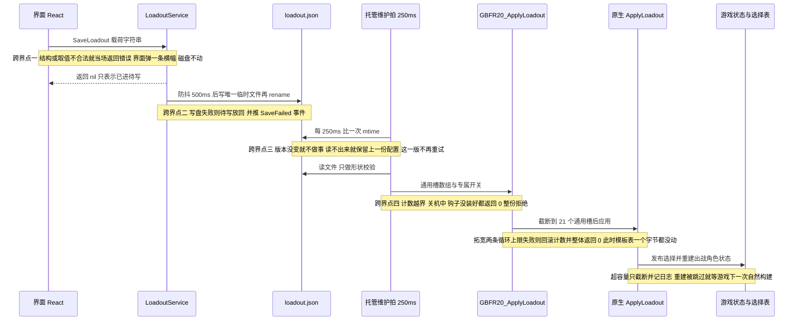
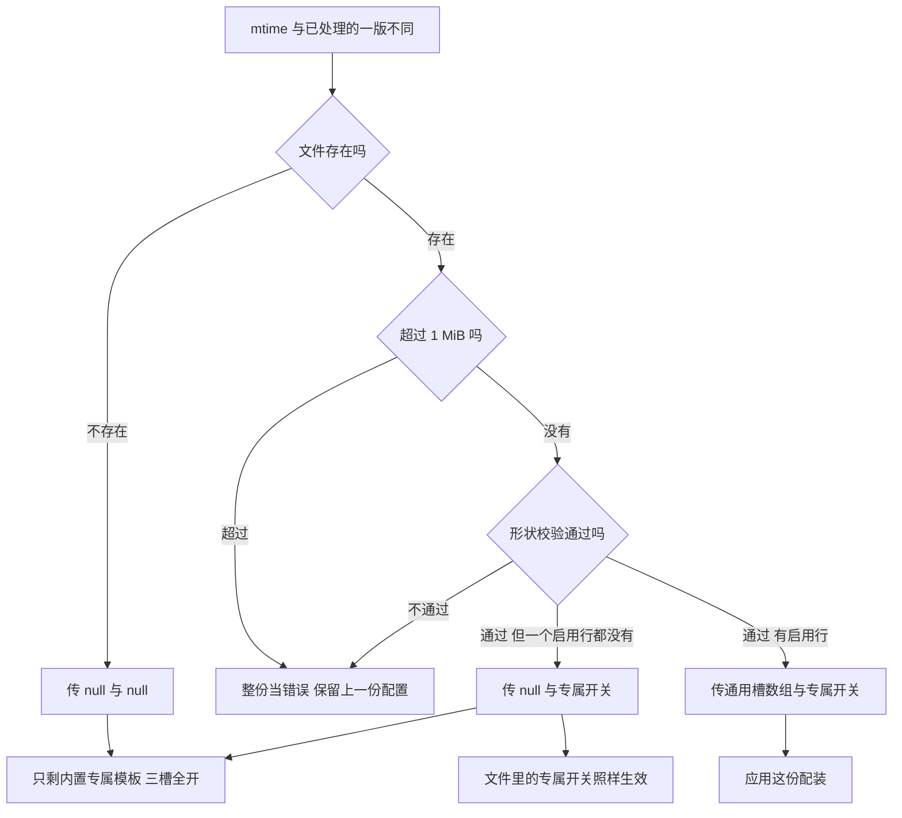

# 工作流：配装从界面到游戏状态

玩家在可视工具里勾一个因子，到游戏里角色真的多一个因子，中间隔着**四个跨界点**：一次 Wails 调用、一次磁盘写入、一次 mtime 比较、一次 ABI 调用。每一层都只回答自己那一层的"行不行"，而且答案的形式各不相同——前端拿到一句错误字符串，写盘出错的答复要绕回前端，托管读侧只记日志并保留上一份配置，原生只回一个 0/1。

这份链路的契约（路径、成员名、常量对拍）在 [两个配置文件与跨语言常量契约](/openwiki/concepts/config-file-contracts.md)；槽位模型、模板 slot-id 与专属表在 [虚拟槽位、模板因子与专属开关](/openwiki/concepts/virtual-slots-and-exclusives.md)；托管外壳与 250ms 维护拍在 [托管 mod（C# Reloaded 外壳）](/openwiki/architecture/managed-mod.md)；钩子读侧怎么把合成因子塞进角色状态在 [游戏侧注入运行期](/openwiki/workflows/skill-injection-runtime.md)。本页只讲这条链**怎么走、在哪一层会被拦、被拦之后用户看见什么**。

## 1. 端到端时序与四个跨界点



端到端一次改动经过的七个参与者；四个跨界点各有一条独立的失败通道，越靠后的越只能靠日志说话。

| # | 跨界点 | 载体 | 这一层怎么"说不" | 用户/日志看见什么 |
| --- | --- | --- | --- | --- |
| 一 | 界面 → Go | Wails 绑定 `SaveLoadout(config string) error` | 当场返回 `error`（同步） | 外壳级横幅 `自动保存失败：…`；磁盘上不留任何痕迹 |
| 二 | Go → 磁盘 | `debouncedWriter` + `writeFileAtomic` | 写盘错误没有调用方可返回 | 工具日志一行 + `GBFR.SigilLoadout.SaveFailed` 事件（前端唯一订阅者在因子编辑页） |
| 三 | 磁盘 → 托管 | 每 250ms 比 mtime（`FileStamp.Changed`） | 这一版被认领即"处理过了"，不再重试 | mod 日志 `Invalid loadout.json; kept previous configuration: …`，内存里上一份配置继续生效 |
| 四 | 托管 → 原生 | `GBFR20_ApplyLoadout` 返回 `int32` | 0 = 拒绝（计数越界 / 关机中 / 钩子未就绪 / 循环上限拓宽失败） | mod 日志 `Native rejected the custom loadout; kept previous configuration.` |
| — | 原生 → 游戏 | 选择表 + 热重建 | 不拒绝，只有"截断"与"跳过" | `ApplyLoadout: the request asked for general slots=…` 与 `hot rebuild: skipped (…)` 等日志 |

这条链是**单向**的：托管 mod 从不改写 `loadout.json`、也从不回报"我接受了"。mod 到工具的通道只有两条不带数据的窗口消息（`0x8010` / `0x8012`，`wParam`、`lParam` 都是 0），所以工具界面上"保存成功"的含义永远只是"已经交给后端"，而不是"游戏已经生效"。

## 2. 界面侧：一次编辑产生什么载荷

前端只有**一个**写盘入口：`edit(patch)`。它做三件事——把新值先写进 `latest.current` 这个 ref、再 `setState`、最后 `void saveNow()`。顺序不能反：处理器返回之后 React 才提交 state，那时读到的还是上一次的值，落盘就永远慢一次（最后一次勾选就是这么丢的）。

```ts
// App.tsx
const edit = useCallback((patch: {slots?: Slot[]; exclusiveState?: ExclusiveState; lang?: Lang}) => {
    latest.current = {...latest.current, ...patch}
    if (patch.slots) setSlots(patch.slots)
    ...
    void saveNow()
}, [saveNow])
```

两条门决定"什么时候**不**写盘"：

- **`loadoutRead` 之前绝不写盘。** 读配置失败时槽位被铺成 `pad12([])`，此刻交出的载荷会把磁盘上那份完整配置整体替换掉——所以 `saveNow` 的第一行就是 `if (!loadoutRead) return`。自动保存也只由编辑处理器触发，不由 `[slots, lang, exclusiveState]` 这类状态变化触发（旧版本靠一次性旗标赌"哪次状态更新先消费它"，加载期的任何额外 `setState` 都会把启动变成一次写盘）。
- **数据表没加载好就不写。** `mainKeys` 或 `skillHashes` 为空时给的是横幅 `数据表未加载，无法保存`，而不是一份"所有槽都被跳过"的载荷。

载荷由 `buildLoadoutPayload(slots, index, lang, exclusive)` 拼出，规则全在它一处：

| 规则 | 后果 |
| --- | --- |
| `mainHash === ""` 的行整行跳过 | 空行不写进文件（`index.test.ts` 钉住） |
| `index.gemOf(mainHash, secHash, mainGem)` 解析不出物品 hash 时整行跳过 | 空 id 会让 mod 拒掉**整份**文件，所以在源头就丢掉这一行，而不是发出去让下游拒 |
| `items[0]` 同时写 `gem`（物品 hash）与 `hash`（它给的主技能） | mod 不再持有因子表，主技能只能随载荷走 |
| `items[1]` 只在有副技能时写，不带 `gem` | 副技能只是一个技能 hash 加等级 |
| `exclusive` 只有非空时才带上 | 空对象与"没有这个成员"是同一件事（未提到的角色三槽全开） |

写进文件的 `enabled` 由勾选框直接决定：`buildLoadoutPayload` 把 `enabled: false` 的行也写出来，只是下游两侧都**不**数它们。

## 3. Go 侧：当场拒，然后防抖原样落盘

`SaveLoadout` 是唯一能对用户说话的一方，所以它把能判的都在返回之前判完：

| 检查 | 拒绝原因 |
| --- | --- |
| 不是 `{lang, slots, exclusive}` 这种形状（例如早期版本的裸数组） | `jsonv2.Unmarshal` 报错——**不**翻译成"空配置"写下去 |
| 缺 `slots` 成员 | `loadout.json needs a 'slots' array (an empty array means no general slots)`；放过去就是"工具说保存成功、游戏里什么都没变" |
| 每行 `items` 长度不在 1..2 | `items must have 1 or 2 entries` |
| `items[0].gem` 空、`items[0].hash` 空、`items[1].hash` 空 | 主技能 hash 是必需的：mod 不持有因子表 |
| 任何一项 `level < 0` | `negative level` |
| **启用**的行数 > `MaxSlots` | `too many enabled slots: n (max 12)` |

`enabled` 在 Go 侧是 `*bool`：缺这个成员与 `enabled: true` 同义，与 C# 的 `!TryGetProperty("enabled", …) || …` 和 TS 的 `s.enabled !== false` 一致。这里曾经用 `bool`（零值 `false`），结果是同一份文件在 Go 数出 0 个启用、在 mod 那边数出十几个——"存盘成功、游戏里什么都没变"，`TestValidateSlotsTreatsMissingEnabledAsEnabled` 把它钉成了回归测试。

接受之后**不做任何内容改写**：载荷原样进 `debouncedWriter`，500ms 静止后写盘：

- 每次调用替换待写并重启定时器，所以一串连续编辑只换来一次落盘，而落盘的**永远是屏幕上最后的状态**（`TestSaveLoadoutWritesOnlyTheLatestSubmission`）。
- 写盘走 `writeFileAtomic`：同目录唯一临时文件（`loadout.json.*.tmp`）+ `rename`。运行中的 mod 会反复读这份文件，直接 `O_TRUNC` 会留下"读到半截"的窗口，而那一边只能看到坏 JSON（语义是"保留上一份"）。
- 写失败时待写被**放回**（一次瞬时 IO 失败不该变成永久丢失），同时写工具日志并推 `GBFR.SigilLoadout.SaveFailed` 事件。这个失败已经没有调用方可以返回，所以只能以事件形式到达——注意该事件的唯一订阅者在因子编辑页的 `SigilEditorPanel`（`keepMounted`），也就是说配装这条路的写盘失败会复用那个页面的写盘失败对话框，配装页自己没有监听者。
- 退出流程由 `main.go` 的 `app.OnShutdown(loadoutService.flushNow)` 兜住：窗口可能在防抖窗口里就被关掉，而刚做的那次编辑才是用户想留下的。

## 4. 托管侧：250ms 拍与 mtime 版本门

托管侧的维护拍每 250ms 依次跑三件事，顺序固定为 `LoadoutConfig.Tick(Log)` → `_sigilEditor?.Tick()` → `Hotkey.Tick(Log)`，整段被 `_ticking` 的 `Interlocked.Exchange` 串行化（定时器回调不串行），并且三个阶段之外套着一个空 `catch`——维护拍绝不能把进程带走。启动路径上 `LoadoutConfig.Initialize(Log)` 在原生核心初始化之后**读一次**，之后只有拍会碰它。

版本门是 `FileStamp.Changed()`，它的语义是**认领后处理**：

```csharp
// UserConfig.cs
internal DateTime? Changed() {
    DateTime stamp = UserConfig.Stamp(_path);
    if (stamp == _applied) return null;
    _applied = stamp;
    return stamp;
}
```

配装走的是这一半而不是 `Pending()` + `MarkApplied()`（因子编辑走那一半），理由是这里是**单次应用**：读不出来、原生拒绝之后，内存里上一份有效配置原样还在，"这一版处理过了"是合理的说法；而且同一份坏配置每 250ms 重试一次只会把同一个报错灌满日志。代价是**这一版不会再被重试**——下一次保存自然会改 mtime，那时才重新处理。

门的比较对象是 mtime 本身，所以"文件被删掉"是一版真实、可比较的变更：`UserConfig.Stamp` 对不存在的文件返回 FILETIME 0（`UserConfig.NoFile`，1601-01-01），与 `FileStamp._applied` 的初值 `default(DateTime)`（0001-01-01）不同。`TryApply` 对它的处理是**提前 return**：

```csharp
if (mtime == UserConfig.NoFile) {
    if (NativeCore.ApplyLoadout(null, null))
        log("loadout.json removed; restored the built-in exclusive template.");
    return;   // 少了这个 return，new FileInfo(...).Length 必抛，每局多一条假的"保留上一份"
}
```

### 三种输入情形 → 一次原生调用的两个入参



文件不存在、文件存在但没有启用行、文件存在且有启用行——三条路都汇到同一个 `NativeCore.ApplyLoadout(slots?, overrides?)`，差别只在两个入参是不是 null。

三条都要点记住：

- **"没有启用行"包括"所有行都被禁用"。** `ParseAndValidate` 只收 `enabled` 为真（或缺该成员）的行，所以一份把 12 行全部取消勾选的文件落进 `slots.Count == 0` 那一支，日志是 `loadout.json has no general slots; built-in exclusive template active.`，而与"文件不存在"那条日志不同、结果相同（通用槽全擦掉）。
- **文件里的 `exclusive` 不依赖 `slots`。** 走 `null` 那一支时开关照旧随 `overrides` 一起发出去。
- **两半是同一次调用。** `NativeCore.ApplyLoadout` 把槽数组与开关数组合成一次 `GBFR20_ApplyLoadout`：两半在原生侧收尾于同一个"重新发布表"步骤，所以分成两次（v17 的形状）只会让同一张表被发布、被打印两遍。

### 托管侧只做形状校验与映射

`LoadoutConfig` 的职责边界写得很死：**把载荷映射成 ABI 结构，不读数据文件、不持有任何表**。所以：

- 主技能 hash 从 `items[0].hash` 读——它没有别的地方可查（"物品 → 主技能 / 上限"的语义属于唯一读过 `assets\sigils.json` 的一方，也就是前端）。
- 等级只判**非负**；缺失回落 `DefaultLevel = 15`。上界不判（见第 7 节）。
- 启用行超过 `MaxSlots = 12` 时抛 `more than 12 enabled slots`：**整份文件被拒**、保留上一份配置，而不是截断这 12 行。这也是"工具说保存成功、游戏里什么都没变"的经典形状之一。
- `slots[].items` 的第 3 项及以后被静默忽略（只读 `items[0]` / `items[1]`；Go 在存盘时已经拒掉长度 > 2）。
- `exclusive` 只把值为 `false` 的项变成 `disabled = 1`；外层键解析不成角色 hash（例如写成了 PL 码）会记 `exclusive: '…' is not a character hash; ignored.` 并跳过——否则"开关点了没用"在日志里没有任何线索。

### ABI 结构与布局也在这条路上 fail-closed

跨边界的只有两个 `pack(1)` 结构体：`TemplateSlotNative`（0x18）与 `ExclusiveOverrideNative`（0x0C）。`NativeCore.Initialize` 在拿到一致的 ABI 版本号（20）之后还会 `EnsureAbiLayout()`：逐个对拍**封送尺寸与每个字段的偏移**（版本号挡不住"两边被同时改错"，而字段互换之后尺寸照样是 0x18）。尺寸或偏移不符就抛异常 → 整套钩子不装（fail-closed）→ 之后每一次 `ApplyLoadout` 都返回 0，日志停在 `Native rejected the custom loadout; kept previous configuration.`。

## 5. 原生 `ApplyLoadout`：顺序就是语义

进了 `template_loadout.cpp` 的 `ApplyLoadout` 之后，步骤是固定的，而且每一步的位置都有理由：

1. **先把通用槽请求钳到容量。** `effective_count = min(requested, kVirtualSlotCapacity - kBuiltinExclusiveSlotCount)` = 最多 21 个；总数是 `3 + effective_count`。请求数不等于生效数时打一行日志（请求数、本构建上限、实际数都打出来）。
2. **总数变了才动 `.text`，而且先发布计数。** `g_virtual_slot_count.store(total_slot_count)` 在 `ApplySkillLoopLimits(total_slot_count)` **之前**：detour 按这个计数给虚拟槽设闸（`TryGetRuntimeSlot` 的第一道判断就是 `virtual_slot >= g_virtual_slot_count`），所以它必须已经与游戏线程下一轮循环看到的补丁一致。收窄配置时这一步也是"残留的旧槽数据立刻不再被服务"的原因。`ApplySkillLoopLimits` 把两条技能循环的上限字节（apply 与 category）事务式地改成 `13 + N`：第二个字节写失败就把第一个回滚到**它原来那个值**，然后返回 false。
3. **这是唯一的失败点。** `ApplySkillLoopLimits` 失败时 `g_virtual_slot_count` 被恢复成上一次的值，函数在**碰模板表之前**返回 false。所以"被拒"= 上一份配置仍然完整生效，托管侧那句 `Native rejected the custom loadout; kept previous configuration.` 是准确的：不存在"半份新配置"。
4. **在 `g_template_mutex` 下重建每个角色的模板行。** 先 `ApplyExclusiveSwitchesLocked(overrides, count)`（整份替换，见下），再对每个已知角色：`ApplyExclusiveStateLocked`（清 `slots[0..2]`，按位填回 T1 / T2 / 战气 或留空槽），然后把 `slots[3..24]` 逐格写成 `config_index < effective_count ? slots[config_index] : TemplateGemSlot{}`。
5. **收尾只有一个入口：`PublishTemplateSelections()`。** 它做两件事——`InstallDefaultTemplateSelections()` 与 `RebuildPartyStatusesOnce()`。以前三个调用点各拼一遍同一序列，而"钩子还没装好就不排重建"这个条件只写在其中两个里。

### 擦除与填充是同一个循环

```cpp
character.slots[slot_index] = config_index < effective_count
    ? slots[config_index]
    : TemplateGemSlot{};
```

`slots == nullptr` 时 `requested = 0`，于是每一格都走 `TemplateGemSlot{}` 分支。**没有通用槽 = 每个角色只剩它的三个内置专属槽**，这不是另一条代码路径，而是同一个循环退化成全擦除。反过来，通用槽的索引是"第几个**启用**行"（`3 + k` 的 `k` 是启用行序号），所以禁用中间一行会让它后面的行整体前移一位。

### 发布选择：摘要行是验证门禁

`InstallDefaultTemplateSelections` 在 `g_template_mutex → g_selection_mutex` 的锁序下对每个已知角色 `slots.fill(0)`，再对 `v < min(g_virtual_slot_count, kVirtualSlotCapacity)` 且 `gem_id != 0` 的槽写 `MakeTemplateSlotId(v) = 0xFE000000 + v`（空槽不发，detour 那一格就什么都不注入）。

它最后那行摘要在数量**真的变了**时才会打印：

```text
Installed built-in template loadout selections=N. exclusive slots 1-3 (T1/T2/war), general slots 4-M; inventory-independent.
```

同一份配置被反复应用（用户只改了某个因子的等级，mtime 变了、槽位数量没变）不该每次都刷一行同样的摘要——它是一道验证门禁，不是心跳。

### 热重建：改动要进角色状态，而不是等下一次开战

`RebuildPartyStatusesOnce()` 是本项目**唯一**会去动游戏活对象的地方：对每个"已知的出战角色"各调一次游戏的状态重建函数。没有它，改动要等到下一次开战才会进战斗状态——而**战斗里游戏自己不会重建角色状态**，所以"等下一场战斗"在战斗中永远等不到。

它的闸门（`TryClaimRebuildNow`）与逐角色条件：

| 条件 | 行为 | 日志 |
| --- | --- | --- |
| 钩子或语义布局未就绪 | 直接返回（前置条件，不算闸门的一条理由） | — |
| 上一次重建失败后 60 秒内 | 跳过 | `hot rebuild: skipped (cooling down after a failed rebuild)` |
| 游戏 250ms 内建过状态 | 跳过（静默） | — |
| 距上次热重建不到 500ms | 跳过（静默，CAS 认领窗口） | — |
| 还没认出任何队伍成员 | 跳过 | `hot rebuild: no party known yet; skipped` |
| 队伍刚变更过 2 秒内 | 跳过 | `hot rebuild: skipped (party changed just now)` |
| 该角色的记录不属于当前轮队伍装配 | 逐角色跳过（对象已被游戏拆掉，重建就是戳内存垃圾） | `hot rebuild: char=0x… skipped (left the party: assembly a < b)` |
| 重建返回 false | 该对象记一次失败，冷却 60 秒 | `hot rebuild: cooling down 60s (a rebuild failed)` |

跳过**不是**失败：改动仍会在游戏下一次自然构建时落地，只是不是即时的（菜单里实测十几秒）。逐角色重建之间 `Sleep(50)`。

## 6. 三个容易误解的行为

**① 没有通用槽 = 只剩内置专属模板。** `slots == nullptr` 或空数组时，所有角色的 `slots[3..]` 被擦成空槽，只剩每个角色编译进 DLL 的三个专属槽（`slots[0..2]`，由 `kCharacterExclusives` 加专属开关组装）。注意这不是"什么都不做"：**它是一次真实的应用**，会把上一次的玩家通用槽全部收回。文件不存在（`loadout.json removed; restored the built-in exclusive template.`）与文件存在但没有启用行（`loadout.json has no general slots; built-in exclusive template active.`）落到的就是这件事。

**② 未提到的角色 = 三个专属槽全开。** 文件里的 `exclusive` 只记录**被关掉**的槽：C# 只把值为 `false` 的项变成 `disabled = 1` 的 override，原生 `ApplyExclusiveSwitchesLocked` 先 `clear()` 整张 `g_exclusive_state` 再按这次的 override 重建，而 `ReadExclusiveStateLocked` 对**缺失条目**返回 `ExclusiveAll`。三条推论都很容易踩：`true` 与"没提到"完全同义（前端也因此把"打开"实现成**删掉那个键**）；开关状态不跨调用累积（同一份配置里删掉某个 `false` 条目就会把那个槽重新打开）；认不出的 `(角色, 技能)` 对被静默忽略（`character_hash == 0`、`disabled == 0`、角色不在模板索引里、技能 hash 不属于该角色的三个槽）。

**③ 槽位超容量是截断并记日志，不是拒绝。** 原生通用槽上限是 `kVirtualSlotCapacity - kBuiltinExclusiveSlotCount = 21`；超过时取前 21 个，**其余槽位照常应用**，并打一行把请求数、上限、实际数都说出来的日志。拒绝会让整份配置连其余槽位一起失效，比截断更糟——但必须让它**可见**，否则症状只是"某几个槽位静默不生效"。实践上这条日志几乎只见于直接调 ABI 的调用方：托管路径根本到不了 21，因为 `MaxSlots = 12` 在 Go 与 C# 两侧都会先把更大的配置拒掉。

## 7. 上限分三层，只有一层在本链路上判

| 上限 | 值 | 声明位置 | 谁判 | 判的是什么 |
| --- | --- | --- | --- | --- |
| 启用槽上限 | `MaxSlots = 12` | C# `LoadoutConfig.cs`、Go `loadoutservice.go`、TS `model.ts`（`MAX_SLOTS`，同时是编辑器固定显示的行数） | Go（保存时，给用户报错）与 C#（读到手改文件时守自己） | 只数**启用**的行；超了就拒掉整份文件 |
| 技能等级上界 | 每条技能自己的 `cap` | `assets\sigils.json`（随包数据） | **只有前端** | 输入框的 `max` 与载入时的 `clampLevel`；写进文件的等级因此已经在 cap 内 |
| 虚拟槽数组容量 | `kVirtualSlotCapacity = 24` | `native_internal.h` | 原生 | 数组边界与截断上限；ABI 另有一道计数闸（`slot_count > 24` 或 `override_count > 32 × 3 = 96` → 整份拒绝并记 `counts out of range`） |

三处声明的那一项由 `sharedconstants_test.go` 的 `MaxSlots（启用槽上限）` 一组对拍（C# / TS / Go 三个正则各抓一个字面量）；`DefaultLevel = 15`（C#/TS）与 `UnwornCharacterHash = 0x887AE0B0`（C#/C++）也在同一份名单里。**等级上界不在这一层判**：Go 的 `validateSlots` 与 C# 的 `GetLevel` 都只拒负数，注释里的理由是同一规则的第三份副本会与真正的 cap 表漂移，而且判的还不是真正的不变量。所以一份手改的文件可以带着超过 cap 的等级一路走到原生，并如实生效。

## 8. 每一步失败时的可见后果

| 在哪失败 | 判据 | 磁盘 / 内存里剩下什么 | 可见证据 |
| --- | --- | --- | --- |
| 界面 → Go | 形状、取值、启用行数不合 | 磁盘不变（连目录都不建） | 横幅 `自动保存失败：…`；`TestSaveLoadoutRejectsInvalidWithoutTouchingDisk` |
| Go → 磁盘 | 临时文件写失败 / rename 失败 | 待写被放回，下一次防抖或退出时重试 | 工具日志一行 + `GBFR.SigilLoadout.SaveFailed` 事件（订阅者在因子编辑页） |
| 文件 → 托管 | JSON 坏、缺 `slots`、超 1 MiB、超 12 个启用行 | 内存一个字节都不动，**这一版不再重试** | `Invalid loadout.json; kept previous configuration: …` |
| 托管 → ABI | 钩子未就绪 / 关机中 / 计数越界 | 同上（`ApplyLoadoutEntry` 在动任何东西之前返回） | `Native rejected the custom loadout; kept previous configuration.` |
| 原生：循环上限 | `ApplySkillLoopLimits` 失败 | `g_virtual_slot_count` 回滚，模板表未动 | 同上那句（原生另记 `Hook rollback: …` 或计数越界那行） |
| 原生：通用槽数 | 请求 > 21 | 前 21 个照常应用 | `ApplyLoadout: the request asked for general slots=…; only the first … were applied.` |
| 原生：热重建 | 七条闸门之一命中 | 选择表已更新，角色状态等游戏下一次自然构建 | `hot rebuild: skipped (…)` / `hot rebuild: char=0x… ok=0` + 60 秒冷却 |
| 文件被删 | `mtime == NoFile` | 通用槽全擦，专属开关全开 | `loadout.json removed; restored the built-in exclusive template.` |

"保留上一份配置"这句话在四个地方出现，但含金量不同：Go 拒的时候磁盘上那份根本没变；托管拒的时候内存里那份还在；原生拒的时候连模板表都没被碰过。

## 9. 这条链被验证到什么程度

| 覆盖 | 位置 |
| --- | --- |
| 防抖、只落最后一份、原子写不留临时文件、并发写不撕文件 | `loadoutservice_test.go` 的 `TestSaveLoadoutDefersTheWrite` / `TestSaveLoadoutWritesOnlyTheLatestSubmission` / `TestSaveLoadoutWritesAndLeavesNoTempFiles` / `TestConcurrentSavesNeverTearTheFile` |
| 各种拒绝路径不碰磁盘、缺 `enabled` 算启用、`MaxSlots` 边界（12 过 / 13 拒 / 13 行里一行禁用过）、"等级超 cap 仍合法" | 同文件的 `TestSaveLoadoutRejects…` 三条与 `TestValidateSlots` / `TestValidateSlotsTreatsMissingEnabledAsEnabled` |
| 载荷规则（空行不写、解析不出的主因子整行跳过、主技能随载荷走、`exclusive` 空则不写） | `frontend/src/index.test.ts` 的"落盘载荷"一组，跑的是**入库的真实** `assets/sigils.json` |
| 跨语言常量（`MaxSlots` / `DefaultLevel` / `UnwornCharacterHash` / 目录名与两个文件名） | `sharedconstants_test.go` |
| 原生锚点解析与 fail-closed 逐字节复验 | `tests/NativeLayoutHarness`（`ResolveGameLayout` / `RevalidateGameLayout`，改坏一个字节必须复验失败） |

**覆盖不到的部分要明确**：C# 的 `LoadoutConfig` 与原生 `ApplyLoadout`（含专属开关、截断、发布、热重建）没有自动化测试——托管侧只有常量的正则对拍，`NativeLayoutHarness` 只管布局锚点、不碰模板表。这一段唯一的正面证据是游戏里的日志：`Installed built-in template loadout selections=N. …`、`ctx1 build: …`、`hot rebuild: char=0x… ok=1`，以及运行期那条 `Skill contribution confirmed for 0x…: N/N virtual sigils reached the context-1 status.`。

## 改这条链时的边界

- **改"哪些行会被写进文件"** → 改 `buildLoadoutPayload` 与它的 `index.test.ts`；不要在下游补一个"猜"的分支，mod 侧没有因子表可查。
- **改校验** → 想清楚是"拒"还是"截断"：工具侧当场拒是给用户看的，托管侧拒是给自己守内存的，原生截断是"宁可少几个槽也别让整份配置失效"。
- **改上限** → 至少要同时看三处：`MaxSlots`（三语言、带对拍）、`kVirtualSlotCapacity`（数组与截断）、`ApplyLoadoutEntry` 的 `kMaxTemplateSlots` / `kMaxExclusiveOverrides`（ABI 拒绝闸）。
- **别把 mtime 认领改成"确认生效后才推进"**（或反过来）：配装是单次应用，因子编辑那条路才需要 `Pending()` + `MarkApplied()`。两者的语义差别与理由见 [两个配置文件与跨语言常量契约](/openwiki/concepts/config-file-contracts.md)。
- **想让工具显示"游戏已生效"** → 目前没有这条通道：mod 只 post 两条不带数据的窗口消息。真要做，等于新增一条跨进程回报协议，而不是在现有链路上加一行日志解析。
