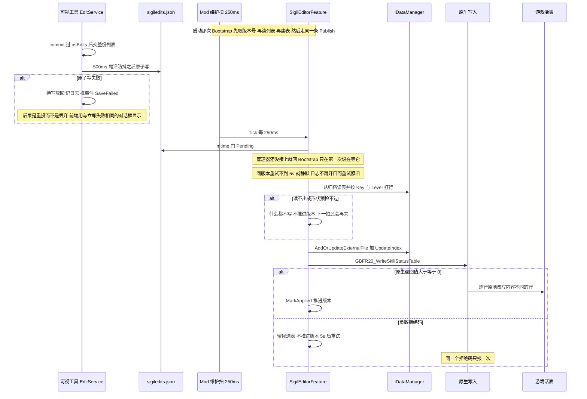
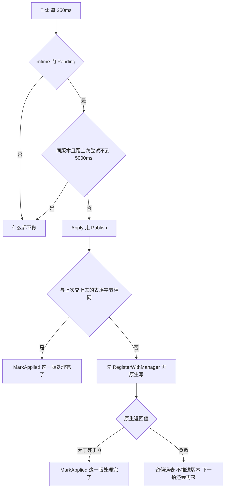

# 工作流：因子数值编辑与热应用

这条链路把一个数值框里的按键变成游戏**活表**里被改写的字节，中间有四个进程/角色参与：

| 角色 | 干什么 | 代码 |
| --- | --- | --- |
| 可视工具前端（React） | 决定"什么算一条编辑"、把整份列表交出去 | `SigilLoadout/frontend/src/SigilEditorPanel.tsx`、`skills.ts` |
| 可视工具后端（Go / Wails） | 500ms 防抖 + 原子写 `sigiledits.json` | `SigilLoadout/editservice.go`、`debouncedwrite.go`、`atomicwrite.go` |
| 托管 mod（C#） | 读列表、从归档读原表、打行、重新注册、写内存 | `GBFR.SigilLoadout/SigilEditorFeature.cs` |
| 原生核心（C++） | 从启动时解出的槽拿到活表地址，原地改写不同的行 | `GBFR.SigilLoadout.Native/src/table_slot.cpp` |

两侧之间**只有 `sigiledits.json` 一个通道**，没有握手也没有通知：路径、文件名、成员名与"各只有一处声明"的规则见 [两个配置文件与跨语言常量契约](/openwiki/concepts/config-file-contracts.md)；行布局常量、锚点推导与五道写入闸门见 [skill_status 表与活表写入闸门](/openwiki/concepts/skill-status-table.md)，本页不复述它们。

## 两条路径，同一个 `Publish`

启动那一次写与运行中的热应用**不是两套机制**：它们各走各的入口，在 `Publish` 处汇合成同一次"重新注册 + 原地写内存"。下面这张图把一次编辑的全程与**每个失败分支的后果**画在一起——重试、静默、还是推给前端。

上图：启动那次写（`Bootstrap`）先取版本号、再读列表、再建表，然后把刚建好的表直接交给同一个 `TryApply`；运行中的热应用由 mtime 门放行、按此刻磁盘上的列表重建表。两者在 `Publish` 处汇合。`bootTable` 参数就是"两条路径是同一个操作"的体现——启动时已经建好的表直接交过去，让 `Tick` 再读一遍配置、再建一次表纯属白干。

三个失败分支里**只有一个会打扰用户**：防抖写盘失败推给前端（编辑仍在待写里，不会被丢掉）；mtime 门放行之后的失败只是让下一拍按同一版本重来（版本一次都没推进）；拒写与建表失败都不改变游戏内存，编辑留在"已存进文件、也已重新注册"的状态里，等游戏下一次解析或重启。

走 `TryApply` 而不是直接 `Apply` 是有意的：`TryApply` 顺带登记"这一版我已经说过了"（`_loggedAttemptUtc`），否则第一次 `Tick` 会把这同一版当成新版本——既不静默、也不节流，白重试一次。

## 一、什么算一条编辑（前端的不变量）

列表的最终内容就是游戏拿到的东西，所以"什么算编辑"必须只有一处规则，且每条路径都经过它：

- **`isEdit`**：`enabled || 十个参槽里有一个不是 null`。勾选本身就是编辑（它什么都不写，等于"以游戏自己的数值开启"）；只有数字而没有勾选的记录也被保存，只是不生效——勾选才是把它送进游戏的那个动作。
- **`trimGameValues`**：把等于**该等级游戏原值**的参槽置为 `null`（原值来自随包资产 `skill_status.json`），于是"只是把游戏自己的数字抄进框里"不算输入。它同时让旧格式文件读回正确语义：`null` 出现之前，旧版本为了让整行能写回去会把每个槽都填上游戏原值。
- **`asEdits`**：先 `trimGameValues` 再 `filter(isEdit)`——列表、`sigiledits.json` 和游戏三边对"什么算编辑"的看法一致，全靠它是唯一的闸口。组件里再写一遍那条规则曾经导致"清空最后一个数值顺手把用户勾上的那一下也撤销了"。
- **`dedupe`**：**一个地址（`key#level`）最多一条编辑**。`PatchRows` 按列表顺序逐条写，同一地址上游戏最终拿到的是最后一条已启用的——所以去重留最后一条已启用的，该地址一条已启用的都没有时留最后一条（不论启用与否）。面板的编辑态本身就是按地址索引的 `Map`，这个不变量于是由容器结构保证，没有路径需要手工整体重建。

十个参槽按位置对应 `LevelValue1..10`，`null` 的意思是**保留游戏原值**，不是 0。为什么不能写全值：可视工具对绝大多数参槽一无所知（参槽含义的唯一线索是游戏自己的说明文案），把"可视工具看到的那份表"整套写下去就会用一份陈旧副本覆盖掉它没编辑过的槽位。补齐到正好十个的动作在两侧各做一次（Go 的 `padValues`、C# 的 `Config.Load`），所以线格式的形状稳定：短一截或没有 `values` 的文件读出来是十个 `null`，写出去也永远是十项。

面板侧还有两条容易踩空的规则：

- **列表还没读回来就绝不写盘**（`editListRead`）。此时屏幕上的 `edits` 是空的，而 `SaveEdits` 交出的列表会被后端**整体替换**——那会把用户其余编辑一次抹掉。这条与"文件不存在 = 空列表"（`LoadEdits` 刻意不造内置的起始编辑，所以打开可视工具本身不是一次对游戏的改动）合起来，就是**启动不写**的全部内容。
- 这一页是 `keepMounted` 的：切走不卸载。否则在 500ms 防抖窗口内切走再切回来，会读到还没写下的旧文件，屏幕上的新数字消失，随后那份旧列表还会把磁盘上的新值覆盖回去。

## 二、落盘：500ms 尾沿防抖 + 原子写

`commit`（前端每一次编辑的唯一出口）把整份列表交给 `EditService.SaveEdits` 并且**不等答复**；后端只做补齐，然后交给 `debouncedWriter`：

- **尾沿防抖 500ms**：`submit` 记下待写并重启定时器，所以一串连续按键只换来一次写入，而写出的永远是屏幕上最后的状态——前端因此可以保持愚笨（每次改动都调用，从不等待）。
- **原子写**：同目录临时文件 + `rename`。运行中的 mod 会反复读这份文件，直接 `O_TRUNC` 会留下"读到半截"的窗口，那一边只能看到坏 JSON。
- **失败重投**：写入发生在定时器回调里，已经没有调用方可以返回错误。失败时把待写**放回**（一次瞬时 IO 失败不该变成永久丢失）、记日志、并通过 `GBFR.SigilLoadout.SaveFailed` 事件推给前端；前端用与立即失败相同的对话框显示它。事件名是跨层协议常量，两侧各写一份字面量，改名必须同时改两处。
- **关窗兜底**：`app.OnShutdown(editService.flushNow)`。窗口可能在防抖窗口里就被关掉，而刚做的那次编辑才是用户想留下的。

### 失败事件怎么走到屏幕上

界面那一侧只有两条路，而且共用同一个对话框，因为在用户看来它们是同一件事——**编辑没有落到磁盘上**：

- **立即失败**：`Call.ByName("main.EditService.SaveEdits", …)` 的 promise 被拒（`SaveEdits` 本身不返回错误，所以这只覆盖调用本身失败这一路）；
- **防抖失败**：面板在挂载时（以及语言变化时重订）`Events.On("GBFR.SigilLoadout.SaveFailed", …)`，把事件带的数据当作详情——写失败时用户正等着的那次编辑**还在待写里**，下一次防抖或退出时的 `flushNow` 就是它的重试机会。

两条都落到页面的 `showError({ title: t.writeFailed, detail: … })`（标题来自 `messages.ts` 的 `writeFailed`），弹的是这一页自己的 `AlertDialog`；关掉对话框只是关闭，消息留在 state 里好让退场动画仍有东西可画。`readFailed`（读列表失败）走的是同一个对话框，只是标题不同。

`nil`（前端传 `null`）与空列表**不是同一件事**，而托管侧的读法把两者的差别变成硬后果：空列表写出的是一份 `edits: []` 的文件，读出来就是"所有编辑都关掉了"——对 mod 而言就是撤销全部编辑；`nil` 是"这次什么都没交"，而 `nil` 切片在线格式上写作 `null` 而不是 `[]`（`LoadEdits` 的归一化注释写着这一点），托管侧又把"`edits` 不是数组"（`null` 也算）判成**读不出来**，于是那一版什么都不应用，绝不会被当成"撤销全部编辑"。读取侧对称地分三种情况：文件不存在 = 空列表（没有内置的起始编辑，否则"打开可视工具"本身就是一次对游戏的改动）；存在但读不出或解析不了 = **错误**而不是空列表（把坏文件显示成空列表，正是某次误触按键把这份空覆盖回用户编辑内容的方式）；`{"edits":[]}` = 真实答案。

## 三、托管侧：mtime 门与 250ms 维护拍

托管 mod 没有自己的时间来源。`Mod` 建一个 250ms 的 `System.Threading.Timer`，每拍依次调 `LoadoutConfig.Tick`、`SigilEditorFeature.Tick`、`Hotkey.Tick`，并用一个 `_ticking` 标志丢掉重叠的拍（回调不串行）。**250ms 不是个量**——数值要到下一场战斗才生效；它换掉的是一条阻塞在 `WaitOne` 的线程和一个内核事件对象。

这道门用 `FileStamp` 的**"确认生效"那一款**（不是"认领"那一款）：`Pending(current)` 在失败后仍然为真，"这一版处理完了"只能由调用方在确实生效之后用 `MarkApplied` 宣告。于是不需要"重试"这件事单独存在——失败自然会让下一拍再来。文件被删掉也是一版真实的、可比较的版本（`FileStamp.Now()` 给的是 `UserConfig.NoFile`，与初值不同），所以"删了"和"改过"走同一道门。

`Tick` 的判据只有三行：

1. 数据管理器（`IDataManager`）还没接上 → 回到 `Bootstrap`（它是**可选**依赖，可能比本 mod 晚加载，所以每拍重试，只在第一次说一句"在等它"）。
2. `Pending` 为假 → 什么都不做。
3. 同一版本的重试按 `RetryIntervalMs = 5000` 节流（第一次尝试不节流；文件一变立刻处理，那一版不算节流）。

启动那次（`Bootstrap`）有三条刻意的顺序，都对应真实的失败模式：

- **版本号必须在读内容之前取**。反过来就会出现"内容来自 T1、版本号来自 T4"，而 T1→T4 之间落盘的那次保存会被 `MarkApplied(T4)` 判成已生效——内存里却是旧内容，编辑静默丢失且不再重试。
- **造表期间文件又变了就不写、也不推进版本**，让 `Tick` 按新版本重来。
- **数据管理器接上了但表造不出来**（归档读不出来、或布局不是本构建认识的那一种）就什么都不写；`_started` 已置上，此后由 `Tick` 的 mtime 门继续（版本没推进，所以下一拍照样放行）。

列表为空（或文件根本不存在）时两条路径的后果**不同**：启动那次什么都不写——`PatchRows` 返回 0 就提前返回，日志还把"还没有编辑列表"与"没有一条编辑落到行上"分成两句——而运行中的热应用把缺失的文件当成空列表，交出去的因此是一份**未编辑的**表：删掉 `sigiledits.json` 就是把已经生效的编辑从活表里撤销（与 `loadout.json` 同一种反应）。启动那一拍只是跳过、版本没推进，所以下一拍的 mtime 门照样放行，那份原表终究会被交出去——两条路径只在第一拍上不同。

## 四、造表：从归档读、验形状、按 (Key, Level) 打行

`BuildEditedTable` 的输入是 `IDataManager.GetArchiveFile("system/table/skill_status.tbl")`——**权威那份表来自游戏自己的归档**，不是硬编码的字节。拿到之后先过形状预检 `HasPatchableLayout`：头部声明的行数必须正好按行步长把剩下的文件算完（判定写成整除 + 取余，而不是乘法等式，理由见 [skill-status-table](/openwiki/concepts/skill-status-table.md)）。过不了这一关就一个字节都不进游戏，日志报出实际字节数与头里声明的行数。

`PatchRows` 逐条遍历列表，跳过三种记录并各记一行：

- 未启用（`skip (disabled)`）——记 `enabled` 数量的那行日志与这里的逐条跳过合起来就是"这一轮会写进去几行"；
- `key` 还不是 8 位十六进制（`skip (key is not an 8-digit hex hash yet)`）；
- `level < 1`（在强制转换成 `uint` **之前**判；负数转 `uint` 会变成几十亿，行查找会以"行没找到"收场，读起来像配置里键写错了）。

`PatchRow` 按 `(Key, Level)` 找到那一行，只把**非 `null` 且有限**的数值写进对应参槽：手改的 `sigiledits.json` 能写出 float 装不下的数（`1e39`），`System.Text.Json` 不报错而是给 ±`Infinity`，写进去就是游戏拿着无穷大去做它自己的算术，所以那种槽位保持原样并记一行。

逐行日志的基线是**上一次建出来的那份表**（`_retryTable` 优先，否则 `_currentTable`），不是刚读出来的归档：归档里永远是原始值，"变了"必然成立，于是改一个输入框就会把整张编辑表重打一遍。两份都没有（第一次建表）时取补丁前的值，于是全部会打出来——那些行对游戏确实都是新的。

## 五、`Publish`：注册在前，活着写在后

`Publish` 是**唯一**交给游戏的路径，两件事的顺序不能换：

1. **重新注册**（`AddOrUpdateExternalFile(TablePath, table)` + `UpdateIndex()`）。它便宜，而且游戏在读档、开界面时会重新解析这张表——不重新注册，那些解析会用旧值把行重建出来，当场抹掉实时编辑。注册抛异常只记一行，**不拦住**后面的内存写：这一步失败不该让"现在就要可见"也一起没了。
2. **原地写内存**（`NativeCore.WriteSkillStatusTable` → `GBFR20_WriteSkillStatusTable`）。托管侧既不持有活表地址也不扫内存；原生用启动时从语义锚点解出的槽，把内容真的不一样的行原地写进去。

### 版本推进的时机

上图：一版的 mtime 只有两条路径会被宣告"处理完了"，拒写则永远把这一版留在欠着的状态。

- **真的写进游戏内存**（原生返回 ≥ 0，即"实际改写的行数"，0 表示内存里已经是这些字节）才 `MarkApplied`。
- 另一处是"**这份表与上次交上去的逐字节相同**"这条捷径：内存里已经是这一版的字节，所以这一版确实处理完了。不标记的话 `Pending` 永远为真，而这条捷径又让"同版本"这个节流条件失效，于是每 250ms 白重建一次表。基线未知（启动那次没产出表）时不比，让这一拍照常做一遍原生写——代价是一次调用，换来的是不必维护"游戏手里那份"这个第二份事实。
- **拒写不推进版本**，这就是重试的全部机制。附带两条：
  - **候选表复用**：上一次拒写留下的那份表与它的文件版本一起记着（`_retryTable` / `_retryTableStamp`），同版本重试直接拿它再交一次，不必从归档重建一份逐字节相同的内容（每次 328 KB 读 + 逐行比较，而拒写期间是 5 秒一次）。
  - **同一版本只报一次**：`_quiet = (stamp == _loggedAttemptUtc)` 让 `LogAttempt` 在重试时静默，版本一变就重新开口。被静默的是**日志**，重试本身照旧每 5 秒发生一次。"这条表读不出来"与"原生拒写"在屏幕上都是同一件事，重复说没有新信息。原生侧那条 `WriteSkillStatusTable: refused (码)` 同理由它自己的 `last_refusal` 只报一次（拒绝码变了或中间成功过一次才再报）。

拒写的语义边界要说清：托管侧只报"被拒 + 码"（码的含义只有一处权威），本层的后果是**编辑已存进文件、也重新注册过，游戏下一次解析就会拿到它**。

### 启动那次写通常会被拒——这正是 5s 重试存在的理由

`Bootstrap` 在 mod 加载时同步跑完，而那时游戏多半还没把这张表读进内存——源码把这件事写成了"唯一可能的成功条件是游戏把表读进了内存，那是分钟级的事"。于是启动那次内存写**通常**先吃一个拒写（槽还没发布缓冲区指针）。这不丢任何东西：

- 注册那一步已经做完了，游戏自己随后的那次解析读到的就是带编辑的文件；
- 版本没推进，`Tick` 于是按 5 秒节流再试，直到游戏持有活表之后那一次就地写成功——玩家看到的"改了立刻生效"正是那一次。

所以"启动时改一份表交给 `IDataManager`"与"运行中直接覆写游戏内存里那份已解析的表"不是两种做法，而是同一次 `Publish` 在不同时刻的两种结果。

## 六、为什么"说明实时更新、实际效果下一场战斗生效"

玩家文档（`GBFR.SigilLoadout/README.md`）承诺：改动时游戏内该因子的**说明**实时更新，**实际效果**在下一场战斗开始时生效；**无需重启**，运行中的游戏随即把编辑应用到它已经读进内存的那张表上。源码支持的是这条链路的两半——而每一半对应到哪几句源码可以一一指出：

- 编辑只碰活表里的 `LevelValue1..10` 字节（`PatchRow` 按 `(Key, Level)` 定位那一行，`Key`、`Level` 等字段从不写），所以就地写成功后游戏读这张表拿到的就是新数字——玩家文档说的"说明实时更新"就是这一半，链路里没有别的机制参与它。
- **"表已经被改写"不是"可见"**：术语表把前者与"**可见**"（游戏已经把新值算进了**角色描述**）明确分成两件事，而"可见"与"实际生效"又是两件事。于是就地写成功只保证游戏手里那份（活）表变了：角色身上的数值要到下一次战斗才重算。托管侧自己的注释也把这一点写成"数值要到下一场战斗才生效"，这也是 250ms 维护拍"不是个量"的原因。
- 这条承诺**只在原生就地写成功时成立**。拒写时内存一个字节都没变（原生那一段注释写明了"拒写的代价只是这一局内存不变"），编辑已写进文件并重新注册，要等游戏下一次解析或重启才落地——这条路径只出现在日志里（`the edit list is saved and re-registered, so the game picks it up at its next parse`），见 [日志与故障定位](/openwiki/operations/logging-and-diagnostics.md)。
- 玩家文档"**不带 `.tbl` 文件**：表从游戏封包中读出、在内存里改写，所以能和其他**改表** mod 并存"这一条同样与源码一致：造表的输入永远是 `IDataManager.GetArchiveFile("system/table/skill_status.tbl")` 的返回值，mod 目录里没有表文件，原生改写的也是游戏自己已解析的那块缓冲区。

参槽的含义也只能从游戏自己的说明里读出来：随包资产 `skill.<lang>.json` 的 `explain` 分段里 `{N}` 就是 `LevelValue(N+1)`，可视工具把 `{N}` 改写成从 1 开始数的 `{N+1}` 才和十个输入框对得上。注意两侧数据来源不同：可视工具显示的起始数值与"什么算没动过"参照的是随包 `skill_status.json`，真正被改写的表来自归档——资产漂移时，占位符显示的数字与游戏原值会对不上（见 [外部生成器 gen 与随包数据资产](/openwiki/integrations/external-generator-and-assets.md)）。

## 七、失败与运维读法

这条链路的每一段都只记日志、不把功能之外的东西带走（这项功能坏掉不该把整个 mod 带走）。按顺序看这几行就能定位到具体是哪一段：

| 日志 | 含义 |
| --- | --- |
| `sigil edit: IDataManager is not available yet; the edit list waits for gbfrelink.utility.manager to load` | 数据管理器缺席，编辑在它加载之前不会落地（只在第一次说一句） |
| `sigil edit: N enabled` / `skip (…)` / `KEY L15 @0x…: …` | 读到的列表与逐条的落点，以及每条编辑最终写进那一行的十个值 |
| `sigil edit: no edit list yet at … (the tool writes it there)` | 文件还不存在：托管侧读成空列表。启动那次因此什么都不写，而热应用那一版等于把未编辑的表交回去（撤销全部编辑） |
| `sigil edit FAIL: system/table/skill_status.tbl is not the 8-byte header + 52-byte row table this mod patches: … bytes, header rows=…` | 形状预检没过，一个字节都没改 |
| `sigil edit: the edit list changed while the table was being built; it will be applied on the next tick` | 启动那次造表期间文件又变了：不写、不推进版本，交给下一拍 |
| `hot apply: the edit list matches what is already in memory; nothing to do` | 这一版与上次交上去的逐字节相同：就地标记为处理完了，不做原生写 |
| `hot apply: the native write was refused (码); the edit list is saved and re-registered, …` | 拒写（同版本只报一次），5 秒后重试 |
| `WriteSkillStatusTable: refused (码): <人话>` | 原生侧对同一个码的解释，只有拒绝码变化时出现 |
| `hot apply: SUCCESS - rows=N of the game's own table rewritten in place at its boot slot in … ms` | 真正写进去了几行 |

`Apply` 的第一件事是看 `_stopped` 标志：`Dispose`（卸载）之后宿主那一拍仍可能叫起一次应用——定时器不保证回调已经跑完——那一次会被跳过而不是往游戏内存里写，日志写 `hot apply: skipped - the feature has been disposed`。

## 八、改这里之前的检查清单

- **参槽数 10 有三处声明**（C# `Config.SigilSkill.LevelValueCount`、Go `LevelValueCount`、TS `SLOTS`），被 `sharedconstants_test.go` 的对拍钉住；写多一个会被托管侧的较小上界静默忽略，写少一个则那个槽位永远保持游戏原值。这次对拍只证明"两两相等"，不是边界证明。
- **`sigiledits.json` 的五个成员名**（`edits`/`enabled`/`key`/`level`/`values`）、**文件名**与**保存失败事件名**同样各写两份并被对拍；只改一边仍能编译、别的测试也全绿。
- **两个可调数字的含义完全不同**：`debounceDelay = 500ms` 是"编辑停下来的判定"（写盘侧），`RetryIntervalMs = 5000` 是"同版本重试的节流"（读盘侧），而 250ms 只是投递节奏。想调"编辑多久落地"改第一个，想调"游戏还没读表时的重试噪声"改第二个。
- **给编辑记录加字段**要同时改三处解码：Go 的 `SigilSkill`（写）、C# 的 `SigilSkill`（读，成员名精确、不做大小写折叠）、前端 `skills.ts` 的类型与归一化。只加在前端不行：`SaveEdits` 把收到的列表按 `SigilSkill` 的形状重新序列化整份写出去，它不认识的字段下一次保存就没了。
- **不要加内置的起始编辑**：文件不存在是空列表这一条，是"打开可视工具本身不是一次对游戏的改动"的实现方式。
- **不要改回"先认领、再干活"的 mtime 门**：认领等于宣告"处理过了"，而拒写时内存一个字节都没变，那一版就永远不再被放行（`FileStamp` 的注释写明了这一点）。

## 九、这份代码被验证到什么程度

- **前端规则有测试**（`frontend/src/skills.test.ts`）：输入框按键状态机、`isEdit`/`asEdits`（含"清空最后一个数值不撤销勾选"那次回归）、`trimGameValues` 对旧格式文件与未知等级的两种行为、`dedupe` 在四种启用组合下留下哪一条并校验留下的**数值**。组件本身（`SigilEditorPanel.tsx`）没有单元测试。
- **写盘与读取有测试**（`SigilLoadout/editservice_test.go`）：写入落点与"未输入过的参槽在文件里就是 `null`"、用 `testing/synctest` 把防抖的尾沿语义变成关于代码的陈述、写失败后待写被放回且"没有窗口可通知"那条分支也能走完、`nil` 补齐成十个参槽。
- **跨语言字面量有对拍**（`sharedconstants_test.go`），但它是"漂了立刻红"，不是"契约已证明"。
- **托管 C# 那半（`SigilEditorFeature`、`Publish`、版本推进与重试）没有任何自动化测试**：`Bootstrap`/`Tick`/`Apply`/`Publish` 的时序、候选表复用、节流与"同版本只报一次"只能在真机日志里取证。改这一段时，日志是唯一的证据来源，各套件护什么见 [验证地图：测试与门禁各护什么](/openwiki/testing/verification-map.md)。

配装那条并行链路（`loadout.json` → 原生模板/专属开关）见 [工作流：配装从界面到游戏状态](/openwiki/workflows/loadout-apply.md)。
