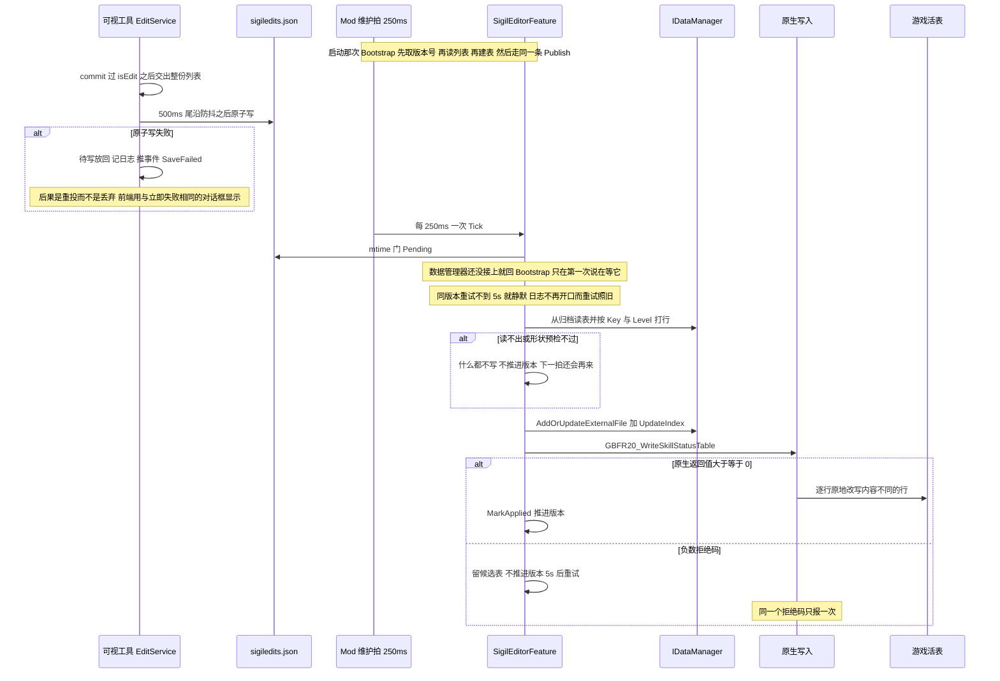
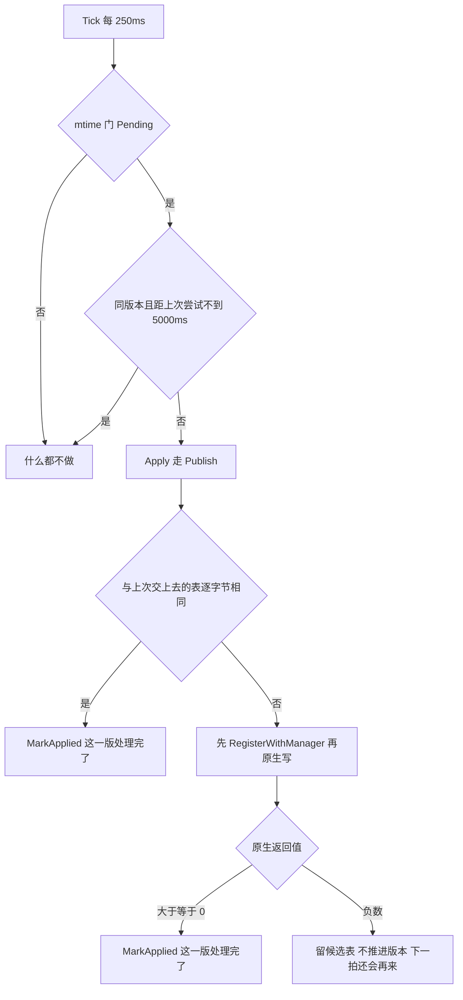

# 工作流：因子数值编辑与热应用

这条链路把一个数值框里的一次输入变成游戏**活表**里被改写的字节，中间有四个进程/角色参与：

| 角色 | 干什么 | 代码 |
| --- | --- | --- |
| 可视工具前端（React） | 决定"什么算一条编辑"、把整份列表交出去 | `SigilLoadout/frontend/src/components/SigilEditorPanel.tsx`、`frontend/src/lib/skills.ts` |
| 可视工具后端（Go / Wails） | 500ms 防抖 + 原子写 `sigiledits.json` | `SigilLoadout/service/editservice.go`、`appfiles/debouncedwrite.go`、`appfiles/atomicwrite.go` |
| 托管 mod（C#） | 读列表、从归档读原表、打行、重新注册、写内存 | `GBFR.SigilLoadout/SigilEditorFeature.cs`、`Config.cs`、`EditListJson.cs` |
| 原生核心（C++） | 从启动时解出的槽拿到活表地址，原地改写不同的行 | `GBFR.SigilLoadout.Native/src/table_slot.cpp`、`src/exports.cpp` |

两侧之间**只有 `%LOCALAPPDATA%\GBFRSigilLoadout\sigiledits.json` 一个通道**，没有握手也没有通知：目录怎么算、文件名、成员名与"各只有一处声明"的规则见 [两个配置文件与跨语言常量契约](/openwiki/concepts/config-file-contracts.md)；行布局常量、锚点推导与五道写入闸门见 [skill_status 表与活表写入闸门](/openwiki/concepts/skill-status-table.md)，本页不复述它们。

## 两条路径，同一个 `Publish`

启动那一次写与运行中的热应用**不是两套机制**：它们各走各的入口，在 `Publish` 处汇合成同一次"重新注册 + 原地写内存"。下面这张图把一次编辑的全程与**每个失败分支的后果**画在一起——重试、静默、还是推给前端。

```mermaid
sequenceDiagram
    participant Tool as 可视工具 EditService
    participant File as sigiledits.json
    participant Tick as Mod 维护拍 250ms
    participant FE as SigilEditorFeature
    participant DM as IDataManager
    participant NC as 原生写入
    participant Game as 游戏活表

    Note over Tick,FE: 启动那次 Bootstrap 先取版本号 再读列表 再建表 然后走同一条 Publish
    Tool->>Tool: commit 过 isEdit 之后交出整份列表
    Tool->>File: 500ms 尾沿防抖之后原子写
    alt 原子写失败
        Tool->>Tool: 待写放回 记日志 推事件 SaveFailed
        Note over Tool: 后果是重投而不是丢弃 前端用与立即失败相同的对话框显示
    end
    Tick->>FE: 每 250ms 一次 Tick
    FE->>File: mtime 门 Pending
    Note over FE: 数据管理器还没接上就回 Bootstrap 只在第一次说在等它
    Note over FE: 同版本重试不到 5s 就静默 日志不再开口而重试照旧
    FE->>DM: 从归档读表并按 Key 与 Level 打行
    alt 读不出或形状预检不过
        FE->>FE: 什么都不写 不推进版本 下一拍还会再来
    end
    FE->>DM: AddOrUpdateExternalFile 加 UpdateIndex
    FE->>NC: GBFR20_WriteSkillStatusTable
    alt 原生返回值大于等于 0
        NC->>Game: 逐行原地改写内容不同的行
        FE->>FE: MarkApplied 推进版本
    else 负数拒绝码
        FE->>FE: 留候选表 不推进版本 5s 后重试
        Note over NC: 同一个拒绝码只报一次
    end
```

上图：启动那次写（`Bootstrap`）先取版本号、再读列表、再建表，然后把刚建好的表直接交给同一个 `TryApply`；运行中的热应用由 mtime 门放行、按此刻磁盘上的列表重建表。两者在 `Publish` 处汇合。`bootTable` 参数就是"两条路径是同一个操作"的体现——启动时已经建好的表直接交过去，让 `Tick` 再读一遍配置、再建一次表纯属白干。

三个失败分支里**只有一个会打扰用户**：防抖写盘失败推给前端（编辑仍在待写里，不会被丢掉）；mtime 门放行之后的失败只是让下一拍按同一版本重来（版本一次都没推进）；拒写与建表失败都不改变游戏内存，编辑留在"已存进文件、也已重新注册"的状态里，等游戏下一次解析或重启。

走 `TryApply` 而不是直接 `Apply` 是有意的：`TryApply` 顺带登记"这一版我已经说过了"（`_loggedAttemptUtc`），否则第一次 `Tick` 会把这同一版当成新版本——既不静默、也不节流，白重试一次。

## 一、什么算一条编辑（前端的不变量）

列表的最终内容就是游戏拿到的东西，所以"什么算编辑"必须只有一处规则，且每条路径都经过它：

- **`isEdit`**：`enabled || 十个参槽里有一个不是 null`。勾选本身就是编辑（它什么都不写，等于"以游戏自己的数值开启"）；只有数字而没有勾选的记录也被保存，只是不生效——勾选才是把它送进游戏的那个动作。
- **`pad`**：补齐到正好十个槽，缺的位置是 `null`（`null` 就是"游戏自己的值"）。读文件时同样先补齐，所以文件里短一截、或者 `values` 根本不是数组的记录，在屏幕上也是一行十框，缺的都是空框。
- **`dedupeBy` / `dedupe`**：**一个地址最多一条编辑**。地址由调用方给（因子是 `hash#level`，能力强化是参数行的 Key），规则本身与地址无关，所以只有这一份实现，两条编辑链路共用。`PatchRows` 按列表顺序逐条写，同一地址上游戏最终拿到的是最后一条已启用的——所以去重留**最后一条已启用的**，该地址一条已启用的都没有时留最后一条（不论启用与否）。面板的编辑态本身就是按地址索引的 `Map`，这个不变量于是由容器结构保证，只有"从文件读进来"一处需要显式去重。

十个参槽按位置对应 `LevelValue1..10`，`null` 的意思是**保留游戏原值**，不是 0。规则只有一句：**谁碰过这个槽，只看它是不是 `null`**——数字哪怕正好等于该等级游戏自己的值，也仍然是用户的输入；没有数字才是"没动过"，此时由输入框的**占位符**把游戏原值灰显出来（`SkillRow.tsx` 的 `placeholder` 取自 `valuesAt(info, level)`，也就是随包资产 `skill_status.json` 里那一行）。所以"清空一个框"是把那个槽还给游戏（写回 `null`），而不是把游戏自己的数字写进文件——这条链路上**没有"与游戏原值相等就当没输入"的裁剪步骤**（旧版本的那一步 `trimGameValues` 已经不在了，`skills.ts` 里没有这个名字）。为什么不能写全值：可视工具对绝大多数参槽一无所知（参槽含义的唯一线索是游戏自己的说明文案），把"可视工具看到的那份表"整套写下去就会用一份陈旧副本覆盖掉它没编辑过的槽位。

为什么 `null` 而不是 0：补齐到正好十个的动作在写盘与读取两侧各做一次（Go 的 `padValues`、C# `Config.Load`），所以线格式的形状稳定——写出去永远是十项，读回来也永远是十项，而缺的参槽留给游戏原值。

输入框那一侧还有一条与"能不能写进 JSON"有关的硬规则：框里允许的文本由两个模式给出上界——小数点前最多 6 位、后最多 6 位（最大 `999999.999999`），并且**永远不接受科学计数法**。这不是排版偏好：`1e999` 这类值会被 JSON 变成 `null`（可视工具再把它存成 0），而 309 位数会被提交成 `Infinity`，JSON 拒绝写它，此后每一次保存都失败。同一个上界也钳住方向键步进（`stepValue` 与 `MAX_VALUE`），否则停在上界的框按一下键就会得到一个自己再也接受不了的数字。

面板侧还有三条容易踩空的规则：

- **列表还没读回来就绝不写盘**（`editListRead`）。此时屏幕上的 `edits` 是空的，而 `SaveEdits` 交出的列表会被后端**整体替换**——那会把用户其余编辑一次抹掉。这一条还顺带护住"读失败"：`LoadEdits` 拒绝时 `editListRead` 保持假，此后 `commit` 直接返回，所以一份坏文件不会被用户的下一次按键覆盖成空列表。
- **挂载只读一次，而且只归一化、不写回**：`loadAll` 把 Key 归一成大写、把不是有限数的数值以及不是数组的 `values` 当成空、补齐十槽，并丢掉 Key 为空的记录（它不是任何一行；非十六进制但非空的 Key 留着，用它的 hash 当名字显示——一个看不见的编辑比一个名字只是 hash 的编辑更糟）。发现差异就地回写等于"打开一次就等于改过一次"，与"文件不存在 = 空列表"（`LoadEdits` 刻意不造内置的起始编辑，所以打开可视工具本身不是一次对游戏的改动）是同一条规则。
- 这一页是 `keepMounted` 的：切走不卸载。否则在 500ms 防抖窗口内切走再切回来，会读到还没写下的旧文件，屏幕上的新数字消失，随后那份旧列表还会把磁盘上的新值覆盖回去。

`commit` 是每一次编辑的唯一出口（`toggleLevel`、`toggleSkill`、`updateLevel` 都走它）：它先 `filter(isEdit)`、把结果重新按地址装进 `Map`，再把整份列表交给 `SaveEdits` 并且**不等答复**。这里刻意只打补丁、不碰 `enabled`——在组件里再写一遍"什么算编辑"就等于只按描述的后半句判断（"带着数字"），勾选着的记录会因为输入框被清空而丢掉勾选，于是也掉出置顶区：用户明确按下的那一下被一次输入框操作撤销了。`isEdit` 那一份实现加上"每条路径都经过它"，就是为了不让这条规则有第二个副本。

## 二、落盘：500ms 尾沿防抖 + 原子写

`SaveEdits` 只做一件事：把收到的列表按 `SigilSkill` 的形状补齐参槽，然后交给 `appfiles.Debounced`——这套骨架由三份配置共用（`loadout.json`、`sigiledits.json`、`limit_bonus.json`），"写哪一份"由调用方传进来的 `write` 决定。

- **尾沿防抖 500ms**（`appfiles.DebounceDelay`）：`Submit` 记下待写并重启定时器，所以一串连续按键只换来一次写入，而写出的永远是屏幕上最后的状态——前端因此可以保持愚笨（每次改动都调用，从不等待）。
- **原子写**（`appfiles.WriteAtomic`）：同目录唯一临时文件 + `rename`，而且唯一临时名让并发的两次保存不会共用中转文件。运行中的 mod 会反复读这份文件，直接 `O_TRUNC` 会留下"读到半截"的窗口，那一边只能看到坏 JSON。
- **失败重投**：写入发生在定时器回调里，已经没有调用方可以返回错误。失败时把待写**放回**（一次瞬时 IO 失败不该变成永久丢失）、记日志、并通过 `GBFR.SigilLoadout.SaveFailed` 事件推给前端；前端用与立即失败相同的对话框显示它。事件名是跨层协议常量，`appfiles.SaveFailedEvent` 与前端 `SAVE_FAILED` 各写一份字面量，改名必须同时改两处。
- **关窗兜底**：`app.OnShutdown(editService.FlushNow)`。窗口可能在防抖窗口里就被关掉，而刚做的那次编辑才是用户想留下的；已经写过的不在待写里，所以它和定时器都不会写第二遍。

### 失败事件怎么走到屏幕上

界面那一侧只有两条路，而且共用同一个对话框，因为在用户看来它们是同一件事——**编辑没有落到磁盘上**：

- **立即失败**：`SaveEdits(kept)` 的 promise 被拒（`SaveEdits` 本身不返回错误，所以这只覆盖调用本身失败这一路），`catch` 里 `showError({ title: t.writeFailed, detail })`；
- **防抖失败**：`usePanelFailure` 在挂载时 `Events.On("GBFR.SigilLoadout.SaveFailed", …)` 订阅一次（依赖数组是空的），把事件带的数据当作详情。**标题从 ref 里取最新的一份**，所以切语言不会重订、也不会丢订阅——两件事（订阅的生命周期、标题跟着语言走）由一处交代清楚。写失败时用户正等着的那次编辑**还在待写里**，下一次防抖或退出时的 `FlushNow` 就是它的重试机会。

两条都落到同一个 `PanelFailureDialog`（标题来自 `messages.ts` 的 `writeFailed`）；这个 hook 与对话框是**两个编辑页共用**的（能力强化页走同一个事件名），所以关掉对话框只是关闭，消息留在 state 里好让退场动画仍有内容可画。

`nil`（一个 nil 切片）与空列表**不是同一件事**，而托管侧的读法把两者的差别变成硬后果：空列表写出的是一份 `edits: []` 的文件，读出来就是"所有编辑都关掉了"——对 mod 而言就是撤销全部编辑；`nil` 在线格式上写作 `null` 而不是 `[]`，而托管侧把"`edits` 不是数组"（`null` 也算）判成**读不出来**，那一版因此什么都不应用，绝不会被当成"撤销全部编辑"。读取侧对称地分三种情况：文件不存在 = 空列表（没有内置的起始编辑，否则"打开可视工具"本身就是一次对游戏的改动）；存在但读不出或解析不了 = **错误**而不是空列表（把坏文件显示成空列表，正是某次误触按键把这份空覆盖回用户编辑内容的方式）；`{"edits":[]}` = 真实答案。

## 三、托管侧：mtime 门与 250ms 维护拍

托管 mod 没有自己的时间来源。`Mod` 建一个 250ms 的 `System.Threading.Timer`，每拍依次调 `LoadoutConfig.Tick`、`SigilEditorFeature.Tick`、`_limitBonusEditor.Tick`、`Hotkey.Tick`，并用一个 `_ticking` 标志丢掉重叠的拍（回调不串行）。**250ms 不是个量**——数值要到下一场战斗才生效；它换掉的是一条阻塞在 `WaitOne` 的线程和一个内核事件对象。因子编辑器与能力强化编辑器都是这个拍下的一个阶段，各自只按自己的文件版本决定要不要动手。

这道门用 `FileStamp` 的**"确认生效"那一款**（不是"认领"那一款）：`Pending(current)` 在失败后仍然为真，"这一版处理完了"只能由调用方在确实生效之后用 `MarkApplied` 宣告。于是不需要"重试"这件事单独存在——失败自然会让下一拍再来。文件被删掉也是一版真实的、可比较的版本（`UserConfig.Stamp` 给的是 `UserConfig.NoFile`，与初值不同），所以"删了"和"改过"走同一道门。

`Tick` 的判据只有三行：

1. 数据管理器（`IDataManager`）还没接上 → 回到 `Bootstrap`（它是**可选**依赖，可能比本 mod 晚加载，所以每拍重试，只在第一次说一句"在等它"，接上时另记一句 `IDataManager attached`）。
2. `Pending` 为假 → 什么都不做。
3. 同一版本的重试按 `RetryIntervalMs = 5000` 节流（第一次尝试不节流；文件一变立刻处理，那一版不算节流）。

启动那次（`Bootstrap`）有三条刻意的顺序，都对应真实的失败模式：

- **版本号必须在读内容之前取**。反过来就会出现"内容来自 T1、版本号来自 T4"，而 T1→T4 之间落盘的那次保存会被 `MarkApplied(T4)` 判成已生效——内存里却是旧内容，编辑静默丢失且不再重试。
- **造表期间文件又变了就不写、也不推进版本**，让 `Tick` 按新版本重来。
- **数据管理器接上了但表造不出来**（归档读不出来、或布局不是本构建认识的那一种）就什么都不写；`_started` 已置上，此后由 `Tick` 的 mtime 门继续（版本没推进，所以下一拍照样放行）。

列表为空（或文件根本不存在）时两条路径的后果**不同**：启动那次什么都不写——`PatchRows` 返回 0 就提前返回，日志还把"还没有编辑列表"与"没有一条编辑落到行上"分成两句——而运行中的热应用把缺失的文件当成空列表，交出去的因此是一份**未编辑的**表：删掉 `sigiledits.json` 就是把已经生效的编辑从活表里撤销（与 `loadout.json` 同一种反应）。启动那一拍只是跳过、版本没推进，所以下一拍的 mtime 门照样放行，那份原表终究会被交出去——两条路径只在第一拍上不同。

## 四、造表：从归档读、验形状、按 (Key, Level) 打行

`LoadConfig` 走的是 `EditListJson.Load`：一个 JSON 对象、必有 `edits` 成员、它是数组，三样都对才反序列化；`edits` 是空数组是真实答案，其余坏形状（文件超 1 MiB、不是对象、没有 `edits`、`edits` 不是数组）都抛异常，由调用方记下原因后**什么都不写**，而不是抹掉本局还活着的编辑。每条记录的成员名仍由各自的 `[JsonPropertyName]` 决定（精确匹配、不折叠大小写），认不出的成员被忽略、随后在逐条扫描时以 `skip` 收场。

`BuildEditedTable` 的输入是 `IDataManager.GetArchiveFile("system/table/skill_status.tbl")`——**权威那份表来自游戏自己的归档**，不是硬编码的字节。拿到之后先过形状预检 `HasPatchableLayout`：头部声明的行数必须正好按行步长把剩下的文件算完（判定写成整除 + 取余，而不是乘法等式，理由见 [skill-status-table](/openwiki/concepts/skill-status-table.md)）。过不了这一关就一个字节都不进游戏，日志报出实际字节数与头里声明的行数。

`PatchRows` 逐条遍历列表，跳过三种记录并各记一行：

- 未启用（`skip (disabled)`）——记 `enabled` 数量的那行日志与这里的逐条跳过合起来就是"这一轮会写进去几行"；
- `key` 还不是 8 位十六进制（`skip (key is not an 8-digit hex hash yet)`）；
- `level < 1`（在强制转换成 `uint` **之前**判；负数转 `uint` 会变成几十亿，行查找会以"行没找到"收场，读起来像配置里键写错了）。

`PatchRow` 按 `(Key, Level)` 找到那一行，只把**非 `null` 且有限**的数值写进对应参槽：手改的 `sigiledits.json` 能写出 float 装不下的数（`1e39`），`System.Text.Json` 不报错而是给 ±`Infinity`，写进去就是游戏拿着无穷大去做它自己的算术，所以那种槽位保持原样并记一行。写入循环以 `min(LevelValueCount, values.Length)` 为上界，所以第 11 个参槽无论如何到不了游戏（Go 侧 `padValues` 已经先把它截掉），而缺的参槽永远保持游戏原值。

逐行日志的基线是**上一次建出来的那份表**（`_retryTable` 优先，否则 `_currentTable`），不是刚读出来的归档：归档里永远是原始值，"变了"必然成立，于是改一个输入框就会把整张编辑表重打一遍。两份都没有（第一次建表）时取补丁前的值，于是全部会打出来——那些行对游戏确实都是新的。

## 五、`Publish`：注册在前，活着写在后

`Publish` 是**唯一**交给游戏的路径，两件事的顺序不能换：

1. **重新注册**（`AddOrUpdateExternalFile(TablePath, table)` + `UpdateIndex()`）。它便宜，而且游戏在读档、开界面时会重新解析这张表——不重新注册，那些解析会用旧值把行重建出来，当场抹掉实时编辑。注册抛异常只记一行，**不拦住**后面的内存写：这一步失败不该让"现在就要可见"也一起没了。
2. **原地写内存**（`NativeCore.WriteSkillStatusTable` → `GBFR20_WriteSkillStatusTable`）。托管侧既不持有活表地址也不扫内存；原生用启动时从语义锚点解出的槽，把内容真的不一样的行原地写进去。

### 版本推进的时机

```mermaid
flowchart TD
    A["Tick 每 250ms"] --> B{"mtime 门 Pending"}
    B -- "否" --> Z["什么都不做"]
    B -- "是" --> C{"同版本且距上次尝试不到 5000ms"}
    C -- "是" --> Z
    C -- "否" --> D["Apply 走 Publish"]
    D --> E{"与上次交上去的表逐字节相同"}
    E -- "是" --> F["MarkApplied 这一版处理完了"]
    E -- "否" --> G["先 RegisterWithManager 再原生写"]
    G --> H{"原生返回值"}
    H -- "大于等于 0" --> I["MarkApplied 这一版处理完了"]
    H -- "负数" --> J["留候选表 不推进版本 下一拍还会再来"]
```

上图：一版的 mtime 只有两条路径会被宣告"处理完了"，拒写则永远把这一版留在欠着的状态。

- **真的写进游戏内存**（原生返回 ≥ 0，即"实际改写的行数"，0 表示内存里已经是这些字节）才 `MarkApplied`。
- 另一处是"**这份表与上次交上去的逐字节相同**"这条捷径：内存里已经是这一版的字节，所以这一版确实处理完了。不标记的话 `Pending` 永远为真，而这条捷径又让"同版本"这个节流条件失效，于是每 250ms 白重建一次表。基线未知（启动那次没产出表）时不比，让这一拍照常做一遍原生写——代价是一次调用，换来的是不必维护"游戏手里那份"这个第二份事实。
- **拒写不推进版本**，这就是重试的全部机制。附带两条：
  - **候选表复用**：上一次拒写留下的那份表与它的文件版本一起记着（`_retryTable` / `_retryTableStamp`），同版本重试直接拿它再交一次，不必从归档重建一份逐字节相同的内容（每次 328 KB 读 + 逐行比较，而拒写期间是 5 秒一次）。
  - **同一版本只报一次**：`_quiet = (stamp == _loggedAttemptUtc)` 让 `LogAttempt` 在重试时静默，版本一变就重新开口。被静默的是**日志**，重试本身照旧每 5 秒发生一次。"这条表读不出来"与"原生拒写"在屏幕上都是同一件事，重复说没有新信息。原生侧那条 `WriteSkillStatusTable: refused (码)` 同理由它自己的 `last_refusal` 只报一次（拒绝码变了或中间成功过一次才再报）。

拒写的语义边界要说清：托管侧只报"被拒 + 码"（码的含义只有一处权威），本层的后果是**编辑已存进文件、也重新注册过，游戏下一次解析就会拿到它**。

### 启动那次写通常会被拒——这正是 5s 重试存在的理由

`Bootstrap` 在 mod 加载时同步跑完，而那时游戏多半还没把这张表读进内存——源码把这件事写成了"唯一可能的成功条件是游戏把表读进了内存，那是分钟级的事"。于是启动那次内存写**通常**先吃一个拒写（槽还没发布缓冲区指针）。这不丢任何东西：

- 注册那一步已经做完了，游戏自己随后的那次解析读到的就是带编辑的文件；
- 版本没推进，`Tick` 于是按 5 秒节流再试，直到游戏持有活表之后那一次就地写成功——玩家看到的"改了立刻生效"正是那一次。

所以"启动时改一份表交给 `IDataManager`"与"运行中直接覆写游戏内存里那份已解析的表"不是两种做法，而是同一次 `Publish` 在不同时刻的两种结果。

## 六、为什么"说明实时更新、实际效果下一场战斗生效"

玩家文档（`GBFR.SigilLoadout/README.md`）承诺：改动时游戏内该因子的**说明**实时更新，**实际效果**在下一场战斗开始时生效；**无需重启**，运行中的游戏随即把编辑应用到它已经读进内存的那张表上。源码支持的是这条链路的两半——而每一半对应到哪几句源码可以一一指出：

- 编辑只碰活表里的 `LevelValue1..10` 字节（`PatchRow` 按 `(Key, Level)` 定位那一行，`Key`、`Level` 等字段从不写），所以就地写成功后游戏读这张表拿到的就是新数字——玩家文档说的"说明实时更新"就是这一半，链路里没有别的机制参与它。
- **"表已经被改写"不是"可见"**：术语表把前者与"**可见**"（游戏已经把新值算进了**角色描述**）明确分成两件事，而"可见"与"实际生效"又是两件事。于是就地写成功只保证游戏手里那份（活）表变了：角色身上的数值要到下一次战斗才重算。托管侧自己的注释也把这一点写成"数值要到下一场战斗才生效"，这也是 250ms 维护拍"不是个量"的原因。
- 这条承诺**只在原生就地写成功时成立**。拒写时内存一个字节都没变（原生那一段注释写明了"拒写的代价只是这一局内存不变"），编辑已写进文件并重新注册，要等游戏下一次解析或重启才落地——这条路径只出现在日志里（`the edit list is saved and re-registered, so the game picks it up at its next parse`），见 [日志与故障定位](/openwiki/operations/logging-and-diagnostics.md)。
- 玩家文档"**不带 `.tbl` 文件**：表从游戏封包中读出、在内存里改写，所以能和其他**改表** mod 并存"这一条同样与源码一致：造表的输入永远是 `IDataManager.GetArchiveFile("system/table/skill_status.tbl")` 的返回值，mod 目录里没有表文件，原生改写的也是游戏自己已解析的那块缓冲区。

参槽的含义也只能从游戏自己的说明里读出来：随包资产 `skill.<lang>.json` 的 `explain` 分段里 `{N}` 就是 `LevelValue(N+1)`，可视工具把 `{N}` 改写成从 1 开始数的 `{N+1}` 才和十个输入框对得上。注意两侧数据来源不同：可视工具显示的起始数值（占位符）参照随包的 `assets/skill_status.json`，真正被改写的表来自归档——两份漂开时，占位符显示的数字与游戏原值会对不上（见 [外部生成器 gen 与随包数据资产](/openwiki/integrations/external-generator-and-assets.md)）。

### 谁会被重试，谁不会

拒写之后的账要一次算清：

| 步骤 | 拒写之后的处境 |
| --- | --- |
| 用户的那次输入 → 写盘 | **已完成**，不会再做一遍（防抖写过就不在待写里） |
| 读编辑列表、从归档造表 | 每次重试都重做；同版本且候选表还在时直接复用它 |
| 重新注册（`AddOrUpdateExternalFile` + `UpdateIndex`） | **没有单独重试这一说**，它随每一次 `Publish` 一起重做（每次都调） |
| 原生原地写内存 | 会重试：版本没推进，下一拍 `Pending` 仍为真，按 5s 节流再来一次 |
| 已经 `MarkApplied` 的那一版 | 不再重试：成功或"与上次逐字节相同"都会把这一版收工 |

## 七、失败与运维读法

这条链路的每一段都只记日志、不把功能之外的东西带走（这项功能坏掉不该把整个 mod 带走）。按顺序看这几行就能定位到具体是哪一段：

| 日志 | 含义 |
| --- | --- |
| `sigil edit: IDataManager is not available yet; the edit list waits for gbfrelink.utility.manager to load` | 数据管理器缺席，编辑在它加载之前不会落地（只在第一次说一句）；接上时另记 `sigil edit: IDataManager attached` |
| `sigil edit: N enabled` / `skip (…)` / `KEY L15 @0x…: …` | 读到的列表与逐条的落点，以及每条编辑最终写进那一行的十个值 |
| `sigil edit: no edit list yet at … (the tool writes it there)` | 文件还不存在：托管侧读成空列表。启动那次因此什么都不写，而热应用那一版等于把未编辑的表交回去（撤销全部编辑） |
| `sigil edit: list load failed: …` | 文件存在但坏形状（不是对象、没有 `edits`、`edits` 不是数组、超 1 MiB）：这一版什么都不应用，也不推进版本 |
| `sigil edit FAIL: system/table/skill_status.tbl is not the 8-byte header + 52-byte row table this mod patches: … bytes, header rows=…` | 形状预检没过，一个字节都没改 |
| `sigil edit: the edit list changed while the table was being built; it will be applied on the next tick` | 启动那次造表期间文件又变了：不写、不推进版本，交给下一拍 |
| `hot apply: the edit list matches what is already in memory; nothing to do` | 这一版与上次交上去的逐字节相同：就地标记为处理完了，不做原生写 |
| `hot apply: the native write was refused (码); the edit list is saved and re-registered, …` | 拒写（同版本只报一次），5 秒后重试 |
| `WriteSkillStatusTable: refused (码): <人话>` | 原生侧对同一个码的解释，只有拒绝码变化时出现 |
| `hot apply: SUCCESS - rows=N of the game's own table rewritten in place at its boot slot in … ms` | 真正写进去了几行 |

`Apply` 的第一件事是看 `_stopped` 标志：`Dispose`（卸载）之后宿主那一拍仍可能叫起一次应用——定时器不保证回调已经跑完——那一次会被跳过而不是往游戏内存里写，日志写 `hot apply: skipped - the feature has been disposed`。

## 八、与能力强化那条链路的差异

两条编辑链路共用同一套**外壳**：同一个 `appfiles.Debounced`（500ms 尾沿）+ `WriteAtomic`（唯一临时名 + rename）、同一个 `GBFR.SigilLoadout.SaveFailed` 事件与同一个失败对话框、同样的"列表还没读回来就绝不写盘"与 `keepMounted`，以及 `skills.ts` 里同一个 `dedupeBy`（"一个地址最多一条"）。差别只在两处，而且都是刻意的（见 [工作流：角色强化数值编辑与热应用](/openwiki/workflows/limit-bonus-apply.md)）：

- **是否经数据管理器**。因子这张表（`skill_status.tbl`）在读档、开界面时会被游戏**重新解析**，所以每次热应用都必须先 `RegisterWithManager` 重新注册一份供给文件，否则那次解析会用旧值把行重建出来、当场抹掉实时编辑；`Bootstrap` 那次同步写也就存在。能力强化那张表（`limit_bonus_param`）不重新解析，于是整件事就是维护拍里的那一次原生内存写——**没有注册这一步，也没有启动时那一次**。
- **输入形状**。因子这边一条记录是"某一行 + 十个参槽"，槽可以留空（`null` 保留游戏原值），托管侧据此造出**整张表**再交给原生按 (Key, Level) 打行；能力强化那边一条记录是"一个参数行 Key + 按档位排的若干值"，写几档完全由数组长度决定、没有 `null` 语义、也不存在"整张表"这个中间物，每条记录各调一次原生。
- **记账法**也因此不同：因子这条用 `FileStamp` 的 `Pending` + `MarkApplied`（"确认生效才收工"，拒写就不推进版本）；能力强化那条的版本在**动手之前**推进，间隔按"没落地 5s / 落地后 30s 看护"两档（它要的是落地之后继续看护，而不是成功即收工）。

## 九、改这里之前的检查清单

- **参槽数 10 有三处声明**（C# `Config.SigilSkill.LevelValueCount`、Go `service/editservice.go` 的 `LevelValueCount`、TS `lib/skills.ts` 的 `SLOTS`），被 `sharedconstants_test.go` 的对拍钉住；写多一个会被托管侧的较小上界静默忽略，写少一个则那个槽位永远保持游戏原值。这次对拍只证明"两两相等"，不是边界证明。
- **`sigiledits.json` 的五个成员名**（`edits`/`enabled`/`key`/`level`/`values`）、**文件名**、**用户配置目录名**（`appfiles/paths.go` 的 `UserDirName` 对 C# 的 `UserConfig.FilePath`：漂了就是"编辑永远不落地"）与**保存失败事件名**同样各写两份并被对拍；只改一边仍能编译、别的测试也全绿。
- **两个可调数字的含义完全不同**：`appfiles.DebounceDelay = 500ms` 是"编辑停下来的判定"（写盘侧），`RetryIntervalMs = 5000` 是"同版本重试的节流"（读盘侧），而 250ms 只是投递节奏。想调"编辑多久落地"改第一个，想调"游戏还没读表时的重试噪声"改第二个。
- **给编辑记录加字段**要同时改三处解码：Go 的 `SigilSkill`（`SaveEdits` 把收到的列表按这个类型的形状重新序列化整份写出去，它不认识的成员下一次保存就没了）、C# 的 `SigilSkill`（成员名精确、不做大小写折叠）、前端 `skills.ts` 的类型与 `SigilEditorPanel` 的读取归一化。外层形状（对象 + `edits` 数组 + 1 MiB 上限）现在由 `EditListJson` 一处管、两份编辑列表共用，加字段不必动它。
- **不要加内置的起始编辑**：文件不存在是空列表这一条，是"打开可视工具本身不是一次对游戏的改动"的实现方式。
- **不要改回"先认领、再干活"的 mtime 门**：认领等于宣告"处理过了"，而拒写时内存一个字节都没变，那一版就永远不再被放行（`FileStamp` 的注释写明了这一点）。
- **不要把"与游戏原值相等"重新当成"没输入"**：`null` 是"没动过"的唯一记号，游戏原值由占位符显示；读文件时只归一化、不回写。
- **步进的钳制不能宽于输入域**：停在上界的框按一下方向键得到的值必须仍然是模式接受的内容（`MAX_VALUE` 就是为此存在的），否则框里会出现一个按什么键都不会被接受的数字。

## 十、这份代码被验证到什么程度

- **前端规则有测试**（`frontend/src/lib/skills.test.ts`）：输入框按键状态机（半成品文本、前导零、科学计数法被拒、6+6 位上界）、`isEdit` 的三种组合、`pad` 与 `dedupe` 在四种启用组合下留下哪一条并校验留下的**数值**、`levelsOf`、`explainAt`、`slotLabel`、`parentState`。组件本身（`SigilEditorPanel.tsx`）没有单元测试。
- **写盘与读取有测试**（`SigilLoadout/service/editservice_test.go`）：写入落点与"未输入过的参槽在文件里就是 `null`"、用 `testing/synctest` 把防抖的尾沿语义变成关于代码的陈述、写失败后待写被放回且"没有窗口可通知"那条分支也能走完、`padValues` 截断/补齐、三种缺席语义（不存在 / 空数组 / 坏文件）与"读一次不写回"、旧拼写的文件读成空列表、资产的线格式按字节钉住。
- **跨语言字面量有对拍**（`sharedconstants_test.go`），但它是"漂了立刻红"，不是"契约已证明"：它把本包所有非测试 `.go` 拼起来找一个声明，所以纯搬移不会让它红——它盯的是"值漂没漂"。
- **托管 C# 那半（`SigilEditorFeature`、`Publish`、版本推进与重试）没有任何自动化测试**：解决方案里只有原生与托管两个项目，`Bootstrap`/`Tick`/`Apply`/`Publish` 的时序、候选表复用、节流与"同版本只报一次"只能在真机日志里取证。改这一段时，日志是唯一的证据来源，各套件护什么见 [验证地图：测试与门禁各护什么](/openwiki/testing/verification-map.md)。

配装那条并行链路（`loadout.json` → 原生模板/专属开关）见 [工作流：配装从界面到游戏状态](/openwiki/workflows/loadout-apply.md)。
