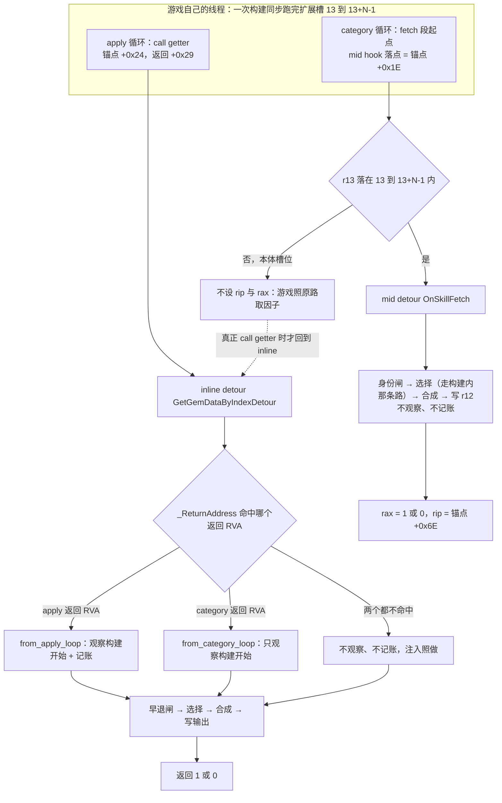
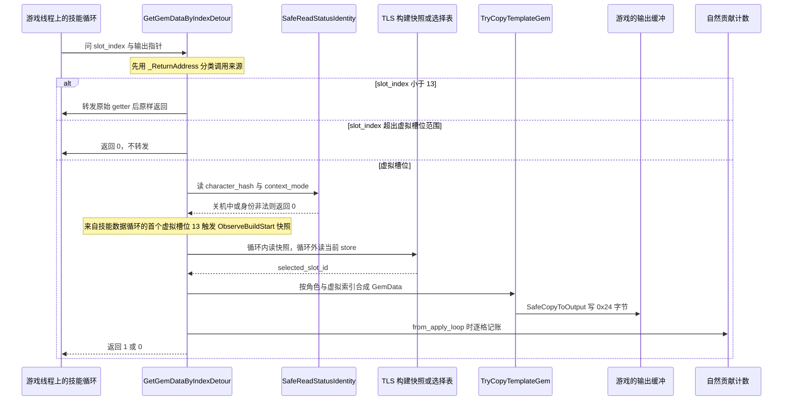
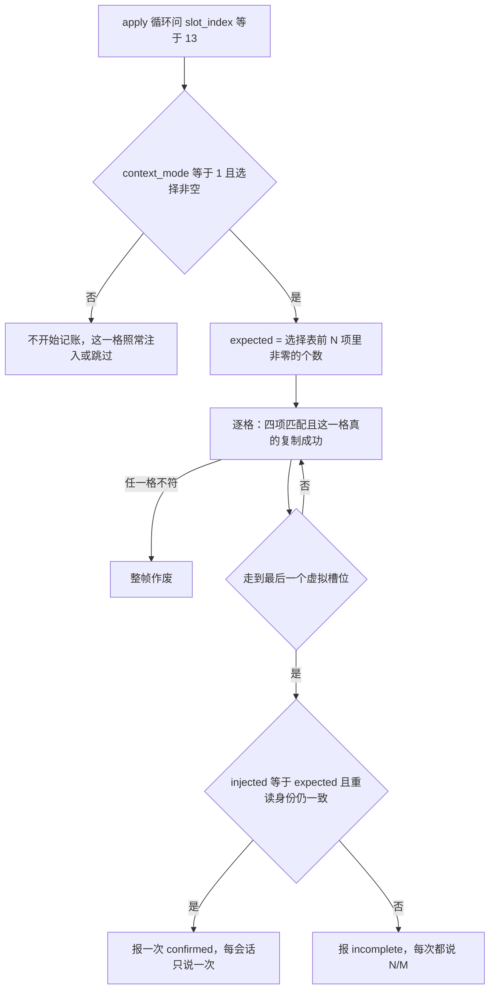
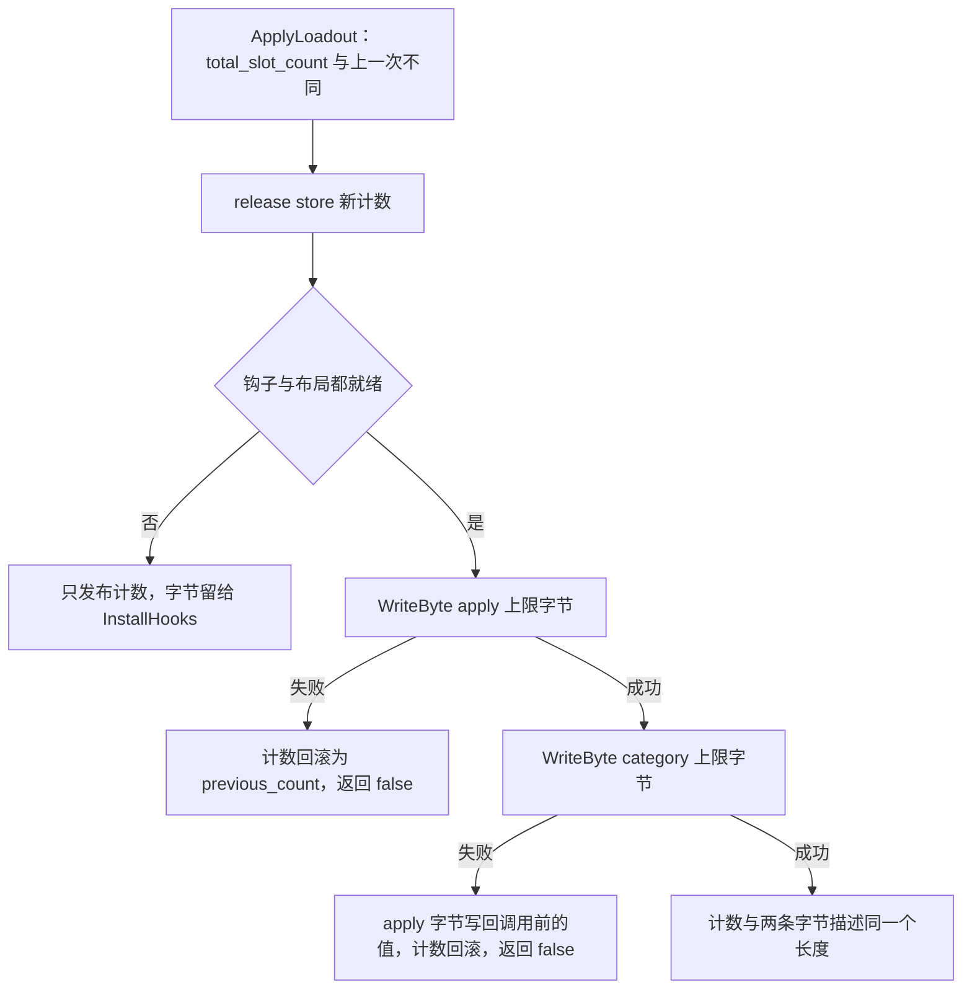
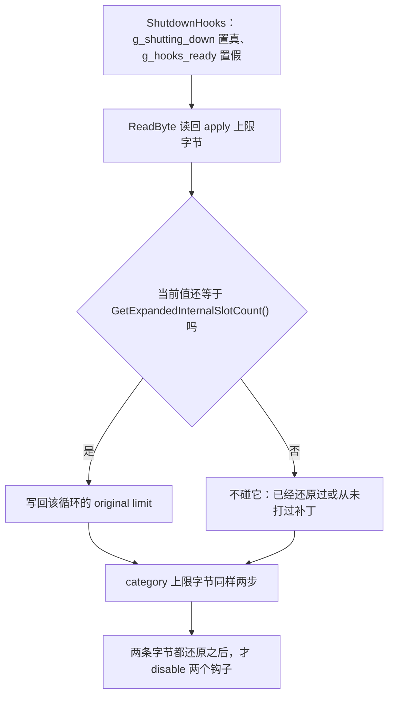

# 工作流：游戏侧注入运行期（detour 与循环上限）

[配装从界面到游戏状态](/openwiki/workflows/loadout-apply.md) 讲的是"谁把选择表换掉"；这一页讲的是**换掉之后游戏来问的时候会发生什么**。这条链上没有任何主动推送：注入全部发生在游戏的技能循环回调到我们那两个 detour 里的那一刻，所以它的输入是游戏给的参数（`status`、`slot_index`、输出缓冲区），输出只有两个值——填好的 0x24 字节 `GemData`，或者"这一格没有"。

前置条件已经由别处保证：布局（含两个 detour 的安装地址与两条循环上限字节的 RVA）由 [语义锚点与布局解析](/openwiki/concepts/game-layout-anchors.md) 解出并复验；钩子的装卸、在途调用排空与锁序由 [并发、锁序与生命周期守卫](/openwiki/concepts/threading-and-locks.md) 兜住。本页只讲这两个 detour 体、上限字节的加宽与还原，以及它们写进运行消息和日志的那点结论。

## 两个入口

| detour | 安装点 | 入口函数 | 它拿到的参数 | 服务范围 |
| --- | --- | --- | --- | --- |
| inline（`safetyhook::create_inline`） | `g_game_layout.get_gem_data_by_index_rva`——两条技能循环**共用**的那个因子 getter | `GetGemDataByIndexDetour` | 形参 `(status, slot_index, output)` | 只注入 `13 <= slot_index < 13 + N`；`slot_index < 13` 原样转发；再高的一律不转发、返回 0 |
| mid（`safetyhook::create_mid`） | `g_game_layout.skill_fetch_path_rva` = category 锚点 `+0x1E`，即 category 循环体里那段取因子逻辑的第一条指令 | `OnSkillFetch` | 寄存器 `r15`（status）、`r13`（slot_index）、`r12`（output） | 只处理 `13 <= r13 < 13 + N` |

`N` 就是 `GetVirtualSlotCount()`，上界由 `GetExpandedInternalSlotCount()`（`13 + N`）表达。两者在同一段 `InstallHooks` 里装着，顺序固定：

| 子阶段 | 做什么 | 失败时 |
| --- | --- | --- |
| `required-byte-rva-preflight` | `RevalidateGameLayout()` 逐字节复验已发布布局 | 回滚 + `Resolved game layout changed before hook installation; no gameplay hook or byte patch was installed.` |
| `gem-data-getter-hook` | `create_inline` 挂在 getter 函数序言上 | 回滚 + `Failed to install the GemData getter hook.` |
| `skill-fetch-hook` | `create_mid` 挂在 fetch 段起点 | 回滚 + `Failed to install the skill fetch-path hook.` |
| `skill-loop-limit-patches` | `ApplySkillLoopLimits(GetVirtualSlotCount())` | 回滚 + `Failed to patch both native skill loop limits; changes were rolled back.` |

四条失败路径都汇到同一个 lambda（`DisableGameplayHooksAndRestore()` + `SetRuntimeMessage(为什么)` + 返回 `false`），成功才置 `g_hooks_ready` 并写一行 `Native hooks installed: N virtual slots.`。这个顺序不是排版：逐字节复验必须在 `create_inline` 改写 getter 函数序言之前跑，因为那条预检检的正是序言那 12 个字节。

### 谁在什么线程上

| 动作 | 线程 | 后果 |
| --- | --- | --- |
| 装钩子与首次加宽上限字节 | 调用 `GBFR20_Initialize` 的那条托管线程（mod 启动时一次，`EnsureInitialized` 由 `std::call_once` 门住） | 失败不会被重试，那一会话就是降级状态；见下文「装钩子是一次性动作」 |
| 两个 detour 体 | 游戏自己跑技能循环的线程 | 一次构建在那条线程上**同步**走完 `13…13+N-1`，所以构建快照与贡献计数帧可以放 `thread_local`（不变量见 [并发、锁序与生命周期守卫](/openwiki/concepts/threading-and-locks.md)） |
| 后续的上限字节加宽 | 托管维护拍线程经 `GBFR20_ApplyLoadout` | 只在 `g_hooks_ready && g_layout_ready` 且计数真的变了时才写字节 |
| 还原上限字节 + 拆钩子 | 调用 `GBFR20_Shutdown` 的托管线程（`Mod.Dispose()` 无条件调用） | `DllMain` 的 `DLL_PROCESS_DETACH` 只把 `g_shutting_down` 置真，不做拆卸 |
| 回读运行消息 | 托管启动线程一次（且只在钩子没装成时） | 见「运行消息」一节 |

`ActiveCallGuard`（两个 detour 的第一条语句）只负责让拆卸能等到在途调用退空；它的粒度、排空循环与 `reset()` 取舍不在本页，全在 [并发、锁序与生命周期守卫](/openwiki/concepts/threading-and-locks.md)。

### 入口分类

getter 是被两条循环共用的，所以 inline detour 的第一件事是分辨"这次是谁在问"：

```cpp
const uintptr_t return_address = reinterpret_cast<uintptr_t>(_ReturnAddress());
call.from_apply_loop =
    return_address == g_image_base + g_game_layout.skill_apply_getter_return_rva;
call.from_category_loop =
    return_address == g_image_base + g_game_layout.skill_category_getter_return_rva;
```

两个 RVA 就是两条循环里"getter 调用之后的那条指令"（apply 锚点 `+0x29`、category 锚点 `+0x6E`），它们的字节分别是 `84 C0 74 …`（`test al, al` + 条件跳转）。分类结果存成两个 bool，"是不是来自技能数据循环"**不存字段**——它恒等于两者的析取，由 `GemCall::from_skill_data_loop()` 现算，存起来就允许出现自相矛盾的状态。



两条入口与它们各自能触发的副作用。分类只影响"要不要观察/记账"，不影响"要不要注入"。

分类的用途有两处，都很具体：

- `from_skill_data_loop()` 决定"要不要观察构建开始"（两条循环都算）；
- `from_apply_loop` 决定"要不要记自然贡献"（只有 apply 循环记）。

值得单独记下的一条：mid detour 只在虚拟槽位范围内改出口，本体槽位（`r13 < 13`）它完全不介入，于是游戏仍按原路取因子——那条路里 `+0x69` 的 getter 调用一旦执行，inline detour 就会经 `skill_category_getter_return_rva` 把这次分类成 `from_category_loop`。也就是说 category 循环给 inline 路径送的只有本体槽位的调用，它的虚拟槽位请求已经被 mid detour 接走了。

## 判定 → 身份 → 选择 → 合成 → 写输出 → 计数



一次虚拟槽位请求的完整路径：先按返回地址分类，再经身份、选择、合成三关，最后写输出并按来源决定要不要记账。

这条链上每一格的成败都由返回值 1/0 表达；回到游戏之后，那个值由返回地址处的 `test al, al` 分支消费。

## 早退：四种"不注入"的分支

| 条件 | 行为 | 依据 |
| --- | --- | --- |
| `slot_index < kNativeInternalSlotCount`（13） | `g_get_gem_hook.call<uint8_t>(status, slot_index, output)` 原样转发 | 本体槽位归游戏自己，我们只做旁路（mid 侧连这一步都不做，直接放行） |
| `slot_index >= GetExpandedInternalSlotCount()` | 直接 `return 0`，**不转发** | 原始 getter 只有 13 格，转过去它会读自己数组的边界之外 |
| `g_shutting_down` 为真 | `return 0` | 拆卸中不再碰游戏状态 |
| `SafeReadStatusIdentity` 失败 / `context_mode` 不在 `0..2`（`IsValidContextMode`）/ `output == nullptr` | `return 0` | 身份读不到就没有可用于合成与角色限制判断的键 |

后三条被合并在同一个 `if` 里，语义是"一次性闸门"：任一不成立就当作这格没有因子。`OnSkillFetch` 用同一套判据，只是把 `output == nullptr` 换成 `context.r12 != 0`，并且没有 `< 13` 的那条转发分支——它本来就不该处理本体槽位。

这条边界纪律的代价与收益都是明确的：**转发只发生在 `slot_index < 13`**，所以游戏永远不会因为我们没接住而拿到越界数据；代价是超出范围的请求拿不到因子。

## mid detour：在 fetch 段起点接走虚拟槽位

`OnSkillFetch` 是一个 `safetyhook::Context` 钩子，它的出口是"假装原生 getter 刚刚返回"：

```cpp
context.rax = copied ? 1 : 0;
context.rip = g_image_base + g_game_layout.skill_category_getter_return_rva;
```

`context.rip` 指向的是 category 循环里那次 getter 调用**之后**的指令（`skill_category_getter_return_rva` = 锚点 `+0x6E`）。hook 点在锚点 `+0x1E`，两者之间就是游戏自己那段取因子逻辑——按 13 槽布局读的状态字段、`skill_fetch_call_path_rva`（锚点 `+0x60`）处开始的参数装配（`r15` 进 `rcx`、`r13d` 进 `edx`、`r12` 进 `r8`）、以及 `+0x69` 那次 `call` 本身。所以这段被整段跳过，虚拟槽位的结果由我们直接写进 `r12` 指向的输出；跳过的只是"取"这一步，游戏在 `+0x6E` 之后仍会自己做无效标志检查、gem-master 查询、类别计数、上限与效果计算。

**落在范围内的请求一律走这个出口**：合成成功是 `rax = 1`，合成失败、`g_shutting_down` 为真、`r12` 为空、身份读不到、`context_mode` 非法都只是 `rax = 0`，`rip` 照样设——游戏不会看到它自己那段取因子逻辑跑过一遍。

需要注意的是 mid hook 的作用域是**整段 fetch 路径**，不只是 getter 调用：对 `r13 < 13` 或 `r13 >= 13 + N` 的请求它不设 `rip`、不设 `rax`，直接返回让游戏按原路走（超出虚拟槽位范围的高索引随后会被 getter detour 拒掉，见上面那张早退表）。

还有一条容易忽略的差别：**mid 路径只有"选择 → 合成 → 写输出"**。它不调用 `ObserveBuildStart`（所以不写构建快照、不刷新热重建的时间戳），也不调用贡献计数的两个函数（`BeginNaturalContributionTracking` / `TrackNaturalContributionResult`）；它给 `TryLoadVirtualSkillSelection` 的 `from_skill_data_loop` 是**硬编码的 `true`**，只影响选择读取走"构建内"那条路。想加副作用，只能加在 inline 路径上，否则两条循环会各记一次。

## 从选择表到输出：合成的 GemData

选择表里存的是**模板 slot-id**（`0xFE000000 + v`）而不是 gem hash，所以读取分三步：

1. `TryLoadVirtualSkillSelection`：来自技能数据循环且 TLS 快照的 `status` 与 `character_hash` 都匹配时，用构建开始那份快照（还要求 `g_tls_build_has_selection`）；否则现查 `GetSelection(character_hash)`。两条路都可能返回"没有选择"（现查路径要求非零槽数量不为 0），此时这一格直接返回 0。函数体整体包在 `try/catch` 里，抛异常按"没有选择"处理并记一行日志。
2. `TryCopySelectedVirtualGem`：`virtual_index = slot_index - 13` 必须落在 `[0, GetVirtualSlotCount())` 内；`selection[virtual_index] == 0` 表示这格不发东西；非模板 id 直接返回 `false`（这个 mod 没有以库存为后端的虚拟槽路径）。
3. `TryCopyTemplateGem`：按角色取模板槽（`TryGetRuntimeSlot` 在 `gem_id == 0` 或索引超出已发布计数时返回 false），再要求 `RequiredCharacterForGem` 与角色兼容，然后把 `TemplateGemSlot` 铺成游戏那份 `GemData`——`slot_id` 填模板 id、`worn_by` 填未佩戴哨兵、`flags = 0`，最后经 `SafeCopyToOutput` 用 SEH 包住的 `memcpy` 写 0x24 字节。写失败（输出不可写）与"没有因子"对调用方的表现一致：返回 0。

字段与编号的完整对应在 [虚拟槽位、模板因子与专属开关](/openwiki/concepts/virtual-slots-and-exclusives.md)。

## 构建开始：第一个虚拟槽位的副作用

`ObserveBuildStart` 是全链**唯一**有副作用的地方，且只在 inline 路径上"来自技能数据循环 + `slot_index == 13`"时触发：

```cpp
const uintptr_t build_status = reinterpret_cast<uintptr_t>(call.status);
g_tls_build_selection = GetSelection(call.identity.character_hash);
g_tls_build_has_selection = CountSelectedSlots(g_tls_build_selection) != 0;
g_tls_build_status = build_status;
g_tls_build_character = call.identity.character_hash;
RememberGameBuild();
if (call.identity.context_mode == 1)
    RememberContext1Status(call.identity.character_hash, build_status);
```

它跑在身份闸之后，所以身份读不到的那一格既不会注入也不会留下快照。四个 `thread_local` 字段快照的是"这一次构建用哪套槽位"，此后整个构建（`slot_index` 从 13 走到最后一格）都读这一份，所以构建进行中改配装不会让同一个角色拿到半新半旧的选择。匹配条件是 `status` **和** `character_hash` 两项：`status` 对象的地址会跨角色复用，只比地址会让某个角色用上别人那次构建的槽位。

后两个调用把游戏线程的事实喂给热重建这条路径：`RememberGameBuild()` 记下"刚刚有人问过扩展槽第一格"，`context_mode == 1`（在场那份 status）时 `RememberContext1Status(...)` 记下"这个角色现在这份 status 是哪个对象、属于哪一轮队伍装配"。

## 自然贡献计数

注入本身对三种 `context_mode` 都做，但**记账只对 `context_mode == 1` 且只对 apply 循环**：那一份 status 就是玩家实际在场用的那份，所以"因子真的进了角色状态"这件事只在它身上可验证。



什么时候开始记账、什么时候整帧作废、什么时候结算成一条运行消息。

启动点是 `LoadSelectionAndCopy` 里这三条**同时**成立：这次调用来自 apply 循环、`slot_index == 13`、`context_mode == 1`；选择表里一个非零槽都没有时帧不会激活（`expected == 0` 直接返回）。`NaturalContributionFrame` 是 `thread_local` 的，逐格记账时比对 `status` + `character_hash` + `context_mode` + `next_slot` **四项**：任何一项不符就整帧作废，之后不再累计。`expected` 是"选择表前 `GetVirtualSlotCount()` 项里非零的个数"，`next_slot` 从 13 起、每记一格加一，所以槽位必须按序走完才可能对上。

结算只在 `slot_index == GetExpandedInternalSlotCount() - 1` 这一格发生，并且还要重读一次 status 的身份确认它没被换掉（角色与 `context_mode` 都要一致）：

| 结果 | 条件 | 运行消息与频率 |
| --- | --- | --- |
| confirmed | `injected == expected`、`expected != 0`、重读身份一致 | `Skill contribution confirmed for 0x…: N/M virtual sigils reached the context-1 status.`——`g_live_confirmation_reported` 保证**每会话只报一次** |
| incomplete | 上面任一不成立且 `expected != 0` | `Skill contribution incomplete for 0x…: N/M virtual sigils reached the context-1 status.`——**每次都报** |

两句话都走 `SetRuntimeMessage`，所以同时进日志与 `GBFR20_CopyRuntimeMessage` 回读的运行消息。"每会话只说一次"只对成功那条成立：健康的配装每场战斗都会重复 9/9，而失败每次都要出声，因为这正是排查注入是否生效的唯一正向证据。注意这一对计数只在"走到最后一格"时结算——被提前打断的构建既不算成功也不算失败，它只是没有结论（那一帧一直留到下一次 apply 循环的第一格重新开始记账，或某一格的匹配条件不符而整帧作废）。

## 运行消息：这条链向玩家暴露的失败状态

`SetRuntimeMessage` 做两件事：先把消息 `Log` 出去，再在 `g_message_mutex` 下存进 `g_runtime_message`。所以**消息本身总会出现在日志里**（原生行形式），而"回读"只发生在托管侧发现钩子没装成的那一次。

安装期的四条失败消息就是上表那四句（预检失败、两个钩子各自失败、上限字节失败），成功的正面判据是 `Native hooks installed: N virtual slots.`。它们的可读方式有三种，各有各的判据：

| 想看什么 | 看哪一行 | 说明 |
| --- | --- | --- |
| 钩子装没装成 | `Startup phase=native-core state=` 后面跟 `complete` 或 `failed` | 托管侧行；`failed` 就没有虚拟槽位 |
| 卡在哪一步 | `Startup phase=<子阶段> state=…` | 四个子阶段各自一行，见上表；缺哪一行说明根本没走到那里 |
| 为什么 | `Native core loaded without hooks: <消息>` | 托管侧仅在 `hooksReady == false` 时回读一次并打印；同一句原因也会以原生行出现一次 |

回读是两段式协议：`NativeCore.GetRuntimeMessage()` 先 `GBFR20_CopyRuntimeMessage(nullptr, 0)` 问需要多少字节（含结尾 NUL，异常 → 0），`<= 1` 视为空、超过 64 KiB 截断，再按该长度取内容。运行消息是**单人份、只保存最近一条**：健康会话里它最后往往被实战确认那条覆盖，所以不要指望任何时刻都能回读到 `Native hooks installed: …`。日志落点、去重规则与症状定位顺序都在 [日志与故障定位](/openwiki/operations/logging-and-diagnostics.md)。

阶段行由 `StartupPhase` 这个 RAII 对象上报：调用点显式调 `Succeeded(<布尔结果>)`，析构时若没人报过就报 `state=failed`。所以"某一阶段行缺失"本身是一条真实信息（那次运行没走到那里），而阶段体抛异常（工程按 `/EHa` 编译）也会经栈展开留下一行——这正是它不靠 `Log` 兜底、而靠调用点显式上报的原因。

## 两条循环上限字节

两条技能循环的上限就是 `cmp index, 0x0D` 里的立即数 13（apply 循环用 `edi`、category 循环用 `r13`），加宽后的值是 `13 + GetVirtualSlotCount()`：

```cpp
bool ApplySkillLoopLimits(int32_t virtual_slot_count) noexcept {
    const uint8_t expanded_slot_count =
        static_cast<uint8_t>(kNativeInternalSlotCount + virtual_slot_count);
    const uintptr_t apply_limit_rva = g_game_layout.skill_apply_loop_limit_immediate_rva;
    const uintptr_t category_limit_rva = g_game_layout.skill_category_loop_limit_immediate_rva;

    uint8_t previous_apply_limit = g_game_layout.skill_apply_original_limit;
    (void)ReadByte(g_image_base + apply_limit_rva, previous_apply_limit);

    if (!WriteByte(g_image_base + apply_limit_rva, expanded_slot_count))
        return false;
    if (!WriteByte(g_image_base + category_limit_rva, expanded_slot_count)) {
        (void)WriteByte(g_image_base + apply_limit_rva, previous_apply_limit);
        return false;
    }
    return true;
}
```

这两个字节（含回滚时的写回）是整个原生核心里 `WriteByte` 的**唯一**用途：`VirtualProtect` 成可写 → 写 → `FlushInstructionCache` → 恢复保护 → 读回确认，任一步失败都返回 `false`。`ApplySkillLoopLimits` 只有两处调用：装钩子的 `skill-loop-limit-patches` 子阶段用已经发布的 `GetVirtualSlotCount()`；配装改动时只有计数真的变了才重写。

### 为什么计数先发布



先发计数、再写字节；任一步失败都退回到这一次调用之前的状态（`g_hooks_ready` / `g_layout_ready` 不成立的路径只发布计数，字节留给装钩子那一步）。上限字节这一步排在改模板表之前，所以它失败时返回 `false`，模板表与选择表都还没有被动过——玩家看到的是"这次改动整个没落地"，而不是"部分生效"。

顺序的理由写在这段代码的注释里：**detour 是按这个计数给虚拟槽设闸的**，所以计数必须已经与游戏线程下一轮循环将会看到的补丁一致。把顺序摆正之后，两个方向都是安全的：

- 加宽：先发计数再改字节。字节还没改的瞬间，两条循环仍停在 13，不会有 `slot >= 13` 的请求；字节一改，请求立刻到达，而闸门已经允许它们。
- 收窄：先发计数（变小），此时若有残留请求落在新范围之外，`GetExpandedInternalSlotCount()` 与 `TryGetRuntimeSlot` 的 `g_virtual_slot_count` 闸会返回"没有"而不是服务一张马上要被擦掉的表。

反过来的顺序（先把字节改大、再发计数）会留下一个窗口：循环已经被允许走到 `13+N`，而 detour 的闸还停在旧值上，于是落在中间的这些槽位静默地拿不到因子。

### 为什么第二个字节失败时回滚到"上一次的值"

`previous_apply_limit` 是从内存里**读回来**的那个字节本次调用前的值（读不到才退回 `skill_apply_original_limit`），不是游戏出厂值。理由是调用方在失败时同时把 `g_virtual_slot_count` 恢复成 `previous_count`：如果这里写回 13，就会留下"计数说还有 N 个虚拟槽、apply 字节说 13、category 字节还是上一次的展开值"这种三者互相矛盾的状态，其中一条循环会越过 13 格数组。写回上一次的值则让计数与两条字节重新描述同一个长度，这次应用干净地失败。

写第一个字节就失败时不存在这个问题：那个字节根本没被改动，`ApplySkillLoopLimits` 直接返回 false，剩下的只有计数回滚。

## 拆卸：上限字节的反向还原

关机路径按安装的反向还原这两条字节，而且只还原**仍是我们那个扩展值**的那一条：

```cpp
const uint8_t expanded_slot_count = static_cast<uint8_t>(GetExpandedInternalSlotCount());
// 只回退仍是我们那个扩展值的上限字节；已经恢复过（或从未打过补丁）的不能碰。
const auto restore_limit =
<!-- openwiki: broken internal link [uintptr_t rva, uint8_t original, const char* failure] file "uintptr_t rva, uint8_t original, const char* failure" does not exist. Fix the href or restore the target, then delete this comment. -->
    [expanded_slot_count](uintptr_t rva, uint8_t original, const char* failure) {
        uint8_t current = 0;
        if (ReadByte(rva, current) && current == expanded_slot_count &&
             !WriteByte(rva, original))
            Log(failure);
    };
restore_limit(
    g_image_base + g_game_layout.skill_apply_loop_limit_immediate_rva,
    g_game_layout.skill_apply_original_limit,
    "Hook rollback: failed to restore the skill-apply loop limit.");
restore_limit(
    g_image_base + g_game_layout.skill_category_loop_limit_immediate_rva,
    g_game_layout.skill_category_original_limit,
    "Hook rollback: failed to restore the skill-category loop limit.");
```



还原是"读回比对再写回"（写不回去只记一行 `Hook rollback: failed to restore …`），且必须发生在拆钩子**之前**；字节的还原只在 `g_image_base != 0 && g_layout_ready` 时做。

顺序的理由写的正是这两个字节：两个 detour 活着时 `slot >= 13` 的请求仍被它们挡住；先拆钩子会留下一段窗口，让原始那个只有 13 格的 getter 被问到虚拟槽位。钩子自己的 disable 顺序、在途调用的排空与"只 `reset()` inline hook"的理由属于装卸时序，写在 [并发、锁序与生命周期守卫](/openwiki/concepts/threading-and-locks.md)——`g_shutting_down` 在第一行置真之后，两个 detour 体立刻退化成"这一格没有"（见上面那张早退表）。

`DisableGameplayHooksAndRestore` 有两个调用点：`ShutdownHooks`，以及 `InstallHooks` 那个失败 lambda。它在正常路径上以 `ResetGameLayout()` 收尾，也就是把 `g_layout_ready` 清成假（排空超时那条早退不走这一步，见链接）。

### 装钩子是一次性动作，失败后本会话不重试

`Initialize` 由 `std::call_once` 门住，所以装钩子只发生在第一次 `GBFR20_Initialize` 里；失败之后没有第二次尝试。失败留下的状态还要更严格：`DisableGameplayHooksAndRestore()` 收尾时把 `g_layout_ready` 清成假，于是

- 之后 `GBFR20_ApplyLoadout` 里"钩子与布局都就绪"这两条都不成立，配装改了计数也**只发布计数、不写那两条字节**（游戏循环仍停在 13 格，虚拟槽位拿不到因子）；
- `RebuildPartyStatusesOnce` 的第一道前置条件同样不成立，热重建直接静默返回。

也就是说"钩子没装成"是整场有效的降级：配装改动照常落地（模板表与选择表都会换），但游戏那两条循环仍只走 13 格，虚拟槽位一次都不会被请求——要等重启重装钩子才有机会。这一点决定了排查方向——先看 `Startup phase=native-core`，再看那几句运行消息。

## 本页喂给热重建的两条事实

`ObserveBuildStart` 是这条链给热重建的全部输入，判据本身（250ms 静默窗口、500ms 节流、2 秒换队禁重建、`pass_id` 轮次、60 秒冷却）在 [并发、锁序与生命周期守卫](/openwiki/concepts/threading-and-locks.md)：

- `RememberGameBuild()` 是那个 250ms 静默窗口的**唯一**来源，它不区分"谁触发的构建"：`g_tls_hot_rebuild_build` 只影响 `RememberContext1Status` 里的轮次切分，不影响时间戳刷新。由于重建函数会反过来进 detour，我们自己那一次重建只要让 apply 循环再走到扩展槽第一格，它同样会刷新这个窗口（下一次热重建至少还要再等 250ms）。
- `context_mode == 1` 时 `RememberContext1Status(...)` 记下这个角色现在这份 status 对象与它属于哪一轮队伍装配（`pass_id` 只在游戏自己的构建之间推进，我们自己的重建调用经 `g_tls_hot_rebuild_build` 标出、不切轮）。这张表同时就是"见过哪些出战角色"的名单。

所以从运行期看，本页的这两个 detour 是"游戏什么时候建过状态、建的是哪个角色"这两条事实的采集点。

## 不变量与改这份代码的边界

- **高索引的请求一律不转发。** 唯一允许转发到原始 getter 的是 `slot_index < 13`；一旦对 `slot_index >= 13` 转发，就会读到本体 13 格数组之外。
- **构建快照必须 `status` 与 `character_hash` 两项都比，别改回"以 `status` 指针为键的授权表"。** 少一项会让这个角色用上别人那次构建的槽位（地址跨角色复用），而且不会有任何一处报错。
- **记账的匹配条件不许缩水。** `NaturalContributionFrame` 的四项任何一项不比，都会把别的构建的结果算进这一份，那条 confirmed 就变成一句不成立的断言。
- **副作用只加在 inline 路径上。** mid detour 目前没有快照、没有记账、也不刷新热重建时间戳；把副作用搬过去或补一份，会让两条循环各记一次。
- **上限字节只能经 `ApplySkillLoopLimits` 改，且保持"计数先 store、字节后写、失败都回退"的顺序。** 两处调用点（装钩子、配装应用）共用这一个事务，还原侧只看"当前值是否仍等于扩展值"。
- **注入的覆盖面与记账的覆盖面不同，别混。** 注入对 `context_mode` 0/1/2 都做，记账只在 `context_mode == 1` 且只在 apply 循环。
- **运行消息不能退化成"只写日志"。** 托管侧"为什么钩子没装成"的唯一出口就是这条消息的两段式回读，改成只 `Log` 就等于把那条信息从玩家可读的位置删掉。

## 覆盖与验证现状

`tests/NativeLayoutHarness` 只离线编译生产的 `layout_resolver.cpp` 与 `safe_game_access.cpp`（stub 掉 `g_image_base` / `g_layout_ready` / `g_hooks_ready` / `g_game_layout` / `Log` / `SetRuntimeMessage`），它**不编译** `skill_hooks.cpp`、`selection_store.cpp`、`template_loadout.cpp`——也就是说这两个 detour、上限字节的加宽/回滚、构建快照与计数逻辑**没有任何自动化覆盖**。

harness 与本页唯一的重叠是那个 hook 点：它把 `g_game_layout.skill_fetch_path_rva` 处的字节翻一位，然后要求 `RevalidateGameLayout()` 失败。这证明的是"这个 mid hook 的落点确实由预检字节作证、被改坏就会被拒装"，而不是 detour 的实际行为。detour 落点、虚拟槽位是否真的进了角色状态、那几条运行消息，都只能在真机游戏里验证（见 [验证地图](/openwiki/testing/verification-map.md)）。
