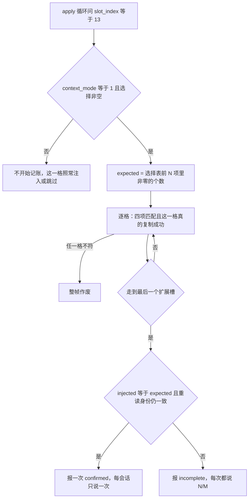
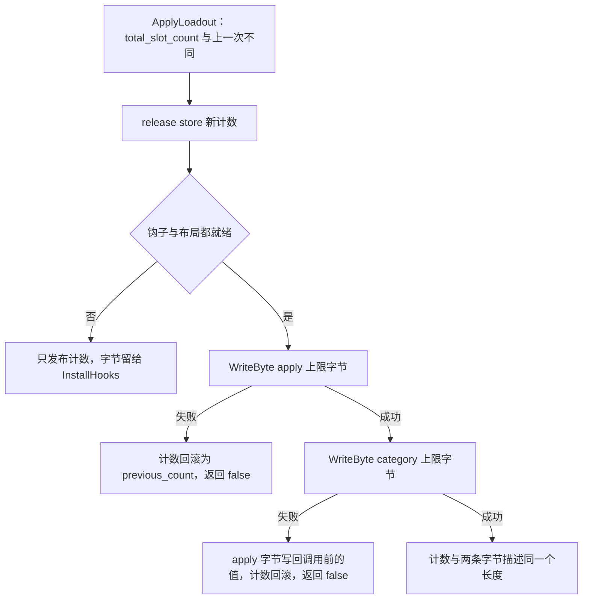
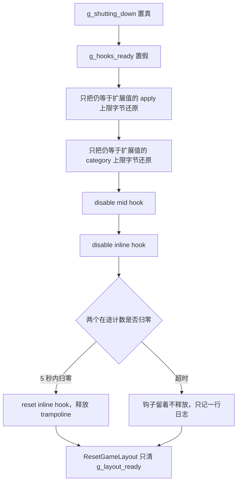

# 工作流：游戏侧注入运行期（detour 与循环上限）

[配装从界面到游戏状态](/openwiki/workflows/loadout-apply.md) 讲的是"谁把选择表换掉"；这一页讲的是**换掉之后游戏来问的时候会发生什么**。这条链上没有任何主动推送：注入全部发生在游戏的技能循环回调到我们的两个 detour 里的那一刻，所以它的输入是游戏给的参数（`status`、`slot_index`、输出缓冲区），输出只有两个值——填好的 0x24 字节 `GemData`，或者"这一格没有"。

前置条件已经由别处保证：布局（含两个 detour 的安装地址与两条循环上限字节的 RVA）由 [语义锚点与布局解析](/openwiki/concepts/game-layout-anchors.md) 解出并复验，钩子的装卸与在途计数由 [并发、锁序与生命周期守卫](/openwiki/concepts/threading-and-locks.md) 兜住。本页只讲这两个 detour 体本身、上限字节的加宽与还原、以及它们写进运行消息的那点结论。

## 两个入口

| detour | 安装点 | 入口函数 | 它拿到的参数 | 服务范围 |
| --- | --- | --- | --- | --- |
| inline（`create_inline`） | `g_game_layout.get_gem_data_by_index_rva`——两条技能循环**共用**的那个因子 getter | `GetGemDataByIndexDetour` | 形参 `(status, slot_index, output)` | 只处理 `slot_index >= 13` |
| mid（`create_mid`） | `g_game_layout.skill_fetch_path_rva` = category 锚点 `+0x1E`，即 category 循环体里那段取因子逻辑的第一条指令 | `OnSkillFetch` | 寄存器 `r15`（status）、`r13`（slot_index）、`r12`（output） | 只处理 `13 <= r13 < 13 + N` |

两者在同一段 `InstallHooks` 里装着，顺序固定：`required-byte-rva-preflight` → `gem-data-getter-hook` → `skill-fetch-hook` → `skill-loop-limit-patches`，四条失败路径都汇到同一个 lambda（回滚 + 写一行运行消息）。这个顺序不是排版：逐字节复验必须在 `create_inline` 改写 getter 函数序言之前跑。

## 判定 → 身份 → 选择 → 合成 → 写输出 → 计数

<!-- openwiki: mermaid parse failed and this diagram was converted to a text fence so it does not break rendering. Fix the diagram source and restore the mermaid fence. Parser error: Parse error on line 12: ...13 Detour->>Loop: 转发原始 getter 后原 Expecting '+', '-', '()', 'ACTOR', got 'loop' -->
```text
sequenceDiagram
    participant Loop as 游戏技能循环
    participant Detour as GetGemDataByIndexDetour
    participant Id as SafeReadStatusIdentity
    participant Sel as TLS 构建快照或选择表
    participant Tpl as TryCopyTemplateGem
    participant Out as 游戏的输出缓冲
    participant Cnt as 自然贡献计数
    Loop->>Detour: 问 slot_index 与输出指针
    Note over Detour: 先用 _ReturnAddress 分类调用来源
    alt slot_index 小于 13
        Detour->>Loop: 转发原始 getter 后原样返回
    else slot_index 超出扩展范围
        Detour->>Loop: 返回 0，不转发
    else 扩展槽
        Detour->>Id: 读 character_hash 与 context_mode
        Id-->>Detour: 关机中或身份非法则返回 0
        Note over Detour: 首个扩展槽触发 ObserveBuildStart 快照
        Detour->>Sel: 循环内读快照，循环外读当前 store
        Sel-->>Detour: selected_slot_id
        Detour->>Tpl: 按角色与虚拟索引合成 GemData
        Tpl->>Out: SafeCopyToOutput 写 0x24 字节
        Detour->>Cnt: from_apply_loop 时逐格记账
        Detour-->>Loop: 返回 1 或 0
    end
```

这条链上每一格的成败都由返回值 1/0 表达；回到游戏之后，那个值由返回地址处的 `test al, al` 分支消费。

## 调用来源的分类

getter 是被两条循环共用的，所以 detour 的第一件事是分辨"这次是谁在问"：

```cpp
const uintptr_t return_address = reinterpret_cast<uintptr_t>(_ReturnAddress());
call.from_apply_loop =
    return_address == g_image_base + g_game_layout.skill_apply_getter_return_rva;
call.from_category_loop =
    return_address == g_image_base + g_game_layout.skill_category_getter_return_rva;
```

两个 RVA 就是两条循环里"getter 调用之后的那条指令"（apply 锚点 `+0x29`、category 锚点 `+0x6E`），它们的字节分别是 `84 C0 74 …`（`test al, al` + 条件跳转）。分类结果存成两个 bool，"是不是来自技能数据循环"**不存字段**——它恒等于两者的析取，由 `GemCall::from_skill_data_loop()` 现算，存起来就允许出现自相矛盾的状态。

分类的用途有两处，都很具体：

- `from_skill_data_loop()` 决定"要不要观察构建开始"（两条循环都算）；
- `from_apply_loop` 决定"要不要记自然贡献"（只有 apply 循环记）。

## 早退：四种"不注入"的分支

| 条件 | 行为 | 依据 |
| --- | --- | --- |
| `slot_index < kNativeInternalSlotCount`（13） | `g_get_gem_hook.call<uint8_t>(status, slot_index, output)` 原样转发 | 本体槽位归游戏自己，我们只做旁路 |
| `slot_index >= GetExpandedInternalSlotCount()` | 直接 `return 0`，**不转发** | 原始 getter 只有 13 格，转过去它会读自己数组的边界之外 |
| `g_shutting_down` 为真 | `return 0` | 拆卸中不再碰游戏状态 |
| `SafeReadStatusIdentity` 失败 / `context_mode` 不在 `0..2` / `output == nullptr` | `return 0` | 身份读不到就没有可用于合成与角色限制判断的键 |

后三条被合并在同一个 `if` 里，语义是"一次性闸门"：任一不成立就当作这格没有因子。`OnSkillFetch` 用同一套判据，只是把 `output == nullptr` 换成 `context.r12 != 0`，并且没有 `< 13` 的那条转发分支——它本来就不该处理本体槽位。

这条边界纪律的代价与收益都是明确的：**转发只发生在 `slot_index < 13`**，所以游戏永远不会因为我们没接住而拿到越界数据；代价是超出范围的请求拿不到因子。

## mid detour：在 fetch 段起点接走扩展槽

`OnSkillFetch` 是一个 `safetyhook::Context` 钩子，它的出口是"假装原生 getter 刚刚返回"：

```cpp
context.rax = copied ? 1 : 0;
context.rip = g_image_base + g_game_layout.skill_category_getter_return_rva;
```

`context.rip` 指向的是 category 循环里那次 getter 调用**之后**的指令（`skill_category_getter_return_rva` = 锚点 `+0x6E`）。hook 点在锚点 `+0x1E`，两者之间就是游戏自己那段取因子逻辑——按 13 槽布局读的状态字段、`skill_fetch_call_path_rva`（锚点 `+0x60`）处开始的参数装配、以及那次 `call` 本身。所以这段被整段跳过，扩展槽的结果由我们直接写进 `r12` 指向的输出；跳过的只是"取"这一步，游戏在 `+0x6E` 之后仍会自己做无效标志检查、gem-master 查询、类别计数、上限与效果计算。

需要注意的是 mid hook 的作用域是**整段 fetch 路径**，不只是 getter 调用：对 `r13 < 13` 或 `r13 >= 13 + N` 的请求它不设 `rip`、不设 `rax`，直接返回让游戏按原路走（扩展范围之外的高索引随后会被 getter detour 拒掉，见上一节）。

## 从选择表到输出：合成的 GemData

选择表里存的是**模板 slot-id**（`0xFE000000 + v`）而不是 gem hash，所以读取分三步：

1. `TryLoadVirtualSkillSelection`：来自技能数据循环且 TLS 快照的 `status` 与 `character_hash` 都匹配时，用构建开始那份快照；否则现查 `GetSelection(character_hash)`。两条路都可能返回"没有选择"（快照路径要求 `g_tls_build_has_selection`，现查路径要求非零槽数量不为 0），此时这一格直接返回 0。
2. `TryCopySelectedVirtualGem`：`virtual_index = slot_index - 13` 必须落在 `[0, GetVirtualSlotCount())` 内；`selection[virtual_index] == 0` 表示这格不发东西；非模板 id 直接返回 `false`（这个 mod 没有以库存为后端的虚拟槽路径）。
3. `TryCopyTemplateGem`：按角色取模板槽（`gem_id == 0` 或角色不兼容都算没有），再把 `TemplateGemSlot` 铺成游戏那份 `GemData`——`slot_id` 填模板 id、`worn_by` 填未佩戴哨兵、`flags = 0`，最后经 `SafeCopyToOutput` 用 SEH 包住的 `memcpy` 写 0x24 字节。写失败（输出不可写）与"没有因子"对调用方的表现一致：返回 0。

字段与编号的完整对应在 [虚拟槽位、模板因子与专属开关](/openwiki/concepts/virtual-slots-and-exclusives.md)。

## 构建开始：第一个扩展槽的副作用

`ObserveBuildStart` 是全链**唯一**有副作用的地方，且只在"来自技能数据循环 + `slot_index == 13`"时触发：

```cpp
g_tls_build_selection = GetSelection(call.identity.character_hash);
g_tls_build_has_selection = CountSelectedSlots(g_tls_build_selection) != 0;
g_tls_build_status = build_status;
g_tls_build_character = call.identity.character_hash;
RememberGameBuild();
if (call.identity.context_mode == 1)
    RememberContext1Status(call.identity.character_hash, build_status);
```

四个 `thread_local` 字段快照的是"这一次构建用哪套槽位"，此后整个构建（`slot_index` 从 13 走到最后一格）都读这一份，所以构建进行中改配装不会让同一个角色拿到半新半旧的选择。匹配条件是 `status` **和** `character_hash` 两项：`status` 对象的地址会跨角色复用，只比地址会让某个角色用上别人那次构建的槽位。

后两个调用把游戏线程的事实喂给热重建这条路径：

- `RememberGameBuild()` 记下"游戏刚自己建过状态"，是热重建那条 250ms 静默窗口的唯一来源；
- `context_mode == 1`（在场那份 status）时 `RememberContext1Status(...)` 记下"这个角色现在这份 status 是哪个对象、属于哪一轮队伍装配"（`pass_id` 只在游戏自己的构建之间推进），这份记录同时就是"见过哪些出战角色"的名单。

## 自然贡献计数与运行消息

注入本身对三种 `context_mode` 都做，但**记账只对 `context_mode == 1` 且只对 apply 循环**：那一份 status 就是玩家实际在场用的那份，所以"因子真的进了角色状态"这件事只在它身上可验证。



`NaturalContributionFrame` 是 `thread_local` 的，逐格记账时比对 `status` + `character_hash` + `context_mode` + `next_slot` **四项**：任何一项不符就整帧作废，之后不再累计。`expected` 是"选择表前 `GetVirtualSlotCount()` 项里非零的个数"，`next_slot` 从 13 起、每记一格加一，所以槽位必须按序走完才可能对上。

结算只在 `slot_index == GetExpandedInternalSlotCount() - 1` 这一格发生，并且还要重读一次 status 的身份确认它没被换掉：

| 结果 | 条件 | 运行消息与频率 |
| --- | --- | --- |
| confirmed | `injected == expected`、`expected != 0`、重读身份一致 | `Skill contribution confirmed for 0x…: N/M virtual sigils reached the context-1 status.`——`g_live_confirmation_reported` 保证**每会话只报一次** |
| incomplete | 上面任一不成立且 `expected != 0` | `Skill contribution incomplete for 0x…: N/M virtual sigils reached the context-1 status.`——**每次都报** |

两句话都走 `SetRuntimeMessage`，所以同时进日志与 `GBFR20_CopyRuntimeMessage` 回读的运行消息。"每会话只说一次"只对成功那条成立：健康的配装每场战斗都会重复 9/9，而失败每次都要出声，因为这正是排查注入是否生效的唯一正向证据。注意这一对计数只在"走到最后一格"时结算——被提前打断的构建既不算成功也不算失败，它只是没有结论。

## 两条循环上限字节

两条技能循环的上限就是 `cmp index, 0x0D` 里的立即数 13（apply 循环用 `edi`、category 循环用 `r13`），加宽后的值是 `13 + GetVirtualSlotCount()`：

```cpp
bool ApplySkillLoopLimits(int32_t virtual_slot_count) noexcept {
    const uint8_t expanded_slot_count =
        static_cast<uint8_t>(kNativeInternalSlotCount + virtual_slot_count);
    uint8_t previous_apply_limit = g_game_layout.skill_apply_original_limit;
    (void)ReadByte(g_image_base + apply_limit_rva, previous_apply_limit);

    if (!WriteByte(g_image_base + apply_limit_rva, expanded_slot_count))
        return false;
    if (!WriteByte(g_image_base + category_limit_rva, expanded_slot_count)) {
        (void)WriteByte(g_image_base + apply_limit_rva, previous_apply_limit);
        return false;
    }
    return true;
}
```

这两个字节的写入是整个原生核心里 `WriteByte` 的**唯一**用途（`VirtualProtect` 成可写 → 写 → `FlushInstructionCache` → 恢复保护 → 读回确认）。`ApplySkillLoopLimits` 只有两处调用：装钩子的 `skill-loop-limit-patches` 子阶段用已经发布的 `GetVirtualSlotCount()`；配装改动时只有计数真的变了才重写。

### 为什么计数先发布



顺序的理由写在这段代码的注释里：**detour 是按这个计数给虚拟槽设闸的**，所以计数必须已经与游戏线程下一轮循环将会看到的补丁一致。把顺序摆正之后，两个方向都是安全的：

- 加宽：先发计数再改字节。字节还没改的瞬间，两条循环仍停在 13，不会有 `slot >= 13` 的请求；字节一改，请求立刻到达，而闸门已经允许它们。
- 收窄：先发计数（变小），此时若有残留请求落在新范围之外，`GetExpandedInternalSlotCount()` 与 `TryGetRuntimeSlot` 的 `g_virtual_slot_count` 闸会返回"没有"而不是服务一张马上要被擦掉的表。

反过来的顺序（先把字节改大、再发计数）会留下一个窗口：循环已经被允许走到 `13+N`，而 detour 的闸还停在旧值上，于是落在中间的这些槽位静默地拿不到因子。

### 为什么第二个字节失败时回滚到"上一次的值"

`previous_apply_limit` 是从内存里**读回来**的那个字节本次调用前的值（读不到才退回 `skill_apply_original_limit`），不是游戏出厂值。理由是调用方在失败时同时把 `g_virtual_slot_count` 恢复成 `previous_count`：如果这里写回 13，就会留下"计数说还有 N 个虚拟槽、apply 字节说 13、category 字节还是上一次的展开值"这种三者互相矛盾的状态，其中一条循环会越过 13 格数组。写回上一次的值则让计数与两条字节重新描述同一个长度，这次应用干净地失败。

写第一个字节就失败时不存在这个问题：那个字节根本没被改动，`ApplySkillLoopLimits` 直接返回 false，剩下的只有计数回滚。

## 拆卸：反向回滚

拆卸顺序与安装顺序**相反**，而且每一步都有"换个顺序就崩"的理由：



- **先还原上限字节，再拆钩子。** 两个 detour 活着时 `slot >= 13` 的请求仍被它们挡住；先拆钩子会留下一段窗口，让原始那个只有 13 格的 getter 被问到 `slot 13+N`。
- **只还原"还是我们那个扩展值"的字节。** 还原前先 `ReadByte` 比对 `GetExpandedInternalSlotCount()`；已经还原过（或从未打过补丁）的字节不能碰。
- **disable 顺序是 mid 在前、inline 在后**，与安装相反；`disable()` 会由 safetyhook 还原目标字节。
- **排空在途调用后才 `reset()`。** 两个 detour 体的第一条语句都是 `ActiveCallGuard`，计数覆盖整段 detour 体（包括转发给原生 getter 的那条路）；最多等 5 秒，超时就宁可把（已 disable、字节已还原的）钩子留着，也不释放活调用可能仍在执行的内存。
- **刻意不 `reset()` mid hook。** `ActiveCallGuard` 只包住 detour 的函数体，而 safetyhook 的 stub 在它返回之后还要跑收尾指令——计数器先归零，`reset()` 就会 `VirtualFree` 掉线程仍在执行的那几页。`disable()` 已经还原了目标字节，留几页到进程退出是安全的。

`g_shutting_down` 在 `ShutdownHooks` 的第一行就置真，所以每个还在跑的 detour 立刻退化成"这格没有"（getter detour 返回 0、mid hook 把 `rax` 置 0 并跳到循环出口），排空因此能在 5 秒内完成。

## 热重建在什么时候被跳过（本页视角）

`ObserveBuildStart` 是这条链喂给热重建的全部信息，所以从运行期看，"什么时候会跳过重建"就是两张表：

| 跳过条件 | 谁在喂这个条件 | 日志行 |
| --- | --- | --- |
| 游戏最近 250ms 内自己建过状态 | detour 里的 `RememberGameBuild()`（每次构建开始都刷新） | `hot rebuild: skipped (game is building)` |
| 这一次没能认领 500ms 节流窗口 | 无（纯时间戳/CAS） | 刻意静默 |
| 上一次重建失败后的 60 秒冷却 | `SafeInvokeStatusRebuild` 失败时的调用方 | `hot rebuild: skipped (cooling down after a failed rebuild)` |
| 队伍名单还是空的 | `RememberContext1Status` 从未记过任何角色 | `hot rebuild: no party known yet; skipped` |
| 最近 2 秒内新增过队伍成员 | `RememberContext1Status` 的 `party+` 分支 | `hot rebuild: skipped (party changed just now)` |
| 某角色的记录轮次不是当前轮 | `RememberContext1Status` 的 `pass_id` 记账（`g_tls_hot_rebuild_build` 让**我们自己**的重建调用不切轮） | `hot rebuild: char=0x… skipped (left the party: assembly …)` |

跳过只是"这次不实时"：改动仍会在游戏下一次自然构建时落地。完整的轮次记账与竞态说明在 [并发、锁序与生命周期守卫](/openwiki/concepts/threading-and-locks.md)。

## 不变量与改这份代码的边界

- **别把 TLS 构建快照改回"以 `status` 指针为键的授权表"。** 残留授权命中被复用的地址会注入旧槽位；快照的匹配条件里 `character_hash` 这一项就是为地址复用而存在的，不能省。
- **高索引的请求一律不转发。** 唯一允许转发到原始 getter 的是 `slot_index < 13`；一旦对 `slot_index >= 13` 转发，就会读到本体 13 格数组之外。
- **记账的匹配条件不许缩水。** `NaturalContributionFrame` 的四项任何一项不比，都会把别的构建的结果算进这一份，那条 confirmed 就变成一句不成立的断言。
- **上限字节只能经 `ApplySkillLoopLimits` 改，且保持"计数先 store、字节后写、失败都回退"的顺序。** 两处调用点（装钩子、配装应用）共用这一个事务。
- **不要给 mid hook 加 `reset()`**，也不要在 detour 体之外延长 `ActiveCallGuard` 的生命周期。
- **注入与记账的覆盖面不同，别混。** 注入对 `context_mode` 0/1/2 都做，记账只在 `context_mode == 1` 且只在 apply 循环。

## 覆盖与验证现状

`tests/NativeLayoutHarness` 只离线编译生产的 `layout_resolver.cpp` 与 `safe_game_access.cpp`（stub 掉 `g_image_base` / `g_layout_ready` / `g_hooks_ready` / `g_game_layout` / `Log` / `SetRuntimeMessage`），它**不编译** `skill_hooks.cpp`、`selection_store.cpp`、`template_loadout.cpp`——也就是说这两个 detour、上限字节的加宽/回滚、构建快照与计数逻辑**没有任何自动化覆盖**。

harness 与本页唯一的重叠是那个 hook 点：它把 `g_game_layout.skill_fetch_path_rva` 处的字节翻一位，然后要求 `RevalidateGameLayout()` 失败。这证明的是"这个 mid hook 的落点确实由预检字节作证、被改坏就会被拒装"，而不是 detour 的实际行为。detour 落点、扩展槽是否真的进了角色状态、那两条运行消息，都只能在真机游戏里验证（见 [验证地图](/openwiki/testing/verification-map.md)）。
